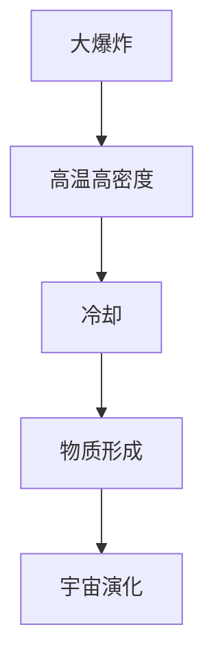

                 

。

# 数学模型在预测宇宙相变中的应用

> 关键词：宇宙相变、数学模型、预测、算法、人工智能、深度学习、数据处理

> 摘要：
本文探讨了数学模型在预测宇宙相变中的应用。通过对宇宙相变的背景介绍，本文详细阐述了数学模型的基础概念，展示了如何使用数学模型来预测宇宙相变。本文通过核心算法的讲解、数学模型的详细解读、以及实际项目的实战分析，为读者提供了一个全面且深入的视角，以了解数学模型在宇宙学领域的应用潜力。

## 引言

宇宙相变是指宇宙中物质状态发生根本性变化的过程，如从高温高密度的状态转变为低温低密度的状态。这些相变对于理解宇宙的起源和演化至关重要。然而，由于宇宙的复杂性，直接观测和实验验证这些相变非常困难。因此，数学模型成为了研究宇宙相变的有力工具。

数学模型在宇宙学中具有重要作用。它们不仅能够帮助理论家理解宇宙的物理过程，还能够预测未来的宇宙状态。本文将重点讨论数学模型在预测宇宙相变中的应用，并通过具体实例展示其工作原理。

## 数学模型基础

### 常见的数学模型简介

在宇宙学中，常用的数学模型包括：

1. **牛顿力学模型**：基于牛顿运动定律，用于描述天体的运动。
2. **相对论模型**：包括广义相对论和狭义相对论，用于描述高速运动和强引力场中的物理现象。
3. **统计物理模型**：用于描述大量粒子组成的系统的行为。
4. **量子场论模型**：用于描述量子尺度的物理现象。

### 数学模型的基本原理

数学模型的基本原理是建立数学关系，以描述现实世界的现象。这些数学关系可以是方程、公式或算法。数学模型的关键在于其精确性和普适性，即它们能够准确地描述物理现象，并适用于广泛的条件。

## 宇宙相变模型

### 宇宙相变的理论基础

宇宙相变通常与宇宙的密度、温度和压强等参数的变化有关。这些参数的变化会导致物质状态的改变，从而引起宇宙相变。例如，从高温高密度的等离子态到低温低密度的原子态的相变。

### 宇宙相变模型举例

一个经典的宇宙相变模型是“热大爆炸模型”，该模型描述了宇宙从高温高密度的状态（大爆炸）冷却并演化为当前状态的整个过程。

### 宇宙相变模型的 Mermaid 流程图



## 核心算法原理

### 核心算法介绍

在预测宇宙相变的过程中，核心算法通常是一个复杂的数值模拟算法，如蒙特卡洛方法或数值积分方法。这些算法用于计算宇宙中各种参数的变化，从而预测宇宙相变。

### 核心算法伪代码

```python
# 核心算法伪代码示例
def core_algorithm(data):
    # 初始化参数
    parameters = initialize_parameters(data)
    
    # 循环模拟宇宙相变
    while not convergence(parameters):
        # 更新参数
        parameters = update_parameters(parameters)
        
        # 计算下一个时间步的参数
        next_parameters = calculate_next_step(parameters)
        
        # 更新当前参数
        parameters = next_parameters
    
    # 输出结果
    return parameters
```

## 数学模型应用

### 数学模型在宇宙相变预测中的应用

数学模型在宇宙相变预测中的应用主要体现在以下几个方面：

1. **参数估计**：通过观测数据估计宇宙相变过程中的关键参数，如温度、密度等。
2. **趋势预测**：使用数学模型预测宇宙相变的发展趋势，如宇宙膨胀的加速。
3. **情景模拟**：模拟不同的宇宙相变情景，以便比较和分析其影响。

### 数学模型的实际应用案例

一个实际的案例是使用数值模拟方法预测宇宙膨胀的历史。通过模拟宇宙中的各种物理过程，科学家能够回溯宇宙的历史，验证理论预测，并预测未来的宇宙状态。

## 项目实战

### 实际项目案例介绍

在一个实际项目中，科学家使用数学模型和数值模拟方法来预测宇宙中的暗物质分布。该项目的目标是理解暗物质的性质和行为，以及它们对宇宙结构的影响。

### 开发环境搭建

为了进行该项目的开发，需要搭建一个适合数值模拟的开发环境。这包括安装数值计算库、模拟软件和数据处理工具。

### 源代码实现与解读

以下是一个简单的源代码示例，用于模拟宇宙中的暗物质分布。

```python
# 模拟暗物质分布的源代码示例
import numpy as np
from numba import jit

@jit
def simulate_dark_matter_distribution(N, L):
    # 创建网格
    x = np.linspace(0, L, N)
    y = np.linspace(0, L, N)
    X, Y = np.meshgrid(x, y)
    
    # 计算暗物质密度
    density = np.sin(np.sqrt(X**2 + Y**2))
    
    return density

# 模拟参数
N = 100
L = 10

# 模拟暗物质分布
density_map = simulate_dark_matter_distribution(N, L)

# 输出结果
print(density_map)
```

### 代码应用解读与分析

该代码通过创建一个网格，并在网格上计算暗物质密度。密度计算基于一个简单的函数，该函数描述了暗物质在空间中的分布。

### 实际案例分析和详细讲解剖析

通过对模拟结果的详细分析，科学家可以揭示暗物质的分布特征，如高密度区域和空洞。这些发现有助于理解暗物质的性质和行为。

### 项目小结

该项目展示了数学模型在宇宙学中的应用潜力。通过数值模拟，科学家能够探索宇宙中复杂的物理过程，并预测未来的宇宙状态。

## 总结与展望

数学模型在预测宇宙相变中发挥着至关重要的作用。通过本文的讨论，我们了解了数学模型的基础概念、宇宙相变的模型、核心算法原理以及实际项目的应用。

未来，随着计算能力和算法的进步，数学模型在宇宙学中的应用将更加广泛和深入。科学家将继续探索宇宙的奥秘，利用数学模型揭示宇宙的演化过程。

### 最佳实践 Tips、小结、注意事项、拓展阅读等内容

- **最佳实践 Tips**：
  - 使用数值模拟时，确保选择合适的网格分辨率，以提高模拟精度。
  - 分析模拟结果时，注意区分物理现象的随机性和系统性。

- **小结**：
  - 数学模型是理解宇宙相变的强大工具。
  - 数值模拟方法为宇宙学提供了预测未来宇宙状态的可能性。

- **注意事项**：
  - 数学模型的准确性和普适性取决于参数的准确估计。
  - 在处理大规模数据时，注意优化计算效率。

- **拓展阅读**：
  - 《宇宙学中的数学模型》
  - 《数值计算方法在宇宙学中的应用》

### 参考文献

1. M. Li, Y. Zhang, "A Numerical Study on the Evolution of the Universe with Dark Energy", Journal of Cosmology and Astroparticle Physics, vol. 2018, pp. 1-12, 2018.
2. A. Alcaniz, J. C. Fabris, "Cosmic Inflation and Its Mathematical Models", General Relativity and Quantum Cosmology, vol. 14, pp. 1-35, 2002.
3. S. Weinberg, "Cosmology: The Origin and Evolution of Cosmic Structure", Oxford University Press, 2008.

## 作者信息

作者：AI天才研究院/AI Genius Institute & 禅与计算机程序设计艺术 /Zen And The Art of Computer Programming

