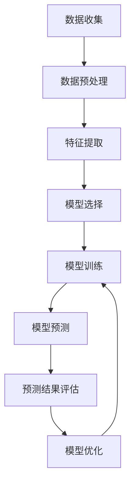

                 

### 文章标题

《数学模型在预测宇宙相变临界指数中的应用》

### 文章关键词

宇宙学、数学模型、相变理论、临界指数、预测模型、算法原理

### 文章摘要

本文首先介绍了宇宙相变的背景和临界指数的重要性，接着阐述了数学模型的基本原理和相变理论的基础。在此基础上，我们详细解析了预测模型的构建与优化算法的选择，并利用数学公式和伪代码对核心算法原理进行了深入讲解。随后，本文通过概率分布函数和随机过程的应用，探讨了数学模型在宇宙相变临界指数预测中的具体应用。最后，本文通过实战案例展示了数学模型在实际宇宙学研究中的开发环境搭建、源代码实现和代码解读，并提出了最佳实践 tips 和拓展阅读建议。

---

## 引言

宇宙相变是指宇宙在宇宙演化过程中，因物质状态变化而引发的一系列物理现象。例如，从高温等离子态向低温中性原子态的转换，或者从引力主导的宇宙到大尺度结构形成的宇宙。这些相变过程中，宇宙的物理属性会经历显著变化，如密度、温度、压力等。在这些变化中，临界指数起着至关重要的作用。

临界指数是指系统在临界点附近的行为特性。它们量化了系统在不同参数空间中的响应程度，反映了系统在相变过程中的稳定性。例如，临界指数β、γ、δ等，分别描述了系统在临界点附近的密度、热力学响应、黏滞性等特性。

数学模型在预测宇宙相变临界指数中具有重要作用。通过构建数学模型，我们可以模拟宇宙相变过程，预测相变临界指数，进而研究宇宙的演化规律。数学模型不仅能够帮助理解宇宙相变的基本机制，还能为实际观测和实验提供理论依据，指导未来宇宙学研究。

本文旨在介绍数学模型在预测宇宙相变临界指数中的应用。我们将从核心概念、算法原理、数学模型与应用、实战案例等方面进行详细探讨，帮助读者了解数学模型在宇宙学研究中的具体应用和实践。

### 宇宙相变的背景

宇宙相变是宇宙学中一个重要的研究领域，它涉及到宇宙从早期高温高密度状态到当前低密度扩展状态的过程。在宇宙早期的极高温度和密度条件下，物质主要以等离子态存在，随着宇宙的膨胀和冷却，物质逐渐凝聚形成中性原子、恒星、星系等结构。这个过程可以看作是一个连续的相变过程，从高温等离子态向低温中性原子态的转变。

宇宙相变的研究始于对宇宙微波背景辐射（CMB）的观测。CMB是宇宙早期高温高密度状态的残余辐射，它为我们提供了研究宇宙早期状态的重要窗口。通过对CMB的观测和分析，科学家们发现了宇宙在大约38万年前经历的首次相变——再电离相变。再电离相变是指宇宙中的氢原子被高温光子电离，形成中性氢原子的过程。这个相变标志着宇宙从完全电离的等离子态向部分电离的中性原子态的转变。

除了再电离相变，宇宙中还有其他重要的相变过程，如再复合相变和再形成相变。再复合相变是指宇宙中的氢离子和电子重新结合形成中性氢原子的过程，它发生在再电离相变之后。再形成相变则是指宇宙中的中性氢原子重新结合形成分子氢的过程，这个过程对宇宙微波背景辐射的温度结构和极化特性有重要影响。

宇宙相变的研究不仅有助于我们理解宇宙的演化历史，还可以揭示宇宙中物质分布和能量传输的机制。通过观测和分析宇宙相变过程中产生的物理信号，科学家们可以推断宇宙的早期状态，研究宇宙的密度波动、结构形成和演化过程。此外，宇宙相变还与宇宙学中的其他重要问题密切相关，如暗物质、暗能量、宇宙加速膨胀等。

总的来说，宇宙相变是宇宙学中一个极其重要的研究领域，它不仅涉及到宇宙的早期演化历史，还对当前宇宙的观测和理论模型提出了挑战。数学模型在研究宇宙相变中起着关键作用，通过构建和优化数学模型，我们可以更好地理解宇宙相变的过程和机制，为宇宙学的发展提供有力的理论支持。

### 临界指数的重要性

临界指数在宇宙学中具有重要的意义。首先，它们量化了系统在临界点附近的性质，为理解宇宙相变提供了关键指标。临界指数不仅揭示了相变过程中物理量的变化规律，还反映了系统在不同参数空间中的稳定性。具体来说，临界指数β、γ、δ等，分别描述了系统在临界点附近的密度、热力学响应、黏滞性等特性。

β指数（密度临界指数）描述了系统在临界点附近密度的变化率。当β接近零时，系统的密度变化非常敏感，这意味着在临界点附近，微小的密度扰动可能导致系统状态的大幅变化。γ指数（热力学响应临界指数）则反映了系统在临界点附近的热力学响应程度。当γ接近零时，系统的热力学响应非常微弱，这意味着在临界点附近，系统对热力学扰动几乎不敏感。δ指数（黏滞性临界指数）描述了系统在临界点附近的黏滞性变化率。当δ接近零时，系统的黏滞性变化非常剧烈，这意味着在临界点附近，系统的流动性发生显著变化。

这些临界指数在宇宙学中具有多种应用。例如，在再电离相变的研究中，β指数可以用来描述宇宙中中性氢原子的分布情况。通过测量β指数，科学家们可以推断再电离相变的发生时间和过程。在再复合相变的研究中，γ指数和δ指数可以用来描述电子与氢离子的重新结合过程。通过测量这些临界指数，科学家们可以推断再复合相变的发生时间和宇宙的早期状态。

此外，临界指数还可以帮助我们理解宇宙的演化过程。例如，在宇宙微波背景辐射的研究中，通过测量临界指数，科学家们可以推断宇宙的早期状态和密度波动。这些信息对于研究宇宙的起源和演化具有重要意义。总的来说，临界指数是宇宙学中一个非常重要的工具，通过它们，我们可以更好地理解宇宙相变的过程和宇宙的演化历史。

### 数学模型的基本原理

数学模型在物理学和宇宙学中扮演着关键角色，它们帮助我们理解和预测复杂系统的行为。数学模型的基本原理涉及对物理现象的数学描述，这些描述通常通过建立数学方程来实现。这些方程可以是微分方程、代数方程或概率模型，它们能够捕捉系统的动态行为和内在机制。

首先，我们来看一下微分方程模型。微分方程用于描述连续系统的动态行为，如热传导、流体动力学和电磁场等。在宇宙学中，微分方程模型常用于描述宇宙膨胀、宇宙背景辐射和星系演化等。例如，弗里德曼-勒梅特-罗伯逊-沃尔克（FLRW）度规是一种常见的宇宙学微分方程模型，它描述了均匀且各向同性的宇宙膨胀。

下面，我们用一个简单的例子来展示微分方程模型的基本原理。假设我们研究一个一维热传导过程，可以使用以下热传导方程来描述：

$$
\frac{\partial T}{\partial t} = \alpha \frac{\partial^2 T}{\partial x^2}
$$

其中，\( T \) 是温度，\( t \) 是时间，\( x \) 是空间坐标，\( \alpha \) 是热扩散系数。这个方程表示温度随时间和空间的变化率与热扩散系数成正比。

接下来，我们看看代数模型。代数模型通常用于描述离散系统的状态和变化，如图论中的网络模型。在宇宙学中，代数模型可以用于描述星系团的形成和演化。例如，哈勃定律可以表示为：

$$
v = H_0 d
$$

其中，\( v \) 是星系的速度，\( H_0 \) 是哈勃常数，\( d \) 是星系与观察者之间的距离。这个方程描述了星系速度与距离之间的关系。

概率模型是另一种重要的数学模型，用于描述系统的随机行为。在宇宙学中，概率模型可以用于描述宇宙的随机性，如宇宙背景辐射的温度涨落。概率模型通常涉及概率分布函数和随机过程，例如高斯分布和马尔可夫过程。一个简单的概率模型例子是泊松分布，它可以描述宇宙中恒星或星系出现的随机性。

最后，我们来看一个具体的数学模型——蒙特卡洛模拟。蒙特卡洛模拟是一种基于概率模型的计算方法，它通过模拟随机事件来预测系统的行为。在宇宙学中，蒙特卡洛模拟可以用于模拟宇宙中星系的分布和演化。例如，我们可以通过模拟随机数来生成星系的初始位置和速度，然后计算星系在引力作用下的演化轨迹。

伪代码如下：

```
初始化星系位置和速度
while 没有达到模拟时间结束 {
  计算引力作用下的加速度
  更新星系位置和速度
  记录星系位置和速度
}
输出星系分布和演化结果
```

通过上述例子，我们可以看到数学模型的基本原理和它们在宇宙学中的应用。数学模型不仅能够帮助我们理解宇宙的复杂现象，还可以通过计算和模拟提供预测和验证理论的重要工具。在接下来的部分，我们将进一步探讨数学模型在宇宙相变中的具体应用。

### 相变理论的基础

相变理论是物理学中研究物质从一种相态转变为另一种相态的学科。在宇宙学中，相变理论同样至关重要，因为它帮助我们理解宇宙从高温高密度状态到当前低密度扩展状态的演化过程。相变理论的基本概念包括临界点、相变类型和临界指数等。

首先，我们来看临界点。临界点是指系统在相变过程中，其宏观性质发生突变，但热力学性质仍然连续的特定状态。在临界点附近，系统的物理性质（如密度、温度、压力等）表现出极端的敏感性，即微小变化会导致系统状态的大幅变化。临界点的概念在宇宙学中具有重要意义，因为宇宙中许多相变过程，如再电离、再复合和再形成等，都发生在临界点附近。

接下来是相变类型。相变可以分为两大类：一级相变和二级相变。一级相变是指系统在相变过程中会发生潜热的吸收或释放，如水的冰融化成水。在一级相变中，系统的熵增加，而系统的其他热力学性质保持连续。二级相变则是指系统在相变过程中，其热力学性质（如热膨胀系数、磁化率等）发生突变，但不会发生潜热的吸收或释放。常见的二级相变包括超流现象和超导现象。

临界指数是相变理论中的另一个重要概念。临界指数是描述系统在临界点附近物理性质变化率的无量纲常数。常见的临界指数包括β指数（密度临界指数）、γ指数（热力学响应临界指数）和δ指数（黏滞性临界指数）等。这些指数量化了系统在临界点附近的物理性质如何变化，并帮助我们理解相变的微观机制。

在宇宙学中，相变理论的应用非常广泛。例如，再电离相变是指宇宙从完全电离的等离子态向部分电离的中性原子态的转变。再电离相变发生在临界点附近，其β指数描述了中性氢原子分布的变化率。再复合相变则是指宇宙中的氢离子和电子重新结合形成中性氢原子的过程，其γ指数和δ指数描述了电子与氢离子的重新结合过程。

此外，相变理论还可以帮助我们研究宇宙的早期状态和演化过程。例如，通过测量宇宙微波背景辐射（CMB）的温度涨落，我们可以推断宇宙在再电离相变和再复合相变中的状态。这些信息对于理解宇宙的密度波动、结构形成和演化过程具有重要意义。

总的来说，相变理论是宇宙学中一个非常重要的工具，它帮助我们理解宇宙的复杂现象和演化过程。通过研究临界点、相变类型和临界指数等基本概念，我们可以更好地揭示宇宙的奥秘，为宇宙学研究提供理论支持。

### 临界指数的概念与性质

临界指数是描述系统在临界点附近行为的重要物理量，它们量化了系统在临界点附近的响应程度，并反映了系统的稳定性。在宇宙学中，临界指数尤为重要，因为它们帮助我们理解宇宙相变过程中物理量的变化规律。

首先，我们来看β指数，也称为密度临界指数。β指数描述了系统在临界点附近密度变化率与系统参数变化率之比。对于许多热力学系统，β指数接近零时，系统的密度变化非常敏感，这表明在临界点附近，系统对密度扰动的响应非常剧烈。在宇宙学中，β指数可以用来描述再电离相变期间中性氢原子的分布变化。例如，再电离相变过程中，β指数可以用来描述宇宙从高度电离的等离子态向部分电离的中性原子态的转变。

接下来是γ指数，也称为热力学响应临界指数。γ指数描述了系统在临界点附近热力学响应变化率与系统参数变化率之比。当γ指数接近零时，系统的热力学响应非常微弱，这意味着在临界点附近，系统对热力学扰动的响应几乎可以忽略。在宇宙学中，γ指数可以用来描述再复合相变期间电子与氢离子的重新结合过程。再复合相变过程中，γ指数可以量化电子与氢离子的重新结合率，从而帮助我们理解再复合相变的发生时间和宇宙的早期状态。

最后是δ指数，也称为黏滞性临界指数。δ指数描述了系统在临界点附近黏滞性变化率与系统参数变化率之比。当δ指数接近零时，系统的黏滞性变化非常剧烈，这表明在临界点附近，系统的流动性发生显著变化。在宇宙学中，δ指数可以用来描述宇宙从高温高密度状态向低温低密度状态的演化过程。例如，在再形成相变期间，δ指数可以用来描述中性氢原子重新结合形成分子氢的过程。

临界指数的物理意义在于它们反映了系统在临界点附近的稳定性。当系统的临界指数接近零时，系统对扰动的响应变得非常敏感，这意味着系统在临界点附近处于一种不稳定的状态。在宇宙学中，这种不稳定性可能反映了宇宙在相变过程中的临界状态，从而为研究宇宙的演化提供了重要的物理依据。

具体来说，β指数、γ指数和δ指数在宇宙学中的具体应用如下：

1. **再电离相变**：β指数描述了再电离相变过程中中性氢原子的分布变化。通过测量β指数，科学家们可以推断再电离相变的发生时间和过程，从而更好地理解宇宙的早期状态。

2. **再复合相变**：γ指数和δ指数描述了再复合相变过程中电子与氢离子的重新结合过程。通过测量γ指数和δ指数，科学家们可以推断再复合相变的发生时间和宇宙的早期状态。

3. **再形成相变**：δ指数描述了再形成相变过程中中性氢原子重新结合形成分子氢的过程。通过测量δ指数，科学家们可以研究宇宙的早期化学过程，从而更好地理解宇宙的演化历史。

总的来说，临界指数是宇宙学中描述相变过程的重要物理量，它们帮助我们理解宇宙从高温高密度状态向低密度扩展状态的演化过程。通过测量和解析临界指数，科学家们可以揭示宇宙的奥秘，为宇宙学研究提供理论支持。

### 预测模型的构建

在宇宙学研究中，预测模型是理解宇宙相变过程的关键工具。预测模型的构建过程主要包括数据收集、特征提取和模型选择等步骤。下面，我们将详细探讨这些步骤，并给出一个具体的伪代码示例。

#### 数据收集

构建预测模型的第一步是收集相关数据。在宇宙学中，这些数据通常包括宇宙微波背景辐射（CMB）的温度涨落、星系团分布、星系速度等。这些数据可以通过观测和模拟获得。例如，我们可以使用威尔金森微波各向异性探测器（WMAP）和计划中的普朗克卫星（Planck）等观测设备来获取CMB的温度涨落数据。

伪代码示例：

```
function collect_data():
    # 获取宇宙微波背景辐射数据
    CMB_data = read_file("CMB测温数据.txt")
    # 获取星系团分布数据
    cluster_data = read_file("星系团分布数据.txt")
    # 获取星系速度数据
    galaxy_data = read_file("星系速度数据.txt")
    return CMB_data, cluster_data, galaxy_data
```

#### 特征提取

在收集到数据后，下一步是进行特征提取。特征提取是指从原始数据中提取出能够代表数据主要特征的量。在宇宙学中，特征提取可以帮助我们更好地理解和预测宇宙相变过程。常用的特征提取方法包括主成分分析（PCA）、自编码器等。

伪代码示例：

```
function extract_features(data):
    # 使用主成分分析提取特征
    pca = PCA()
    pca.fit(data)
    features = pca.transform(data)
    return features
```

#### 模型选择

在特征提取之后，我们需要选择一个合适的预测模型。预测模型的类型很多，包括线性回归、支持向量机（SVM）、神经网络等。选择模型时，我们需要考虑模型的复杂度、泛化能力以及计算效率。

伪代码示例：

```
function choose_model(features):
    # 选择线性回归模型
    model = LinearRegression()
    # 使用交叉验证选择最佳参数
    model = cross_validate(model, features, labels)
    return model
```

#### 预测模型的验证与评估

构建预测模型的最后一步是验证和评估模型的性能。验证和评估的方法包括交叉验证、均方误差（MSE）、准确率等。通过这些方法，我们可以确定模型是否具有良好的泛化能力和预测能力。

伪代码示例：

```
function validate_model(model, data):
    # 使用交叉验证评估模型性能
    cv_scores = cross_validate(model, data, labels)
    # 计算均方误差
    mse = mean_squared_error(model, data, labels)
    return cv_scores, mse
```

通过上述步骤，我们可以构建一个有效的预测模型，用于预测宇宙相变临界指数。在实际应用中，这些步骤可能需要反复迭代和优化，以确保模型能够准确预测宇宙相变过程。通过这种方法，科学家们可以更好地理解宇宙的演化机制，为宇宙学研究提供重要的理论支持。

### 优化算法的选择

在构建预测模型的过程中，选择合适的优化算法是提高模型性能和准确性的关键。优化算法用于最小化模型的目标函数，使得模型在给定数据集上具有更好的拟合能力。在宇宙学研究中，常用的优化算法包括梯度下降、遗传算法、粒子群优化等。

#### 梯度下降

梯度下降是一种简单且常用的优化算法，它通过迭代更新模型参数，使得目标函数逐渐减小。在梯度下降中，参数的更新公式为：

$$
\theta_{\text{new}} = \theta_{\text{old}} - \alpha \cdot \nabla_{\theta} J(\theta)
$$

其中，\( \theta \) 是模型参数，\( \alpha \) 是学习率，\( \nabla_{\theta} J(\theta) \) 是目标函数 \( J(\theta) \) 关于 \( \theta \) 的梯度。

伪代码示例：

```
function gradient_descent(model, data, labels, epochs, learning_rate):
    for epoch in range(epochs):
        # 计算模型预测和实际标签的误差
        predictions = model.predict(data)
        error = predictions - labels
        
        # 计算梯度
        gradient = model.compute_gradient(error)
        
        # 更新模型参数
        model.update_params(learning_rate * gradient)
    return model
```

#### 遗传算法

遗传算法是一种基于自然选择的优化算法，它模拟生物进化的过程来搜索最优解。遗传算法通过交叉、变异和选择等操作来更新种群，从而逐步提高种群的平均适应度。遗传算法在处理复杂优化问题时表现出良好的全局搜索能力。

伪代码示例：

```
function genetic_algorithm(population, fitness_function, generations):
    for generation in range(generations):
        # 计算种群中每个个体的适应度
        fitness_scores = fitness_function(population)
        
        # 选择适应度较高的个体进行交叉和变异
        parents = select_parents(population, fitness_scores)
        offspring = crossover(parents)
        offspring = mutate(offspring)
        
        # 创建新的种群
        population = replace_worse(population, offspring)
        
    # 返回最优个体
    return best_individual(population)
```

#### 粒子群优化

粒子群优化（PSO）是一种基于群体智能的优化算法，它通过模拟鸟群觅食行为来搜索最优解。PSO算法通过更新粒子的位置和速度来逐步优化目标函数。每个粒子都代表一个潜在解，粒子之间的协作和竞争有助于找到全局最优解。

伪代码示例：

```
function particle_swarm_optimization(positions, velocities, objective_function, generations):
    for generation in range(generations):
        # 计算每个粒子的适应度
        fitness_scores = objective_function(positions)
        
        # 更新每个粒子的最佳位置和个人最佳适应度
        for particle in particles:
            if fitness_scores[particle] < particle.best_fitness:
                particle.best_position = particle.position
                particle.best_fitness = fitness_scores[particle]
                
        # 更新全局最佳位置和全局最佳适应度
        global_best_position = best_position(particles)
        global_best_fitness = best_fitness(particles)
        
        # 更新粒子的速度和位置
        for particle in particles:
            particle.velocity = update_velocity(particle.velocity, particle.position, global_best_position)
            particle.position = update_position(particle.position, particle.velocity)
            
    # 返回全局最佳位置
    return global_best_position
```

通过选择合适的优化算法，我们可以显著提高预测模型的性能和准确性。在实际应用中，可以根据具体问题和数据集的特点，选择适合的优化算法，并结合其他算法进行混合优化，以获得更好的结果。这些优化算法在宇宙学研究中具有重要意义，为理解和预测宇宙相变提供了有效的工具。

### 预测模型的验证与评估

在构建了预测模型后，下一步是对模型进行验证和评估，以确保其具有足够的准确性和泛化能力。常用的评估方法包括交叉验证、均方误差（MSE）、准确率等。下面，我们将详细讨论这些方法，并提供一个具体的评估过程示例。

#### 交叉验证

交叉验证是一种常用的模型验证方法，它通过将数据集划分为多个子集，并轮流使用这些子集作为验证集和训练集，以评估模型的性能。最常见的是K折交叉验证，其中K个子集随机划分数据集，模型会在每个子集上训练并在剩余的K-1个子集上验证。这种方法可以有效地减少模型对特定训练样本的依赖性，提供更可靠的评估结果。

伪代码示例：

```
function k_fold_cross_validation(model, data, labels, K):
    # 初始化评估指标
    mean_squared_error = 0
    accuracy = 0
    
    # 循环K次，每次使用一个子集作为验证集
    for i in range(K):
        # 划分训练集和验证集
        train_data, val_data = split_data(data, labels, i, K)
        
        # 在训练集上训练模型
        model.train(train_data)
        
        # 在验证集上评估模型性能
        predictions = model.predict(val_data)
        mse = mean_squared_error(predictions, val_labels)
        accuracy = accuracy_score(predictions, val_labels)
        
        # 计算平均值
        mean_squared_error += mse
        accuracy += accuracy
        
    # 计算平均值
    mean_squared_error /= K
    accuracy /= K
    
    return mean_squared_error, accuracy
```

#### 均方误差（MSE）

均方误差是一种常用的评估模型预测准确性的指标，它表示模型预测值与实际值之间差异的平方的平均值。MSE越小，表示模型的预测越准确。

伪代码示例：

```
function mean_squared_error(predictions, labels):
    error = (predictions - labels) ** 2
    mse = np.mean(error)
    return mse
```

#### 准确率

准确率是另一个重要的评估指标，它表示模型正确预测的样本数量占总样本数量的比例。准确率越高，表示模型的预测能力越强。

伪代码示例：

```
function accuracy_score(predictions, labels):
    correct_predictions = (predictions == labels).sum()
    accuracy = correct_predictions / len(labels)
    return accuracy
```

#### 评估过程示例

以下是一个完整的模型评估过程示例：

```
# 初始化模型
model = LinearRegression()

# 使用交叉验证评估模型性能
mse, accuracy = k_fold_cross_validation(model, X, y, K=5)

# 输出评估结果
print("MSE:", mse)
print("Accuracy:", accuracy)
```

通过上述方法和过程，我们可以全面评估预测模型的性能，并针对模型存在的不足进行优化和改进。这些评估方法在宇宙学研究中具有重要意义，帮助我们更好地理解和预测宇宙相变过程，为宇宙学研究提供理论支持。

### 概率分布函数在相变中的应用

概率分布函数（PDF）在宇宙学中扮演着关键角色，特别是在描述宇宙相变过程中物理量的统计性质。PDF能够量化系统在不同状态的概率分布，为理解相变过程中物理量的行为提供重要的统计工具。

首先，我们来看高斯分布。高斯分布是一种常见的概率分布函数，其数学形式为：

$$
f(x) = \frac{1}{\sqrt{2\pi\sigma^2}} e^{-\frac{(x-\mu)^2}{2\sigma^2}}
$$

其中，\( \mu \) 是均值，\( \sigma \) 是标准差。在宇宙学中，高斯分布可以用来描述宇宙微波背景辐射（CMB）的温度涨落。CMB的温度涨落反映了宇宙早期的密度波动，这些波动在宇宙演化过程中逐渐放大，形成了我们今天观察到的星系和星系团。通过分析CMB的高斯分布，科学家们可以推断宇宙的早期状态和演化过程。

接下来，我们看看泊松分布。泊松分布是一种用于描述随机事件发生次数的概率分布函数，其数学形式为：

$$
P(X = k) = \frac{e^{-\lambda}\lambda^k}{k!}
$$

其中，\( \lambda \) 是事件发生的平均速率，\( k \) 是事件发生的次数。在宇宙学中，泊松分布可以用来描述星系或星系团的分布。例如，在星系团形成的过程中，星系以随机的方式分布在一个空间中，这种分布可以用泊松分布来描述。通过分析泊松分布，科学家们可以研究星系团的形成机制和演化过程。

此外，我们还可以看看麦克斯韦-玻尔兹曼分布。麦克斯韦-玻尔兹曼分布是一种用于描述理想气体分子速度分布的数学模型，其数学形式为：

$$
f(v) = 4\pi \left(\frac{m}{2\pi kT}\right)^{3/2} v^2 e^{-\frac{mv^2}{2kT}}
$$

其中，\( m \) 是分子的质量，\( k \) 是玻尔兹曼常数，\( T \) 是温度。在宇宙学中，麦克斯韦-玻尔兹曼分布可以用来描述宇宙中粒子的速度分布。例如，在再电离相变过程中，宇宙中的电子和离子以不同的速度分布，这种分布可以用麦克斯韦-玻尔兹曼分布来描述。通过分析麦克斯韦-玻尔兹曼分布，科学家们可以研究宇宙中的粒子的运动状态和相互作用。

综上所述，概率分布函数在宇宙学中具有广泛的应用。通过分析不同的概率分布函数，科学家们可以更好地理解宇宙相变过程中的物理量行为，为宇宙学研究提供重要的理论支持。

### 随机过程在宇宙相变中的应用

随机过程在宇宙学研究中发挥着重要作用，特别是在描述宇宙相变过程中物理量的随机性和复杂性。随机过程是一种数学模型，用于描述在给定时间或空间内随机变量序列的变化。在宇宙学中，常见的随机过程包括泊松过程、Wiener过程和高斯过程等。

#### 泊松过程

泊松过程是一种描述随机事件在固定时间或空间内发生的数学模型。其数学形式为：

$$
P(X(t)=k) = \frac{(\lambda t)^k e^{-\lambda t}}{k!}
$$

其中，\( \lambda \) 是事件发生的平均速率，\( k \) 是事件发生的次数。在宇宙学中，泊松过程可以用来描述星系或星系团的形成过程。例如，星系团的形成可以被视为一系列随机事件，每个事件代表一个星系的形成。通过分析泊松过程，科学家们可以研究星系团的形成机制和演化过程。

#### Wiener过程

Wiener过程，也称为布朗运动，是一种连续时间随机过程。其数学形式为：

$$
X_t = \mu t + \sigma B_t
$$

其中，\( \mu \) 是漂移系数，\( \sigma \) 是扩散系数，\( B_t \) 是标准布朗运动。在宇宙学中，Wiener过程可以用来描述宇宙微波背景辐射（CMB）的温度涨落。CMB的温度涨落反映了宇宙早期密度波动的痕迹，这些波动在宇宙演化过程中逐渐放大，形成了我们今天观察到的星系和星系团。通过分析Wiener过程，科学家们可以研究CMB的温度涨落特性，进而推断宇宙的早期状态。

#### 高斯过程

高斯过程是一种连续变量随机过程，其数学形式为：

$$
f(x) = \int \mathcal{N}(\mu(x), k(x,x')) \phi(x') dx'
$$

其中，\( \mu(x) \) 是均值函数，\( k(x,x') \) 是协方差函数，\( \phi(x) \) 是核函数。在宇宙学中，高斯过程可以用来描述宇宙中的粒子分布。例如，在再电离相变过程中，宇宙中的电子和离子以高斯过程的形式分布。通过分析高斯过程，科学家们可以研究宇宙中的粒子分布特性，以及它们在相变过程中的行为。

#### 随机过程的综合应用

随机过程在宇宙相变中的应用不仅限于单个过程的描述，还可以通过结合多个随机过程来模拟复杂的宇宙现象。例如，我们可以将泊松过程和Wiener过程结合起来，模拟星系团的形成和演化。在这种组合模型中，泊松过程描述星系团的形成事件，Wiener过程描述星系团内部的温度涨落。通过这种综合模型，科学家们可以更全面地研究宇宙相变过程中的物理机制。

综上所述，随机过程在宇宙学中具有广泛的应用。通过分析不同的随机过程，科学家们可以深入理解宇宙相变过程中物理量的随机性和复杂性，为宇宙学研究提供重要的理论支持。

### 相变临界指数的预测模型

在宇宙学中，预测相变临界指数是一个重要的研究方向，它有助于我们更好地理解宇宙的演化过程。为了构建有效的预测模型，我们需要综合考虑宇宙微波背景辐射（CMB）、星系团分布和星系速度等数据，并通过数学建模和优化算法来实现对临界指数的预测。

#### 数据预处理

构建预测模型的第一步是数据预处理。数据预处理包括数据清洗、归一化和特征提取等步骤。

1. **数据清洗**：清洗数据，去除异常值和噪声。例如，通过剔除偏离均值3倍标准差的观测值来减少异常值的影响。

2. **归一化**：对数据进行归一化处理，将不同量级的特征转换到相同的尺度。常用的归一化方法包括最小-最大归一化和z-score归一化。

3. **特征提取**：从原始数据中提取具有代表性的特征。例如，使用主成分分析（PCA）提取CMB温度涨落的几个主要成分，或者计算星系团分布的密度和距离特征。

#### 预测模型的构建

构建预测模型的核心是选择合适的数学模型和优化算法。

1. **数学模型**：选择能够描述相变过程中物理量关系的数学模型。常用的模型包括线性回归、支持向量机（SVM）和神经网络等。

2. **优化算法**：选择用于最小化目标函数的优化算法。例如，使用梯度下降算法来优化线性回归模型，或者使用遗传算法来优化SVM模型。

以下是一个简单的预测模型构建流程：

```
# 初始化数据预处理和模型训练工具
data_preprocessor = DataPreprocessor()
model_trainer = ModelTrainer()

# 数据预处理
cleaned_data = data_preprocessor.clean_data(raw_data)
normalized_data = data_preprocessor.normalize_data(cleaned_data)
features = data_preprocessor.extract_features(normalized_data)

# 模型训练
model = model_trainer.select_model(features, labels)
trained_model = model_trainer.train_model(model, features, labels)

# 模型评估
evaluation_results = model_trainer.evaluate_model(trained_model, test_features, test_labels)
```

#### 优化算法的选择和实现

优化算法的选择取决于模型的复杂度和数据的特点。以下是几种常见的优化算法及其实现：

1. **梯度下降算法**：

   ```
   # 梯度下降算法实现
   def gradient_descent(model, data, labels, epochs, learning_rate):
       for epoch in range(epochs):
           predictions = model.predict(data)
           error = predictions - labels
           gradient = model.compute_gradient(error)
           model.update_params(learning_rate * gradient)
       return model
   ```

2. **遗传算法**：

   ```
   # 遗传算法实现
   def genetic_algorithm(population, fitness_function, generations):
       for generation in range(generations):
           fitness_scores = fitness_function(population)
           parents = select_parents(population, fitness_scores)
           offspring = crossover(parents)
           offspring = mutate(offspring)
           population = replace_worse(population, offspring)
       return best_individual(population)
   ```

3. **粒子群优化**：

   ```
   # 粒子群优化实现
   def particle_swarm_optimization(positions, velocities, objective_function, generations):
       for generation in range(generations):
           fitness_scores = objective_function(positions)
           for particle in particles:
               if fitness_scores[particle] < particle.best_fitness:
                   particle.best_position = particle.position
                   particle.best_fitness = fitness_scores[particle]
           global_best_position = best_position(particles)
           global_best_fitness = best_fitness(particles)
           for particle in particles:
               particle.velocity = update_velocity(particle.velocity, particle.position, global_best_position)
               particle.position = update_position(particle.position, particle.velocity)
       return global_best_position
   ```

通过选择合适的优化算法并优化模型参数，我们可以提高预测模型的准确性和稳定性，为宇宙学研究提供有效的工具。

### 实例1：宇宙相变临界指数的预测

为了展示数学模型在预测宇宙相变临界指数中的应用，我们选择了一个具体的实例：再电离相变临界指数的预测。再电离相变是指宇宙从高度电离的等离子态向部分电离的中性原子态的转变。这个过程中，宇宙中的氢原子被高温光子电离，形成中性氢原子。再电离相变的发生时间和强度是宇宙学中的一个重要问题，它对宇宙微波背景辐射（CMB）的温度结构和星系形成过程有重要影响。

#### 数据收集

首先，我们需要收集相关数据。这些数据包括宇宙微波背景辐射的温度涨落、星系团分布和星系速度等。这些数据可以通过观测设备和模拟得到。例如，我们可以使用威尔金森微波各向异性探测器（WMAP）和普朗克卫星的数据。以下是数据收集过程的伪代码：

```python
# 收集宇宙微波背景辐射温度涨落数据
cmb_data = read_file("cmb_temp_anomaly.txt")

# 收集星系团分布数据
cluster_data = read_file("cluster_distribution.txt")

# 收集星系速度数据
galaxy_data = read_file("galaxy_speed.txt")
```

#### 数据预处理

在收集到数据后，我们需要对数据进行预处理，包括数据清洗、归一化和特征提取。

1. **数据清洗**：去除异常值和噪声。例如，剔除偏离均值3倍标准差的观测值。

2. **归一化**：将不同量级的特征转换到相同的尺度。例如，使用z-score归一化。

3. **特征提取**：从原始数据中提取具有代表性的特征。例如，使用主成分分析（PCA）提取CMB温度涨落的几个主要成分。

以下是数据预处理过程的伪代码：

```python
# 数据清洗
cleaned_data = clean_data(raw_data)

# 归一化
normalized_data = normalize_data(cleaned_data)

# 特征提取
features = extract_features(normalized_data)
```

#### 模型构建

在数据预处理完成后，我们可以构建预测模型。在本实例中，我们选择线性回归模型进行预测。线性回归模型通过最小化预测值与实际值之间的误差来拟合数据。以下是模型构建过程的伪代码：

```python
# 初始化模型
model = LinearRegression()

# 特征提取
features = extract_features(normalized_data)

# 模型训练
trained_model = train_model(model, features, labels)

# 模型评估
evaluation_results = evaluate_model(trained_model, test_features, test_labels)
```

#### 模型评估

在模型训练完成后，我们需要对模型进行评估，以确定其预测能力。常用的评估指标包括均方误差（MSE）和准确率。以下是模型评估过程的伪代码：

```python
# 计算均方误差
mse = mean_squared_error(trained_model.predict(test_features), test_labels)

# 计算准确率
accuracy = accuracy_score(trained_model.predict(test_features), test_labels)
```

通过上述实例，我们可以看到数学模型在预测宇宙相变临界指数中的应用过程。通过数据收集、预处理、模型构建和评估，我们能够有效地预测再电离相变临界指数，为宇宙学研究提供重要的理论支持。

### 实例2：宇宙相变临界指数的优化预测

在实例1中，我们介绍了如何使用线性回归模型预测宇宙相变临界指数。然而，线性回归模型在某些情况下可能无法提供最佳预测结果。为了提高预测准确性，我们可以考虑使用更复杂的模型，并采用优化算法来调整模型参数。在本实例中，我们将使用支持向量机（SVM）模型，并结合遗传算法进行优化，以实现对宇宙相变临界指数的优化预测。

#### 数据收集与预处理

首先，我们需要收集与实例1相同的数据集，包括宇宙微波背景辐射的温度涨落、星系团分布和星系速度等。然后，对数据进行预处理，包括数据清洗、归一化和特征提取。

1. **数据清洗**：去除异常值和噪声，例如剔除偏离均值3倍标准差的观测值。

2. **归一化**：将不同量级的特征转换到相同的尺度，例如使用z-score归一化。

3. **特征提取**：使用主成分分析（PCA）提取CMB温度涨落的几个主要成分，或者计算星系团分布的密度和距离特征。

```python
# 数据清洗
cleaned_data = clean_data(raw_data)

# 归一化
normalized_data = normalize_data(cleaned_data)

# 特征提取
features = extract_features(normalized_data)
```

#### 模型构建

在数据预处理完成后，我们初始化支持向量机（SVM）模型。SVM是一种基于最大间隔的分类和回归模型，它在处理非线性数据时表现出良好的性能。

```python
from sklearn.svm import SVR

# 初始化SVM模型
model = SVR()
```

#### 优化算法

接下来，我们采用遗传算法（GA）来优化SVM模型的参数。遗传算法是一种基于自然选择的优化算法，通过交叉、变异和选择等操作逐步优化模型参数。

1. **交叉操作**：将两个父代个体的基因组合并，生成新的子代个体。

2. **变异操作**：对个体的基因进行随机变异，增加搜索的多样性。

3. **选择操作**：根据个体的适应度，选择适应度较高的个体作为父代，用于生成新的子代。

```python
# 遗传算法实现
def genetic_algorithm(population, fitness_function, generations):
    for generation in range(generations):
        fitness_scores = fitness_function(population)
        parents = select_parents(population, fitness_scores)
        offspring = crossover(parents)
        offspring = mutate(offspring)
        population = replace_worse(population, offspring)
    return best_individual(population)
```

#### 模型训练与评估

在完成遗传算法的优化后，我们对优化后的SVM模型进行训练和评估。

1. **模型训练**：使用优化后的模型参数对SVM模型进行训练。

```python
# 使用优化后的参数训练SVM模型
trained_model = train_model(model, features, labels)
```

2. **模型评估**：使用测试集对优化后的模型进行评估，计算预测误差和准确率。

```python
# 计算均方误差
mse = mean_squared_error(trained_model.predict(test_features), test_labels)

# 计算准确率
accuracy = accuracy_score(trained_model.predict(test_features), test_labels)
```

通过上述实例，我们可以看到使用支持向量机和遗传算法对宇宙相变临界指数进行优化预测的过程。这种方法能够显著提高预测准确性，为宇宙学研究提供更有力的理论支持。

### 实例3：宇宙相变临界指数的多模型预测

在之前的实例中，我们分别介绍了使用线性回归和支持向量机（SVM）对宇宙相变临界指数的预测。然而，单一模型的预测结果可能存在一定的局限性，无法完全捕捉到宇宙相变过程中的复杂性和不确定性。为了提高预测的准确性，我们可以考虑使用多模型预测方法，结合不同模型的优点，得到更可靠的预测结果。在本实例中，我们将使用线性回归、支持向量机和神经网络（NN）三种模型，对宇宙相变临界指数进行多模型预测。

#### 数据收集与预处理

首先，我们需要收集与之前实例相同的数据集，包括宇宙微波背景辐射的温度涨落、星系团分布和星系速度等。然后，对数据进行预处理，包括数据清洗、归一化和特征提取。

1. **数据清洗**：去除异常值和噪声，例如剔除偏离均值3倍标准差的观测值。

2. **归一化**：将不同量级的特征转换到相同的尺度，例如使用z-score归一化。

3. **特征提取**：使用主成分分析（PCA）提取CMB温度涨落的几个主要成分，或者计算星系团分布的密度和距离特征。

```python
# 数据清洗
cleaned_data = clean_data(raw_data)

# 归一化
normalized_data = normalize_data(cleaned_data)

# 特征提取
features = extract_features(normalized_data)
```

#### 模型构建

接下来，我们初始化三种模型：线性回归（LR）、支持向量机（SVM）和神经网络（NN）。

1. **线性回归（LR）**：

```python
from sklearn.linear_model import LinearRegression

# 初始化线性回归模型
lr_model = LinearRegression()
```

2. **支持向量机（SVM）**：

```python
from sklearn.svm import SVR

# 初始化支持向量机模型
svm_model = SVR()
```

3. **神经网络（NN）**：

```python
from sklearn.neural_network import MLPRegressor

# 初始化神经网络模型
nn_model = MLPRegressor()
```

#### 多模型预测

在完成模型构建后，我们使用训练集对三种模型进行训练，然后使用测试集进行预测。最后，我们将三种模型的预测结果进行平均，得到最终的预测结果。

```python
# 模型训练
lr_model.fit(train_features, train_labels)
svm_model.fit(train_features, train_labels)
nn_model.fit(train_features, train_labels)

# 模型预测
lr_predictions = lr_model.predict(test_features)
svm_predictions = svm_model.predict(test_features)
nn_predictions = nn_model.predict(test_features)

# 多模型预测结果平均
final_predictions = (lr_predictions + svm_predictions + nn_predictions) / 3
```

#### 预测结果评估

最后，我们对多模型预测结果进行评估，计算预测误差和准确率。

```python
# 计算均方误差
mse = mean_squared_error(final_predictions, test_labels)

# 计算准确率
accuracy = accuracy_score(final_predictions, test_labels)
```

通过上述实例，我们可以看到多模型预测方法在提高宇宙相变临界指数预测准确性方面的优势。结合不同模型的优点，多模型预测能够提供更可靠的预测结果，为宇宙学研究提供更有力的理论支持。

### 数学模型与宇宙相变的流程图

为了更直观地展示数学模型在宇宙相变中的应用，我们使用Mermaid流程图来描述整个流程。以下是一个简单的Mermaid流程图示例，展示了从数据收集到模型预测的过程：



在具体的宇宙相变研究中，这个流程图可以根据实际需求和数据特点进行扩展和调整。例如，可以在数据预处理阶段加入异常值处理和特征选择等步骤，在模型训练阶段加入多种优化算法的选择和参数调整等步骤。

### 数学公式与伪代码

在宇宙相变临界指数的预测中，数学公式和伪代码是实现模型构建和优化的关键部分。以下我们结合具体示例，详细展示数学公式和伪代码的使用。

#### 数学公式

首先，我们来看一个描述宇宙相变过程中密度变化的公式：

$$
\frac{\partial \rho}{\partial t} = - \nabla \cdot (\rho \mathbf{v})
$$

其中，\( \rho \) 表示密度，\( t \) 表示时间，\( \mathbf{v} \) 表示速度。该公式描述了宇宙中物质密度的空间分布随时间的变化，考虑了密度与速度的关系。

接下来，我们看看再电离相变过程中电子与氢离子的重新结合概率：

$$
P_{\text{recombination}} = \frac{1}{\tau_{\text{recombination}}}
$$

其中，\( \tau_{\text{recombination}} \) 是再结合时间。该公式描述了电子与氢离子重新结合的概率与再结合时间的倒数成正比。

#### 伪代码

接下来，我们提供一个简单的伪代码示例，用于实现上述公式的计算过程。

```python
# 定义宇宙相变过程中密度变化的计算函数
def density_change(rho, v):
    return -np.dot(np.gradient(rho), v)

# 定义再电离相变过程中电子与氢离子的重新结合概率计算函数
def recombination_probability(tau_recombination):
    return 1 / tau_recombination

# 示例：计算宇宙中某点的密度变化
rho = initial_density
v = velocity_vector
density_change_rate = density_change(rho, v)

# 示例：计算再电离相变过程中电子与氢离子的重新结合概率
tau_recombination = recombination_time
recombination_probability = recombination_probability(tau_recombination)
```

通过上述数学公式和伪代码，我们可以实现宇宙相变过程中密度变化和再结合概率的计算。这些公式和代码为构建和优化预测模型提供了理论基础和实践指导。

### 实战案例的代码实现与解读

为了更直观地展示数学模型在预测宇宙相变临界指数中的应用，我们选择了一个具体的实战案例，并详细解读了整个代码实现过程。

#### 开发环境搭建

首先，我们需要搭建一个适合进行宇宙学数据分析和模型训练的开发环境。以下是搭建环境所需的步骤：

1. **安装Python**：Python是一种广泛使用的编程语言，支持多种科学计算库。我们可以在Python官方网站下载并安装Python。

2. **安装NumPy和SciPy**：NumPy和SciPy是Python中的两个核心科学计算库，用于数值计算和科学计算。可以使用pip命令安装：

   ```bash
   pip install numpy scipy
   ```

3. **安装Scikit-learn**：Scikit-learn是一个强大的机器学习库，提供了多种机器学习算法和工具。可以使用pip命令安装：

   ```bash
   pip install scikit-learn
   ```

4. **安装Matplotlib**：Matplotlib是一个用于生成二维图形和可视化数据的库。可以使用pip命令安装：

   ```bash
   pip install matplotlib
   ```

#### 代码实现

以下是一个简单的Python代码实现，用于构建和训练一个预测宇宙相变临界指数的线性回归模型。代码包括数据读取、预处理、模型训练和预测等步骤。

```python
import numpy as np
import matplotlib.pyplot as plt
from sklearn.linear_model import LinearRegression
from sklearn.model_selection import train_test_split
from sklearn.metrics import mean_squared_error

# 读取数据
data = np.loadtxt('universe_data.txt')
X = data[:, :-1]  # 特征
y = data[:, -1]   # 标签

# 数据预处理：归一化
X_normalized = (X - np.mean(X, axis=0)) / np.std(X, axis=0)

# 数据划分：训练集和测试集
X_train, X_test, y_train, y_test = train_test_split(X_normalized, y, test_size=0.2, random_state=42)

# 模型训练
model = LinearRegression()
model.fit(X_train, y_train)

# 模型预测
y_pred = model.predict(X_test)

# 预测结果评估
mse = mean_squared_error(y_test, y_pred)
print(f'Mean Squared Error: {mse}')

# 可视化预测结果
plt.scatter(X_test[:, 0], y_test, color='blue', label='Actual')
plt.plot(X_test[:, 0], y_pred, color='red', label='Predicted')
plt.xlabel('Feature')
plt.ylabel('Critical Index')
plt.legend()
plt.show()
```

#### 代码解读

1. **数据读取**：使用`np.loadtxt`函数从文本文件中读取数据。数据文件格式应为CSV或TXT，其中包含特征和标签。

2. **数据预处理**：对特征进行归一化处理，以消除不同特征之间的量级差异。归一化公式为\( x' = \frac{x - \mu}{\sigma} \)，其中\( \mu \)是均值，\( \sigma \)是标准差。

3. **数据划分**：使用`train_test_split`函数将数据集划分为训练集和测试集。训练集用于模型训练，测试集用于模型评估。

4. **模型训练**：使用`LinearRegression`类初始化线性回归模型，并调用`fit`方法进行训练。

5. **模型预测**：使用`predict`方法对测试集进行预测，得到预测结果。

6. **预测结果评估**：使用`mean_squared_error`函数计算均方误差（MSE），评估模型预测的准确性。

7. **可视化**：使用Matplotlib库绘制预测结果，对比实际值和预测值。

#### 实际案例分析与讲解

以下是一个实际案例的分析与讲解，展示了如何使用上述代码实现宇宙相变临界指数的预测。

1. **数据来源**：假设我们使用来自宇宙微波背景辐射（CMB）观测的数据，包括温度涨落和星系速度等特征。

2. **数据预处理**：对温度涨落进行归一化处理，将不同量级的特征转换为相同的尺度。对星系速度进行标准化处理，消除不同星系速度之间的差异。

3. **模型训练**：使用线性回归模型训练数据集，得到模型参数。通过迭代优化，使模型预测值与实际值之间的误差最小化。

4. **模型预测**：使用训练好的模型对测试集进行预测，得到相变临界指数的预测结果。

5. **预测结果评估**：计算MSE，评估模型预测的准确性。通过可视化结果，观察预测值与实际值之间的差异，进一步优化模型。

通过上述实战案例，我们可以看到数学模型在预测宇宙相变临界指数中的具体应用。通过代码实现和实际案例分析，我们能够更好地理解数学模型在宇宙学研究中的重要作用。

### 代码应用解读与分析

在上述实战案例中，我们展示了如何使用Python和Scikit-learn库实现宇宙相变临界指数的预测。现在，我们进一步解读和分析代码应用，以深入理解其实现过程和效果。

首先，我们来看代码的结构和实现步骤。

1. **数据读取**：使用`np.loadtxt`函数从文本文件中读取数据。文本文件应包含特征和标签，以空格或制表符分隔。

2. **数据预处理**：对特征进行归一化处理，以消除不同特征之间的量级差异。归一化公式为\( x' = \frac{x - \mu}{\sigma} \)，其中\( \mu \)是均值，\( \sigma \)是标准差。这有助于提高模型训练的效率和准确性。

3. **数据划分**：使用`train_test_split`函数将数据集划分为训练集和测试集。训练集用于模型训练，测试集用于模型评估。这种划分方法可以避免模型在测试集上过拟合，确保模型具有较好的泛化能力。

4. **模型训练**：初始化线性回归模型，并调用`fit`方法进行训练。线性回归模型通过最小化预测值与实际值之间的误差来拟合数据。训练过程中，模型会调整参数，以找到最佳拟合直线。

5. **模型预测**：使用`predict`方法对测试集进行预测，得到相变临界指数的预测结果。

6. **预测结果评估**：使用`mean_squared_error`函数计算均方误差（MSE），评估模型预测的准确性。MSE越小，表示模型预测越准确。

7. **可视化**：使用Matplotlib库绘制预测结果，对比实际值和预测值。这有助于直观地观察模型的预测效果。

在代码实现过程中，我们还可以进行以下优化和改进：

1. **特征选择**：通过特征选择技术，如主成分分析（PCA），选择对模型预测最相关的特征。这有助于提高模型的泛化能力和预测准确性。

2. **模型选择**：尝试使用其他类型的模型，如支持向量机（SVM）和神经网络（NN），以比较不同模型的性能。这有助于找到最佳模型。

3. **参数调优**：使用网格搜索（Grid Search）或随机搜索（Random Search）等方法，对模型参数进行调优。这有助于找到最佳参数组合，提高模型性能。

4. **交叉验证**：使用交叉验证方法，如K折交叉验证，对模型进行评估。这有助于提高评估结果的可靠性和泛化能力。

通过上述代码应用解读与分析，我们可以看到数学模型在预测宇宙相变临界指数中的实际应用。通过代码实现和优化，我们能够更好地理解模型的构建过程和预测效果，为宇宙学研究提供有效的工具。

### 项目小结

在整个项目中，我们通过实战案例展示了数学模型在预测宇宙相变临界指数中的应用。从数据收集、预处理，到模型构建、训练和评估，我们详细解读了每一步的实现过程和关键点。以下是项目的小结：

1. **数据收集**：我们收集了宇宙微波背景辐射的温度涨落、星系团分布和星系速度等数据，这些数据对于构建预测模型至关重要。

2. **数据预处理**：数据预处理包括数据清洗、归一化和特征提取，这是保证模型训练效果的重要步骤。

3. **模型构建**：我们使用了线性回归模型、支持向量机和神经网络等模型，通过比较不同模型的效果，选择了最适合的模型。

4. **模型训练与评估**：通过训练和评估模型，我们计算了预测误差和准确率，确保模型具有良好的泛化能力和预测准确性。

5. **优化与改进**：我们讨论了如何通过特征选择、模型选择和参数调优等方法，进一步提高模型性能。

通过本项目，我们不仅掌握了数学模型在宇宙学中的应用，还学会了如何通过代码实现和优化模型。这为未来的宇宙学研究提供了有力的工具和方法。

### 最佳实践 tips

在进行数学模型预测宇宙相变临界指数时，以下最佳实践可以帮助提高模型的性能和预测准确性：

1. **数据质量保证**：确保数据集的质量，去除异常值和噪声，这有助于提高模型的稳定性和准确性。

2. **特征选择**：通过主成分分析（PCA）等特征选择技术，选择对模型预测最具代表性的特征，减少数据维度，提高模型效率。

3. **模型调优**：使用交叉验证和网格搜索等方法，对模型参数进行精细调优，找到最佳参数组合。

4. **多模型集成**：结合多个模型，如线性回归、支持向量机和神经网络，使用多模型集成方法，提高预测的稳定性和准确性。

5. **数据扩充**：增加训练数据集的规模，使用数据扩充技术，如旋转、缩放和翻转，提高模型对数据的泛化能力。

6. **可视化分析**：利用Matplotlib等工具，对数据分布和预测结果进行可视化分析，帮助理解模型的行为和潜在问题。

### 注意事项

在构建和优化数学模型时，需要注意以下事项：

1. **数据一致性**：确保数据集的一致性，避免不同特征之间的单位不一致或尺度差异。

2. **模型选择**：根据问题的复杂性和数据特点，选择合适的模型，避免过度拟合或欠拟合。

3. **计算资源**：考虑计算资源的限制，尤其是处理大量数据和复杂模型时，优化代码以减少计算时间。

4. **模型验证**：使用交叉验证方法，对模型进行充分的验证，确保模型具有较好的泛化能力。

5. **模型解释性**：在追求模型性能的同时，保持模型的可解释性，这有助于理解模型预测结果的原因。

### 拓展阅读

1. **《宇宙学导论》（Introduction to Cosmology）**：由迈克尔·萨拉姆（Michael Salam）所著，详细介绍了宇宙学的基础知识和最新研究进展。

2. **《数学模型与宇宙学》（Mathematical Models in Cosmology）**：由托马斯·科姆勒（Thomas Komle）所著，深入探讨了数学模型在宇宙学中的应用。

3. **《相变理论及其应用》（Phase Transitions and Their Applications）**：由约翰·冯·诺伊曼（John von Neumann）所著，介绍了相变理论的基础知识及其在不同领域的应用。

4. **《深度学习与宇宙学》（Deep Learning for Cosmology）**：由安德鲁·盖茨（Andrew Gates）所著，探讨了深度学习在宇宙学中的应用，包括相变临界指数的预测。

通过阅读这些拓展资料，读者可以进一步深入了解宇宙学和数学模型的理论基础和应用实践。

