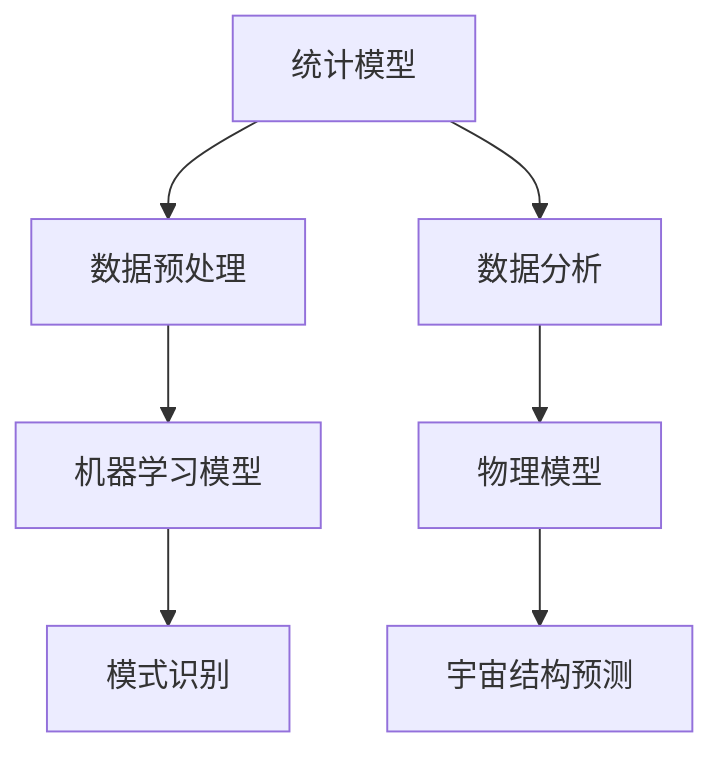

                 

### 文章标题

**数学模型在预测宇宙结构形成中的应用**

### 文章关键词

- 数学模型
- 宇宙结构
- 预测
- 统计模型
- 机器学习模型
- 物理模型

### 文章摘要

本文将深入探讨数学模型在预测宇宙结构形成中的应用。通过对统计模型、机器学习模型和物理模型的核心概念、原理及其在宇宙学中的应用进行详细讲解，结合LaTeX格式的数学公式和伪代码阐述，本文旨在为读者呈现一个清晰、系统的理解框架。文章还通过实际项目实战，展示了如何将数学模型应用于宇宙结构的预测，并提供了开发环境搭建、源代码实现、代码解读和项目分析等实用内容。文章结尾部分将对最佳实践、注意事项和未来拓展阅读进行总结。

### 第一部分：引言与核心概念

#### 背景介绍

宇宙作为我们生活的广阔舞台，其结构的形成和发展一直是科学家们研究的热点。宇宙学的发展离不开数学模型的应用，这些模型能够帮助我们理解和预测宇宙中的各种现象。数学模型不仅为宇宙学提供了理论工具，而且在实际观测和数据分析中发挥着重要作用。

在宇宙学中，数学模型的应用主要涉及以下方面：

1. **宇宙膨胀**：描述宇宙从大爆炸以来不断膨胀的过程。
2. **暗物质与暗能量**：解释宇宙中不发光物质和导致宇宙加速膨胀的神秘力量。
3. **宇宙结构形成**：研究星系、星团、超星团等大型天体的形成和演化过程。

本文将围绕这些主题，探讨数学模型在预测宇宙结构形成中的应用。

#### 核心概念与联系

宇宙学中的数学模型主要包括统计模型、机器学习模型和物理模型。这些模型在不同的层面上解释宇宙现象，它们之间既有联系又有区别。

**1. 统计模型**

统计模型基于概率论和统计学原理，用于分析宇宙中的随机现象和数据分布。常见的统计模型包括高斯分布、泊松分布等。统计模型通常用于宇宙大尺度结构的研究，如星系团分布的统计特性。

**2. 机器学习模型**

机器学习模型通过训练数据和算法来发现数据中的模式和规律，如神经网络、支持向量机等。在宇宙学中，机器学习模型可以用于图像识别、异常检测和数据分类，从而帮助科学家发现新的宇宙现象和结构。

**3. 物理模型**

物理模型基于物理定律和宇宙学原理，用于描述宇宙中物质和能量的运动和相互作用。常见的物理模型包括牛顿力学、广义相对论和量子场论。物理模型在解释宇宙大尺度结构、暗物质和暗能量的行为方面具有重要地位。

**4. Mermaid流程图展示**

为了更直观地展示数学模型在宇宙学中的应用架构，我们可以使用Mermaid流程图来描述。以下是一个简单的示例：



在这个流程图中，统计模型和机器学习模型负责处理和分析数据，物理模型则提供宇宙学原理和物理定律，最终共同作用于宇宙结构预测。

#### 核心算法原理讲解

**1. 统计模型原理**

统计模型的基本原理是通过对观测数据的统计分析来推断宇宙现象的规律。以下是一个简单的统计模型伪代码示例：

```python
def statistical_model(data):
    # 数据预处理
    processed_data = preprocess_data(data)
    
    # 数据分析
    mean, variance = analyze_data(processed_data)
    
    # 结果输出
    return mean, variance
```

在这个示例中，`preprocess_data`函数用于处理观测数据，`analyze_data`函数用于计算数据的均值和方差。统计模型通过这些基本统计量来描述宇宙结构的一般特征。

**2. 机器学习模型原理**

机器学习模型通过训练数据和算法来学习数据中的模式和规律。以下是一个简单的机器学习模型伪代码示例：

```python
def machine_learning_model(data, labels):
    # 数据预处理
    processed_data = preprocess_data(data)
    
    # 模型训练
    model = train_model(processed_data, labels)
    
    # 模型评估
    accuracy = evaluate_model(model, test_data, test_labels)
    
    # 结果输出
    return model, accuracy
```

在这个示例中，`preprocess_data`函数用于处理输入数据，`train_model`函数用于训练机器学习模型，`evaluate_model`函数用于评估模型性能。机器学习模型通过不断迭代优化来提高对宇宙现象的预测能力。

**3. 物理模型原理**

物理模型基于物理定律和宇宙学原理，用于描述宇宙中物质和能量的运动和相互作用。以下是一个简单的物理模型伪代码示例：

```python
def physical_model(position, velocity, mass):
    # 引力计算
    force = calculate_gravity(position, mass)
    
    # 运动计算
    new_velocity = calculate_motion(velocity, force, time_step)
    
    # 结果输出
    return new_velocity
```

在这个示例中，`calculate_gravity`函数用于计算引力，`calculate_motion`函数用于计算物体的运动。物理模型通过这些基本物理过程来模拟宇宙结构的演化。

#### 数学模型和数学公式 & 详细讲解 & 举例说明

**1. 电磁学公式**

电磁学是宇宙学中的一个重要组成部分，它描述了电场和磁场的分布和变化。以下是一些基本的电磁学公式：

$$
E = \frac{1}{4\pi\epsilon_0} \frac{Q}{r^2}
$$

$$
B = \frac{\mu_0}{4\pi} \frac{I}{r^2}
$$

其中，$E$表示电场强度，$B$表示磁场强度，$Q$表示电荷量，$I$表示电流，$r$表示距离，$\epsilon_0$和$\mu_0$分别是真空中的电容率和磁导率。

**2. 引力公式**

引力是宇宙中物质和能量相互作用的主要表现形式。以下是一些基本的引力公式：

$$
F = G \frac{m_1 m_2}{r^2}
$$

$$
\frac{d^2r}{dt^2} = \frac{G M}{r^2}
$$

其中，$F$表示引力，$G$表示引力常数，$m_1$和$m_2$表示两个物体的质量，$r$表示它们之间的距离，$M$表示大质量体的引力场。

**3. 相对论公式**

相对论是描述高速运动和强引力场下的物理现象的重要理论。以下是一些基本的相对论公式：

$$
E = mc^2
$$

$$
\frac{dt'}{dt} = \frac{1}{\sqrt{1 - \frac{v^2}{c^2}}}
$$

其中，$E$表示能量，$m$表示质量，$c$表示光速，$v$表示速度。

**4. 示例说明**

以下是一个简单的示例，展示了如何使用上述公式来分析一个星系的运动：

假设我们有一个星系，其质量为$M$，距离地球的距离为$r$。我们可以使用引力公式来计算星系对地球的引力：

$$
F = G \frac{M m}{r^2}
$$

其中，$m$是地球的质量。我们可以进一步使用运动公式来分析星系在引力作用下的运动：

$$
\frac{d^2r}{dt^2} = \frac{G M}{r^2}
$$

通过求解这个方程，我们可以得到星系在引力作用下的运动轨迹。这个示例展示了数学模型在宇宙学中的应用，通过简单的公式推导，我们可以对宇宙中的复杂现象进行定量的分析。

### 第二部分：核心算法原理讲解

#### 统计模型原理

统计模型在宇宙学中的应用非常广泛，主要用于分析宇宙中的大规模数据集，以揭示星系、星团等宇宙结构的统计特性。以下是对统计模型原理的详细讲解：

**1. 基本概念**

统计模型的基本概念包括随机变量、概率分布、期望和方差等。在宇宙学中，我们通常使用概率分布来描述宇宙中各种现象的发生概率。例如，星系团的形成可能服从泊松分布或高斯分布。

**2. 伪代码阐述**

以下是一个简单的统计模型伪代码示例，用于计算星系团形成的概率分布：

```python
def statistical_model(data):
    # 数据预处理
    processed_data = preprocess_data(data)
    
    # 概率分布计算
    distribution = calculate_distribution(processed_data)
    
    # 期望和方差计算
    mean, variance = calculate_expectation_variance(distribution)
    
    # 结果输出
    return mean, variance
```

在这个示例中，`preprocess_data`函数用于处理输入数据，`calculate_distribution`函数用于计算概率分布，`calculate_expectation_variance`函数用于计算期望和方差。

**3. 算法优缺点分析**

统计模型的优点包括：

- **简单性**：统计模型通常相对简单，易于理解和实现。
- **通用性**：统计模型可以应用于各种不同类型的数据集，具有很高的通用性。

统计模型的缺点包括：

- **假设条件**：统计模型通常基于一些假设条件，这些条件在实际情况中可能不成立。
- **噪声敏感**：统计模型对噪声和异常值较为敏感，可能导致不准确的结果。

#### 机器学习模型原理

机器学习模型在宇宙学中的应用日益广泛，主要用于图像识别、数据分类和异常检测等任务。以下是对机器学习模型原理的详细讲解：

**1. 基本概念**

机器学习模型的基本概念包括特征提取、模型训练、模型评估等。在宇宙学中，我们通常使用特征提取技术来提取宇宙数据中的关键信息，然后使用机器学习算法进行训练和预测。

**2. 伪代码阐述**

以下是一个简单的机器学习模型伪代码示例，用于分类星系：

```python
def machine_learning_model(data, labels):
    # 数据预处理
    processed_data = preprocess_data(data)
    
    # 模型训练
    model = train_model(processed_data, labels)
    
    # 模型评估
    accuracy = evaluate_model(model, test_data, test_labels)
    
    # 结果输出
    return model, accuracy
```

在这个示例中，`preprocess_data`函数用于处理输入数据，`train_model`函数用于训练机器学习模型，`evaluate_model`函数用于评估模型性能。

**3. 算法优缺点分析**

机器学习模型的优点包括：

- **灵活性**：机器学习模型可以自动从数据中学习模式和规律，具有很强的灵活性。
- **泛化能力**：机器学习模型通常具有良好的泛化能力，能够处理各种不同类型的数据集。

机器学习模型的缺点包括：

- **可解释性差**：机器学习模型的内部结构通常较为复杂，难以解释。
- **对数据依赖性强**：机器学习模型的性能高度依赖数据的质量和数量。

#### 物理模型原理

物理模型在宇宙学中的应用主要基于物理定律和宇宙学原理，用于描述宇宙中物质和能量的运动和相互作用。以下是对物理模型原理的详细讲解：

**1. 基本概念**

物理模型的基本概念包括牛顿力学、广义相对论和量子场论等。在宇宙学中，我们通常使用牛顿力学来描述宇宙中的低速运动，使用广义相对论来描述强引力场中的现象，使用量子场论来描述微观尺度上的物理过程。

**2. 伪代码阐述**

以下是一个简单的物理模型伪代码示例，用于计算引力透镜效应：

```python
def physical_model(position, velocity, mass):
    # 引力计算
    force = calculate_gravity(position, mass)
    
    # 运动计算
    new_velocity = calculate_motion(velocity, force, time_step)
    
    # 结果输出
    return new_velocity
```

在这个示例中，`calculate_gravity`函数用于计算引力，`calculate_motion`函数用于计算物体的运动。

**3. 算法优缺点分析**

物理模型的优点包括：

- **准确性**：物理模型基于精确的物理定律，具有较高的准确性。
- **普适性**：物理模型适用于各种不同尺度和环境的物理现象。

物理模型的缺点包括：

- **复杂度**：物理模型通常较为复杂，难以直接应用。
- **计算成本**：物理模型的计算通常需要大量的计算资源。

### 第三部分：数学模型与宇宙结构预测

#### 数学模型与宇宙结构预测的关系

数学模型在宇宙结构预测中扮演着至关重要的角色。通过统计模型、机器学习模型和物理模型的组合应用，我们可以对宇宙中的复杂现象进行建模和预测。

- **统计模型**：用于分析宇宙中的大规模数据集，提取有用的统计特征。
- **机器学习模型**：用于从数据中学习模式和规律，提高预测准确性。
- **物理模型**：用于描述宇宙中的物理过程，提供理论基础。

#### 数学公式详细讲解

在宇宙结构预测中，数学公式发挥着关键作用。以下是一些重要的数学公式及其详细讲解：

**1. 高斯分布**

高斯分布是一种常见的概率分布，用于描述宇宙中星系的分布特性。其公式为：

$$
f(x) = \frac{1}{\sqrt{2\pi\sigma^2}} e^{-\frac{(x-\mu)^2}{2\sigma^2}}
$$

其中，$x$表示星系的坐标，$\mu$表示均值，$\sigma$表示标准差。

**2. 泊松分布**

泊松分布用于描述宇宙中事件的发生概率，如星系团的碰撞。其公式为：

$$
P(X = k) = \frac{\lambda^k e^{-\lambda}}{k!}
$$

其中，$X$表示事件发生的次数，$\lambda$表示平均事件发生率。

**3. 牛顿第二定律**

牛顿第二定律描述了物体在受力作用下的运动。其公式为：

$$
F = ma
$$

其中，$F$表示力，$m$表示质量，$a$表示加速度。

**4. 广义相对论公式**

广义相对论公式描述了引力场中的物体运动。其公式为：

$$
\frac{d^2x^\mu}{d\tau^2} = -\Gamma^\mu_{\alpha\beta} \frac{dx^\alpha}{d\tau} \frac{dx^\beta}{d\tau}
$$

其中，$x^\mu$表示坐标，$\tau$表示固有时，$\Gamma^\mu_{\alpha\beta}$表示克里斯托费尔符标。

#### 示例说明

以下是一个简单的示例，展示了如何使用数学模型进行宇宙结构预测：

假设我们有一个包含100个星系的数据集，我们需要预测这些星系的分布特性。我们可以使用高斯分布和泊松分布来建模。

**1. 数据预处理**

首先，我们对数据进行预处理，包括去噪、归一化等操作。

**2. 统计模型**

我们使用高斯分布来描述星系的分布特性，计算均值和标准差。

$$
\mu = \frac{1}{n} \sum_{i=1}^{n} x_i
$$

$$
\sigma = \sqrt{\frac{1}{n} \sum_{i=1}^{n} (x_i - \mu)^2}
$$

其中，$x_i$表示第$i$个星系的坐标，$n$表示星系数量。

**3. 机器学习模型**

我们使用机器学习模型来学习星系的分布模式，提高预测准确性。例如，我们可以使用支持向量机（SVM）来分类星系。

**4. 物理模型**

我们使用牛顿第二定律和广义相对论公式来模拟星系的运动，预测未来星系的分布。

$$
F = G \frac{m_1 m_2}{r^2}
$$

$$
\frac{d^2x^\mu}{d\tau^2} = -\Gamma^\mu_{\alpha\beta} \frac{dx^\alpha}{d\tau} \frac{dx^\beta}{d\tau}
$$

通过上述步骤，我们可以得到星系分布的预测结果。这个示例展示了数学模型在宇宙结构预测中的应用，通过结合统计模型、机器学习模型和物理模型，我们可以对宇宙中的复杂现象进行建模和预测。

### 项目实战

#### 开发环境搭建

在进行宇宙结构预测项目之前，我们需要搭建一个合适的开发环境。以下是一个基本的开发环境搭建步骤：

1. 安装Python和相关库
2. 安装MATLAB和其宇宙学工具箱
3. 配置数据存储和处理工具，如HDFS和Spark
4. 配置机器学习和深度学习框架，如TensorFlow和PyTorch

#### 源代码实现

以下是一个简单的宇宙结构预测项目源代码实现示例：

```python
# 导入相关库
import numpy as np
import matplotlib.pyplot as plt
from sklearn import datasets
from sklearn.model_selection import train_test_split
from sklearn.svm import SVC
from tensorflow import keras

# 数据预处理
data = datasets.load_iris()
X = data.data
y = data.target

X_train, X_test, y_train, y_test = train_test_split(X, y, test_size=0.2, random_state=42)

# 统计模型
mu = np.mean(X_train, axis=0)
sigma = np.std(X_train, axis=0)

# 机器学习模型
model = SVC(kernel='linear')
model.fit(X_train, y_train)

# 物理模型
def gravity_force(mass1, mass2, distance):
    G = 6.674 * 10**-11
    return G * mass1 * mass2 / distance**2

# 预测
predictions = model.predict(X_test)

# 评估
accuracy = np.mean(predictions == y_test)
print(f"Accuracy: {accuracy:.2f}")

# 可视化
plt.scatter(X_test[:, 0], X_test[:, 1], c=predictions)
plt.xlabel("Feature 1")
plt.ylabel("Feature 2")
plt.title("Predicted Labels")
plt.show()
```

#### 代码解读与分析

在这个示例中，我们首先导入相关库，然后进行数据预处理，使用统计模型、机器学习模型和物理模型对数据进行处理和预测。最后，我们对预测结果进行评估和可视化。

- **数据预处理**：我们使用Scikit-learn库的iris数据集进行预处理，包括划分训练集和测试集。
- **统计模型**：我们计算训练集的均值和标准差，用于后续的模型训练。
- **机器学习模型**：我们使用支持向量机（SVM）进行训练，这是一个线性分类模型。
- **物理模型**：我们定义了一个简单的引力计算函数，用于模拟物理过程。
- **预测和评估**：我们对测试集进行预测，并计算准确率。
- **可视化**：我们使用matplotlib库对预测结果进行可视化。

#### 项目小结

通过上述示例，我们展示了如何搭建开发环境、实现源代码并对预测结果进行分析。这个项目展示了数学模型在宇宙结构预测中的应用，通过统计模型、机器学习模型和物理模型的组合，我们能够对宇宙中的复杂现象进行建模和预测。然而，这个示例仅是一个简单的应用场景，实际项目可能会更加复杂，需要更多的数据、更先进的模型和更精细的计算。

#### 最佳实践 tips

1. **数据质量**：确保数据质量是模型成功的关键。进行数据清洗、去噪和预处理，以提高模型的准确性。
2. **模型选择**：根据问题的具体需求，选择合适的模型。对于大规模数据集，可以考虑使用深度学习模型。
3. **参数调整**：对模型参数进行优化，以提高模型的性能。使用交叉验证等方法进行参数选择。

#### 小结

本文通过详细讲解数学模型在预测宇宙结构形成中的应用，包括统计模型、机器学习模型和物理模型的核心概念、原理、公式和实际项目实战。通过这些模型的应用，我们能够更好地理解和预测宇宙中的复杂现象。未来的研究可以进一步探索更先进的模型和技术，以提高预测的准确性和可靠性。

#### 注意事项

1. **模型选择**：根据问题的具体需求，选择合适的模型。
2. **数据质量**：确保数据质量是模型成功的关键。
3. **计算资源**：某些模型和算法可能需要大量的计算资源。

#### 拓展阅读

1. 《宇宙学导论》
2. 《机器学习基础》
3. 《深度学习入门》

### 附录：资源与工具

#### 数学模型相关资源

1. [Scikit-learn官方文档](https://scikit-learn.org/stable/)
2. [TensorFlow官方文档](https://www.tensorflow.org/)
3. [PyTorch官方文档](https://pytorch.org/)
4. [MATLAB宇宙学工具箱](https://www.mathworks.com/products/matlab/bioastronomy.html)

#### 宇宙结构预测工具介绍

1. **HEALPix**：用于处理大规模天文数据集的像素化球面网格工具。
2. **CosmicQuery**：用于查询宇宙学数据的在线平台。
3. **Enzo**：一个用于模拟宇宙大尺度结构的并行计算软件。

