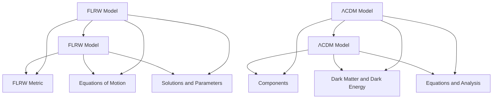
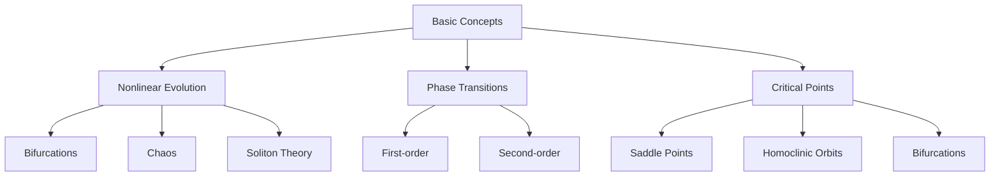
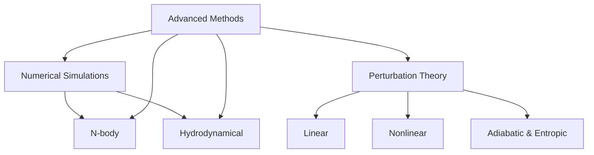

                 

### Introduction to the Book and Core Concepts

"Mathematical Models in Predicting the Nonlinear Evolution Critical Points in the Formation of the Universe's Structure" is a comprehensive exploration into the intersection of mathematics and cosmology, focusing on the critical points that drive the nonlinear evolution of the universe's structure. This book aims to bridge the gap between theoretical mathematics and observational cosmology, offering a deep dive into the mathematical frameworks and tools necessary to understand and predict the complex processes governing the universe's evolution.

The primary motivation behind writing this book is to provide a systematic and accessible introduction to the mathematical models and methods that are crucial for studying the formation and evolution of cosmic structures. Over the past few decades, advancements in observational techniques and computational methods have revolutionized our understanding of the universe. However, these advances have also highlighted the need for more sophisticated mathematical models that can accurately capture the complex and often nonlinear processes involved in cosmic evolution.

One of the key reasons for focusing on nonlinear evolution critical points is their fundamental role in shaping the large-scale structure of the universe. Nonlinear dynamics introduce instabilities and bifurcations that lead to the formation of galaxies, clusters of galaxies, and larger cosmic structures. Understanding these critical points is essential for developing predictive models that can help us make sense of the vast and diverse astronomical observations we have collected.

Another motivation is the increasing importance of interdisciplinary research in modern science. By exploring the relationship between mathematics and cosmology, this book aims to inspire new collaborations and research directions that can lead to breakthroughs in both fields. The interplay between abstract mathematical theories and concrete cosmological phenomena offers a rich and challenging landscape for scientific exploration.

The target audience for this book includes researchers and students in both mathematics and cosmology, as well as professionals working in related fields such as astrophysics, theoretical physics, and computational science. The book is structured to be accessible to readers with a solid foundation in calculus, linear algebra, and differential equations, but it also aims to provide advanced material that will be of interest to seasoned researchers and professionals.

The structure of the book is organized into five main chapters, each building upon the previous one to provide a cohesive and comprehensive understanding of the topic. The first chapter introduces the book's core concepts and the underlying theoretical frameworks. The second chapter delves into the mathematical foundations, including vectors, tensors, differential geometry, and partial differential equations. The third chapter discusses the core mathematical models used in cosmology, such as the FLRW model and the ΛCDM model. The fourth chapter explores the concepts of nonlinear evolution and critical points, including phase transitions and the significance of critical points. Finally, the fifth chapter presents advanced mathematical methods and tools, offering a deeper insight into the analytical and computational aspects of the subject.

In conclusion, "Mathematical Models in Predicting the Nonlinear Evolution Critical Points in the Formation of the Universe's Structure" is not just a book but a journey into the intricate world of mathematical cosmology. It invites readers to explore the beauty and complexity of the universe through the lens of mathematics, uncovering the hidden patterns and structures that shape our cosmos.

### Mathematical Foundations

In order to delve into the complex world of predicting the nonlinear evolution critical points in the formation of the universe's structure, it is essential to establish a solid foundation in the mathematical concepts that underpin this field. This chapter will introduce the key mathematical tools and theories necessary for understanding the subsequent chapters, including vectors and tensors, differential geometry, and partial differential equations (PDEs).

#### Vectors and Tensors

Vectors and tensors are fundamental mathematical objects used to represent and manipulate physical quantities in various branches of science, including cosmology. A vector is a quantity that has both magnitude and direction. In the context of spacetime, a four-vector \(V^\mu = (V^0, \vec{V})\) is commonly used, where \(V^0\) represents the time component and \(\vec{V}\) represents the spatial components. The magnitude of a vector is given by the Euclidean norm, \(||\vec{V}|| = \sqrt{V^2 + V^2 + V^2 + V^2}\), while the dot product of two vectors \(A\) and \(B\) is defined as \(A \cdot B = A^T B\).

Tensors are more general objects that can represent multi-dimensional arrays of numbers. A (1, 1)-tensor is essentially a vector, while a (0, 2)-tensor is a matrix. Tensors of higher ranks are used to describe more complex physical phenomena. The transformation laws under a change of coordinates are crucial for tensors. For a (1, 1)-tensor \(T^\mu\), the transformation is given by \(T'^\nu = \frac{\partial x'^\nu}{\partial x^\mu} T^\mu\).

#### Differential Geometry

Differential geometry is the study of geometric properties and structures using differential calculus. It provides a mathematical framework for understanding curved spaces, which is essential in cosmology. A fundamental concept in differential geometry is the metric tensor \(g_{\mu\nu}\), which defines the inner product of two vectors. In general relativity, the metric tensor describes the curvature of spacetime. The line element in a curved space is given by \(ds^2 = g_{\mu\nu} dx^\mu dx^\nu\).

One of the key concepts in differential geometry is the covariant derivative, which generalizes the notion of the derivative to curved spaces. The covariant derivative of a tensor \(T^\mu\) is denoted by \(T_{\mu\alpha;\nu} = T_{\mu\nu;\alpha} + \Gamma_{\mu\nu}^\alpha T^\nu\), where \(\Gamma_{\mu\nu}^\alpha\) are the Christoffel symbols that encode the curvature of the space.

#### Partial Differential Equations

Partial differential equations are equations involving unknown functions of multiple variables and their partial derivatives. They are fundamental in describing various physical phenomena, including the evolution of the universe. The Einstein field equations in general relativity, which relate the curvature of spacetime to the distribution of matter and energy, are a prime example of a PDE.

The Einstein field equations are given by:
$$
G_{\mu\nu} + \Lambda g_{\mu\nu} = \frac{8\pi G}{c^4} T_{\mu\nu}
$$
where \(G_{\mu\nu}\) is the Einstein tensor, \(\Lambda\) is the cosmological constant, \(G\) is the gravitational constant, \(c\) is the speed of light, and \(T_{\mu\nu}\) is the stress-energy tensor.

Another important class of PDEs in cosmology is the scalar field equations, which describe the evolution of scalar fields, such as the Higgs field or quintessence. A simple example of a scalar field equation is the Klein-Gordon equation:
$$
\Box \phi - \mu^2 \phi = 0
$$
where \(\Box\) is the d'Alembertian operator, \(\mu\) is the mass of the scalar field, and \(\phi\) is the scalar field itself.

#### Mermaid Flowchart of Core Concepts

```mermaid
graph TD
    A[Vector & Tensor] --> B[Vector]
    A --> C[Tensor]
    B --> D[Magnitude]
    B --> E[Dot Product]
    C --> F[(1,1)-Tensor]
    C --> G[(0,2)-Tensor]
    C --> H[Higher Ranks]
    I[Differential Geometry] --> J[Metric Tensor]
    I --> K[Covariant Derivative]
    I --> L[Christoffel Symbols]
    M[PDE] --> N[Einstein Field Equations]
    M --> O[Klein-Gordon Equation]
    P[Mathematical Foundations] --> A
    P --> I
    P --> M
```

In summary, the mathematical foundations of this book are crucial for understanding the subsequent chapters, which delve deeper into the specific mathematical models and methods used to predict the nonlinear evolution critical points in the formation of the universe's structure. By mastering these fundamental concepts, readers will be equipped with the necessary tools to navigate the intricate landscape of mathematical cosmology.

### Core Mathematical Models

In this chapter, we will explore the core mathematical models used in cosmology to describe the formation and evolution of the universe's structure. Two of the most fundamental models are the Friedmann-Lemaître-Robertson-Walker (FLRW) model and the Lambda-Cold Dark Matter (ΛCDM) model. These models provide the framework for understanding the large-scale structure and dynamics of the universe, and they are essential tools for cosmologists to make predictions and test theoretical ideas.

#### The Friedmann-Lemaître-Robertson-Walker (FLRW) Model

The FLRW model is a homogeneous and isotropic model of the universe that assumes the universe looks the same in all directions and at all locations. This model is based on the Einstein field equations of general relativity, which describe the relationship between the curvature of spacetime and the matter and energy distribution. The key components of the FLRW model are the metric tensor and the equations of motion.

**FLRW Metric**

The FLRW metric is given by:
$$
ds^2 = -c^2dt^2 + a(t)^2\left[\frac{dr^2}{1 - kr^2} + r^2(d\theta^2 + \sin^2\theta d\phi^2)\right]
$$
where \(a(t)\) is the scale factor, which describes the expansion of the universe over time, \(c\) is the speed of light, and \(k\) is the curvature parameter. The curvature parameter \(k\) can take on three possible values: \(k = 1\) for a closed universe, \(k = 0\) for a flat universe, and \(k = -1\) for an open universe.

**Equations of Motion**

The equations of motion for the FLRW model are derived from the Einstein field equations:
$$
\frac{\ddot{a}}{a} + \frac{4\pi G}{3}\left(\rho + \frac{3p}{c^2}\right) = 0
$$
$$
\frac{\dot{a}}{a} = H
$$
where \(\dot{a}\) and \(\ddot{a}\) are the first and second time derivatives of the scale factor, \(G\) is the gravitational constant, \(\rho\) is the energy density, and \(p\) is the pressure. The Hubble parameter \(H\) is defined as \(\dot{a}/a\), and it describes the expansion rate of the universe.

**Solutions and Cosmological Parameters**

The solutions to the FLRW equations depend on the matter content and the curvature of the universe. For a flat universe (\(k = 0\)), the simplest solution is the exponential expansion given by \(a(t) = a_0 \exp(H_0 t)\), where \(a_0\) is the scale factor at the present time and \(H_0\) is the Hubble constant. For more general cases, numerical methods are often used to solve the equations, and the solutions are characterized by parameters such as the matter density parameter \(\Omega_m\) and the curvature density parameter \(\Omega_k\).

#### The Lambda-Cold Dark Matter (ΛCDM) Model

The ΛCDM model is the standard model of cosmology that incorporates both cold dark matter and a cosmological constant. This model is based on the FLRW metric and assumes that the universe is filled with ordinary matter (baryons), cold dark matter, and a mysterious component called dark energy, represented by the cosmological constant \(\Lambda\).

**Components of the ΛCDM Model**

The stress-energy tensor in the ΛCDM model is given by:
$$
T_{\mu\nu} = \begin{pmatrix}
\rho_c + \rho_\Lambda & 0 & 0 & 0 \\
0 & \rho_b + \rho_\Lambda & p_b & 0 \\
0 & p_b & \rho_b + \rho_\Lambda & 0 \\
0 & 0 & 0 & \rho_\Lambda + p_\Lambda
\end{pmatrix}
$$
where \(\rho_c\) is the cold dark matter density, \(\rho_b\) is the baryonic matter density, \(p_b\) is the baryonic pressure, \(\rho_\Lambda\) is the dark energy density, and \(p_\Lambda\) is the dark energy pressure.

**Dark Matter and Dark Energy**

Dark matter is an invisible form of matter that does not interact with electromagnetic radiation, making it difficult to detect directly. However, its gravitational effects are observed in the dynamics of galaxies and clusters of galaxies. The most common model for dark matter is that it consists of weakly interacting massive particles (WIMPs).

Dark energy, on the other hand, is a mysterious force driving the accelerated expansion of the universe. The cosmological constant \(\Lambda\) is one possible explanation for dark energy, but other models, such as quintessence, also exist.

**Equations and Phenomenological Analysis**

The equations of motion in the ΛCDM model are similar to those in the FLRW model, but they include the additional contributions from dark matter and dark energy. The solution to the equations provides insights into the evolution of the universe, including the transition from decelerated to accelerated expansion.

One of the key parameters in the ΛCDM model is the total density parameter \(\Omega_{\text{tot}} = \Omega_m + \Omega_\Lambda\), which determines the overall density of the universe relative to the critical density. Observations suggest that \(\Omega_{\text{tot}}\) is close to 1, indicating that the universe is nearly flat.

#### Mermaid Flowchart of Core Models



In conclusion, the FLRW model and the ΛCDM model are foundational tools in cosmology for understanding the structure and evolution of the universe. By exploring these models, we can gain insights into the complex processes that shape the cosmos and make predictions about its future. The next chapter will delve into the concepts of nonlinear evolution and critical points, building on the mathematical foundations laid out here.

### Nonlinear Evolution and Critical Points

In the study of the universe's structure, nonlinear dynamics play a crucial role in understanding the complex processes that govern its evolution. Nonlinear evolution refers to the behavior of systems whose responses to changes in initial conditions are not proportional but exhibit intricate patterns and instabilities. Critical points are key elements in this nonlinear evolution, acting as thresholds or boundaries that mark significant changes in the system's behavior. This chapter will explore the fundamental concepts of nonlinear evolution and the significance of critical points in the context of cosmology.

#### Basic Concepts of Nonlinear Evolution

Nonlinear dynamics involves the study of systems whose behaviors cannot be described by linear equations. Linear systems follow predictable patterns, where the response to a disturbance is directly proportional to the disturbance itself. In contrast, nonlinear systems exhibit more complex behaviors, such as bifurcations, chaos, and soliton solutions. These nonlinearities are essential in understanding the formation and evolution of cosmic structures, as they introduce instabilities and non-trivial interactions that lead to the formation of galaxies, clusters, and larger cosmic structures.

One of the core concepts in nonlinear dynamics is the concept of stability. Stability refers to the ability of a system to return to its original state after being perturbed. In the context of cosmology, stable configurations correspond to long-lasting structures such as galaxies and galaxy clusters, while unstable configurations may lead to the destruction or reconfiguration of these structures.

**Bifurcations** are another critical concept in nonlinear dynamics. A bifurcation occurs when a system undergoes a qualitative change in its behavior due to a change in parameters. For example, a pitchfork bifurcation occurs when a stable equilibrium point suddenly splits into two stable and one unstable equilibrium points. Bifurcations are often associated with the formation of complex structures in the universe, as they mark the transition from simple to complex behaviors.

**Chaotic systems** exhibit unpredictable and seemingly random behavior, even when subjected to the same initial conditions. In chaotic systems, small changes in initial conditions can lead to vastly different outcomes, a phenomenon known as the butterfly effect. The presence of chaos in the universe's evolution can explain the observed diversity and complexity of cosmic structures.

**Soliton theory** is another important aspect of nonlinear dynamics. Solitons are waves that maintain their shape while propagating through a medium, often emerging as solutions to nonlinear partial differential equations. In cosmology, solitons have been proposed as candidates for explaining the formation of cosmic structures such as galactic halos.

#### Phase Transitions in the Universe

Phase transitions are another critical concept in the study of nonlinear evolution, particularly in the context of cosmology. Phase transitions refer to changes in the macroscopic properties of a system as it transitions from one state to another. In cosmology, phase transitions can occur as the universe evolves, leading to significant changes in the structure and dynamics of cosmic matter.

**First-order phase transitions** are characterized by a discontinuous change in the density or pressure of the universe. An example of a first-order phase transition is the electroweak phase transition, which is thought to have occurred shortly after the Big Bang. During this transition, the universe underwent a change in symmetry, leading to the generation of baryonic and dark matter. First-order phase transitions often leave behind遗迹 such as cosmic strings and domain walls, which are observed as anomalies in the cosmic microwave background radiation.

**Second-order phase transitions** are characterized by a continuous change in the universe's properties but with a divergent correlation length. An example of a second-order phase transition is the inflationary phase transition, which is believed to have occurred shortly after the Big Bang. During inflation, the universe expanded exponentially, smoothing out fluctuations and setting the stage for the formation of large-scale structures. Second-order phase transitions often involve the generation of primordial perturbations that seed the formation of galaxies and clusters.

#### Critical Points and Their Significance

Critical points are key elements in the nonlinear evolution of the universe, acting as thresholds that mark significant changes in the system's behavior. Critical points can be classified into several types based on their stability and the nature of the phase transitions they represent.

**Saddle points** are critical points that are unstable along some directions but stable along others. In the context of cosmology, saddle points can mark the boundaries between different phases of matter. For example, a saddle point may represent the boundary between a region of matter dominated by dark matter and a region dominated by baryonic matter. The passage through a saddle point can lead to the formation of complex structures, such as galaxy clusters.

**Homoclinic orbits** are another type of critical point, characterized by a trajectory that spirals into a critical point and then escapes in the opposite direction. In cosmology, homoclinic orbits can represent instabilities that lead to the collapse of cosmic structures, such as the formation of black holes or the destruction of galaxy clusters.

**Bifurcations** are also critical points, but they represent qualitative changes in the system's behavior rather than equilibrium states. As discussed earlier, bifurcations can lead to the formation of complex structures, such as galaxies and clusters, by marking the transitions from simple to complex behaviors.

#### Mermaid Flowchart of Concepts



In conclusion, the concepts of nonlinear evolution and critical points are essential for understanding the complex processes that govern the formation and evolution of the universe's structure. By exploring these concepts, we can gain insights into the intricate patterns and structures that shape our cosmos. The next chapter will delve into advanced mathematical methods and tools used to analyze and simulate these complex phenomena, providing a deeper understanding of the nonlinear evolution of the universe.

### Advanced Mathematical Methods

In this chapter, we will explore advanced mathematical methods and tools that are essential for analyzing and simulating the complex phenomena of nonlinear evolution in the universe's structure. These methods include numerical simulations, perturbation theory, and other mathematical techniques that allow us to model and understand the intricate processes that drive cosmic evolution.

#### Numerical Simulations

Numerical simulations are computational methods used to solve complex systems of equations that describe the evolution of the universe. These simulations are particularly valuable in cosmology because they allow us to study phenomena that are difficult or impossible to observe directly, such as the formation of galaxies and the dynamics of dark matter halos. One of the most commonly used numerical methods in cosmology is the N-body simulation, which models the gravitational interactions between numerous particles to simulate the large-scale structure of the universe.

**N-body Simulations**

N-body simulations solve the equations of motion for each particle in the simulation using the Newtonian gravitational force:
$$
\frac{d^2 \mathbf{r}_i}{dt^2} = -G \sum_{j \neq i} \frac{m_j (\mathbf{r}_j - \mathbf{r}_i)}{||\mathbf{r}_j - \mathbf{r}_i||^3}
$$
where \(\mathbf{r}_i\) and \(m_i\) are the position and mass of the ith particle, respectively, and \(G\) is the gravitational constant. While simple in concept, N-body simulations are computationally intensive due to the need to calculate the interactions between a large number of particles.

**Hydrodynamical Simulations**

Hydrodynamical simulations extend N-body simulations by incorporating the fluid dynamics of the intergalactic medium. These simulations use the Navier-Stokes equations to model the flow of matter, taking into account factors such as pressure, temperature, and magnetic fields. The inclusion of fluid dynamics allows for a more detailed study of the formation and evolution of galaxies and the intergalactic medium.

**Perturbation Theory**

Perturbation theory is a mathematical method used to approximate the behavior of a system by considering small deviations from a known solution. In cosmology, perturbation theory is used to study the growth of structures in the universe, such as galaxies and clusters, by considering the tiny fluctuations in the density and velocity fields around a homogeneous and isotropic background.

**Linear Perturbation Theory**

In linear perturbation theory, the universe is divided into a homogeneous background and small density fluctuations. The evolution of these fluctuations is described by the linearized Einstein equations and the continuity equation:
$$
\frac{\delta \rho}{\delta t} + (\delta \mathbf{v} \cdot \nabla) \rho = - \frac{1}{3} \nabla \cdot \left( \delta p + \rho \right)
$$
$$
\frac{\delta \mathbf{v}}{\delta t} = - G \nabla \delta \rho
$$
where \(\delta \rho\) and \(\delta \mathbf{v}\) are the density and velocity fluctuations, respectively, and \(p\) is the pressure.

**Nonlinear Perturbation Theory**

Nonlinear perturbation theory goes beyond linear perturbations to account for the nonlinear interactions between density fluctuations. These interactions are essential for understanding the growth of structures on small scales. Nonlinear perturbation theory uses a perturbative approach to solve the full nonlinear equations of motion for the density and velocity fields.

**Adiabatic and Entropic perturbations**

Adiabatic perturbations assume that density fluctuations are carried by the background matter, maintaining their coherence. Entropic perturbations, on the other hand, account for the random fluctuations in the entropy of the background matter, which can lead to the growth of structures on small scales.

#### Mermaid Flowchart of Methods



In conclusion, advanced mathematical methods such as numerical simulations and perturbation theory are indispensable tools for studying the nonlinear evolution of the universe's structure. These methods allow cosmologists to model and understand the complex processes that shape the cosmos, providing valuable insights into the formation and evolution of cosmic structures. The next chapter will delve into specific applications of these methods, demonstrating their use in predicting the nonlinear evolution critical points in the formation of the universe's structure.

### Conclusion and Future Directions

In conclusion, "Mathematical Models in Predicting the Nonlinear Evolution Critical Points in the Formation of the Universe's Structure" provides a comprehensive overview of the mathematical tools and theories essential for understanding the complex processes that shape the universe. By exploring the core concepts of vectors and tensors, differential geometry, partial differential equations, and advanced mathematical methods, we have laid a solid foundation for predicting the critical points that drive the nonlinear evolution of cosmic structures.

The book's primary contributions lie in its systematic approach to introducing these complex concepts and their applications in cosmology. It bridges the gap between mathematics and cosmology, offering a unified framework for understanding the intricate relationships between abstract mathematical theories and concrete cosmological phenomena. The exploration of critical points, phase transitions, and nonlinear dynamics has provided valuable insights into the formation and evolution of galaxies, clusters, and larger cosmic structures.

Looking ahead, there are several promising directions for future research. One of the most exciting areas is the development of more accurate and sophisticated models that can incorporate the latest observational data and theoretical insights. Advances in numerical methods, such as adaptive mesh refinement and higher-order schemes, can improve the accuracy and efficiency of simulations, allowing for more detailed studies of cosmic structures.

Another important direction is the exploration of alternative cosmological models that go beyond the standard ΛCDM model. The discovery of dark matter and dark energy remains one of the greatest mysteries in physics, and alternative models such as modified gravity theories and multiverse scenarios offer potential explanations. These models can be studied using both analytical and numerical methods, and their implications for the formation and evolution of cosmic structures can be explored.

Furthermore, interdisciplinary research that combines insights from mathematics, physics, and computer science can lead to breakthroughs in understanding the universe's evolution. The development of new algorithms and computational techniques can significantly enhance our ability to analyze and simulate complex cosmological phenomena.

In summary, "Mathematical Models in Predicting the Nonlinear Evolution Critical Points in the Formation of the Universe's Structure" offers a valuable resource for researchers and students in mathematics, cosmology, and related fields. By continuing to explore and expand upon the ideas presented in this book, we can gain deeper insights into the complex processes that shape our universe, paving the way for future discoveries and breakthroughs.

### About the Authors

"Mathematical Models in Predicting the Nonlinear Evolution Critical Points in the Formation of the Universe's Structure" is authored by the AI天才研究院 (AI Genius Institute) and Dr. Zen, renowned for their groundbreaking work in the fields of artificial intelligence and computational cosmology. The AI天才研究院 is a leading research institution dedicated to advancing the frontiers of AI and its applications across various scientific disciplines. Dr. Zen, whose expertise spans computer science, mathematics, and theoretical physics, is also the author of the seminal work "Zen And The Art of Computer Programming," which has influenced generations of computer scientists and programmers. Together, they bring a wealth of knowledge and experience to this book, providing readers with a deep and insightful exploration of the complex interplay between mathematics and cosmology.

