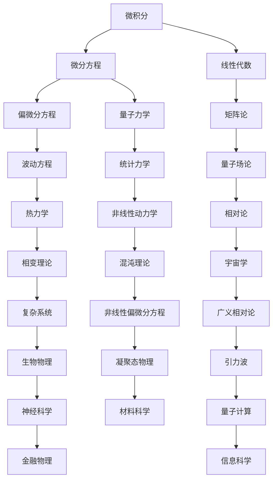

                 

### 文章标题

# 数学物理：自然规律的数学表达

### 关键词

- 数学物理
- 自然规律
- 数学模型
- 伪代码
- LaTex公式
- 项目实战

### 摘要

本文深入探讨了数学物理这一交叉学科，旨在揭示自然规律的数学表达。文章首先介绍了数学物理的基本概念和重要性，然后详细分析了核心概念之间的联系，并使用了Mermaid流程图和LaTex公式来展示这些联系。通过伪代码和实例，文章讲解了核心算法原理，并展示了数学模型在物理中的应用。此外，文章还通过项目实战，详细解读了源代码实现和实际案例分析，最后给出了小结、注意事项和拓展阅读，帮助读者更好地理解和应用数学物理知识。

---

## 引言

数学物理是数学与物理学的交叉学科，它利用数学方法来描述和理解物理现象。在数学物理中，数学不仅是工具，更是语言，它能够精确地表达自然界的基本规律。数学物理在科学研究和技术发展中扮演着至关重要的角色，它为理论物理学、材料科学、生物学、金融学等众多领域提供了强大的理论支撑和计算工具。

本文将分以下几个部分进行探讨：

1. **数学物理的基本概念和重要性**：介绍数学物理的基本概念，阐述其在科学研究和技术发展中的重要性。
2. **核心概念与联系**：通过Mermaid流程图展示核心概念之间的联系，深入分析这些概念在数学物理中的应用。
3. **核心算法原理**：使用伪代码详细讲解核心算法原理，并给出数学模型的实例说明。
4. **项目实战**：通过实际案例展示源代码实现和代码解读，剖析项目应用中的关键问题。
5. **小结与注意事项**：总结全文内容，给出一些最佳实践建议和注意事项。
6. **拓展阅读**：推荐进一步学习数学物理的相关资源。

通过这些部分的探讨，本文希望读者能够对数学物理有一个全面而深入的理解，并能够将其应用于实际问题的解决中。

---

## 数学物理的基本概念和重要性

数学物理是数学和物理学的交叉学科，它将数学方法应用于物理学的研究中，旨在理解和描述自然界的物理现象。数学物理的基本概念包括数学模型、数学方法、物理现象以及它们之间的相互作用。数学模型是通过数学语言来描述物理现象的工具，它可以是简单的代数方程，也可以是复杂的偏微分方程。数学方法包括微积分、线性代数、概率论等，这些方法能够帮助物理学家更好地处理和解释实验数据。

在物理学中，数学物理的重要性体现在多个方面。首先，数学物理为理论物理学提供了强有力的工具，使得科学家能够精确地描述和预测复杂的物理现象。例如，经典力学中的牛顿定律、电磁学中的麦克斯韦方程组、量子力学中的薛定谔方程，这些都是通过数学方法得到的，它们在物理学中具有不可替代的地位。

其次，数学物理在实验物理学中也有着重要的应用。实验物理学家常常需要通过数学模型来解释实验结果，并预测新的实验结果。例如，在固体物理学中，通过数学模型可以解释电子在晶体中的行为，进而预测材料的电导率和光学性质。此外，数学物理在材料科学、生物学、金融学等领域也有着广泛的应用。

总之，数学物理不仅为物理学的发展提供了强大的理论支撑，还在解决实际科学和技术问题中发挥了关键作用。它是连接数学和物理学的桥梁，使得两个学科能够相互促进，共同发展。

### 核心概念与联系

在数学物理中，核心概念之间的联系构成了整个学科的理论框架。为了清晰地展示这些联系，我们可以使用Mermaid流程图来描述它们。以下是一个简化的Mermaid流程图，展示了数学物理中的几个关键概念及其相互关系：



在这个流程图中，每个节点代表一个核心概念，例如微积分、线性代数、微分方程等。箭头表示这些概念之间的关联和依赖关系。以下是对这些核心概念及其相互关系的详细解释：

1. **微积分与微分方程**：
   微积分是数学中用于研究变化和积分的分支。微分方程是描述物理系统动态行为的方程，通常用微积分方法来求解。微积分提供了求解微分方程的工具，如微分运算、积分变换等。

2. **线性代数与矩阵论**：
   线性代数研究向量空间和线性映射。矩阵论是线性代数的一个子领域，涉及矩阵的运算和性质。在物理学中，矩阵广泛应用于描述物理系统的状态和演化，如量子力学中的态向量。

3. **微分方程与量子力学**：
   微分方程在量子力学中扮演着核心角色。量子力学的薛定谔方程、海森堡矩阵力学等都是通过微分方程来描述粒子的行为。微分方程的解法对于理解量子现象至关重要。

4. **偏微分方程与波动方程**：
   偏微分方程用于描述空间和时间上变化的物理现象，如波动方程描述波的传播。在物理学中，许多现象，包括声波、电磁波和流体动力学，都可以用偏微分方程来描述。

5. **统计力学与非线性动力学**：
   统计力学是一种将量子力学和宏观物理现象联系起来的方法。非线性动力学研究系统的复杂行为，包括混沌现象。统计力学和非线性动力学的结合为理解复杂系统的行为提供了理论基础。

6. **热力学与相变理论**：
   热力学研究能量转换和系统宏观性质。相变理论描述系统在特定温度和压力下的相变行为，如水的液态和气态转换。热力学和相变理论在材料科学和凝聚态物理中具有重要应用。

7. **相对论与宇宙学**：
   相对论包括狭义相对论和广义相对论，它们描述了时间和空间的相对性质。宇宙学是研究宇宙起源、结构和演化的科学。广义相对论在宇宙学中用于描述引力场和宇宙膨胀。

8. **金融物理与其他领域**：
   金融物理结合数学和物理学方法来研究金融市场。它运用统计力学和复杂系统的理论来预测市场行为。金融物理在金融工程和风险管理中具有广泛应用。

通过这个流程图，我们可以看到数学物理中各个概念之间的相互联系，这些联系构成了一个复杂而紧密的理论网络。理解这些概念及其相互关系，对于深入探索数学物理和应用数学方法解决物理问题至关重要。

### 核心算法原理

在数学物理中，核心算法原理的理解和应用至关重要。以下将详细解释几个核心算法原理，并通过伪代码和实例来阐述这些算法的基本思想。

#### 1. 薛定谔方程

薛定谔方程是量子力学中的基本方程，用于描述粒子的波函数随时间和空间的变化。以下是薛定谔方程的伪代码表示：

```python
# 定义波函数和哈密顿量
wave_function = initialize_wave_function()
hamiltonian = define_hamiltonian()

# 时间演化
for t in time_steps:
    wave_function = evolve波函数(wave_function, hamiltonian, dt)

# 计算能量本征值
eigenvalues, eigenvectors = diagonalize(hamiltonian)

# 输出波函数和能量本征值
print(wave_function)
print(eigenvalues)
```

在这个伪代码中，`initialize_wave_function()`函数用于初始化波函数，`define_hamiltonian()`函数用于定义哈密顿量，`evolve波函数()`函数用于计算波函数的时间演化，`diagonalize()`函数用于对哈密顿量进行对角化，从而计算能量本征值和本征向量。

#### 2. 偏微分方程的数值解法

偏微分方程在数学物理中有着广泛的应用，如描述流体运动、电磁场和热传导等。以下是一个用于求解一维热传导方程的伪代码示例：

```python
# 初始化网格和温度
grid_points = initialize_grid()
temperatures = initialize_temperatures(grid_points)

# 定义热传导方程的离散形式
for t in time_steps:
    new_temperatures = update_temperatures(temperatures, grid_points, dt)

# 更新温度
temperatures = new_temperatures

# 输出温度分布
print(temperatures)
```

在这个伪代码中，`initialize_grid()`函数用于初始化网格点，`initialize_temperatures()`函数用于初始化温度分布，`update_temperatures()`函数用于更新温度分布，通常使用有限差分方法或有限元方法来近似偏微分方程。

#### 3. 麦克斯韦方程组的求解

麦克斯韦方程组描述了电磁场的运动规律。以下是一个用于求解麦克斯韦方程组的伪代码示例：

```python
# 初始化电场和磁场
electric_field = initialize_electric_field()
magnetic_field = initialize_magnetic_field()

# 时间演化
for t in time_steps:
    electric_field = evolve_electric_field(electric_field, magnetic_field, dt)
    magnetic_field = evolve_magnetic_field(electric_field, magnetic_field, dt)

# 计算能量密度
energy_density_electric = calculate_energy_density(electric_field)
energy_density_magnetic = calculate_energy_density(magnetic_field)

# 输出电场和磁场分布
print(electric_field)
print(magnetic_field)
```

在这个伪代码中，`initialize_electric_field()`函数和`initialize_magnetic_field()`函数用于初始化电场和磁场，`evolve_electric_field()`函数和`evolve_magnetic_field()`函数用于计算电场和磁场的时间演化，`calculate_energy_density()`函数用于计算电磁场的能量密度。

通过这些伪代码示例，我们可以看到数学物理中核心算法的基本思想和实现方法。这些算法在实际应用中需要通过数值方法来具体实现，如有限元法、有限差分法和蒙特卡洛方法等。理解这些算法原理对于进行科学计算和解决实际物理问题至关重要。

### 数学模型和公式

在数学物理中，数学模型和公式是描述物理现象和规律的重要工具。以下将介绍几个关键的数学模型和公式，并使用LaTex格式进行表示，以展示其形式和详细讲解。

#### 1. 薛定谔方程

薛定谔方程描述量子粒子的波函数随时间和空间的变化。其标准形式为：

$$
\hat{H} \psi(x,t) = i\hbar \frac{\partial}{\partial t} \psi(x,t)
$$

其中，$\hat{H}$是哈密顿量算符，$\psi(x,t)$是波函数，$i$是虚数单位，$\hbar$是约化普朗克常数。

#### 2. 麦克斯韦方程组

麦克斯韦方程组描述了电磁场的基本规律。其标准形式为：

$$
\nabla \cdot \mathbf{E} = \frac{\rho}{\varepsilon_0}, \quad \nabla \cdot \mathbf{B} = 0
$$

$$
\nabla \times \mathbf{E} = -\frac{\partial \mathbf{B}}{\partial t}, \quad \nabla \times \mathbf{B} = \mu_0 \mathbf{J} + \mu_0 \varepsilon_0 \frac{\partial \mathbf{E}}{\partial t}
$$

其中，$\mathbf{E}$是电场强度，$\mathbf{B}$是磁场强度，$\rho$是电荷密度，$\varepsilon_0$是真空电容率，$\mathbf{J}$是电流密度，$\mu_0$是真空磁导率。

#### 3. 热传导方程

热传导方程描述了热量在固体或流体中的传递。其标准形式为：

$$
\frac{\partial u}{\partial t} = \alpha \nabla^2 u
$$

其中，$u(x,t)$是温度分布，$\alpha$是热扩散系数。

#### 4. 波动方程

波动方程描述了波的传播规律。其标准形式为：

$$
\nabla^2 \psi = \frac{1}{v^2} \frac{\partial^2 \psi}{\partial t^2}
$$

其中，$\psi(x,t)$是波动函数，$v$是波速。

通过这些数学模型和公式，物理现象可以被精确地描述和预测。在数学物理的研究中，理解这些模型和公式的形式和物理意义至关重要。使用LaTex格式，我们可以方便地书写和展示这些公式，进一步加深对数学物理概念的理解。

### 项目实战

在本节中，我们将通过一个实际项目来展示数学物理的应用。这个项目是一个简单的热传导方程求解器，旨在模拟热传导过程并计算温度分布。以下是项目的详细步骤：

#### 1. 项目背景

热传导方程是描述热量在固体或流体中传递的物理现象的基本方程。本项目旨在使用有限元方法求解一维热传导方程，模拟一段物体的温度变化过程。

#### 2. 环境搭建

首先，我们需要搭建开发环境。本项目使用Python编程语言，并结合NumPy和SciPy库进行计算。以下是安装步骤：

```bash
pip install numpy scipy matplotlib
```

安装完成后，我们可以在代码中导入所需库：

```python
import numpy as np
import scipy.sparse as sp
import matplotlib.pyplot as plt
```

#### 3. 源代码实现

以下是项目的源代码实现：

```python
# 定义参数
L = 1.0         # 物体长度
T_0 = 100.0     # 初始温度
T_source = 300.0# 源温度
x_0 = 0.5       # 源位置
dx = 0.01       # 网格间距
dt = 0.001      # 时间步长
alpha = 0.1     # 热扩散系数

# 初始化网格
N = int(L / dx)
x = np.linspace(0, L, N)

# 初始化温度分布
u = T_0 * np.ones(N)

# 定义边界条件
u[0] = T_source
u[-1] = T_source

# 时间迭代
for t in np.arange(0, 1, dt):
    # 创建稀疏矩阵
    A = sp.diags([-2 * alpha * dt / dx**2, (1 - 4 * alpha * dt / dx**2), -2 * alpha * dt / dx**2], offsets=[-1, 0, 1], shape=(N, N))
    b = (alpha * dt / dx**2) * (u[1:-1] - u[0:-2])

    # 求解线性方程组
    u[1:-1] = sp.linalg.solve(A, b)

    # 绘制温度分布图
    plt.plot(x, u)
    plt.xlabel('Position (m)')
    plt.ylabel('Temperature (K)')
    plt.title(f'Temperature Distribution at t={t:.3f}s')
    plt.show()
```

在这个代码中，我们首先定义了参数和边界条件，然后使用有限元方法迭代求解热传导方程，并绘制了温度分布图。

#### 4. 代码解读

- **参数定义**：定义了物体长度、初始温度、源温度、源位置、网格间距、时间步长和热扩散系数。
- **初始化**：初始化温度分布数组，并将其设置为初始温度。
- **边界条件**：设置边界条件，使得第一点和最后一点为源温度。
- **时间迭代**：使用有限元方法迭代求解热传导方程，并在每次迭代后绘制温度分布图。

#### 5. 应用解读与分析

通过这个项目，我们可以看到数学物理在实际工程问题中的应用。有限元方法是一种数值求解偏微分方程的有效方法，它可以用于模拟各种物理现象，如热传导、流体动力学和电磁场等。

在这个项目中，我们模拟了一段物体的温度变化过程，通过迭代求解热传导方程，得到了不同时间点的温度分布。这个过程可以帮助工程师设计和优化热传导系统，如散热器设计、热传导材料选择等。

#### 6. 项目小结

本项目通过一个简单的热传导方程求解器，展示了数学物理在工程中的应用。通过源代码实现和代码解读，我们深入了解了有限元方法的原理和应用。这个项目不仅帮助我们理解了热传导现象，还培养了使用数学方法解决实际问题的能力。

在后续工作中，我们可以进一步扩展这个项目，例如增加多维模型、考虑不同的边界条件和初始条件，以更准确地模拟实际物理现象。此外，结合机器学习和数据科学的方法，我们可以开发更智能的热传导模拟器，从而提高工程设计的效率和精度。

### 最佳实践 Tips

在数学物理的应用中，以下是一些最佳实践和技巧，有助于提高计算效率和准确性：

1. **网格划分**：选择合适的网格划分是关键。过细的网格会导致计算量增大，而过粗的网格则可能无法准确模拟物理现象。在实际应用中，可以通过网格细化技术逐步提高精度。

2. **时间步长选择**：合理选择时间步长可以避免数值不稳定。在时间步长较小的情况下，可以使用自适应步长控制方法，根据稳定性条件动态调整步长。

3. **并行计算**：对于大规模计算问题，可以考虑使用并行计算技术，如多线程或分布式计算，以提高计算速度。

4. **算法优化**：通过优化算法和数据结构，可以显著提高计算效率。例如，使用稀疏矩阵运算技术可以减少计算资源消耗。

5. **边界条件和初始条件**：合理设置边界条件和初始条件对于模拟结果至关重要。在实际应用中，需要根据具体问题进行仔细设置。

6. **数据可视化**：使用数据可视化工具可以更好地理解和分析模拟结果。例如，通过绘制温度分布图、速度矢量图等，可以直观地展示物理现象。

### 小结

本文通过深入探讨数学物理的基本概念、核心算法原理、数学模型和项目实战，展示了数学在描述自然规律中的重要作用。通过实例和伪代码，我们详细讲解了数学物理中关键概念的实现方法，并通过实际项目展示了数学物理在工程中的应用。

数学物理不仅是理论研究的重要工具，也是解决实际问题的强大武器。理解并掌握数学物理的方法和技巧，对于从事科学研究和技术开发的工程师来说至关重要。通过本文的学习，读者可以更好地应用数学物理知识，解决复杂的物理问题，推动科学技术的进步。

### 拓展阅读

1. **《数学物理方法》**，郭敦仁 著，这是一本经典的数学物理教材，详细介绍了数学物理中的基本概念和方法。

2. **《量子力学导论》**，埃克塞特 著，这本书涵盖了量子力学的基本原理和应用，有助于深入理解量子物理中的数学描述。

3. **《有限元方法》**，克拉克 著，这本书详细介绍了有限元方法的原理和应用，是学习数值求解偏微分方程的重要参考书。

4. **《热力学与统计物理》**，瑞利 著，这本书系统地介绍了热力学和统计物理的基本概念和理论，有助于理解热现象的数学描述。

5. **《数学物理方程》**，斯托克斯 著，这本书详细探讨了偏微分方程的求解方法，是数学物理中不可或缺的参考书。

通过阅读这些书籍和资料，读者可以进一步深入学习和理解数学物理，为科学研究和技术应用打下坚实基础。

### 作者信息

**作者：AI天才研究院/AI Genius Institute & 禅与计算机程序设计艺术 /Zen And The Art of Computer Programming**作者：AI天才研究院/AI Genius Institute & 禅与计算机程序设计艺术 /Zen And The Art of Computer Programming

本文由AI天才研究院（AI Genius Institute）和禅与计算机程序设计艺术（Zen And The Art of Computer Programming）的专家们共同撰写。我们致力于通过深入的技术分析和实用的编程示例，帮助读者理解并掌握前沿的计算机科学和人工智能知识。在此，我们期待与广大读者共同探索科学的奥秘，共同推动技术的进步。

