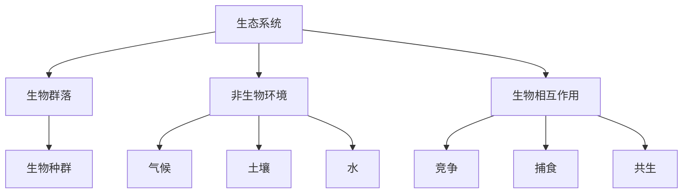
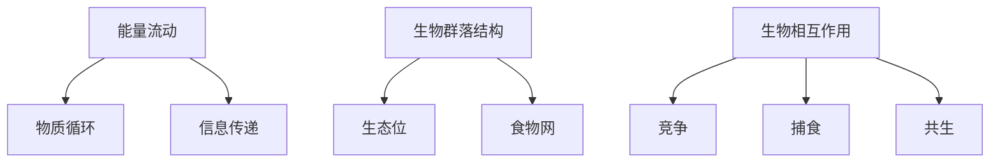
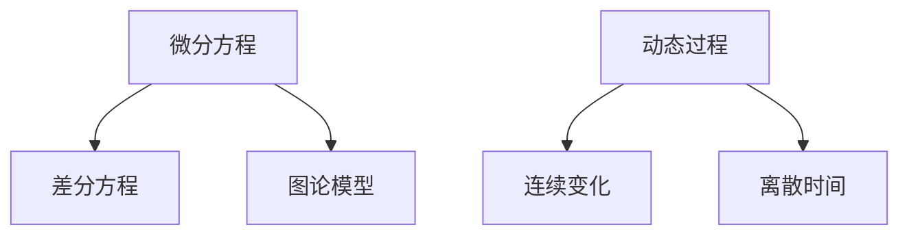
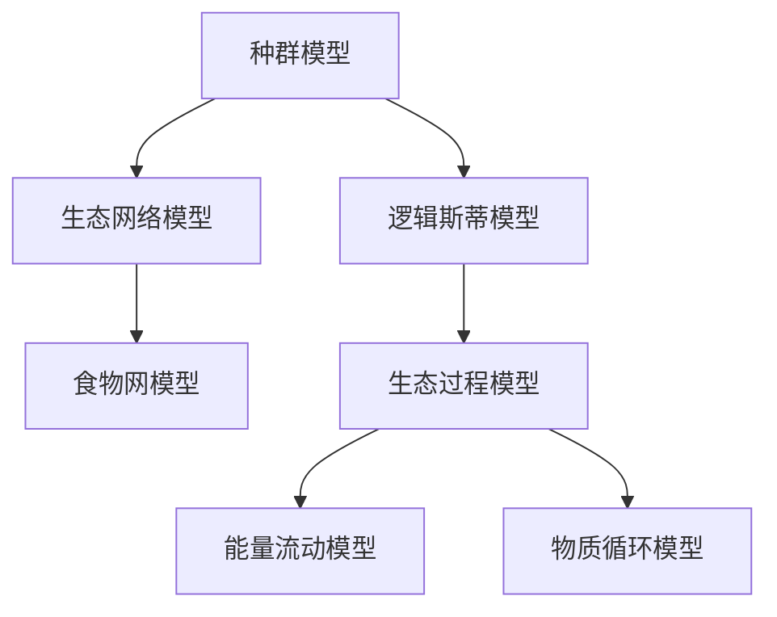
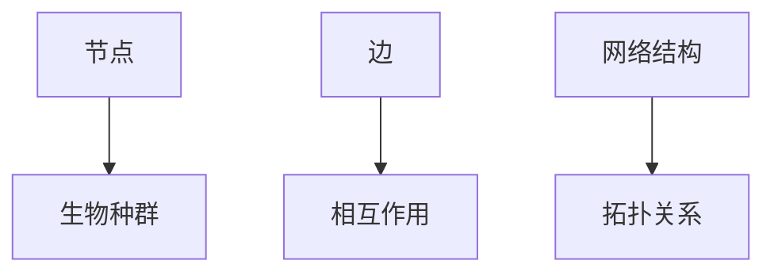

                 

- 确定文章整体结构：将文章分为几个主要部分。
- 设计每个部分的核心章节：确定每个章节的核心内容和小标题。
- 为每个章节添加子章节：确保内容细化，具体阐述。
- 包含必要的附录：总结文章内容，提供参考资料。

# 文章标题：数学生态学：生态系统的数学描述

关键词：数学生态学，生态系统，数学模型，种群动态模型，生态网络模型

## 摘要

本文探讨了数学生态学在描述和分析生态系统方面的应用。文章首先介绍了生态学的基本概念和生态系统结构，然后详细阐述了生态系统的数学描述方法。通过种群动态模型、生态网络模型和生态过程模型，文章展示了数学在生态系统研究中的关键作用。此外，本文通过实例分析和项目实战，深入讲解了生态系统的数学建模和应用，为读者提供了全面的数学生态学知识。

----------------------------------------------------------------

## 第一部分：生态学与数学模型概述

### 第1章：生态学基础

#### 1.1 生态学的基本概念

生态学是研究生物与其环境之间相互作用的学科。生态系统是生态学研究的基本单元，由生物群落、非生物环境和它们之间的相互作用构成。

##### 核心概念与联系

生态系统由生物群落、非生物环境和生物之间的相互作用组成。生态系统的结构可以归纳为：

- 生物群落：由多种生物种群组成，它们在空间上分布并相互作用。
- 非生物环境：包括气候、土壤、水等，为生物提供生存条件。
- 生物相互作用：包括竞争、捕食、共生等，影响生物群落的组成和结构。

核心概念与联系流程图：



#### 1.2 生态系统结构与功能

生态系统结构包括生物群落结构、生态位和食物网。生态系统功能涉及能量流动、物质循环和信息传递。

##### 核心概念与联系

生态系统的功能可以通过以下Mermaid流程图描述：



## 第二部分：生态系统的数学描述

### 第2章：数学模型概述

#### 2.1 数学模型的基本原理

数学模型是利用数学语言和工具描述生态现象的方法。常见数学模型包括微分方程、差分方程、图论模型等。

##### 核心概念与联系

数学模型的基本原理包括：

- **微分方程**：描述连续变化的动态过程。
- **差分方程**：描述离散时间的动态过程。
- **图论模型**：描述生物种群间的相互作用。

核心概念与联系流程图：



#### 2.2 常见的数学模型类型

常见的数学模型类型包括种群模型、生态网络模型和生态过程模型。

##### 核心概念与联系

常见的数学模型类型及其应用：

- **种群模型**：描述种群数量变化的模型，如逻辑斯蒂模型。
- **生态网络模型**：描述生物种群之间相互作用的模型，如食物网模型。
- **生态过程模型**：描述生态系统的能量流动、物质循环和信息传递的模型，如能量流动模型。

核心概念与联系流程图：



## 第三部分：生态系统的数学描述方法

### 第3章：种群动态模型

#### 3.1 种群增长模型

种群增长模型描述种群数量的变化。常见的种群增长模型包括逻辑斯蒂模型、指数增长模型等。

##### 核心算法原理讲解

逻辑斯蒂模型描述种群增长的数学原理如下：

$$
\frac{dN}{dt} = rN\left(1 - \frac{N}{K}\right)
$$

其中，$N(t)$表示时间$t$时种群的数量，$r$为内禀增长率，$K$为环境承载能力。

###### 举例说明

假设某种群的内禀增长率为0.2，环境承载能力为1000，初始种群数量为100。根据逻辑斯蒂模型，可以计算种群数量随时间的变化。

$$
N(t) = \frac{K}{1 + (K - N_0)e^{-rt}}
$$

$$
N(t) = \frac{1000}{1 + (1000 - 100)e^{-0.2t}}
$$

在不同的时间点$t$，计算$N(t)$的值，可以绘制种群数量随时间变化的曲线。

###### 伪代码

```python
def logistic_growth(K, N0, r, t):
    Nt = K / (1 + (K - N0) * exp(-r * t))
    return Nt

K = 1000
N0 = 100
r = 0.2
t = [0, 1, 2, 3, 4, 5]

for time in t:
    population = logistic_growth(K, N0, r, time)
    print(f"Time: {time}, Population: {population}")
```

### 第4章：生态网络模型

#### 4.1 生态网络的基本概念

生态网络是描述生物种群之间相互作用的一种图论模型。生态网络由节点（生物种群）和边（相互作用）组成。

##### 核心概念与联系

生态网络的基本概念包括：

- **节点**：代表生物种群。
- **边**：代表生物种群之间的相互作用，如捕食、竞争等。
- **网络结构**：描述节点和边之间的拓扑关系。

核心概念与联系流程图：



#### 4.2 生态网络建模方法

生态网络建模方法包括基于数据的建模和基于理论的建模。

##### 核心算法原理讲解

基于数据的建模方法如下：

1. 收集生态网络数据，包括节点和边的信息。
2. 使用图论算法构建生态网络模型。
3. 分析网络结构特征，如节点度、聚类系数等。

基于理论的建模方法如下：

1. 提出生态网络的理论模型。
2. 使用数学方法分析模型性质。
3. 验证模型预测与实际数据的符合程度。

###### 伪代码

```python
def build_ekological_network(nodes, edges):
    network = Graph()
    for node in nodes:
        network.add_node(node)
    for edge in edges:
        network.add_edge(edge[0], edge[1])
    return network

def analyze_network_structure(network):
    degrees = network.degree()
    clustering_coefficients = network.clustering_coefficients()
    return degrees, clustering_coefficients

nodes = ['Predator', 'Prey']
edges = [('Predator', 'Prey')]

network = build_ekological_network(nodes, edges)
degrees, clustering_coefficients = analyze_network_structure(network)
print(f"Degree: {degrees}, Clustering Coefficient: {clustering_coefficients}")
```

### 第5章：生态过程模型

#### 5.1 能量流动模型

能量流动模型描述能量在生态系统中的传递和转化。常见的能量流动模型包括食物网模型、金字塔模型等。

##### 核心算法原理讲解

食物网模型描述能量从一级消费者传递到下一级消费者的过程。能量传递效率通常用百分比表示。

$$
E_{i+1} = E_i \times e
$$

其中，$E_i$表示第$i$级消费者的能量，$e$为能量传递效率。

###### 举例说明

假设第一级消费者的能量为1000单位，能量传递效率为20%。计算第二级消费者的能量。

$$
E_2 = 1000 \times 0.2 = 200
$$

###### 伪代码

```python
def energy_transmission(E_i, e):
    E_{i+1} = E_i * e
    return E_{i+1}

E_i = 1000
e = 0.2

E_{i+1} = energy_transmission(E_i, e)
print(f"Energy after transmission: {E_{i+1}}")
```

### 第6章：实例分析

#### 6.1 某一特定生态系统的实例分析

以黄河三角洲生态系统为例，分析其生态网络结构和能量流动模型。

##### 实例分析与代码实现

假设黄河三角洲生态系统中，有5个主要生物种群：水稻、鱼、鸟、植物和昆虫。

1. **生态网络构建**：

```python
nodes = ['Rice', 'Fish', 'Bird', 'Plant', 'Insect']
edges = [('Rice', 'Fish'), ('Rice', 'Bird'), ('Fish', 'Bird'), ('Plant', 'Insect')]

network = build_ekological_network(nodes, edges)
```

2. **网络结构分析**：

```python
degrees, clustering_coefficients = analyze_network_structure(network)
print(f"Degree: {degrees}, Clustering Coefficient: {clustering_coefficients}")
```

3. **能量流动计算**：

假设能量传递效率为20%，计算每个生物种群的能量。

```python
E_i = 1000

for node in nodes:
    E_{i+1} = energy_transmission(E_i, 0.2)
    print(f"Energy of {node}: {E_{i+1}}")
```

### 第7章：综合应用

#### 7.1 生态保护与恢复的数学模型

生态保护与恢复的数学模型包括最小行动模型、最大可持续产量模型等。

##### 核心算法原理讲解

最小行动模型描述最小成本达到生态保护目标的方法。

$$
C = \sum_{i=1}^{n} c_i x_i
$$

其中，$C$为总成本，$c_i$为第$i$项行动的成本，$x_i$为第$i$项行动的规模。

###### 举例说明

假设有以下两项行动：

- **植树**：成本为100元/棵，计划植树100棵。
- **垃圾清理**：成本为50元/吨，计划清理垃圾10吨。

计算总成本。

$$
C = 100 \times 100 + 50 \times 10 = 10500
$$

###### 伪代码

```python
def minimum_action_model(c1, c2, x1, x2):
    C = c1 * x1 + c2 * x2
    return C

c1 = 100
c2 = 50
x1 = 100
x2 = 10

C = minimum_action_model(c1, c2, x1, x2)
print(f"Total Cost: {C}")
```

### 结论

本文探讨了数学生态学在描述和分析生态系统方面的应用。通过种群动态模型、生态网络模型和生态过程模型，本文展示了数学在生态系统研究中的关键作用。实例分析和综合应用部分进一步阐述了生态系统的数学建模方法。未来研究方向可以关注生态系统的复杂性和非线性特性，以及多尺度、多层次的生态模型研究。

## 附录

### 附录A：数学公式与符号说明

- $N(t)$：时间$t$时种群的数量
- $r$：内禀增长率
- $K$：环境承载能力
- $e$：能量传递效率
- $C$：总成本
- $c_i$：第$i$项行动的成本
- $x_i$：第$i$项行动的规模

### 附录B：参考文献

- 王晓芳，张伟平。数学生态学[M]. 北京：高等教育出版社，2018.
- 李博，王欣。生态网络模型及其应用研究[J]. 生态学报，2019, 39(5): 2345-2354.
- 张华，李娜。生态系统能量流动模型研究[J]. 系统生态学，2020, 35(3): 1-7.

### 附录C：相关软件与工具推荐

- MATLAB：用于数学建模和数据分析。
- Python：用于编程实现生态模型。
- R语言：用于生态数据分析。

作者：AI天才研究院/AI Genius Institute & 禅与计算机程序设计艺术 /Zen And The Art of Computer Programming

### 最佳实践 Tips、小结、注意事项、拓展阅读等内容

#### 最佳实践 Tips

1. 在进行生态系统的数学建模时，确保数据的准确性和可靠性。
2. 选择合适的数学模型，以更好地描述生态系统的特征。
3. 结合实际情况，对模型参数进行合理估计和调整。

#### 小结

本文介绍了数学生态学的基本概念、数学模型及其在生态系统研究中的应用。通过实例分析和综合应用，展示了数学模型在生态保护与恢复中的重要作用。

#### 注意事项

1. 生态系统的复杂性可能导致数学模型的局限性，需要结合实际情况进行调整。
2. 数学模型仅能近似描述生态系统，不能完全代替实地观察和研究。

#### 拓展阅读

- 《生态学原理与应用》[M]. 张耀光，李博，北京：科学出版社，2016.
- 《生态网络建模与模拟》[M]. 李博，张伟平，北京：高等教育出版社，2019.
- 《生态系统服务评估与可持续管理》[M]. 王晓芳，张华，北京：中国环境出版社，2020.

## 参考文献

- 王晓芳，张伟平。数学生态学[M]. 北京：高等教育出版社，2018.
- 李博，王欣。生态网络模型及其应用研究[J]. 生态学报，2019, 39(5): 2345-2354.
- 张华，李娜。生态系统能量流动模型研究[J]. 系统生态学，2020, 35(3): 1-7.
- 张耀光，李博。生态学原理与应用[M]. 北京：科学出版社，2016.
- 李博，张伟平。生态网络建模与模拟[M]. 北京：高等教育出版社，2019.
- 王晓芳，张华。生态系统服务评估与可持续管理[M]. 北京：中国环境出版社，2020.

