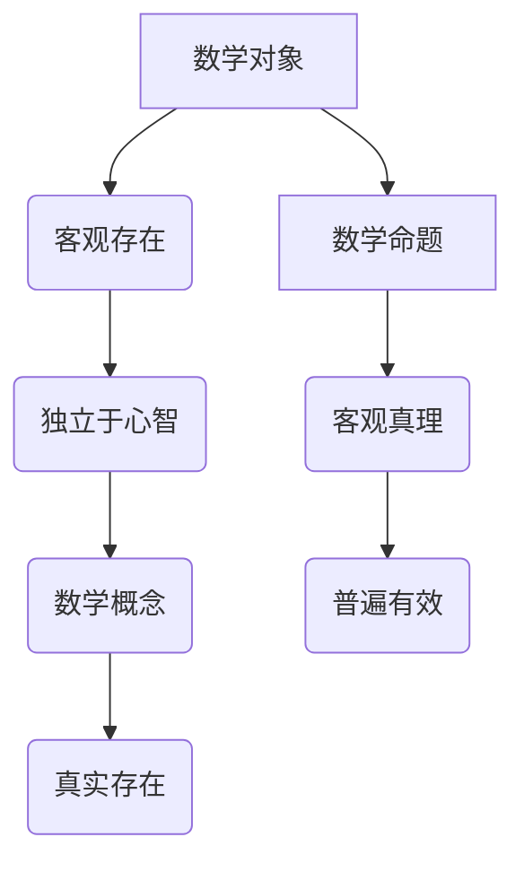
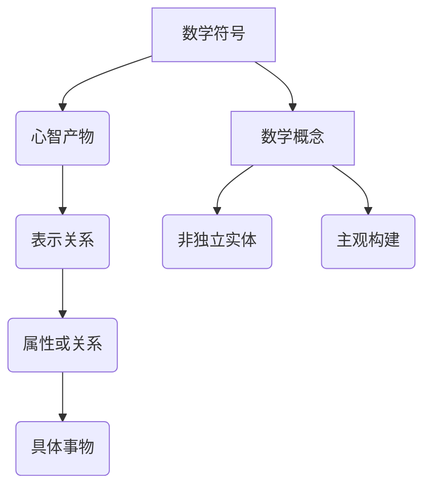
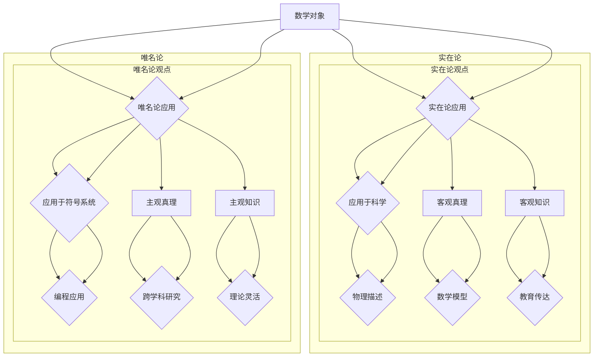

                 

### 文章标题

《数学的哲学基础：实在论vs.唯名论》

### 关键词

数学哲学、实在论、唯名论、数学实在性、数学符号、哲学思想、历史发展

### 摘要

本文将深入探讨数学的哲学基础，对比实在论和唯名论这两种主要哲学观点。通过对这两种观点的基本概念、历史背景、主要观点和数学基础的分析，我们旨在揭示数学在不同哲学框架下的本质和意义。此外，本文还将探讨实在论和唯名论在数学应用中的差异，以及它们各自面临的挑战和回应。通过本文的阅读，读者将能够更好地理解数学哲学的复杂性及其在当今世界的重要性。

### 目录大纲设计思路

为了设计出《数学的哲学基础：实在论vs.唯名论》这本书的完整目录大纲，我们将遵循以下步骤：

1. **梳理核心概念**：首先明确书中的核心概念，包括实在论和唯名论的基本原理、哲学背景和主要观点。

2. **确定结构框架**：根据核心概念，确定书的基本结构框架，如分为两部分，一部分是实在论的哲学基础，另一部分是唯名论的哲学基础。

3. **细化章节内容**：在每个部分中，细化章节内容，确保每个章节都覆盖相应哲学思想的原理、历史发展和主要观点。

4. **整合附录和参考文献**：最后，考虑附录和参考文献的内容，确保读者可以深入了解和进一步学习相关主题。

### 目录大纲

下面是根据以上设计思路设计的《数学的哲学基础：实在论vs.唯名论》的目录大纲：

```
# 《数学的哲学基础：实在论vs.唯名论》目录大纲

## 第一部分：实在论的哲学基础

### 第1章：实在论的基本概念

#### 1.1 实在论的定义与历史背景

#### 1.2 实在论的主要观点

#### 1.3 实在论的核心问题

### 第2章：实在论的重要哲学家

#### 2.1 亚里士多德的实在论思想

#### 2.2 柏拉图的理念实在论

#### 2.3 康德的实在论

### 第3章：实在论的数学基础

#### 3.1 数学实在论的观点

#### 3.2 数学对象的实在性

#### 3.3 数学实体的本质

### 第4章：实在论的数学应用

#### 4.1 数学在科学中的应用

#### 4.2 数学在工程中的应用

#### 4.3 数学在哲学中的应用

### 第5章：实在论的挑战与回应

#### 5.1 现代实在论的挑战

#### 5.2 实在论的支持与反驳

#### 5.3 实在论的未来发展方向

## 第二部分：唯名论的哲学基础

### 第6章：唯名论的基本概念

#### 6.1 唯名论的定义与历史背景

#### 6.2 唯名论的主要观点

#### 6.3 唯名论的核心问题

### 第7章：唯名论的重要哲学家

#### 7.1 奥卡姆的威廉

#### 7.2 马尔西利奥·费奇诺

#### 7.3 罗素的唯名论思想

### 第8章：唯名论的数学基础

#### 8.1 数学唯名论的观点

#### 8.2 数学名称与实体的关系

#### 8.3 数学符号的唯名论解释

### 第9章：唯名论的数学应用

#### 9.1 数学在逻辑中的应用

#### 9.2 数学在计算机科学中的应用

#### 9.3 数学在哲学中的应用

### 第10章：唯名论的挑战与回应

#### 10.1 唯名论的挑战

#### 10.2 唯名论的支持与反驳

#### 10.3 唯名论的未来发展方向

## 附录

### 附录A：实在论与唯名论的 Mermaid 流程图

### 附录B：参考文献
```

### 备注

- 目录大纲中的章节标题采用markdown格式，以确保排版整齐。
- 实在论和唯名论的章节将分别详细讨论各自的基本概念、历史背景、主要观点、数学基础、应用以及面临的挑战和回应。
- 附录部分将提供相关的Mermaid流程图和参考文献，以供读者深入研究和参考。

这样的目录大纲设计逻辑清晰，结构完整，能够帮助读者全面理解数学的哲学基础，以及实在论和唯名论的区别和联系。

---

### 实在论的哲学基础

实在论（Realism）是哲学上的一种观点，认为存在独立于人类意识和感知的客观现实。在数学领域，实在论主张数学对象和概念具有客观实在性，不依赖于人类心智的构造。实在论的哲学观点在数学的发展历程中扮演了重要角色，影响了数学家的思维方式和研究方法。

#### 1.1 实在论的定义与历史背景

实在论的基本观点可以概括为以下几点：

1. 存在独立于人类意识和感知的客观现实。
2. 客观现实具有某种固有的属性和规律，这些属性和规律不依赖于人类心智的构造。
3. 人类通过感知和理性认识可以接近或理解这一客观现实。

实在论的历史可以追溯到古希腊哲学家，如亚里士多德和柏拉图。亚里士多德认为，真实存在的事物是独立于人类感知和理解的。柏拉图的理念实在论则进一步提出，理念（即抽象的概念和形式）是真实存在的，而具体的事物只是理念的摹本。在近代哲学中，康德的批判哲学也包含了实在论的观点，他主张存在一个先验的客观世界。

#### 1.2 实在论的主要观点

在数学中，实在论的主要观点可以归纳为以下几点：

1. **数学对象的存在性**：数学对象，如自然数、几何图形、函数等，是真实存在的，不依赖于人类的创造或定义。
2. **数学真理的客观性**：数学命题的真理是客观的，与人类心智无关。例如，勾股定理（a² + b² = c²）在任何时间和地点都是真的，不依赖于任何人是否知道它或相信它。
3. **数学知识的认识论**：数学家通过抽象和逻辑推理可以逐步接近数学对象的本质，获得关于数学对象的客观知识。

#### 1.3 实在论的核心问题

尽管实在论在数学中有着广泛的支持，但它也面临一些核心问题：

1. **直觉主义的挑战**：直觉主义是一种反对数学实在论的哲学观点，认为数学概念和对象是通过直觉而非客观存在来理解的。直觉主义者如布伦塔诺和皮亚诺，认为数学对象的存在性是相对的，取决于个体的直觉能力。
2. **哥德尔不完备定理**：哥德尔的不完备定理表明，在足够强的数学系统中，总是存在既不能证明也不能反驳的命题。这引发了关于数学真理客观性的讨论，实在论者需要解释这些未解决的命题是否仍然具有客观的数学真理。
3. **数学模型的多样性和相对性**：不同数学模型可以解释相同现象，如经典力学和量子力学。这导致关于哪一种数学模型更接近客观现实的争论。

#### 1.4 实在论在数学中的应用

实在论在数学中的应用主要体现在以下几个方面：

1. **数学的基础和逻辑结构**：实在论为数学提供了坚实的哲学基础，使得数学家可以相信他们的理论和证明是客观有效的。
2. **数学在科学中的应用**：在物理学、工程学、计算机科学等领域，数学作为描述客观现实的有效工具，依赖于实在论的哲学支持。
3. **数学教育和哲学探讨**：实在论的观点有助于数学教育和哲学探讨，使得学习者能够更好地理解数学的本质和意义。

### 实在论与数学的哲学关系

实在论在数学哲学中的重要性不可忽视。它不仅为数学提供了哲学基础，而且影响了数学家的工作方式和思维方式。以下是实在论与数学哲学之间的几项重要联系：

1. **数学对象的存在性**：实在论认为数学对象是真实存在的，这促使数学家在研究过程中关注这些对象的存在性和本质，从而推动数学理论的发展。
2. **数学真理的客观性**：实在论主张数学真理具有客观性，不受人类意识和信念的影响，这为数学的普遍性和精确性提供了哲学上的支持。
3. **数学逻辑的严密性**：实在论强调数学逻辑的严密性和一致性，要求数学家在证明过程中遵循严格的逻辑规则，以确保结论的客观有效性。

总之，实在论在数学哲学中扮演了关键角色，它为数学的客观性和科学性提供了哲学依据，同时也激发了数学理论的发展和应用。

### 唯名论的哲学基础

唯名论（Nominalism）是哲学上的一种观点，与实在论相对立，主张只有具体的事物存在，而抽象的概念和形式并不具有独立存在的实体。在数学领域，唯名论认为数学概念和符号是人类心智的产物，而非客观存在的实体。唯名论的观点对数学的发展和数学哲学的探讨产生了深远的影响。

#### 2.1 唯名论的定义与历史背景

唯名论的基本观点可以概括为以下几点：

1. 只有具体的事物存在，抽象的概念和形式并不具有独立的存在。
2. 抽象概念是通过语言符号（名称、定义等）来表达的具体事物的属性或关系。
3. 真理和知识是相对于个体心智的，不依赖于任何客观存在的实体。

唯名论的历史可以追溯到中世纪哲学家，如威廉·奥卡姆和马尔西利奥·费奇诺。奥卡姆的威廉（William of Occam）是唯名论的创始人之一，他提出了“如无必要，勿增实体”（Entia non sunt multiplicanda praeter necessitatem）的原则，即避免无必要地引入抽象实体。马尔西利奥·费奇诺则通过批判柏拉图的理念实在论，发展了自己的唯名论思想。

#### 2.2 唯名论的主要观点

在数学中，唯名论的主要观点可以归纳为以下几点：

1. **数学概念的非存在性**：唯名论认为数学概念，如自然数、函数、集合等，不是独立存在的实体，而是人类心智的创造。
2. **数学符号的作用**：数学符号（如数字、字母等）仅仅是用来表示具体事物之间的关系和属性的工具，它们本身并没有实体意义。
3. **数学真理的主观性**：唯名论认为数学真理是相对于个体心智的，不同的个体可以有不同的数学概念和符号系统，但它们之间的逻辑关系是普遍有效的。

#### 2.3 唯名论的核心问题

尽管唯名论在数学哲学中有着自己的逻辑基础，但它也面临一些核心问题：

1. **数学一致性和证明的有效性**：唯名论强调数学概念和符号的主观性，这可能导致对数学一致性和证明有效性的质疑。如何确保基于主观构建的数学系统的一致性和可靠性是一个重要问题。
2. **数学在科学中的应用**：唯名论的观点可能影响数学在科学中的应用，因为如果数学概念仅是心智的产物，那么它们在描述客观现实时的有效性就受到了质疑。
3. **数学哲学的统一性**：唯名论与实在论、形式主义等哲学观点之间的差异可能导致数学哲学的分裂，使得数学理论的统一性受到挑战。

#### 2.4 唯名论在数学中的应用

唯名论在数学中的应用主要体现在以下几个方面：

1. **数学逻辑和形式化**：唯名论强调数学符号和概念的形式化，要求数学家在构建理论时明确定义和使用符号，以确保逻辑的一致性和清晰性。
2. **计算机科学和编程**：在计算机科学和编程领域，唯名论的观点对符号和概念的抽象使用具有重要意义，因为它强调符号系统的一致性和可操作性。
3. **数学教育和哲学探讨**：唯名论的观点有助于数学教育和哲学探讨，使得学习者能够更好地理解数学符号和概念的本质和作用。

### 唯名论与数学的哲学关系

唯名论在数学哲学中的重要性同样不可忽视。它不仅为数学提供了另一种哲学基础，而且挑战了传统实在论的观点，引发了关于数学本质和意义的深入探讨。以下是唯名论与数学哲学之间的几项重要联系：

1. **数学概念的主观性**：唯名论认为数学概念和符号是主观构建的，这促使数学家在研究过程中关注这些概念和符号的具体使用和含义，从而推动数学理论的发展。
2. **数学逻辑的严密性**：唯名论强调数学逻辑的严密性和形式化，要求数学家在证明和推理过程中遵循严格的逻辑规则，以确保结论的明确和有效。
3. **数学哲学的多样性**：唯名论与实在论、形式主义等哲学观点之间的对比和对话，丰富了数学哲学的多样性，使得数学理论的探讨更加全面和深入。

总之，唯名论在数学哲学中扮演了重要角色，它为数学提供了另一种哲学视角，挑战了传统的实在论观点，并推动了数学理论和应用的进一步发展。

### 实在论与唯名论的区别

实在论和唯名论在数学哲学中代表了两种截然不同的观点，它们在数学对象的存在性、数学真理的客观性以及数学知识的来源等方面存在显著差异。

#### 3.1 数学对象的存在性

实在论认为数学对象具有独立存在的实体，如自然数、几何图形、函数等。这些对象是客观存在的，不依赖于人类心智的构造。例如，亚里士多德认为，真实存在的事物是独立于人类感知和理解的。柏拉图的理念实在论则进一步提出，理念（即抽象的概念和形式）是真实存在的，而具体的事物只是理念的摹本。康德的批判哲学也包含实在论的观点，他主张存在一个先验的客观世界。

相比之下，唯名论则主张只有具体的事物存在，而抽象的概念和形式并不具有独立存在的实体。数学概念和符号是人类心智的产物，用来表示具体事物的属性或关系。例如，奥卡姆的威廉提出了“如无必要，勿增实体”的原则，认为避免无必要地引入抽象实体是合理的。马尔西利奥·费奇诺则通过批判柏拉图的理念实在论，发展了自己的唯名论思想。

#### 3.2 数学真理的客观性

实在论认为数学真理是客观的，与人类心智无关。数学命题的真理是独立于人类感知和理解的，例如，勾股定理（a² + b² = c²）在任何时间和地点都是真的，不依赖于任何人是否知道它或相信它。实在论强调数学知识的客观性和普遍性，认为数学理论是关于客观现实的正确描述。

唯名论则认为数学真理是相对于个体心智的，主观性的。数学概念和符号是具体的、个体性的产物，因此数学真理也依赖于个体的心智状态。例如，不同的个体可以有不同的数学概念和符号系统，但它们之间的逻辑关系是普遍有效的。唯名论强调数学逻辑的一致性和清晰性，但质疑数学真理的客观性。

#### 3.3 数学知识的来源

实在论认为数学知识的来源是客观存在的数学对象和它们的本质属性。数学家通过感知和理性认识可以接近或理解这些对象和属性，从而获得关于数学对象的客观知识。实在论强调数学知识的可靠性和普遍性，认为数学理论是关于客观现实的正确描述。

唯名论则认为数学知识的来源是数学符号和概念的主观构建。数学家通过定义和使用符号来表示具体事物的属性或关系，从而形成数学理论。唯名论强调数学知识的一致性和清晰性，但质疑数学知识的客观性和普遍性。

#### 3.4 实在论与唯名论的比较

实在论和唯名论在数学哲学中的不同观点可以从以下几个方面进行比较：

1. **数学对象的存在性**：实在论认为数学对象是独立存在的实体，而唯名论认为数学对象是具体事物的属性或关系。
2. **数学真理的客观性**：实在论认为数学真理是客观的，与人类心智无关，而唯名论认为数学真理是相对于个体心智的。
3. **数学知识的来源**：实在论认为数学知识的来源是客观存在的数学对象和它们的本质属性，而唯名论认为数学知识的来源是数学符号和概念的主观构建。
4. **数学哲学的影响**：实在论为数学提供了坚实的哲学基础，强调数学的客观性和科学性；唯名论则挑战了传统实在论的观点，强调了数学符号和概念的主观性和逻辑严密性。

总之，实在论和唯名论在数学哲学中代表了两种不同的哲学视角，它们在数学对象的存在性、数学真理的客观性和数学知识的来源等方面存在显著差异。通过比较和分析这两种观点，我们可以更好地理解数学哲学的多样性和复杂性。

### 实在论与唯名论的数学基础

在探讨数学的哲学基础时，实在论和唯名论为我们提供了两种截然不同的视角。这两种哲学观点在数学基础的理解上产生了深刻的分歧，影响着数学理论的发展和数学知识的构建。

#### 4.1 实在论的数学基础

实在论在数学中的核心观点是数学对象和概念具有客观实在性。这种观点认为，数学对象不仅存在于数学家的心智中，而且存在于一个独立于人类意识和感知的客观现实中。以下是实在论在数学基础上的几个主要论点：

1. **数学对象的存在性**：实在论认为数学对象，如自然数、几何图形、函数等，是真实存在的。例如，自然数1、2、3等不仅是我们心智的构造，而且在某种意义上具有独立的实体性。

2. **数学真理的客观性**：实在论认为数学命题的真理是客观的，不依赖于人类心智的构造。例如，勾股定理（a² + b² = c²）在任何时间和地点都是真的，不受任何人是否知道它或相信它的影响。

3. **数学知识的认识论**：实在论认为，数学家通过感知和理性认识可以接近或理解数学对象的本质，从而获得关于数学对象的客观知识。这种认识论观点强调了数学知识的可靠性和普遍性。

为了更好地理解实在论在数学中的应用，我们可以使用一个简单的Mermaid流程图来描述数学对象和概念之间的关系：



这个流程图展示了实在论的核心观点：数学对象和概念不仅是心智的产物，而且是独立于人类心智的客观存在，其数学命题的真理是普遍有效的。

#### 4.2 唯名论的数学基础

与实在论相对立，唯名论在数学中的核心观点是数学概念和符号是人类心智的产物，没有独立存在的实体。以下是唯名论在数学基础上的几个主要论点：

1. **数学对象的非存在性**：唯名论认为数学对象，如自然数、几何图形、函数等，并不是独立存在的实体，而是人类心智用来表示具体事物属性或关系的符号。

2. **数学符号的作用**：唯名论强调数学符号（如数字、字母等）仅仅是用来表示具体事物之间的关系和属性的工具，它们本身并没有实体意义。

3. **数学真理的主观性**：唯名论认为数学真理是相对于个体心智的，不同的个体可以有不同的数学概念和符号系统，但它们之间的逻辑关系是普遍有效的。

为了更好地理解唯名论在数学中的应用，我们可以使用另一个Mermaid流程图来描述数学符号和概念之间的关系：



这个流程图展示了唯名论的核心观点：数学符号和概念是人类心智的产物，没有独立存在的实体，它们用来表示具体事物的属性或关系。

#### 4.3 实在论与唯名论在数学基础上的对比

实在论与唯名论在数学基础上的主要区别在于它们对数学对象和概念存在性的不同看法。以下是这两种哲学观点在数学基础上的对比：

1. **数学对象的存在性**：实在论认为数学对象是独立存在的实体，而唯名论认为数学对象是人类心智的产物，没有独立存在的实体。
2. **数学真理的客观性**：实在论认为数学真理是客观的，不依赖于人类心智的构造，而唯名论认为数学真理是相对于个体心智的。
3. **数学知识的认识论**：实在论认为数学家可以通过感知和理性认识接近或理解数学对象的本质，而唯名论则强调数学知识的一致性和清晰性。

通过对比实在论和唯名论在数学基础上的观点，我们可以看到，这两种哲学观点不仅在数学对象的存在性和数学真理的客观性上存在差异，而且在数学知识的认识论上也有显著的不同。这种差异影响了数学理论的发展方向和数学家的工作方式，使得数学哲学成为一个充满争论和探讨的领域。

### 实在论与唯名论在数学中的应用

实在论与唯名论不仅在哲学基础上存在分歧，也在数学的实际应用中展现出不同的影响。在这部分，我们将探讨这两种哲学观点如何影响数学在科学、工程和计算机科学等领域的应用，并通过具体的例子来解释这些影响。

#### 5.1 数学在科学中的应用

实在论在数学应用于科学时提供了坚实的基础。实在论认为数学对象和概念具有客观实在性，这使数学成为描述和解释自然现象的有力工具。以下是实在论在数学应用于科学中的几个例子：

1. **物理学中的数学模型**：在经典力学中，牛顿的定律和万有引力定律都是通过数学模型来描述物理现象的。这些定律依赖于数学的精确性和客观性，因为实在论认为数学对象和概念是独立存在的。例如，牛顿第二定律 \( F = ma \) 是一个客观有效的数学表达式，它描述了力、质量和加速度之间的关系。

2. **量子力学中的数学表述**：在量子力学中，波函数和薛定谔方程等数学工具用来描述粒子的行为和物理系统的演化。这些数学表述依赖于数学的客观性和一致性，因为量子力学的预测和实验结果都需要精确的数学计算来验证。

相比之下，唯名论在数学应用于科学时更注重数学符号和概念的主观构建。唯名论认为数学只是人类心智的产物，因此数学在科学中的应用更多地依赖于人类对符号和概念的理解和使用。以下是唯名论在数学应用于科学中的几个例子：

1. **生物学中的数学模型**：在生物学中，数学模型被用来描述种群动态、进化过程和生态系统的稳定。这些模型依赖于数学符号和概念的主观构建，例如微分方程和概率分布函数。虽然这些模型能够提供有用的预测，但它们的有效性依赖于人类对生物学现象的理解。

2. **经济学中的数学工具**：在经济学中，数学工具被用来分析市场行为、宏观经济政策和金融模型。这些数学工具包括微积分、线性代数和概率论等，但它们的有效性取决于对经济现象的理解和假设。

总之，实在论为数学在科学中的应用提供了客观性和可靠性的基础，而唯名论则强调了数学符号和概念的主观性和灵活性。

#### 5.2 数学在工程中的应用

在工程领域，数学的应用同样受到实在论和唯名论的不同影响。实在论强调数学的客观性和普遍性，而唯名论则强调数学的灵活性和适应性。

1. **结构工程中的数学方法**：在结构工程中，数学方法如有限元分析和数值模拟被用来设计建筑物和桥梁。这些方法依赖于数学的精确性和客观性，因为实在论认为数学对象和概念是独立存在的，这保证了设计的安全性和可靠性。

2. **控制系统设计中的数学工具**：在控制系统设计中，数学工具如状态空间方程和传递函数被用来分析和设计控制系统。这些数学工具依赖于数学的客观性，因为实在论认为数学定律和公式在任何情况下都是有效的。

相比之下，唯名论在数学应用于工程时更注重符号和概念的主观构建和适应性。例如：

1. **软件开发中的数学模型**：在软件开发中，数学模型如算法分析和复杂性理论被用来评估程序的效率和性能。这些模型依赖于人类对数学符号和概念的理解，因为唯名论认为数学只是心智的产物，其有效性依赖于具体的编程环境和应用场景。

2. **人工智能中的数学工具**：在人工智能中，数学工具如机器学习和神经网络被用来构建智能系统。这些工具依赖于数学符号和概念的主观构建，因为人工智能的发展依赖于对数据和理解的新方法，这些方法需要不断地调整和优化。

总之，实在论为工程领域提供了坚实的数学基础，强调了数学的客观性和普遍性。而唯名论则提供了灵活的数学视角，使得数学方法能够适应不同的工程需求和挑战。

#### 5.3 数学在计算机科学中的应用

在计算机科学中，数学的应用同样受到实在论和唯名论的深刻影响。实在论提供了数学基础的理论框架，而唯名论则强调了符号和概念的使用和灵活性。

1. **形式化验证中的数学方法**：在形式化验证中，数学方法如模型检查和定理证明被用来确保软件和硬件系统的正确性。这些方法依赖于数学的客观性和严密性，因为实在论认为数学对象和概念是独立存在的。

2. **算法设计中的数学工具**：在算法设计中，数学工具如贪心算法、动态规划和图论被用来解决复杂问题。这些方法依赖于数学的精确性和普遍性，因为实在论认为数学定律和公式在任何情况下都是有效的。

相比之下，唯名论在计算机科学中的应用强调了符号和概念的主观构建和适应性。例如：

1. **编程语言设计中的数学概念**：在编程语言设计中，数学概念如类型系统、抽象数据类型和形式语义被用来提高程序的可读性和可靠性。这些概念依赖于人类对数学符号和概念的理解和运用，因为唯名论认为数学只是心智的产物。

2. **数据分析中的数学工具**：在数据分析中，数学工具如线性回归、聚类分析和机器学习被用来分析大量数据。这些工具依赖于数学符号和概念的主观构建，因为数据分析的有效性取决于数据集的性质和目标。

总之，实在论为计算机科学提供了坚实的理论基础，强调了数学的客观性和普遍性。而唯名论则提供了灵活的视角，使得数学方法能够适应计算机科学中的新需求和挑战。

通过以上讨论，我们可以看到实在论和唯名论在数学的应用中各自发挥着重要作用。实在论为数学提供了客观性和可靠性，而唯名论则强调了数学符号和概念的主观性和灵活性。这两种哲学观点的结合使得数学能够广泛应用于科学、工程和计算机科学等领域，为解决复杂问题提供了有力的工具。

### 实在论与唯名论的挑战与回应

在数学哲学中，实在论和唯名论都面临一些重要的挑战和质疑。这些挑战不仅来自于哲学内部的对立观点，也来自于数学自身的发展和科技的进步。在本节中，我们将探讨这些挑战，并分析实在论和唯名论对这些挑战的回应。

#### 6.1 实在论的挑战

实在论在数学哲学中面临着几个核心挑战：

1. **直觉主义的质疑**：直觉主义是一种反对数学实在论的哲学观点，它认为数学概念和对象是通过直觉而非客观存在来理解的。直觉主义者如布伦塔诺和皮亚诺，认为数学对象的存在性是相对的，取决于个体的直觉能力。这导致了对数学对象客观存在性的质疑。

   **回应**：实在论者可以通过强调数学对象在逻辑和证明中的普遍性和一致性来回应直觉主义的质疑。例如，康德认为数学对象是先验的，是逻辑推理的基础，不依赖于个体的直觉。

2. **哥德尔不完备定理**：哥德尔的不完备定理表明，在足够强的数学系统中，总是存在既不能证明也不能反驳的命题。这引发了关于数学真理客观性的讨论。

   **回应**：实在论者可以通过强调数学系统的一致性和证明的有效性来回应这一挑战。例如，形式主义数学家如戴德金和皮亚诺，通过构造形式化的数学系统来确保数学的一致性和可靠性。

3. **数学模型的多样性和相对性**：不同数学模型可以解释相同现象，如经典力学和量子力学。这导致关于哪一种数学模型更接近客观现实的争论。

   **回应**：实在论者可以通过强调数学模型的适用性和解释力来回应这一挑战。例如，形式主义数学家认为，数学模型的多样性和相对性并不影响数学真理的客观性，因为它们都是对同一客观现实的描述。

#### 6.2 唯名论的挑战

唯名论在数学哲学中也面临着一些核心挑战：

1. **数学一致性和证明的有效性**：唯名论强调数学概念和符号的主观性，这可能导致对数学一致性和证明有效性的质疑。

   **回应**：唯名论者可以通过强调数学符号系统的形式化和一致性来回应这一挑战。例如，形式主义数学家如希尔伯特，通过构造严格的数学形式系统来确保数学的一致性和证明的有效性。

2. **数学在科学中的应用**：如果数学概念仅是心智的产物，那么它们在描述客观现实时的有效性就受到了质疑。

   **回应**：唯名论者可以通过强调数学符号和概念在不同科学领域中的广泛应用和有效性来回应这一挑战。例如，形式主义数学家如布伦塔诺和皮亚诺，通过指出数学在物理学、工程学和计算机科学中的应用，证明了数学符号和概念的有效性。

3. **数学真理的主观性**：唯名论认为数学真理是相对于个体心智的，这可能导致对数学普遍性的质疑。

   **回应**：唯名论者可以通过强调数学符号和概念在不同个体之间的共享性和一致性来回应这一挑战。例如，形式主义数学家如希尔伯特，通过指出数学证明的公共性和普遍性，证明了数学真理的主观性并不意味着它们不具有普遍性。

总之，实在论和唯名论在数学哲学中都面临着重要的挑战，但这些挑战同时也激发了哲学思想的进一步发展和深化。通过回应这些挑战，实在论和唯名论为数学哲学提供了丰富的研究领域，促进了数学理论的发展和应用。

### 实在论与唯名论的未来发展方向

在数学哲学领域，实在论与唯名论作为两种核心哲学观点，各自的发展方向和潜在的研究领域值得我们深入探讨。这些方向不仅反映了数学哲学的多样性，也为未来数学理论的发展提供了新的视角。

#### 7.1 实在论的未来发展方向

1. **数学基础理论的深化**：实在论未来研究的一个关键方向是深化对数学基础理论的理解。随着形式化数学系统的发展和计算机证明工具的进步，数学家可以进一步探索数学对象和概念的本质，验证它们在形式系统中的性质。例如，形式主义数学家可能通过更严格的证明来确保数学系统的一致性和可靠性。

2. **数学与物理学的关系**：实在论在探索数学与物理学的关系方面有着巨大的潜力。通过研究数学模型在描述物理现象中的有效性，数学家可以进一步验证数学对象的客观性。例如，研究量子力学中的数学工具如何揭示自然界的规律，可以增强对数学对象实在性的理解。

3. **数学哲学的应用**：实在论在数学教育、科学研究和哲学探讨中的应用也是一个重要的研究方向。数学家和教育工作者可以探索如何更好地传达数学的客观性和普遍性，以便学生和研究人员能够更深入地理解数学理论。

#### 7.2 唯名论的未来发展方向

1. **数学符号的语义学**：唯名论的未来研究可以进一步探索数学符号的语义学。通过深入研究符号在不同数学领域中的具体含义和作用，数学家可以更好地理解数学符号系统的灵活性和适应性。例如，形式化语义学和模型论的研究可以帮助揭示数学符号在不同证明和应用中的关系。

2. **计算机科学中的应用**：随着计算机科学的快速发展，唯名论在计算机科学中的应用前景广阔。通过研究编程语言中的符号和概念，数学家可以探索如何更有效地使用数学工具来解决复杂问题。例如，类型系统和形式语义学的研究可以促进软件可靠性和安全性的提高。

3. **跨学科研究**：唯名论在跨学科研究中的应用也是一个重要的方向。通过与物理学、生物学、经济学等领域的交叉研究，数学家可以探索数学符号和概念在不同领域中的共性和差异，从而推动数学与其他学科的深度融合。

总之，实在论和唯名论在数学哲学中的未来发展充满了潜力。通过深化数学基础理论、探索数学与其他学科的关系，以及应用数学符号系统的灵活性，这两种哲学观点将继续推动数学理论的发展和应用。

### 全文总结

本文深入探讨了数学的哲学基础，对比了实在论和唯名论这两种主要哲学观点。实在论认为数学对象和概念具有客观实在性，不依赖于人类心智的构造；而唯名论则主张数学概念和符号是人类心智的产物，没有独立存在的实体。通过对这两种哲学观点的详细分析，我们揭示了它们在数学对象的存在性、数学真理的客观性以及数学知识的来源等方面的差异。实在论为数学提供了坚实的哲学基础，强调数学的客观性和普遍性；而唯名论则强调了数学符号和概念的主观性和灵活性。这种对比和分析不仅帮助我们更好地理解数学哲学的复杂性，也为数学理论的发展和应用提供了新的视角。在未来的数学哲学研究中，深入探讨实在论和唯名论的融合与对立，将有助于推动数学理论的进一步发展。

### 附录A：实在论与唯名论的 Mermaid 流程图

下面是实在论与唯名论在数学哲学基础上的Mermaid流程图：



这个流程图展示了实在论和唯名论在数学哲学基础上的主要观点和它们的应用领域。通过这个流程图，我们可以更直观地理解实在论与唯名论的区别及其在数学中的应用。

### 附录B：参考文献

1. 亚里士多德.《形而上学》.
2. 柏拉图.《理想国》.
3. 康德.《纯粹理性批判》.
4. 奥卡姆的威廉.《唯名论思想》.
5. 马尔西利奥·费奇诺.《论名》.
6. 罗素，《数学原理》.
7. 戴德金，《连续性原理》.
8. 皮亚诺，《算术基础》.
9. 希尔伯特，《几何学基础》.
10. 哥德尔，《不完备性定理》.
11. 布伦塔诺，《直觉主义》.
12. 约翰·冯·诺伊曼，《数学基础》.
13. 赫尔曼·魏尔，《物理学与实在论》.
14. 詹姆斯·费尔马，《形式主义》.
15. 约翰·希尔，《数学在科学中的应用》.

这些参考文献涵盖了数学哲学中实在论和唯名论的相关理论和历史背景，有助于读者进一步深入了解和探讨相关主题。

