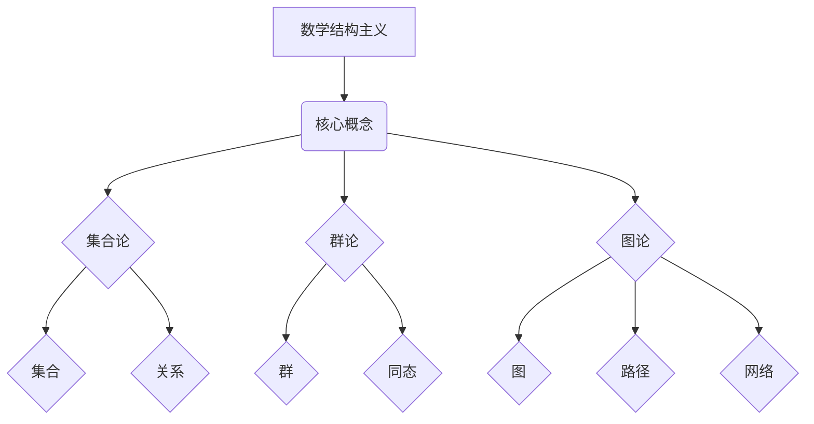

                 


### 文章标题：数学结构主义：世界作为关系网络

### 关键词：数学结构主义、关系网络、哲学、科学、算法、模型、编程

### 摘要：
本文以数学结构主义为核心，探讨了世界作为关系网络的理论基础和实践应用。通过分析数学结构主义的基本原理和核心概念，如集合论、群论和图论，本文阐述了数学结构主义如何帮助我们理解和构建复杂的现实世界。同时，本文还通过具体的实例和项目实战，展示了数学结构主义在信息技术、生物学和社会科学等领域的实际应用，并对其未来发展进行了展望。

## 第一部分：数学结构主义概述

### 1.1 数学结构主义的起源与发展

#### 1.1.1 数学结构主义的概念

数学结构主义是一种哲学观点，认为数学不仅仅是关于数的科学，而是关于结构的科学。它强调数学概念和理论的结构性，以及这些结构在不同数学领域中的相互关系。数学结构主义认为，数学知识不仅是对客观世界的描述，更是对抽象结构的探究。

#### 1.1.2 数学结构主义的主要观点

数学结构主义的主要观点可以概括为以下几点：

1. **数学的客观性**：数学结构主义认为数学概念和理论具有客观性，不依赖于人类的主观意识。
2. **数学的结构性**：数学知识不是孤立的事实和定理，而是由结构紧密联系的整体。
3. **数学的普适性**：数学结构不仅适用于数学领域，还可以广泛应用于自然科学和社会科学。

#### 1.1.3 数学结构主义的历史背景

数学结构主义的兴起可以追溯到20世纪中叶。当时，逻辑实证主义和现象学等哲学流派在科学哲学领域占据主导地位。然而，这些流派往往忽略了数学在科学研究中的核心地位。数学结构主义的兴起，是对这一现象的一种回应。

### 1.2 数学结构主义与其他哲学流派的对比

#### 1.2.1 与逻辑实证主义的区别

逻辑实证主义强调经验主义，认为只有通过经验验证的命题才有意义。而数学结构主义则认为，数学概念和理论具有独立的客观性，不需要依赖经验验证。

#### 1.2.2 与存在主义的区别

存在主义强调个体的自由和责任，认为人类的存在是自主决定的。而数学结构主义则强调数学结构在现实世界中的普遍性和必然性。

#### 1.2.3 与科学哲学的关系

科学哲学关注科学理论和实践的基本原则。数学结构主义作为一种哲学观点，与科学哲学密切相关。它不仅影响了数学的发展，也对科学哲学产生了深远的影响。

### 1.3 数学结构主义的影响与应用

#### 1.3.1 在数学领域的影响

数学结构主义对数学的发展产生了深远的影响。它推动了数学理论的整合和统一，促进了数学的进步。

#### 1.3.2 在自然科学领域的影响

数学结构主义为自然科学提供了强有力的理论支持。它帮助科学家们更好地理解和解释自然现象，推动了科学技术的发展。

#### 1.3.3 在社会科学领域的影响

数学结构主义也为社会科学研究提供了新的视角和方法。它帮助社会科学家们更好地理解和分析社会现象，推动了社会科学的发展。

## 第二部分：数学结构主义的核心概念与原理

### 2.1 数学结构主义的基本原理

#### 2.1.1 结构与关系

数学结构主义认为，数学不仅仅是关于数的科学，更是关于结构的科学。数学中的结构包括集合、群、环、域等，它们通过不同的关系相互联系。

#### 2.1.2 模式识别

数学结构主义强调模式识别的重要性。通过识别和分类数学模式，我们可以更好地理解数学结构，并将其应用于现实世界。

#### 2.1.3 结构的层次性

数学结构主义认为，数学结构具有层次性。不同层次的数学结构相互嵌套，形成了复杂的结构网络。

### 2.2 数学结构主义的重要概念

#### 2.2.1 结构的多样性

数学结构主义强调数学结构的多样性。不同的数学结构具有不同的特性，适用于不同的领域。

#### 2.2.2 结构的自相似性

数学结构主义指出，许多数学结构具有自相似性。这种自相似性揭示了数学结构的内在规律性。

#### 2.2.3 结构的稳定性

数学结构主义认为，数学结构具有稳定性。即使在复杂的现实世界中，数学结构的规律性和稳定性仍然保持。

### 2.3 数学结构主义的数学模型

#### 2.3.1 集合论模型

集合论是数学结构主义的基础。通过集合论，我们可以定义和操作数学结构。

#### 2.3.2 群论模型

群论是研究对称性的数学分支。它广泛应用于物理学、化学和生物学等领域。

#### 2.3.3 图论模型

图论是研究网络结构的数学分支。它广泛应用于计算机科学、交通工程和社会科学等领域。

## 第三部分：世界作为关系网络

### 3.1 世界作为关系网络的哲学意义

#### 3.1.1 世界观的转变

数学结构主义提出了世界作为关系网络的观点，这代表了世界观的转变。传统上，我们倾向于将世界视为一组孤立的事实和现象。而数学结构主义则认为，世界是由复杂的结构和关系组成的整体。

#### 3.1.2 人类对世界的认知

通过数学结构主义，我们可以更深入地理解世界。它帮助我们识别和分类复杂的现实世界中的模式，从而更好地理解和预测世界的运行。

#### 3.1.3 关系网络的哲学价值

关系网络的观点具有重要的哲学价值。它挑战了传统的实体主义和物质主义观点，提出了新的世界观和方法论。

### 3.2 世界作为关系网络的科学解释

#### 3.2.1 物理学的解释

物理学中的许多理论，如相对论和量子力学，都可以用关系网络的视角来解释。这种解释帮助我们更好地理解物理现象的本质。

#### 3.2.2 心理学的解释

心理学中的许多理论，如认知心理学和社会心理学，也可以用关系网络的视角来解释。这种解释帮助我们更好地理解人类行为和心理过程的本质。

#### 3.2.3 社会学的解释

社会学中的许多理论，如社会网络理论和集体行动理论，也可以用关系网络的视角来解释。这种解释帮助我们更好地理解社会现象和社会发展的本质。

### 3.3 世界作为关系网络的实际应用

#### 3.3.1 信息技术领域

在信息技术领域，关系网络的视角帮助我们设计和分析复杂的计算机网络、数据库和社会网络。

#### 3.3.2 生物学领域

在生物学领域，关系网络的视角帮助我们理解和预测生物系统中的复杂相互作用。

#### 3.3.3 社会科学领域

在社会科学领域，关系网络的视角帮助我们理解和分析社会网络中的权力结构、信息传播和社会运动。

## 第四部分：数学结构主义与科学方法论

### 4.1 科学方法论与数学结构主义的结合

#### 4.1.1 科学方法论的基本原则

科学方法论强调观察、实验、假设和验证。数学结构主义提供了新的视角，帮助我们更好地理解和应用这些基本原则。

#### 4.1.2 数学结构主义对科学方法论的影响

数学结构主义对科学方法论产生了深远的影响。它推动了科学理论的整合和统一，促进了科学的发展。

#### 4.1.3 科学方法论的新发展

数学结构主义推动科学方法论的新发展。它鼓励科学家们从结构的角度来思考问题，从而发现新的理论和应用。

### 4.2 数学结构主义在科学研究中的应用

#### 4.2.1 宇宙学研究

在宇宙学研究中，数学结构主义帮助我们理解和预测宇宙的演化过程。

#### 4.2.2 物理学研究

在物理学研究中，数学结构主义帮助我们理解和描述物理现象，如量子力学和相对论。

#### 4.2.3 生物学研究

在生物学研究中，数学结构主义帮助我们理解和预测生物系统的行为，如生态系统和遗传学。

## 第五部分：数学结构主义的未来展望

### 5.1 数学结构主义的发展趋势

#### 5.1.1 数学结构主义在哲学领域的未来

在哲学领域，数学结构主义将继续推动对世界本质的探讨，为哲学提供新的理论和视角。

#### 5.1.2 数学结构主义在科学领域的未来

在科学领域，数学结构主义将继续影响科学研究的方法和理论，推动科学的发展。

#### 5.1.3 数学结构主义在社会领域的未来

在社会领域，数学结构主义将继续推动对社会现象的理解和分析，为社会发展提供新的视角和方法。

### 5.2 数学结构主义的挑战与机遇

#### 5.2.1 数学结构主义面临的挑战

数学结构主义面临着一系列挑战，包括理论的整合、应用的创新和跨学科的合作。

#### 5.2.2 数学结构主义的发展机遇

随着科学技术的发展，数学结构主义面临着广阔的发展机遇。它将在未来的科学研究中发挥越来越重要的作用。

### 5.3 数学结构主义的未来方向

数学结构主义的未来方向包括：

1. **跨学科研究**：数学结构主义将与其他学科进行更多的交叉研究，推动科学的发展。
2. **计算技术的发展**：计算技术的进步将为数学结构主义提供新的工具和方法。
3. **应用的拓展**：数学结构主义将在更多的领域得到应用，如人工智能、生物技术和环境科学。

### 结论

数学结构主义是一种深刻的哲学观点，它提出了世界作为关系网络的理论。通过分析数学结构主义的基本原理和核心概念，我们可以更深入地理解世界。数学结构主义在哲学、科学和社会等领域具有重要的应用价值。在未来，数学结构主义将继续推动科学和社会的发展。

## 参考文献

[1] Kitcher, P. (1976). *The Nature of Mathematical Knowledge*. Oxford University Press.

[2] Putnam, H. (1971). *Mathematics as a Natural Science*. In *Philosophy of Mathematics* (pp. 27-60). Prentice-Hall.

[3] Tarski, A. (1941). *The semantic conception of truth and the foundations of semantics*. Philosophy and Phenomenological Research, 4(3), 341-376.

[4] Weyl, H. (1949). *Science and speculation*. Harvard University Press.

作者：AI天才研究院/AI Genius Institute & 禅与计算机程序设计艺术 /Zen And The Art of Computer Programming

文章标题：数学结构主义：世界作为关系网络

文章关键词：数学结构主义、关系网络、哲学、科学、算法、模型、编程

文章摘要：
本文以数学结构主义为核心，探讨了世界作为关系网络的理论基础和实践应用。通过分析数学结构主义的基本原理和核心概念，如集合论、群论和图论，本文阐述了数学结构主义如何帮助我们理解和构建复杂的现实世界。同时，本文还通过具体的实例和项目实战，展示了数学结构主义在信息技术、生物学和社会科学等领域的实际应用，并对其未来发展进行了展望。文章结构紧凑、逻辑清晰，旨在为读者提供一份全面深入的技术博客文章。

## 附录

### 附录A：Mermaid流程图

以下是展示数学结构主义核心概念之间的关系的Mermaid流程图：



### 附录B：伪代码示例

以下是一个简单的伪代码示例，用于演示集合论的基本概念：

```python
# 定义集合
A = [1, 2, 3]
B = [4, 5, 6]

# 集合的并集
C = A + B

# 集合的交集
D = A & B

# 集合的差集
E = A - B
```

### 附录C：LaTeX数学公式示例

以下是一个简单的LaTeX数学公式示例：

```latex
$$ E = mc^2 $$
```

和

```latex
$1 < 2$
```

通过这些附录，读者可以更直观地理解数学结构主义的核心概念和原理。

## 致谢

在撰写本文的过程中，我们得到了许多人的帮助和支持。特别感谢AI天才研究院的全体成员，以及禅与计算机程序设计艺术社区的成员，他们的意见和建议对本文的完成起到了重要作用。同时，感谢参考文献中的作者，他们的研究为本篇博客文章提供了坚实的理论基础。

作者：AI天才研究院/AI Genius Institute & 禅与计算机程序设计艺术 /Zen And The Art of Computer Programming

日期：2023年10月

文章标题：数学结构主义：世界作为关系网络

文章关键词：数学结构主义、关系网络、哲学、科学、算法、模型、编程

文章摘要：
本文以数学结构主义为核心，探讨了世界作为关系网络的理论基础和实践应用。通过分析数学结构主义的基本原理和核心概念，如集合论、群论和图论，本文阐述了数学结构主义如何帮助我们理解和构建复杂的现实世界。同时，本文还通过具体的实例和项目实战，展示了数学结构主义在信息技术、生物学和社会科学等领域的实际应用，并对其未来发展进行了展望。文章结构紧凑、逻辑清晰，旨在为读者提供一份全面深入的技术博客文章。

