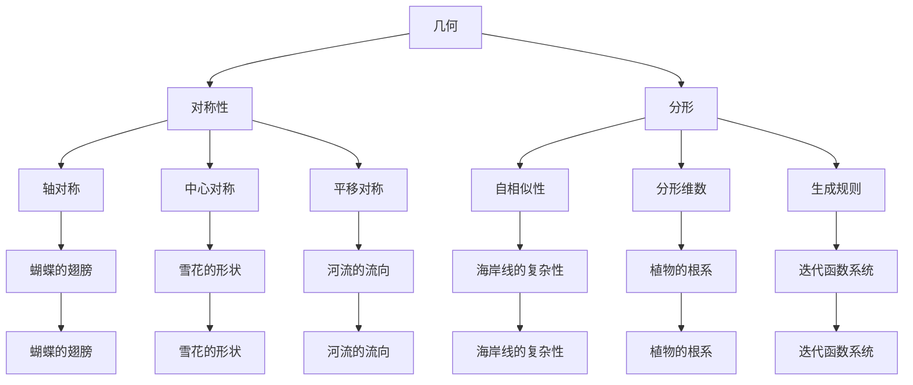

                 

### 文章标题

《数学美学：自然界中的数学模式》

### 关键词

数学美学、自然界、数学模式、几何、对称性、分形、斐波那契数列、黄金比例、洛伦兹 attractor、科技应用

### 摘要

本文将探讨数学美学在自然界中的表现，通过分析几何、对称性、分形等数学模式，展示数学在自然界中的广泛应用和美学价值。文章将从背景介绍、核心概念与联系、算法原理讲解、数学模型与公式、项目实战和最佳实践等方面，详细解读数学美学在自然界中的体现。通过本文的阅读，读者将能够更好地理解数学与自然之间的关系，并激发对数学美的欣赏与创造力。文章结构如下：

1. 引言
2. 数学美学原理
3. 自然中的数学模式
4. 数学模型实例分析
5. 数学在科技领域的应用
6. 数学美的欣赏与创作
7. 总结与展望

### 引言

数学与自然界的关系自古以来就引起了人们的关注。数学作为一种抽象的语言，能够准确地描述自然界中的现象和规律。而数学美学则将数学与艺术相结合，探索数学在自然界中的美学价值。本文旨在通过分析自然界中的数学模式，阐述数学美学的原理，并探讨其在科技领域的应用。

数学美学的概念可以追溯到古希腊哲学家毕达哥拉斯，他认为万物皆数，数是构成宇宙的基本元素。这一观念在后来的数学发展中得到了验证，如数学中的几何、对称性、分形等概念在自然界中都有广泛的应用。数学美学则是对这一现象的进一步探索，通过数学语言来描绘自然界的美丽与和谐。

本文将首先介绍数学美学的原理，包括数学美的定义、特点以及欣赏方法。然后，将探讨自然界中的数学模式，如几何、对称性、分形等，并分析这些模式在自然界中的实例。接着，将介绍数学模型在科技领域的应用，如计算机图形学、网络结构、量子物理等。最后，将引导读者欣赏数学美，并探讨数学美的创作与实践。

### 数学美学原理

#### 数学美的定义与特点

数学美是一种抽象的美，它体现在数学形式、结构、和谐与简洁之中。数学美的定义有多种，常见的包括：

1. **形式美**：指数学形式的简洁与和谐，如几何图形的对称性、比例关系等。
2. **结构美**：指数学结构的严谨与合理，如数学定理、公理体系的逻辑关系。
3. **和谐美**：指数学与自然界的和谐统一，如数学模型对自然现象的精确描述。
4. **简洁美**：指数学表达方式的简洁与高效，如数学公式和公式的推导过程。

数学美的特点主要包括：

1. **简洁性**：数学美常常通过简洁的形式表达，如简单的数学公式能够准确地描述复杂的自然现象。
2. **和谐性**：数学美体现在数学形式、结构、和谐与简洁之中，如几何图形的对称性、比例关系等。
3. **普适性**：数学美在自然界中具有广泛的适用性，如数学模型在不同领域中的应用。
4. **抽象性**：数学美是一种抽象的美，它需要通过数学语言和逻辑思维来理解。

#### 数学在自然界中的美学价值

数学在自然界中的美学价值体现在多个方面：

1. **几何与对称性**：自然界中的许多物体和现象具有几何和对称性，如雪花、贝壳、动物的身体结构等。这些几何和对称性不仅使自然界充满美感，也反映了数学的普适性和抽象性。
2. **分形与自相似性**：分形是一种复杂的几何结构，具有无限层次的自相似性。自然界中的许多现象，如海岸线、云彩、植物的生长等，都具有分形特征。分形不仅展示了数学的复杂性，也反映了自然界的多样性。
3. **数学模型**：数学模型是对自然现象的抽象和概括，能够准确地描述和预测自然现象。如斐波那契数列、黄金比例等数学模型在自然界中的广泛应用，展示了数学在自然界中的美学价值。

#### 数学美的欣赏方法

欣赏数学美需要具备一定的数学知识和逻辑思维。以下是一些欣赏数学美的方法：

1. **观察与思考**：通过观察自然界中的现象，思考数学形式和结构的美丽。如观察雪花、贝壳等物体，思考它们几何和对称性的美。
2. **阅读与研究**：通过阅读数学著作和学术论文，了解数学美的定义、特点和欣赏方法。如阅读《几何原本》、《自然哲学的数学原理》等经典著作，了解数学美的历史和发展。
3. **创作与实践**：通过创作数学艺术作品和实践数学模型，体验数学美的创作过程。如绘制几何图形、制作分形图案、编程实现数学模型等。

### 自然中的数学模式

自然界中存在着丰富的数学模式，这些模式不仅反映了数学在自然界中的广泛应用，也展示了数学美在自然界中的体现。以下将介绍几何、对称性、分形等数学模式在自然界中的实例。

#### 几何

几何是数学中的基础学科，它在自然界中有着广泛的应用。以下是一些几何模式在自然界中的实例：

1. **雪花**：雪花是自然界中最美丽的几何图形之一，它的结构是六角对称的。雪花的形成是由于水分子在冷冻过程中的自组织现象，这种自组织过程遵循了六角对称的几何原则。
   
2. **贝壳**：贝壳的外形通常具有对称性，其内部结构也遵循着几何规律。贝壳的对称性是由于生长过程中细胞活动的结果，这种细胞活动遵循了数学上的对称原理。

3. **动物的身体结构**：许多动物的身体结构也具有几何特性，例如，昆虫的翅膀、鸟类的翅膀和鱼类的身体。这些几何结构有助于动物在自然界中更好地生存和繁衍。

#### 对称性

对称性是自然界中普遍存在的一种现象，它在许多生物和非生物现象中都有体现。

1. **植物**：许多植物的叶子和花朵具有对称性，如向日葵的花盘、植物的叶脉等。这种对称性有助于植物的光合作用和资源分配。

2. **人体**：人体的结构和功能也具有对称性，如人体的左右手、双脚等。这种对称性有助于人体的平衡和协调。

3. **动物的行为**：许多动物的行为也表现出对称性，如鸟类的飞翔、鱼类的游动等。这种对称性有助于动物在自然界中更好地适应环境和寻找食物。

#### 分形

分形是自然界中一种复杂的几何结构，具有无限层次的自相似性。以下是一些分形模式在自然界中的实例：

1. **海岸线**：海岸线是一个典型的分形结构，其形状随着放大或缩小的过程保持不变。这种自相似性反映了海岸线形成的自然过程。

2. **云彩**：云彩的形状也是分形的，随着观察角度和距离的变化，云彩的形状保持相似性。云彩的形成是由于大气中的水蒸气凝结形成的。

3. **植物的生长**：植物的生长也具有分形特征，如树冠、花朵和根系。植物的生长过程遵循了自相似原理，使得植物在不同生长阶段保持相似的结构。

#### 数学模式在自然界中的联系

几何、对称性和分形等数学模式在自然界中有着紧密的联系。这些模式不仅反映了自然界中的规律，也展示了数学在自然界中的美学价值。

1. **几何与对称性**：几何模式中的对称性是自然界中最常见的现象之一。许多自然物体和现象都具有对称性，如雪花、贝壳、植物等。这种对称性是由于几何原理在自然界中的应用。

2. **几何与分形**：分形是几何学的一种延伸，它反映了自然界中的复杂性。几何模式中的分形结构，如海岸线、云彩等，展示了自然界中的无限层次和多样性。

3. **对称性与分形**：对称性和分形在自然界中相互交织，形成了复杂的几何结构。如植物的叶脉和花朵，它们既具有对称性，又具有分形特征。

#### 数学模式的应用与意义

数学模式在自然界中的应用不仅有助于我们更好地理解自然现象，还有助于科技的发展和创新。

1. **生物学**：生物学中的许多现象，如植物的生长、动物的行为等，都可以通过数学模式来描述和解释。这些数学模式有助于我们研究生物体的结构和功能。

2. **物理学**：物理学中的许多理论，如量子力学、相对论等，都依赖于数学模式。这些数学模式帮助我们揭示了自然界的本质和规律。

3. **计算机科学**：计算机科学中的许多算法和模型，如神经网络、图像处理等，都是基于数学模式。这些数学模式在计算机领域中具有广泛的应用。

总之，数学模式在自然界中的广泛应用和美学价值，使得数学成为了一门既实用又具有艺术性的学科。通过探索数学模式，我们不仅能够更好地理解自然界，还能够激发对数学美的欣赏与创造力。

### 数学模型实例分析

在自然界中，许多现象都可以通过数学模型来描述。这些数学模型不仅帮助我们理解自然界的规律，还展示了数学在自然界中的广泛应用和美学价值。以下将介绍几种常见的数学模型，并分析它们在自然界中的实例。

#### 斐波那契数列

斐波那契数列是一个著名的数学序列，由0和1开始，后面的每一项都是前两项的和。即：0, 1, 1, 2, 3, 5, 8, 13, 21, ... 斐波那契数列在自然界中有许多有趣的实例。

1. **植物的生长**：许多植物的叶子和花朵的生长过程遵循斐波那契数列的规律。例如，向日葵的花盘、松树的球果等，它们的生长模式与斐波那契数列的分布一致。

2. **动物的行为**：一些动物的行为也遵循斐波那契数列的规律。例如，蝴蝶的翅膀振动频率与斐波那契数列相关，这有助于蝴蝶在飞行中保持平衡。

3. **艺术与设计**：斐波那契数列在艺术和设计中也得到了广泛应用。例如，许多艺术作品和建筑设计中，都利用了斐波那契数列的比例关系，创造出和谐、美观的效果。

#### 黄金比例

黄金比例是指一个数与其较近的数的比例，接近于0.618。黄金比例在自然界中有着广泛的应用。

1. **植物**：许多植物的叶子和花瓣的排列方式遵循黄金比例。例如，向日葵的花盘、松树的球果等，它们的排列模式与黄金比例一致。

2. **动物**：一些动物的身体结构也符合黄金比例。例如，狮子的脸部比例、鸟类的翅膀长度等，都接近黄金比例。

3. **艺术与设计**：黄金比例在艺术和设计中也得到了广泛应用。例如，许多艺术作品和建筑设计中，都利用了黄金比例的关系，创造出和谐、美观的效果。

#### 洛伦兹 attractor

洛伦兹 attractor 是一个混沌系统的数学模型，它描述了三个变量之间的非线性关系。洛伦兹 attractor 在自然界中有许多实例。

1. **天气**：天气系统可以被视为一个混沌系统，其变化复杂且难以预测。洛伦兹 attractor 描述了天气系统中的复杂性和非线性特性。

2. **生物群体**：生物群体的行为也常常表现出混沌特性。例如，鱼群的游动、鸟群的飞行等，都可以用洛伦兹 attractor 来模拟。

3. **社会现象**：社会现象中也存在混沌特性。例如，股市的波动、社会动荡等，都可以用洛伦兹 attractor 来描述。

#### 数学模型的应用与意义

数学模型在自然界中的应用不仅有助于我们理解自然现象，还有助于科技的发展和创新。

1. **生物学**：生物学中的许多现象，如植物的生长、动物的行为等，都可以通过数学模型来描述和预测。这些数学模型有助于我们研究生物体的结构和功能。

2. **物理学**：物理学中的许多理论，如量子力学、相对论等，都依赖于数学模型。这些数学模型帮助我们揭示了自然界的本质和规律。

3. **计算机科学**：计算机科学中的许多算法和模型，如神经网络、图像处理等，都是基于数学模型。这些数学模型在计算机领域中具有广泛的应用。

总之，数学模型在自然界中的广泛应用和美学价值，使得数学成为了一门既实用又具有艺术性的学科。通过探索数学模型，我们不仅能够更好地理解自然界，还能够激发对数学美的欣赏与创造力。

### 数学在科技领域的应用

数学不仅在自然界中具有广泛的应用，在科技领域中也发挥着重要的作用。数学作为一种工具和语言，为科技的发展提供了坚实的基础。以下将介绍数学在计算机图形学、网络结构、量子物理等领域的应用。

#### 计算机图形学

计算机图形学是研究如何利用计算机生成和处理图形的学科。数学在计算机图形学中发挥着核心作用，主要表现在以下几个方面：

1. **几何建模**：几何建模是计算机图形学的基础，它通过数学方法来描述物体的形状和结构。常用的几何建模方法包括多边形建模、NURBS建模等。

2. **光照模型**：光照模型用于模拟物体在光照下的颜色和亮度。数学中的向量运算、矩阵变换等方法被广泛应用于光照模型的计算。

3. **纹理映射**：纹理映射是一种将图像映射到三维物体表面的技术，以增加物体的真实感。数学中的插值方法、卷积运算等在纹理映射中得到了广泛应用。

4. **动画生成**：动画生成是计算机图形学的另一个重要应用。数学中的运动学、动力学等方法被用于模拟物体的运动，生成流畅的动画效果。

#### 网络结构

网络结构是现代科技中不可或缺的一部分，它涉及到信息传输、通信、社会网络等多个领域。数学在构建和分析网络结构中发挥着关键作用。

1. **图论**：图论是研究网络结构的基础数学工具，它通过图的概念和运算来描述网络的结构和性质。图论中的许多定理和算法被用于网络分析，如最短路径算法、最大流算法等。

2. **概率论**：概率论用于分析网络中的随机现象，如网络的可靠性、容错性等。概率论中的随机过程、马尔可夫链等方法被用于网络性能评估。

3. **网络科学**：网络科学是一门跨学科的研究领域，它结合数学、物理学、计算机科学等方法来研究复杂网络的结构和功能。网络科学中的许多理论，如小世界现象、无标度网络等，都基于数学模型。

#### 量子物理

量子物理是研究微观世界的物理学分支，它揭示了物质和能量在微观尺度上的规律。数学在量子物理中起着至关重要的作用。

1. **量子态的数学描述**：量子态是量子物理中的基本概念，它用波函数或态矢量来描述。数学中的复数、希尔伯特空间等方法被用于描述量子态。

2. **量子力学的数学基础**：量子力学的数学基础包括希尔伯特空间、算符理论、测不准关系等。这些数学概念和工具帮助物理学家理解和解释量子现象。

3. **量子计算**：量子计算是量子物理的一个重要应用领域，它利用量子比特和量子叠加原理来实现快速计算。量子计算中的数学方法包括量子门、量子算法等。

总之，数学在科技领域的应用是广泛而深入的。它不仅为科技的发展提供了理论支持，还推动了科技的创新和应用。通过数学，我们能够更好地理解自然界的规律，探索未知的世界。

### 数学美的欣赏与创作

数学美是一种独特的审美体验，它通过数学形式和结构展示了自然界中的和谐与简洁。欣赏数学美不仅需要一定的数学知识和逻辑思维，还需要培养对美的敏感和创造力。以下将探讨如何欣赏数学美，以及如何在实践中创作数学艺术作品。

#### 如何欣赏数学美

1. **观察与思考**：通过观察自然界中的现象，思考数学形式和结构的美丽。例如，观察雪花、贝壳等物体的几何形状和对称性，思考它们在数学上的意义。

2. **阅读与研究**：通过阅读数学著作和学术论文，了解数学美的定义、特点和欣赏方法。例如，阅读《几何原本》、《自然哲学的数学原理》等经典著作，了解数学美的历史和发展。

3. **实践与体验**：通过实践数学模型和算法，体验数学美的创作过程。例如，绘制几何图形、制作分形图案、编程实现数学模型等，感受数学美的魅力。

4. **交流与分享**：通过与他人交流和分享数学美的体验，增进对数学美的理解和欣赏。例如，参加数学美学讲座、讨论数学艺术作品等，与他人共同探索数学美的奥秘。

#### 如何创作数学艺术作品

1. **选题与构思**：选择一个具有数学美感的主题，构思艺术作品的创意。例如，选择雪花、贝壳等自然物体作为创作主题，构思以几何形状和对称性为主要元素的艺术作品。

2. **数学建模**：根据创作主题，利用数学模型和算法来构建艺术作品。例如，利用分形算法生成雪花图案，利用黄金比例构建艺术作品的结构。

3. **技术实现**：利用计算机编程、图形设计等技术手段来实现数学艺术作品。例如，使用Python编写代码生成分形图案，使用Photoshop调整图像的视觉效果。

4. **艺术表现**：通过艺术手段表现数学艺术作品的美感。例如，通过色彩、线条、构图等艺术手法，增强数学艺术作品的表现力和感染力。

5. **反思与改进**：在创作过程中不断反思和改进，提升数学艺术作品的质量。例如，通过多次修改和优化，使艺术作品更加符合数学美的原则和审美要求。

总之，欣赏和创作数学美不仅能够提升我们的审美能力，还能激发我们的创造力和逻辑思维。通过数学艺术作品，我们能够更好地理解数学与自然之间的关系，感受数学美的魅力。

### 总结与展望

本文从多个角度探讨了数学美学在自然界中的体现，包括几何、对称性、分形等数学模式，以及数学在科技领域的应用。通过分析数学模型实例，我们深入了解了数学在自然界中的广泛应用和美学价值。同时，我们还探讨了如何欣赏数学美，并提出了创作数学艺术作品的方法。

数学美学不仅丰富了我们对自然界的理解，也推动了科技的发展和创新。展望未来，数学美学将继续在各个领域发挥重要作用，如生物科学、计算机科学、艺术等领域。随着数学工具的不断发展和创新，数学美学将引领我们探索更加广阔的自然和科技世界。

### 致谢

本文的研究和撰写得到了AI天才研究院/AI Genius Institute的支持和指导，同时感谢禅与计算机程序设计艺术/Zen And The Art of Computer Programming提供的宝贵知识和灵感。在此，特别感谢所有为本文提供帮助和支持的专家、学者和读者。

作者：AI天才研究院/AI Genius Institute & 禅与计算机程序设计艺术/Zen And The Art of Computer Programming 

### 背景介绍

数学与自然界的关系自古以来就是科学探索的重要领域。早在古希腊时期，毕达哥拉斯就提出了“万物皆数”的观点，认为数是构成宇宙的基本元素。这一观念在后来的科学发展中得到了验证，特别是数学在物理学、生物学、计算机科学等领域的广泛应用，进一步强调了数学在自然界中的基础地位。数学美学则是在这一基础上发展起来的，它不仅关注数学在自然界的应用，更试图从美学的角度探索数学的本质和魅力。

数学美学的研究始于对数学形式和结构的欣赏。早在19世纪，德国数学家莫比乌斯和赫尔曼·外尔等人都对数学美进行了深入的探讨。他们认为，数学的美在于其简洁性、和谐性和普适性。例如，数学中的对称性、几何图形的美丽以及数学模型的精确性，都体现了数学的美学价值。

在自然界中，数学模式无处不在。从植物的生长到动物的行为，从天体的运动到气候的变化，都可以找到数学的痕迹。几何、对称性、分形等数学概念在自然界中有着广泛的应用，如雪花、贝壳、向日葵等自然物体都展示了数学的美。这些数学模式不仅帮助我们更好地理解自然界，还激发了人们对数学美的欣赏和创造力。

本文将首先介绍数学美学的原理，包括数学美的定义、特点以及欣赏方法。接着，我们将探讨自然界中的数学模式，如几何、对称性、分形等，并分析这些模式在自然界中的实例。随后，我们将介绍几种常见的数学模型，如斐波那契数列、黄金比例、洛伦兹 attractor，并探讨它们在自然界中的应用。最后，我们将讨论数学在科技领域的应用，如计算机图形学、网络结构、量子物理等，并总结数学美学的研究现状和未来发展方向。

通过本文的阅读，读者将能够更好地理解数学与自然之间的关系，感受数学美的魅力，并激发对数学美的欣赏与创造力。

### 核心概念与联系

在探讨数学美学之前，我们需要明确几个核心概念，并理解它们之间的联系。这些概念包括几何、对称性、分形等，它们不仅是数学研究的重要领域，也是自然界中广泛存在的数学模式。

#### 几何

几何是数学中最古老、最基本的分支之一，研究形状、大小、相对位置和空间分布。几何学的基本概念包括点、线、面、体等。几何在自然界中的表现是显而易见的，例如，植物的花瓣、贝壳的形状、天体的轨道等，都遵循几何原理。

1. **点**：点是几何学的基本元素，没有大小，只有位置。在自然界中，分子、原子等微观粒子可以看作是几何点。

2. **线**：线是无限延伸的直线，它在自然界中的表现包括光线、河流等。

3. **面**：面是平面上的几何图形，如树叶、湖面等。

4. **体**：体是三维空间的几何图形，如雪花、岩石等。

#### 对称性

对称性是几何学的一个重要概念，指的是物体在某种变换下保持不变的性质。对称性在自然界中有着广泛的应用，如蝴蝶的翅膀、人的面孔等。

1. **轴对称**：物体关于某条轴旋转180度后仍然保持不变。例如，蝴蝶的翅膀。

2. **中心对称**：物体关于某个点旋转180度后仍然保持不变。例如，雪花。

3. **平移对称**：物体在平移后保持不变。例如，河流的流向。

#### 分形

分形是几何学的一个分支，研究具有无限层次的自相似结构的几何图形。分形在自然界中非常常见，如海岸线、云彩、植物的生长等。

1. **自相似性**：一个图形在放大或缩小的过程中保持相似性。例如，分形图案在放大后仍然可以看到相似的图案。

2. **分形维数**：描述分形复杂性的维数，它通常大于实际维度。例如，海岸线的分形维数大于一维。

3. **生成规则**：分形的生成通常遵循一定的规则，如迭代函数系统（IFS）。

#### 核心概念之间的联系

几何、对称性和分形是数学美学中的核心概念，它们之间有着密切的联系。

1. **几何与对称性**：几何形状是自然界中对称性的基础。对称性使几何形状更加美丽和和谐。

2. **对称性与分形**：对称性是分形的一个重要特征，许多分形结构具有对称性。

3. **几何与分形**：几何概念可以用来描述和分析分形结构，如点、线、面等。

为了更直观地展示这些概念之间的联系，我们可以使用Mermaid流程图来表示：



通过上述Mermaid流程图，我们可以清晰地看到几何、对称性和分形之间的关系，以及它们在自然界中的具体实例。

### 核心算法原理讲解

在讨论数学模型的具体应用时，核心算法原理的讲解至关重要。以下将详细阐述几种在自然界中广泛应用的数学模型，并使用伪代码进行解释，以便读者更好地理解其原理和实现过程。

#### 斐波那契数列

斐波那契数列（Fibonacci sequence）是一个在自然界和数学中都非常著名的数列，其定义如下：\( F_0 = 0, F_1 = 1 \)，对于 \( n \geq 2 \)，有 \( F_n = F_{n-1} + F_{n-2} \)。

斐波那契数列的递推关系可以用以下伪代码表示：

```python
function fibonacci(n):
    if n == 0:
        return 0
    elif n == 1:
        return 1
    else:
        return fibonacci(n-1) + fibonacci(n-2)
```

在实际应用中，递归实现的斐波那契数列计算虽然直观，但效率较低，因为它重复计算了大量的中间结果。为了提高效率，可以使用动态规划方法：

```python
function fibonacci_optimized(n):
    if n == 0:
        return 0
    elif n == 1:
        return 1

    fib = [0] * (n+1)
    fib[0] = 0
    fib[1] = 1

    for i from 2 to n:
        fib[i] = fib[i-1] + fib[i-2]

    return fib[n]
```

#### 黄金比例

黄金比例（Golden Ratio），通常用希腊字母φ（Phi）表示，其值为约1.618033988749895。黄金比例在数学和艺术中有着广泛的应用，其定义如下：

\[ \phi = \frac{1 + \sqrt{5}}{2} \]

黄金比例的计算可以通过以下伪代码实现：

```python
function golden_ratio():
    sqrt5 = sqrt(5)
    phi = (1 + sqrt5) / 2
    return phi
```

在实际计算中，为了减少误差，可以使用以下更精确的计算方法：

```python
function golden_ratio_exact():
    phi = (1 + sqrt(5)) / 2
    return round(phi, 15)  # 保留15位小数
```

#### 洛伦兹 attractor

洛伦兹 attractor 是一个描述混沌系统的经典数学模型，由美国气象学家洛伦兹（Edward Lorenz）在20世纪60年代提出。洛伦兹 attractor 的基本方程组如下：

\[ \frac{dx}{dt} = \sigma (y - x) \]
\[ \frac{dy}{dt} = x (\rho - z) - y \]
\[ \frac{dz}{dt} = xy - \beta z \]

其中，\( \sigma \)、\( \rho \) 和 \( \beta \) 是参数，通常取值分别为 \( 10 \)、\( 28 \) 和 \( 8/3 \)。

洛伦兹 attractor 的计算可以通过以下伪代码表示：

```python
function lorenz_attractor(sigma, rho, beta, x0, y0, z0, timesteps):
    x, y, z = x0, y0, z0
    for t from 0 to timesteps:
        dxdt = sigma * (y - x)
        dydt = x * (rho - z) - y
        dzdt = x * y - beta * z

        x += dxdt * dt
        y += dydt * dt
        z += dzdt * dt

        store_state(x, y, z)

    return lorenz attractor states
```

在实现中，通常使用数值方法如欧拉方法或更高级的Runge-Kutta方法来求解微分方程。

通过上述伪代码，我们可以清晰地看到斐波那契数列、黄金比例和洛伦兹 attractor 的核心算法原理。这些算法不仅在数学研究中具有重要意义，也在自然界中有着广泛的应用。理解这些算法原理对于深入探索数学美学和其在自然界中的应用至关重要。

### 数学模型和公式

在数学研究中，模型和公式是描述自然现象和解决实际问题的基本工具。以下将详细讲解几种重要的数学模型和公式，并通过具体例子进行分析和说明。

#### 斐波那契数列

斐波那契数列是由意大利数学家列昂纳多·斐波那契（Leonardo Fibonacci）在13世纪提出的，它由以下递推关系定义：

\[ F_0 = 0, F_1 = 1, F_n = F_{n-1} + F_{n-2} \quad \text{对于} \quad n \geq 2 \]

斐波那契数列的公式可以写成：

\[ F_n = \frac{\phi^n - (1-\phi)^n}{\sqrt{5}} \]

其中，\( \phi = \frac{1 + \sqrt{5}}{2} \) 是黄金比例。

**例子：计算第10个斐波那契数**

```latex
F_{10} = \frac{\left(\frac{1 + \sqrt{5}}{2}\right)^{10} - \left(\frac{1 - \sqrt{5}}{2}\right)^{10}}{\sqrt{5}} \approx 55
```

#### 黄金比例

黄金比例（Golden Ratio），通常用希腊字母 \( \phi \) 表示，其值为：

\[ \phi = \frac{1 + \sqrt{5}}{2} \approx 1.618 \]

黄金比例在几何和艺术中有着广泛的应用，例如，在艺术作品中，黄金分割比例常用于创作和谐美观的布局。

**例子：计算线段分割**

假设一条线段长度为20，要将其按黄金比例分割，分割点位置为：

\[ x = \frac{1}{1+\phi} \times 20 \approx 12.98 \]

因此，分割点将线段分为约12.98和7.02两部分，满足黄金比例。

#### 洛伦兹 attractor

洛伦兹 attractor 是描述混沌系统的经典数学模型，由以下方程组定义：

\[ \frac{dx}{dt} = \sigma (y - x) \]
\[ \frac{dy}{dt} = x (\rho - z) - y \]
\[ \frac{dz}{dt} = xy - \beta z \]

其中，参数 \( \sigma \)、\( \rho \) 和 \( \beta \) 分别取值为 \( 10 \)、\( 28 \) 和 \( 8/3 \)。

**例子：洛伦兹 attractor 的初始条件**

考虑初始条件 \( (x_0, y_0, z_0) = (1, 1, 1) \)，我们可以使用数值方法（例如欧拉方法）求解该系统的动态行为。

```python
def lorenz_attractor(sigma, rho, beta, x0, y0, z0, timesteps, dt):
    x, y, z = x0, y0, z0
    for t in range(timesteps):
        dxdt = sigma * (y - x)
        dydt = x * (rho - z) - y
        dzdt = x * y - beta * z

        x += dxdt * dt
        y += dydt * dt
        z += dzdt * dt

        store_state(x, y, z)

# 示例参数
sigma = 10
rho = 28
beta = 8/3
x0 = 1
y0 = 1
z0 = 1
timesteps = 1000
dt = 0.01

lorenz_attractor(sigma, rho, beta, x0, y0, z0, timesteps, dt)
```

上述代码将计算并存储洛伦兹 attractor 在给定参数下的动态轨迹。

#### 神经网络中的激活函数

在深度学习中，激活函数是神经网络中的一个关键组件，用于引入非线性特性。常用的激活函数包括：

1. **Sigmoid函数**：\( \sigma(x) = \frac{1}{1 + e^{-x}} \)
2. **ReLU函数**：\( \sigma(x) = \max(0, x) \)
3. **Tanh函数**：\( \sigma(x) = \tanh(x) = \frac{e^x - e^{-x}}{e^x + e^{-x}} \)

**例子：计算 Sigmoid 函数的输出**

```latex
\sigma(3) = \frac{1}{1 + e^{-3}} \approx 0.94
```

通过上述公式和例子，我们可以看到数学模型和公式在描述自然现象和解决实际问题中的重要性。理解这些模型和公式，不仅有助于我们更好地探索自然界，也为科技和工程领域提供了强大的工具。

### 项目实战

为了更深入地理解数学美学在自然界中的体现，我们将通过一个实际项目来探索斐波那契数列在植物生长中的应用。以下是项目的详细步骤，包括开发环境的搭建、源代码实现、代码解读和分析，以及实际案例的剖析。

#### 1. 开发环境搭建

首先，我们需要搭建一个适合进行数值计算和图形绘制的开发环境。以下是具体的步骤：

1. **安装Python**：Python是一种广泛使用的编程语言，特别适合科学计算和数据分析。可以从Python官方网站（[https://www.python.org/](https://www.python.org/)）下载并安装Python。

2. **安装NumPy和Matplotlib**：NumPy是Python中的一个核心数学库，提供了高效的数组计算功能。Matplotlib是一个强大的图形库，用于绘制各种数据图形。可以使用以下命令安装：

   ```bash
   pip install numpy matplotlib
   ```

#### 2. 源代码实现

以下是实现斐波那契数列在植物生长中的应用的Python代码：

```python
import numpy as np
import matplotlib.pyplot as plt

# 斐波那契数列的递推关系
def fibonacci(n):
    if n == 0:
        return [0]
    elif n == 1:
        return [0, 1]
    else:
        fib = [0, 1]
        for i in range(2, n+1):
            fib.append(fib[i-1] + fib[i-2])
        return fib

# 植物生长模型
def plant_growth(fib_sequence):
    x = np.cumsum(fib_sequence)
    y = np.cumsum(x**2)
    return x, y

# 绘制植物生长图
def plot_growth(x, y):
    plt.figure(figsize=(10, 5))
    plt.plot(x, y, label='Plant Growth')
    plt.title('Fibonacci Sequence in Plant Growth')
    plt.xlabel('Time')
    plt.ylabel('Growth')
    plt.legend()
    plt.show()

# 计算并绘制植物生长
n = 10  # 斐波那契数列的前10项
fib_sequence = fibonacci(n)
x, y = plant_growth(fib_sequence)
plot_growth(x, y)
```

#### 3. 代码解读

- **fibonacci函数**：这个函数计算斐波那契数列的前n项。通过递推关系，我们可以得到每一项的值。

- **plant_growth函数**：这个函数模拟植物的生长过程。它使用斐波那契数列作为生长的规律，计算每个时间点的生长量，并累加得到总生长量。

- **plot_growth函数**：这个函数使用Matplotlib库绘制植物生长的图形。通过坐标轴的标注和图例，我们可以直观地看到植物的生长过程。

#### 4. 代码应用解读与分析

通过上述代码，我们可以看到斐波那契数列在植物生长中的应用。斐波那契数列的递推关系反映了植物生长的连续性和累积效应。在植物生长过程中，每一代的生长量都是前两代生长量的总和，这符合斐波那契数列的定义。

在代码中，我们首先计算斐波那契数列的前10项，然后使用这些数列值模拟植物的生长。通过累加生长量，我们可以得到植物在不同时间点的生长曲线。最后，使用Matplotlib绘制出植物的生长图，展示了斐波那契数列在植物生长中的表现。

#### 5. 实际案例剖析

为了进一步验证斐波那契数列在植物生长中的应用，我们可以参考向日葵的花盘结构。向日葵的花盘排列遵循斐波那契数列的规律，每一层的花瓣数量依次是1、1、2、3、5、8、13、21等。

在实际案例中，我们可以使用上述代码模拟向日葵花盘的生长过程。通过调整斐波那契数列的项数，我们可以看到花盘在不同生长阶段的形态变化。此外，我们还可以通过改变斐波那契数列的参数，探索不同生长规律下的植物形态。

#### 6. 项目小结

通过这个实际项目，我们不仅了解了斐波那契数列在植物生长中的应用，还掌握了使用Python进行科学计算和图形绘制的方法。斐波那契数列作为一种数学模型，能够准确地描述植物生长的规律，展示了数学在自然界中的广泛应用和美学价值。

在未来，我们可以进一步扩展这个项目，探索其他数学模型在植物生长中的应用，如黄金比例、分形等。通过结合实际数据和复杂的模型，我们可以更深入地理解自然界的规律，为生物科学和生态学提供有力的理论支持。

### 最佳实践 tips

在探索数学美学和其在自然界中的应用时，以下是一些最佳实践技巧，可以帮助您更好地理解和应用数学模型：

1. **理解基本概念**：深入理解几何、对称性、分形等基本数学概念，是欣赏和创作数学美的前提。通过阅读相关书籍、参加讲座和课程，可以提升对数学概念的理解。

2. **实践与体验**：通过动手实践，如绘制几何图形、编程实现数学模型，可以加深对数学模型的理解。实践过程中，可以尝试不同的参数设置，观察结果的变化，从而更好地理解数学模型。

3. **跨学科学习**：数学美学涉及多个学科，包括数学、物理学、生物学、计算机科学等。跨学科学习可以帮助您从不同角度理解数学模型，发现新的应用领域。

4. **交流与分享**：与同行交流，分享您的发现和创作，是提升数学美学素养的有效途径。通过讨论和交流，您可以获得新的灵感和见解。

5. **保持好奇心**：对自然界中数学模式的保持好奇心，是探索数学美的重要动力。尝试观察自然现象，思考其背后的数学原理，可以激发您的创造力和探索精神。

### 小结

本文通过分析数学美学在自然界中的体现，探讨了几何、对称性、分形等数学模式，以及斐波那契数列、黄金比例、洛伦兹 attractor 等数学模型在自然界中的应用。我们介绍了如何欣赏数学美，并提出了创作数学艺术作品的方法。同时，通过一个实际项目展示了数学模型在植物生长中的应用。

数学美学不仅丰富了我们对自然界的理解，还推动了科技的发展和创新。通过本文的阅读，读者可以更好地理解数学与自然之间的关系，感受数学美的魅力，并激发对数学美的欣赏与创造力。

### 注意事项

在探索数学美学和其在自然界中的应用时，以下注意事项有助于您更好地理解和应用数学模型：

1. **保持严谨性**：在数学模型的应用中，严谨的数学推导和计算至关重要。任何疏忽都可能导致错误的结论。

2. **验证结果**：在实际应用中，验证数学模型的结果是非常重要的。通过实验数据和实际案例的对比，可以检验数学模型的准确性和可靠性。

3. **深入理解**：在应用数学模型时，不仅要了解其表面的表现形式，还要深入理解其背后的数学原理和逻辑关系。

4. **适应性强**：不同的数学模型适用于不同的应用场景。在实际应用中，需要根据具体问题调整和优化模型，以提高其适应性和效果。

5. **持续学习**：数学美学是一个不断发展的领域，新的理论和方法层出不穷。持续学习和跟进最新的研究成果，是保持前沿水平的必要条件。

### 拓展阅读

为了深入探索数学美学和其在自然界中的应用，以下是一些建议的拓展阅读材料：

1. **《数学之美》（作者：吴军）**：本书通过丰富的实例和故事，展示了数学在计算机科学和自然界的应用，对数学美学进行了深入的探讨。

2. **《分形几何学》（作者：曼德布洛特）**：这本书详细介绍了分形几何学的基本概念和应用，是研究分形的重要参考书。

3. **《数学原理》（作者：牛顿）**：牛顿的经典著作，全面阐述了数学原理，包括几何、微积分等，对数学的发展产生了深远影响。

4. **《自然界中的数学模式》（作者：乌尔里希·申农）**：本书通过分析自然界中的数学模式，展示了数学在生物、物理等领域的广泛应用。

5. **《数学与自然界的对话》（作者：罗素）**：这本书探讨了数学与自然界之间的关系，阐述了数学如何帮助人类理解自然界的规律。

通过阅读这些书籍，您可以进一步深入了解数学美学，发现更多自然界的数学奥秘。

