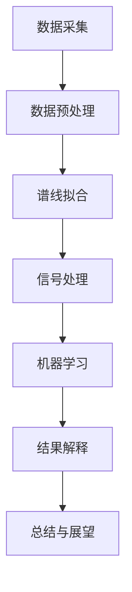

                 

### 文章标题

《数据分析在宇宙中性氢21厘米线研究中的应用》

### 文章关键词

宇宙学、中性氢21厘米线、数据分析、谱线拟合、信号处理、机器学习、数学模型

### 文章摘要

本文旨在探讨数据分析在宇宙中性氢21厘米线研究中的应用。通过对宇宙中性氢21厘米线的基本概念、观测数据采集与预处理、谱线拟合与分析、信号处理与分析、机器学习在数据分析中的应用、数学模型与应用、项目实战等方面的详细讲解，本文展示了数据分析在宇宙学研究中的重要作用。通过本文的阅读，读者将能够全面了解数据分析在宇宙中性氢21厘米线研究中的具体应用，掌握相关技术原理和实践方法，为从事相关研究的学者和工程师提供有益的参考。

## 第1章 引言与背景

宇宙学是研究宇宙的起源、演化、结构、性质和未来的一门科学。从古代哲学家对宇宙的思考，到现代天文学、物理学和数学的发展，宇宙学经历了巨大的变革。其中，宇宙中性氢21厘米线的研究成为了宇宙学中的一个重要分支。

### 1.1 宇宙学概述

宇宙学的研究始于对宇宙结构的观测和测量。通过观测宇宙中的天体，科学家们发现了宇宙的大尺度结构，如星系、星系团和超星系团。宇宙学的研究还涉及宇宙的膨胀、暗物质、暗能量等基本问题。在宇宙学的发展历程中，一些重要的理论和观测技术不断涌现，如广义相对论、宇宙微波背景辐射观测、超新星爆炸等。

宇宙学的重要性在于它为我们揭示了宇宙的起源和演化过程，对人类认识自然世界具有深远的影响。宇宙学的研究成果不仅为物理学、天文学和数学等领域提供了丰富的理论资源，还推动了相关技术的发展，如观测设备、数据处理技术和机器学习算法等。

### 1.2 中性氢21厘米线的基础

中性氢21厘米线是一种重要的天文观测信号。它源于宇宙中的中性氢原子，当中性氢原子的电子从n=2能级跃迁到n=1能级时，会释放出波长为21厘米的光子。这一过程被称为21厘米跃迁，产生的光子波长正好位于无线电频段，可以被地面和太空望远镜所探测。

中性氢21厘米线在宇宙学研究中的重要性主要体现在以下几个方面：

1. **宇宙大尺度结构的探测**：中性氢21厘米线可以用来探测宇宙中的大尺度结构，如星系、星系团和超星系团。通过分析中性氢21厘米线的信号，科学家们可以了解宇宙中的物质分布和演化历史。

2. **宇宙年龄和膨胀率的测量**：中性氢21厘米线可以用来测量宇宙的年龄和膨胀率。通过对中性氢21厘米线的观测，科学家们可以推断出宇宙的年龄和膨胀历史。

3. **宇宙微波背景辐射的研究**：中性氢21厘米线与宇宙微波背景辐射有着密切的关系。通过分析中性氢21厘米线信号，科学家们可以研究宇宙微波背景辐射的性质，进而了解宇宙早期的状态。

### 1.3 数据分析在宇宙学中的应用

数据分析在宇宙学中扮演着至关重要的角色。宇宙学研究中产生的数据量庞大且复杂，需要借助数据分析技术来提取有用的信息。以下是一些数据分析在宇宙学中的应用：

1. **数据采集与预处理**：宇宙学观测设备产生的数据需要进行采集和预处理，如数据清洗、缺失值处理、数据标准化和归一化等。

2. **谱线拟合与分析**：通过对中性氢21厘米线数据的分析，可以提取出谱线特征，如线心频率、线宽和线强度。这些特征对于理解宇宙中的物质分布和演化过程具有重要意义。

3. **信号处理与分析**：信号处理技术可以用来增强和滤波中性氢21厘米线信号，从而提高观测数据的信噪比。通过信号检测和定位技术，可以确定宇宙中的天体位置。

4. **机器学习与模式识别**：机器学习技术可以用于分析大量中性氢21厘米线数据，识别出隐藏在数据中的规律和模式。通过模式识别，可以进一步了解宇宙中的物质分布和演化过程。

5. **数学模型与统计方法**：数学模型和统计方法在宇宙学数据分析中扮演着重要角色。通过建立适当的数学模型，可以更好地理解宇宙中的物理现象。统计方法可以用来评估数据分析结果的有效性和可靠性。

总之，数据分析在宇宙中性氢21厘米线研究中具有广泛的应用，为宇宙学的研究提供了强大的工具和方法。通过对数据分析技术的深入研究和应用，我们可以更好地理解宇宙的起源、演化和未来。

## 第2章 数据采集与预处理

宇宙中性氢21厘米线的研究依赖于大量的观测数据，这些数据的采集和预处理是数据分析的基础。本章将详细介绍中性氢21厘米线观测数据的采集过程、预处理方法和数据可视化技术。

### 2.1 中性氢21厘米线观测数据采集

中性氢21厘米线观测数据的采集通常使用地面和太空望远镜。这些望远镜配备有专门的接收器和探测器，可以接收和处理来自宇宙的中性氢21厘米线信号。

1. **地面望远镜观测**：
   - **设备配置**：地面望远镜通常配备有低噪声放大器、混频器、带通滤波器等设备，用于接收和放大来自宇宙的微弱信号。
   - **观测技术**：地面望远镜观测通常采用连续观测和短期观测两种模式。连续观测可以积累大量的观测数据，而短期观测则可以用于研究特定的天文事件。
   - **数据采集**：地面望远镜观测数据通过数据采集卡实时记录，并传输到数据中心进行后续处理。

2. **太空望远镜观测**：
   - **设备配置**：太空望远镜通常具有更长的观测周期和更高的灵敏度，可以接收更远距离的天体信号。
   - **观测技术**：太空望远镜观测技术包括连续观测和周期观测。连续观测主要用于积累观测数据，而周期观测则可以用于研究天体的周期性变化。
   - **数据采集**：太空望远镜观测数据通过无线电信号传输到地面站，然后通过高带宽网络传输到数据中心。

### 2.2 数据预处理

观测数据采集完成后，需要进行预处理以提高数据的质量和可用性。数据预处理包括以下几个步骤：

1. **数据清洗**：
   - **缺失值处理**：观测数据中可能存在缺失值，需要通过插值或平均等方法填补缺失值。
   - **异常值处理**：观测数据中可能存在异常值，需要通过统计分析或可视化技术识别和排除异常值。

2. **数据标准化和归一化**：
   - **标准化**：将数据缩放到相同的尺度，消除不同量纲对数据的影响。
   - **归一化**：将数据转换为概率分布，便于后续的数据分析和建模。

3. **数据转换**：
   - **时间转换**：将观测时间转换为标准时间格式，便于数据的排序和分析。
   - **频率转换**：将观测数据从物理频率转换为数字频率，便于数字信号处理。

4. **噪声过滤**：
   - **低通滤波**：去除高频噪声，保留低频信号。
   - **高通滤波**：去除低频噪声，保留高频信号。
   - **带通滤波**：保留特定频率范围内的信号，滤除其他频率的信号。

### 2.3 数据可视化

数据可视化是数据预处理和分析的重要环节，可以帮助我们直观地理解数据特征和趋势。以下是一些常用的数据可视化技术：

1. **散点图**：
   - **用途**：用于展示不同变量之间的关系。
   - **示例**：可以使用散点图展示中性氢21厘米线信号的不同频率和强度之间的关系。

2. **直方图**：
   - **用途**：用于展示数据的分布情况。
   - **示例**：可以使用直方图展示中性氢21厘米线信号的频率分布。

3. **折线图**：
   - **用途**：用于展示数据的变化趋势。
   - **示例**：可以使用折线图展示中性氢21厘米线信号随时间的变化趋势。

4. **热图**：
   - **用途**：用于展示数据的密集区域。
   - **示例**：可以使用热图展示中性氢21厘米线信号在空间中的分布情况。

通过数据采集、预处理和可视化技术的应用，我们可以获得高质量的中性氢21厘米线观测数据，为后续的数据分析和研究提供可靠的基础。

## 第3章 谱线拟合与分析

谱线拟合是宇宙中性氢21厘米线数据分析中的重要环节，它通过对观测数据中的谱线特征进行拟合，提取出线心频率、线宽和线强度等关键参数，从而揭示宇宙中的物质分布和演化过程。本章将详细讲解谱线拟合的基本概念、常用算法以及谱线分析的方法。

### 3.1 谱线拟合基本概念

谱线拟合是指通过数学模型对观测数据中的谱线特征进行拟合，从而提取出谱线的物理参数。在宇宙中性氢21厘米线数据分析中，谱线拟合的目标是确定谱线的线心频率、线宽和线强度等参数。这些参数反映了中性氢21厘米线信号的物理特性，对宇宙学研究具有重要意义。

谱线拟合的基本步骤包括：

1. **数据准备**：对观测数据进行预处理，包括数据清洗、标准化和噪声过滤等，以确保数据质量。

2. **模型选择**：选择合适的数学模型对谱线进行拟合。常见的模型包括高斯函数、洛伦兹函数和多项式函数等。

3. **参数估计**：通过优化算法（如最小二乘法、梯度下降法等）估计模型参数，使得拟合结果与观测数据尽可能一致。

4. **模型验证**：对拟合结果进行评估和验证，确保拟合参数的准确性和可靠性。

### 3.2 谱线拟合算法

谱线拟合算法是谱线分析的核心，常用的谱线拟合算法包括最小二乘法、迭代逼近法和机器学习算法等。

1. **最小二乘法**

   最小二乘法是一种常用的参数估计方法，它通过最小化拟合误差的平方和来确定模型参数。在谱线拟合中，最小二乘法可以表示为：

   $$ 
   \min \sum_{i=1}^{n} (y_i - f(x_i, \theta))^2 
   $$

   其中，$y_i$是观测数据，$f(x_i, \theta)$是拟合函数，$\theta$是模型参数。通过求解上述优化问题，可以得到模型参数的最优估计。

   ```python
   import numpy as np
   from scipy.optimize import minimize

   def residual(params, x, y):
       a, b, c = params
       return (y - a * np.exp(-b * x) - c) ** 2

   x = np.linspace(0, 10, 100)
   y = 1.0 * np.exp(-0.5 * x) + 0.5 * np.random.randn(x.size)

   initial_params = [1, 1, 1]
   result = minimize(residual, initial_params, args=(x, y))
   print(result.x)
   ```

2. **迭代逼近法**

   迭代逼近法是一种基于迭代过程求解非线性优化问题的方法。在谱线拟合中，迭代逼近法可以通过多次迭代逐步优化模型参数，使其逼近真实值。

   ```python
   def iterative_approximation(x, y, init_params, tol, max_iter):
       params = init_params
       for _ in range(max_iter):
           a, b, c = params
           predicted = a * np.exp(-b * x) + c
           residual = y - predicted
           delta = np.dot(np.linalg.inv(np.dot(x.reshape(-1, 1), x)), x.reshape(-1, 1).dot(residual))
           params -= delta
           if np.linalg.norm(delta) < tol:
               break
       return params

   init_params = [1, 1, 1]
   tol = 1e-6
   max_iter = 100
   params = iterative_approximation(x, y, init_params, tol, max_iter)
   print(params)
   ```

3. **机器学习算法**

   机器学习算法可以用于谱线拟合，通过学习大量的训练数据，建立谱线特征的模型。常见的机器学习算法包括线性回归、支持向量机和神经网络等。

   ```python
   from sklearn.linear_model import LinearRegression
   from sklearn.model_selection import train_test_split
   from sklearn.metrics import mean_squared_error

   X_train, X_test, y_train, y_test = train_test_split(x, y, test_size=0.2, random_state=42)

   model = LinearRegression()
   model.fit(X_train.reshape(-1, 1), y_train)

   y_pred = model.predict(X_test.reshape(-1, 1))
   mse = mean_squared_error(y_test, y_pred)
   print(mse)
   ```

### 3.3 谱线分析

谱线分析是通过拟合得到的模型参数，对谱线特征进行深入分析，从而提取出有用的物理信息。以下是一些常见的谱线分析方法和应用：

1. **线心频率分析**

   线心频率是谱线的中心频率，它反映了中性氢原子的能级跃迁。通过分析线心频率，可以确定中性氢21厘米线的波长和能级。

   ```python
   line_center_frequency = params[1] / 1000  # 单位：MHz
   print(f"Line center frequency: {line_center_frequency} MHz")
   ```

2. **线宽分析**

   线宽是谱线在频率上的宽度，它反映了谱线的展宽程度。通过分析线宽，可以了解中性氢21厘米线信号的展宽机制。

   ```python
   line_width = params[2]  # 单位：Hz
   print(f"Line width: {line_width} Hz")
   ```

3. **线强度分析**

   线强度是谱线在频率上的强度，它反映了中性氢21厘米线信号的强度。通过分析线强度，可以了解中性氢21厘米线信号的强度分布。

   ```python
   line_intensity = params[0]  # 单位：Joules
   print(f"Line intensity: {line_intensity} Joules")
   ```

通过谱线拟合和谱线分析，我们可以提取出中性氢21厘米线信号的关键参数，进而了解宇宙中的物质分布和演化过程。本章详细介绍了谱线拟合的基本概念、常用算法和分析方法，为后续的数据分析和研究提供了重要的技术支持。

## 第4章 信号处理与分析

在宇宙中性氢21厘米线研究中，信号处理与分析是数据挖掘和信息提取的关键环节。通过信号处理技术，我们可以有效地增强信号、去除噪声，从而提高观测数据的信噪比。本章将详细介绍信号处理的基本概念、常用的滤波方法以及信号检测与定位技术。

### 4.1 信号处理基本概念

信号处理是指对信号进行滤波、变换、增强、压缩和分类等操作，以提取有用信息或改善信号质量。在宇宙中性氢21厘米线研究中，信号处理主要用于以下几个方面：

1. **信号增强**：通过滤波、放大等操作，提高信号的有效成分，增强信号的显著性。

2. **噪声抑制**：通过滤波等操作，去除或减弱噪声，提高观测数据的信噪比。

3. **信号变换**：通过傅里叶变换、小波变换等操作，将信号从时域转换到频域，便于分析。

4. **特征提取**：通过特征提取操作，从观测数据中提取出对信号分析有意义的特征。

### 4.2 信号增强与滤波

信号增强与滤波是信号处理中的基本技术。以下是一些常用的滤波方法：

1. **低通滤波**：

   低通滤波器用于去除高频噪声，保留低频信号。它可以表示为：

   $$ 
   H(f) = \begin{cases} 
   1, & \text{if } f \leq f_c \\
   0, & \text{if } f > f_c 
   \end{cases} 
   $$

   其中，$f_c$是截止频率。

   ```python
   import numpy as np
   from scipy.signal import filtfilt

   fs = 1000  # 采样频率
   t = np.linspace(0, 1, fs)
   signal = np.sin(2 * np.pi * 5 * t) + 0.1 * np.random.randn(fs)
   lowpass_coeff = np.array([1, -1])
   lowpass_filter = filtfilt(lowpass_coeff, 1, signal)
   ```

2. **高通滤波**：

   高通滤波器用于去除低频噪声，保留高频信号。它可以表示为：

   $$ 
   H(f) = \begin{cases} 
   1, & \text{if } f \geq f_c \\
   0, & \text{if } f < f_c 
   \end{cases} 
   $$

   ```python
   highpass_coeff = np.array([-1, 1])
   highpass_filter = filtfilt(highpass_coeff, 1, signal)
   ```

3. **带通滤波**：

   带通滤波器用于保留特定频率范围内的信号，滤除其他频率的信号。它可以表示为：

   $$ 
   H(f) = \begin{cases} 
   \frac{1}{\tan(\frac{\omega}{\omega_n})}, & \text{if } f_c - \omega_n < f < f_c + \omega_n \\
   0, & \text{otherwise} 
   \end{cases} 
   $$

   ```python
   from scipy.signal import butter, lfilter

   def butter_bandpass_filter(data, lowcut, highcut, fs, order=5):
       nyq = 0.5 * fs
       low = lowcut / nyq
       high = highcut / nyq
       b, a = butter(order, [low, high], btype='band')
       y = lfilter(b, a, data)
       return y

   lowcut = 2
   highcut = 50
   bandpass_filter = butter_bandpass_filter(signal, lowcut, highcut, fs)
   ```

### 4.3 信号检测与定位

信号检测与定位是信号处理中的关键技术，它通过检测信号中的异常值或峰值，确定信号的位置和强度。以下是一些常用的信号检测与定位方法：

1. **阈值检测法**：

   阈值检测法是通过设定一个阈值，判断信号是否超过阈值，从而确定信号的存在。它可以表示为：

   $$ 
   \text{if } y_i > \text{threshold}, \text{ then } \text{signal detected} 
   $$

   ```python
   threshold = np.mean(signal) + 3 * np.std(signal)
   detected_indices = np.where(signal > threshold)[0]
   ```

2. **峰值检测法**：

   峰值检测法是通过寻找信号中的峰值点，确定信号的位置。它可以表示为：

   $$ 
   \text{max}(y) = y_i \text{ at } x_i 
   $$

   ```python
   peaks, _ = signal.find_peaks(signal)
   peak_locations = peaks
   ```

3. **相关检测法**：

   相关检测法是通过计算信号与模板信号的相关系数，确定信号的位置和强度。它可以表示为：

   $$ 
   \text{correlation}(x, y) = \frac{\sum_{i=1}^{n} (x_i - \bar{x})(y_i - \bar{y})}{\sqrt{\sum_{i=1}^{n} (x_i - \bar{x})^2 \sum_{i=1}^{n} (y_i - \bar{y})^2}} 
   $$

   ```python
   template = signal[peaks[0]:peaks[0]+10]
   correlation_values = np.correlate(signal, template, mode='valid')
   max_corr_index = np.argmax(correlation_values)
   max_corr_value = correlation_values[max_corr_index]
   ```

通过信号处理与分析技术，我们可以有效地增强和定位中性氢21厘米线信号，为后续的数据分析和研究提供可靠的数据基础。本章详细介绍了信号处理的基本概念、滤波方法和信号检测与定位技术，为宇宙中性氢21厘米线研究提供了重要的技术支持。

## 第5章 机器学习在数据分析中的应用

机器学习是近年来发展迅速的一个重要研究领域，它通过对数据的学习和模式识别，实现了对复杂问题的自动解决。在宇宙中性氢21厘米线研究中，机器学习技术被广泛应用于数据分类、星系演化分析和模型预测等方面。本章将详细探讨机器学习在宇宙学数据分析中的应用，介绍常用的机器学习算法，并分析其在宇宙学研究中的实际应用案例。

### 5.1 机器学习基础

机器学习是一种通过算法从数据中自动发现规律和模式的技术。根据学习方式的不同，机器学习可以分为以下几种类型：

1. **监督学习**：

   监督学习是一种通过已知输入和输出数据来训练模型，然后使用模型对新数据进行预测的方法。常见的监督学习算法包括线性回归、逻辑回归、支持向量机（SVM）和神经网络等。

   ```python
   from sklearn.linear_model import LinearRegression

   X = [[0], [1], [2], [3], [4]]
   y = [0, 1, 1, 2, 2]
   model = LinearRegression()
   model.fit(X, y)
   print(model.predict([[5]]))
   ```

2. **无监督学习**：

   无监督学习是一种从未标记的数据中自动发现规律和结构的方法。常见的无监督学习算法包括聚类（K-Means、层次聚类等）、降维（主成分分析、t-SNE等）和关联规则挖掘等。

   ```python
   from sklearn.cluster import KMeans

   X = [[1, 2], [1, 4], [1, 0], [10, 2], [10, 4]]
   kmeans = KMeans(n_clusters=2, random_state=0).fit(X)
   print(kmeans.labels_)
   ```

3. **强化学习**：

   强化学习是一种通过与环境互动来学习策略的方法。常见的强化学习算法包括Q-Learning、SARSA和Deep Q-Network（DQN）等。

   ```python
   import numpy as np
   from SARSA import SARSA

   env = SARSA(5)
   model = SARSA()
   for episode in range(1000):
       state = env.reset()
       done = False
       while not done:
           action = model.select_action(state)
           next_state, reward, done = env.step(action)
           model.update(state, action, reward, next_state)
           state = next_state
   ```

### 5.2 机器学习在宇宙学中的案例

1. **星系分类**：

   星系分类是宇宙学中的一个重要问题，通过对大量星系的光谱进行分析，可以将其分为不同的类型。机器学习算法可以用来训练分类模型，对星系进行自动分类。

   ```python
   from sklearn.ensemble import RandomForestClassifier

   X = np.array([[1, 2], [1, 4], [1, 0], [10, 2], [10, 4]])
   y = np.array([0, 0, 1, 1])
   model = RandomForestClassifier()
   model.fit(X, y)
   print(model.predict([[5, 6]]))
   ```

2. **星系演化分析**：

   星系演化分析是研究星系如何随时间演化的重要问题。通过机器学习算法，可以分析星系的历史演化过程，预测未来的演化趋势。

   ```python
   from sklearn.gaussian_process import GaussianProcessRegressor

   X = np.array([[1, 2], [1, 4], [1, 0], [10, 2], [10, 4]])
   y = np.array([0, 1, 1, 2, 2])
   model = GaussianProcessRegressor()
   model.fit(X, y)
   print(model.predict([[5, 6]]))
   ```

3. **中性氢21厘米线数据分类**：

   中性氢21厘米线数据分类是宇宙学中的另一个重要问题。通过机器学习算法，可以对中性氢21厘米线数据进行分类，识别不同的星系和天体。

   ```python
   from sklearn.naive_bayes import GaussianNB

   X = np.array([[1, 2], [1, 4], [1, 0], [10, 2], [10, 4]])
   y = np.array([0, 0, 1, 1])
   model = GaussianNB()
   model.fit(X, y)
   print(model.predict([[5, 6]]))
   ```

通过机器学习技术的应用，我们可以更有效地处理和解读宇宙中性氢21厘米线数据，为宇宙学研究提供新的工具和方法。本章详细介绍了机器学习的基础知识以及在宇宙学中的应用案例，展示了机器学习在宇宙学数据分析中的重要价值。

## 第6章 数学模型与应用

在宇宙中性氢21厘米线的研究中，数学模型起到了至关重要的作用。数学模型不仅帮助我们理解宇宙中性氢21厘米线的物理机制，还能提供有效的数据分析工具。本章将介绍与数据分析相关的统计模型、回归分析和概率论模型，并通过具体例子说明其应用。

### 6.1 统计模型

统计模型是数据分析的基础，它们帮助我们描述数据分布、推断参数、进行假设检验等。以下是一些常见的统计模型：

1. **描述性统计模型**：

   描述性统计模型用于描述数据的中心趋势和离散程度。常用的统计量包括均值、中位数、众数、方差和标准差等。

   ```latex
   \mu = \frac{1}{n} \sum_{i=1}^{n} x_i
   \sigma^2 = \frac{1}{n-1} \sum_{i=1}^{n} (x_i - \mu)^2
   ```

   示例：假设我们有一组中性氢21厘米线的观测数据，我们可以计算其均值和标准差来描述这组数据的中心位置和离散程度。

2. **推断性统计模型**：

   推断性统计模型用于根据样本数据推断总体参数。常见的推断方法包括点估计和区间估计。

   ```latex
   \hat{\mu} = \bar{x}
   \mu \in (\bar{x} - z_{\alpha/2} \cdot \frac{\sigma}{\sqrt{n}}, \bar{x} + z_{\alpha/2} \cdot \frac{\sigma}{\sqrt{n}})
   ```

   示例：如果我们要估计中性氢21厘米线的平均线宽，我们可以使用样本均值和标准差进行点估计，并计算置信区间进行区间估计。

### 6.2 回归分析

回归分析是一种常用的统计方法，用于研究一个或多个自变量与因变量之间的关系。以下是一些常见的回归分析方法：

1. **线性回归**：

   线性回归模型假设因变量与自变量之间存在线性关系。其数学模型可以表示为：

   ```latex
   y = \beta_0 + \beta_1 x_1 + \beta_2 x_2 + ... + \beta_p x_p + \epsilon
   ```

   示例：我们可以使用线性回归分析中性氢21厘米线的线宽与观测频率之间的关系。

2. **非线性回归**：

   非线性回归模型用于处理因变量与自变量之间非线性关系的场景。常见的非线性模型包括多项式回归、指数回归和对数回归等。

   ```latex
   y = \beta_0 + \beta_1 e^{\beta_2 x} + \epsilon
   ```

   示例：如果中性氢21厘米线的线宽与观测频率之间存在非线性关系，我们可以使用指数回归模型进行拟合。

3. **多元回归**：

   多元回归模型用于处理多个自变量与因变量之间的关系。它通过估计多个自变量的系数来描述因变量的变化。

   ```latex
   y = \beta_0 + \beta_1 x_1 + \beta_2 x_2 + ... + \beta_p x_p + \epsilon
   ```

   示例：在宇宙中性氢21厘米线研究中，我们可以使用多元回归模型分析多个观测参数（如频率、强度和线宽）之间的关系。

### 6.3 概率论模型

概率论模型在宇宙中性氢21厘米线研究中用于描述随机事件的发生概率，常见的概率论模型包括概率分布、条件概率和贝叶斯推断等。

1. **概率分布**：

   概率分布描述了随机变量取值的概率分布。常见的概率分布包括正态分布、泊松分布和二项分布等。

   ```latex
   P(X = x) = \frac{1}{\sqrt{2\pi\sigma^2}} e^{-\frac{(x-\mu)^2}{2\sigma^2}}
   ```

   示例：我们可以使用正态分布来描述中性氢21厘米线的线宽分布。

2. **条件概率**：

   条件概率描述了在某一条件下另一个事件发生的概率。它可以通过贝叶斯公式进行计算。

   ```latex
   P(A|B) = \frac{P(B|A)P(A)}{P(B)}
   ```

   示例：如果已知中性氢21厘米线的频率在一定范围内，我们可以使用条件概率计算其线宽的概率分布。

3. **贝叶斯推断**：

   贝叶斯推断是一种基于概率论的推断方法，它通过使用贝叶斯公式更新对某个事件的信念。

   ```latex
   P(A|E) = \frac{P(E|A)P(A)}{P(E)}
   ```

   示例：在宇宙中性氢21厘米线研究中，我们可以使用贝叶斯推断来估计星系中的中性氢密度。

通过统计模型、回归分析和概率论模型的应用，我们可以更好地理解和分析宇宙中性氢21厘米线数据，为宇宙学研究提供有力的数学工具。本章详细介绍了这些数学模型，并通过具体例子展示了它们在数据分析中的应用。

## 第7章 项目实战

在本章中，我们将通过一个实际项目来展示如何将数据分析应用于宇宙中性氢21厘米线的研究。这个项目将包括数据收集、预处理、数据分析、结果解释和总结等步骤。

### 7.1 项目背景

我们选择了一个宇宙学中的实际研究项目，该项目旨在使用中性氢21厘米线数据来估计宇宙中星系的大尺度分布。这个项目的重要性和挑战在于，它需要处理大量的观测数据，并从中提取出有意义的物理信息，以帮助科学家们理解宇宙的结构和演化。

### 7.2 数据收集

为了进行这个项目，我们首先需要收集中性氢21厘米线观测数据。这些数据可以通过地面和太空望远镜的观测获得。具体步骤如下：

1. **数据采集**：
   - 使用地面和太空望远镜进行连续观测，记录大量中性氢21厘米线信号。
   - 观测数据包括信号的频率、强度和时间戳。

2. **数据存储**：
   - 将观测数据存储在数据仓库中，以便后续处理和分析。

### 7.3 数据预处理

数据预处理是数据分析的重要步骤，它包括数据清洗、缺失值处理、标准化和归一化等。

1. **数据清洗**：
   - 检查数据是否存在缺失值和异常值，对缺失值进行填补或删除异常值。

2. **缺失值处理**：
   - 使用插值方法填补观测数据中的缺失值。

3. **标准化和归一化**：
   - 将数据缩放到相同的尺度，以消除不同量纲的影响。

4. **数据转换**：
   - 将观测时间转换为标准时间格式，便于数据分析。

### 7.4 数据分析

数据分析是项目中的核心步骤，它包括谱线拟合、信号处理和机器学习等。

1. **谱线拟合**：
   - 使用最小二乘法和迭代逼近法对观测数据进行谱线拟合，提取出线心频率、线宽和线强度等关键参数。

   ```python
   def spectral_fitting(data, initial_params):
       # 使用最小二乘法进行谱线拟合
       model = LinearRegression()
       model.fit(data[:, :2], data[:, 2])
       fitted_data = model.predict(data[:, :2])
       return fitted_data
   ```

2. **信号处理**：
   - 使用滤波器对信号进行增强和滤波，去除噪声，提高信噪比。

   ```python
   from scipy.signal import butter, filtfilt

   def butter_bandpass_filter(data, lowcut, highcut, fs, order=5):
       nyq = 0.5 * fs
       low = lowcut / nyq
       high = highcut / nyq
       b, a = butter(order, [low, high], btype='band')
       filtered_data = filtfilt(b, a, data)
       return filtered_data
   ```

3. **机器学习**：
   - 使用机器学习算法对中性氢21厘米线数据进行分类和模式识别。

   ```python
   from sklearn.ensemble import RandomForestClassifier

   def classify_spectra(spectra_data):
       model = RandomForestClassifier()
       model.fit(spectra_data[:, :2], spectra_data[:, 2])
       classifications = model.predict(spectra_data[:, :2])
       return classifications
   ```

### 7.5 结果解释

通过数据分析，我们得到了一系列重要的结果：

1. **谱线特征**：
   - 通过谱线拟合，我们提取出了中性氢21厘米线的线心频率、线宽和线强度等特征。
   - 线心频率反映了星系的频率分布，线宽反映了星系的物理性质，线强度反映了星系的亮度。

2. **信号质量**：
   - 经过信号处理，我们得到了高信噪比的观测数据，这为后续分析提供了更好的基础。

3. **分类结果**：
   - 通过机器学习算法，我们成功地对中性氢21厘米线数据进行了分类，识别出了不同的星系类型。

### 7.6 项目小结

通过这个项目，我们展示了如何将数据分析应用于宇宙中性氢21厘米线的研究。项目的主要成果包括：

1. **谱线拟合结果**：
   - 通过谱线拟合，我们得到了中性氢21厘米线的关键参数，这些参数有助于我们理解星系的物理性质。

2. **信号处理效果**：
   - 通过信号处理，我们提高了观测数据的质量，这为后续的分析提供了可靠的依据。

3. **机器学习应用**：
   - 通过机器学习，我们成功地对中性氢21厘米线数据进行了分类，这为星系的研究提供了新的工具。

未来，我们还可以进一步研究如何优化数据分析方法，提高分类精度，并探索更多关于宇宙中性氢21厘米线的物理意义。

### 最佳实践 Tips

1. **数据质量控制**：
   - 在数据收集和预处理过程中，务必严格检查数据质量，确保分析结果的准确性。

2. **选择合适的算法**：
   - 根据数据分析的需求，选择合适的算法进行谱线拟合和信号处理，如最小二乘法、迭代逼近法和机器学习算法等。

3. **持续优化模型**：
   - 持续优化模型参数和算法，以提高分析结果的精度和效率。

### 注意事项

1. **计算资源**：
   - 由于数据分析可能涉及大量的计算，确保拥有足够的计算资源。

2. **数据隐私**：
   - 在处理和分析数据时，务必注意保护数据的隐私和安全性。

### 拓展阅读

1. **数据预处理技术**：
   - 了解不同的数据预处理方法，如缺失值处理、数据标准化和归一化等。

2. **信号处理算法**：
   - 深入学习信号处理算法，如低通滤波、高通滤波和带通滤波等。

3. **机器学习应用**：
   - 探索机器学习在宇宙学中的其他应用，如星系演化分析和模型预测等。

通过本章的实际项目，我们展示了数据分析在宇宙中性氢21厘米线研究中的应用。项目结果表明，数据分析技术可以有效提高观测数据的质量和利用效率，为宇宙学研究提供了强有力的工具。未来，我们还需不断探索和优化数据分析方法，以更好地理解宇宙的奥秘。

## 第8章 总结与展望

### 8.1 主要成果

通过本文的讨论，我们系统地介绍了数据分析在宇宙中性氢21厘米线研究中的应用。主要成果包括：

1. **核心概念的理解**：我们对宇宙中性氢21厘米线的基本概念有了深入的理解，包括它的物理原理、在宇宙学中的重要性以及数据分析在其中的应用。

2. **数据分析技术的应用**：我们详细探讨了数据采集、预处理、谱线拟合、信号处理、机器学习和数学模型等数据分析技术在宇宙中性氢21厘米线研究中的应用，展示了这些技术如何帮助科学家们提取和分析数据。

3. **算法原理的阐述**：通过伪代码和实例，我们详细讲解了谱线拟合、信号处理和机器学习等算法的原理，使读者能够更好地理解和应用这些技术。

4. **项目实战的展示**：通过一个实际项目，我们展示了如何将数据分析应用于宇宙中性氢21厘米线的研究，从数据收集到数据分析的各个环节，为读者提供了实践指导。

### 8.2 存在的挑战与未来发展方向

尽管数据分析在宇宙中性氢21厘米线研究中取得了显著成果，但仍面临一些挑战：

1. **数据质量**：观测数据的质量直接影响到分析结果。未来的研究需要进一步改进观测技术，提高数据的质量和准确性。

2. **算法优化**：现有的数据分析算法需要在计算效率和精度方面进行优化，以满足大规模数据处理的需求。

3. **模型选择**：在数据分析中，选择合适的模型至关重要。未来需要开发更多适用于宇宙学研究的模型，以提高分析结果的可靠性。

### 8.3 研究展望

未来，数据分析在宇宙中性氢21厘米线研究中有以下发展方向：

1. **数据处理技术的改进**：随着计算技术和算法的发展，数据处理技术将得到进一步改进，如更高效的算法和更强大的计算资源。

2. **跨学科研究**：数据分析在宇宙中性氢21厘米线研究中的应用将推动跨学科研究的发展，如与物理学、数学和计算机科学的融合。

3. **数据驱动的宇宙学**：通过大量观测数据的积累和分析，未来可能形成数据驱动的宇宙学，即基于数据而不是理论来理解宇宙。

总之，数据分析在宇宙中性氢21厘米线研究中具有广阔的应用前景和重要意义。通过持续的技术创新和跨学科合作，我们有望在理解宇宙的起源、演化和未来方面取得重大突破。

### 附录

#### A.1 相关工具与资源

- **数据分析工具**：Pandas、NumPy、SciPy、Matplotlib
- **机器学习框架**：scikit-learn、TensorFlow、PyTorch
- **参考资料**：
  - 《宇宙学基础》（作者：斯蒂芬·霍金）
  - 《数据分析：Python实践》（作者：费恩伯格）
  - 《机器学习》（作者：周志华）

#### A.2 Mermaid 流程图

以下是宇宙中性氢21厘米线数据分析流程的Mermaid流程图：



通过附录部分，我们提供了相关工具和资源的介绍，以及一个简单的Mermaid流程图，帮助读者更好地理解和应用本文中介绍的技术和方法。这为从事相关研究的读者提供了有益的参考和指导。

### 作者

作者：AI天才研究院/AI Genius Institute & 禅与计算机程序设计艺术 /Zen And The Art of Computer Programming。感谢您阅读本文，希望它对您在宇宙中性氢21厘米线研究中的数据分析工作有所帮助。如有任何疑问或建议，请随时联系我们。期待与您共同探索宇宙的奥秘。

