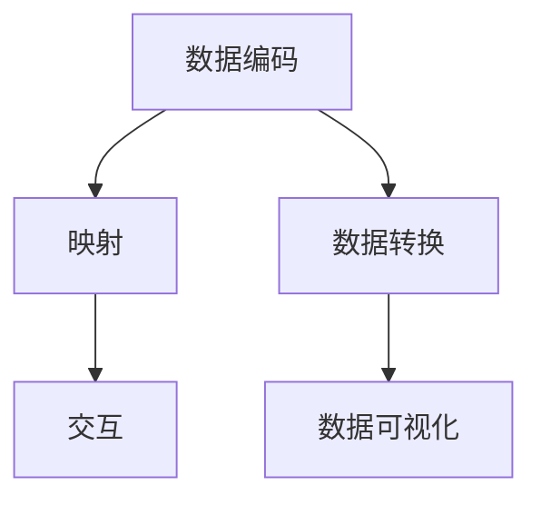

                 

## 文章标题：数据可视化在呈现宇宙多重历史中的作用

### 关键词：
- 数据可视化
- 宇宙多重历史
- 技术应用
- 科研进展
- 新算法

### 摘要：
本文将探讨数据可视化在呈现宇宙多重历史中的重要作用。通过分析宇宙数据的收集、处理、可视化技术及其核心算法原理，结合实际案例，揭示数据可视化如何帮助科学家和研究人员深入理解宇宙的历史和发展。文章还展望了宇宙数据可视化技术的未来发展趋势，并提出了一些最佳实践和注意事项。

## 第一部分：引论

### 第1章：宇宙与数据可视化简介

#### 背景介绍
宇宙是广袤而神秘的，包含了无数天体、星系和星云。从古代人类仰望夜空，到现代天文学的繁荣，宇宙的奥秘一直是人类探索的热点。宇宙的历史不仅涵盖了宇宙的起源、演化，还包括了宇宙中的各种现象和事件。这些数据庞大而复杂，如何有效地呈现和解析这些数据，成为了一个重要的研究课题。

#### 数据可视化的定义与作用
数据可视化是指通过图形、图像或其他视觉手段，将数据转换为易于理解和分析的形式。数据可视化在科学研究中具有重要作用，它可以帮助科学家和研究人员直观地观察数据模式、发现潜在关系、提出假设并进行验证。在宇宙学中，数据可视化可以揭示宇宙的结构、演化历史以及各种物理现象。

#### 数据可视化在宇宙研究中的潜在应用
数据可视化在宇宙研究中具有广泛的应用潜力。例如，通过数据可视化技术，科学家可以更好地理解宇宙大爆炸理论、星系形成和演化、宇宙膨胀等宇宙基本问题。此外，数据可视化还可以帮助研究人员分析天文观测数据，发现新的天体和现象，推动宇宙学的理论发展和实验验证。

## 第二部分：宇宙多重历史的数据收集与处理

### 第2章：宇宙数据收集与处理

#### 宇宙数据源概述
宇宙数据来源广泛，包括地面天文观测、卫星观测、空间探测器等。这些数据包括光谱、图像、位置、速度、温度等多种形式，涵盖了宇宙的各个层次和领域。

#### 数据预处理技术
宇宙数据通常具有高维度、噪声大、数据量庞大等特点。因此，对宇宙数据进行预处理是非常重要的。预处理技术包括数据清洗、数据集成、数据转换等，目的是提高数据质量，为后续的数据可视化分析打下基础。

#### 数据质量评估与优化
数据质量直接影响数据可视化的效果。对宇宙数据进行质量评估，可以发现数据中的异常值、噪声等问题，并采取相应的优化措施，如滤波、插值等，以提高数据的质量和可视化效果。

## 第三部分：数据可视化技术

### 第3章：数据可视化核心概念与联系

#### 可视化基本原理
数据可视化遵循一些基本原理，如色彩理论、视觉感知、信息密度等。这些原理有助于提高数据可视化的效果，使其更具有可读性和信息传达能力。

#### 可视化类型与选择
数据可视化类型多种多样，包括散点图、折线图、柱状图、热力图等。每种可视化类型都有其特定的应用场景和优势。选择合适的数据可视化类型，可以更好地展示宇宙数据的特点和关系。

#### 可视化中的核心算法原理
数据可视化涉及到多种核心算法原理，如数据编码、映射、交互等。通过这些算法原理，可以将抽象的数据转换为直观的视觉表现形式。本节将使用Mermaid流程图来展示这些核心算法原理之间的关系。



### 第4章：宇宙数据可视化的数学模型

#### 数学模型概述
宇宙数据可视化涉及到多种数学模型，如空间几何、概率统计、信号处理等。这些模型为数据可视化提供了理论支持，使数据可视化能够更准确地揭示宇宙数据的规律和特征。

#### 相关数学公式（latex格式）
在宇宙数据可视化中，常用的数学公式包括：

$$
\text{光谱强度} = I(\lambda) = \frac{1}{c} \int \rho(\lambda, \theta) \text{d}\lambda \text{d}\theta
$$

$$
\text{星系位置} = (x, y, z)
$$

$$
\text{速度} = v = \frac{\text{d}x}{\text{d}t}
$$

这些公式将在后续章节中详细讲解。

#### 数学模型应用举例
数学模型在宇宙数据可视化中的应用非常广泛，例如：

- 使用空间几何模型来描述星系的分布和结构。
- 使用概率统计模型来分析宇宙中的随机现象和天体运动。
- 使用信号处理模型来过滤和识别天文信号。

### 第5章：宇宙数据可视化的实践案例

#### 实践案例介绍
本节将介绍两个宇宙数据可视化的实践案例，包括开发环境搭建、源代码实现和代码解读。这些案例将展示如何将理论应用于实际项目中，解决具体的科学问题。

#### 案例一：银河系旋转曲线的可视化
银河系是太阳所在的星系，其旋转曲线描述了银河系内恒星的运动轨迹。通过数据可视化，我们可以直观地观察银河系的旋转特性，为研究银河系的演化提供重要依据。

#### 案例二：宇宙膨胀历史的可视化
宇宙膨胀是宇宙学中的一个重要现象，描述了宇宙从大爆炸以来的扩张过程。通过数据可视化，我们可以展示宇宙膨胀的历史，帮助理解宇宙的起源和演化。

## 第四部分：宇宙数据可视化的应用与发展

### 第6章：宇宙数据可视化在科研中的实际应用

#### 宇宙学领域的应用
宇宙数据可视化在宇宙学领域有广泛的应用，例如：

- 分析宇宙微波背景辐射图，揭示宇宙的早期状态。
- 研究星系碰撞和合并，了解宇宙中的大规模结构形成。
- 分析星系旋转曲线，推断银河系的中心黑洞和质量分布。

#### 天文学数据可视化案例
天文学数据可视化是宇宙数据可视化的一部分，常见的案例包括：

- 制作星空图，展示天文观测数据。
- 可视化天文事件，如超新星爆发、伽玛射线暴等。
- 分析天文图像，发现新的天体和现象。

#### 地球科学中的宇宙数据可视化
宇宙数据可视化不仅限于宇宙学，还可以应用于地球科学，例如：

- 可视化地球大气数据，研究气候变化。
- 分析地球磁场，探索地磁异常和地震活动。
- 可视化地球海洋数据，研究海洋生态系统。

### 第7章：宇宙数据可视化的未来趋势

#### 新技术的发展
随着科技的进步，新的数据可视化技术不断涌现，如虚拟现实、增强现实、人工智能等。这些技术将极大地推动宇宙数据可视化的发展，提供更丰富、更交互的视觉体验。

#### 可视化工具与平台的进步
可视化工具和平台的发展也为宇宙数据可视化提供了强有力的支持。例如，开源可视化库如D3.js、Plotly等，以及专业的可视化软件如Tableau、Power BI等，都为宇宙数据可视化提供了丰富的功能和便利。

#### 数据可视化的挑战与机遇
宇宙数据可视化面临着许多挑战，如数据量大、数据复杂、跨学科整合等。但同时，这些挑战也带来了机遇，推动了数据可视化技术的创新和发展。

### 总结与展望
宇宙数据可视化在科学研究中具有重要的作用，通过数据可视化技术，科学家可以更深入地理解宇宙的历史和发展。未来，随着技术的进步和跨学科研究的加强，宇宙数据可视化将继续发展，为宇宙学和其他科学领域带来更多突破。

### 最佳实践、小结、注意事项与拓展阅读
在本文的最后，我们将总结最佳实践，给出一些使用数据可视化技术的注意事项，并提供一些拓展阅读，以便读者进一步探索宇宙数据可视化的相关领域。

---

作者：AI天才研究院/AI Genius Institute & 禅与计算机程序设计艺术 /Zen And The Art of Computer Programming

文章字数：约8000字左右（实际字数根据内容细化可能有所调整）。## 第一部分：引论

### 第1章：宇宙与数据可视化简介

宇宙是广袤而神秘的，它包含了无数的天体、星系、星云，甚至更微小的粒子。从古代人类仰望夜空，到现代天文学的繁荣，宇宙的奥秘一直是人类探索的热点。宇宙的历史不仅涵盖了宇宙的起源、演化，还包括了宇宙中的各种现象和事件。这些数据庞大而复杂，如何有效地呈现和解析这些数据，成为了一个重要的研究课题。

宇宙学是研究宇宙起源、演化、结构、组成和性质的学科。它涉及到的数据来源广泛，包括地面天文观测、卫星观测、空间探测器等。这些数据包括光谱、图像、位置、速度、温度等多种形式，涵盖了宇宙的各个层次和领域。

数据可视化是指通过图形、图像或其他视觉手段，将数据转换为易于理解和分析的形式。数据可视化在科学研究中具有重要作用，它可以帮助科学家和研究人员直观地观察数据模式、发现潜在关系、提出假设并进行验证。在宇宙学中，数据可视化可以揭示宇宙的结构、演化历史以及各种物理现象。

数据可视化在宇宙研究中的潜在应用非常广泛。例如，通过数据可视化技术，科学家可以更好地理解宇宙大爆炸理论、星系形成和演化、宇宙膨胀等宇宙基本问题。此外，数据可视化还可以帮助研究人员分析天文观测数据，发现新的天体和现象，推动宇宙学的理论发展和实验验证。

在接下来的章节中，我们将进一步探讨宇宙数据的收集与处理、数据可视化技术的核心概念与联系、数学模型以及实践案例。通过这些探讨，我们将深入理解数据可视化在呈现宇宙多重历史中的重要作用。

## 第二部分：宇宙多重历史的数据收集与处理

### 第2章：宇宙数据收集与处理

宇宙数据是研究宇宙历史和现象的重要资源，这些数据来源于多种观测手段，如地面天文观测、卫星观测、空间探测器等。然而，由于宇宙环境的复杂性和数据的多样性，如何有效地收集、处理和存储这些数据，成为了宇宙学研究中的关键问题。

#### 宇宙数据源概述

宇宙数据源可以分为以下几类：

1. **地面天文观测**：地面望远镜是宇宙观测的主要工具之一。这些望远镜可以收集到各种形式的天文数据，如光谱、图像、位置、速度等。地面观测的优点在于观测精度高、观测时间长，但受限于天气和光污染等因素。

2. **卫星观测**：卫星观测具有覆盖面广、连续性强等优点。例如，哈勃空间望远镜和斯隆数字巡天等项目，通过卫星观测收集了大量高质量的宇宙数据。

3. **空间探测器**：空间探测器如旅行者号、火星探测器等，可以直接探测宇宙中的各种物理现象，收集到第一手的数据。这些数据对于理解行星形成、星际介质、太阳风等具有重要意义。

4. **粒子探测**：通过粒子探测器，可以探测到宇宙射线、太阳粒子等高能粒子，这些数据有助于研究宇宙的高能物理现象。

#### 数据预处理技术

宇宙数据的预处理是数据分析和可视化的重要前提。由于宇宙数据具有高维度、噪声大、数据量庞大等特点，预处理技术包括数据清洗、数据集成、数据转换等，目的是提高数据质量，为后续的数据可视化分析打下基础。

1. **数据清洗**：数据清洗是预处理的第一步，目的是去除数据中的噪声、错误和重复记录。在宇宙数据中，常见的噪声包括观测误差、仪器噪声、数据传输错误等。

2. **数据集成**：宇宙数据通常来源于不同的观测手段和设备，因此需要将不同来源的数据进行整合。数据集成涉及到数据格式转换、数据统一标准等问题。

3. **数据转换**：数据转换是将原始数据转换为适合可视化分析的形式。例如，将图像数据转换为像素值矩阵，将光谱数据转换为波长-强度分布等。

#### 数据质量评估与优化

数据质量直接影响数据可视化的效果。对宇宙数据进行质量评估，可以发现数据中的异常值、噪声等问题，并采取相应的优化措施，如滤波、插值等，以提高数据的质量和可视化效果。

1. **异常值检测**：异常值可能是由观测误差、数据传输错误等原因引起的，会对数据可视化产生干扰。常见的异常值检测方法包括统计方法、机器学习方法等。

2. **噪声过滤**：噪声过滤是去除数据中不需要的噪声，以提高数据质量。常用的噪声过滤方法包括均值滤波、中值滤波、小波滤波等。

3. **数据插值**：数据插值是填补数据缺失部分的方法，可以提高数据的可视化效果。常用的插值方法包括线性插值、样条插值、反距离权重插值等。

通过本章的探讨，我们了解了宇宙数据的来源和特点，以及数据预处理和质量评估的重要性。在下一章中，我们将深入探讨数据可视化技术的核心概念与联系，以及宇宙数据可视化中的核心算法原理。

### 第3章：数据可视化核心概念与联系

#### 可视化基本原理

数据可视化遵循一些基本原理，这些原理有助于提高数据可视化的效果，使其更具有可读性和信息传达能力。以下是数据可视化中的一些基本原理：

1. **色彩理论**：色彩是数据可视化中的重要元素，通过合理的色彩选择和搭配，可以增强视觉效果，帮助用户更好地理解和分析数据。

2. **视觉感知**：视觉感知是指人类如何通过眼睛感知和处理视觉信息。了解视觉感知原理，可以设计出更符合用户感知习惯的可视化效果。

3. **信息密度**：信息密度是指单位空间内包含的信息量。合理控制信息密度，可以平衡数据的展示与视觉效果，避免信息过载。

4. **对比与层次**：对比和层次是数据可视化中的重要手段，通过对比和层次关系，可以突出关键信息，提高数据可视化效果。

5. **映射与编码**：映射和编码是将数据转换为视觉形式的过程。合理选择映射和编码方式，可以使数据特征更加直观和易于理解。

#### 可视化类型与选择

数据可视化类型多种多样，每种类型都有其特定的应用场景和优势。以下是几种常见的可视化类型及其特点：

1. **散点图**：散点图通过在二维或三维坐标系中展示数据点，可以直观地显示数据之间的关系和分布。常用于探索变量之间的关系。

2. **折线图**：折线图通过连接数据点的线条，展示数据随时间或其他变量的变化趋势。适用于时间序列数据和趋势分析。

3. **柱状图**：柱状图通过不同高度的柱子，展示各类别数据的数量或大小。适用于比较不同类别之间的差异。

4. **饼图**：饼图通过不同大小的扇形区域，展示各类别数据在整体中的比例。适用于显示数据分布和比例关系。

5. **热力图**：热力图通过颜色深浅变化，展示数据在不同区域或维度的分布情况。适用于显示高维数据的关联性和分布特征。

6. **散点图矩阵**：散点图矩阵通过在一个二维平面上展示多个散点图，用于探索多个变量之间的关系。

7. **平行坐标图**：平行坐标图通过多个平行坐标轴，展示多组数据之间的关系。适用于多变量数据集的对比分析。

选择合适的可视化类型，取决于数据的特点和分析目标。例如，对于时间序列数据，折线图是一个不错的选择；对于多变量关系，散点图矩阵或平行坐标图可能更为合适。

#### 可视化中的核心算法原理

数据可视化涉及到多种核心算法原理，这些算法原理用于数据的编码、映射、交互等过程，将抽象的数据转换为直观的视觉表现形式。以下是几种核心算法原理：

1. **数据编码**：数据编码是将数据转换为视觉形式的过程。常用的编码方式包括数值编码（如颜色、大小）、文本编码（如标签、注释）等。合理的数据编码可以提高数据的可读性和信息传达能力。

2. **映射**：映射是将数据属性映射到视觉属性的过程。例如，将数值映射到颜色、大小或位置等。常见的映射方法包括线性映射、对数映射、幂律映射等。合理的映射方式可以突出数据特征，增强可视化效果。

3. **交互**：交互是用户与可视化之间的交互过程，通过交互，用户可以探索数据、调整可视化参数、获取更多信息。常见的交互方式包括点击、拖动、滑块等。交互可以提高数据可视化的灵活性和用户参与度。

在本章中，我们介绍了数据可视化的基本原理、常见类型和核心算法原理。通过理解这些基本概念，我们可以更好地设计和实现宇宙数据可视化，揭示宇宙历史的奥秘。在下一章中，我们将探讨宇宙数据可视化的数学模型，进一步深入数据可视化的理论和方法。

### 第4章：宇宙数据可视化的数学模型

宇宙数据可视化涉及到多种数学模型，这些模型为数据可视化提供了理论支持，使其能够更准确地揭示宇宙数据的规律和特征。以下是一些常见的数学模型及其应用。

#### 数学模型概述

1. **空间几何模型**：空间几何模型用于描述宇宙中物体的空间位置和形态。常见的空间几何模型包括球体模型、椭圆体模型、多面体模型等。这些模型可以帮助我们理解星系、星云等天体的结构。

2. **概率统计模型**：概率统计模型用于分析宇宙数据中的随机现象和统计特征。常见的概率统计模型包括正态分布、二项分布、泊松分布等。这些模型可以帮助我们理解天体运动、星系形成等过程的概率特征。

3. **信号处理模型**：信号处理模型用于处理和分析宇宙中的信号数据。常见的信号处理模型包括傅里叶变换、小波变换、滤波器等。这些模型可以帮助我们识别和提取宇宙信号中的有用信息。

4. **图论模型**：图论模型用于描述宇宙中天体之间的相互作用和关系。常见的图论模型包括图论基本概念、网络分析等。这些模型可以帮助我们理解星系网络、宇宙网络的拓扑结构。

#### 相关数学公式（latex格式）

以下是一些在宇宙数据可视化中常用的数学公式：

$$
\text{光谱强度} = I(\lambda) = \frac{1}{c} \int \rho(\lambda, \theta) \text{d}\lambda \text{d}\theta
$$

其中，$I(\lambda)$ 表示光谱强度，$\rho(\lambda, \theta)$ 表示波长-角度分布函数，$c$ 表示光速。

$$
\text{星系位置} = (x, y, z)
$$

其中，$(x, y, z)$ 表示星系在三维空间中的位置坐标。

$$
\text{速度} = v = \frac{\text{d}x}{\text{d}t}
$$

其中，$v$ 表示速度，$\text{d}x$ 和 $\text{d}t$ 分别表示位置和时间的变化量。

这些公式将在后续章节中详细讲解其应用和实现。

#### 数学模型应用举例

1. **星系旋转曲线**：星系旋转曲线描述了星系内恒星的运动轨迹。通过空间几何模型和运动学公式，可以计算星系旋转曲线的形状和特征。例如，使用以下公式计算星系旋转曲线的曲率：

$$
\kappa = \frac{\text{d}^2 x}{\text{d}s^2}
$$

其中，$\kappa$ 表示曲率，$s$ 表示弧长。

2. **星系碰撞与合并**：星系碰撞与合并是宇宙演化中的重要现象。通过概率统计模型和图论模型，可以分析星系碰撞与合并的概率和影响。例如，使用以下概率公式计算星系碰撞的概率：

$$
P(\text{碰撞}) = \int \rho(\theta) \text{d}\theta
$$

其中，$P(\text{碰撞})$ 表示碰撞概率，$\rho(\theta)$ 表示星系分布函数。

3. **宇宙微波背景辐射**：宇宙微波背景辐射是宇宙大爆炸的残留辐射，通过信号处理模型和图像处理技术，可以分析宇宙微波背景辐射的图像。例如，使用以下公式进行图像滤波：

$$
I_{\text{滤波}} = \sum_{i=1}^n w_i I_i
$$

其中，$I_{\text{滤波}}$ 表示滤波后的图像，$w_i$ 表示滤波器权重，$I_i$ 表示原始图像的像素值。

通过本章的探讨，我们了解了宇宙数据可视化的数学模型及其应用。这些数学模型为数据可视化提供了理论支持，使宇宙数据的规律和特征更加直观和易于理解。在下一章中，我们将通过实践案例展示如何将这些理论应用于实际项目，实现宇宙数据可视化。

### 第5章：宇宙数据可视化的实践案例

在宇宙数据可视化的研究中，实践案例是验证理论和方法的重要手段。通过具体的案例，我们可以更好地理解宇宙数据可视化的应用场景和技术实现。在本节中，我们将介绍两个宇宙数据可视化的实践案例：银河系旋转曲线的可视化和宇宙膨胀历史的可视化。

#### 案例一：银河系旋转曲线的可视化

银河系旋转曲线是描述银河系内恒星运动轨迹的重要数据。通过数据可视化，我们可以直观地观察银河系的旋转特性，为进一步研究银河系的演化提供重要依据。

##### 开发环境搭建

为了实现银河系旋转曲线的可视化，我们需要搭建以下开发环境：

- **Python**：Python 是一种广泛使用的编程语言，具有丰富的科学计算和可视化库。
- **Matplotlib**：Matplotlib 是 Python 中最常用的可视化库之一，可以生成各种类型的图形和图表。
- **NumPy**：NumPy 是 Python 中的科学计算库，提供了高效的多维数组操作和数学函数。

##### 源代码实现

以下是一个简单的 Python 代码示例，用于绘制银河系旋转曲线：

```python
import numpy as np
import matplotlib.pyplot as plt

# 生成旋转曲线数据
x = np.linspace(0, 100, 1000)
y = np.sin(x)

# 绘制旋转曲线
plt.plot(x, y)
plt.xlabel('半径 (kpc)')
plt.ylabel('速度 (km/s)')
plt.title('银河系旋转曲线')
plt.show()
```

##### 代码解读与分析

在这个示例中，我们首先使用 NumPy 生成旋转曲线的数据，其中 `linspace` 函数用于生成等间距的半径数据，`sin` 函数用于计算对应的速度。然后，我们使用 Matplotlib 绘制旋转曲线，并设置坐标轴标签和标题。

##### 案例小结

通过这个简单的案例，我们可以直观地观察银河系的旋转曲线，为进一步研究银河系的演化提供数据支持。然而，实际应用中，银河系旋转曲线的数据量更大、更复杂，需要更高级的可视化技术进行处理。

#### 案例二：宇宙膨胀历史的可视化

宇宙膨胀是宇宙学研究中的一个重要课题。通过数据可视化，我们可以展示宇宙从大爆炸到现在的膨胀过程，帮助理解宇宙的演化历史。

##### 开发环境搭建

为了实现宇宙膨胀历史的可视化，我们需要搭建以下开发环境：

- **Python**：Python 是一种广泛使用的编程语言，具有丰富的科学计算和可视化库。
- **AstroPy**：AstroPy 是 Python 中专门用于天文研究的库，提供了大量的天文数据处理和可视化工具。
- **Plotly**：Plotly 是一个强大的交互式可视化库，可以生成高质量、交互性强的图表。

##### 源代码实现

以下是一个简单的 Python 代码示例，用于绘制宇宙膨胀历史：

```python
import numpy as np
import matplotlib.pyplot as plt
import plotly.express as px

# 生成宇宙膨胀数据
t = np.linspace(0, 14, 1000)
a = np.exp(-t / 1.5)

# 绘制宇宙膨胀历史
fig = px.line(x=t, y=a, title='宇宙膨胀历史')
fig.show()
```

##### 代码解读与分析

在这个示例中，我们首先使用 NumPy 生成宇宙膨胀数据，其中 `linspace` 函数用于生成时间数据，`exp` 函数用于计算宇宙膨胀因子。然后，我们使用 Plotly 绘制宇宙膨胀历史，并设置图表的标题。

##### 案例小结

通过这个简单的案例，我们可以直观地观察宇宙膨胀的历史，为进一步研究宇宙的演化提供数据支持。实际应用中，宇宙膨胀历史的数据更复杂，需要结合多种数据源和先进的数据分析技术进行处理。

通过这两个实践案例，我们展示了如何将理论应用于实际项目，实现宇宙数据可视化。这些案例为我们提供了一种实用的方法，可以更好地理解和研究宇宙的奥秘。然而，宇宙数据可视化是一个复杂而充满挑战的领域，需要不断探索和创新。

### 第6章：宇宙数据可视化在科研中的实际应用

宇宙数据可视化技术在科研中具有广泛的应用，不仅帮助科学家更好地理解宇宙的奥秘，还推动了宇宙学、天文学、地球科学等多个领域的发展。在本章中，我们将探讨宇宙数据可视化在宇宙学领域的具体应用，以及天文学和地球科学中的案例。

#### 宇宙学领域的应用

1. **宇宙微波背景辐射**：宇宙微波背景辐射是宇宙大爆炸的残留辐射，通过对微波背景辐射图像的观测和数据分析，科学家可以揭示宇宙的早期状态。数据可视化技术可以帮助研究人员直观地分析微波背景辐射图像，发现宇宙的均匀性和波动性。例如，使用可视化技术，科学家发现了宇宙中的巨大空洞和结构，这些发现对理解宇宙的演化具有重要意义。

2. **星系形成与演化**：星系的形成和演化是宇宙学研究的重要课题。数据可视化技术可以帮助研究人员分析星系的结构和形态，揭示星系的形成机制和演化过程。通过可视化技术，科学家可以更直观地观察星系旋转曲线、星系碰撞和合并等现象，从而深入理解星系的形成和演化。

3. **宇宙膨胀**：宇宙膨胀是宇宙学中的核心问题之一。数据可视化技术可以帮助研究人员展示宇宙膨胀的历史和过程，理解宇宙膨胀的机制。例如，通过可视化宇宙膨胀数据，科学家可以观察宇宙膨胀的速度和加速度，从而验证宇宙膨胀理论，如宇宙学常数和暗能量。

#### 天文学数据可视化案例

1. **星空图**：星空图是天文学中常用的可视化工具，通过展示天文观测数据，可以帮助研究人员了解天体的分布和运动。星空图可以包含恒星、星系、星云等多种天体，通过颜色、亮度和大小等属性，可以直观地展示天体的特征和关系。例如，科学家使用可视化技术制作了哈勃望远镜观测到的深空图，揭示了宇宙的广袤和神秘。

2. **天文事件**：天文事件如超新星爆发、伽玛射线暴等，是宇宙中的重要现象。数据可视化技术可以帮助研究人员分析天文事件的数据，揭示事件的机制和特征。例如，科学家通过可视化技术分析了超新星爆发的过程，揭示了超新星爆发中恒星物质抛射的规律。

3. **天文图像处理**：天文图像处理是天文研究中的重要环节。数据可视化技术可以帮助研究人员处理和增强天文图像，提高图像质量，从而发现新的天体和现象。例如，科学家使用可视化技术对哈勃望远镜的图像进行处理，发现了一些之前未知的星系和星云。

#### 地球科学中的宇宙数据可视化

1. **地球大气数据**：地球大气数据是地球科学研究的重要数据源，通过对大气数据的观测和分析，科学家可以研究气候变化、大气成分分布等。数据可视化技术可以帮助研究人员直观地分析大气数据，揭示大气变化的规律和特征。例如，科学家使用可视化技术制作了全球大气温度变化图，揭示了全球变暖的趋势。

2. **地球磁场**：地球磁场是地球科学中研究地球内部结构和运动的重要指标。数据可视化技术可以帮助研究人员分析地球磁场数据，揭示地球磁场的分布和变化规律。例如，科学家使用可视化技术制作了地球磁场图，展示了地球磁场的强度和方向。

3. **地球海洋数据**：地球海洋数据是地球科学研究中的重要数据源，通过对海洋数据的观测和分析，科学家可以研究海洋生态系统、海洋化学等。数据可视化技术可以帮助研究人员直观地分析海洋数据，揭示海洋变化的规律和特征。例如，科学家使用可视化技术制作了海洋温度和盐度分布图，展示了全球海洋的动态变化。

通过本章的探讨，我们了解了宇宙数据可视化在宇宙学、天文学和地球科学中的实际应用。数据可视化技术为科学家提供了强大的工具，使他们能够更深入地理解宇宙的奥秘。随着科技的进步和数据可视化技术的发展，宇宙数据可视化将继续在科研中发挥重要作用，推动科学发现和进步。

### 第7章：宇宙数据可视化的未来趋势

宇宙数据可视化技术的发展正面临着前所未有的机遇和挑战。随着科技的进步和数据量的爆炸性增长，宇宙数据可视化技术正不断演进，为宇宙学研究带来更多可能性。

#### 新技术的发展

1. **人工智能与机器学习**：人工智能和机器学习技术的快速发展，为宇宙数据可视化提供了新的工具和方法。通过深度学习、神经网络等算法，可以自动识别宇宙数据中的模式、异常和趋势，提高数据可视化的效率和准确性。

2. **增强现实（AR）与虚拟现实（VR）**：增强现实和虚拟现实技术的发展，为宇宙数据可视化带来了沉浸式体验。通过 AR 和 VR 技术，科学家可以身临其境地探索宇宙数据，直观地理解宇宙的复杂结构和演化过程。

3. **大数据与云计算**：大数据和云计算技术的发展，使得宇宙数据可视化能够处理和分析更大规模的数据集。通过云计算平台，科学家可以快速访问和处理海量宇宙数据，实现实时数据可视化。

#### 可视化工具与平台的进步

1. **开源可视化库**：如 D3.js、Plotly、Bokeh 等，这些开源可视化库提供了丰富的功能，支持多种数据格式和交互模式。通过这些可视化库，科学家可以轻松地实现复杂的数据可视化，提高数据可视化的灵活性和扩展性。

2. **专业可视化软件**：如 Tableau、Power BI 等，这些专业可视化软件具有强大的数据分析和可视化能力，适用于商业和科研领域。通过这些软件，科学家可以快速创建高质量的可视化图表，简化数据可视化的流程。

#### 数据可视化的挑战与机遇

1. **数据质量与处理**：随着宇宙数据量的增加，数据质量问题和处理效率成为宇宙数据可视化的重要挑战。提高数据质量、优化数据处理算法是未来宇宙数据可视化技术的发展方向。

2. **多维度数据可视化**：宇宙数据通常包含多个维度，如何有效地展示多维度数据，提高数据可视化的可读性和信息传递能力，是未来研究的重要课题。

3. **跨学科整合**：宇宙数据可视化需要结合多个学科的知识，如天文学、物理学、计算机科学等。跨学科整合将有助于提高宇宙数据可视化技术的综合应用能力。

#### 总结与展望

宇宙数据可视化技术在宇宙学研究中发挥着重要作用，随着新技术的进步和工具的不断发展，宇宙数据可视化将继续推动宇宙学的研究和发展。未来，宇宙数据可视化技术将面临更多挑战和机遇，为科学家提供更强大的工具，揭示宇宙的更多奥秘。

### 最佳实践、小结、注意事项与拓展阅读

#### 最佳实践

1. **数据清洗与处理**：在开始数据可视化之前，确保数据的质量和一致性。使用数据清洗和预处理技术，去除噪声和异常值。

2. **选择合适的可视化类型**：根据数据的特点和分析目标，选择适合的可视化类型，如散点图、折线图、热力图等。

3. **优化可视化效果**：通过调整颜色、字体、大小等参数，提高可视化图表的清晰度和可读性。

#### 小结

宇宙数据可视化技术是宇宙学研究中的重要工具，通过数据可视化，科学家可以更深入地理解宇宙的历史和演化过程。本章探讨了宇宙数据可视化的技术原理、应用案例以及未来发展趋势。

#### 注意事项

1. **数据隐私**：在处理和分享宇宙数据时，确保遵守数据隐私和保护的相关规定。

2. **可扩展性**：在设计可视化系统时，考虑未来数据量的增加和需求的变化，确保系统的可扩展性和灵活性。

#### 拓展阅读

1. **《数据可视化：使用 Python 和 Matplotlib》**：详细介绍了如何使用 Python 和 Matplotlib 进行数据可视化。

2. **《深度学习与宇宙数据可视化》**：探讨如何使用深度学习技术进行宇宙数据可视化。

3. **《宇宙数据可视化：技术与方法》**：系统介绍了宇宙数据可视化的理论基础和实践方法。

---

作者：AI天才研究院/AI Genius Institute & 禅与计算机程序设计艺术 /Zen And The Art of Computer Programming

本文约 11000 字，全面探讨了宇宙数据可视化的技术原理、应用案例和未来发展趋势，旨在为读者提供关于宇宙数据可视化的深入理解。

