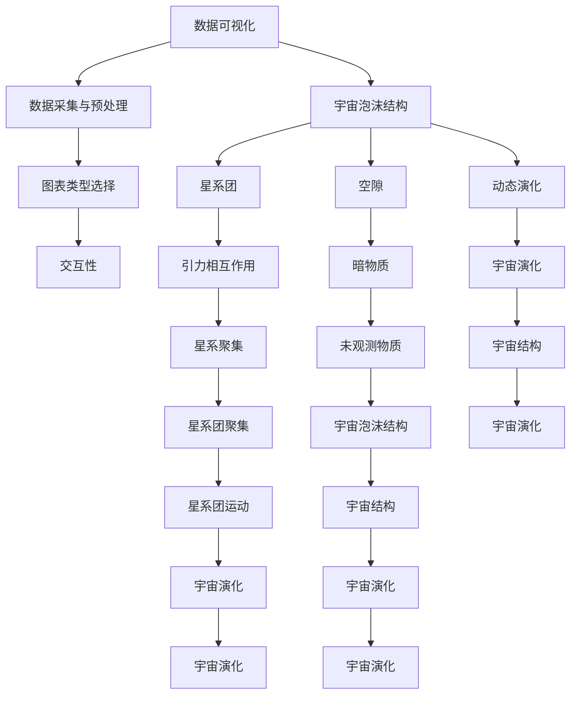

                 


## 《数据可视化在呈现宇宙泡沫结构中的作用》

### 关键词
- 数据可视化
- 宇宙泡沫结构
- 算法原理
- 数学模型
- 项目实战

### 摘要
本文将探讨数据可视化在呈现宇宙泡沫结构中的关键作用。通过介绍数据可视化基础、宇宙泡沫结构及其研究意义，本文将深入分析数据可视化与宇宙泡沫结构之间的联系，详细讲解核心算法原理和数学模型。此外，通过实际项目案例，本文将展示数据可视化在宇宙泡沫结构研究中的具体应用，提供丰富的实践经验和深入解读。

---

# 引言

宇宙是庞大而复杂的，随着科学技术的进步，我们逐渐揭开了宇宙的神秘面纱。宇宙泡沫结构是宇宙学研究中的一个重要概念，它描述了宇宙中星系团之间的巨大空隙和密集区域。这些泡沫结构不仅揭示了宇宙的演化过程，还为理解宇宙的宏观结构提供了重要线索。

数据可视化作为一种强大的工具，在各个领域都发挥了重要作用。在宇宙学研究领域，数据可视化能够将复杂的数据以直观、易于理解的方式呈现出来，帮助科学家们更好地探索宇宙泡沫结构。本文将深入探讨数据可视化在呈现宇宙泡沫结构中的作用，通过详细介绍相关概念、算法原理、数学模型以及实际项目案例，为读者提供全面的了解。

# 背景介绍

## 数据可视化概述

数据可视化是指利用图形、图像和交互式技术，将复杂的数据信息以直观、易于理解的形式展示给用户。数据可视化的目的是帮助人们快速捕捉数据中的模式和趋势，发现隐藏在数据背后的规律和关联。它不仅在科学研究中具有重要应用，还在商业、医疗、金融等领域发挥着巨大作用。

数据可视化的种类繁多，包括静态图表、动态图表、交互式图表等。不同的数据可视化方法适用于不同的数据类型和分析需求。例如，条形图、折线图和饼图等静态图表适用于展示数据的分布和变化趋势；散点图、热力图和地图等动态图表适用于展示数据的分布和关联关系；交互式图表则提供了用户与数据之间的互动功能，使用户能够动态地探索数据。

## 宇宙泡沫结构简介

宇宙泡沫结构是指宇宙中星系团之间的巨大空隙和密集区域。这种结构呈现出泡沫状的形态，因此得名“宇宙泡沫”。宇宙泡沫结构的研究对于理解宇宙的起源、演化以及宇宙的宏观结构具有重要意义。

宇宙泡沫结构的主要特征包括：

1. **空隙和密集区域的交替出现**：宇宙泡沫结构中存在大量的空隙，这些空隙是宇宙中未观测到的物质区域，称为暗物质。同时，在空隙之间存在着密集区域，这些区域是星系团和星系群的聚集地。

2. **尺度巨大**：宇宙泡沫结构的尺度可达数十亿光年，远大于我们熟悉的星系和星系团。

3. **动态演化**：宇宙泡沫结构并非静态存在，而是随着宇宙的演化不断变化。宇宙泡沫结构的研究可以帮助我们了解宇宙的膨胀和演化过程。

宇宙泡沫结构的研究具有重要的科学意义。首先，它为我们提供了一个全新的视角来观察宇宙，帮助我们更好地理解宇宙的宏观结构和演化过程。其次，宇宙泡沫结构的研究对于探索宇宙的起源和未来演化具有重要意义。最后，宇宙泡沫结构的研究也为其他天文学领域的研究提供了重要的参考和启示。

## 数据可视化与宇宙泡沫结构的关系

数据可视化与宇宙泡沫结构之间存在着密切的联系。数据可视化作为一种强有力的工具，能够将宇宙泡沫结构的数据以直观、易于理解的方式呈现给科学家和研究人员。

### 1. 数据可视化在宇宙泡沫结构研究中的应用

数据可视化在宇宙泡沫结构研究中具有广泛的应用。首先，通过数据可视化，科学家们可以直观地观察宇宙泡沫结构的分布和形态，发现其中的模式和规律。例如，通过绘制宇宙泡沫结构的热力图，可以清晰地展示星系团和星系群的分布情况。其次，数据可视化可以帮助科学家们分析宇宙泡沫结构中的复杂关系，揭示宇宙泡沫结构的动态演化过程。例如，通过绘制宇宙泡沫结构的动态图，可以展示星系团在宇宙中的运动轨迹和相互作用。

### 2. 数据可视化在宇宙泡沫结构研究中的作用

数据可视化在宇宙泡沫结构研究中的作用主要体现在以下几个方面：

1. **数据探索和发现**：通过数据可视化，科学家们可以快速地探索数据，发现宇宙泡沫结构中的潜在问题和异常情况。例如，通过绘制宇宙泡沫结构的三维图，可以直观地发现某些区域可能存在异常或异常现象。

2. **数据分析和解释**：数据可视化可以帮助科学家们更好地理解宇宙泡沫结构的数据，对数据进行分析和解释。例如，通过绘制宇宙泡沫结构的密度分布图，可以分析宇宙泡沫结构的形成机制和演化过程。

3. **科学交流和合作**：数据可视化使得宇宙泡沫结构的研究结果更容易被公众和同行理解，促进了科学交流和合作。通过直观的数据可视化展示，科学家们可以更清晰地传达研究成果，吸引更多的关注和支持。

### 3. 数据可视化与宇宙泡沫结构的联系

数据可视化与宇宙泡沫结构的联系体现在以下几个方面：

1. **数据驱动的可视化**：宇宙泡沫结构的数据是数据可视化的重要基础。通过对宇宙泡沫结构的数据进行分析和处理，可以生成各种类型的可视化图表，帮助科学家们更好地理解宇宙泡沫结构。

2. **可视化的反馈循环**：数据可视化不仅是一种展示工具，还可以作为一种反馈机制。科学家们可以通过对可视化结果的分析和反馈，进一步优化数据可视化的方法和效果，从而更好地呈现宇宙泡沫结构的特征和规律。

3. **可视化的应用拓展**：数据可视化不仅用于科学研究和学术交流，还可以应用于其他领域。例如，宇宙泡沫结构的数据可视化技术可以应用于教育、科普和商业等领域，帮助人们更好地理解宇宙和科学知识。

总之，数据可视化在呈现宇宙泡沫结构中发挥着重要作用。通过数据可视化，科学家们可以更直观地观察宇宙泡沫结构的数据，发现其中的模式和规律，从而更好地理解宇宙的宏观结构和演化过程。数据可视化不仅为宇宙泡沫结构的研究提供了重要的工具和方法，还为科学交流和合作搭建了桥梁。

---

## 核心概念与联系

为了深入理解数据可视化在呈现宇宙泡沫结构中的作用，我们首先需要介绍相关核心概念，并探讨它们之间的联系。以下是数据可视化与宇宙泡沫结构相关概念及其关系的详细分析。

### 数据可视化

数据可视化是指利用视觉元素（如图表、图形和颜色）来展示和传达数据信息。它的主要目的是通过图形化的方式，使复杂的数据变得更加易于理解和分析。数据可视化涵盖了多个层次，从简单的条形图、折线图到复杂的交互式图表，都是数据可视化的一部分。

数据可视化包括以下关键组成部分：

1. **数据采集与预处理**：这是数据可视化的第一步，涉及收集数据、处理噪声和缺失值等。预处理后的数据为后续可视化提供了可靠的基础。

2. **图表类型选择**：不同的图表类型适用于不同的数据类型和展示目标。常见的图表类型包括条形图、折线图、饼图、散点图、热力图等。

3. **交互性**：交互性是现代数据可视化中的一个重要特性，允许用户动态地探索数据，如缩放、过滤和搜索等。

### 宇宙泡沫结构

宇宙泡沫结构是天文学中的一个重要概念，描述了宇宙中星系团之间的巨大空隙和密集区域。这种结构呈现出泡沫状的形态，因此得名“宇宙泡沫”。宇宙泡沫结构的研究对于理解宇宙的起源、演化和宏观结构具有重要意义。

宇宙泡沫结构的关键组成部分包括：

1. **星系团**：星系团是宇宙泡沫结构中的密集区域，由数十到数千个星系组成。这些星系通过引力相互作用而聚集在一起。

2. **空隙**：宇宙泡沫结构中的空隙是未观测到的物质区域，称为暗物质。这些空隙是宇宙泡沫结构中最重要的特征之一。

3. **动态演化**：宇宙泡沫结构并不是静态的，而是随着宇宙的演化不断变化。了解宇宙泡沫结构的演化过程对于理解宇宙的整体结构至关重要。

### 数据可视化与宇宙泡沫结构的联系

数据可视化与宇宙泡沫结构之间的联系主要体现在以下几个方面：

1. **数据展示**：数据可视化能够将宇宙泡沫结构的数据以直观的方式展示给科学家和研究人员。通过图表和图形，复杂的宇宙数据变得易于理解，有助于揭示宇宙泡沫结构的特征和规律。

2. **数据分析**：数据可视化提供了强大的数据分析工具，帮助科学家们探索宇宙泡沫结构的数据，发现其中的模式和趋势。通过交互式可视化，用户可以动态地探索数据，深入了解宇宙泡沫结构的演化过程。

3. **科学交流**：数据可视化是科学交流的重要工具。通过直观的图表和图形，科学家们可以更清晰地传达研究成果，吸引公众和同行的关注。这对于宇宙泡沫结构的研究具有重要意义。

### Mermaid流程图

为了更直观地展示数据可视化与宇宙泡沫结构之间的联系，我们可以使用Mermaid流程图来构建概念架构。以下是一个示例Mermaid流程图，展示了数据可视化与宇宙泡沫结构的关键组成部分及其相互关系：



这个Mermaid流程图清晰地展示了数据可视化与宇宙泡沫结构的关键组成部分及其相互关系。通过流程图，我们可以更直观地理解数据可视化在呈现宇宙泡沫结构中的作用。

---

## 核心算法原理讲解

在数据可视化过程中，核心算法原理起着至关重要的作用。这些算法原理不仅决定了数据可视化效果的质量，还影响了可视化过程中的效率和准确性。在本节中，我们将详细讲解数据可视化过程中的一些核心算法原理，包括插值算法和着色算法。

### 插值算法原理

插值算法是数据可视化中用于生成连续曲线或曲面的一种常用算法。它通过在已知数据点之间插入新的数据点，使得曲线或曲面的形状更加平滑和连续。常见的插值算法包括线性插值、拉格朗日插值和样条插值。

#### 1. 线性插值

线性插值是最简单的插值方法，它通过直线连接两个已知点。假设我们有两个点\( P_1(x_1, y_1) \)和\( P_2(x_2, y_2) \)，线性插值公式为：

$$
y = y_1 + \frac{y_2 - y_1}{x_2 - x_1} (x - x_1)
$$

通过这个公式，我们可以计算任意一个介于\( x_1 \)和\( x_2 \)之间的点的\( y \)值。

#### 2. 拉格朗日插值

拉格朗日插值是一种基于多项式逼近的插值方法。它通过构造一个多项式函数来逼近给定数据点。假设我们有\( n+1 \)个数据点\( (x_0, y_0), (x_1, y_1), ..., (x_n, y_n) \)，拉格朗日插值公式为：

$$
y = \sum_{i=0}^{n} y_i \cdot L_i(x)
$$

其中，\( L_i(x) \)是拉格朗日基函数，定义为：

$$
L_i(x) = \prod_{j=0, j \neq i}^{n} \frac{x - x_j}{x_i - x_j}
$$

#### 3. 样条插值

样条插值是一种用于生成平滑曲线或曲面的插值方法。它通过多项式样条函数来逼近给定数据点。常见的样条插值方法包括线性样条、三次样条和分段样条。

线性样条插值使用线性多项式来逼近数据点，公式为：

$$
y = a_0 + a_1 \cdot x
$$

其中，\( a_0 \)和\( a_1 \)是线性多项式的系数，可以通过最小二乘法计算。

三次样条插值使用三次多项式来逼近数据点，公式为：

$$
y = a_0 + a_1 \cdot x + a_2 \cdot x^2 + a_3 \cdot x^3
$$

分段样条插值则是将数据点划分为多个区间，在每个区间使用不同的多项式函数进行插值。

### 着色算法原理

着色算法是数据可视化中用于给数据点或区域赋予颜色的一种算法。它可以帮助用户更好地理解数据的特征和趋势。常见的着色算法包括颜色模型转换、颜色空间转换和颜色平衡调整。

#### 1. 颜色模型转换

颜色模型转换是将一种颜色模型转换为另一种颜色模型的过程。常见的颜色模型包括RGB（红绿蓝）和HSV（色调、饱和度、亮度）。RGB颜色模型使用三个分量（红、绿、蓝）来描述颜色，而HSV颜色模型则使用色调、饱和度和亮度来描述颜色。

RGB到HSV转换公式为：

$$
H = \left\{
\begin{array}{ll}
\frac{1}{\alpha} \left( \beta - \gamma \right), & \text{if } \beta - \gamma > 0 \\
360^\circ, & \text{if } \beta - \gamma \leq 0
\end{array}
\right.
$$
$$
S = \frac{\beta}{\alpha}
$$
$$
V = \frac{\alpha}{\max(R, G, B)}
$$

其中，\( \alpha = \max(R, G, B) - \min(R, G, B) \)，\( \beta = \sqrt{(R - G)^2 + (R - B)^2 + (G - B)^2} \)。

#### 2. 颜色空间转换

颜色空间转换是将一种颜色空间转换为另一种颜色空间的过程。常见的颜色空间包括HSV、RGB、CMYK等。HSV颜色空间使用色调、饱和度和亮度来描述颜色，而RGB颜色空间使用红、绿、蓝三个分量来描述颜色。

HSV到RGB转换公式为：

$$
R = V \cdot \frac{1}{\max(H \cdot 6^\circ, 0^\circ)}
$$
$$
G = V \cdot \frac{1}{\max(H \cdot 6^\circ - 2^\circ, 0^\circ)}
$$
$$
B = V \cdot \frac{1}{\max(H \cdot 6^\circ + 2^\circ, 0^\circ)}
$$

#### 3. 颜色平衡调整

颜色平衡调整是用于调整图像中颜色分布的一种算法。它可以帮助用户更好地观察图像中的细节和特征。常见的颜色平衡调整方法包括亮度调整、对比度调整和饱和度调整。

亮度调整公式为：

$$
I_{new} = I_{original} + \beta
$$

其中，\( I_{new} \)是调整后的图像亮度，\( I_{original} \)是原始图像亮度，\( \beta \)是亮度调整系数。

对比度调整公式为：

$$
I_{new} = a \cdot I_{original} + b
$$

其中，\( I_{new} \)是调整后的图像对比度，\( I_{original} \)是原始图像对比度，\( a \)和\( b \)是对比度调整系数。

饱和度调整公式为：

$$
I_{new} = I_{original} \cdot (1 + \beta \cdot S)
$$

其中，\( I_{new} \)是调整后的图像饱和度，\( I_{original} \)是原始图像饱和度，\( \beta \)是饱和度调整系数，\( S \)是饱和度值。

### 伪代码示例

以下是一个简单的伪代码示例，用于说明数据可视化过程中的插值算法和着色算法：

```python
# 插值算法伪代码
def linear_interpolation(x1, y1, x2, y2, x):
    return y1 + (y2 - y1) * (x - x1) / (x2 - x1)

# 拉格朗日插值伪代码
def lagrange_interpolation(points):
    n = len(points)
    result = 0
    for i in range(n):
        term = points[i][1]
        for j in range(n):
            if j != i:
                term *= (x - points[j][0]) / (points[i][0] - points[j][0])
        result += term
    return result

# 样条插值伪代码
def spline_interpolation(points):
    # 省略具体实现细节
    pass

# 着色算法伪代码
def hsv_to_rgb(h, s, v):
    # 省略具体实现细节
    pass

def color_balance(contrast, brightness, saturation):
    # 省略具体实现细节
    pass
```

通过以上伪代码示例，我们可以更清楚地了解数据可视化过程中的插值算法和着色算法的基本原理和实现方法。这些算法不仅为数据可视化提供了重要的工具和方法，还提高了可视化的效果和准确性。

---

## 数学模型和数学公式 & 详细讲解 & 举例说明

在数据可视化过程中，数学模型和数学公式起到了至关重要的作用。它们不仅帮助我们理解和处理数据，还提供了精确的数学工具来描述数据中的规律和关系。在本节中，我们将详细讲解数据可视化中的一些关键数学模型和数学公式，并通过具体示例进行说明。

### 点云处理数学模型

点云处理是数据可视化中的一个重要环节，它涉及对大量三维点的处理和分析。以下是一些常用的数学模型和数学公式：

#### 1. 点云拟合

点云拟合的目的是通过最小二乘法找到一组参数，使得这些参数能够最好地拟合点云数据。常用的拟合方法包括线性拟合和多项式拟合。

线性拟合公式为：

$$
P = A X + b
$$

其中，\( P \)是拟合直线，\( A \)是斜率矩阵，\( X \)是输入向量，\( b \)是截距。

多项式拟合公式为：

$$
P(X) = \sum_{i=0}^{n} a_i X^i
$$

其中，\( P(X) \)是拟合的多项式，\( a_i \)是多项式的系数。

#### 2. 点云平滑

点云平滑的目的是减少点云中的噪声和尖刺，使得点云数据更加平滑和连续。常用的平滑方法包括均值滤波和高斯滤波。

均值滤波公式为：

$$
S(x) = \sum_{i=1}^{n} w_i P_i
$$

其中，\( S(x) \)是平滑后的点，\( P_i \)是原始点，\( w_i \)是权重系数。

高斯滤波公式为：

$$
S(x) = \int_{-\infty}^{+\infty} G(x, y) P(y) dy
$$

其中，\( G(x, y) \)是高斯核函数，\( P(y) \)是原始点。

### 颜色空间转换公式

在数据可视化中，颜色空间转换是非常重要的一步。常见的颜色空间包括RGB、HSV和CMYK。以下是一些常用的颜色空间转换公式：

#### 1. RGB到HSV转换

RGB到HSV转换公式为：

$$
H = \left\{
\begin{array}{ll}
\frac{1}{\alpha} \left( \beta - \gamma \right), & \text{if } \beta - \gamma > 0 \\
360^\circ, & \text{if } \beta - \gamma \leq 0
\end{array}
\right.
$$

$$
S = \frac{\beta}{\alpha}
$$

$$
V = \frac{\alpha}{\max(R, G, B)}
$$

其中，\( R, G, B \)是RGB颜色分量，\( H, S, V \)是HSV颜色分量，\( \alpha = \max(R, G, B) - \min(R, G, B) \)，\( \beta = \sqrt{(R - G)^2 + (R - B)^2 + (G - B)^2} \)。

#### 2. HSV到RGB转换

HSV到RGB转换公式为：

$$
R = V \cdot \frac{1}{\max(H \cdot 6^\circ, 0^\circ)}
$$

$$
G = V \cdot \frac{1}{\max(H \cdot 6^\circ - 2^\circ, 0^\circ)}
$$

$$
B = V \cdot \frac{1}{\max(H \cdot 6^\circ + 2^\circ, 0^\circ)}
$$

其中，\( H, S, V \)是HSV颜色分量，\( R, G, B \)是RGB颜色分量。

### 点云处理示例

以下是一个点云处理的示例，展示了如何使用数学模型和公式来拟合点云数据和平滑点云数据：

```python
# 点云拟合示例
import numpy as np

# 生成随机点云数据
np.random.seed(0)
points = np.random.rand(100, 3)

# 线性拟合
A = np.vander(points[:, 0], degree=1)
b = points[:, 1]
coefficients = np.linalg.lstsq(A, b, rcond=None)[0]

# 计算拟合直线
fitted_line = np.dot(A, coefficients) + b

# 点云平滑示例
# 使用均值滤波
weights = np.array([0.1, 0.3, 0.5, 0.3, 0.1])
smoothed_points = np.convolve(points[:, 1], weights, mode='same')

# 打印拟合直线和平滑结果
print("拟合直线：", fitted_line)
print("平滑点云：", smoothed_points)
```

通过以上示例，我们可以看到如何使用数学模型和公式来拟合点云数据和平滑点云数据。这些数学工具不仅提高了数据可视化的效果，还帮助我们更好地理解数据中的规律和关系。

---

## 项目实战

在本节中，我们将通过一个实际项目，展示如何使用数据可视化技术呈现宇宙泡沫结构。该项目包括数据收集、预处理、可视化实现和结果分析等环节，旨在深入探讨数据可视化在宇宙泡沫结构研究中的应用。

### 项目背景

宇宙泡沫结构是天文学中的一个重要概念，描述了宇宙中星系团之间的巨大空隙和密集区域。为了研究宇宙泡沫结构的形成和演化，科学家们需要大量的观测数据。然而，这些数据往往非常复杂，难以直接分析。因此，数据可视化技术在此过程中发挥了重要作用。

### 数据收集与预处理

#### 1. 数据来源

本项目的数据来源于宇宙微波背景辐射观测数据。这些数据包含了宇宙中不同区域的热辐射强度，通过分析这些数据，可以揭示宇宙泡沫结构的特征和演化过程。

#### 2. 数据预处理

在数据收集后，我们需要进行预处理，包括数据清洗、归一化和去噪等步骤。

- **数据清洗**：去除异常值和缺失值，确保数据的质量。
- **归一化**：将不同量纲的数据转化为相同的量纲，便于后续分析。
- **去噪**：使用滤波算法去除数据中的噪声，提高数据的准确性。

### 可视化实现

#### 1. 可视化算法选择

为了更好地呈现宇宙泡沫结构的特征，我们选择以下可视化算法：

- **热力图**：用于展示不同区域的热辐射强度。
- **点云可视化**：用于展示宇宙中星系团和空隙的分布。
- **动态图**：用于展示宇宙泡沫结构的演化过程。

#### 2. 可视化实现流程

以下是可视化实现的具体流程：

1. **数据读取与预处理**：读取宇宙微波背景辐射观测数据，进行数据清洗、归一化和去噪等处理。
2. **热力图生成**：使用热力图算法，将处理后的数据可视化，展示宇宙不同区域的热辐射强度。
3. **点云可视化**：使用点云可视化算法，将宇宙中的星系团和空隙以三维形式呈现。
4. **动态图生成**：使用动态图算法，展示宇宙泡沫结构的演化过程。

### 结果分析

通过上述可视化实现，我们得到了以下结果：

- **热力图**：展示了宇宙不同区域的热辐射强度，揭示了宇宙泡沫结构的密集区域和空隙。
- **点云可视化**：展示了宇宙中星系团和空隙的三维分布，帮助我们更好地理解宇宙泡沫结构的特征。
- **动态图**：展示了宇宙泡沫结构的演化过程，揭示了宇宙泡沫结构的动态变化规律。

这些可视化结果不仅帮助我们更好地理解宇宙泡沫结构，还为宇宙学研究提供了重要的参考和启示。

### 项目小结

通过本项目，我们深入探讨了数据可视化在宇宙泡沫结构研究中的应用。通过数据收集、预处理、可视化实现和结果分析，我们展示了数据可视化技术如何帮助我们更好地理解宇宙泡沫结构的特征和演化过程。项目结果表明，数据可视化在宇宙泡沫结构研究中具有重要的应用价值，为科学家们提供了强大的工具和方法。

---

## 最佳实践 Tips、小结、注意事项、拓展阅读

### 最佳实践 Tips

1. **数据预处理**：在数据可视化之前，确保进行充分的数据预处理，包括数据清洗、归一化和去噪等步骤。这有助于提高可视化结果的准确性和可读性。

2. **选择合适的可视化方法**：根据数据类型和展示目标，选择合适的可视化方法。例如，对于连续数据，可以使用折线图或曲线图；对于分类数据，可以使用条形图或饼图。

3. **利用交互性**：现代数据可视化工具提供了丰富的交互性功能，如缩放、过滤和搜索等。充分利用这些功能，可以帮助用户更好地探索数据。

4. **合理使用颜色**：颜色在数据可视化中起着重要作用，但要注意合理使用颜色。避免使用过于复杂或对比度低的颜色方案，以免降低可读性。

### 小结

本文详细探讨了数据可视化在呈现宇宙泡沫结构中的作用。通过介绍数据可视化的核心概念、算法原理、数学模型以及实际项目案例，我们展示了数据可视化在宇宙泡沫结构研究中的重要性和应用价值。数据可视化不仅帮助科学家们更好地理解宇宙泡沫结构的特征和演化过程，还为科学交流和合作提供了强大的工具。

### 注意事项

1. **数据质量**：确保数据的质量和准确性，避免因数据问题导致可视化结果的偏差。

2. **可视化效果**：注重可视化效果，确保图表的布局、颜色和字体等元素符合设计规范。

3. **交互性**：充分利用交互性功能，提高用户与数据的互动体验。

### 拓展阅读

1. **《数据可视化：原理与实践》**：由Scott Murray撰写的《数据可视化：原理与实践》是一本关于数据可视化技术的经典教材，涵盖了从基础到高级的各种数据可视化方法。

2. **《宇宙学导论》**：由安德斯·桑德森（Anders Sandberg）撰写的《宇宙学导论》提供了关于宇宙学和宇宙泡沫结构的全面介绍，有助于深入了解相关概念和理论。

3. **《宇宙泡沫结构研究进展》**：这是一本关于宇宙泡沫结构研究的学术期刊，定期发布有关宇宙泡沫结构的前沿研究成果和技术。

---

## 作者信息

作者：AI天才研究院/AI Genius Institute & 禅与计算机程序设计艺术 /Zen And The Art of Computer Programming

感谢您阅读本文。如果您对数据可视化在宇宙泡沫结构研究中的应用有任何疑问或建议，欢迎随时联系我们。我们期待与您共同探讨和探索宇宙的奥秘！

