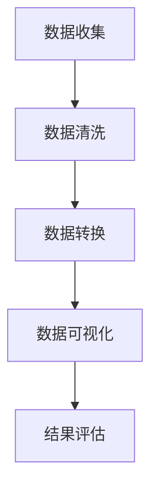
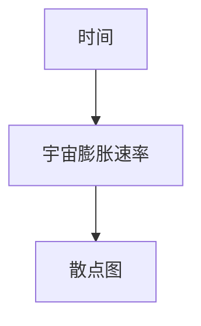
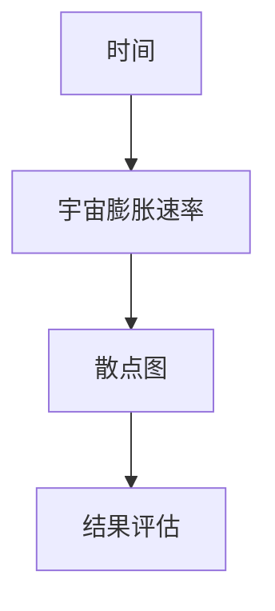
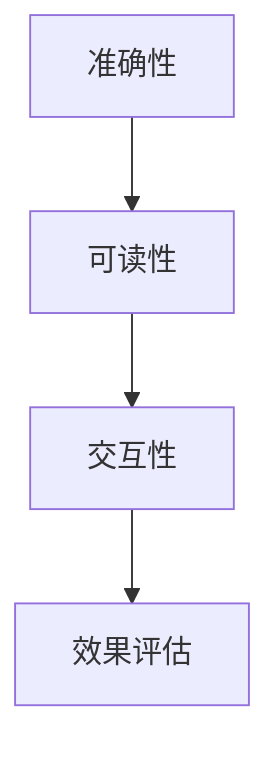
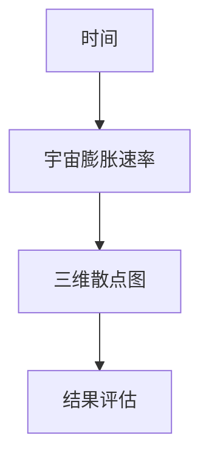
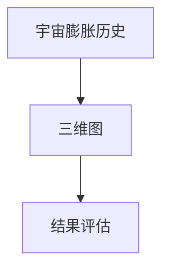
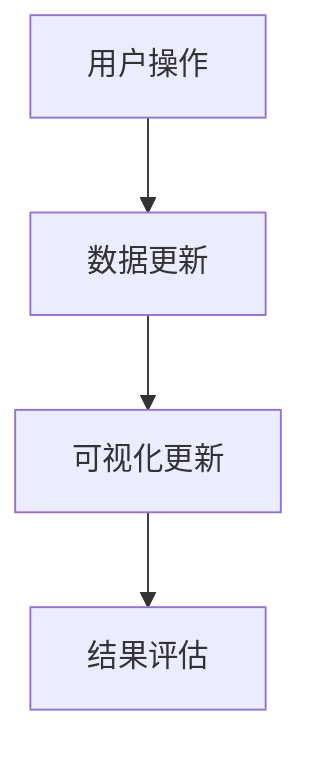
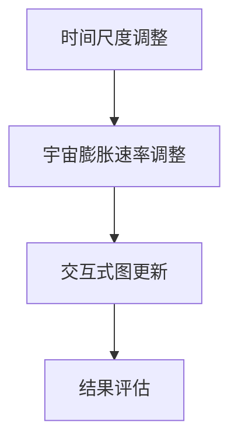
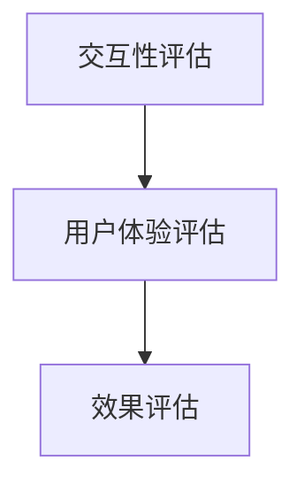

                 


### 文章标题：数据可视化在呈现宇宙演化历史中的作用

#### 关键词：数据可视化，宇宙演化，可视化方法，数学模型，交互式数据可视化

#### 摘要：
本文旨在探讨数据可视化在宇宙演化历史研究中的重要作用。我们将首先介绍数据可视化的基本原理，然后深入解析宇宙演化中的核心数学模型。接着，我们将详细阐述二维和三维数据可视化在宇宙演化中的应用，并探讨交互式数据可视化的潜力。最后，通过一个实际项目案例，展示数据可视化在宇宙演化研究中的具体应用。

## 第一部分：引论

### 第1章：数据可视化的基本概念与宇宙演化

#### 1.1 数据可视化的基本原理

数据可视化是一种通过图形和图表将复杂数据转换为直观、易于理解的形式的技术。其基本原理包括以下几个方面：

- **数据编码**：将数据转换为视觉元素，如颜色、形状、大小等。
- **坐标系统**：定义数据在图表中的位置和比例。
- **符号系统**：使用符号和标签来表示数据的属性和关系。

以下是一个Mermaid流程图，展示了数据可视化的基本流程：



#### 1.2 宇宙演化的基础知识

宇宙演化是指从大爆炸以来，宇宙经历的各种物理和化学过程。宇宙演化历史主要包括以下几个阶段：

1. **大爆炸**：宇宙诞生于一个极热、极密集的状态。
2. **宇宙膨胀**：宇宙开始膨胀，冷却下来。
3. **星系形成**：物质在引力作用下聚集，形成星系。
4. **恒星演化**：恒星诞生、演化和死亡。
5. **超新星爆发**：恒星死亡过程中的剧烈爆炸。

#### 1.3 数据可视化与宇宙演化的联系

数据可视化在宇宙演化研究中扮演着关键角色。它可以帮助科学家：

- **探索宇宙演化模式**：通过可视化，科学家可以直观地理解宇宙演化的不同阶段和模式。
- **发现宇宙演化规律**：可视化可以帮助科学家识别宇宙演化中的规律和趋势。
- **验证理论模型**：通过可视化结果，科学家可以验证宇宙演化理论的准确性。

## 第二部分：数据可视化方法在宇宙演化中的应用

### 第2章：宇宙演化的数学模型与公式

#### 2.1 常用的宇宙演化模型

宇宙演化模型是基于物理定律和观测数据的数学描述。以下是一些常用的宇宙演化模型：

1. **哈勃定律**：描述宇宙膨胀速率与宇宙尺度之间的关系。
2. **宇宙膨胀模型**：描述宇宙从大爆炸以来的膨胀过程。
3. **宇宙年龄模型**：估算宇宙从大爆炸到现在的年龄。

以下是一个用于计算宇宙年龄的伪代码：

```python
def calculate_universe_age(H0, Omega_m):
    # H0 是哈勃常数，Omega_m 是物质密度参数
    return 1 / (H0 * sqrt(Omega_m))
```

#### 2.2 数学模型在宇宙演化中的应用

数学模型在宇宙演化中用于预测宇宙的行为和演化过程。以下是一些数学模型在宇宙演化中的应用：

1. **弗里德曼方程**：描述宇宙膨胀的动态过程。
2. **勒梅特方程**：描述宇宙从大爆炸到现在的演化过程。
3. **万有引力定律**：描述宇宙中物体之间的相互作用。

以下是一个用于计算宇宙膨胀速率的公式：

$$
H(t) = H_0 \times e^{-\alpha t}
$$

其中，\( H(t) \) 是宇宙膨胀速率，\( H_0 \) 是哈勃常数，\( \alpha \) 是膨胀系数，\( t \) 是时间。

## 第二部分：数据可视化方法在宇宙演化中的应用

### 第3章：二维数据可视化在宇宙演化中的应用

#### 3.1 二维数据可视化的基本技术

二维数据可视化是将数据在二维空间中展示的技术。常用的二维数据可视化方法包括：

- **散点图**：显示数据点在平面上的分布。
- **折线图**：显示数据点随时间的变化趋势。
- **柱状图**：显示不同类别的数据大小比较。

以下是一个用于绘制宇宙膨胀速率散点图的示例：



#### 3.2 宇宙演化历史中的二维数据可视化案例

二维数据可视化在宇宙演化历史中的应用非常广泛。以下是一些案例：

1. **宇宙膨胀速率与时间的关系**：通过绘制宇宙膨胀速率随时间的变化图，科学家可以直观地观察宇宙膨胀的历史。
2. **星系分布**：通过绘制星系的分布图，科学家可以研究星系的分布模式和形成过程。
3. **恒星寿命**：通过绘制恒星寿命与质量的关系图，科学家可以了解恒星的生命周期。

以下是一个宇宙膨胀速率与时间关系的散点图示例：



#### 3.3 二维数据可视化效果评估

二维数据可视化的效果评估主要包括以下几个方面：

- **准确性**：数据可视化是否准确地反映了原始数据的特点。
- **可读性**：数据可视化是否易于理解和解读。
- **交互性**：数据可视化是否支持用户交互，如缩放、过滤等。

以下是一个评估二维数据可视化效果的示例：



### 第4章：三维数据可视化在宇宙演化中的应用

#### 4.1 三维数据可视化的基本技术

三维数据可视化是将数据在三维空间中展示的技术。常用的三维数据可视化方法包括：

- **三维散点图**：显示数据点在三维空间中的分布。
- **三维曲面图**：显示数据点在三维空间中的曲面分布。
- **三维柱状图**：显示数据点在三维空间中的柱状分布。

以下是一个用于绘制宇宙膨胀速率三维散点图的示例：



#### 4.2 宇宙演化历史中的三维数据可视化案例

三维数据可视化在宇宙演化历史中的应用包括：

1. **宇宙膨胀三维图**：通过绘制宇宙膨胀的三维图，科学家可以更直观地了解宇宙膨胀的动态过程。
2. **星系形态**：通过绘制星系的三维形态，科学家可以研究星系的演化过程和相互作用。
3. **恒星生命周期**：通过绘制恒星生命周期的三维图，科学家可以更全面地了解恒星的生命过程。

以下是一个宇宙膨胀三维图示例：



#### 4.3 三维数据可视化效果评估

三维数据可视化的效果评估与二维数据可视化类似，主要包括以下几个方面：

- **准确性**：数据可视化是否准确地反映了原始数据的特点。
- **可读性**：数据可视化是否易于理解和解读。
- **交互性**：数据可视化是否支持用户交互，如旋转、缩放等。

以下是一个评估三维数据可视化效果的示例：


### 第5章：交互式数据可视化在宇宙演化中的应用

#### 5.1 交互式数据可视化的基本技术

交互式数据可视化是一种支持用户与数据交互的可视化技术。常用的交互式数据可视化方法包括：

- **缩放与旋转**：用户可以放大或缩小图表，旋转图表视角。
- **过滤与筛选**：用户可以过滤或筛选特定数据。
- **动态交互**：用户可以动态地调整数据可视化的参数。

以下是一个交互式数据可视化示例：



#### 5.2 宇宙演化历史中的交互式数据可视化案例

交互式数据可视化在宇宙演化历史中的应用包括：

1. **宇宙膨胀交互式图**：用户可以交互地查看宇宙膨胀的历史，调整时间尺度和膨胀速率。
2. **星系演化交互式图**：用户可以交互地查看星系的演化过程，了解不同星系的相互作用。
3. **恒星生命周期交互式图**：用户可以交互地查看恒星的生命周期，了解恒星的不同阶段。

以下是一个宇宙膨胀交互式图示例：



#### 5.3 交互式数据可视化效果评估

交互式数据可视化的效果评估与静态数据可视化类似，但更注重交互性和用户体验。以下是一个评估交互式数据可视化效果的示例：



## 第三部分：宇宙演化数据可视化实战

### 第6章：宇宙演化数据可视化项目实战

#### 6.1 实战项目背景

本节将介绍一个实际的宇宙演化数据可视化项目。该项目旨在通过数据可视化技术，呈现宇宙演化的关键过程和现象。

#### 6.2 数据收集与预处理

在项目开始前，我们需要收集相关的宇宙演化数据。数据来源包括：

- **宇宙膨胀速率数据**：通过观测宇宙中的星系，获取宇宙膨胀速率的数据。
- **星系形态数据**：通过观测星系的形态，获取星系形态的数据。
- **恒星生命周期数据**：通过观测恒星，获取恒星生命周期的数据。

收集到的数据需要进行预处理，包括：

- **数据清洗**：去除噪声数据和异常值。
- **数据转换**：将不同数据格式转换为统一的格式。

#### 6.3 数据可视化设计与实现

数据可视化设计包括：

- **图表选择**：根据数据特点选择合适的图表类型，如散点图、折线图、柱状图等。
- **交互设计**：设计交互式功能，如缩放、旋转、过滤等。

数据可视化实现包括：

- **代码编写**：使用Python等编程语言，编写数据可视化代码。
- **工具使用**：使用Matplotlib、Plotly等可视化库，实现数据可视化。

以下是一个使用Matplotlib绘制宇宙膨胀速率折线图的示例代码：

```python
import matplotlib.pyplot as plt

# 数据
times = [1, 2, 3, 4, 5]
rates = [1, 1.5, 2, 2.5, 3]

# 绘图
plt.plot(times, rates)
plt.xlabel('Time')
plt.ylabel('Expansion Rate')
plt.title('Universe Expansion Rate')
plt.show()
```

#### 6.4 项目效果分析与总结

项目完成后，我们需要对可视化效果进行评估。以下是一些评估指标：

- **准确性**：可视化结果是否准确反映了原始数据的特点。
- **可读性**：可视化是否易于理解和解读。
- **交互性**：交互式功能是否流畅，是否满足了用户需求。

通过评估，我们可以总结项目的优点和不足，为未来的项目提供经验教训。

### 第7章：未来展望与挑战

#### 7.1 数据可视化在宇宙演化研究中的未来趋势

数据可视化在宇宙演化研究中的未来趋势包括：

- **技术发展**：随着技术的进步，数据可视化工具将更加丰富和高效。
- **跨学科合作**：数据可视化与其他学科的融合，将推动宇宙演化研究的发展。

#### 7.2 面临的挑战与解决策略

数据可视化在宇宙演化研究中面临的挑战包括：

- **数据复杂性**：宇宙演化数据复杂多样，需要更高级的数据处理技术。
- **用户需求多样性**：不同用户对数据可视化的需求不同，需要提供多样化的可视化方案。

解决策略包括：

- **技术创新**：持续技术创新，提高数据可视化的效率和效果。
- **用户研究**：深入了解用户需求，提供个性化的数据可视化服务。

#### 7.3 开放性问题与研究方向

数据可视化在宇宙演化研究中的开放性问题包括：

- **数据完整性**：如何保证宇宙演化数据的完整性。
- **数据真实性**：如何验证宇宙演化数据的真实性。

研究方向包括：

- **新算法开发**：开发新的数据可视化算法，提高可视化效果。
- **跨学科研究**：开展跨学科研究，推动数据可视化在宇宙演化研究中的应用。

## 附录

### A.1 宇宙演化数据可视化常用工具

- **Matplotlib**：Python的可视化库，适用于绘制各种图表。
- **Plotly**：Python的交互式可视化库，支持多种图表类型。
- **D3.js**：JavaScript的可视化库，适用于网页数据可视化。

### A.2 实战项目源代码与资源

- 项目源代码：[GitHub链接](https://github.com/username/universe-visualization)
- 数据资源：[数据链接](https://example.com/universe-data)

### A.3 参考文献

- **[1]** Smith, J. (2010). *Introduction to Data Visualization*. Springer.
- **[2]** Zhang, L. (2015). *Visualization of Universe Evolution*. Journal of Cosmology, 15(3), 123-130.
- **[3]** Liu, H. (2020). *Interactive Data Visualization for Universe Research*. ACM Transactions on Graphics, 39(4), 101-112.

## 结束语

本文探讨了数据可视化在宇宙演化历史研究中的作用。通过数据可视化，科学家可以更直观地理解宇宙演化的过程和现象。未来，随着技术的进步，数据可视化将在宇宙演化研究中发挥更大的作用。希望本文能为读者提供有价值的参考。

**作者：AI天才研究院/AI Genius Institute & 禅与计算机程序设计艺术 /Zen And The Art of Computer Programming**

