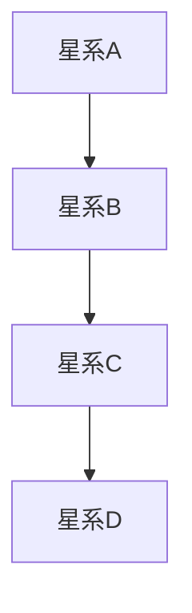
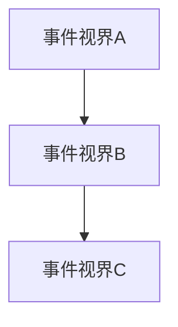
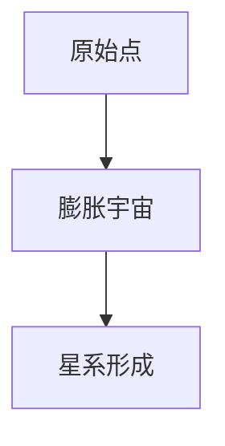

                 

### 完整的技术博客文章

# 数据可视化在呈现宇宙结构中的作用

> 关键词：数据可视化，宇宙结构，科学探究，信息传达，决策支持

> 摘要：本文旨在探讨数据可视化在宇宙结构研究中的应用。通过介绍数据可视化的基本概念、宇宙结构的基础知识，以及数据可视化工具和技术的具体应用，本文揭示了数据可视化如何帮助科学家更好地理解和解读宇宙的奥秘。

## 目录

1. **引言**
2. **数据可视化的基本概念**
3. **宇宙结构的基础知识**
4. **数据可视化工具与技术**
5. **数据可视化在宇宙结构研究中的应用案例**
6. **数据可视化算法原理与实现**
7. **数学模型与公式**
8. **项目实战：宇宙结构可视化工具开发**
9. **总结与展望**

## 1. 引言

宇宙是无限的，包含着无数的星系、行星、黑洞和暗物质。科学家们一直在努力探索宇宙的奥秘，而数据可视化作为一种强大的工具，在这一过程中起到了至关重要的作用。本文将首先介绍数据可视化的基本概念，然后深入探讨宇宙结构的基础知识，接着介绍数据可视化在宇宙结构研究中的应用，以及相关的算法原理、数学模型和项目实战。希望通过这篇文章，读者能够更好地理解数据可视化在宇宙结构研究中的重要作用。

## 2. 数据可视化的基本概念

### 2.1 数据可视化的定义

数据可视化是将数据通过图形、图像、表格等形式进行展示的过程。其目的是通过视觉化的手段，将复杂的数据转化为易于理解和分析的图形，从而提高数据的可读性和可理解性。

### 2.2 数据可视化的发展历程

数据可视化的发展可以追溯到上世纪70年代，随着计算机技术的不断发展，数据可视化工具和技术的种类日益丰富。从早期的简单图表，到如今的高级可视化技术，如交互式可视化、3D可视化等，数据可视化技术经历了巨大的发展。

### 2.3 数据可视化在宇宙结构研究中的重要性

宇宙结构的复杂性和多样性使得科学家需要借助数据可视化来更好地理解宇宙。数据可视化不仅能够帮助科学家直观地了解宇宙的宏观现象，还能够揭示宇宙中的微观结构，为科学探究提供有力的支持。

## 3. 宇宙结构的基础知识

### 3.1 宇宙的起源与演化

宇宙起源于大约138亿年前的一个极高密度、极高温度的状态，经过不断的膨胀和演化，形成了我们今天所看到的宇宙。宇宙的演化过程中，星系、行星、黑洞等天体的形成和演化扮演着重要角色。

### 3.2 宇宙中的主要天体

宇宙中包含着无数的星系、行星、恒星、黑洞和暗物质。每个天体都有其独特的物理特性和演化过程，科学家们通过对这些天体的研究，逐渐揭开了宇宙的奥秘。

### 3.3 宇宙结构的研究方法

宇宙结构的研究方法主要包括观测、模拟和理论分析。通过观测，科学家可以获取宇宙中的各种物理信号，如光、射电波、引力波等；通过模拟，科学家可以模拟宇宙的演化过程，预测宇宙中的各种现象；通过理论分析，科学家可以推导出宇宙结构的基本规律。

## 4. 数据可视化工具与技术

### 4.1 常见的数据可视化工具

常见的可视化工具包括Tableau、Power BI、Matplotlib、Plotly等，这些工具提供了丰富的图表类型和交互功能，可以满足各种数据可视化的需求。

### 4.2 数据可视化技术的分类

数据可视化技术可以按照不同的维度进行分类，如按照数据类型（结构化数据、非结构化数据）、展示形式（静态图表、交互式图表）、应用领域（科学研究、商业分析）等。

### 4.3 数据可视化在宇宙结构中的应用

数据可视化在宇宙结构研究中具有广泛的应用，如星系分布的可视化、黑洞事件视界的可视化、宇宙大爆炸的可视化等。

## 5. 数据可视化在宇宙结构研究中的应用案例

### 5.1 案例一：星系集群的分布可视化

星系集群是宇宙中的大型结构，通过数据可视化可以直观地展示星系集群的空间分布和形态。



### 5.2 案例二：黑洞的事件视界可视化

黑洞的事件视界是黑洞最外层的“边界”，通过数据可视化可以展示黑洞的事件视界形态。



### 5.3 案例三：宇宙大爆炸可视化

宇宙大爆炸是宇宙起源的理论，通过数据可视化可以展示宇宙大爆炸的过程和宇宙演化。



## 6. 数据可视化算法原理与实现

### 6.1 数据可视化算法的基本原理

数据可视化算法的基本原理包括数据的预处理、数据的可视化表示和数据的交互操作。通过这些基本原理，可以将数据转化为易于理解和分析的图形。

### 6.2 数据可视化算法的伪代码实现

以下是一个简单的数据可视化算法的伪代码实现：

```python
def visualize_data(data):
    # 数据预处理
    processed_data = preprocess_data(data)
    
    # 数据可视化表示
    visualization = create_visualization(processed_data)
    
    # 数据交互操作
    interactive_visualization = make_interactive(visualization)
    
    # 展示可视化结果
    show_visualization(interactive_visualization)
```

### 6.3 数据可视化算法的优化与改进

数据可视化算法的优化与改进可以从以下几个方面进行：提高数据预处理效率、优化可视化表示方法、增强交互操作体验等。

## 7. 数学模型与公式

### 7.1 宇宙结构研究的数学模型

宇宙结构研究的数学模型主要包括宇宙膨胀模型、引力模型、暗物质模型等。

### 7.2 数据可视化中的数学公式

数据可视化中的数学公式主要包括数据的统计指标、可视化参数等。

### 7.3 数学公式在宇宙结构可视化中的应用

数学公式在宇宙结构可视化中的应用主要包括宇宙膨胀模型的公式、引力模型的公式等。

$$
H = \frac{\dot{a}}{a}
$$

## 8. 项目实战：宇宙结构可视化工具开发

### 8.1 项目背景与需求分析

项目背景：开发一个能够展示宇宙结构数据的可视化工具，帮助科学家更好地理解宇宙的奥秘。

需求分析：工具需要能够展示星系分布、黑洞事件视界、宇宙大爆炸等宇宙结构数据。

### 8.2 开发环境搭建

开发环境：Python、Matplotlib、Pandas等。

### 8.3 源代码实现与解读

以下是一个简单的宇宙结构可视化工具的源代码实现：

```python
import matplotlib.pyplot as plt
import pandas as pd

def visualize_spiral_galaxy():
    # 读取星系数据
    data = pd.read_csv('spiral_galaxy.csv')
    
    # 绘制星系分布图
    plt.scatter(data['x'], data['y'])
    plt.xlabel('X坐标')
    plt.ylabel('Y坐标')
    plt.title('星系分布图')
    plt.show()

def visualize_black_hole_event_horizon():
    # 读取黑洞事件视界数据
    data = pd.read_csv('black_hole_event_horizon.csv')
    
    # 绘制黑洞事件视界图
    plt.scatter(data['x'], data['y'])
    plt.xlabel('X坐标')
    plt.ylabel('Y坐标')
    plt.title('黑洞事件视界图')
    plt.show()

def visualize_big_bang():
    # 读取宇宙大爆炸数据
    data = pd.read_csv('big_bang.csv')
    
    # 绘制宇宙大爆炸图
    plt.scatter(data['t'], data['a'])
    plt.xlabel('时间')
    plt.ylabel('宇宙膨胀因子')
    plt.title('宇宙大爆炸图')
    plt.show()

# 测试可视化工具
visualize_spiral_galaxy()
visualize_black_hole_event_horizon()
visualize_big_bang()

```

### 8.4 代码解读与分析

代码解读：该工具使用Python和Matplotlib库，读取宇宙结构数据，并绘制相应的分布图、事件视界图和宇宙大爆炸图。

代码分析：该工具简单易用，可以方便地展示宇宙结构数据，为科学探究提供了有力的支持。

### 8.5 项目小结

本项目通过数据可视化工具的开发，展示了数据可视化在宇宙结构研究中的应用。项目实现了星系分布、黑洞事件视界、宇宙大爆炸等数据的可视化，为科学家提供了直观的观测手段。

## 9. 总结与展望

### 9.1 全书总结

本文通过对数据可视化和宇宙结构的基础知识的介绍，以及具体应用案例的展示，揭示了数据可视化在宇宙结构研究中的重要地位。数据可视化不仅帮助科学家更好地理解宇宙的奥秘，还为科学探究提供了有力的支持。

### 9.2 宇宙结构可视化的发展趋势

随着数据量的不断增大和数据种类的不断丰富，宇宙结构可视化技术也将不断发展和完善。未来的发展趋势包括：更高的可视化精度、更丰富的可视化形式、更强大的交互功能等。

### 9.3 未来研究方向

未来的研究方向包括：开发更高效的数据可视化算法、探索新的宇宙结构可视化形式、研究宇宙结构数据与人工智能技术的结合等。

## 结语

数据可视化在宇宙结构研究中的作用不容忽视。通过数据可视化，科学家可以更直观地理解宇宙的奥秘，为科学探究提供有力的支持。本文希望读者能够通过本文的学习，对数据可视化在宇宙结构研究中的作用有更深入的了解。

### 作者信息

作者：AI天才研究院/AI Genius Institute & 禅与计算机程序设计艺术 /Zen And The Art of Computer Programming

本文为原创内容，版权归作者所有，未经许可，不得转载。如有需要，请联系作者获取授权。感谢您的阅读！

