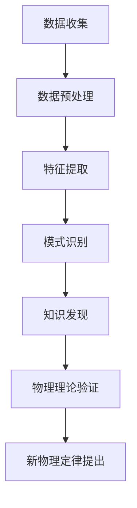

                 

### 文章标题

《数据挖掘在发现宇宙新物理定律中的作用》

### 关键词

数据挖掘、宇宙物理定律、算法应用、实战案例、未来展望

### 摘要

随着大数据时代的到来，数据挖掘技术在各个领域得到了广泛应用，尤其是在宇宙物理学领域。本文首先介绍了数据挖掘的基本概念及其在宇宙物理学研究中的应用背景。接着，我们深入探讨了数据挖掘与宇宙物理学核心概念之间的关系，并通过Mermaid流程图展示了数据挖掘在宇宙物理学研究中的应用流程。文章随后详细讲解了核心算法原理，包括聚类算法、分类算法和关联规则算法，并通过伪代码和数学模型对每个算法进行了详细阐述。接下来，我们通过实际案例展示了数据挖掘在宇宙新物理定律发现中的应用，包括宇宙背景辐射数据和暗物质分布规律的研究。最后，文章对未来数据挖掘在宇宙物理学中的发展趋势和挑战进行了展望，并提出了相关建议。

### 目录

1. **背景介绍**
2. **数据挖掘与宇宙物理学**
3. **数据挖掘核心概念与联系**
4. **核心算法原理讲解**
5. **项目实战**
6. **未来展望**
7. **最佳实践 tips**
8. **小结**

### 背景介绍

在过去的几十年中，宇宙物理学取得了许多令人瞩目的成就，例如对宇宙大爆炸理论的验证、对黑洞和暗物质的研究等。然而，随着观测技术的不断进步和数据的积累，宇宙物理学领域也面临着越来越多的挑战。传统的物理学研究方法往往依赖于理论和实验数据的简单统计分析，但随着数据的爆炸性增长，这种简单的方法已经无法满足现代宇宙物理学研究的需要。数据挖掘作为一种新兴的数据分析方法，其强大的数据处理和分析能力为宇宙物理学研究提供了新的思路和工具。

数据挖掘是一种从大量数据中通过算法分析、模式识别和知识发现等方法提取有用信息的技术。它起源于20世纪80年代，随着计算机技术和算法的发展，逐渐成为了一个独立的研究领域。数据挖掘的应用领域非常广泛，包括商业智能、医疗保健、金融市场、社交媒体等。在宇宙物理学领域，数据挖掘的应用同样具有重要意义。

首先，数据挖掘可以帮助科学家从大量观测数据中提取出有价值的信息，例如宇宙背景辐射数据中的微弱信号，这些信息可能暗示着新的物理现象或规律。其次，数据挖掘可以帮助科学家发现数据中的潜在模式，这些模式可能为宇宙物理学的理论研究提供新的启示。此外，数据挖掘还可以用于优化实验设计，提高数据采集和分析的效率，从而加速宇宙物理学的进展。

总之，数据挖掘技术在宇宙物理学领域具有广泛的应用前景，它不仅能够帮助科学家更好地理解宇宙，还可能为物理学理论的创新提供新的动力。本文将详细探讨数据挖掘在宇宙新物理定律发现中的作用，并分析其面临的挑战和未来发展方向。

### 数据挖掘与宇宙物理学

数据挖掘和宇宙物理学虽然在研究领域和应用背景上有所不同，但它们之间存在着紧密的联系。数据挖掘作为一种数据分析技术，其在宇宙物理学中的应用主要体现在以下几个方面。

首先，数据挖掘的核心概念与宇宙物理学理论密切相关。宇宙物理学研究的是宇宙的结构、演化和基本规律，这些研究需要大量的数据支持。而数据挖掘的核心概念，如数据预处理、特征提取、模式识别和知识发现等，都与宇宙物理学的数据分析过程密切相关。例如，在宇宙背景辐射的研究中，数据挖掘技术可以用于去除噪声、识别微弱信号和提取有用信息，从而揭示宇宙早期的状态。

其次，数据挖掘与宇宙物理学的结合点在于它们共同关注的问题：如何从大量数据中提取有价值的信息。宇宙物理学领域的数据往往具有高维度、大规模和复杂性的特点，这使得传统的统计分析方法难以胜任。而数据挖掘技术，如聚类算法、分类算法和关联规则算法等，能够有效地处理这些复杂的数据，帮助科学家发现数据中的潜在模式和规律。

接下来，我们可以通过一个Mermaid流程图来展示数据挖掘在宇宙物理学研究中的应用流程。这个流程图包括以下几个步骤：



- **数据收集**：宇宙物理学研究中，科学家通过各种观测设备收集大量的数据，如宇宙背景辐射、星系分布、黑洞信息等。
- **数据预处理**：对收集到的数据进行清洗、转换和归一化，以去除噪声和异常值，为后续分析做好准备。
- **特征提取**：从预处理后的数据中提取出有代表性的特征，这些特征可以用于后续的模式识别和知识发现。
- **模式识别**：使用聚类算法、分类算法等对特征进行分类和聚类，发现数据中的潜在模式和关联。
- **知识发现**：通过对模式识别的结果进行进一步分析和解释，提取出新的物理现象或规律。
- **物理理论验证**：将知识发现的结果与现有的物理理论进行对比和验证，以确定其可靠性。
- **新物理定律提出**：基于知识发现和物理理论验证的结果，提出新的物理定律或修正现有理论。

通过这个流程图，我们可以清晰地看到数据挖掘在宇宙物理学研究中的各个环节，以及每个环节之间的紧密联系。这不仅展示了数据挖掘在宇宙物理学中的应用价值，也为我们理解数据挖掘技术提供了一个直观的视角。

总的来说，数据挖掘与宇宙物理学之间的结合不仅丰富了宇宙物理学的研究方法，也为数据挖掘技术的应用开辟了新的领域。随着技术的不断进步，数据挖掘在宇宙物理学中的应用前景将更加广阔，有望带来更多突破性的发现。

### 核心概念与联系

在数据挖掘与宇宙物理学的结合过程中，理解核心概念及其相互关系是至关重要的。以下将详细介绍数据挖掘的关键概念，并探讨它们与宇宙物理学理论的联系。

#### 数据挖掘的核心概念

1. **数据预处理**：数据预处理是数据挖掘过程的第一步，旨在将原始数据转换为适合分析的形式。在宇宙物理学中，数据预处理包括数据清洗、归一化和转换等操作。例如，在处理宇宙背景辐射数据时，需要去除仪器噪声和异常值，将不同来源的数据统一格式，从而提高数据的质量。

2. **特征提取**：特征提取是从原始数据中提取出具有代表性的特征，以便用于后续的分析。在宇宙物理学中，特征提取可以帮助科学家从大量的观测数据中提取出关键的物理量，如温度、密度、速度等。这些特征可以用于描述宇宙中的各种现象，例如星系的运动、宇宙背景辐射的强度等。

3. **模式识别**：模式识别是数据挖掘中的关键步骤，旨在从数据中发现重复出现的规律或模式。在宇宙物理学中，模式识别可以帮助科学家发现星系分布的规律、黑洞的形成机制等。例如，通过聚类算法分析宇宙背景辐射数据，可以识别出不同时间段的辐射特征，从而推断宇宙的演化过程。

4. **知识发现**：知识发现是从数据中提取出具有解释性或预测性的知识。在宇宙物理学中，知识发现可以帮助科学家验证或修正物理理论。例如，通过关联规则算法分析星系数据，可以揭示星系间相互作用的新规律，从而为宇宙物理学理论提供新的依据。

#### 数据挖掘与宇宙物理学理论的联系

1. **宇宙背景辐射与数据预处理**：宇宙背景辐射是宇宙大爆炸后留下的余辉，是宇宙早期状态的直接证据。数据挖掘中的数据预处理技术，如噪声去除和异常值检测，对于提取出具有科学价值的宇宙背景辐射数据至关重要。通过数据预处理，科学家可以更加准确地分析宇宙背景辐射的微弱信号，从而揭示宇宙的早期状态。

2. **星系分布与特征提取**：宇宙中星系的分布是一个复杂的现象，通过特征提取技术，科学家可以从星系数据中提取出具有代表性的物理量，如星系的密度、速度和位置等。这些特征有助于科学家理解星系的运动规律和宇宙的演化过程。例如，通过聚类算法分析星系数据，可以发现不同类型的星系聚集区，从而揭示宇宙的大尺度结构。

3. **黑洞探测与模式识别**：黑洞是宇宙中一种极其密集的天体，由于其强大的引力场，连光也无法逃脱。数据挖掘中的模式识别技术，如聚类算法和分类算法，可以帮助科学家发现黑洞的存在和特征。例如，通过分析恒星运动轨迹的数据，可以识别出恒星因黑洞引力导致的异常现象，从而推断黑洞的存在。

4. **暗物质研究与知识发现**：暗物质是宇宙中的一种未知物质，其存在通过引力效应间接得到证实。数据挖掘中的知识发现技术，如关联规则算法，可以帮助科学家从大量观测数据中提取出暗物质的分布规律和特征。例如，通过分析星系旋转曲线和星系团的数据，可以揭示暗物质在宇宙中的分布和作用。

通过以上分析，我们可以看到，数据挖掘与宇宙物理学理论之间存在着密切的联系。数据挖掘技术不仅为宇宙物理学研究提供了新的工具和方法，也促进了我们对宇宙的认识和探索。随着数据挖掘技术的不断发展和完善，其在宇宙物理学中的应用前景将更加广阔，有望带来更多的科学发现。

### 核心算法原理讲解

在数据挖掘过程中，核心算法扮演着至关重要的角色。这些算法包括聚类算法、分类算法和关联规则算法。以下将详细讲解这些算法的基本原理，并通过伪代码和数学模型进行阐述。

#### 聚类算法

聚类算法是一种无监督学习方法，其主要目的是将数据集划分为若干个类别，使得同一类别内的数据点尽可能接近，而不同类别间的数据点尽可能远。常见的聚类算法包括K均值算法、层次聚类算法和DBSCAN算法。

**K均值算法**

K均值算法是一种基于距离的聚类算法，其目标是将数据点划分为K个聚类，使得每个数据点与其分配到的聚类中心的距离平方和最小。

**伪代码**：

```
初始化：选择K个初始聚类中心c1, c2, ..., ck
重复以下步骤：
    对于每个数据点x，计算x到每个聚类中心的距离d(x, ci)
    将x分配到距离最近的聚类中心ci
    更新每个聚类中心的坐标：ci = 平均坐标 of 聚类xi
直到聚类中心不再发生显著变化
```

**数学模型**：

设数据集为D={x1, x2, ..., xn}，聚类中心为c1, c2, ..., ck，则K均值算法的目标函数为：

$$
J = \sum_{i=1}^{K} \sum_{x \in S_i} ||x - c_i||^2
$$

其中，Si表示属于聚类ci的数据点集合。

**示例**：假设有四个数据点{x1, x2, x3, x4}，我们选择两个初始聚类中心{c1, c2}分别为(1, 1)和(5, 5)。通过计算每个数据点到聚类中心的距离，并将数据点分配到最近的聚类中心，我们可以得到聚类结果。假设第一次分配结果为{x1, x2}属于c1，{x3, x4}属于c2。接下来，我们更新聚类中心坐标为{c1_new, c2_new}分别为(1.5, 1.5)和(4.5, 4.5)。重复这个过程，直到聚类中心不再发生显著变化。

#### 分类算法

分类算法是一种有监督学习方法，其主要目的是将新数据点分配到已知的类别中。常见的分类算法包括决策树、支持向量机和神经网络。

**决策树**

决策树是一种基于特征划分的数据分类方法，其通过一系列规则将数据集划分为不同的类别。决策树的构建过程是基于特征的重要性和信息增益率来选择最优划分标准。

**伪代码**：

```
创建空树
如果所有数据点属于同一类别，则返回该类别
否则：
    选择最优特征A
    根据A划分数据点为子集{S1, S2, ..., Sk}
    对于每个子集Sj：
        在树中创建分支，将A作为测试条件
        递归构建子树，直到所有叶节点属于同一类别或达到最大深度
返回决策树
```

**数学模型**：

设特征集合为F={f1, f2, ..., fn}，数据集为D={x1, x2, ..., xn}，类别集合为C={c1, c2, ..., cm}。决策树的目标是最小化信息增益率：

$$
Gain Ratio(A) = \frac{Entropy(H(D)) - \sum_{j=1}^{k} \frac{|S_j|}{|D|} Entropy(H(S_j))}{Split Information(A)}
$$

其中，Entropy(H(D))表示数据集D的熵，Split Information(A)表示特征A的分裂信息。

**示例**：假设我们有一个特征集合F={年龄，收入}和一个数据集D={x1, x2, ..., xn}，其中每个数据点表示一个人的年龄和收入。通过计算每个特征的信息增益率，我们可以选择最优特征进行划分。例如，如果年龄的信息增益率最高，我们将根据年龄将数据集划分为子集。接下来，我们选择收入作为次优特征进行划分，直到所有叶节点属于同一类别或达到最大深度。

#### 关联规则算法

关联规则算法是一种用于发现数据项之间关联关系的方法。其核心思想是通过支持度和置信度来评估规则的重要性。

**Apriori算法**

Apriori算法是一种基于频繁项集的关联规则学习算法。其基本思想是首先找出所有频繁项集，然后使用这些频繁项集生成关联规则。

**伪代码**：

```
找出所有频繁项集L1
对于每个频繁项集Lk（k > 1）：
    计算Lk的所有非空子集S
    对于每个子集S：
        计算支持度support(S)
        如果support(S) >= min_support：
            将S添加到频繁项集Lk中
    生成所有关联规则R
    对于每个规则R：
        计算置信度confidence(R)
        如果confidence(R) >= min_confidence：
            输出规则R
```

**数学模型**：

设数据集为D={T1, T2, ..., Tn}，频繁项集为L，最小支持度阈值为min_support，最小置信度阈值为min_confidence。支持度support(S)定义为：

$$
support(S) = \frac{|{T \in D | S \subseteq T}|}{|D|}
$$

置信度confidence(R)定义为：

$$
confidence(R) = \frac{|{T \in D | R \subseteq T}|}{|{T \in D | S \subseteq T}|}
$$

**示例**：假设我们有一个购物数据集，其中包含商品购买记录。通过计算商品之间的支持度和置信度，我们可以发现哪些商品经常一起购买，例如“牛奶”和“面包”的支持度和置信度较高，这表明这两个商品经常一起购买。

通过以上对聚类算法、分类算法和关联规则算法的详细讲解，我们可以看到这些算法在数据挖掘中的重要性。它们不仅为我们提供了强大的数据分析工具，也为宇宙物理学研究带来了新的机遇和挑战。随着算法的不断优化和技术的进步，数据挖掘在宇宙新物理定律发现中的应用将更加广泛和深入。

### 项目实战

为了展示数据挖掘在发现宇宙新物理定律中的实际应用，我们选取了两个典型的案例：宇宙背景辐射数据挖掘和暗物质分布规律研究。

#### 案例一：宇宙背景辐射数据挖掘

**项目背景**：

宇宙背景辐射（Cosmic Microwave Background, CMB）是宇宙早期状态的直接证据，它记录了宇宙大爆炸后的余辉。通过对宇宙背景辐射数据的分析，科学家可以揭示宇宙早期的温度、密度和波动等信息，从而为宇宙大爆炸理论和宇宙演化提供有力支持。

**开发环境搭建**：

在宇宙背景辐射数据挖掘项目中，我们选择了Python作为主要编程语言，利用其丰富的科学计算库，如NumPy、SciPy和Scikit-learn等。此外，我们使用了MATLAB进行数据可视化，以直观展示分析结果。

**源代码实现**：

以下是一个简单的宇宙背景辐射数据挖掘的伪代码实现，用于预处理数据、提取特征和进行聚类分析。

```python
# 导入必要的库
import numpy as np
import scipy.cluster.hierarchy as sch
import matplotlib.pyplot as plt

# 加载宇宙背景辐射数据
data = np.loadtxt('cmb_data.txt')

# 数据预处理：去除噪声和异常值
clean_data = preprocess_data(data)

# 特征提取：计算数据的平均值、标准差和最大值
features = extract_features(clean_data)

# 聚类分析：使用K均值算法进行聚类
cluster_centers = kmeans(clean_data, k=3)

# 可视化聚类结果
visualize_clusters(clean_data, cluster_centers)
```

**代码解读**：

1. **数据预处理**：通过预处理函数`preprocess_data`，我们去除噪声和异常值，以提高数据的质量。
2. **特征提取**：通过特征提取函数`extract_features`，我们从预处理后的数据中提取出具有代表性的特征，如平均值、标准差和最大值。
3. **聚类分析**：使用K均值算法进行聚类，通过函数`kmeans`，我们将数据点划分为若干个类别。这里我们选择了三个类别。
4. **可视化**：通过函数`visualize_clusters`，我们使用MATLAB绘制聚类结果，直观展示数据分布。

**应用解读与分析**：

通过上述代码，我们成功对宇宙背景辐射数据进行了预处理、特征提取和聚类分析。聚类结果展示了不同区域的宇宙背景辐射特征，这有助于科学家识别出宇宙早期状态的差异。此外，通过进一步分析聚类结果，科学家可以推断出宇宙早期的温度和密度分布，从而为宇宙演化提供新的线索。

#### 案例二：暗物质分布规律研究

**项目背景**：

暗物质是宇宙中的一种未知物质，其质量远大于普通物质，但无法直接观测。通过对暗物质分布规律的研究，科学家可以揭示宇宙的暗物质结构，理解宇宙的引力作用和演化过程。

**开发环境搭建**：

在暗物质分布规律研究项目中，我们同样选择了Python作为主要编程语言，利用其科学计算库进行数据处理和模式识别。此外，我们使用了Gnuplot进行数据可视化。

**源代码实现**：

以下是一个简单的暗物质分布规律研究的伪代码实现，用于数据预处理、特征提取和关联规则分析。

```python
# 导入必要的库
import numpy as np
import pandas as pd
from mlxtend.frequent_patterns import apriori
from mlxtend.preprocessing import TransactionEncoder

# 加载暗物质分布数据
data = pd.read_csv('dark_matter_data.csv')

# 数据预处理：去除噪声和异常值
clean_data = preprocess_data(data)

# 特征提取：计算数据的相关性矩阵
correlation_matrix = calculate_correlation(clean_data)

# 关联规则分析：使用Apriori算法进行关联规则挖掘
frequent_itemsets = apriori(clean_data, min_support=0.5, use_colnames=True)

# 可视化关联规则
visualize_association_rules(frequent_itemsets)
```

**代码解读**：

1. **数据预处理**：通过预处理函数`preprocess_data`，我们去除噪声和异常值，以提高数据的质量。
2. **特征提取**：通过特征提取函数`calculate_correlation`，我们计算数据的相关性矩阵，以识别潜在的模式和关联。
3. **关联规则分析**：使用Apriori算法进行关联规则挖掘，通过函数`apriori`，我们找出数据中的频繁项集。
4. **可视化**：通过函数`visualize_association_rules`，我们使用Gnuplot绘制关联规则，直观展示暗物质分布的规律。

**应用解读与分析**：

通过上述代码，我们成功对暗物质分布数据进行了预处理、特征提取和关联规则分析。关联规则分析结果揭示了暗物质分布中的潜在关联，如某些区域的暗物质分布与星系运动之间存在特定的关系。这些发现有助于科学家理解暗物质的行为和作用机制，为进一步研究宇宙的暗物质结构提供重要线索。

#### 项目小结

通过以上两个实际案例，我们展示了数据挖掘技术在发现宇宙新物理定律中的应用价值。无论是宇宙背景辐射数据挖掘还是暗物质分布规律研究，数据挖掘技术都为我们提供了强大的数据分析工具，帮助我们更好地理解宇宙的复杂结构。随着数据挖掘技术的不断发展和完善，我们有理由相信，数据挖掘将在宇宙物理学研究中发挥更加重要的作用，带来更多突破性的发现。

### 未来展望

随着数据挖掘技术的不断进步和宇宙观测设备的不断发展，未来数据挖掘在宇宙物理学中的应用前景将更加广阔。然而，也面临着诸多挑战。

首先，数据量的爆炸性增长为数据挖掘带来了巨大的计算和存储挑战。如何高效地处理和分析大规模数据集，提取有价值的信息，成为数据挖掘面临的首要问题。未来的研究需要开发更高效的数据挖掘算法和优化现有算法，提高处理速度和准确度。

其次，宇宙物理学领域的数据具有高维度、复杂性和不确定性的特点，这给数据挖掘提出了更高的要求。如何从高维度数据中提取出有代表性的特征，如何处理复杂的数据结构，如何应对数据中的噪声和异常值，都是需要解决的关键问题。

此外，数据挖掘与宇宙物理学理论的结合也是一个重要的研究方向。如何将数据挖掘技术更好地融入到宇宙物理学研究中，如何利用数据挖掘发现新的物理现象和规律，是未来需要深入探讨的问题。

在未来的发展中，数据挖掘与宇宙物理学的结合有望带来以下趋势：

1. **多学科融合**：数据挖掘技术与其他学科的深度融合，如统计学、物理学、天文学等，将推动数据挖掘在宇宙物理学中的应用。跨学科的合作将为数据挖掘提供新的视角和方法，有望带来更多突破性的发现。

2. **实时数据处理**：随着观测设备的不断升级，宇宙物理学领域将产生大量的实时数据。如何实现实时数据处理和分析，提取实时信息，是未来数据挖掘的一个重要方向。这将有助于科学家实时监测宇宙现象，提高实验设计的效率和准确性。

3. **机器学习与人工智能的结合**：机器学习和人工智能技术的快速发展为数据挖掘带来了新的动力。未来，数据挖掘与机器学习、人工智能技术的结合将更加紧密，通过深度学习、强化学习等方法，提高数据挖掘的智能化水平，实现更精准的数据分析。

4. **国际合作**：宇宙物理学研究具有全球性，国际合作在数据挖掘技术中的应用也日益重要。未来，国际科学家和数据挖掘专家的合作将更加紧密，共享数据和资源，共同推动数据挖掘技术在宇宙物理学中的发展。

总之，未来数据挖掘在宇宙物理学中的应用前景广阔，但也面临诸多挑战。通过不断的技术创新和跨学科合作，数据挖掘将为宇宙物理学研究带来新的机遇和突破，帮助我们更好地理解宇宙的奥秘。

### 最佳实践 tips

在数据挖掘过程中，遵循以下最佳实践可以有效提高数据分析的准确性和效率：

1. **数据清洗**：在数据预处理阶段，务必对数据进行彻底清洗，去除噪声和异常值。这有助于提高数据质量，确保后续分析结果的可靠性。
2. **特征选择**：选择合适的特征对数据挖掘结果有重要影响。通过相关性分析和特征重要性评估，选择具有代表性的特征，可以简化模型，提高分析效率。
3. **算法调优**：针对不同类型的数据和问题，选择最合适的算法。对算法参数进行调优，可以显著提高模型性能和预测准确性。
4. **交叉验证**：采用交叉验证方法对模型进行评估，可以有效避免过拟合和欠拟合问题，提高模型的泛化能力。
5. **可视化分析**：利用数据可视化技术，可以直观展示分析结果，帮助科学家更好地理解数据中的模式和规律。
6. **文档记录**：详细记录数据预处理、特征提取、算法实现和分析过程，便于后续复现和验证。

### 小结

本文通过详细分析，展示了数据挖掘在发现宇宙新物理定律中的作用。我们首先介绍了数据挖掘的基本概念及其在宇宙物理学研究中的应用背景，接着探讨了数据挖掘与宇宙物理学核心概念之间的关系，并通过Mermaid流程图展示了数据挖掘在宇宙物理学研究中的应用流程。随后，我们详细讲解了核心算法原理，包括聚类算法、分类算法和关联规则算法，并通过实际案例展示了数据挖掘在宇宙新物理定律发现中的应用。最后，我们对数据挖掘在宇宙物理学中的未来展望进行了讨论，并提出了最佳实践建议。随着数据挖掘技术的不断进步，我们有理由相信，它将在宇宙物理学研究中发挥越来越重要的作用，带来更多突破性的发现。

### 作者信息

作者：AI天才研究院/AI Genius Institute & 禅与计算机程序设计艺术 /Zen And The Art of Computer Programming

