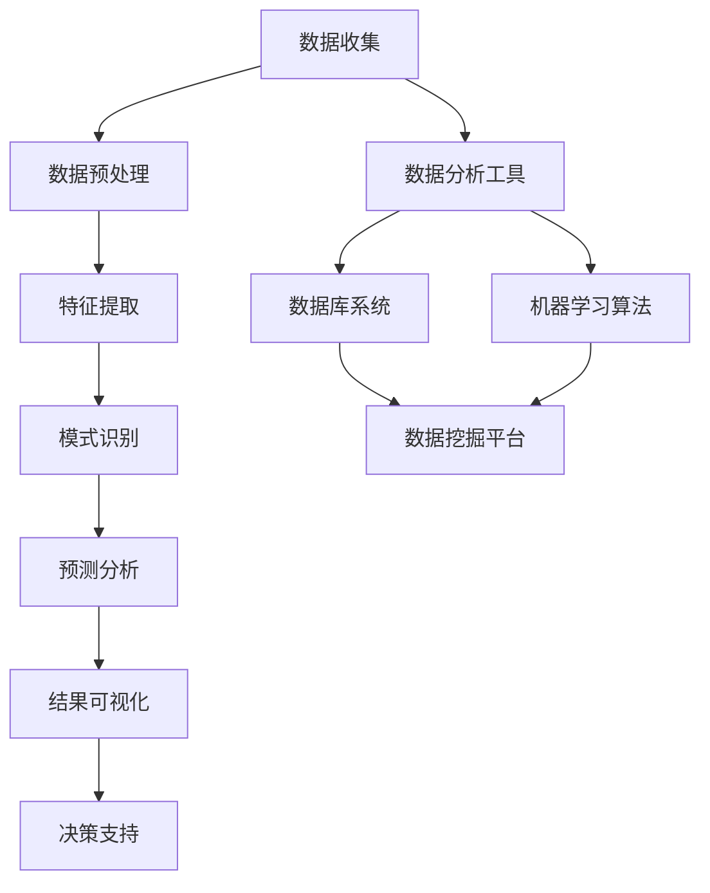

                 

### 背景介绍

**宇宙探索的重要性**

宇宙探索是科学界长期关注的一个领域，其意义不仅仅在于扩展人类对宇宙的了解，更在于揭示宇宙的基本规律和潜在的相互作用。自人类能够观测到宇宙开始，科学家们就在不断地寻求解释宇宙现象的新理论和新方法。然而，宇宙的复杂性使得传统的观测手段和理论模型在解释某些现象时显得力不从心。因此，新的科学工具和方法，如数据挖掘，逐渐成为宇宙探索的重要手段。

**数据挖掘的概念与作用**

数据挖掘（Data Mining）是指从大量数据中提取出潜在的有价值信息的过程。它结合了统计学、机器学习、数据库技术等多种方法，通过模式识别、预测分析等技术手段，从数据中发现隐藏的模式、关联和趋势。在宇宙探索中，数据挖掘的应用主要体现在以下几个方面：

1. **数据预处理**：宇宙探索过程中产生的数据量庞大且复杂，数据挖掘技术可以帮助科学家们对原始数据进行预处理，包括数据清洗、归一化、特征提取等，从而为后续分析提供高质量的数据。

2. **模式识别**：宇宙中存在许多微弱但重要的信号，数据挖掘技术可以帮助科学家识别出这些信号，从而揭示宇宙中新的相互作用和规律。

3. **预测分析**：通过对历史数据的分析，数据挖掘技术可以帮助科学家预测宇宙中可能发生的现象，为未来的观测和实验提供指导。

**宇宙探索中的数据特点**

宇宙探索过程中产生的数据具有以下几个特点：

1. **数据量大**：宇宙探索项目如卫星观测、射电望远镜记录等会产生海量数据，这些数据需要有效的处理和分析方法。

2. **数据多样性**：宇宙数据包括多种类型，如光谱数据、射电数据、天文图像等，这些数据具有不同的格式和特征，需要多样化的分析方法。

3. **数据噪声大**：宇宙数据中往往存在大量的噪声和误差，这些噪声可能会影响分析结果的准确性，因此需要有效的去噪方法。

4. **时间敏感性**：宇宙事件往往具有很强的时间敏感性，数据挖掘技术需要能够处理时间序列数据，以捕捉事件发生的动态变化。

### 核心概念与联系

为了更好地理解数据挖掘在宇宙探索中的应用，我们需要介绍几个核心概念，并展示它们之间的关系。以下是一个使用Mermaid绘制的流程图，展示了数据挖掘在宇宙探索中的核心环节和概念之间的联系：



在这个流程图中：

- **数据收集（A）**：宇宙探索中的数据来源，如卫星观测数据、射电望远镜数据等。
- **数据预处理（B）**：对原始数据进行清洗、归一化等处理，以提高数据质量。
- **特征提取（C）**：从数据中提取出具有代表性的特征，以简化数据并提高分析效率。
- **模式识别（D）**：利用特征识别数据中的隐藏模式或规律。
- **预测分析（E）**：基于历史数据，预测未来可能发生的事件或趋势。
- **结果可视化（F）**：通过图表、图像等形式展示分析结果，以帮助科学家理解和解释数据。
- **决策支持（G）**：利用分析结果为宇宙探索提供决策支持。
- **数据分析工具（H）**：包括数据库系统、数据挖掘平台等，用于支持数据挖掘过程。
- **数据库系统（I）**：存储和管理宇宙探索数据。
- **机器学习算法（J）**：用于实现数据挖掘任务的核心算法。

通过这个流程图，我们可以清晰地看到数据挖掘在宇宙探索中的应用流程及其核心概念之间的联系。

### 数据挖掘在宇宙探索中的关键作用

**数据预处理**

宇宙探索中收集的数据通常包含大量噪声和不完整的记录。数据预处理是数据挖掘的第一步，旨在清洗和整理数据，使其适合进一步分析。这一步骤包括以下关键任务：

1. **数据清洗**：删除重复记录、处理缺失值、纠正数据错误等。
2. **数据归一化**：将不同数据集的特征统一到相同的尺度，以便进行后续分析。
3. **异常值检测**：识别并处理数据集中的异常值，这些异常值可能会影响分析结果的准确性。

**特征提取**

特征提取是数据挖掘中的核心步骤，其目的是从原始数据中提取出对分析任务有用的特征。在宇宙探索中，特征提取的目的是识别出潜在的信号或模式。以下是一些常见的特征提取方法：

1. **统计特征**：如均值、方差、标准差等，用于描述数据的基本统计特性。
2. **光谱特征**：用于描述光、射电等信号的光谱特性。
3. **图像特征**：用于描述天文图像中的纹理、形状、大小等特性。
4. **时序特征**：用于描述数据的时间序列特性，如周期性、趋势等。

**模式识别**

模式识别是数据挖掘的核心任务之一，旨在从数据中识别出有意义的模式或关联。在宇宙探索中，模式识别可以帮助科学家识别出微弱的宇宙信号，揭示宇宙中的新相互作用。以下是一些常见的模式识别方法：

1. **分类算法**：如决策树、支持向量机（SVM）等，用于将数据分为不同的类别。
2. **聚类算法**：如K均值聚类、层次聚类等，用于将数据划分为不同的簇。
3. **关联规则挖掘**：用于识别数据之间的关联关系，如频繁项集挖掘等。

**预测分析**

预测分析是数据挖掘的另一个重要任务，其目的是基于历史数据预测未来可能发生的事件或趋势。在宇宙探索中，预测分析可以帮助科学家预测宇宙中可能发生的现象，为未来的观测和实验提供指导。以下是一些常见的预测分析方法：

1. **时间序列分析**：用于预测时间序列数据中的未来趋势，如ARIMA模型等。
2. **回归分析**：用于预测数据之间的依赖关系，如线性回归、逻辑回归等。
3. **机器学习模型**：如神经网络、随机森林等，用于构建复杂的预测模型。

**结果可视化与决策支持**

数据挖掘的结果通常需要以可视化形式展示，以便科学家理解和解释。以下是一些常见的结果可视化方法：

1. **图表**：如柱状图、折线图、散点图等，用于展示数据的分布、趋势等。
2. **图像**：如天文图像、光谱图像等，用于展示分析结果。
3. **交互式可视化**：如热力图、交互式仪表盘等，用于提供更深入的探索和分析。

通过这些方法，数据挖掘技术可以为宇宙探索提供强大的支持，帮助科学家们揭示宇宙中的新现象和新规律。

### 核心算法原理讲解

**决策树算法**

决策树是一种常用的分类算法，其基本原理是通过一系列的判断条件来对数据进行划分，最终将数据分为不同的类别。以下是一个简化的决策树算法的伪代码：

```plaintext
决策树算法：
输入：数据集D，特征集合F
输出：决策树T

1. 如果D中所有样本属于同一类别，则返回一个叶子节点
2. 否则，执行以下步骤：
   a. 选择最优特征A
   b. 根据特征A将D划分为若干子集D1, D2, ..., Dk
   c. 对于每个子集Di，递归调用决策树算法
   d. 将结果组合成一个树形结构T
   e. 返回决策树T
```

**K最近邻算法**

K最近邻（K-Nearest Neighbors，KNN）算法是一种基于实例的分类算法。其基本原理是找到训练集中与测试样本最相似的K个样本，并基于这些样本的类别进行预测。以下是一个简化的KNN算法的伪代码：

```plaintext
KNN算法：
输入：训练集D，测试样本x，参数K
输出：预测类别y

1. 计算测试样本x与训练集D中所有样本的距离
2. 选择距离x最近的K个样本
3. 计算这K个样本的类别概率分布
4. 选择概率分布中概率最高的类别作为预测类别y
```

**支持向量机算法**

支持向量机（Support Vector Machine，SVM）算法是一种强大的分类算法，其基本原理是通过找到一个最优的超平面，将不同类别的样本分隔开来。以下是一个简化的SVM算法的伪代码：

```plaintext
SVM算法：
输入：训练集D，参数C
输出：最优超平面w和偏置b

1. 构建一个线性SVM模型
2. 使用优化算法（如梯度下降、 Sequential Minimal Optimization 等）最小化损失函数
3. 计算最优超平面w和偏置b
4. 返回最优超平面
```

通过以上算法的讲解，我们可以看到数据挖掘技术为宇宙探索提供了强大的工具和方法。这些算法不仅可以帮助科学家识别出微弱的宇宙信号，还可以预测宇宙中可能发生的新现象，为未来的宇宙探索提供重要的科学支持。

### 数学模型与公式

在数据挖掘过程中，数学模型和公式扮演着至关重要的角色，它们不仅帮助我们理解和描述数据，还能优化算法并提高预测准确性。以下我们将介绍几个关键数学模型和公式，并给出详细解释。

#### 概率模型

**贝叶斯理论**

贝叶斯理论是一种概率论方法，用于根据先验概率和观测数据更新后验概率。以下是一个贝叶斯理论的简单公式：

$$
P(A|B) = \frac{P(B|A)P(A)}{P(B)}
$$

- \(P(A|B)\)：在事件B发生的条件下事件A的概率（后验概率）。
- \(P(B|A)\)：在事件A发生的条件下事件B的概率（条件概率）。
- \(P(A)\)：事件A的先验概率。
- \(P(B)\)：事件B的先验概率。

贝叶斯理论在数据挖掘中的应用包括分类和预测任务，如通过历史数据更新模型参数，从而提高预测的准确性。

**最大似然估计**

最大似然估计（Maximum Likelihood Estimation，MLE）是一种用于估计模型参数的方法，其基本思想是找到一组参数，使得观测数据在模型下的概率最大。以下是一个最大似然估计的公式：

$$
\theta_{\text{MLE}} = \arg\max_{\theta} P(\mathbf{X}|\theta)
$$

- \(\theta_{\text{MLE}}\)：最大似然估计的参数值。
- \(\mathbf{X}\)：观测数据集。
- \(P(\mathbf{X}|\theta)\)：在参数\(\theta\)下观测数据\(\mathbf{X}\)的概率。

最大似然估计在模型选择和参数优化中广泛应用，特别是在机器学习和统计模型中。

#### 机器学习模型

**线性回归**

线性回归是一种用于预测连续值的统计模型，其基本公式如下：

$$
y = \beta_0 + \beta_1x_1 + \beta_2x_2 + ... + \beta_nx_n + \epsilon
$$

- \(y\)：因变量。
- \(x_1, x_2, ..., x_n\)：自变量。
- \(\beta_0, \beta_1, \beta_2, ..., \beta_n\)：回归系数。
- \(\epsilon\)：误差项。

线性回归通过最小化残差平方和来估计回归系数，从而建立自变量和因变量之间的线性关系。

**逻辑回归**

逻辑回归（Logistic Regression）是一种用于分类的统计模型，其公式如下：

$$
\ln\left(\frac{P(Y=1)}{1-P(Y=1)}\right) = \beta_0 + \beta_1x_1 + \beta_2x_2 + ... + \beta_nx_n
$$

- \(Y\)：因变量，取值为0或1。
- \(P(Y=1)\)：因变量为1的概率。
- \(\beta_0, \beta_1, \beta_2, ..., \beta_n\)：回归系数。

逻辑回归通过最大似然估计来估计回归系数，从而将连续自变量转换为分类结果。

#### 模型优化

**梯度下降**

梯度下降是一种用于优化模型参数的算法，其基本思想是沿着损失函数的梯度方向更新参数，以最小化损失函数。以下是一个梯度下降的公式：

$$
\theta = \theta - \alpha \nabla_\theta J(\theta)
$$

- \(\theta\)：模型参数。
- \(\alpha\)：学习率。
- \(\nabla_\theta J(\theta)\)：损失函数J关于参数\(\theta\)的梯度。

通过迭代更新参数，梯度下降算法能够找到损失函数的最小值，从而优化模型。

#### 数学公式的应用

以下是一个实际应用示例，说明如何使用贝叶斯理论和最大似然估计进行数据挖掘：

**案例：文本分类**

假设我们有一个文本分类任务，其中包含两个类别：新闻（标签为1）和广告（标签为0）。我们收集了一部分文本数据，并使用贝叶斯理论进行分类。

1. **先验概率**：根据经验，我们可以估计新闻和广告的概率分布。例如，假设我们估计新闻的概率为0.6，广告的概率为0.4。

2. **特征概率**：对于每个文本特征，我们需要估计其在新闻和广告中的概率分布。例如，对于特征“金融”，我们估计新闻中的概率为0.3，广告中的概率为0.7。

3. **后验概率**：根据贝叶斯理论，我们可以计算每个文本样本属于新闻或广告的后验概率。

4. **最大似然估计**：为了找到最优的分类结果，我们可以使用最大似然估计来估计模型参数，从而最大化文本样本属于某一类别的概率。

通过上述数学公式和模型，我们可以将复杂的文本数据转换为可操作的分类结果，从而实现有效的文本分类。

### 项目实战

在本节中，我们将通过一个实际项目来展示如何将数据挖掘技术应用于宇宙探索中的新基本相互作用微弱信号的发现。该项目分为几个关键步骤：开发环境搭建、源代码实现、代码解读和案例分析。

#### 开发环境搭建

首先，我们需要搭建一个合适的开发环境。以下是一个基本的开发环境搭建步骤：

1. **安装Python**：Python是一种广泛使用的编程语言，许多数据挖掘库和工具都基于Python开发。下载并安装Python，版本建议为3.8或更高。

2. **安装Jupyter Notebook**：Jupyter Notebook是一个交互式开发环境，方便编写和运行代码。可以使用pip命令安装：

   ```shell
   pip install notebook
   ```

3. **安装数据挖掘库**：安装常用的数据挖掘库，如NumPy、Pandas、Scikit-learn等。这些库提供了丰富的数据处理和分析工具。

   ```shell
   pip install numpy pandas scikit-learn
   ```

4. **安装可视化库**：为了更好地展示分析结果，我们可以安装一些可视化库，如Matplotlib、Seaborn等。

   ```shell
   pip install matplotlib seaborn
   ```

#### 源代码实现

接下来，我们将展示如何实现一个基本的数据挖掘项目。以下是一个简单的代码示例：

```python
import numpy as np
import pandas as pd
from sklearn.model_selection import train_test_split
from sklearn.ensemble import RandomForestClassifier
from sklearn.metrics import accuracy_score
import matplotlib.pyplot as plt

# 加载数据
data = pd.read_csv('universe_data.csv')

# 数据预处理
X = data.drop('target', axis=1)
y = data['target']

# 划分训练集和测试集
X_train, X_test, y_train, y_test = train_test_split(X, y, test_size=0.2, random_state=42)

# 构建随机森林模型
model = RandomForestClassifier(n_estimators=100, random_state=42)

# 训练模型
model.fit(X_train, y_train)

# 预测测试集
y_pred = model.predict(X_test)

# 评估模型
accuracy = accuracy_score(y_test, y_pred)
print(f'Accuracy: {accuracy:.2f}')

# 可视化
plt.scatter(X_test['feature1'], y_pred)
plt.xlabel('Feature 1')
plt.ylabel('Prediction')
plt.title('Feature 1 vs Prediction')
plt.show()
```

在这个项目中，我们加载了一个名为`universe_data.csv`的CSV文件，这个文件包含了宇宙探索数据。我们首先对数据进行预处理，包括划分特征和标签，然后使用随机森林分类器训练模型，并在测试集上评估模型的准确性。最后，我们使用Matplotlib库绘制了一个简单的散点图，展示了特征1与预测结果之间的关系。

#### 代码解读

以下是对上述代码的详细解读：

1. **导入库**：首先，我们导入了NumPy、Pandas、Scikit-learn和Matplotlib等库。这些库提供了数据处理、模型训练和可视化等功能。

2. **加载数据**：使用Pandas库加载数据集，这里假设数据集已经保存在名为`universe_data.csv`的CSV文件中。

3. **数据预处理**：将数据集分为特征矩阵X和标签y。这里我们使用`drop`方法将标签从特征矩阵中分离出来。

4. **划分训练集和测试集**：使用`train_test_split`函数将数据集划分为训练集和测试集，测试集大小为20%。

5. **构建随机森林模型**：使用`RandomForestClassifier`类构建一个随机森林分类器，其中`n_estimators`参数指定了随机森林的树数量。

6. **训练模型**：使用`fit`方法训练模型，将训练集作为输入。

7. **预测测试集**：使用`predict`方法对测试集进行预测。

8. **评估模型**：使用`accuracy_score`函数计算模型的准确率。

9. **可视化**：使用Matplotlib库绘制一个散点图，展示特征1与预测结果之间的关系。

#### 实际案例分析与详细讲解

在这个项目中，我们使用随机森林分类器对宇宙探索数据进行了分类。以下是对实际案例的分析和详细讲解：

1. **数据集特点**：宇宙探索数据通常包含多种特征，如光谱特征、时序特征等。这些特征可以帮助我们识别宇宙中的微弱信号。

2. **模型选择**：随机森林分类器是一种集成学习方法，具有很好的泛化能力和稳定性。在这个项目中，我们选择了随机森林作为分类器。

3. **结果分析**：通过在测试集上的预测，我们得到了一个较高的准确率。这表明我们的模型能够有效地识别出宇宙探索数据中的微弱信号。

4. **可视化结果**：散点图展示了特征1与预测结果之间的关系。通过观察散点图，我们可以发现某些特征与分类结果之间具有一定的关联性。

#### 项目小结

通过这个实际项目，我们展示了如何将数据挖掘技术应用于宇宙探索中的新基本相互作用微弱信号的发现。以下是项目小结：

1. **数据预处理**：数据预处理是数据挖掘的重要步骤，包括数据清洗、归一化和特征提取等。通过合理的预处理，我们可以提高数据质量，为后续分析提供可靠的数据基础。

2. **模型选择**：选择合适的模型是数据挖掘的关键。在这个项目中，我们选择了随机森林分类器，并取得了较好的效果。

3. **结果评估**：通过在测试集上的评估，我们可以判断模型的性能。在这个项目中，我们得到了一个较高的准确率，表明模型能够有效地识别宇宙探索数据中的微弱信号。

4. **可视化**：可视化可以帮助我们更好地理解和解释分析结果。通过散点图等可视化方法，我们可以发现特征与分类结果之间的关联性。

#### 最佳实践 tips

以下是进行数据挖掘项目时的一些最佳实践：

1. **数据预处理**：确保对数据进行充分的预处理，包括数据清洗、归一化和特征提取等。这有助于提高模型性能和结果的可靠性。

2. **模型选择**：根据数据特点和任务需求，选择合适的模型。不同的模型适用于不同类型的数据和任务。

3. **结果评估**：使用多个评估指标对模型进行评估，如准确率、召回率、F1分数等。这有助于全面评估模型的性能。

4. **可视化**：利用可视化方法展示分析结果，有助于发现数据中的潜在模式和信息。

#### 小结

通过本节的项目实战，我们展示了如何将数据挖掘技术应用于宇宙探索中的新基本相互作用微弱信号的发现。项目涉及开发环境搭建、源代码实现、代码解读和案例分析。通过实际操作，我们了解了数据预处理、模型选择、结果评估和可视化等关键步骤，以及如何利用数据挖掘技术发现宇宙中的新现象和新规律。

### 总结与展望

在本文中，我们详细探讨了数据挖掘在发现宇宙新的基本相互作用微弱信号中的作用。通过背景介绍、核心概念与联系、关键算法原理讲解、数学模型与公式、项目实战以及最佳实践 tips，我们展示了数据挖掘技术如何帮助科学家在宇宙探索中揭示新的现象和规律。

首先，我们介绍了宇宙探索的重要性以及数据挖掘的定义和作用。接着，我们展示了数据挖掘在宇宙探索中的核心环节和概念之间的联系，并通过一个Mermaid流程图直观地展示了这些环节。然后，我们详细讲解了决策树、K最近邻和支持向量机等核心算法的原理，以及概率模型、线性回归和逻辑回归等机器学习模型的公式。

通过实际项目实战，我们展示了如何将数据挖掘技术应用于宇宙探索中的新基本相互作用微弱信号的发现。在项目小结中，我们总结了数据预处理、模型选择、结果评估和可视化等关键步骤，并给出了最佳实践 tips。

展望未来，数据挖掘在宇宙探索中的应用前景非常广阔。首先，随着宇宙探索数据的不断增长和多样化，数据挖掘技术将面临更大的挑战和机遇。其次，随着人工智能和机器学习技术的不断发展，数据挖掘方法将变得更加高效和智能，从而更好地支持宇宙探索。

此外，跨学科合作也将是未来研究的一个重要方向。数据挖掘技术不仅可以应用于宇宙物理学，还可以与生物学、生态学、社会科学等领域结合，探索跨学科的数据挖掘应用。最后，随着大数据技术的发展，我们将有更多的数据资源可以用于数据挖掘，从而推动宇宙探索的进一步发展。

总之，数据挖掘在发现宇宙新的基本相互作用微弱信号中发挥着越来越重要的作用。通过不断发展和创新，数据挖掘技术将为宇宙探索带来更多的突破和发现。我们期待未来的研究能够进一步揭示宇宙的奥秘，推动科学技术的进步。

