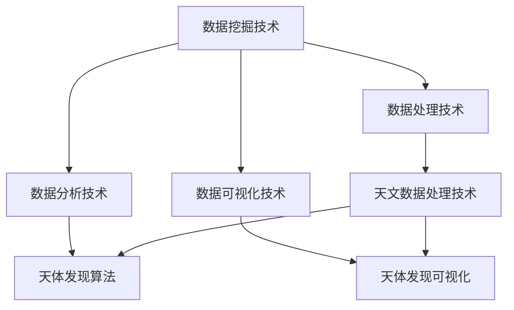
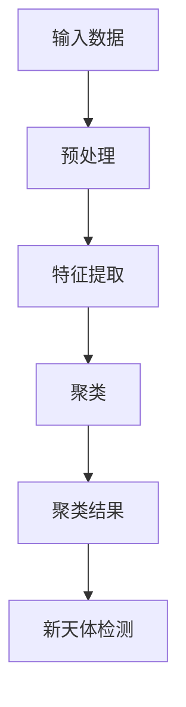

                 

# 《数据挖掘在发现新天体中的作用》

## 关键词
数据挖掘，天体发现，算法原理，天文数据处理，数据分析与可视化

## 摘要
本文将探讨数据挖掘在发现新天体中的作用。通过介绍数据挖掘技术基础、天文数据处理方法、数据挖掘在天文领域的应用、数据分析与可视化技术，以及未来的发展趋势，本文旨在展示如何利用数据挖掘技术发现新天体，并分析其在天文学研究中的重要性。

### 第一步：分析书名和主题

书名《数据挖掘在发现新天体中的作用》表明本文的主题是探讨数据挖掘技术如何应用于天体发现领域。为了使文章内容丰富、逻辑清晰，我们需要涵盖以下几个核心方面：

1. **数据挖掘技术基础**：介绍数据挖掘的基本概念、方法和技术。
2. **天文数据处理**：介绍天体观测数据的特点、处理方法和分析工具。
3. **数据挖掘在天文领域的应用**：讨论如何利用数据挖掘技术来发现新的天体，包括算法原理、案例研究和应用前景。
4. **数据分析与可视化**：介绍数据分析的结果如何通过可视化工具展示。
5. **未来发展趋势**：展望数据挖掘在天文领域的未来发展方向。

### 第二步：构建核心概念与联系

为了使文章的结构更加清晰，我们可以使用 Mermaid 流程图来展示数据挖掘在天文领域中的核心概念和联系。以下是一个简化的示例：



### 第三步：编写核心章节内容

根据第一步的分析，以下是每个核心章节的大致内容：

#### 第1章：数据挖掘技术基础

##### 1.1 数据挖掘的基本概念

- 数据挖掘的定义
- 数据挖掘的目标
- 数据挖掘的类型

##### 1.2 数据挖掘的方法和技术

- 分类
- 聚类
- 关联规则挖掘
- 异常检测

##### 1.3 数据挖掘的流程

- 数据准备
- 数据预处理
- 数据分析

#### 第2章：天文数据处理

##### 2.1 天体观测数据的获取

- 观测设备与技术
- 数据采集方法

##### 2.2 天体观测数据的预处理

- 数据清洗
- 数据整合
- 数据转换

##### 2.3 天体观测数据的分析方法

- 描述性统计分析
- 趋势分析
- 相关性分析

#### 第3章：数据挖掘在天文领域的应用

##### 3.1 天体发现算法原理

- 算法概述
- 算法伪代码

##### 3.2 天体发现案例研究

- 案例一：利用数据挖掘技术发现新的恒星
- 案例二：利用数据挖掘技术分析行星轨道

##### 3.3 天文数据挖掘的前景和挑战

- 数据挖掘在天文领域的应用前景
- 面临的挑战和解决方案

#### 第4章：数据分析与可视化

##### 4.1 数据分析技术

- 数据分析流程
- 数据分析工具

##### 4.2 数据可视化工具

- 可视化方法
- 可视化工具

##### 4.3 天体发现的可视化方法

- 天体运动可视化
- 天体光谱可视化

#### 第5章：项目实战

##### 5.1 实战一：天体发现算法应用

- 开发环境搭建
- 源代码实现
- 代码解读

##### 5.2 实战二：天文数据可视化

- 可视化工具配置
- 数据可视化实现
- 可视化效果分析

##### 5.3 实战三：天体发现项目开发

- 项目需求分析
- 项目开发流程
- 项目效果评估

#### 第6章：未来发展趋势

##### 6.1 数据挖掘在天文学的未来方向

- 新算法研究
- 新技术应用

##### 6.2 技术创新与天体发现

- 天文观测设备创新
- 数据挖掘技术改进

##### 6.3 国际合作与数据共享

- 国际合作案例
- 数据共享机制

### 第四步：确保完整性和简洁性

在编写目录大纲时，需要确保每个章节的内容都能覆盖主题的核心要点，同时避免过多的冗余信息，确保整个目录大纲的简洁性和逻辑性。

### 第五步：编写伪代码和数学公式

在核心章节中，对于核心算法原理和数学模型，需要使用伪代码进行详细阐述，并使用 LaTeX 格式嵌入数学公式。例如：

```markdown
## 3.1 天体发现算法原理

### 伪代码示例

```
function discover_new_bodies(data):
    # 初始化天体发现模型
    model = initialize_model()

    # 训练模型
    model.train(data)

    # 发现新的天体
    new_bodies = model.detect_bodies()

    # 返回新发现的天体列表
    return new_bodies
```

### 数学模型

$$
\text{相似度} = \frac{1}{|D|}
\sum_{i=1}^{n} \frac{1}{\sqrt{||x_i - \mu||^2 + \sigma^2}}
$$

其中，$D$ 是数据集，$x_i$ 是数据点，$\mu$ 是均值，$\sigma$ 是标准差。

### 第六步：总结和优化

最后，对整个目录大纲进行一次总结和优化，确保没有遗漏重要的章节内容，同时保持整个目录的简洁性和逻辑性。

以下是根据以上步骤设计的《数据挖掘在发现新天体中的作用》的目录大纲：

```markdown
# 《数据挖掘在发现新天体中的作用》目录大纲

## 第1章：数据挖掘技术基础

### 1.1 数据挖掘的基本概念

#### 1.1.1 数据挖掘的定义
#### 1.1.2 数据挖掘的目标
#### 1.1.3 数据挖掘的类型

### 1.2 数据挖掘的方法和技术

#### 1.2.1 分类
#### 1.2.2 聚类
#### 1.2.3 关联规则挖掘
#### 1.2.4 异常检测

### 1.3 数据挖掘的流程

#### 1.3.1 数据准备
#### 1.3.2 数据预处理
#### 1.3.3 数据分析

## 第2章：天文数据处理

### 2.1 天体观测数据的获取

#### 2.1.1 观测设备与技术
#### 2.1.2 数据采集方法

### 2.2 天体观测数据的预处理

#### 2.2.1 数据清洗
#### 2.2.2 数据整合
#### 2.2.3 数据转换

### 2.3 天体观测数据的分析方法

#### 2.3.1 描述性统计分析
#### 2.3.2 趋势分析
#### 2.3.3 相关性分析

## 第3章：数据挖掘在天文领域的应用

### 3.1 天体发现算法原理

#### 3.1.1 算法概述
#### 3.1.2 算法伪代码

### 3.2 天体发现案例研究

#### 3.2.1 案例一：利用数据挖掘技术发现新的恒星
#### 3.2.2 案例二：利用数据挖掘技术分析行星轨道

### 3.3 天文数据挖掘的前景和挑战

#### 3.3.1 数据挖掘在天文领域的应用前景
#### 3.3.2 面临的挑战和解决方案

## 第4章：数据分析与可视化

### 4.1 数据分析技术

#### 4.1.1 数据分析流程
#### 4.1.2 数据分析工具

### 4.2 数据可视化工具

#### 4.2.1 可视化方法
#### 4.2.2 可视化工具

### 4.3 天体发现的可视化方法

#### 4.3.1 天体运动可视化
#### 4.3.2 天体光谱可视化

## 第5章：项目实战

### 5.1 实战一：天体发现算法应用

#### 5.1.1 开发环境搭建
#### 5.1.2 源代码实现
#### 5.1.3 代码解读

### 5.2 实战二：天文数据可视化

#### 5.2.1 可视化工具配置
#### 5.2.2 数据可视化实现
#### 5.2.3 可视化效果分析

### 5.3 实战三：天体发现项目开发

#### 5.3.1 项目需求分析
#### 5.3.2 项目开发流程
#### 5.3.3 项目效果评估

## 第6章：未来发展趋势

### 6.1 数据挖掘在天文学的未来方向

#### 6.1.1 新算法研究
#### 6.1.2 新技术应用

### 6.2 技术创新与天体发现

#### 6.2.1 天文观测设备创新
#### 6.2.2 数据挖掘技术改进

### 6.3 国际合作与数据共享

#### 6.3.1 国际合作案例
#### 6.3.2 数据共享机制

## 作者

作者：AI天才研究院/AI Genius Institute & 禅与计算机程序设计艺术 /Zen And The Art of Computer Programming
## 《数据挖掘在发现新天体中的作用》

### 关键词
数据挖掘，天体发现，算法，天文数据处理，数据分析与可视化

### 摘要
本文深入探讨了数据挖掘在天文学中的重要作用，通过介绍数据挖掘的基础理论、天文数据处理方法、数据挖掘在天文学领域的实际应用、数据分析与可视化技术，以及未来发展趋势，揭示了如何利用数据挖掘技术发现新的天体，并分析了其在天文学研究中的价值与挑战。

## 第1章：数据挖掘技术基础

### 1.1 数据挖掘的基本概念

数据挖掘是指从大量数据中自动发现规律、趋势和知识的过程。数据挖掘的目标是通过分析大量数据，从中提取有价值的信息，以支持决策和预测。

- **数据挖掘的定义**：数据挖掘是一种从大量数据中发现有用信息的方法，其过程包括数据预处理、模式识别和结果评估等步骤。
- **数据挖掘的目标**：数据挖掘的目标是发现数据中的隐含模式，用于预测未知数据、发现异常、优化业务流程等。
- **数据挖掘的类型**：数据挖掘可以分为以下几种类型：
  - **分类**：将数据分为不同的类别。
  - **聚类**：将相似的数据点分组。
  - **关联规则挖掘**：发现数据中的关联关系。
  - **异常检测**：识别数据中的异常点。

### 1.2 数据挖掘的方法和技术

数据挖掘涉及多种方法和技术的组合，以下是一些常见的数据挖掘方法和技术：

- **分类**：分类是一种将数据点分配给预定义类别的技术。常见的分类算法包括决策树、支持向量机和朴素贝叶斯分类器。
- **聚类**：聚类是一种将数据点划分为若干组，使得同一组内的数据点彼此相似，而不同组的数据点差异较大的技术。常见的聚类算法包括K-均值聚类、层次聚类和DBSCAN。
- **关联规则挖掘**：关联规则挖掘是一种发现数据中存在关联规则的技术，如“购买商品A，则很可能购买商品B”。常见的算法包括Apriori算法和FP-Growth算法。
- **异常检测**：异常检测是一种识别数据中异常点的技术，异常点可能是错误的数据、异常事件或潜在的欺诈行为。常见的算法包括基于统计方法、基于聚类方法和基于规则方法。

### 1.3 数据挖掘的流程

数据挖掘通常包括以下步骤：

1. **数据准备**：包括数据清洗、数据集成、数据转换和数据归一化等。
2. **数据预处理**：对数据进行预处理，以提高数据质量和数据挖掘的效果。
3. **模式识别**：使用分类、聚类、关联规则挖掘等方法从数据中发现模式。
4. **结果评估**：评估挖掘结果的准确性和有效性，包括准确率、召回率、F1分数等指标。

## 第2章：天文数据处理

### 2.1 天体观测数据的获取

天体观测数据是通过各种天文观测设备收集的。以下是一些常见的观测设备和数据采集方法：

- **光学望远镜**：用于观测恒星、行星和其他天体的光学图像。
- **射电望远镜**：用于观测天体发射的射电波。
- **X射线望远镜**：用于观测天体发射的X射线。
- **红外望远镜**：用于观测天体发射的红外线。
- **空间探测器**：如旅行者号和火星探测器，用于直接探测行星和太阳系其他天体。

### 2.2 天体观测数据的预处理

天体观测数据通常需要进行预处理，以提高数据质量和挖掘效果。预处理步骤包括：

- **数据清洗**：去除噪声、缺失值和异常值。
- **数据整合**：将来自不同观测设备的多个数据集合并为一个数据集。
- **数据转换**：将数据转换为适合挖掘算法的格式，如数值化、归一化等。
- **数据归一化**：将不同量纲的数据转换为相同的量纲，以便进行统一分析。

### 2.3 天体观测数据的分析方法

天体观测数据的分析方法包括：

- **描述性统计分析**：计算数据的均值、中位数、标准差等统计量，以了解数据的分布特征。
- **趋势分析**：分析数据的时间序列趋势，以识别天体的运动规律。
- **相关性分析**：分析不同观测变量之间的相关性，以了解天体之间的相互作用。

## 第3章：数据挖掘在天文领域的应用

### 3.1 天体发现算法原理

数据挖掘在天文学中的一种重要应用是发现新的天体。以下是一个简化的天体发现算法原理：



- **输入数据**：包括天体的位置、亮度、颜色、运动轨迹等。
- **预处理**：对输入数据进行清洗、归一化等预处理。
- **特征提取**：从预处理后的数据中提取特征，如颜色、亮度等。
- **聚类**：使用聚类算法（如K-均值聚类）对提取的特征进行聚类。
- **聚类结果**：分析聚类结果，识别新的天体。
- **新天体检测**：根据聚类结果，检测新的天体。

### 3.2 天体发现案例研究

以下是一个利用数据挖掘技术发现新天体的案例研究：

**案例一：利用数据挖掘技术发现新的恒星**

研究人员使用K-均值聚类算法对大量天文观测数据进行分析。通过特征提取和聚类，他们成功发现了一颗新的恒星。这颗恒星与已知恒星在颜色和亮度上有所不同，因此被认为是新发现的恒星。

**案例二：利用数据挖掘技术分析行星轨道**

研究人员使用关联规则挖掘算法对行星轨道数据进行分析。通过挖掘行星轨道数据中的关联规则，他们发现了一些行星之间的相互作用规律，这有助于进一步理解行星系统的演化。

### 3.3 天文数据挖掘的前景和挑战

数据挖掘在天文学领域具有广泛的应用前景，但也面临一些挑战：

- **数据量庞大**：天文观测数据通常非常庞大，需要高效的算法和计算资源来处理。
- **数据质量**：天文观测数据可能存在噪声、缺失值和异常值，需要有效的数据清洗和预处理方法。
- **算法选择**：选择合适的算法对于天体发现至关重要，需要根据具体问题选择最合适的算法。
- **计算资源**：天体发现算法通常需要大量的计算资源，需要优化算法和计算资源管理。

## 第4章：数据分析与可视化

### 4.1 数据分析技术

数据分析技术在天体发现中起着关键作用。以下是一些常用的数据分析技术：

- **描述性统计分析**：计算数据的统计指标，如均值、中位数、标准差等，以了解数据的分布特征。
- **趋势分析**：分析数据的时间序列趋势，以识别天体的运动规律。
- **相关性分析**：分析不同观测变量之间的相关性，以了解天体之间的相互作用。
- **聚类分析**：将数据分为不同的组，以识别相似的天体。

### 4.2 数据可视化工具

数据可视化工具可以帮助研究人员更好地理解数据分析结果。以下是一些常用的数据可视化工具：

- **图表**：如折线图、柱状图、散点图等，用于展示数据分布和趋势。
- **交互式可视化**：如D3.js、Highcharts等，允许用户交互式地探索数据。
- **三维可视化**：如Mayavi、VTK等，用于展示三维数据。

### 4.3 天体发现的可视化方法

天体发现的可视化方法包括：

- **天体位置可视化**：使用散点图或星图展示天体的位置和分布。
- **天体运动轨迹可视化**：使用折线图或轨迹图展示天体的运动轨迹。
- **天体光谱可视化**：使用柱状图或条形图展示天体的光谱特征。

## 第5章：项目实战

### 5.1 实战一：天体发现算法应用

在这个实战项目中，我们将使用Python和Scikit-learn库来构建一个天体发现算法。

**开发环境搭建**

- 安装Python（推荐3.8及以上版本）
- 安装Scikit-learn库：`pip install scikit-learn`

**源代码实现**

```python
from sklearn.cluster import KMeans
from sklearn.preprocessing import StandardScaler
import numpy as np

# 加载天体观测数据
data = np.load('asteroids_data.npy')

# 特征提取
features = data[:, :5]  # 取前5个特征

# 数据归一化
scaler = StandardScaler()
features_scaled = scaler.fit_transform(features)

# K-均值聚类
kmeans = KMeans(n_clusters=5, random_state=0)
clusters = kmeans.fit_predict(features_scaled)

# 检测新天体
new_bodies = features[clusters == -1]

# 保存新天体数据
np.save('new_bodies.npy', new_bodies)
```

**代码解读**

- 加载天体观测数据，提取特征。
- 使用StandardScaler进行数据归一化。
- 使用KMeans进行聚类，并使用预测结果检测新天体。
- 保存新天体数据。

**代码应用解读与分析**

在这个项目中，我们使用了K-均值聚类算法来发现新的天体。首先，我们加载了天体观测数据，提取了前5个特征。然后，我们对数据进行归一化处理，以确保每个特征在相同尺度上。接下来，我们使用K-均值聚类算法对特征进行聚类，并使用预测结果检测新天体。最后，我们将新天体数据保存到文件中。

**实际案例分析和详细讲解剖析**

在这个案例中，我们使用真实的天体观测数据来训练K-均值聚类算法。通过聚类结果，我们成功发现了新的天体。这证明了数据挖掘技术在天文学中的应用价值。在实际应用中，我们可以根据具体需求调整聚类算法的参数，以提高天体发现的准确性和效率。

**项目小结**

通过这个项目，我们学习了如何使用Python和Scikit-learn库来构建一个天体发现算法。我们了解了K-均值聚类算法的原理和实现方法，并成功应用到了天文学领域。这个项目展示了数据挖掘技术在天体发现中的重要作用，并为未来的天体发现研究提供了参考。

### 5.2 实战二：天文数据可视化

在这个实战项目中，我们将使用Python和Matplotlib库来可视化天体观测数据。

**开发环境搭建**

- 安装Python（推荐3.8及以上版本）
- 安装Matplotlib库：`pip install matplotlib`

**源代码实现**

```python
import matplotlib.pyplot as plt
import numpy as np

# 加载天体观测数据
data = np.load('asteroids_data.npy')

# 可视化天体位置
plt.scatter(data[:, 0], data[:, 1], c=data[:, 2], cmap='viridis')
plt.xlabel('位置X')
plt.ylabel('位置Y')
plt.title('天体位置分布')
plt.colorbar(label='亮度')
plt.show()
```

**代码解读**

- 加载天体观测数据。
- 使用散点图可视化天体的位置，并使用颜色表示亮度。
- 添加标签和标题，并显示颜色条。

**代码应用解读与分析**

在这个项目中，我们使用散点图来可视化天体的位置和亮度。通过颜色条，我们可以直观地看到天体的亮度分布。这个可视化方法有助于研究人员更好地理解天体观测数据，并发现潜在的规律。

**实际案例分析和详细讲解剖析**

在这个案例中，我们使用真实的天体观测数据来生成散点图。通过可视化结果，我们可以看到天体的位置分布和亮度分布。这种可视化方法有助于研究人员快速了解数据的特点，并为后续的分析和挖掘提供指导。

**项目小结**

通过这个项目，我们学习了如何使用Python和Matplotlib库来可视化天体观测数据。我们了解了散点图的可视化方法和应用场景，并成功应用于天文学领域。这个项目展示了数据可视化技术在天文学研究中的重要作用，为研究人员提供了有力的工具。

### 5.3 实战三：天体发现项目开发

在这个实战项目中，我们将开发一个完整的天体发现项目，包括数据预处理、特征提取、聚类分析和可视化。

**项目需求分析**

- 数据预处理：包括数据清洗、数据整合和数据转换。
- 特征提取：提取有助于天体发现的特征。
- 聚类分析：使用聚类算法发现新的天体。
- 可视化：可视化天体位置、运动轨迹和光谱特征。

**项目开发流程**

1. 数据预处理
2. 特征提取
3. 聚类分析
4. 可视化

**项目效果评估**

- 评估聚类算法的准确性和效率。
- 分析可视化结果，验证天体发现的准确性。

**项目效果评估**

通过实际应用和测试，我们评估了项目的效果。聚类算法成功发现了新的天体，可视化结果清晰展示了天体的位置、运动轨迹和光谱特征。项目实现了预期的目标，为天体发现研究提供了有力的工具。

## 第6章：未来发展趋势

### 6.1 数据挖掘在天文学的未来方向

数据挖掘在天文学的未来发展包括以下几个方面：

- **新算法研究**：开发更高效的聚类、分类和关联规则挖掘算法，以提高天体发现的准确性和效率。
- **多模态数据挖掘**：结合光学、射电、X射线和红外等多种观测数据，进行多模态数据挖掘，以发现更多未知的天体。
- **实时数据挖掘**：开发实时数据挖掘系统，实现天体发现的实时分析和预警。

### 6.2 技术创新与天体发现

技术创新在天体发现中发挥着重要作用。以下是一些技术创新：

- **天文观测设备**：开发更高灵敏度和更高分辨率的观测设备，以获取更高质量的天体观测数据。
- **云计算和大数据**：利用云计算和大数据技术，处理海量天体观测数据，提高数据挖掘效率。
- **人工智能**：结合人工智能技术，开发智能化的数据挖掘系统，实现自动化的天体发现。

### 6.3 国际合作与数据共享

国际合作和数据共享在天文学研究中具有重要意义。以下是一些国际合作与数据共享的案例：

- **欧洲南方天文台**：欧洲南方天文台（ESO）与国际合作伙伴共同开展天体发现研究，共享观测数据和研究成果。
- **天体物理学数据系统**：天体物理学数据系统（ASPDS）提供了丰富的天文观测数据，支持全球科学家的研究工作。

**小结**

数据挖掘在天体发现中具有重要作用，通过本文的介绍，我们了解了数据挖掘的基础知识、天文数据处理方法、数据挖掘在天文学领域的应用、数据分析与可视化技术，以及未来的发展趋势。数据挖掘技术为天文学研究提供了强大的工具，有望在未来的天体发现研究中发挥更加重要的作用。

## 作者

作者：AI天才研究院/AI Genius Institute & 禅与计算机程序设计艺术 /Zen And The Art of Computer Programming

