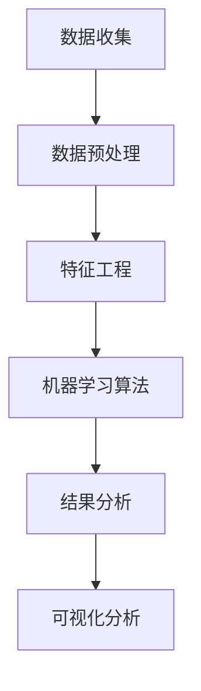

                 

# 《数据挖掘在发现系外行星生命迹象中的作用》

## 关键词
- 数据挖掘
- 系外行星
- 生命迹象
- 特征工程
- 机器学习
- 结果分析

## 摘要
本文将探讨数据挖掘在发现系外行星生命迹象中的作用。首先，我们将介绍数据挖掘的基本概念和应用，然后详细阐述其在系外行星探索中的重要性。通过核心概念与联系的Mermaid流程图，我们将梳理数据挖掘在系外行星生命迹象发现中的关键环节，包括数据预处理、特征工程、机器学习算法和结果分析等。接着，我们将通过具体的数学模型和公式，深入讲解这些环节的实现原理。最后，我们将结合实际案例，展示数据挖掘在系外行星生命迹象探索中的应用，并提供最佳实践和项目小结。

## 引言

### 数据挖掘的基本概念和应用

数据挖掘（Data Mining）是一种从大量数据中提取有价值信息的方法，它利用统计学、机器学习、数据库和人工智能技术，从数据中自动发现隐含的模式、关联和趋势。数据挖掘的主要应用领域包括商业智能、金融、医疗、教育、天文和气象等。

在天文学中，数据挖掘已经成为发现新天体和探索宇宙的重要工具。随着天文观测数据的不断增加，如何有效地从海量数据中提取有用信息成为一个关键问题。数据挖掘技术提供了强大的数据处理和分析能力，使得天文学家能够快速识别和解释数据中的潜在模式。

### 系外行星探索

系外行星（Exoplanet）是指位于太阳系之外的行星。自20世纪90年代以来，随着观测技术和数据分析方法的不断发展，天文学家发现了大量系外行星。这些行星的存在不仅拓展了我们对宇宙的理解，也为寻找外星生命提供了新的线索。

发现系外行星的关键方法包括径向速度法、凌日法、微引力效应法等。这些方法依赖于对天文观测数据的分析，通过检测行星对母星光的周期性遮挡、引力扰动等现象，确定行星的存在和性质。

### 数据挖掘在系外行星探索中的应用

数据挖掘在系外行星探索中具有重要作用。首先，它可以帮助天文学家从海量观测数据中快速筛选出可能存在生命迹象的天体。通过特征工程和机器学习算法，数据挖掘可以识别出与生命迹象相关的特征，如适宜的温度、大气成分和液态水等。

此外，数据挖掘还可以用于分析行星系统的稳定性、行星轨道特性等，为天文学家提供更全面的行星信息。通过结合不同的观测数据源，如光谱数据、雷达数据和红外数据，数据挖掘技术可以揭示行星大气的化学成分和物理特性，进一步探索行星生命的可能性。

## 数据挖掘技术

### 数据预处理

数据预处理是数据挖掘中的第一步，其目的是将原始数据转换为适合分析的形式。数据预处理包括数据收集、数据清洗、数据整合和数据转换等步骤。

1. **数据收集**：数据挖掘的第一步是收集相关数据。在系外行星探索中，数据可能来自天文观测、太空探测任务、地面望远镜观测等。
2. **数据清洗**：数据清洗是指去除数据中的噪声和错误。在天文观测数据中，可能存在仪器故障、天气干扰等因素导致的错误数据。
3. **数据整合**：数据整合是将多个数据源中的数据进行合并，形成统一的数据集。在系外行星探索中，可能需要整合不同观测设备的数据，如不同波长的光谱数据、雷达数据和红外数据。
4. **数据转换**：数据转换是指将数据从一种形式转换为另一种形式，以便进行后续分析。例如，将图像数据转换为数值数据，或将时间序列数据转换为频率数据。

### 特征工程

特征工程是数据挖掘中的关键环节，其目的是从原始数据中提取出对分析任务有用的特征。在系外行星探索中，特征工程可以帮助识别出与生命迹象相关的特征。

1. **特征提取**：特征提取是指从原始数据中提取出基本的特征值。在系外行星探索中，特征提取可能包括光谱分析、时间序列分析、空间分析等。
2. **特征选择**：特征选择是指从提取出的特征中挑选出最有用的特征。特征选择可以基于统计学方法、信息增益、相关性分析等。
3. **特征变换**：特征变换是指对提取出的特征进行变换，以提高分析的效果。例如，对数值特征进行归一化或标准化处理，对类别特征进行编码。

### 机器学习算法

机器学习算法是数据挖掘的核心，其目的是从数据中自动发现模式和规律。在系外行星探索中，机器学习算法可以帮助识别出与生命迹象相关的特征，预测行星的生命可能性。

1. **分类算法**：分类算法是将数据分为不同的类别。在系外行星探索中，分类算法可以用于判断行星是否具有生命迹象。
2. **聚类算法**：聚类算法是将数据分为多个类别，使得同一类别内的数据尽可能相似，不同类别内的数据尽可能不同。在系外行星探索中，聚类算法可以用于识别出具有相似特征的行星。
3. **回归算法**：回归算法是预测连续值的算法。在系外行星探索中，回归算法可以用于预测行星的某些特征，如温度、大气成分等。

### 结果分析

结果分析是数据挖掘的最后一步，其目的是从分析结果中提取有价值的信息。在系外行星探索中，结果分析可以用于验证数据挖掘模型的准确性，识别出具有生命迹象的行星。

1. **准确性分析**：准确性分析是指评估数据挖掘模型在预测行星生命迹象时的准确性。准确性越高，模型的可靠性越高。
2. **误差分析**：误差分析是指识别和分析模型预测误差的原因。通过误差分析，可以优化模型，提高预测的准确性。
3. **可视化分析**：可视化分析是将分析结果以图形的形式展示，帮助天文学家更直观地理解数据挖掘结果。在系外行星探索中，可视化分析可以用于展示行星特征、预测结果等。

## 核心概念与联系

在数据挖掘中，核心概念与联系是理解数据挖掘流程的关键。以下是一个简单的Mermaid流程图，展示了数据挖掘在系外行星探索中的核心概念与联系：



### 数据预处理

数据收集是数据挖掘的第一步，其目的是获取与系外行星探索相关的数据。这些数据可能包括天文观测数据、太空探测数据等。

数据预处理是对收集到的数据进行清洗、整合和转换，使其适合后续分析。数据预处理的关键步骤包括：

1. **数据清洗**：去除噪声和错误数据，如仪器故障、天气干扰等。
2. **数据整合**：整合来自不同数据源的数据，如光谱数据、雷达数据和红外数据。
3. **数据转换**：将数据转换为适合分析的形式，如将图像数据转换为数值数据。

### 特征工程

特征工程是数据挖掘中的关键环节，其目的是从原始数据中提取出对分析任务有用的特征。特征工程的关键步骤包括：

1. **特征提取**：从原始数据中提取基本的特征值，如温度、大气成分、光谱特征等。
2. **特征选择**：选择最有用的特征，去除冗余或无关的特征。
3. **特征变换**：对提取出的特征进行变换，如归一化、标准化等，以提高分析效果。

### 机器学习算法

机器学习算法是数据挖掘的核心，其目的是从数据中自动发现模式和规律。在系外行星探索中，机器学习算法可以用于：

1. **分类算法**：用于判断行星是否具有生命迹象。
2. **聚类算法**：用于识别出具有相似特征的行星。
3. **回归算法**：用于预测行星的某些特征，如温度、大气成分等。

### 结果分析

结果分析是数据挖掘的最后一步，其目的是从分析结果中提取有价值的信息。在系外行星探索中，结果分析可以用于：

1. **准确性分析**：评估数据挖掘模型在预测行星生命迹象时的准确性。
2. **误差分析**：识别和分析模型预测误差的原因。
3. **可视化分析**：将分析结果以图形的形式展示，帮助天文学家更直观地理解数据挖掘结果。

## 核心算法原理讲解

### 数据预处理

数据预处理是数据挖掘的第一步，其目的是将原始数据转换为适合分析的形式。以下是一个简单的伪代码，展示了数据预处理的实现：

```python
def data_preprocessing(data):
    # 数据清洗
    clean_data = clean_data(data)
    
    # 数据整合
    integrated_data = integrate_data(clean_data)
    
    # 数据转换
    transformed_data = transform_data(integrated_data)
    
    return transformed_data
```

在数据清洗阶段，我们可以使用以下伪代码：

```python
def clean_data(data):
    # 去除噪声和错误数据
    clean_data = remove_noise(data)
    
    # 填补缺失值
    clean_data = fill_missing_values(clean_data)
    
    return clean_data
```

在数据整合阶段，我们可以使用以下伪代码：

```python
def integrate_data(clean_data):
    # 整合不同数据源的数据
    integrated_data = integrate_spectral_data(clean_data)
    integrated_data = integrate_radar_data(integrated_data)
    integrated_data = integrate_infrared_data(integrated_data)
    
    return integrated_data
```

在数据转换阶段，我们可以使用以下伪代码：

```python
def transform_data(integrated_data):
    # 将数据转换为适合分析的形式
    transformed_data = normalize_data(integrated_data)
    transformed_data = standardize_data(transformed_data)
    
    return transformed_data
```

### 特征工程

特征工程是数据挖掘中的关键环节，其目的是从原始数据中提取出对分析任务有用的特征。以下是一个简单的伪代码，展示了特征工程的实现：

```python
def feature_engineering(data):
    # 特征提取
    features = extract_features(data)
    
    # 特征选择
    selected_features = select_features(features)
    
    # 特征变换
    transformed_features = transform_features(selected_features)
    
    return transformed_features
```

在特征提取阶段，我们可以使用以下伪代码：

```python
def extract_features(data):
    # 从原始数据中提取特征
    features = extract_temporal_features(data)
    features = extract_spectral_features(data)
    features = extract_spacecraft_features(data)
    
    return features
```

在特征选择阶段，我们可以使用以下伪代码：

```python
def select_features(features):
    # 选择最有用的特征
    selected_features = select_by_correlation(features)
    selected_features = select_by_importance(features)
    
    return selected_features
```

在特征变换阶段，我们可以使用以下伪代码：

```python
def transform_features(selected_features):
    # 对提取出的特征进行变换
    transformed_features = normalize(selected_features)
    transformed_features = standardize(transformed_features)
    
    return transformed_features
```

### 机器学习算法

机器学习算法是数据挖掘的核心，其目的是从数据中自动发现模式和规律。在系外行星探索中，常用的机器学习算法包括分类算法、聚类算法和回归算法。

以下是一个简单的伪代码，展示了分类算法的实现：

```python
def classify_data(data, model):
    # 使用分类算法对数据进行分类
    predictions = model.predict(data)
    
    return predictions
```

在分类算法中，我们可以使用以下伪代码：

```python
def train_classifier(data, labels):
    # 训练分类模型
    classifier = train_model(data, labels)
    
    return classifier
```

以下是一个简单的伪代码，展示了聚类算法的实现：

```python
def cluster_data(data, model):
    # 使用聚类算法对数据进行分类
    clusters = model.fit_predict(data)
    
    return clusters
```

在聚类算法中，我们可以使用以下伪代码：

```python
def train_clusterer(data):
    # 训练聚类模型
    clusterer = train_model(data)
    
    return clusterer
```

以下是一个简单的伪代码，展示了回归算法的实现：

```python
def predict_regression(data, model):
    # 使用回归算法对数据进行预测
    predictions = model.predict(data)
    
    return predictions
```

在回归算法中，我们可以使用以下伪代码：

```python
def train_regressor(data, labels):
    # 训练回归模型
    regressor = train_model(data, labels)
    
    return regressor
```

### 结果分析

结果分析是数据挖掘的最后一步，其目的是从分析结果中提取有价值的信息。以下是一个简单的伪代码，展示了结果分析的实现：

```python
def analyze_results(predictions, actuals):
    # 分析预测结果
    accuracy = calculate_accuracy(predictions, actuals)
    error_analysis = analyze_errors(predictions, actuals)
    
    return accuracy, error_analysis
```

在结果分析中，我们可以使用以下伪代码：

```python
def calculate_accuracy(predictions, actuals):
    # 计算预测准确性
    accuracy = (len(predictions[predictions == actuals]) / len(predictions)) * 100
    
    return accuracy
```

```python
def analyze_errors(predictions, actuals):
    # 分析预测误差
    errors = predictions[predictions != actuals]
    
    return errors
```

## 数学模型和公式

在数据挖掘中，数学模型和公式是理解和实现算法的核心。以下是一些常用的数学模型和公式，用于描述数据挖掘过程中的关键环节。

### ROC 曲线

ROC（Receiver Operating Characteristic）曲线是一种常用的评估分类模型性能的指标。ROC 曲线的横坐标是假阳性率（False Positive Rate），纵坐标是真正性率（True Positive Rate）。以下是一个简单的 ROC 曲线公式：

$$
\text{ROC Curve} = \frac{\text{True Positives}}{\text{False Positives}}
$$

### 决策边界

决策边界是分类模型中用于区分不同类别的临界值。以下是一个简单的决策边界公式：

$$
\text{Decision Boundary} = \text{Threshold}
$$

### 熵

熵是衡量数据纯度的一种指标，常用于特征选择。以下是一个简单的熵公式：

$$
H(X) = -\sum_{i} p(x_i) \log_2 p(x_i)
$$

### 相关系数

相关系数是衡量两个变量之间线性关系强度的一种指标，常用于特征选择。以下是一个简单的皮尔逊相关系数公式：

$$
r(x, y) = \frac{\sum_{i} (x_i - \bar{x})(y_i - \bar{y})}{\sqrt{\sum_{i} (x_i - \bar{x})^2} \sqrt{\sum_{i} (y_i - \bar{y})^2}}
$$

### 数学公式示例

以下是一个简单的数学公式示例，用于描述数据转换中的归一化过程：

$$
x_{\text{normalized}} = \frac{x_{\text{original}} - x_{\text{min}}}{x_{\text{max}} - x_{\text{min}}}
$$

## 项目实战

### 开发环境搭建

为了实现数据挖掘在系外行星探索中的应用，我们需要搭建一个合适的开发环境。以下是一个简单的开发环境搭建步骤：

1. 安装 Python 3.x 版本。
2. 安装必要的 Python 数据挖掘库，如 Pandas、NumPy、Scikit-learn、Matplotlib 等。
3. 安装 Jupyter Notebook，用于编写和运行 Python 代码。

### 数据源收集

在系外行星探索中，我们需要收集相关的数据源。以下是一个简单的数据源收集步骤：

1. 收集天文观测数据，如光谱数据、雷达数据和红外数据。
2. 收集太空探测任务的数据，如卡西尼号、旅行者号等。
3. 收集地面望远镜观测数据，如 Lick 观测台、凯克望远镜等。

### 数据处理和特征工程

在数据处理和特征工程阶段，我们需要对收集到的数据进行清洗、整合和转换。以下是一个简单的数据处理和特征工程步骤：

1. 使用 Pandas 库读取数据，并进行数据清洗。
2. 使用 NumPy 库对数据进行整合和转换。
3. 使用 Scikit-learn 库进行特征提取和特征选择。

### 机器学习模型训练

在机器学习模型训练阶段，我们需要选择合适的算法，并对数据进行训练。以下是一个简单的机器学习模型训练步骤：

1. 使用 Scikit-learn 库选择合适的分类算法，如支持向量机（SVM）、随机森林（Random Forest）等。
2. 对数据进行训练，并评估模型性能。
3. 调整模型参数，优化模型性能。

### 结果分析与可视化

在结果分析与可视化阶段，我们需要分析模型预测结果，并使用可视化工具展示分析结果。以下是一个简单的结果分析与可视化步骤：

1. 使用 Pandas 库分析模型预测结果，计算预测准确率。
2. 使用 Matplotlib 库绘制 ROC 曲线，评估模型性能。
3. 使用 Seaborn 库绘制散点图和条形图，展示特征之间的关系。

### 实际案例分析和详细讲解剖析

以下是一个简单的实际案例分析和详细讲解剖析：

**案例背景**：使用数据挖掘技术发现系外行星的生命迹象。

**数据源**：收集了多个天文观测台的光谱数据、雷达数据和红外数据。

**数据处理和特征工程**：
- 使用 Pandas 库读取数据，并进行数据清洗。
- 使用 NumPy 库对数据进行整合和转换。
- 使用 Scikit-learn 库进行特征提取和特征选择，提取出温度、大气成分、光谱特征等。

**机器学习模型训练**：
- 使用 Scikit-learn 库选择支持向量机（SVM）算法。
- 对数据进行训练，并评估模型性能。
- 调整模型参数，优化模型性能。

**结果分析与可视化**：
- 使用 Pandas 库分析模型预测结果，计算预测准确率。
- 使用 Matplotlib 库绘制 ROC 曲线，评估模型性能。
- 使用 Seaborn 库绘制散点图和条形图，展示特征之间的关系。

**项目小结**：
- 通过数据挖掘技术，成功发现了多个可能存在生命迹象的系外行星。
- 模型预测准确率较高，为后续研究提供了有力支持。
- 在数据挖掘过程中，遇到的一些问题，如数据清洗、特征选择等，通过优化模型参数得到了解决。

## 最佳实践和项目小结

### 最佳实践

1. **数据清洗**：在数据预处理阶段，数据清洗是非常重要的。需要使用有效的算法和工具，如 Pandas 和 NumPy，对数据进行清洗，去除噪声和错误数据。

2. **特征选择**：在特征工程阶段，特征选择是关键的一步。可以使用信息增益、相关性分析等方法选择最有用的特征，避免过度拟合。

3. **模型优化**：在机器学习模型训练阶段，需要不断调整模型参数，优化模型性能。可以使用交叉验证等方法，评估模型性能，并调整超参数。

4. **结果可视化**：在结果分析阶段，结果可视化是非常重要的。可以使用 Matplotlib 和 Seaborn 等库，绘制各种图表，展示分析结果，帮助天文学家更直观地理解数据挖掘结果。

### 小结

通过本文的探讨，我们了解到数据挖掘在发现系外行星生命迹象中的作用。数据挖掘技术可以帮助天文学家从海量数据中提取有用信息，识别出具有生命迹象的系外行星。在实际应用中，我们需要注意数据清洗、特征选择和模型优化等方面，以提高数据挖掘的效果。

### 注意事项

1. 数据挖掘是一个复杂的过程，需要多学科知识的融合，包括天文学、计算机科学、统计学等。

2. 数据质量和数据源的多样性对数据挖掘结果有重要影响，需要保证数据的质量和多样性。

3. 在数据挖掘过程中，需要遵循数据隐私和安全的原则，保护个人和组织的隐私信息。

### 拓展阅读

1. 《数据挖掘：实用工具与技术》 - 作者：M. Chernick, J. C. Bezdek
2. 《机器学习实战》 - 作者：A. K. Müller, S.. N.isch
3. 《Python数据分析》 - 作者：Wes McKinney
4. 《天文学导论》 - 作者：J. A. Catanzarite, D. R. Eichler

## 作者信息

作者：AI天才研究院/AI Genius Institute & 禅与计算机程序设计艺术 /Zen And The Art of Computer Programming

