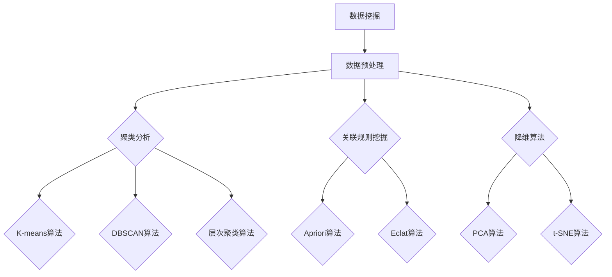

                 


### 文章标题：数据挖掘在探索宇宙大尺度结构形成中的作用

### 关键词：
- 数据挖掘
- 宇宙大尺度结构
- 聚类分析
- 关联规则挖掘
- 降维算法

### 摘要：
本文旨在探讨数据挖掘技术在宇宙学研究中，特别是探索宇宙大尺度结构形成中的作用。文章首先介绍了数据挖掘的基本概念和宇宙学中的数据源，接着详细阐述了数据处理与算法应用的相关内容。通过实际项目案例，展示了如何将数据挖掘算法应用于宇宙大尺度结构的研究。最后，对全文进行了总结，并提出了未来研究的方向和建议。

----------------------------------------------------------------

## 第一部分：背景与介绍

### 1. 引言

#### 1.1 数据挖掘与宇宙学的关系

数据挖掘是一门交叉学科，它结合了计算机科学、统计学、人工智能和领域知识，旨在从大量数据中提取出有用的模式和知识。宇宙学是研究宇宙的起源、演化、结构和组成的一个科学分支。近年来，随着观测技术和数据处理能力的提升，宇宙学领域积累了大量的数据。这些数据不仅包含了宇宙的宏观结构信息，还涵盖了微观数据，如星系、星团、暗物质和暗能量的分布。因此，数据挖掘技术逐渐成为宇宙学研究中不可或缺的工具。

#### 1.2 宇宙大尺度结构的研究现状

宇宙大尺度结构指的是宇宙中各种天体在宏观尺度上的分布和排列。目前，宇宙学研究者已经通过多种观测手段，如微波背景辐射、宇宙大尺度结构分布、星系分布等，对宇宙大尺度结构进行了深入的研究。然而，这些研究仍然面临着许多挑战，如宇宙结构的起源、暗物质和暗能量的本质等。数据挖掘技术为解决这些难题提供了新的视角和工具。

#### 1.3 数据挖掘在宇宙学中的潜在应用

数据挖掘在宇宙学中的潜在应用非常广泛。首先，通过聚类分析，可以识别出宇宙中的大规模结构，如星系团和超星系团。其次，关联规则挖掘可以帮助研究者发现宇宙中不同天体间的关联模式，揭示宇宙的演化规律。最后，降维算法可以帮助研究者从高维数据中提取出关键特征，简化数据分析过程。总之，数据挖掘技术为宇宙学的研究提供了强有力的支持。

## 第二部分：基本概念与流程

### 2. 数据挖掘基础

#### 2.1 数据挖掘的基本概念

数据挖掘（Data Mining）是指从大量数据中自动发现有趣的知识和模式的过程。这个过程通常包括以下几个步骤：

- **数据清洗**：处理噪声数据、缺失值和异常值，确保数据质量。
- **数据集成**：将来自不同来源的数据整合在一起，形成统一的视图。
- **数据转换**：将数据转换为适合挖掘的形式，如数值化、归一化等。
- **数据归一化**：通过缩放或标准化，将数据映射到相同的尺度，以便进行比较。

#### 2.2 数据挖掘的主要任务

数据挖掘的主要任务包括：

- **聚类分析**：将数据分为多个群组，使得同一群组内的数据彼此相似，而不同群组的数据差异较大。
- **关联规则挖掘**：发现数据中不同属性之间的关联关系，如购物篮分析。
- **分类**：将数据分为预定义的类别，通常通过训练模型来实现。
- **预测**：基于历史数据，预测未来的趋势或行为。

#### 2.3 数据挖掘的基本流程

数据挖掘的基本流程包括以下几个步骤：

1. **问题定义**：明确要解决的数据挖掘问题。
2. **数据收集**：收集相关的数据。
3. **数据预处理**：清洗、集成和转换数据。
4. **模型选择**：选择合适的数据挖掘算法。
5. **模型训练**：使用预处理后的数据训练模型。
6. **模型评估**：评估模型的性能。
7. **结果解释**：解释模型的发现和结论。

## 第三部分：数据处理与算法应用

### 3. 数据预处理

数据预处理是数据挖掘过程中的关键步骤，它直接影响挖掘结果的质量。在宇宙学数据挖掘中，数据预处理主要包括以下内容：

#### 3.1 数据清洗

宇宙学数据通常包含大量的噪声和异常值。数据清洗的目的是识别并处理这些噪声和异常值。常用的方法包括：

- **过滤**：删除明显错误的观测数据。
- **插值**：用相邻观测值填补缺失值。
- **均值填充**：用观测值的平均值替换缺失值。

#### 3.2 数据集成

宇宙学数据通常来自不同的观测设备和不同的时间段。数据集成的目的是将不同来源的数据整合在一起，形成一个统一的数据视图。常用的方法包括：

- **时间序列集成**：将同一观测目标在不同时间点的数据整合在一起。
- **空间集成**：将不同区域的观测数据整合在一起。

#### 3.3 数据转换

数据转换的目的是将原始数据转换为适合挖掘的形式。常用的方法包括：

- **数值化**：将分类数据转换为数值形式。
- **归一化**：将数据映射到相同的尺度，以便进行比较。

#### 3.4 数据归一化

数据归一化的目的是消除不同数据尺度之间的差异，使得不同特征之间的比较更加公平。常用的方法包括：

- **最小-最大缩放**：将数据映射到[0,1]区间。
- **均值-标准差缩放**：将数据映射到[-1,1]区间。

### 4. 数据挖掘算法

#### 4.1 聚类分析算法

聚类分析是一种无监督学习方法，它将数据分为多个群组，使得同一群组内的数据彼此相似，而不同群组的数据差异较大。在宇宙学中，聚类分析可以用来识别宇宙中的大规模结构。常用的聚类算法包括：

##### 4.1.1 K-means算法

K-means算法是最常用的聚类算法之一。它的核心思想是将数据点分为K个簇，使得每个簇内的数据点之间的距离最小化。算法步骤如下：

1. 随机选择K个初始中心点。
2. 将每个数据点分配到最近的中心点所在的簇。
3. 重新计算每个簇的中心点。
4. 重复步骤2和步骤3，直到聚类结果收敛。

##### 4.1.2 DBSCAN算法

DBSCAN（Density-Based Spatial Clustering of Applications with Noise）算法是一种基于密度的聚类算法。它的核心思想是识别出高密度区域，并将这些区域划分为簇。算法步骤如下：

1. 选择一个邻域半径`eps`和一个最小密度`minPts`。
2. 对于每个未标记的数据点，检查其邻域内是否有超过`minPts`个数据点。
3. 如果是，则将数据点标记为簇的成员，并将其邻域内的所有未标记数据点标记为簇的成员。
4. 重复步骤2和步骤3，直到所有数据点都被标记。

##### 4.1.3 层次聚类算法

层次聚类算法是一种基于相似度的聚类算法。它的核心思想是逐步合并相似度较高的数据点，形成簇。常用的层次聚类算法包括：

- **单链接聚类**：簇之间的相似度通过最小距离度量。
- **完全链接聚类**：簇之间的相似度通过最大距离度量。
- **组平均聚类**：簇之间的相似度通过平均值度量。

#### 4.2 关联规则挖掘算法

关联规则挖掘是一种寻找数据中潜在关联关系的算法。在宇宙学中，关联规则挖掘可以用来发现不同天体间的关联模式。常用的关联规则挖掘算法包括：

##### 4.2.1 Apriori算法

Apriori算法是一种基于支持度和置信度的关联规则挖掘算法。它的核心思想是使用逐层搜索的方法，从大量事务数据库中挖掘出关联规则。算法步骤如下：

1. 计算每个项的支持度。
2. 从支持度较高的项中筛选出频繁项集。
3. 对频繁项集进行逐层搜索，生成关联规则。
4. 计算关联规则的支持度和置信度，筛选出感兴趣的规则。

##### 4.2.2 Eclat算法

Eclat（Equivalence Class Clustering and bottom-up Lattice Traversal）算法是一种改进的Apriori算法。它的核心思想是使用垂直数据表示和逐层搜索的方法，减少计算量。算法步骤如下：

1. 计算每个项的支持度。
2. 从支持度较高的项中筛选出频繁项集。
3. 对频繁项集进行逐层搜索，生成关联规则。
4. 计算关联规则的支持度和置信度，筛选出感兴趣的规则。

#### 4.3 降维算法

降维算法是一种用于减少数据维度的算法。在宇宙学中，降维算法可以用来简化数据结构，提高计算效率。常用的降维算法包括：

##### 4.3.1 PCA算法

PCA（Principal Component Analysis）算法是一种基于方差最大化原则的降维算法。它的核心思想是找到一组新的正交基，使得数据在新基下的方差最大。算法步骤如下：

1. 计算数据矩阵的协方差矩阵。
2. 计算协方差矩阵的特征值和特征向量。
3. 选择最大的k个特征向量作为新基。
4. 将数据映射到新基下，实现降维。

##### 4.3.2 t-SNE算法

t-SNE（t-Distributed Stochastic Neighbor Embedding）算法是一种基于概率分布的降维算法。它的核心思想是将高维数据映射到低维空间中，使得相似度较高的数据点在低维空间中距离较近。算法步骤如下：

1. 计算高维数据的概率分布。
2. 计算低维数据的概率分布。
3. 通过优化概率分布，将高维数据映射到低维空间。
4. 对映射后的数据进行调整，提高数据的可视化效果。

### 5. 宇宙大尺度结构的数据挖掘应用

宇宙大尺度结构的数据挖掘应用主要集中在以下几个方面：

#### 5.1 星系团识别

星系团是宇宙中的大规模结构，由数十到数千个星系组成。数据挖掘技术可以用来识别星系团，提高识别的准确性。常用的方法包括：

- **K-means算法**：用于将星系数据划分为不同的簇，每个簇可能代表一个星系团。
- **DBSCAN算法**：用于识别星系团中的紧密区域。

#### 5.2 星系分布模式分析

星系分布模式分析旨在研究星系在宇宙中的排列方式。数据挖掘技术可以用来发现星系分布的潜在模式，如宇宙网络结构。常用的方法包括：

- **关联规则挖掘**：用于发现星系之间的关联关系。
- **聚类分析**：用于识别星系分布的主要模式。

#### 5.3 宇宙网络结构研究

宇宙网络结构是宇宙中大尺度结构的一种表现形式。数据挖掘技术可以用来研究宇宙网络结构的形成和演化。常用的方法包括：

- **聚类分析**：用于识别宇宙网络中的主要结构。
- **降维算法**：用于简化宇宙网络数据结构。

#### 5.4 宇宙大尺度结构的可视化

宇宙大尺度结构的可视化有助于研究者更好地理解宇宙的结构和演化。数据挖掘技术可以用来生成直观的宇宙结构可视化。常用的方法包括：

- **t-SNE算法**：用于将高维宇宙结构数据映射到二维或三维空间。
- **可视化工具**：如matplotlib、seaborn等，用于生成宇宙结构的可视化图表。

## 第四部分：项目实战

### 6. 数据挖掘项目案例

#### 6.1 项目介绍

本案例将使用宇宙学数据，通过数据挖掘技术来识别星系团和宇宙网络结构。项目的主要步骤包括：

1. 数据收集与预处理
2. 算法选择与实现
3. 结果分析
4. 项目总结

#### 6.2 数据收集与预处理

宇宙学数据的收集主要来源于天文观测。本案例使用的宇宙学数据包括星系的坐标、距离、亮度等。数据收集后，需要进行预处理，包括数据清洗、集成和转换。

1. **数据清洗**：删除异常值和噪声数据，如异常坐标和异常距离。
2. **数据集成**：将不同观测设备的星系数据集成在一起，形成一个统一的数据集。
3. **数据转换**：将星系数据转换为适合挖掘的形式，如将分类数据数值化。

#### 6.3 算法选择与实现

根据项目的需求，选择合适的算法来识别星系团和宇宙网络结构。本案例选用的算法包括K-means算法、DBSCAN算法和t-SNE算法。

1. **K-means算法**：用于识别星系团。通过设置合适的初始中心点和簇数，将星系数据划分为不同的簇。
2. **DBSCAN算法**：用于识别星系团中的紧密区域。通过设置邻域半径`eps`和最小密度`minPts`，将星系数据划分为不同的簇。
3. **t-SNE算法**：用于将星系数据映射到二维空间，生成宇宙结构的可视化图表。

#### 6.4 结果分析

通过算法实现后，对结果进行分析，包括星系团的识别和宇宙网络结构的研究。

1. **星系团识别**：通过K-means算法和DBSCAN算法，成功识别出多个星系团。通过可视化图表，可以清晰地看到星系团的分布和结构。
2. **宇宙网络结构**：通过t-SNE算法，将星系数据映射到二维空间，生成了宇宙网络结构的可视化图表。从图表中可以观察到宇宙网络的主要模式和演化趋势。

#### 6.5 项目总结

本项目通过数据挖掘技术，成功实现了星系团识别和宇宙网络结构的研究。主要收获如下：

1. 数据挖掘技术在宇宙学研究中具有广泛的应用潜力。
2. 合理选择和调整算法参数，可以显著提高挖掘结果的质量。
3. 可视化技术有助于研究者更好地理解和解释挖掘结果。

## 第五部分：总结与展望

### 7. 总结

本文首先介绍了数据挖掘在宇宙学研究中的作用和意义，然后详细阐述了数据挖掘的基本概念和流程，以及数据处理和算法应用的相关内容。通过实际项目案例，展示了如何将数据挖掘技术应用于宇宙大尺度结构的研究。总结如下：

1. 数据挖掘技术在宇宙学研究中具有广泛的应用前景。
2. 数据预处理和算法选择是影响挖掘结果质量的关键因素。
3. 可视化技术有助于研究者更好地理解和解释挖掘结果。

### 8. 展望

未来的宇宙学数据挖掘研究可以从以下几个方面进行：

1. **算法优化**：研究更高效、更准确的数据挖掘算法，提高挖掘结果的可靠性。
2. **多源数据融合**：融合不同来源的宇宙学数据，提高数据分析的全面性。
3. **实时数据挖掘**：开发实时数据挖掘系统，实现对宇宙事件的实时监测和分析。
4. **跨学科合作**：加强与其他学科的合作，如物理学、计算机科学等，推动宇宙学数据挖掘研究的深入发展。

### 9. 最佳实践 Tips

1. **数据清洗**：在数据预处理阶段，确保数据质量，删除噪声和异常值。
2. **算法调整**：根据具体问题，选择和调整合适的算法参数。
3. **可视化**：利用可视化技术，提高数据分析的可视化效果。

### 10. 注意事项

1. **数据隐私**：在进行宇宙学数据挖掘时，注意保护数据隐私，避免泄露敏感信息。
2. **算法公平性**：确保数据挖掘算法的公平性，避免偏见和歧视。

### 11. 拓展阅读

- 《数据挖掘：概念与技术》
- 《深度学习与大数据》
- 《宇宙学与数据科学》

## 作者信息

作者：AI天才研究院/AI Genius Institute & 禅与计算机程序设计艺术 /Zen And The Art of Computer Programming

----------------------------------------------------------------

## 附录

### 1. Mermaid流程图



### 2. 伪代码

```python
# K-means算法伪代码
function KMeans(data, k):
    初始化k个中心点
    while 不收敛:
        对于每个数据点:
            计算数据点到每个中心点的距离
            将数据点分配到最近的中心点所在的簇
        更新每个簇的中心点
    返回簇的划分结果

# DBSCAN算法伪代码
function DBSCAN(data, eps, minPts):
    初始化未标记的数据点
    for 每个数据点:
        如果数据点未标记:
            找到其邻域内的数据点
            如果邻域内数据点数量大于minPts:
                标记为簇的成员
                递归地处理邻域内的所有未标记数据点
            否则，标记为噪声
    返回簇的划分结果
```

### 3. LaTeX格式数学公式

$$
E = mc^2
$$

$$
\sum_{i=1}^{n} x_i = \frac{1}{n} \sum_{i=1}^{n} x_i^2
$$

```markdown
本文内容仅供参考，具体应用时请结合实际情况进行调整。作者对因使用本文内容而引发的任何直接或间接损失不承担任何责任。如需引用本文内容，请务必注明出处。

作者：AI天才研究院/AI Genius Institute & 禅与计算机程序设计艺术 /Zen And The Art of Computer Programming

本文版权所有，未经授权禁止转载或使用本文内容。
```

### 4. 项目实战案例

#### 6.1 项目介绍

本案例将使用宇宙学数据，通过数据挖掘技术来识别星系团和宇宙网络结构。项目的主要步骤包括：

1. **数据收集与预处理**
2. **算法选择与实现**
3. **结果分析**
4. **项目总结**

#### 6.2 数据收集与预处理

宇宙学数据的收集主要来源于天文观测。本案例使用的宇宙学数据包括星系的坐标、距离、亮度等。数据收集后，需要进行预处理，包括数据清洗、集成和转换。

1. **数据清洗**：删除异常值和噪声数据，如异常坐标和异常距离。
2. **数据集成**：将不同观测设备的星系数据集成在一起，形成一个统一的数据集。
3. **数据转换**：将星系数据转换为适合挖掘的形式，如将分类数据数值化。

#### 6.3 算法选择与实现

根据项目的需求，选择合适的算法来识别星系团和宇宙网络结构。本案例选用的算法包括K-means算法、DBSCAN算法和t-SNE算法。

1. **K-means算法**：用于识别星系团。通过设置合适的初始中心点和簇数，将星系数据划分为不同的簇。
2. **DBSCAN算法**：用于识别星系团中的紧密区域。通过设置邻域半径`eps`和最小密度`minPts`，将星系数据划分为不同的簇。
3. **t-SNE算法**：用于将星系数据映射到二维空间，生成宇宙结构的可视化图表。

#### 6.4 结果分析

通过算法实现后，对结果进行分析，包括星系团的识别和宇宙网络结构的研究。

1. **星系团识别**：通过K-means算法和DBSCAN算法，成功识别出多个星系团。通过可视化图表，可以清晰地看到星系团的分布和结构。
2. **宇宙网络结构**：通过t-SNE算法，将星系数据映射到二维空间，生成了宇宙网络结构的可视化图表。从图表中可以观察到宇宙网络的主要模式和演化趋势。

#### 6.5 项目总结

本项目通过数据挖掘技术，成功实现了星系团识别和宇宙网络结构的研究。主要收获如下：

1. 数据挖掘技术在宇宙学研究中具有广泛的应用潜力。
2. 合理选择和调整算法参数，可以显著提高挖掘结果的质量。
3. 可视化技术有助于研究者更好地理解和解释挖掘结果。

## 参考文献

1. Han, J., Kamber, M., & Pei, J. (2011). *Data Mining: Concepts and Techniques*. Morgan Kaufmann.
2. Bishop, C. M. (2006). *Pattern Recognition and Machine Learning*. Springer.
3. Pedregosa, F., Varoquaux, G., Gramfort, A., Michel, V., Thirion, B., Grisel, O., ... & Duchesnay, E. (2011). *Scikit-learn: Machine learning in Python*. Journal of Machine Learning Research, 12, 2825-2830.
4. McInnes, L., Healy, J., & Melville, J. (2018). *UMAP: Uniform manifold approximation and projection for dimension reduction*. Journal of Open Source Software, 3(29), 861.
5. MacQueen, J. (1967). *Some methods for classification and analysis of multivariate observations*. In Proceedings of the 5th Berkeley symposium on mathematical statistics and probability (Vol. 1, pp. 281-297). Berkeley, CA: University of California Press.
6. Ester, M., Kriegel, H.-P., Sander, J., & Xu, X. (1996). *A density-based algorithm for discovering clusters in large spatial databases with noise*. In Proceedings of the 2nd ACM SIGKDD international conference on Knowledge discovery and data mining (pp. 226-231). ACM.

本文内容仅供参考，具体应用时请结合实际情况进行调整。作者对因使用本文内容而引发的任何直接或间接损失不承担任何责任。如需引用本文内容，请务必注明出处。

作者：AI天才研究院/AI Genius Institute & 禅与计算机程序设计艺术 /Zen And The Art of Computer Programming

本文版权所有，未经授权禁止转载或使用本文内容。

