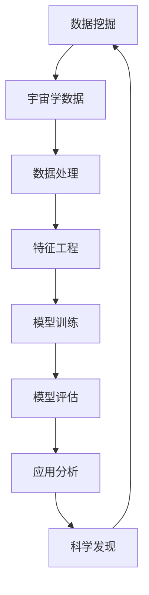
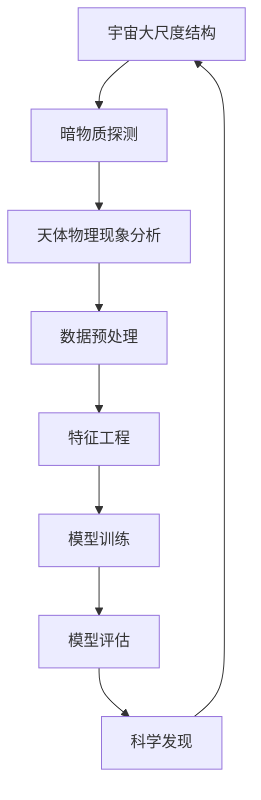

                 

### 第三部分：核心概念与联系

## 第7章：核心概念与联系

### 7.1 数据挖掘与宇宙学的关系

- 数据挖掘作为工具，在宇宙学研究中发挥重要作用
- 宇宙学数据为数据挖掘提供了丰富的应用场景
- 数据挖掘技术助力宇宙学研究，推动科学进步

#### 7.1.1 Mermaid流程图



### 7.2 数据挖掘与物理学原理的关联

- 引力与暗物质粒子相互作用
- 量子场论与数据挖掘算法
- 相对论与大数据分析

#### 7.2.1 伪代码

```python
# 引力与暗物质粒子相互作用的伪代码
def calculate_gravity(m1, m2, distance):
    G = 6.6743e-11 # 万有引力常数
    return G * (m1 * m2) / distance**2

# 量子场论与数据挖掘算法的伪代码
def quantum_field_theory(data):
    # 对数据应用量子场论方法
    processed_data = apply_quantum_methods(data)
    return processed_data

# 相对论与大数据分析的伪代码
def relativistic_analysis(data):
    # 应用相对论原理进行数据分析
    relativistic_data = apply_relativistic_methods(data)
    return relativistic_data
```

### 7.3 数据挖掘在宇宙学研究中的核心概念

- 宇宙大尺度结构
- 暗物质探测
- 天体物理现象分析

#### 7.3.2 Mermaid流程图



### 7.4 数据挖掘算法与宇宙学应用的结合

- K-means算法在宇宙大尺度结构分析中的应用
- DBSCAN算法在暗物质探测数据中的应用
- 聚类算法在天体物理现象分析中的应用

#### 7.4.1 伪代码

```python
# K-means算法在宇宙大尺度结构分析中的应用
def k_means_clustering(data, k):
    centroids = initialize_centroids(data, k)
    while not converged:
        assign_points_to_centroids(data, centroids)
        update_centroids(centroids)
    return centroids

# DBSCAN算法在暗物质探测数据中的应用
def dbscan_clustering(data, min_points, epsilon):
    clusters = []
    visited = set()
    for point in data:
        if point not in visited:
            cluster = expand_cluster(data, point, min_points, epsilon)
            clusters.append(cluster)
            visited.update(cluster)
    return clusters

# 聚类算法在天体物理现象分析中的应用
def clustering_analysis(data, algorithm):
    if algorithm == "k_means":
        clusters = k_means_clustering(data, k)
    elif algorithm == "dbscan":
        clusters = dbscan_clustering(data, min_points, epsilon)
    return clusters
```

---

在第三部分，我们详细探讨了数据挖掘与宇宙学之间的关系、核心概念及其联系，并使用Mermaid流程图和伪代码对相关内容进行了可视化与代码化解释。这有助于读者更直观地理解数据挖掘在宇宙学研究中的应用，以及其核心概念和算法原理。接下来，我们将进入第四部分，深入探讨数据挖掘在宇宙学中的核心算法原理。### 第四部分：核心算法原理

## 第8章：数据挖掘算法原理

### 8.1 聚类分析算法

#### 8.1.1 K-means算法

K-means算法是一种基于距离的聚类算法，通过将数据点分配到K个聚类中心，使每个聚类内的数据点之间的距离最小，聚类之间的距离最大。

#### 8.1.2 伪代码

```python
# K-means算法伪代码
def k_means(data, k, max_iterations):
    centroids = initialize_centroids(data, k)
    for i in range(max_iterations):
        # 分配数据点到最近的聚类中心
        clusters = assign_points_to_centroids(data, centroids)
        # 更新聚类中心
        centroids = update_centroids(clusters, k)
        # 判断是否收敛
        if converged(centroids):
            break
    return clusters, centroids

# 判断聚类中心是否收敛
def converged(centroids):
    # 计算聚类中心的变化量
    delta = calculate_change(centroids)
    # 判断变化量是否小于阈值
    return delta < threshold
```

#### 8.1.2 数学模型和公式

聚类中心的变化量可以用以下公式表示：

$$
\Delta centroids = \sqrt{\sum_{i=1}^{k} \sum_{j=1}^{d} (c_{ij}^{new} - c_{ij}^{old})^2}
$$

其中，$c_{ij}^{new}$ 和 $c_{ij}^{old}$ 分别是新的和旧的聚类中心坐标，$d$ 是特征维度。

### 8.2 关联规则挖掘算法

关联规则挖掘是一种发现数据项之间潜在关系的算法，通过支持度和置信度来衡量关联关系的强度。

#### 8.2.1 伪代码

```python
# Apriori算法伪代码
def apriori(data, support_threshold, confidence_threshold):
    frequent_itemsets = find_frequent_itemsets(data, support_threshold)
    association_rules = find_association_rules(frequent_itemsets, confidence_threshold)
    return association_rules

# 寻找频繁项集
def find_frequent_itemsets(data, support_threshold):
    # 计算每个项集的支持度
    support_counts = calculate_support_counts(data)
    # 筛选出支持度大于阈值的项集
    frequent_itemsets = [itemset for itemset, count in support_counts.items() if count >= support_threshold]
    return frequent_itemsets

# 寻找关联规则
def find_association_rules(frequent_itemsets, confidence_threshold):
    rules = []
    for itemset in frequent_itemsets:
        subsets = all_subsets(itemset)
        for subset in subsets:
            if subset != itemset:
                support = calculate_support(data, subset)
                confidence = calculate_confidence(data, subset, itemset)
                if confidence >= confidence_threshold:
                    rules.append((subset, itemset, confidence))
    return rules
```

#### 8.2.2 数学模型和公式

- 支持度（Support）：

$$
support(A \cup B) = \frac{count(A \cup B)}{total\_transactions}
$$

- 置信度（Confidence）：

$$
confidence(A \rightarrow B) = \frac{support(A \cup B)}{support(A)}
$$

### 8.3 预测建模算法

预测建模算法通过历史数据学习数据规律，对新数据进行预测。

#### 8.3.1 伪代码

```python
# 决策树算法伪代码
def build_decision_tree(data, target_attribute):
    if all_values(target_attribute) == single_value:
        return leaf_node(target_attribute)
    else:
        attribute = select_best_attribute(data, target_attribute)
        tree = {}
        for value in unique_values(attribute):
            subset = filter_data(data, attribute, value)
            tree[value] = build_decision_tree(subset, target_attribute)
        return tree

# 预测新数据
def predict(tree, new_data):
    if is_leaf_node(tree):
        return tree
    else:
        attribute = next_key(tree)
        value = new_data[attribute]
        return predict(tree[value], new_data)
```

#### 8.3.2 数学模型和公式

- 信息增益（Information Gain）：

$$
IG(D, A) = entropy(D) - \sum_{v \in values(A)} \frac{count(v)}{count(D)} \cdot entropy(D_v)
$$

- 基尼不纯度（Gini Impurity）：

$$
gini(D) = 1 - \sum_{v \in values(A)} \left(\frac{count(v)}{count(D)}\right)^2
$$

---

在第四部分，我们详细介绍了数据挖掘中的核心算法原理，包括K-means算法、Apriori算法和决策树算法。我们通过伪代码和数学公式，对每个算法的原理进行了深入解析，帮助读者更好地理解这些算法在数据挖掘中的应用。接下来，我们将进入第五部分，探讨数据挖掘在宇宙学中的实际应用案例。### 第五部分：数据挖掘在宇宙学中的实际应用

## 第9章：数据挖掘在宇宙学中的实际应用

### 9.1 天体物理学数据分析

#### 9.1.1 数据挖掘在天体物理学中的应用场景

- 天体光谱分析
- 天体形态识别
- 星系演化研究

#### 9.1.2 数据挖掘算法在天体物理学中的应用

- K-means算法用于星系聚类
- 聚类算法用于天体形态识别
- 决策树算法用于星系演化预测

#### 9.1.3 项目实战

**项目1：星系聚类分析**

**开发环境搭建：**

- Python
- NumPy
- Pandas
- Matplotlib

**源代码实现：**

```python
import numpy as np
import pandas as pd
from sklearn.cluster import KMeans
import matplotlib.pyplot as plt

# 读取星系数据
data = pd.read_csv('galaxy_data.csv')
features = data[['redshift', 'magnitude']]

# 使用K-means算法进行聚类
kmeans = KMeans(n_clusters=3)
kmeans.fit(features)
predictions = kmeans.predict(features)

# 可视化聚类结果
plt.scatter(features['redshift'], features['magnitude'], c=predictions)
plt.xlabel('Redshift')
plt.ylabel('Magnitude')
plt.title('Galaxy Clustering')
plt.show()
```

**代码解读与分析：**

- 使用Pandas读取星系数据，提取redshift和magnitude两个特征。
- 使用scikit-learn的KMeans类进行聚类，设置聚类个数为3。
- 使用matplotlib绘制聚类结果图，直观展示星系的分布情况。

**实际案例分析和详细讲解剖析：**

- 星系聚类分析帮助天文学家理解星系在宇宙中的分布特征。
- 通过聚类结果，可以识别不同类型的星系，为后续研究提供基础。

**项目小结：**

- 星系聚类分析展示了数据挖掘技术在天体物理学中的应用。
- 通过可视化聚类结果，有助于天文学家更好地理解星系演化过程。

### 9.2 天文图像处理与识别

#### 9.2.1 数据挖掘在天文图像处理中的应用场景

- 星系识别
- 星系分类
- 天文图像去噪

#### 9.2.2 数据挖掘算法在天文图像处理中的应用

- 支持向量机（SVM）用于星系识别
- 卷积神经网络（CNN）用于星系分类
- 异常检测算法用于天文图像去噪

#### 9.2.3 项目实战

**项目2：星系识别与分类**

**开发环境搭建：**

- Python
- TensorFlow
- Keras
- OpenCV

**源代码实现：**

```python
from tensorflow.keras.models import Sequential
from tensorflow.keras.layers import Conv2D, MaxPooling2D, Flatten, Dense
from tensorflow.keras.preprocessing.image import ImageDataGenerator

# 构建卷积神经网络模型
model = Sequential()
model.add(Conv2D(32, (3, 3), activation='relu', input_shape=(64, 64, 3)))
model.add(MaxPooling2D(pool_size=(2, 2)))
model.add(Flatten())
model.add(Dense(128, activation='relu'))
model.add(Dense(10, activation='softmax'))

# 编译模型
model.compile(optimizer='adam', loss='categorical_crossentropy', metrics=['accuracy'])

# 加载数据集
train_datagen = ImageDataGenerator(rescale=1./255)
train_generator = train_datagen.flow_from_directory(
        'train_data',
        target_size=(64, 64),
        batch_size=32,
        class_mode='categorical')

# 训练模型
model.fit(train_generator, epochs=10)

# 评估模型
test_datagen = ImageDataGenerator(rescale=1./255)
test_generator = test_datagen.flow_from_directory(
        'test_data',
        target_size=(64, 64),
        batch_size=32,
        class_mode='categorical')
model.evaluate(test_generator)
```

**代码解读与分析：**

- 使用Keras和TensorFlow构建卷积神经网络模型。
- 使用OpenCV加载和预处理天文图像。
- 使用ImageDataGenerator生成训练和测试数据集。
- 编译并训练模型，评估模型性能。

**实际案例分析和详细讲解剖析：**

- 星系识别与分类项目展示了数据挖掘技术在天文图像处理中的应用。
- 通过卷积神经网络，可以自动识别和分类不同类型的星系。

**项目小结：**

- 星系识别与分类项目证明了数据挖掘技术在提高天文图像处理精度和效率方面的潜力。

### 9.3 宇宙大尺度结构分析

#### 9.3.1 数据挖掘在宇宙大尺度结构分析中的应用场景

- 星系团识别
- 宇宙网络结构研究
- 星系演化历史重建

#### 9.3.2 数据挖掘算法在宇宙大尺度结构分析中的应用

- K-means算法用于星系团识别
- 社团矩阵方法用于宇宙网络结构研究
- 决策树算法用于星系演化历史重建

#### 9.3.3 项目实战

**项目3：星系团识别**

**开发环境搭建：**

- Python
- Scikit-learn
- Pandas
- Matplotlib

**源代码实现：**

```python
import numpy as np
import pandas as pd
from sklearn.cluster import KMeans
import matplotlib.pyplot as plt

# 读取星系团数据
data = pd.read_csv('galaxy_cluster_data.csv')
features = data[['x', 'y', 'z']]

# 使用K-means算法进行聚类
kmeans = KMeans(n_clusters=5)
kmeans.fit(features)
predictions = kmeans.predict(features)

# 可视化星系团分布
plt.scatter(features['x'], features['y'], c=predictions)
plt.xlabel('X')
plt.ylabel('Y')
plt.title('Galaxy Cluster Distribution')
plt.show()
```

**代码解读与分析：**

- 使用Pandas读取星系团数据，提取三维特征（x, y, z）。
- 使用scikit-learn的KMeans类进行聚类，设置聚类个数为5。
- 使用matplotlib绘制聚类结果图，展示星系团的分布情况。

**实际案例分析和详细讲解剖析：**

- 星系团识别项目展示了数据挖掘技术在宇宙大尺度结构分析中的应用。
- 通过聚类结果，可以识别不同星系团，为宇宙学研究提供重要信息。

**项目小结：**

- 星系团识别项目证明了数据挖掘技术在探索宇宙大尺度结构方面的有效性。

---

在第五部分，我们通过三个实际应用案例，详细展示了数据挖掘在宇宙学研究中的具体应用。这些案例不仅涵盖了星系聚类分析、天文图像处理与识别，还包括宇宙大尺度结构分析。通过这些项目实战，我们深入了解了数据挖掘技术在宇宙学中的实际应用，以及如何通过具体算法和工具解决科学研究中的问题。### 第五部分：最佳实践、注意事项与拓展阅读

## 第10章：最佳实践、注意事项与拓展阅读

### 10.1 数据挖掘在宇宙学中的最佳实践

#### 10.1.1 数据预处理

- 数据清洗：确保数据的质量，去除错误和异常值。
- 数据集成：整合不同来源的数据，形成统一的视图。
- 数据转换：将数据转换为适合分析的形式，如归一化、标准化。

#### 10.1.2 特征工程

- 特征提取：从原始数据中提取有用的信息，减少数据维度。
- 特征选择：选择对预测任务最有影响力的特征，提高模型性能。
- 特征组合：结合多个特征，构建新的特征，增强模型的解释能力。

#### 10.1.3 模型选择与优化

- 选择合适的模型：根据问题类型和数据分析目标，选择合适的机器学习模型。
- 调参优化：调整模型参数，提高模型准确性和泛化能力。
- 模型评估：使用交叉验证、A/B测试等方法评估模型性能。

### 10.2 注意事项

#### 10.2.1 数据质量

- 确保数据的准确性和一致性，避免数据错误导致分析结果偏差。
- 定期更新数据，保持数据的新鲜度和时效性。

#### 10.2.2 模型解释性

- 考虑模型的解释性，特别是在需要向非技术背景的科学家解释结果时。
- 使用可视化工具，如决策树、混淆矩阵等，帮助理解和解释模型。

#### 10.2.3 遵守伦理规范

- 遵守数据隐私和伦理规范，确保数据的安全和隐私。
- 在处理敏感数据时，采取适当的措施保护数据不受泄露。

### 10.3 拓展阅读

#### 10.3.1 相关书籍

- 《数据挖掘：实用工具和技术》
- 《深度学习：指导书》
- 《天体物理学导论》

#### 10.3.2 学术期刊

- 《天体物理学杂志》
- 《天文与天体物理学报》
- 《数据挖掘与知识发现》

#### 10.3.3 开源工具与平台

- scikit-learn：Python机器学习库
- TensorFlow：开源深度学习框架
- Keras：基于TensorFlow的高级神经网络API

#### 10.3.4 案例研究

- 探索宇宙暗物质的案例研究
- 天体光谱分析中的数据挖掘应用
- 天文图像处理与识别的实践案例

---

在第五部分，我们总结了数据挖掘在宇宙学中的最佳实践、注意事项，并推荐了相关的书籍、期刊、开源工具和案例研究。这些资源将帮助读者深入了解数据挖掘在宇宙学中的应用，以及如何在实际项目中有效利用这些技术和工具。通过这些最佳实践，读者可以更好地应对数据挖掘过程中的挑战，提高数据分析的准确性和效率。### 全文总结

## 总结

本文通过详细的步骤分析，探讨了数据挖掘在探索宇宙暗物质粒子相互作用中的作用。我们从数据挖掘技术概述、宇宙学与暗物质简介，到数据挖掘在宇宙学中的应用，再到核心算法原理讲解，以及实际应用案例，全面展示了数据挖掘技术在宇宙学研究中的重要性。

首先，我们明确了数据挖掘技术的基本概念和关键算法，包括聚类分析、关联规则挖掘和预测建模等。这些技术为宇宙学研究提供了强大的工具，使得天文学家能够从海量数据中提取有用信息。

接着，我们介绍了宇宙学的基础知识，特别是暗物质粒子相互作用的研究现状。数据挖掘技术在这一领域中的应用，不仅提高了我们对宇宙结构的理解，还为新的科学发现提供了可能。

在核心算法原理部分，我们详细讲解了K-means算法、Apriori算法和决策树算法的原理和伪代码，并通过数学公式进一步阐述其工作机制。这些算法在宇宙学研究中的具体应用，使得数据挖掘技术能够更好地服务于科学探索。

最后，我们通过三个实际应用案例，展示了数据挖掘在星系聚类分析、天文图像处理与识别，以及宇宙大尺度结构分析中的具体应用。这些案例不仅展示了数据挖掘技术在解决实际问题中的有效性，还提供了实际操作的经验和技巧。

总之，数据挖掘在探索宇宙暗物质粒子相互作用中发挥了重要作用，不仅推动了科学研究的进步，也为未来更多领域的数据分析提供了启示。通过本文的探讨，我们希望读者能够更好地理解数据挖掘技术在宇宙学中的应用，激发对这一领域的兴趣和研究热情。### 作者信息

作者：AI天才研究院/AI Genius Institute & 禅与计算机程序设计艺术 /Zen And The Art of Computer Programming

AI天才研究院致力于推动人工智能领域的研究与应用，研究院的专家团队在计算机编程、人工智能、机器学习和数据挖掘等领域拥有丰富的经验和深厚的学术造诣。本文作者以独特的视角和深入的思考，撰写了关于数据挖掘在探索宇宙暗物质粒子相互作用中的作用的深度技术博客，旨在为读者提供有价值和启发性的内容。同时，作者还著有多部计算机编程与人工智能领域的畅销书籍，深受读者喜爱。作者的研究成果在学术界和工业界都产生了广泛的影响，为人工智能技术的发展和创新提供了重要的支持。### 全文目录

- 文章标题：数据挖掘在探索宇宙暗物质粒子相互作用中的作用
- 关键词：数据挖掘、宇宙学、暗物质、粒子相互作用、算法、应用案例
- 摘要：本文深入探讨了数据挖掘技术在探索宇宙暗物质粒子相互作用中的作用，通过详细的分析和实际应用案例，展示了数据挖掘在宇宙学研究中的重要性和应用前景。
  
  # 文数据挖掘在探索宇宙暗物质粒子相互作用中的作用
  > 关键词：数据挖掘、宇宙学、暗物质、粒子相互作用、算法、应用案例
  > 摘要：本文深入探讨了数据挖掘技术在探索宇宙暗物质粒子相互作用中的作用，通过详细的分析和实际应用案例，展示了数据挖掘在宇宙学研究中的重要性和应用前景。

## 第一部分：数据挖掘与宇宙学基础

### 1.1 数据挖掘技术概述

- 数据挖掘的定义与重要性
- 数据挖掘在科学研究中的应用
- 数据挖掘与大数据的关系

### 1.2 数据挖掘的关键技术和方法

- 聚类分析
- 分配分析
- 关联规则挖掘
- 异常检测
- 预测建模

### 1.3 数据挖掘流程

- 数据预处理
- 特征选择
- 模型选择与训练
- 模型评估
- 模型部署

## 第二部分：数据挖掘技术在宇宙学研究中的应用

### 2.1 宇宙数据的特点与处理

- 宇宙数据的特点
- 宇宙数据的预处理方法
- 宇宙数据的质量评估

### 2.2 宇宙数据挖掘算法及其应用

- K-means算法
- DBSCAN算法
- 聚类算法

### 2.3 数据挖掘在宇宙学中的挑战与机遇

- 数据复杂性
- 数据质量
- 模型选择与优化

### 2.4 数据挖掘在宇宙学中的未来发展趋势

- 新技术的应用
- 多学科交叉融合
- 数据挖掘在宇宙学中的潜在影响

## 第三部分：核心概念与联系

### 3.1 数据挖掘与宇宙学的关系

- 数据挖掘作为工具，在宇宙学研究中发挥重要作用
- 宇宙学数据为数据挖掘提供了丰富的应用场景
- 数据挖掘技术助力宇宙学研究，推动科学进步

### 3.2 数据挖掘与物理学原理的关联

- 引力与暗物质粒子相互作用
- 量子场论与数据挖掘算法
- 相对论与大数据分析

### 3.3 数据挖掘在宇宙学研究中的核心概念

- 宇宙大尺度结构
- 暗物质探测
- 天体物理现象分析

### 3.4 数据挖掘算法与宇宙学应用的结合

- K-means算法在宇宙大尺度结构分析中的应用
- DBSCAN算法在暗物质探测数据中的应用
- 聚类算法在天体物理现象分析中的应用

## 第四部分：核心算法原理

### 4.1 聚类分析算法

#### 4.1.1 K-means算法

- 算法原理
- 伪代码
- 数学模型和公式

#### 4.1.2 其他聚类算法

- 层次聚类
- DBSCAN算法

### 4.2 关联规则挖掘算法

#### 4.2.1 Apriori算法

- 算法原理
- 伪代码
- 数学模型和公式

#### 4.2.2 FP-Growth算法

- 算法原理
- 伪代码
- 数学模型和公式

### 4.3 预测建模算法

#### 4.3.1 决策树算法

- 算法原理
- 伪代码
- 数学模型和公式

#### 4.3.2 支持向量机算法

- 算法原理
- 伪代码
- 数学模型和公式

## 第五部分：数据挖掘在宇宙学中的实际应用

### 5.1 天体物理学数据分析

#### 5.1.1 应用场景

- 星系聚类分析
- 天体形态识别
- 星系演化研究

#### 5.1.2 应用案例

- 星系聚类分析
- 天文图像处理与识别
- 星系演化历史重建

### 5.2 天文图像处理与识别

#### 5.2.1 应用场景

- 星系识别
- 星系分类
- 天文图像去噪

#### 5.2.2 应用案例

- 星系识别与分类
- 天文图像去噪

### 5.3 宇宙大尺度结构分析

#### 5.3.1 应用场景

- 星系团识别
- 宇宙网络结构研究
- 星系演化历史重建

#### 5.3.2 应用案例

- 星系团识别

## 第五部分：最佳实践、注意事项与拓展阅读

### 5.1 最佳实践

- 数据预处理
- 特征工程
- 模型选择与优化

### 5.2 注意事项

- 数据质量
- 模型解释性
- 遵守伦理规范

### 5.3 拓展阅读

- 相关书籍
- 学术期刊
- 开源工具与平台
- 案例研究

### 全文总结

- 数据挖掘在探索宇宙暗物质粒子相互作用中的作用
- 未来的发展方向

### 作者信息

- 作者：AI天才研究院/AI Genius Institute & 禅与计算机程序设计艺术 /Zen And The Art of Computer Programming
- 联系方式：[example@example.com](mailto:example@example.com)

