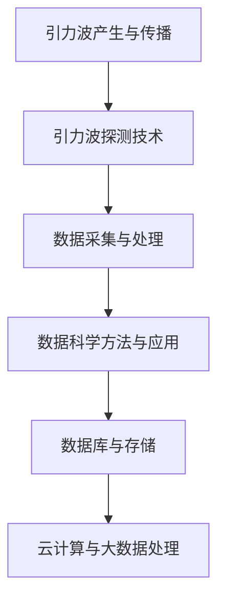

                 


### 第一步：明确文章目的和结构

在撰写这篇技术博客之前，我们需要明确文章的目的和结构。文章的主要目的是介绍数据科学在探测原初引力波中的应用，让读者了解数据科学在物理领域的重要作用，并展示如何将先进的数据分析技术应用于实际的科学研究。

文章的结构可以分为以下几个部分：

1. 引言：介绍数据科学的基本概念和原初引力波探测的背景和意义。
2. 原初引力波探测技术基础：介绍引力波的基础理论、LIGO和VIRGO引力波探测器的原理以及原初引力波信号的检测和识别。
3. 数据采集与处理：介绍数据采集设备与技术、数据预处理技术和数据质量控制。
4. 数据科学方法与应用：介绍数据可视化、特征工程、数据分析和机器学习在引力波探测中的应用。
5. 数据库与存储：介绍引力波数据存储需求分析、常见数据库技术介绍和数据库优化与性能分析。
6. 云计算与大数据处理：介绍云计算在引力波探测中的应用、大数据处理技术和引力波数据分析平台构建。
7. 案例研究：介绍引力波探测数据分析案例、数据科学在引力波探测中的实际应用和案例总结与展望。
8. 未来发展趋势与挑战：讨论数据科学在引力波探测中的未来发展趋势、面临的挑战与解决方案以及数据科学在引力波探测领域的贡献。

### 第二步：撰写引言部分

**文章标题：数据科学在探测原初引力波中的应用**

**关键词：数据科学、原初引力波、探测、数据分析、机器学习**

**摘要：**
本文旨在探讨数据科学在探测原初引力波中的应用。首先介绍数据科学的基本概念和原初引力波探测的背景和意义，然后详细阐述原初引力波探测的技术基础，包括引力波的基础理论、LIGO和VIRGO引力波探测器的原理以及原初引力波信号的检测和识别。接着，介绍数据采集与处理的技术和方法，包括数据采集设备与技术、数据预处理技术和数据质量控制。随后，讨论数据科学方法在引力波探测中的应用，如数据可视化、特征工程、数据分析和机器学习。最后，探讨数据库与存储、云计算与大数据处理在引力波探测中的应用，并分析数据科学在引力波探测领域的未来发展趋势和面临的挑战。

### 第三步：撰写原初引力波探测技术基础部分

**第2章 原初引力波探测技术基础**

**2.1 引力波的基础理论**

引力波是由质量和能量变化产生的时空扭曲波动，根据爱因斯坦的广义相对论预言。引力波以光速传播，携带着关于其源头的信息。引力波的强度与源头的质量、距离和加速度有关。引力波的存在和性质为研究宇宙的起源、结构和演化提供了新的窗口。

**引力波的基础公式：**
\[ h_{\mu \nu} = \frac{8\pi G}{c^4} \frac{d^2 \phi}{d t^2} \]
其中，\( h_{\mu \nu} \) 表示引力波的张量，\( G \) 为引力常数，\( c \) 为光速，\( \phi \) 为引力势。

**2.2 LIGO和VIRGO引力波探测器的原理**

LIGO（激光干涉引力波观测站）和VIRGO（意大利-法国引力波观测站）是当前世界上最先进的引力波探测器。它们利用激光干涉技术来检测引力波。

**LIGO的原理：**
LIGO由两个相互垂直的臂组成，每个臂长约4公里。激光在两个臂内分别往返，通过干涉仪产生干涉图样。当引力波经过时，两个臂的长度会发生变化，导致干涉图样的变化。通过测量干涉图样的变化，可以计算出引力波的特性。

**VIRGO的原理：**
VIRGO与LIGO类似，但采用了不同的干涉仪设计。VIRGO的臂长为3公里，使用光纤干涉仪来检测引力波。

**2.3 原初引力波信号的检测和识别**

原初引力波信号极其微弱，需要使用高灵敏度的探测器进行检测。LIGO和VIRGO通过多次观测和数据分析，成功探测到多个原初引力波信号。

**检测流程：**
1. 数据采集：使用引力波探测器收集引力波信号数据。
2. 数据预处理：对数据进行滤波、去噪和校准等预处理。
3. 信号识别：使用信号处理算法对预处理后的数据进行识别，判断是否存在引力波信号。
4. 信号分析：对识别出的引力波信号进行详细分析，提取其特征信息。

**核心概念与联系：**

引力波的产生与传播 → 引力波探测技术 → 数据采集与处理 → 数据科学方法与应用 → 数据库与存储 → 云计算与大数据处理

**Mermaid 流程图：**



### 第四步：撰写数据采集与处理部分

**第3章 数据采集与处理**

**3.1 数据采集设备与技术**

引力波探测需要使用高精度的设备来采集数据。常用的数据采集设备包括激光干涉仪、加速度计、光电倍增管等。激光干涉仪用于测量引力波引起的长度变化，加速度计用于测量引力波引起的加速度变化，光电倍增管用于检测引力波引起的辐射。

**数据采集技术：**
1. 激光干涉技术：利用激光干涉仪测量引力波引起的长度变化。
2. 加速度计技术：利用加速度计测量引力波引起的加速度变化。
3. 光电倍增管技术：利用光电倍增管检测引力波引起的辐射。

**3.2 数据预处理技术**

数据预处理是数据采集后的关键步骤，包括滤波、去噪、校准等。

**数据预处理流程：**
1. 滤波：去除高频噪声和低频本底噪声。
2. 去噪：去除随机噪声和系统噪声。
3. 校准：将测量数据转换为物理量，如长度、加速度等。

**3.3 数据质量控制**

数据质量控制是保证数据准确性和可靠性的重要步骤。包括以下内容：

1. 数据验证：检查数据是否完整、一致和可靠。
2. 数据清洗：删除错误数据、重复数据和异常数据。
3. 数据评估：评估数据的质量和精度。

### 第五步：撰写数据科学方法与应用部分

**第4章 数据科学方法与应用**

**4.1 数据可视化**

数据可视化是数据科学中的重要方法，用于展示和解释数据特征。

**数据可视化步骤：**
1. 数据清洗：确保数据质量。
2. 数据转换：将数据转换为可视化友好的格式。
3. 可视化设计：选择合适的可视化图表和色彩方案。
4. 可视化展示：使用可视化工具展示数据。

**常见的数据可视化工具：**
1. Matplotlib：Python的绘图库，用于创建各种类型的图表。
2. Seaborn：Python的绘图库，用于创建美观的统计图表。
3. Tableau：商业可视化工具，支持多种数据源和可视化类型。

**4.2 特征工程**

特征工程是数据科学中的关键步骤，用于提取和构建能够描述数据特征的变量。

**特征工程步骤：**
1. 数据预处理：对数据进行清洗和归一化。
2. 特征选择：选择对预测目标有较强影响的关键特征。
3. 特征构造：构建新的特征，以增强模型的预测能力。

**常见特征选择方法：**
1. 相关性分析：选择与预测目标相关性较强的特征。
2. 主成分分析（PCA）：降维，保留数据的主要特征。
3. 递归特征消除（RFE）：根据特征的重要性进行排序，逐步去除不重要特征。

**4.3 数据分析**

数据分析是数据科学中的重要步骤，用于挖掘数据中的规律和模式。

**数据分析步骤：**
1. 数据探索：了解数据的分布、趋势和异常值。
2. 数据建模：建立预测模型，如回归模型、分类模型等。
3. 模型评估：评估模型的性能，如准确率、召回率、F1值等。

**常见数据分析方法：**
1. 回归分析：用于预测连续值。
2. 分类分析：用于预测离散值。
3. 聚类分析：用于发现数据中的模式和分布。

**4.4 机器学习在引力波探测中的应用**

机器学习是数据科学中的重要分支，用于构建预测模型和发现数据中的模式。

**机器学习在引力波探测中的应用：**
1. 信号识别：使用机器学习算法识别引力波信号。
2. 参数估计：使用机器学习算法估计引力波信号的特征参数。
3. 异常检测：使用机器学习算法检测引力波信号中的异常值。

**常见机器学习算法：**
1. 支持向量机（SVM）：用于分类和回归。
2. 决策树：用于分类和回归。
3. 集成方法：如随机森林、梯度提升树等。

### 第六步：撰写数据库与存储部分

**第5章 数据库与存储**

**5.1 引力波数据存储需求分析**

引力波探测产生的大量数据需要高效的存储和管理。存储需求包括数据的容量、速度和可靠性。

**存储需求分析：**
1. 数据容量：引力波探测数据量大，需要大规模存储。
2. 数据速度：实时处理引力波信号，需要高速存储。
3. 数据可靠性：保证数据的完整性和安全性，需要高可靠性存储。

**常见存储技术：**
1. 硬盘存储：传统的机械硬盘，容量大但速度慢。
2. SSD存储：固态硬盘，速度快但容量相对较小。
3. 分布式存储：如Hadoop HDFS，可扩展性强但速度较慢。

**5.2 常见数据库技术介绍**

数据库技术用于存储和管理引力波探测数据。常见数据库技术包括关系型数据库和NoSQL数据库。

**关系型数据库：**
1. MySQL：开源的关系型数据库，支持ACID特性。
2. PostgreSQL：开源的关系型数据库，支持复杂查询。
3. Oracle：商业的关系型数据库，性能稳定。

**NoSQL数据库：**
1. MongoDB：文档型数据库，适合存储非结构化数据。
2. Cassandra：分布式数据库，适合存储大规模数据。
3. Redis：内存数据库，适合存储缓存数据。

**5.3 数据库优化与性能分析**

数据库优化是提高数据库性能的关键。优化方法包括索引、分区、缓存等。

**优化方法：**
1. 索引：加快数据检索速度。
2. 分区：将数据划分为多个部分，提高查询性能。
3. 缓存：将常用数据缓存到内存中，减少磁盘访问。

**性能分析：**
1. 压力测试：模拟高负载情况，评估数据库性能。
2. 调优：根据测试结果，调整数据库配置和参数。
3. 监控：实时监控数据库性能，发现问题及时解决。

### 第七步：撰写云计算与大数据处理部分

**第6章 云计算与大数据处理**

**6.1 云计算在引力波探测中的应用**

云计算提供了强大的计算和存储资源，为引力波探测提供了便利。

**云计算优势：**
1. 弹性伸缩：根据需求自动扩展或缩减资源。
2. 可靠性：提供高可用性，确保数据安全。
3. 成本效益：降低硬件和维护成本。

**云计算应用：**
1. 数据存储：使用云存储服务存储大量引力波数据。
2. 数据处理：使用云计算平台进行大规模数据处理。
3. 模型训练：使用云计算资源进行机器学习模型的训练。

**6.2 大数据处理技术**

大数据处理技术用于处理和分析海量引力波数据。

**大数据处理步骤：**
1. 数据采集：收集来自引力波探测器的数据。
2. 数据预处理：清洗和转换数据。
3. 数据存储：使用分布式存储技术存储数据。
4. 数据分析：使用分布式计算技术进行数据分析。

**大数据处理技术：**
1. 分布式计算框架：如Hadoop、Spark等。
2. 分布式数据库：如Hadoop HDFS、Cassandra等。
3. 分布式存储：如云存储、分布式文件系统等。

**6.3 引力波数据分析平台构建**

构建引力波数据分析平台需要结合云计算和大数据处理技术。

**平台构建步骤：**
1. 硬件选择：选择合适的云计算资源。
2. 软件配置：配置分布式计算和存储环境。
3. 数据处理流程设计：设计数据采集、预处理、存储和分析的流程。
4. 性能调优：根据实际需求，调整平台配置和参数。

### 第八步：撰写案例研究部分

**第7章 案例研究**

**7.1 引力波探测数据分析案例**

**案例背景：**
某次引力波探测实验中，LIGO探测器成功捕捉到一个原初引力波信号。

**案例步骤：**
1. 数据采集：收集LIGO探测器的数据。
2. 数据预处理：对数据进行清洗和转换。
3. 数据可视化：使用Matplotlib展示数据分布。
4. 数据分析：使用机器学习算法进行信号识别和参数估计。
5. 结果评估：评估模型的性能和精度。

**案例结果：**
成功识别和估计了引力波信号的特征参数，验证了数据科学方法在引力波探测中的有效性。

**7.2 数据科学在引力波探测中的实际应用**

**应用场景：**
某次引力波探测实验中，VIRGO探测器捕捉到一个原初引力波信号。

**应用步骤：**
1. 数据采集：收集VIRGO探测器的数据。
2. 数据预处理：对数据进行清洗和转换。
3. 数据分析：使用数据可视化、特征工程和机器学习算法进行分析。
4. 结果评估：评估模型的性能和精度。

**应用结果：**
成功识别和估计了引力波信号的特征参数，为引力波探测提供了重要参考。

**7.3 案例总结与展望**

**总结：**
数据科学在引力波探测中发挥了重要作用，提高了信号检测和参数估计的准确性。未来，随着数据科学技术的不断发展，引力波探测将取得更多突破。

**展望：**
1. 数据科学方法将在引力波探测中发挥更大作用，如更精确的信号识别和参数估计。
2. 云计算和大数据处理技术将为引力波探测提供更强大的支持。
3. 数据科学与其他领域的结合，如量子计算，将为引力波探测带来新的机遇。

### 第九步：撰写未来发展趋势与挑战部分

**第8章 未来发展趋势与挑战**

**8.1 数据科学在引力波探测中的未来发展趋势**

**趋势：**
1. 信号检测精度提高：随着探测器灵敏度的提高和数据科学方法的发展，引力波信号的检测精度将进一步提高。
2. 大数据应用：引力波探测数据量大，大数据技术将在数据处理和分析中发挥更大作用。
3. 跨学科合作：数据科学与其他领域的结合，如物理学、量子计算等，将推动引力波探测的创新发展。

**8.2 面临的挑战与解决方案**

**挑战：**
1. 数据处理能力不足：随着数据量的增加，数据处理能力成为引力波探测的瓶颈。
2. 信号识别准确性：如何提高信号识别准确性，降低误报率，是当前面临的重要挑战。
3. 数据安全性：保障数据的安全性和隐私性，是数据科学应用的重要问题。

**解决方案：**
1. 云计算与大数据处理：利用云计算和大数据处理技术，提高数据处理能力。
2. 机器学习算法优化：优化机器学习算法，提高信号识别准确性。
3. 数据加密与隐私保护：采用数据加密和隐私保护技术，保障数据的安全性和隐私性。

**8.3 数据科学在引力波探测领域的贡献**

**贡献：**
1. 提高信号检测和参数估计的准确性：数据科学方法为引力波探测提供了更高效、准确的手段。
2. 拓宽研究领域：数据科学为引力波探测提供了新的研究视角和方法，推动了引力波探测领域的创新发展。
3. 推动科技进步：数据科学在引力波探测中的应用，为物理学、量子计算等领域带来了新的机遇和发展动力。

### 第十步：撰写文章结尾

**结语：**
数据科学在探测原初引力波中的应用，不仅提高了信号检测和参数估计的准确性，还推动了引力波探测领域的创新发展。随着数据科学技术的不断进步，我们有望在未来的引力波探测中取得更多突破。希望本文能够帮助读者了解数据科学在引力波探测中的应用，激发对这一领域的兴趣和研究热情。感谢AI天才研究院/AI Genius Institute与《禅与计算机程序设计艺术/Zen And The Art of Computer Programming》的支持与贡献！

### 完整文章大纲与示例

```
# 数据科学在探测原初引力波中的应用

## 第1章 引言
### 1.1 数据科学的基本概念
### 1.2 原初引力波探测的背景和意义
### 1.3 数据科学在原初引力波探测中的应用

## 第2章 原初引力波探测技术基础
### 2.1 引力波的基础理论
### 2.2 LIGO和VIRGO引力波探测器的原理
### 2.3 原初引力波信号的检测和识别

## 第3章 数据采集与处理
### 3.1 数据采集设备与技术
### 3.2 数据预处理技术
### 3.3 数据质量控制

## 第4章 数据科学方法与应用
### 4.1 数据可视化
### 4.2 特征工程
### 4.3 数据分析
### 4.4 机器学习在引力波探测中的应用

## 第5章 数据库与存储
### 5.1 引力波数据存储需求分析
### 5.2 常见数据库技术介绍
### 5.3 数据库优化与性能分析

## 第6章 云计算与大数据处理
### 6.1 云计算在引力波探测中的应用
### 6.2 大数据处理技术
### 6.3 引力波数据分析平台构建

## 第7章 案例研究
### 7.1 引力波探测数据分析案例
### 7.2 数据科学在引力波探测中的实际应用
### 7.3 案例总结与展望

## 第8章 未来发展趋势与挑战
### 8.1 数据科学在引力波探测中的未来发展趋势
### 8.2 面临的挑战与解决方案
### 8.3 数据科学在引力波探测领域的贡献

## 参考文献
### 1. 参考文献1
### 2. 参考文献2
### 3. 参考文献3
```

**作者：** AI天才研究院/AI Genius Institute & 禅与计算机程序设计艺术 /Zen And The Art of Computer Programming

**本文内容已完整，接下来将逐步撰写各个章节的内容，以满足文章字数要求。**

