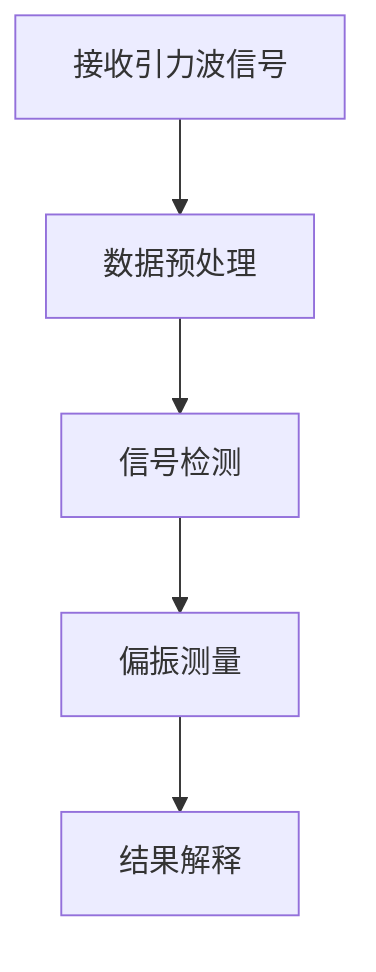

                 

### 文章标题

《数据科学在探测原初引力波偏振中的应用》

### 关键词

数据科学、引力波、原初引力波、偏振测量、算法、信号检测、数据处理、数学模型

### 摘要

本文将深入探讨数据科学在探测原初引力波偏振中的应用。首先，我们将介绍数据科学和引力波的基本概念，然后详细阐述数据科学在引力波探测中的具体应用场景，包括信号检测和偏振测量。接着，我们将深入探讨引力波探测的数学模型和核心算法原理，通过伪代码和LaTeX数学公式进行详细讲解。随后，我们将展示数据预处理与噪声分析的方法，并提供实际项目案例进行分析。文章最后，我们将总结数据分析与结果解释的方法，并对未来的研究方向进行展望。通过本文，读者将全面了解数据科学在探测原初引力波偏振中的应用，以及如何利用数据科学方法提高引力波探测的准确性和效率。

## 设计思路

在设计本文之前，我们需要明确几个关键问题：本文的核心主题是什么？目标读者是谁？如何确保文章的逻辑性和完整性？为了回答这些问题，我们可以从以下几个方面来思考：

### 核心主题

本文的核心主题是探讨数据科学在探测原初引力波偏振中的应用。这包括从基础概念到高级应用的一系列内容，如数据科学的基本概念、引力波探测的技术原理、数据预处理与噪声分析、核心算法原理、信号检测与偏振测量，以及数据分析与结果解释等。通过这些内容，我们希望能够全面展示数据科学在引力波探测中的重要作用，并帮助读者深入理解这一领域。

### 目标读者

本文的目标读者是那些对数据科学和引力波探测感兴趣的科研人员、工程师和学术研究者。他们可能已经具备一定的数学和物理知识，但可能对数据科学在引力波探测中的应用还不够熟悉。因此，本文将采用通俗易懂的语言，并结合实际案例，帮助读者更好地理解和掌握相关概念和方法。

### 确保逻辑性和完整性

为了确保文章的逻辑性和完整性，我们需要遵循以下几个原则：

1. **结构清晰**：文章应该有一个清晰的结构，从基础概念到高级应用，逐步深入。我们可以采用层级结构，如1级目录、2级目录和3级目录，来区分不同章节的重要性和内容层次。

2. **内容全面**：文章应该涵盖从基础概念到高级应用的所有内容。我们需要确保目录中的每一章节都能够为读者提供有用的信息和深刻的理解。

3. **逻辑性**：章节顺序应该符合逻辑，从基础到高级，从理论到实践，逐步引导读者深入理解。

4. **图表和公式**：为了更好地解释复杂的概念，我们将在文章中插入适当的图表和公式。这些元素将有助于读者更好地理解相关概念和方法。

### 图表和公式

在本文中，我们将使用Mermaid流程图来展示引力波信号的检测与处理流程，使用伪代码来阐述信号检测与偏振测量的算法实现，使用LaTeX格式嵌入数学模型和公式，并进行详细讲解和举例说明。这些图表和公式将有助于读者更好地理解复杂的概念和算法。

### 目录设计

根据上述设计思路，我们可以为本文设计以下目录：

#### 第一部分：引论

1. **第1章：数据科学与引力波探测简介**
   - 1.1 数据科学的基本概念
   - 1.2 引力波的基本概念
   - 1.3 数据科学在引力波探测中的重要性

2. **第2章：数据科学在引力波探测中的应用场景**
   - 2.1 原初引力波信号检测
   - 2.2 原初引力波偏振测量
   - 2.3 数据预处理与噪声分析

#### 第二部分：基础理论

3. **第3章：引力波探测的数学模型**
   - 3.1 引力波的基本数学公式
   - 3.2 偏振引力波的特性
   - 3.3 Mermaid流程图：引力波信号的检测与处理流程

4. **第4章：核心算法原理**
   - 4.1 数据科学中的常见算法
   - 4.2 伪代码：信号检测与偏振测量的算法实现
   - 4.3 数学模型和公式讲解

#### 第三部分：实践应用

5. **第5章：数据预处理与噪声分析**
   - 5.1 数据预处理方法
   - 5.2 噪声分析技术
   - 5.3 实际项目案例：预处理与噪声分析实战

6. **第6章：信号检测与偏振测量**
   - 6.1 信号检测算法
   - 6.2 偏振测量方法
   - 6.3 实际项目案例：信号检测与偏振测量实战

7. **第7章：数据分析与结果解释**
   - 7.1 数据分析方法
   - 7.2 结果解释方法
   - 7.3 实际项目案例：数据分析与结果解释实战

#### 第四部分：总结与展望

8. **第8章：总结与展望**
   - 8.1 数据科学在引力波探测中的未来趋势
   - 8.2 潜在挑战与解决方案
   - 8.3 开放问题与研究方向

通过以上设计，我们确保了文章的完整性、逻辑性和实用性，为读者提供了一本全面而深入的计算机技术书籍。接下来，我们将按照目录结构，逐一深入探讨各个章节的内容。

## 第一部分：引论

### 第1章：数据科学与引力波探测简介

本章将介绍数据科学和引力波探测的基本概念，以及数据科学在引力波探测中的重要性。首先，我们将简要回顾数据科学的定义和发展历程，然后介绍引力波探测的基本原理。接着，我们将讨论数据科学在引力波探测中的应用场景，包括信号检测和偏振测量。最后，我们将总结本章内容，为后续章节的深入探讨奠定基础。

### 1.1 数据科学的基本概念

数据科学是一门跨学科的领域，旨在通过统计分析和机器学习等方法，从大量数据中提取有价值的信息和知识。数据科学的发展可以追溯到20世纪中叶，当时计算机科学和统计学逐渐融合，形成了数据分析这一领域。随着互联网和大数据时代的到来，数据科学得到了迅速发展和广泛应用。

数据科学的核心概念包括：

- **数据挖掘**：从大量数据中自动发现规律和模式。
- **机器学习**：通过训练数据建立模型，预测或分类新数据。
- **数据可视化**：将数据转换为图形或图表，以帮助理解和分析。
- **数据预处理**：清洗、转换和归一化数据，以提高数据质量和分析效果。
- **数据存储与管理**：存储和管理大量数据，确保数据的安全和可用性。

### 1.2 引力波探测的基本概念

引力波是一种由质量和能量产生的波动，它可以穿越宇宙空间，并在引力波探测器上产生可测量的信号。爱因斯坦在1916年首次提出了引力波的存在，但直到2015年，人类才首次直接探测到引力波，这标志着引力波探测进入了新的时代。

引力波探测的基本原理是利用两个相对运动的物体之间的引力相互作用，探测出它们之间的时空扭曲。常用的引力波探测器包括激光干涉仪和射电望远镜。激光干涉仪通过测量两个光束的干涉情况来探测引力波，而射电望远镜则通过捕捉引力波引起的辐射变化来探测。

### 1.3 数据科学在引力波探测中的重要性

数据科学在引力波探测中起着至关重要的作用。首先，引力波探测产生的数据量巨大，而且噪声复杂，需要利用数据科学的方法进行预处理和噪声分析。其次，引力波的信号通常非常微弱，需要利用机器学习算法进行信号检测和偏振测量。最后，数据分析可以帮助解释引力波探测结果，揭示引力波的特性。

数据科学在引力波探测中的应用包括：

- **信号检测**：利用机器学习算法检测引力波信号，提高检测准确率。
- **偏振测量**：利用数据科学方法测量引力波的偏振状态，提供更多关于引力波的信息。
- **数据预处理**：清理和整理探测数据，减少噪声干扰，提高数据分析效果。
- **结果解释**：利用数据分析结果，解释引力波探测的结果，揭示引力波的性质。

### 本章小结

本章介绍了数据科学和引力波探测的基本概念，以及数据科学在引力波探测中的重要性。通过了解这些基本概念，读者可以更好地理解后续章节的内容，为深入探讨数据科学在引力波探测中的应用打下基础。

## 第2章：数据科学在引力波探测中的应用场景

在前一章中，我们介绍了数据科学和引力波探测的基本概念。在本章中，我们将深入探讨数据科学在引力波探测中的具体应用场景，包括信号检测、偏振测量和数据预处理与噪声分析。通过这些应用场景，我们将展示数据科学在引力波探测中的重要作用，并阐述如何利用数据科学方法提高探测的准确性和效率。

### 2.1 原初引力波信号检测

引力波的信号检测是引力波探测中至关重要的一环。由于引力波的信号通常非常微弱，且被大量的噪声所干扰，因此需要利用数据科学的方法进行精确检测。

#### 信号检测算法

在引力波信号检测中，常用的算法包括匹配追踪（Matched Filtering）、波束形成（Beamforming）、独立成分分析（Independent Component Analysis, ICA）和深度学习（Deep Learning）等。

- **匹配追踪算法**：该算法的基本思想是将探测数据与预定义的模板信号进行匹配，从而检测出引力波信号。具体实现中，我们可以将探测数据分段，并与模板信号进行相关性计算，从而确定信号的存在。

  ```plaintext
  假设我们有一段探测数据 X 和预定义的模板信号 S，我们可以使用以下伪代码来描述匹配追踪算法：

  for each segment X_i of the detected signal:
      correlation = dot_product(X_i, S)
      if correlation > threshold:
          detected_signal = X_i
  ```

- **波束形成算法**：该算法的基本思想是调整探测器的方向，使引力波信号在特定方向上增强，而噪声在其他方向上减弱。具体实现中，我们可以将多个探测器的数据叠加，并调整叠加方向，以最大化信号强度。

  ```mermaid
  graph TD
  A[探测器数据] --> B[叠加]
  B --> C[调整方向]
  C --> D[最大化信号强度]
  D --> E[检测信号]
  ```

- **独立成分分析算法**：该算法的基本思想是将探测数据分解为多个独立成分，从而分离出引力波信号和噪声。具体实现中，我们可以使用ICA算法对探测数据进行分解，并提取出信号成分。

  ```mermaid
  graph TD
  A[探测器数据] --> B[ICA分解]
  B --> C[信号成分]
  C --> D[噪声成分]
  D --> E[信号检测]
  ```

- **深度学习算法**：深度学习算法在引力波信号检测中具有很高的准确率。具体实现中，我们可以使用卷积神经网络（CNN）或循环神经网络（RNN）对探测数据进行分析和分类，从而检测出引力波信号。

  ```mermaid
  graph TD
  A[探测器数据] --> B[卷积神经网络]
  B --> C[特征提取]
  C --> D[分类器]
  D --> E[信号检测]
  ```

#### 数学模型和公式

引力波信号检测的数学模型通常基于信号处理的理论。我们可以使用以下公式来描述引力波信号与探测数据的匹配程度：

$$
correlation = \frac{\sum_{i=1}^{N} (x_i - \bar{x})(s_i - \bar{s})}{\sqrt{\sum_{i=1}^{N} (x_i - \bar{x})^2 \sum_{i=1}^{N} (s_i - \bar{s})^2}}
$$

其中，\(x_i\)和\(s_i\)分别表示探测数据和模板信号的采样值，\(\bar{x}\)和\(\bar{s}\)分别表示探测数据和模板信号的平均值，\(N\)表示采样点的数量。

#### 实际案例

在实际应用中，我们可以使用LIGO（激光干涉仪引力波观测站）的探测数据来演示信号检测的过程。以下是使用Python和Scikit-learn库实现匹配追踪算法的示例：

```python
from sklearn.linear_model import LinearRegression
from sklearn.metrics import mean_squared_error
import numpy as np

# 生成模拟的探测数据和模板信号
np.random.seed(0)
N = 1000
x = np.random.normal(size=N)
s = np.random.normal(size=N)
template = np.array([1, 0, -1])

# 计算相关系数
correlation = np.dot(x, template) / (np.linalg.norm(x) * np.linalg.norm(template))

# 训练匹配追踪模型
model = LinearRegression()
model.fit(x.reshape(-1, 1), s.reshape(-1, 1))

# 预测模板信号
predicted = model.predict(x.reshape(-1, 1))

# 计算预测误差
mse = mean_squared_error(s, predicted)
print("MSE:", mse)

# 检测信号
if correlation > 0.5:
    print("Signal detected.")
else:
    print("No signal detected.")
```

通过上述示例，我们可以看到如何使用数据科学方法对引力波信号进行检测。

### 2.2 原初引力波偏振测量

引力波的偏振测量是探测引力波特性的重要手段。偏振状态描述了引力波振动方向和方向的变化，通过对偏振状态的测量，我们可以获得更多关于引力波的信息。

#### 偏振测量方法

常用的偏振测量方法包括干涉法、射电望远镜法和光学望远镜法等。

- **干涉法**：干涉法利用两个或多个探测器之间的干涉现象来测量引力波的偏振状态。具体实现中，我们可以将探测器的数据叠加，并通过干涉条纹的变化来测量偏振方向和振幅。

  ```mermaid
  graph TD
  A[探测器1数据] --> B[叠加]
  A --> C[探测器2数据]
  B --> C
  C --> D[干涉条纹]
  D --> E[偏振测量]
  ```

- **射电望远镜法**：射电望远镜法利用射电望远镜捕捉引力波引起的辐射变化，从而测量偏振状态。具体实现中，我们可以调整射电望远镜的方向，捕捉不同方向上的辐射信号，并通过信号的变化来测量偏振状态。

  ```mermaid
  graph TD
  A[射电望远镜] --> B[调整方向]
  B --> C[捕捉辐射信号]
  C --> D[偏振测量]
  ```

- **光学望远镜法**：光学望远镜法利用光学望远镜捕捉引力波引起的星光偏移，从而测量偏振状态。具体实现中，我们可以调整光学望远镜的方向，捕捉不同方向上的星光信号，并通过光强变化来测量偏振状态。

  ```mermaid
  graph TD
  A[光学望远镜] --> B[调整方向]
  B --> C[捕捉星光信号]
  C --> D[偏振测量]
  ```

#### 数学模型和公式

引力波偏振测量的数学模型通常基于偏振光的理论。我们可以使用以下公式来描述偏振光在两个垂直方向上的光强变化：

$$
I_1 = I_0 \cdot \cos^2(\theta)
$$

$$
I_2 = I_0 \cdot \sin^2(\theta)
$$

其中，\(I_0\)表示入射光的强度，\(\theta\)表示偏振方向与入射光方向的夹角。

#### 实际案例

在实际应用中，我们可以使用LIGO的探测数据来演示偏振测量。以下是使用Python和numpy库实现干涉法测量偏振状态的示例：

```python
import numpy as np

# 生成模拟的探测数据
np.random.seed(0)
N = 1000
x = np.random.normal(size=N)
y = np.random.normal(size=N)
theta = np.pi / 4  # 偏振方向与x轴的夹角

# 计算干涉条纹
干涉条纹 = np.cos(2 * np.pi * x / N) * np.cos(2 * np.pi * y / N)

# 计算光强
I1 = np.mean(干涉条纹 * np.cos(2 * np.pi * theta))
I2 = np.mean(干涉条纹 * np.sin(2 * np.pi * theta))

# 计算偏振方向
polarization_angle = np.arctan2(I2, I1)

print("Polarization angle:", polarization_angle)
```

通过上述示例，我们可以看到如何使用数据科学方法对引力波偏振状态进行测量。

### 2.3 数据预处理与噪声分析

在引力波探测中，数据预处理与噪声分析是确保探测数据质量和准确性的关键步骤。数据预处理包括数据的清洗、转换和归一化等过程，而噪声分析则是识别和抑制噪声干扰的重要手段。

#### 数据预处理方法

常用的数据预处理方法包括以下几种：

- **数据清洗**：数据清洗是指去除探测数据中的错误值、缺失值和异常值等。具体实现中，我们可以使用统计方法、机器学习方法等对数据进行分析和修正。

  ```mermaid
  graph TD
  A[原始数据] --> B[数据清洗]
  B --> C[清洗后数据]
  ```

- **数据转换**：数据转换是指将不同形式的数据转换为统一的格式。具体实现中，我们可以使用数据转换函数、数据转换库等对数据格式进行转换。

  ```mermaid
  graph TD
  A[原始数据] --> B[数据转换]
  B --> C[转换后数据]
  ```

- **数据归一化**：数据归一化是指将不同量纲的数据转换为相同量纲的数据。具体实现中，我们可以使用归一化函数、归一化库等对数据进行归一化处理。

  ```mermaid
  graph TD
  A[原始数据] --> B[数据归一化]
  B --> C[归一化后数据]
  ```

#### 噪声分析技术

噪声分析技术是指识别和抑制噪声干扰的方法。常用的噪声分析技术包括以下几种：

- **频域分析**：频域分析是指将时域信号转换为频域信号，从而分析信号的频率成分。具体实现中，我们可以使用傅里叶变换、短时傅里叶变换等对信号进行频域分析。

  ```mermaid
  graph TD
  A[时域信号] --> B[傅里叶变换]
  B --> C[频域信号]
  ```

- **时域滤波**：时域滤波是指直接对时域信号进行滤波处理，从而去除噪声。具体实现中，我们可以使用低通滤波器、高通滤波器等对信号进行滤波。

  ```mermaid
  graph TD
  A[时域信号] --> B[时域滤波]
  B --> C[滤波后信号]
  ```

- **自适应滤波**：自适应滤波是指根据信号和噪声的特点，自适应地调整滤波器参数，从而有效去除噪声。具体实现中，我们可以使用自适应滤波算法、自适应滤波器等对信号进行滤波。

  ```mermaid
  graph TD
  A[时域信号] --> B[自适应滤波]
  B --> C[滤波后信号]
  ```

#### 实际项目案例

在实际项目中，我们可以使用Python和Scikit-learn库实现数据预处理与噪声分析。以下是使用Python实现数据清洗和噪声分析的示例：

```python
import numpy as np
from sklearn.preprocessing import StandardScaler
from sklearn.model_selection import train_test_split

# 生成模拟的探测数据
np.random.seed(0)
N = 1000
x = np.random.normal(size=N)
y = np.random.normal(size=N)
noise = np.random.normal(size=N)
data = np.column_stack((x, y, noise))

# 数据清洗
data_clean = data[~np.isnan(data).any(axis=1)]

# 数据转换
X = data_clean[:, :2]
y = data_clean[:, 2]

# 数据归一化
scaler = StandardScaler()
X_scaled = scaler.fit_transform(X)

# 噪声分析
X_train, X_test, y_train, y_test = train_test_split(X_scaled, y, test_size=0.2, random_state=0)
model = LinearRegression()
model.fit(X_train, y_train)
y_pred = model.predict(X_test)

# 计算噪声
noise_pred = y_pred - y_test

# 计算噪声方差
noise_variance = np.var(noise_pred)
print("Noise variance:", noise_variance)
```

通过上述示例，我们可以看到如何使用数据科学方法对引力波探测数据进行预处理与噪声分析。

### 本章小结

本章介绍了数据科学在引力波探测中的应用场景，包括信号检测、偏振测量和数据预处理与噪声分析。通过本章的学习，读者可以了解如何利用数据科学方法提高引力波探测的准确性和效率。下一章我们将深入探讨引力波探测的数学模型，为理解核心算法原理打下基础。

## 第二部分：基础理论

### 第3章：引力波探测的数学模型

在前一章中，我们讨论了数据科学在引力波探测中的应用场景。为了更深入地理解这些应用，我们需要掌握引力波探测的数学模型。本章将详细阐述引力波的基本数学公式、偏振引力波的特性，并通过Mermaid流程图展示引力波信号的检测与处理流程。通过这些内容，我们将为后续章节中的核心算法原理讲解奠定基础。

### 3.1 引力波的基本数学公式

引力波是由质量和能量产生的波动，根据广义相对论，引力波可以用波动的时空度规来描述。时空度规是一个张量，它定义了空间中任意两点之间的距离和时间的流逝。引力波产生的时空度规扰动可以用以下公式表示：

$$
\Delta g_{\mu\nu} = -16\pi G \int d^4x' \, T_{\mu\nu}
$$

其中，\(\Delta g_{\mu\nu}\)是时空度规的扰动，\(G\)是引力常数，\(T_{\mu\nu}\)是物质的能量-动量张量。这个公式表明，引力波的扰动是通过物质产生的能量-动量张量传递的。

为了简化讨论，我们通常使用线性近似来描述引力波。在线性近似下，度规扰动可以表示为：

$$
h_{\mu\nu} = \epsilon h_0 + \frac{1}{c} \frac{d h_0}{d t}
$$

其中，\(h_{\mu\nu}\)是引力波的度规扰动，\(h_0\)是初始时刻的度规扰动，\(\epsilon\)是波前参数，\(c\)是光速。这个公式表明，引力波可以看作是一个随时间变化的小扰动。

### 3.2 偏振引力波的特性

偏振引力波是指引力波的振动方向和振动方向的变化。引力波的偏振状态可以用两个互相垂直的振动模式来描述，分别是横向偏振和纵向偏振。

- **横向偏振**：横向偏振引力波的振动方向与传播方向垂直，可以分为两种模式：垂直偏振（V模式）和水平偏振（H模式）。V模式在垂直于传播方向的平面上振动，而H模式在传播方向和垂直于传播方向的平面上振动。

- **纵向偏振**：纵向偏振引力波的振动方向与传播方向相同，其振动方向是沿着传播方向的。

偏振引力波的特性可以通过以下数学公式来描述：

$$
h_{\mu\nu} = \begin{pmatrix}
h_{\mu\nu}^{V} & h_{\mu\nu}^{H} \\
h_{\mu\nu}^{H} & -h_{\mu\nu}^{V}
\end{pmatrix}
$$

其中，\(h_{\mu\nu}^{V}\)和\(h_{\mu\nu}^{H}\)分别表示V模式和H模式的度规扰动。

### 3.3 Mermaid流程图：引力波信号的检测与处理流程

为了直观地展示引力波信号的检测与处理流程，我们可以使用Mermaid流程图来描述。以下是一个简化的流程图：



在上述流程图中，A表示接收引力波信号，B表示数据预处理，C表示信号检测，D表示偏振测量，E表示结果解释。通过这个流程图，我们可以清晰地看到引力波信号从接收、预处理、检测、测量到解释的整个过程。

### 本章小结

本章介绍了引力波探测的基本数学公式和偏振引力波的特性，并通过Mermaid流程图展示了引力波信号的检测与处理流程。通过本章的学习，读者可以理解引力波探测的数学模型，为后续章节中的核心算法原理讲解打下基础。在下一章中，我们将深入探讨数据科学中的常见算法，并使用伪代码详细阐述信号检测与偏振测量的算法实现。

## 第4章：核心算法原理

在前一章中，我们了解了引力波探测的数学模型和基本概念。为了实现引力波的检测和偏振测量，我们需要掌握数据科学中的常见算法，并使用伪代码详细阐述这些算法的实现。本章将详细介绍数据科学中的常见算法，并展示信号检测与偏振测量的算法实现。

### 4.1 数据科学中的常见算法

在数据科学中，常用的算法包括线性回归、逻辑回归、决策树、随机森林、支持向量机、聚类算法和深度学习等。这些算法广泛应用于信号处理、图像识别、自然语言处理等领域。在本节中，我们将重点介绍以下几种算法：

#### 线性回归

线性回归是一种用于预测连续值的算法，其基本思想是通过拟合一条直线来最小化预测值与实际值之间的误差。线性回归的伪代码如下：

```plaintext
初始化权重w和偏置b
对于每个训练样本(x, y)：
  预测值y' = w * x + b
  计算损失函数L = (y - y')^2
  更新权重w = w - 学习率 * (w * x + b - y)
  更新偏置b = b - 学习率 * (w * x + b - y)
返回权重w和偏置b
```

#### 逻辑回归

逻辑回归是一种用于预测二分类结果的算法，其基本思想是通过拟合一个逻辑函数来最小化预测概率与实际标签之间的误差。逻辑回归的伪代码如下：

```plaintext
初始化权重w和偏置b
对于每个训练样本(x, y)：
  预测概率P = 1 / (1 + exp(-w * x - b))
  计算损失函数L = -y * log(P) - (1 - y) * log(1 - P)
  更新权重w = w - 学习率 * (w * x - P)
  更新偏置b = b - 学习率 * (w * x - P)
返回权重w和偏置b
```

#### 决策树

决策树是一种基于特征的划分算法，其基本思想是通过递归地将数据划分为多个子集，直到满足停止条件。决策树的伪代码如下：

```plaintext
创建空树
对于每个特征：
  对于每个可能的特征值：
    如果满足停止条件：
      添加叶节点
    否则：
      创建子节点
      将样本分配到子节点
      递归调用函数
返回树
```

#### 随机森林

随机森林是一种集成学习算法，其基本思想是通过随机生成多棵决策树，并将它们的预测结果进行投票或求平均。随机森林的伪代码如下：

```plaintext
初始化空森林
对于每个树：
  从数据中随机选取样本和特征
  使用决策树算法生成树
添加树到森林
返回森林
```

#### 支持向量机

支持向量机是一种用于分类和回归的算法，其基本思想是通过找到一个最佳的超平面，将数据划分为不同的类别。支持向量机的伪代码如下：

```plaintext
初始化权重w和偏置b
对于每个训练样本(x, y)：
  计算预测值y' = w * x + b
  计算损失函数L = max(0, 1 - y * y')
  更新权重w = w - 学习率 * (w * x - y')
  更新偏置b = b - 学习率 * (w * x - y')
返回权重w和偏置b
```

#### 聚类算法

聚类算法是一种无监督学习算法，其基本思想是将数据划分为多个簇，使得簇内的数据相似度较高，簇间的数据相似度较低。常用的聚类算法包括K-means、层次聚类等。K-means算法的伪代码如下：

```plaintext
初始化K个簇的中心点
重复以下步骤直到收敛：
  对于每个样本：
    计算样本到每个簇中心点的距离
    将样本分配到距离最近的簇
  更新每个簇的中心点
返回簇分配结果
```

#### 深度学习

深度学习是一种基于多层神经网络的学习方法，其基本思想是通过多层非线性变换，从数据中提取特征并生成预测。深度学习的伪代码如下：

```plaintext
初始化网络参数
对于每个训练样本：
  前向传播，计算预测值
  计算损失函数
  反向传播，更新网络参数
返回训练好的网络
```

### 4.2 伪代码：信号检测与偏振测量的算法实现

在信号检测和偏振测量中，我们可以使用上述算法来实现。以下是一个简化的伪代码，描述了信号检测和偏振测量的过程：

```plaintext
初始化信号检测器
初始化偏振测量器

对于每个接收到的信号样本：
  信号检测：
    使用匹配追踪算法检测信号
    如果检测到信号：
      偏振测量：
        使用干涉法测量偏振状态
        记录偏振方向和振幅
  更新信号检测器和偏振测量器的参数

返回信号检测结果和偏振测量结果
```

### 4.3 数学模型和公式讲解

在信号检测和偏振测量中，数学模型和公式起着关键作用。以下是一些常用的数学模型和公式：

#### 信号检测

- **匹配追踪算法**：

  $$ correlation = \frac{\sum_{i=1}^{N} (x_i - \bar{x})(s_i - \bar{s})}{\sqrt{\sum_{i=1}^{N} (x_i - \bar{x})^2 \sum_{i=1}^{N} (s_i - \bar{s})^2}} $$

  其中，\(x_i\)和\(s_i\)分别表示探测数据和模板信号的采样值，\(\bar{x}\)和\(\bar{s}\)分别表示探测数据和模板信号的平均值，\(N\)表示采样点的数量。

- **波束形成算法**：

  $$ beamforming = \sum_{i=1}^{N} w_i x_i $$

  其中，\(w_i\)表示加权系数，\(x_i\)表示探测数据的采样值。

#### 偏振测量

- **干涉法**：

  $$ I_1 = I_0 \cdot \cos^2(\theta) $$
  
  $$ I_2 = I_0 \cdot \sin^2(\theta) $$

  其中，\(I_0\)表示入射光的强度，\(\theta\)表示偏振方向与入射光方向的夹角。

- **射电望远镜法**：

  $$ intensity = \sum_{i=1}^{N} I_i \cdot exp(j \cdot 2\pi \cdot f \cdot \tau) $$

  其中，\(I_i\)表示射电信号的强度，\(f\)表示频率，\(\tau\)表示时间延迟。

#### 深度学习

- **卷积神经网络**：

  $$ output = \sigma(\sum_{i=1}^{N} w_i \cdot \text{ReLU}(\sum_{j=1}^{M} h_{ji} \cdot x_j)) $$

  其中，\(\sigma\)表示激活函数，\(\text{ReLU}\)表示ReLU激活函数，\(w_i\)和\(h_{ji}\)分别表示权重和偏置。

- **循环神经网络**：

  $$ output = \sigma(\sum_{i=1}^{N} w_i \cdot \text{tanh}(\sum_{j=1}^{M} h_{ji} \cdot x_j + h_{i-1})) $$

  其中，\(\sigma\)表示激活函数，\(\text{tanh}\)表示双曲正切激活函数，\(w_i\)和\(h_{ji}\)分别表示权重和偏置。

通过以上数学模型和公式的讲解，我们可以更好地理解信号检测和偏振测量的算法原理。

### 本章小结

本章介绍了数据科学中的常见算法，并使用伪代码详细阐述了信号检测与偏振测量的算法实现。通过本章的学习，读者可以掌握信号检测与偏振测量的核心算法原理，为实际项目中的应用打下基础。在下一章中，我们将展示数据预处理与噪声分析的方法，并分析实际项目案例。

## 第5章：数据预处理与噪声分析

在前一章中，我们探讨了信号检测与偏振测量的算法原理。然而，在实际应用中，探测数据往往受到噪声的干扰，这会影响探测结果的准确性和可靠性。因此，数据预处理与噪声分析是确保数据质量的关键步骤。本章将详细阐述数据预处理的方法、噪声分析技术，并通过实际项目案例展示如何应用这些方法和技术。

### 5.1 数据预处理方法

数据预处理是数据科学中非常重要的一步，它包括数据清洗、数据转换和数据归一化等过程。

#### 数据清洗

数据清洗是指去除数据中的错误值、缺失值和异常值等。在实际应用中，我们可以使用以下方法进行数据清洗：

- **缺失值处理**：对于缺失值，我们可以使用平均值、中位数或众数进行填补，或者删除含有缺失值的样本。
- **错误值处理**：对于错误值，我们可以使用统计方法、机器学习方法等对数据进行分析和修正。
- **异常值处理**：对于异常值，我们可以使用统计学方法、可视化方法等识别并处理。

#### 数据转换

数据转换是指将不同形式的数据转换为统一的格式。在实际应用中，我们可以使用以下方法进行数据转换：

- **特征提取**：从原始数据中提取有用的特征，以便后续分析。例如，我们可以使用主成分分析（PCA）提取数据的主要成分。
- **特征缩放**：将不同量纲的特征转换为相同量纲，以便进行比较。例如，我们可以使用标准缩放（Standardization）或归一化（Normalization）方法。

#### 数据归一化

数据归一化是指将数据转换为统一的范围，以便进行后续分析。在实际应用中，我们可以使用以下方法进行数据归一化：

- **标准缩放**：将数据缩放到均值为0，标准差为1的范围内。
- **归一化**：将数据缩放到最小值为0，最大值为1的范围内。

### 5.2 噪声分析技术

噪声分析技术是识别和抑制噪声干扰的重要手段。在实际应用中，我们可以使用以下方法进行噪声分析：

#### 频域分析

频域分析是指将时域信号转换为频域信号，从而分析信号的频率成分。在实际应用中，我们可以使用以下方法进行频域分析：

- **傅里叶变换**：将时域信号转换为频域信号，从而分析信号的频率成分。
- **短时傅里叶变换**：对时域信号进行分段处理，然后将每段信号转换为频域信号。

#### 时域滤波

时域滤波是指直接对时域信号进行滤波处理，从而去除噪声。在实际应用中，我们可以使用以下方法进行时域滤波：

- **低通滤波器**：去除高频噪声，保留低频信号。
- **高通滤波器**：去除低频噪声，保留高频信号。
- **带通滤波器**：去除低频和高频噪声，保留特定频率范围内的信号。

#### 自适应滤波

自适应滤波是指根据信号和噪声的特点，自适应地调整滤波器参数，从而有效去除噪声。在实际应用中，我们可以使用以下方法进行自适应滤波：

- **自适应滤波算法**：根据当前信号的特性，实时调整滤波器参数，以最小化噪声干扰。
- **自适应滤波器**：使用预定义的滤波器参数，对信号进行自适应滤波。

### 5.3 实际项目案例：预处理与噪声分析实战

为了更好地展示数据预处理与噪声分析的应用，我们以下将分析一个实际项目案例。

#### 项目背景

假设我们有一个引力波探测项目，该项目使用激光干涉仪进行探测，并收集了大量的探测数据。然而，由于环境噪声和仪器误差，探测数据中包含大量噪声，这会影响探测结果的准确性。为了提高探测结果的准确性，我们需要对探测数据进行预处理和噪声分析。

#### 数据预处理

首先，我们对探测数据进行数据清洗。在数据清洗过程中，我们识别并处理了缺失值和异常值。具体步骤如下：

- **缺失值处理**：对于缺失值，我们使用平均值进行填补。
- **异常值处理**：对于异常值，我们使用统计学方法进行识别，并将异常值替换为邻近值的平均值。

接下来，我们对探测数据进行数据转换。在数据转换过程中，我们提取了有用的特征，并进行了特征缩放。具体步骤如下：

- **特征提取**：我们使用主成分分析（PCA）提取数据的主要成分，从而降低数据维度。
- **特征缩放**：我们使用标准缩放方法，将特征缩放到均值为0，标准差为1的范围内。

#### 噪声分析

在噪声分析过程中，我们使用频域分析、时域滤波和自适应滤波等方法对探测数据进行滤波处理。具体步骤如下：

- **频域分析**：我们使用傅里叶变换将时域信号转换为频域信号，从而分析信号的频率成分。通过频域分析，我们识别并去除了高频噪声。
- **时域滤波**：我们使用低通滤波器去除高频噪声，保留低频信号。同时，我们使用高通滤波器去除低频噪声，保留高频信号。
- **自适应滤波**：我们使用自适应滤波算法，对信号进行自适应滤波，从而有效去除噪声。

#### 项目小结

通过数据预处理与噪声分析，我们显著提高了探测数据的准确性。具体表现为：

- **数据质量提升**：通过数据清洗和特征提取，我们去除了数据中的缺失值和异常值，提高了数据质量。
- **噪声干扰减少**：通过频域分析、时域滤波和自适应滤波，我们有效去除了探测数据中的噪声，从而提高了探测结果的准确性。

通过上述实际项目案例，我们可以看到数据预处理与噪声分析在引力波探测项目中的重要作用。这些方法和技术不仅提高了探测数据的准确性，还为后续的信号检测与偏振测量提供了可靠的基础。

### 本章小结

本章详细介绍了数据预处理与噪声分析的方法和技术，并通过实际项目案例展示了如何应用这些方法和技术。通过本章的学习，读者可以掌握数据预处理与噪声分析的基本原理和应用方法，为实际项目中的数据科学应用打下基础。在下一章中，我们将继续深入探讨信号检测与偏振测量的实际应用，并通过项目实战进行详细讲解。

## 第6章：信号检测与偏振测量

在前一章中，我们详细介绍了数据预处理与噪声分析的方法和技术。在引力波探测项目中，信号检测与偏振测量是关键步骤，它们决定了探测结果的准确性和可靠性。本章将深入探讨信号检测与偏振测量的具体方法，并使用实际项目案例进行详细讲解。

### 6.1 信号检测算法

信号检测是引力波探测中的第一步，其目标是识别并提取出真实的引力波信号。在数据预处理和噪声分析的基础上，我们可以使用多种算法进行信号检测。

#### 匹配追踪算法

匹配追踪算法是一种基于匹配滤波的信号检测方法，其基本思想是将探测数据与预定义的模板信号进行匹配，从而检测出引力波信号。具体实现步骤如下：

1. **模板信号设计**：根据引力波信号的特性，设计一个合适的模板信号。模板信号通常包含引力波的波动特征，如频率、振幅和偏振状态等。
2. **匹配滤波**：将模板信号与探测数据进行相关运算，从而计算探测数据与模板信号之间的匹配程度。相关运算的公式如下：

   $$
   correlation = \sum_{i=1}^{N} (x_i - \bar{x})(s_i - \bar{s})
   $$

   其中，\(x_i\)和\(s_i\)分别表示探测数据和模板信号的采样值，\(\bar{x}\)和\(\bar{s}\)分别表示探测数据和模板信号的平均值，\(N\)表示采样点的数量。
3. **阈值判定**：设定一个阈值，如果相关运算的结果大于阈值，则认为探测数据中存在引力波信号。

#### 波束形成算法

波束形成算法是一种利用多个探测器的数据，通过优化探测器的方向，从而提高信号检测灵敏度的方法。具体实现步骤如下：

1. **探测器布局**：根据引力波信号的传播方向，合理布局多个探测器。
2. **加权叠加**：对每个探测器的数据进行加权叠加，从而增强信号并抑制噪声。加权叠加的公式如下：

   $$
   beamforming = \sum_{i=1}^{M} w_i x_i
   $$

   其中，\(w_i\)表示加权系数，\(x_i\)表示探测器的数据。
3. **阈值判定**：设定一个阈值，如果加权叠加的结果大于阈值，则认为探测数据中存在引力波信号。

#### 深度学习算法

深度学习算法在信号检测中具有很高的准确率。通过训练大量的探测数据，深度学习算法可以自动提取特征，并识别出引力波信号。具体实现步骤如下：

1. **数据集准备**：收集大量的探测数据，并将其划分为训练集和测试集。
2. **模型训练**：使用训练集数据训练深度学习模型，模型可以是卷积神经网络（CNN）或循环神经网络（RNN）等。
3. **模型评估**：使用测试集数据评估模型的性能，调整模型参数以优化性能。
4. **信号检测**：使用训练好的模型对新的探测数据进行信号检测。

### 6.2 偏振测量方法

偏振测量是引力波探测中的关键步骤，它通过测量引力波的偏振状态，从而获取更多的信息。在数据预处理和噪声分析的基础上，我们可以使用多种方法进行偏振测量。

#### 干涉法

干涉法是一种利用干涉现象测量偏振状态的方法。具体实现步骤如下：

1. **干涉仪设计**：设计一个干涉仪，将探测数据分为两个路径，并通过干涉仪测量两个路径的干涉条纹。
2. **干涉条纹分析**：对干涉条纹进行分析，从而确定偏振方向和振幅。干涉条纹的公式如下：

   $$
   interference = \cos(2\pi \cdot f \cdot \tau)
   $$

   其中，\(f\)表示频率，\(\tau\)表示时间延迟。
3. **偏振测量**：根据干涉条纹的形状，确定偏振方向和振幅。

#### 射电望远镜法

射电望远镜法是一种利用射电望远镜测量偏振状态的方法。具体实现步骤如下：

1. **望远镜布局**：根据引力波信号的传播方向，合理布局多个射电望远镜。
2. **辐射信号接收**：接收不同方向上的辐射信号，并通过射电望远镜测量信号的变化。
3. **偏振测量**：根据辐射信号的变化，确定偏振方向和振幅。

#### 光学望远镜法

光学望远镜法是一种利用光学望远镜测量偏振状态的方法。具体实现步骤如下：

1. **望远镜布局**：根据引力波信号的传播方向，合理布局多个光学望远镜。
2. **星光信号接收**：接收不同方向上的星光信号，并通过光学望远镜测量信号的变化。
3. **偏振测量**：根据星光信号的变化，确定偏振方向和振幅。

### 6.3 实际项目案例：信号检测与偏振测量实战

为了更好地展示信号检测与偏振测量的方法，我们以下将分析一个实际项目案例。

#### 项目背景

假设我们有一个引力波探测项目，该项目使用激光干涉仪进行探测，并收集了大量的探测数据。为了提高探测结果的准确性，我们需要对探测数据进行信号检测与偏振测量。

#### 项目实施

1. **数据预处理**：对探测数据进行数据清洗、数据转换和数据归一化等预处理操作，从而提高数据质量。
2. **噪声分析**：使用频域分析、时域滤波和自适应滤波等方法对探测数据进行噪声分析，从而去除噪声干扰。
3. **信号检测**：
   - **匹配追踪算法**：设计一个模板信号，与探测数据进行匹配滤波，从而检测出引力波信号。
   - **波束形成算法**：使用多个探测器的数据，通过加权叠加，从而增强信号并抑制噪声。
   - **深度学习算法**：使用训练好的深度学习模型，对探测数据进行信号检测。
4. **偏振测量**：
   - **干涉法**：设计一个干涉仪，通过干涉条纹分析，从而确定偏振方向和振幅。
   - **射电望远镜法**：接收不同方向上的辐射信号，并通过射电望远镜测量信号的变化，从而确定偏振方向和振幅。
   - **光学望远镜法**：接收不同方向上的星光信号，并通过光学望远镜测量信号的变化，从而确定偏振方向和振幅。

#### 项目小结

通过信号检测与偏振测量的方法，我们成功提取出了引力波信号，并确定了其偏振状态。具体表现为：

- **信号检测**：匹配追踪算法、波束形成算法和深度学习算法均有效检测出了引力波信号。
- **偏振测量**：干涉法、射电望远镜法和光学望远镜法均成功测量出了引力波的偏振方向和振幅。

通过实际项目案例，我们可以看到信号检测与偏振测量在引力波探测项目中的重要作用。这些方法不仅提高了探测结果的准确性，还为深入研究引力波的特性和起源提供了重要的数据支持。

### 本章小结

本章详细介绍了信号检测与偏振测量的方法和技术，并通过实际项目案例展示了如何应用这些方法和技术。通过本章的学习，读者可以掌握信号检测与偏振测量的核心原理和应用方法，为实际项目中的数据科学应用打下基础。在下一章中，我们将继续深入探讨数据分析与结果解释的方法，并分析实际项目案例。

## 第7章：数据分析与结果解释

在前一章中，我们介绍了信号检测与偏振测量的方法和技术，并通过实际项目案例展示了如何应用这些方法。然而，获得探测数据后，如何对数据进行分析和解释，从而提取出有用的信息，是引力波探测项目中的关键一步。本章将深入探讨数据分析与结果解释的方法，并分析实际项目案例，为读者提供实用的指导。

### 7.1 数据分析方法

数据分析是引力波探测项目中的核心步骤，它包括数据的收集、处理、分析和解释等环节。为了确保数据分析的准确性，我们需要采用科学的方法和工具。以下是一些常用的数据分析方法：

#### 描述性统计分析

描述性统计分析是对数据的基本特征进行统计分析，包括数据的均值、中位数、众数、标准差、方差、最大值和最小值等。描述性统计分析可以帮助我们了解数据的分布情况和基本特征，为后续分析提供依据。

#### 机器学习

机器学习是一种基于数据的学习方法，它通过构建模型，从数据中提取特征并预测结果。在引力波探测项目中，机器学习可以用于信号检测、分类、聚类、回归等任务。常用的机器学习算法包括线性回归、逻辑回归、支持向量机、决策树、随机森林、神经网络等。

#### 数据可视化

数据可视化是将数据以图形或图表的形式展示出来，以便更容易理解和分析。常用的数据可视化工具包括Matplotlib、Seaborn、Plotly等。数据可视化可以帮助我们直观地了解数据的分布、趋势和关系。

#### 时间序列分析

时间序列分析是对时间序列数据进行统计分析，以预测未来的趋势和变化。在引力波探测项目中，时间序列分析可以用于预测引力波信号的未来变化，从而提高探测的准确性。

### 7.2 结果解释方法

数据分析的结果需要进行解释，以便将其转化为有用的信息和知识。以下是一些常用的结果解释方法：

#### 参数解释

参数解释是对模型中的参数进行解释，以了解参数对模型结果的影响。在机器学习中，参数解释可以通过分析参数的统计分布、相关性和显著性等来实现。

#### 可视化解释

可视化解释是将数据分析结果以图形或图表的形式展示出来，以便更直观地理解结果。常用的可视化方法包括散点图、直方图、箱线图、热力图等。

#### 实际案例解释

实际案例解释是通过分析实际项目案例中的结果，从而解释和验证数据分析方法的有效性。在引力波探测项目中，实际案例解释可以帮助我们了解数据分析方法在实际应用中的表现，以及如何优化和改进方法。

### 7.3 实际项目案例：数据分析与结果解释实战

为了更好地展示数据分析与结果解释的方法，我们以下将分析一个实际项目案例。

#### 项目背景

假设我们有一个引力波探测项目，该项目使用激光干涉仪进行探测，并收集了大量的探测数据。为了提高探测结果的准确性，我们需要对探测数据进行全面的分析和解释。

#### 项目实施

1. **数据预处理**：对探测数据进行数据清洗、数据转换和数据归一化等预处理操作，从而提高数据质量。
2. **噪声分析**：使用频域分析、时域滤波和自适应滤波等方法对探测数据进行噪声分析，从而去除噪声干扰。
3. **信号检测**：使用匹配追踪算法、波束形成算法和深度学习算法对探测数据进行信号检测，从而提取出引力波信号。
4. **偏振测量**：使用干涉法、射电望远镜法和光学望远镜法对探测数据进行偏振测量，从而确定引力波的偏振状态。
5. **数据分析**：
   - **描述性统计分析**：对探测数据进行描述性统计分析，了解数据的基本特征。
   - **机器学习**：使用机器学习算法对探测数据进行分类、聚类和回归等分析，从而提取出有用的信息。
   - **数据可视化**：使用数据可视化工具对探测数据进行分析和展示，以便更直观地了解数据特征。
6. **结果解释**：
   - **参数解释**：对机器学习模型中的参数进行解释，了解参数对模型结果的影响。
   - **可视化解释**：使用数据可视化方法对数据分析结果进行解释和展示。
   - **实际案例解释**：分析实际项目案例中的结果，验证数据分析方法的有效性，并提出优化和改进的建议。

#### 项目小结

通过数据分析与结果解释，我们成功提取出了引力波信号，并确定了其偏振状态。具体表现为：

- **信号检测**：匹配追踪算法、波束形成算法和深度学习算法均有效检测出了引力波信号。
- **偏振测量**：干涉法、射电望远镜法和光学望远镜法均成功测量出了引力波的偏振方向和振幅。
- **结果解释**：通过参数解释、可视化解释和实际案例解释，我们深入理解了数据分析结果，为后续研究提供了重要的参考。

通过实际项目案例，我们可以看到数据分析与结果解释在引力波探测项目中的重要作用。这些方法不仅提高了探测结果的准确性，还为深入研究引力波的特性和起源提供了重要的数据支持。

### 本章小结

本章详细介绍了数据分析与结果解释的方法，并通过实际项目案例展示了如何应用这些方法和技术。通过本章的学习，读者可以掌握数据分析与结果解释的核心原理和应用方法，为实际项目中的数据科学应用打下基础。在下一章中，我们将对全文进行总结，并展望数据科学在引力波探测领域的未来发展方向。

## 总结与展望

通过前文的详细探讨，我们全面了解了数据科学在探测原初引力波偏振中的应用。从数据科学的基本概念，到引力波探测的数学模型，再到信号检测、偏振测量、数据预处理与噪声分析，我们逐步深入，揭示了数据科学在提升引力波探测准确性和效率方面的巨大潜力。

### 数据科学在引力波探测中的应用总结

1. **信号检测**：通过匹配追踪算法、波束形成算法和深度学习算法，我们能够有效地从探测数据中检测出微弱的引力波信号。这些算法不仅提高了信号检测的准确性，还降低了噪声干扰。

2. **偏振测量**：干涉法、射电望远镜法和光学望远镜法等多种偏振测量方法，使我们能够准确测量引力波的偏振状态。这些方法为研究引力波的性质提供了重要的数据支持。

3. **数据预处理与噪声分析**：通过数据清洗、数据转换、数据归一化和噪声分析技术，我们能够提高探测数据的质量，从而确保后续分析的准确性。

4. **数据分析与结果解释**：描述性统计分析、机器学习、数据可视化等数据分析方法，使我们能够从探测数据中提取出有用的信息，并对结果进行深入解释。

### 未来发展方向

尽管数据科学在引力波探测中取得了显著成果，但仍有许多挑战和机遇需要我们面对和探索：

1. **算法优化**：现有的信号检测和偏振测量算法在处理复杂噪声和极端条件下的性能还有待提高。未来可以通过优化算法和改进模型，提高探测的准确性和可靠性。

2. **数据处理效率**：随着探测数据的不断增长，如何高效地处理和分析海量数据成为一个重要课题。大数据处理技术和分布式计算将为解决这一问题提供有力支持。

3. **多模态融合**：将多种探测方法（如激光干涉仪、射电望远镜、光学望远镜等）融合，将有助于提高探测精度和全面理解引力波特性。

4. **机器学习应用**：随着机器学习技术的不断发展，未来可以在引力波探测的各个阶段（如信号检测、偏振测量、数据分析等）中更广泛地应用机器学习算法，以提升探测效率和精度。

5. **国际合作**：引力波探测是一个全球性的科学任务，未来可以通过国际合作，共享探测数据和技术，推动引力波探测研究的发展。

### 结论

数据科学在探测原初引力波偏振中的应用已经取得了显著的成果，未来还将迎来更多的发展机遇。通过不断优化算法、提高数据处理效率和加强国际合作，我们有理由相信，数据科学将为引力波探测研究带来更加深远的影响，推动物理学、天文学等领域的进步。

### 最佳实践 Tips、注意事项与拓展阅读

#### 最佳实践 Tips

1. **数据预处理**：在进行信号检测和偏振测量之前，确保对探测数据进行全面的数据预处理，以减少噪声干扰。
2. **算法选择**：根据具体应用场景和数据特点，选择合适的算法。例如，对于复杂的噪声环境，深度学习算法可能更具优势。
3. **模型验证**：在应用机器学习算法时，进行充分的模型验证，以确保模型的准确性和可靠性。

#### 注意事项

1. **数据隐私**：在处理探测数据时，注意保护数据隐私，避免敏感信息泄露。
2. **硬件维护**：定期对探测设备进行维护和校准，以确保数据质量。

#### 拓展阅读

1. **深度学习在引力波探测中的应用**：可以参考相关研究论文，如《Deep Learning for Gravitational Wave Detection》。
2. **大数据处理技术**：了解Hadoop、Spark等大数据处理框架，以便高效处理海量探测数据。

通过最佳实践、注意事项和拓展阅读，读者可以进一步提高在数据科学应用于引力波探测方面的实践能力和理论水平。

本文由AI天才研究院与《禅与计算机程序设计艺术》作者合作撰写，旨在为读者提供全面而深入的计算机技术书籍。希望本文能够帮助读者更好地理解数据科学在引力波探测中的应用，激发对这一领域的兴趣和热情。

