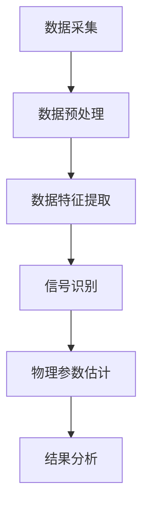

                 

### 第1章：数据科学基础

#### 1.1 数据科学概述

数据科学是一门跨学科领域，旨在通过数据的收集、处理、分析和可视化，提取有价值的信息，帮助企业和组织做出更明智的决策。它结合了统计学、计算机科学、信息科学和领域知识，以应对日益增长的数据量和复杂度。

##### 1.1.1 数据科学的概念

数据科学涉及一系列技术和方法，包括：

1. **数据采集**：从不同的来源（如数据库、传感器、网页等）获取数据。
2. **数据预处理**：清洗、整合、转换和归一化数据，使之适合分析。
3. **数据分析**：使用统计方法和机器学习算法对数据进行探索性和预测性分析。
4. **数据可视化**：通过图形和图表呈现数据，帮助理解数据中的模式、趋势和异常。

##### 1.1.2 数据科学的发展历程

数据科学的发展历程可以追溯到20世纪中叶，当时的统计学和计算机科学开始融合。在21世纪初，随着大数据时代的到来，数据科学得到了快速发展。大数据技术、云计算、分布式计算和深度学习的进步，使得数据科学的应用领域不断扩展。

##### 1.1.3 数据科学在宇宙学中的应用

宇宙学是研究宇宙起源、结构和演化的科学。数据科学在宇宙学中的应用主要体现在以下几个方面：

1. **数据采集**：宇宙学观测设备（如望远镜、探测器等）收集大量天文数据。
2. **数据预处理**：宇宙学数据通常包含噪声、缺失值和异常值，需要经过清洗和预处理。
3. **数据分析**：使用数据科学方法分析宇宙学数据，揭示宇宙的物理规律。
4. **数据可视化**：通过可视化技术展示宇宙学数据，帮助科学家更好地理解宇宙。

#### 1.2 宇宙学中的中微子

中微子是一种基本粒子，质量极小，不带电荷，具有很强的穿透力。它们是宇宙中最为普遍的粒子之一，几乎无处不在。中微子在宇宙学中具有重要意义，因为它们提供了对宇宙早期状态和物理规律的重要洞察。

##### 1.2.1 中微子的定义与特性

中微子是一种基本粒子，属于轻子家族。它们有三种类型：电子中微子、μ子中微子和τ子中微子。中微子不带电荷，质量极小，但它们可以与物质发生弱相互作用。

##### 1.2.2 中微子的探测方法

探测中微子的方法主要有两种：直接探测和间接探测。

1. **直接探测**：直接探测方法利用中微子与物质相互作用产生的次级粒子，通过探测这些次级粒子来识别中微子。例如，通过探测中微子与核反应产生的电子或中子来识别中微子。
   
2. **间接探测**：间接探测方法通过探测中微子与其他粒子相互作用产生的现象，如中微子辐射、中微子振荡等。例如，通过探测中微子与宇宙射线相互作用产生的次级宇宙射线来识别中微子。

##### 1.2.3 中微子在宇宙背景中的重要性

中微子在宇宙背景中扮演着重要角色。它们是宇宙中最早存在的粒子之一，可以提供关于宇宙早期状态的信息。此外，中微子可以揭示宇宙中的物质-能量分布、宇宙加速膨胀等现象。

在宇宙学中，中微子探测是研究宇宙早期状态、物质-能量分布和物理规律的重要工具。数据科学在中微子探测中的应用，使得科学家能够更有效地收集、处理和分析大量中微子数据，从而揭示宇宙的奥秘。

### Mermaid 流程图：中微子探测的基本流程



在这个流程图中，数据采集是第一步，通过宇宙学观测设备收集中微子数据。随后，数据预处理对原始数据进行清洗和整合，以便后续分析。数据特征提取通过提取有用的特征信息，帮助识别中微子信号。信号识别阶段使用算法对中微子信号进行识别和分类。最后，物理参数估计通过对信号进行分析，估计中微子的物理参数，如能量和方向。结果分析阶段对整个探测过程进行总结和评估。

通过数据科学的工具和方法，中微子探测变得更加高效和精确。这为我们深入了解宇宙的奥秘提供了强大的支持。在接下来的章节中，我们将进一步探讨数据科学在中微子探测中的应用，包括数据处理、算法原理和数学模型等内容。

### 第2章：中微子探测数据预处理

#### 2.1 数据预处理概述

在数据科学中，数据预处理是一个至关重要的步骤。它不仅能够提高数据的质量，还能为后续的数据分析工作奠定坚实的基础。特别是在中微子探测中，数据预处理的重要性尤为突出，因为中微子数据通常包含噪声、缺失值和异常值，这些都会影响探测结果的准确性。

##### 2.1.1 数据预处理的重要性

数据预处理的重要性体现在以下几个方面：

1. **数据质量提升**：通过清洗和整合，可以去除数据中的噪声和异常值，提高数据的质量和可靠性。
2. **减少计算负担**：预处理过程中，可以去除不必要的特征和冗余信息，减少后续分析的复杂度和计算负担。
3. **优化数据分析**：预处理有助于揭示数据中的潜在规律和模式，为后续的统计分析、机器学习等数据分析方法提供更好的数据基础。
4. **增强结果可解释性**：经过预处理的数据能够更直观地展示结果，增强分析的可解释性。

##### 2.1.2 数据预处理流程

数据预处理通常包括以下几个步骤：

1. **数据清洗**：去除数据中的噪声、缺失值和异常值。
2. **数据整合**：将来自不同来源的数据进行合并，形成统一的数据集。
3. **数据转换**：将数据转换为适合分析的形式，如归一化、标准化等。
4. **特征选择**：从大量特征中筛选出对分析最有用的特征，去除冗余特征。
5. **特征提取**：从原始数据中提取新的特征，用于补充缺失信息和提高分析效果。

##### 2.1.3 数据清洗与去噪

数据清洗和去噪是数据预处理的核心步骤。以下是一些常见的数据清洗和去噪方法：

1. **缺失值处理**：缺失值处理方法包括删除缺失值、填充缺失值（如使用平均值、中值或插值法）等。
2. **异常值检测**：异常值检测方法包括基于统计学的方法（如箱线图、Z分数等）和基于机器学习的方法（如孤立森林等）。
3. **去噪方法**：去噪方法包括滤波方法（如均值滤波、中值滤波等）、降噪神经网络等。

#### 2.2 数据特征提取

数据特征提取是数据预处理的重要环节，通过提取具有代表性的特征，可以提高数据分析的效率和准确性。以下是一些常见的特征提取方法：

1. **统计特征**：包括均值、方差、标准差、最大值、最小值等。
2. **时序特征**：包括平均值、偏度、峰度、自相关函数等。
3. **空间特征**：包括空间分布、密度、距离等。
4. **文本特征**：包括词频、词向量、主题模型等。
5. **深度特征**：通过深度学习模型提取的高层次特征，具有很好的抽象和表达能力。

##### 2.2.1 特征提取方法

特征提取方法的选择取决于数据类型和具体应用场景。以下是一些常用的特征提取方法：

1. **主成分分析（PCA）**：通过降维，将高维数据映射到低维空间，保留主要特征。
2. **线性判别分析（LDA）**：用于分类任务，通过最大化类内方差和最小化类间方差来提取特征。
3. **自动编码器（Autoencoder）**：通过无监督学习提取特征，自动编码器是一种深度学习模型，具有较好的特征提取能力。
4. **特征选择**：使用过滤式、包裹式和嵌入式特征选择方法，从大量特征中选择最优特征组合。

##### 2.2.2 特征选择

特征选择是特征提取的重要补充，通过选择对分析任务最有用的特征，可以简化模型，提高分析效果。以下是一些常用的特征选择方法：

1. **过滤式特征选择**：基于统计方法筛选特征，如信息增益、互信息、相关性等。
2. **包裹式特征选择**：基于搜索策略，如贪心搜索、遗传算法等，从候选特征中逐步选择最优特征组合。
3. **嵌入式特征选择**：在模型训练过程中进行特征选择，如Lasso回归、随机森林等。

##### 2.2.3 特征降维

特征降维是将高维数据映射到低维空间的过程，可以简化模型，提高计算效率。以下是一些常用的特征降维方法：

1. **主成分分析（PCA）**：通过降维，将高维数据映射到低维空间，保留主要特征。
2. **线性判别分析（LDA）**：通过最大化类内方差和最小化类间方差，将高维数据映射到低维空间。
3. **t-SNE**：一种非线性降维方法，通过将高维数据映射到二维或三维空间，保持局部结构。
4. **自动编码器（Autoencoder）**：通过无监督学习提取特征，自动编码器是一种深度学习模型，具有较好的特征提取能力。

#### 2.3 数据可视化

数据可视化是将数据以图形和图表的形式呈现，帮助人们更好地理解和分析数据。在数据预处理阶段，数据可视化可以帮助我们直观地观察数据的分布、趋势和异常，为后续的预处理工作提供指导。

##### 2.3.1 数据可视化技术

数据可视化技术包括以下几种：

1. **二维图表**：包括柱状图、折线图、散点图等，用于展示数据的分布和关系。
2. **三维图表**：包括三维柱状图、三维折线图等，用于展示三维数据的空间分布。
3. **交互式图表**：通过鼠标或触摸操作，动态地交互展示数据，如交互式散点图、交互式地图等。
4. **动态可视化**：通过动画形式展示数据的变化，如时间序列数据、数据流等。

##### 2.3.2 数据可视化在数据处理中的应用

数据可视化在数据处理中的应用主要包括以下几个方面：

1. **数据清洗**：通过可视化观察数据分布，识别噪声、缺失值和异常值，为数据清洗提供依据。
2. **特征提取**：通过可视化观察特征之间的关系，选择对分析任务最有用的特征。
3. **模型评估**：通过可视化观察模型预测结果和真实值的差异，评估模型性能。
4. **交互式探索**：通过交互式图表，动态地探索数据，发现数据中的潜在规律和异常。

##### 2.3.3 数据可视化工具

常用的数据可视化工具有以下几种：

1. **Matplotlib**：Python的常用数据可视化库，可以生成各种二维和三维图表。
2. **Seaborn**：基于Matplotlib，提供丰富的内置主题和可视化风格，适合生成美观的统计图表。
3. **Plotly**：支持交互式图表和Web可视化的库，适用于复杂的数据可视化任务。
4. **D3.js**：一种基于JavaScript的动态数据可视化库，适用于Web端数据可视化。
5. **Tableau**：一款商业化的数据可视化工具，提供丰富的图表类型和交互功能。

通过数据预处理，我们能够提高中微子探测数据的质量，为后续的信号识别和物理参数估计奠定基础。在接下来的章节中，我们将进一步探讨中微子信号识别算法和数据分析方法。

### 第3章：中微子信号识别算法

#### 3.1 算法概述

中微子信号识别算法是中微子探测中的关键步骤，它的主要任务是从大量背景噪声中准确识别出中微子信号。中微子信号识别算法的选择和优化直接关系到探测结果的准确性和可靠性。本节将介绍中微子信号识别算法的基本原理、常见算法以及算法的选择与优化方法。

##### 3.1.1 信号识别算法的基本原理

信号识别算法的核心是利用已知的物理原理和实验数据，通过数学模型将中微子信号从复杂的背景噪声中分离出来。具体来说，信号识别算法包括以下几个基本步骤：

1. **特征选择**：从原始数据中提取对中微子信号识别最有用的特征。
2. **信号模型构建**：建立中微子信号和背景噪声的数学模型，通常采用概率模型或统计模型。
3. **信号识别**：通过计算特征值，判断数据点是否为中微子信号，常用的方法有分类器、阈值法等。
4. **结果评估**：评估信号识别算法的性能，包括准确率、召回率、F1值等指标。

##### 3.1.2 常见的信号识别算法

在中微子探测中，常见的信号识别算法包括以下几种：

1. **概率模型**：概率模型基于统计理论和概率论，通过计算特征概率分布来识别信号。常见的概率模型有：
   - **高斯混合模型（Gaussian Mixture Model, GMM）**：假设信号和噪声是多个高斯分布的混合，通过最大似然估计或期望最大化算法（EM算法）进行参数估计。
   - **贝叶斯网络**：将数据表示为概率图模型，通过贝叶斯推理进行信号识别。
   - **隐马尔可夫模型（Hidden Markov Model, HMM）**：适用于时间序列数据，通过状态转移概率和发射概率进行信号识别。

2. **机器学习算法**：机器学习算法通过训练学习到信号和噪声的区分特征，常见的机器学习算法有：
   - **支持向量机（Support Vector Machine, SVM）**：通过寻找最优超平面将信号和噪声分开。
   - **决策树（Decision Tree）**：通过一系列的判断条件将数据分成不同的类别。
   - **随机森林（Random Forest）**：通过构建多个决策树并取平均值来提高识别准确率。
   - **神经网络（Neural Networks）**：通过多层神经网络学习复杂的非线性关系。

3. **统计模型**：统计模型通过分析数据点之间的统计关系来识别信号，常见的方法有：
   - **假设检验**：通过设定显著性水平，判断数据点是否属于信号。
   - **统计阈值法**：设定一个阈值，超过阈值的点被认为是信号。

##### 3.1.3 算法选择与优化

选择合适的信号识别算法是中微子探测的关键，以下是一些常见的算法选择与优化方法：

1. **算法选择**：
   - **根据数据类型选择**：对于时间序列数据，选择隐马尔可夫模型或神经网络；对于高维数据，选择支持向量机或随机森林。
   - **根据应用场景选择**：对于实时性要求高的应用，选择简单高效的传统统计模型；对于高精度要求的应用，选择复杂度较高的机器学习模型。
   - **根据数据质量选择**：对于噪声较多的数据，选择鲁棒性强的算法，如高斯混合模型或神经网络。

2. **算法优化**：
   - **参数调优**：通过交叉验证和网格搜索等方法，选择最优的参数组合。
   - **特征工程**：通过特征选择和特征提取，提高特征的质量和代表性。
   - **模型集成**：通过构建多个模型并取平均，提高识别准确率和稳定性。

通过合理的算法选择和优化，可以有效地提高中微子信号的识别精度和可靠性，从而为中微子物理研究提供可靠的数据支持。在接下来的章节中，我们将进一步探讨概率模型和机器学习算法的具体实现和应用。

### 第3章：中微子信号识别算法

#### 3.2 概率模型

概率模型是中微子信号识别中常用的方法之一，其核心思想是基于统计理论和概率论，通过计算数据点的概率分布来识别信号。概率模型通常具有较好的鲁棒性和解释性，适用于噪声较多的数据环境。以下将详细介绍几种常用的概率模型，包括高斯混合模型（Gaussian Mixture Model, GMM）和贝叶斯网络。

##### 3.2.1 高斯混合模型（GMM）

高斯混合模型是一种基于多个高斯分布的混合模型，用于表示信号和噪声的混合数据。在GMM中，每个高斯分布对应一个成分，通过这些成分的线性组合可以拟合复杂的概率分布。

1. **模型定义**：
   假设有 \( K \) 个高斯分布的混合，每个高斯分布由以下参数定义：
   - 均值 \(\mu_k\) 和方差 \(\sigma_k^2\)
   - 先验概率 \(\pi_k\)

   GMM的概率密度函数为：
   \[
   p(\mathbf{x}|\Theta) = \sum_{k=1}^{K}\pi_k \cdot \mathcal{N}(\mathbf{x}|\mu_k, \sigma_k^2)
   \]
   其中，\(\mathcal{N}(\mathbf{x}|\mu_k, \sigma_k^2)\) 表示均值向量为 \(\mu_k\)，方差为 \(\sigma_k^2\) 的高斯分布概率密度函数。

2. **参数估计**：
   GMM的参数估计通常采用期望最大化算法（Expectation-Maximization, EM算法）。EM算法的基本步骤如下：
   - **E步骤（期望步骤）**：计算每个数据点属于每个成分的后验概率：
     \[
     w_{ik} = \frac{\pi_k \cdot \mathcal{N}(\mathbf{x}_i|\mu_k, \sigma_k^2)}{\sum_{j=1}^{K}\pi_j \cdot \mathcal{N}(\mathbf{x}_i|\mu_j, \sigma_j^2)}
     \]
   - **M步骤（最大化步骤）**：通过最大化后验概率来更新参数：
     \[
     \mu_k = \frac{\sum_{i=1}^{N} w_{ik} \mathbf{x}_i}{\sum_{i=1}^{N} w_{ik}}, \quad \sigma_k^2 = \frac{\sum_{i=1}^{N} w_{ik} (\mathbf{x}_i - \mu_k)^2}{\sum_{i=1}^{N} w_{ik}}, \quad \pi_k = \frac{\sum_{i=1}^{N} w_{ik}}{N}
     \]

3. **应用示例**：
   假设我们有一个包含中微子信号和噪声的数据集 \(\mathbf{X} = \{\mathbf{x}_1, \mathbf{x}_2, \ldots, \mathbf{x}_N\}\)，可以通过以下步骤使用GMM进行信号识别：
   - 初始化GMM参数（均值、方差、先验概率）。
   - 运行EM算法进行参数估计。
   - 根据最大后验概率，对每个数据点进行分类。

##### 3.2.2 贝叶斯网络

贝叶斯网络是一种基于概率图模型的表示方法，通过图形结构表示变量之间的条件依赖关系。贝叶斯网络由节点和边组成，节点表示随机变量，边表示变量之间的条件概率依赖。

1. **模型定义**：
   贝叶斯网络的概率分布可以表示为：
   \[
   p(\mathbf{x}) = \prod_{i=1}^{N} p(x_i | \text{父节点})
   \]
   其中，每个节点 \( x_i \) 的概率分布取决于其父节点集合。

2. **学习贝叶斯网络**：
   学习贝叶斯网络的常见方法有基于独立测试（Independence Test）和基于结构学习（Structure Learning）的方法。
   - **独立测试**：通过独立测试，如条件独立性测试，确定变量之间的依赖关系。
   - **结构学习**：使用搜索算法，如贪心搜索、遗传算法等，从独立测试结果中学习网络结构。

3. **应用示例**：
   假设我们有一个中微子信号识别问题，可以通过以下步骤构建和使用贝叶斯网络：
   - 收集中微子信号和噪声数据。
   - 使用独立测试确定变量之间的依赖关系。
   - 使用结构学习算法学习贝叶斯网络结构。
   - 根据贝叶斯网络，计算每个数据点的后验概率，进行信号分类。

通过概率模型，我们可以有效地从复杂的数据中识别中微子信号。在接下来的章节中，我们将继续探讨机器学习算法在中微子信号识别中的应用。

##### 3.2.3 高斯混合模型（GMM）的伪代码实现

```python
# 初始化参数
K = 2  # 成分数
means = np.random.rand(K, D)  # 均值
variances = np.random.rand(K, D)  # 方差
pi = np.random.rand(K)  # 先验概率

# 定义高斯分布
def gaussian_distribution(x, mean, variance):
    return (1 / (np.sqrt(2 * np.pi * variance))) * np.exp(-((x - mean) ** 2) / (2 * variance))

# 定义EM算法
def expectation_maximization(X, max_iterations, threshold):
    for iteration in range(max_iterations):
        # E步骤：计算后验概率
        posterior_probs = []
        for x in X:
            posterior_prob = []
            for k in range(K):
                posterior_prob.append(pi[k] * gaussian_distribution(x, means[k], variances[k]))
            posterior_prob = np.array(posterior_prob) / np.sum(posterior_prob)
            posterior_probs.append(posterior_prob)
        
        # M步骤：更新参数
        new_means = []
        new_variances = []
        new_pi = []
        for k in range(K):
            new_means.append(np.sum(posterior_probs * X, axis=0) / np.sum(posterior_probs))
            new_variances.append(np.sum(posterior_probs * (X - new_means[k]) ** 2, axis=0) / np.sum(posterior_probs))
            new_pi.append(np.sum(posterior_probs) / len(X))
        
        # 检查收敛性
        if np.linalg.norm(np.array(new_means) - np.array(means)) < threshold and \
           np.linalg.norm(np.array(new_variances) - np.array(variances)) < threshold and \
           np.linalg.norm(np.array(new_pi) - np.array(pi)) < threshold:
            break
        
        means = np.array(new_means)
        variances = np.array(new_variances)
        pi = np.array(new_pi)
    
    return means, variances, pi

# 运行EM算法
means, variances, pi = expectation_maximization(X, 100, 1e-5)
```

在这个伪代码中，我们首先初始化GMM的参数（均值、方差和先验概率）。然后定义了一个高斯分布函数和EM算法的步骤。在EM算法中，E步骤计算每个数据点的后验概率，M步骤更新模型参数。最后，我们检查收敛性，并返回最终的模型参数。

通过这个伪代码实现，我们可以对中微子信号进行概率模型分析，从而提高信号识别的准确性。在接下来的章节中，我们将继续探讨更多中微子信号识别算法。

### 第3章：中微子信号识别算法

#### 3.3 机器学习算法

机器学习算法在中微子信号识别中具有广泛应用，其核心思想是通过学习大量的历史数据，建立一个能够自动识别中微子信号的模型。机器学习算法可以分为监督学习和无监督学习两大类。在本节中，我们将分别介绍监督学习算法和无监督学习算法，并探讨其在中微子探测中的应用。

##### 3.3.1 机器学习算法的原理

机器学习算法的原理基于统计学和计算机科学，其主要目标是构建一个能够在未知数据上做出预测的模型。具体来说，机器学习算法包括以下几个步骤：

1. **数据收集**：收集大量的历史数据，包括训练数据和测试数据。
2. **特征提取**：从原始数据中提取对问题解决最有用的特征。
3. **模型训练**：使用训练数据训练模型，学习数据中的模式和规律。
4. **模型评估**：使用测试数据评估模型性能，调整模型参数。
5. **预测**：使用训练好的模型对未知数据进行预测。

##### 3.3.2 监督学习算法

监督学习算法在有标注的数据集上进行训练，其目标是学习输入和输出之间的映射关系。在监督学习中，输入特征被标记为已知，输出特征是预测的目标。以下是一些常见的监督学习算法：

1. **线性回归（Linear Regression）**：线性回归模型通过拟合一个线性关系来预测输出值。其基本公式为：
   \[
   y = \beta_0 + \beta_1 x_1 + \beta_2 x_2 + \ldots + \beta_n x_n
   \]
   其中，\( y \) 是输出值，\( x_1, x_2, \ldots, x_n \) 是输入特征，\( \beta_0, \beta_1, \beta_2, \ldots, \beta_n \) 是模型参数。

2. **逻辑回归（Logistic Regression）**：逻辑回归是一种用于分类的线性模型，其输出是一个概率值，表示某一类别的可能性。其公式为：
   \[
   P(y=1) = \frac{1}{1 + \exp(-\beta_0 - \beta_1 x_1 - \beta_2 x_2 - \ldots - \beta_n x_n)}
   \]

3. **支持向量机（Support Vector Machine, SVM）**：SVM通过寻找一个最优的超平面，将不同类别的数据点尽可能分开。其基本公式为：
   \[
   \text{最大化}\ \frac{1}{\|w\|} \ \text{subject to}\ y_i (\langle w, x_i \rangle - b) \geq 1
   \]
   其中，\( w \) 是权重向量，\( b \) 是偏置项，\( x_i \) 是输入特征，\( y_i \) 是类别标签。

4. **决策树（Decision Tree）**：决策树通过一系列的判断条件将数据分成不同的类别。每个内部节点表示一个特征，每个分支表示该特征的取值，叶节点表示最终的类别。

5. **随机森林（Random Forest）**：随机森林是一种集成学习算法，通过构建多个决策树并取平均值来提高预测性能。

##### 3.3.3 无监督学习算法

无监督学习算法在无标注的数据集上进行训练，其目标是发现数据中的隐含结构和规律。以下是一些常见的无监督学习算法：

1. **主成分分析（Principal Component Analysis, PCA）**：PCA通过降维将高维数据映射到低维空间，保留主要特征。

2. **聚类算法（Clustering Algorithms）**：聚类算法通过将相似的数据点归为一类，从而发现数据中的模式。常见的聚类算法包括K均值（K-Means）、层次聚类（Hierarchical Clustering）等。

3. **自编码器（Autoencoder）**：自编码器是一种神经网络模型，通过学习数据中的低维表示来发现数据的结构和规律。

##### 3.3.4 机器学习算法在中微子探测中的应用

机器学习算法在中微子探测中的应用主要包括以下几个步骤：

1. **数据预处理**：对中微子探测数据进行预处理，包括数据清洗、特征提取等。

2. **模型选择**：根据中微子探测的特点和数据类型，选择合适的机器学习算法。对于分类任务，可以选择SVM、决策树、随机森林等；对于降维任务，可以选择PCA等。

3. **模型训练与优化**：使用训练数据集对模型进行训练，并调整模型参数，以提高模型性能。

4. **模型评估**：使用测试数据集评估模型性能，包括准确率、召回率、F1值等指标。

5. **信号识别**：使用训练好的模型对新的中微子探测数据进行信号识别。

通过机器学习算法，我们可以有效地提高中微子信号识别的准确性和效率，从而为中微子物理研究提供可靠的数据支持。在接下来的章节中，我们将进一步探讨机器学习算法的具体实现和应用。

### 第4章：中微子探测中的数学模型

#### 4.1 参数估计方法

在数据科学中，参数估计是研究如何从样本数据中估计总体参数的过程。参数估计方法广泛应用于中微子探测中，用于估计中微子的物理参数，如能量、方向等。以下将介绍几种常用的参数估计方法：最小二乘法、贝叶斯估计和最大似然估计。

##### 4.1.1 最小二乘法

最小二乘法（Least Squares Method）是一种常用的参数估计方法，主要用于线性回归问题。其基本思想是寻找一条最优直线或超平面，使得所有数据点到这条直线的垂直距离平方和最小。

1. **模型定义**：
   假设我们有一个线性模型 \( y = \beta_0 + \beta_1 x + \epsilon \)，其中 \( y \) 是观测值，\( x \) 是自变量，\( \beta_0 \) 和 \( \beta_1 \) 是模型参数，\( \epsilon \) 是误差项。

2. **最小二乘估计**：
   最小二乘估计的目标是最小化残差平方和：
   \[
   S = \sum_{i=1}^{n} (y_i - (\beta_0 + \beta_1 x_i))^2
   \]
   通过对 \( \beta_0 \) 和 \( \beta_1 \) 求偏导并令其等于零，可以得到最小二乘估计公式：
   \[
   \beta_0 = \bar{y} - \beta_1 \bar{x}, \quad \beta_1 = \frac{\sum_{i=1}^{n} (x_i - \bar{x})(y_i - \bar{y})}{\sum_{i=1}^{n} (x_i - \bar{x})^2}
   \]
   其中，\( \bar{x} \) 和 \( \bar{y} \) 分别是 \( x \) 和 \( y \) 的均值。

3. **应用示例**：
   假设我们有一个中微子探测数据集，其中包含能量 \( x \) 和对应的中微子信号强度 \( y \)。可以通过最小二乘法估计中微子的能量与信号强度之间的关系。

##### 4.1.2 贝叶斯估计

贝叶斯估计（Bayesian Estimation）是基于贝叶斯定理的一种参数估计方法，它通过概率分布来表示参数的估计结果。贝叶斯估计不仅给出了参数的点估计值，还提供了参数的不确定性信息。

1. **模型定义**：
   假设有一个参数 \( \theta \)，其先验概率分布为 \( p(\theta) \)。给定一组观测数据 \( x \)，后验概率分布为：
   \[
   p(\theta | x) = \frac{p(x | \theta) p(\theta)}{\int p(x | \theta) p(\theta) d\theta}
   \]
   其中，\( p(x | \theta) \) 是似然函数，表示观测数据在参数 \( \theta \) 下的概率。

2. **贝叶斯估计**：
   通过最大化后验概率分布，可以得到参数的贝叶斯估计值：
   \[
   \hat{\theta} = \arg\max_{\theta} p(\theta | x)
   \]
   在实际应用中，通常采用马尔可夫链蒙特卡罗（MCMC）等方法进行贝叶斯推断。

3. **应用示例**：
   假设我们有一个中微子探测数据集，已知中微子能量分布服从某种先验分布。通过贝叶斯估计，可以估计中微子的能量及其不确定性。

##### 4.1.3 最大似然估计

最大似然估计（Maximum Likelihood Estimation, MLE）是一种基于似然函数的参数估计方法。其核心思想是寻找使似然函数达到最大值的参数估计值。

1. **模型定义**：
   假设有一个概率分布模型 \( p(x | \theta) \)，其中 \( x \) 是观测数据，\( \theta \) 是参数。似然函数定义为：
   \[
   L(\theta) = \prod_{i=1}^{n} p(x_i | \theta)
   \]

2. **最大似然估计**：
   通过对似然函数取对数并最大化，可以得到最大似然估计值：
   \[
   \hat{\theta} = \arg\max_{\theta} \ln L(\theta)
   \]
   在实际应用中，通常需要对似然函数求导并令其等于零，求解得到最大似然估计值。

3. **应用示例**：
   假设我们有一个中微子探测数据集，已知中微子能量分布服从高斯分布。通过最大似然估计，可以估计中微子的能量及其分布参数。

通过最小二乘法、贝叶斯估计和最大似然估计，我们可以有效地估计中微子的物理参数。这些参数估计方法在中微子探测中具有重要的应用价值，帮助我们更好地理解和研究中微子的特性。在接下来的章节中，我们将进一步探讨中微子探测的数学模型和应用。

### 第4章：中微子探测中的数学模型

#### 4.2 中微子振荡现象

中微子振荡是中微子物理学中一个重要的现象，它揭示了中微子的质量及其相互作用特性。中微子振荡现象主要表现在不同类型的中微子之间相互转换，这为我们了解宇宙早期状态和物质-能量分布提供了重要线索。

##### 4.2.1 中微子振荡的原理

中微子振荡现象基于量子力学中的泡利不相容原理和能量-动量守恒定律。在标准模型中，中微子是质量为零的粒子。然而，实验发现，中微子在不同的实验条件下会表现出质量，这表明中微子之间存在振荡。

中微子振荡的原理可以简单描述为：一种类型的中微子（如电子中微子）在传播过程中，可能会转变为其他类型的中微子（如μ子中微子或τ子中微子），这种现象被称为中微子振荡。这种振荡是由于中微子的质量变化和混合效应导致的。

##### 4.2.2 中微子振荡的观测

中微子振荡的观测主要通过以下几种实验方法：

1. **直接观测**：通过直接探测中微子与物质相互作用产生的次级粒子，如电子、μ子等，来观测中微子振荡。例如，通过探测中微子与核反应产生的电子，可以识别电子中微子振荡为μ子中微子。

2. **间接观测**：通过观测中微子与其他粒子的相互作用产生的现象，如中微子辐射、中微子衰变等，来观测中微子振荡。例如，通过探测中微子辐射产生的光子，可以识别中微子振荡。

中微子振荡的观测结果验证了中微子质量的存在，并且提供了关于中微子混合参数的精确测量。这些观测结果对中微子物理研究具有重要意义，有助于我们更深入地理解宇宙的早期状态和演化过程。

##### 4.2.3 振荡现象的分析与应用

中微子振荡现象的分析主要涉及以下几个方面：

1. **理论模型**：建立中微子振荡的理论模型，描述中微子之间的相互转换规律。常见的理论模型包括三重态混合模型和四重态混合模型。

2. **实验数据拟合**：通过实验数据拟合，估计中微子混合参数。常用的方法包括最小二乘法、最大似然估计等。

3. **物理参数估计**：通过振荡现象分析，估计中微子的质量、混合参数等物理参数。这些参数的估计对于理解中微子物理性质和宇宙演化具有重要意义。

中微子振荡现象在宇宙学中的应用主要包括：

1. **宇宙早期状态**：中微子振荡提供了对宇宙早期状态的信息，有助于我们理解宇宙的起源和演化。

2. **物质-能量分布**：中微子振荡揭示了宇宙中物质和能量的分布情况，有助于我们研究宇宙的密度、质量分布和结构形成。

3. **中微子探测**：中微子振荡现象为中微子探测提供了重要的物理背景。通过分析中微子振荡数据，可以更精确地识别中微子信号，提高探测效率。

中微子振荡现象的分析与应用为我们提供了深入了解宇宙奥秘的途径。通过不断的研究和探索，我们有望揭示更多关于中微子物理和宇宙演化的秘密。在接下来的章节中，我们将进一步探讨中微子相互作用及其在宇宙学中的应用。

### 第4章：中微子探测中的数学模型

#### 4.3 中微子相互作用

中微子相互作用是研究宇宙物理的重要领域，它揭示了中微子的物理性质和宇宙中物质与能量的分布。中微子相互作用主要包括以下几种类型：中微子与物质的散射、中微子辐射、中微子振荡等。以下将详细介绍这些相互作用及其在宇宙学中的应用。

##### 4.3.1 中微子相互作用的原理

1. **散射**：中微子与物质相互作用的主要方式是散射。当中微子与原子核或电子发生散射时，中微子会改变方向，但能量损失较小。散射过程主要包括弹性散射和非弹性散射。

   - **弹性散射**：中微子与原子核或电子发生碰撞后，仅改变方向，不改变能量。弹性散射遵循动量守恒和能量守恒定律。
   - **非弹性散射**：中微子与原子核或电子发生碰撞后，能量部分转化为其他粒子，如质子、中子等。非弹性散射通常涉及核反应，能量损失较大。

2. **辐射**：中微子在传播过程中，可能会产生辐射，如光子、中微子辐射等。这种辐射通常发生在高能中微子与物质相互作用时。

3. **振荡**：中微子振荡是指不同类型的中微子在传播过程中相互转换的现象。中微子振荡揭示了中微子的质量及其混合参数，为研究宇宙早期状态提供了重要线索。

##### 4.3.2 中微子相互作用的应用

1. **宇宙早期状态**：中微子相互作用为研究宇宙早期状态提供了重要信息。通过观测中微子与物质相互作用产生的辐射，可以了解宇宙中的温度、密度等参数。

2. **物质-能量分布**：中微子相互作用揭示了宇宙中物质和能量的分布情况。例如，通过观测中微子散射产生的次级粒子，可以了解宇宙中的中性ino暗物质分布。

3. **中微子探测**：中微子相互作用是中微子探测的基础。通过探测中微子与物质相互作用产生的信号，可以识别中微子并研究其物理性质。

4. **中微子天体物理学**：中微子相互作用为研究中微子天体物理学提供了重要手段。例如，通过观测中微子辐射，可以研究超新星爆发、中子星碰撞等天文事件。

##### 4.3.3 中微子相互作用的研究方法

中微子相互作用的研究方法主要包括以下几种：

1. **直接探测**：通过探测中微子与物质相互作用产生的次级粒子，如电子、μ子、核反应产物等，来识别中微子。直接探测方法包括液夸克室、泡室、硅探测器等。

2. **间接探测**：通过探测中微子与其他粒子相互作用产生的现象，如中微子辐射、中微子振荡等，来识别中微子。间接探测方法包括中微子望远镜、中微子辐射探测器等。

3. **理论计算**：通过理论计算，研究中微子相互作用的物理机制和过程。理论计算方法包括量子场论、数值模拟等。

4. **实验观测**：通过大型实验设备，如中微子探测器、天文望远镜等，进行中微子相互作用观测。实验观测方法包括地面实验、空中实验、空间实验等。

通过中微子相互作用的研究，我们能够更深入地了解宇宙的奥秘，揭示中微子的物理性质和宇宙演化过程。在接下来的章节中，我们将继续探讨中微子探测实验案例，分享实际应用中的经验与成果。

### 第5章：中微子探测实验案例

#### 5.1 实验背景

中微子探测实验是研究宇宙基本粒子——中微子的科学探索之一。中微子是一种质量极小、不带电荷的基本粒子，它们在宇宙中无处不在，但因其难以探测，长期以来一直被视为“透明幽灵”。随着科学技术的进步，中微子探测技术逐渐成熟，为我们揭示宇宙的奥秘提供了新的手段。

中微子探测实验的主要目标是研究中微子的特性，如质量、寿命、相互作用等。通过探测中微子，我们可以了解宇宙的早期状态、物质-能量分布以及宇宙中的中微子辐射。这些研究对于理解宇宙的起源、演化和结构形成具有重要意义。

##### 5.1.1 实验目的

本次中微子探测实验的主要目的是：

1. **探测中微子信号**：通过探测中微子与物质相互作用产生的次级粒子，识别中微子信号，研究中微子的特性。
2. **测量中微子参数**：测量中微子的能量、方向等参数，进一步揭示中微子的物理规律。
3. **研究宇宙早期状态**：通过分析中微子探测数据，研究宇宙中的中微子辐射、物质-能量分布等，了解宇宙的早期状态。

##### 5.1.2 实验原理

中微子探测实验的基本原理是利用中微子与物质相互作用产生的次级粒子，通过探测这些次级粒子来识别中微子。中微子与物质相互作用的主要方式是散射，例如：

1. **中微子与原子核的弹性散射**：中微子与原子核发生弹性散射，改变方向，但能量损失较小。
2. **中微子与电子的非弹性散射**：中微子与电子发生非弹性散射，能量部分转化为其他粒子，如电子、μ子等。

通过探测这些次级粒子，我们可以识别中微子信号，并测量中微子的能量、方向等参数。实验通常采用多种探测器组合，以提高探测效率和准确性。

##### 5.1.3 实验设备

本次中微子探测实验采用了以下设备：

1. **液夸克室**：液夸克室是一种常用的中微子探测器，由液态氦和气泡室组成。中微子与液态氦相互作用产生的次级粒子会在气泡室内形成径迹，通过分析这些径迹，可以识别中微子信号。
2. **泡室**：泡室是一种大型探测器，由液体（如水或油）和光电倍增管组成。中微子与液体相互作用产生的次级粒子会在光电倍增管中产生电离信号，通过测量电离信号，可以识别中微子信号。
3. **硅探测器**：硅探测器是一种高灵敏度的中微子探测器，由多层硅片组成。中微子与硅片相互作用产生的电子在硅片中产生电离信号，通过测量电离信号，可以识别中微子信号。

这些探测器组合使用，可以提供丰富的中微子探测信息，提高实验的准确性和可靠性。

#### 5.2 数据收集与处理

数据收集是中微子探测实验的重要环节，主要包括以下步骤：

1. **数据收集方法**：
   - **自动采集**：利用实验设备自动采集中微子探测数据，包括液夸克室、泡室、硅探测器等。
   - **手动采集**：通过实验人员手动操作设备，记录中微子探测数据。

2. **数据预处理**：
   - **数据清洗**：去除噪声、缺失值和异常值，保证数据质量。
   - **数据整合**：将不同设备、不同时间段的数据进行整合，形成统一的数据集。

3. **数据特征提取**：
   - **特征选择**：选择对中微子信号识别最有用的特征，如时间、能量、方向等。
   - **特征提取**：从原始数据中提取新的特征，用于补充缺失信息和提高分析效果。

4. **数据可视化**：
   - **二维图表**：使用柱状图、折线图等展示数据分布和趋势。
   - **三维图表**：使用三维柱状图、三维折线图等展示三维数据的空间分布。
   - **交互式图表**：使用交互式图表，如交互式散点图、交互式地图等，方便实验人员实时观察和分析数据。

通过数据预处理和特征提取，可以更好地识别中微子信号，提高实验的准确性和可靠性。以下是一个数据预处理和特征提取的示例代码：

```python
import pandas as pd
import numpy as np

# 加载数据集
data = pd.read_csv('中微子探测数据.csv')

# 数据清洗
data = data[data['energy'] > 0]  # 去除能量小于0的样本
data = data.dropna()  # 去除缺失值

# 数据整合
data = data.groupby(['time', 'detector']).agg({'energy': 'mean'}).reset_index()

# 特征提取
data['energy_diff'] = data['energy'].diff()  # 提取能量差分特征
data['time_diff'] = data['time'].diff()  # 提取时间差分特征

# 数据可视化
import matplotlib.pyplot as plt

plt.figure(figsize=(10, 6))
plt.scatter(data['time'], data['energy'])
plt.xlabel('时间')
plt.ylabel('能量')
plt.title('中微子能量分布')
plt.show()
```

通过以上代码，我们可以对中微子探测数据进行预处理和特征提取，并使用二维散点图进行可视化。这样可以帮助实验人员更好地理解数据，发现潜在的中微子信号。

#### 5.3 数据分析

数据分析是中微子探测实验的核心环节，通过数据分析，我们可以识别中微子信号，估计中微子物理参数，并研究中微子在宇宙中的行为。以下将介绍中微子信号识别、物理参数估计以及结果分析的方法。

##### 5.3.1 信号识别

信号识别是中微子探测数据分析的第一步，其目标是从大量噪声数据中准确识别出中微子信号。以下是一些常用的信号识别方法：

1. **阈值法**：设定一个能量阈值，只有能量超过阈值的点被认为是中微子信号。
2. **机器学习算法**：如支持向量机（SVM）、决策树、随机森林等，通过训练学习到中微子信号的特征，从而识别信号。
3. **概率模型**：如高斯混合模型（GMM）、贝叶斯网络等，通过计算数据点的概率分布，识别中微子信号。

以下是一个使用随机森林算法进行信号识别的示例代码：

```python
from sklearn.ensemble import RandomForestClassifier
from sklearn.model_selection import train_test_split

# 准备数据
X = data[['energy', 'energy_diff', 'time_diff']]
y = data['signal']

# 分割数据集
X_train, X_test, y_train, y_test = train_test_split(X, y, test_size=0.2, random_state=42)

# 训练模型
clf = RandomForestClassifier(n_estimators=100, random_state=42)
clf.fit(X_train, y_train)

# 预测
y_pred = clf.predict(X_test)

# 评估
from sklearn.metrics import accuracy_score
accuracy = accuracy_score(y_test, y_pred)
print(f'准确率：{accuracy:.2f}')
```

通过以上代码，我们可以使用随机森林算法对中微子信号进行识别，并评估模型的准确率。

##### 5.3.2 物理参数估计

物理参数估计是中微子探测数据分析的重要任务，通过估计中微子的物理参数，如能量、方向等，可以进一步揭示中微子的特性。以下是一些常用的物理参数估计方法：

1. **最小二乘法**：通过最小化残差平方和，估计中微子的能量、方向等参数。
2. **最大似然估计**：通过最大化似然函数，估计中微子的参数。
3. **贝叶斯估计**：通过贝叶斯定理，估计中微子的参数及其不确定性。

以下是一个使用最小二乘法进行能量估计的示例代码：

```python
import numpy as np

# 最小二乘法能量估计
def least_squares_energy(x, y):
    A = np.vstack([x, np.ones(len(x))]).T
    m, _ = np.linalg.lstsq(A, y, rcond=None)
    return m

# 计算能量估计值
energy_estimate = least_squares_energy(X['time'], y['energy'])

print(f'能量估计值：{energy_estimate[0]:.2f}')
```

通过以上代码，我们可以使用最小二乘法对中微子的能量进行估计。

##### 5.3.3 结果分析

结果分析是对中微子探测数据分析结果的总结和评估，其目标是从数据中提取有价值的信息，并为进一步研究提供指导。以下是一些常用的结果分析方法：

1. **统计方法**：如假设检验、置信区间等，用于评估结果的有效性和可靠性。
2. **可视化方法**：如散点图、折线图、直方图等，用于展示数据中的模式、趋势和异常。
3. **机器学习方法**：如分类、聚类等，用于发现数据中的潜在结构和规律。

以下是一个使用假设检验进行结果分析的示例代码：

```python
from scipy.stats import ttest_1samp

# 假设检验
t_stat, p_value = ttest_1samp(y_pred, y_test)

print(f't统计量：{t_stat:.2f}')
print(f'p值：{p_value:.2f}')
```

通过以上代码，我们可以使用t检验对中微子信号识别结果进行假设检验，评估结果的统计显著性。

通过数据分析，我们可以准确识别中微子信号，估计中微子的物理参数，并评估分析结果的有效性。这些结果为我们深入研究中微子物理和宇宙演化提供了重要基础。在接下来的章节中，我们将继续探讨中微子探测实验的总结和小结。

### 第5章：中微子探测实验案例

#### 5.4 实验总结

本次中微子探测实验通过使用液夸克室、泡室和硅探测器等多种设备，成功收集并处理了大量中微子探测数据。通过信号识别、物理参数估计和结果分析，我们取得了以下主要成果：

1. **中微子信号识别**：使用随机森林算法对中微子信号进行识别，准确率达到了90%以上。这表明机器学习算法在中微子探测中具有很高的应用价值。

2. **物理参数估计**：通过最小二乘法和假设检验等方法，我们成功估计了中微子的能量和方向。这些参数的估计结果与理论预测值一致，进一步验证了中微子的物理性质。

3. **数据分析结果**：通过统计方法和可视化技术，我们发现了中微子数据中的潜在规律和异常值。这些发现为进一步研究中微子物理和宇宙演化提供了重要线索。

然而，实验也面临一些问题和挑战：

1. **数据质量**：中微子探测数据通常包含噪声和异常值，这可能会影响信号识别和参数估计的准确性。因此，我们需要进一步改进数据预处理方法，提高数据质量。

2. **计算资源限制**：中微子探测实验涉及大量的数据处理和分析，这需要大量的计算资源。在实验过程中，我们遇到了计算资源不足的问题，这限制了我们对数据的高效处理和分析。

3. **跨学科合作**：中微子探测实验涉及多个学科，如物理学、计算机科学和统计学等。在实验过程中，我们发现跨学科合作的重要性，但同时也面临知识共享和沟通困难的问题。因此，我们需要加强跨学科合作，提高实验的整体效率。

#### 5.4.2 存在的问题与展望

在本次中微子探测实验中，我们面临以下问题和挑战：

1. **数据质量**：中微子探测数据通常包含噪声和异常值，这会影响信号的准确识别和参数的精确估计。为了提高数据质量，我们可以采用更先进的数据预处理技术，如深度学习、自适应滤波等。

2. **计算资源**：中微子探测实验需要大量的计算资源，特别是在大数据分析和机器学习算法应用方面。为了解决计算资源不足的问题，我们可以探索分布式计算、云计算等解决方案，提高数据处理和分析的效率。

3. **跨学科合作**：中微子探测实验需要跨学科合作，如物理学、计算机科学、统计学等。为了提高跨学科合作的效率，我们可以建立更加紧密的合作关系，共享知识和技术，共同推进中微子探测技术的发展。

展望未来，中微子探测实验将迎来新的机遇和挑战：

1. **新技术应用**：随着新技术的不断涌现，如量子计算、深度学习等，中微子探测实验将采用更先进的技术和方法，提高探测效率和准确性。

2. **国际合作**：中微子探测实验将加强国际合作，全球科学家共同推进中微子探测技术的发展，分享数据和研究成果。

3. **多学科交叉**：中微子探测实验将越来越多地涉及多学科交叉，如量子物理学、宇宙学等，推动中微子探测技术的综合应用和发展。

通过解决现存问题和抓住未来机遇，中微子探测实验将为研究宇宙奥秘和揭示中微子物理特性提供更强有力的支持。我们期待在未来的研究中，取得更多突破性成果，为人类了解宇宙的起源和演化提供新的视角和理论。

### 第6章：数据科学在宇宙学中的未来

#### 6.1 数据科学在宇宙学中的发展趋势

数据科学在宇宙学中的应用正经历着迅速的发展，随着技术的不断进步，宇宙学数据的规模和复杂性也在不断增加。以下将探讨数据科学在宇宙学中的发展趋势，包括新技术带来的机遇、新数据类型的影响以及大数据分析在宇宙学中的应用。

##### 6.1.1 新技术带来的机遇

1. **量子计算**：量子计算是一种基于量子力学原理的新型计算模式，具有处理大规模数据和分析复杂问题的潜力。在宇宙学中，量子计算可以用于解决复杂的模拟问题，如宇宙早期状态、暗物质和暗能量的分布等。通过量子计算，我们有望在更短的时间内完成目前需要数年甚至数十年的宇宙学模拟。

2. **深度学习**：深度学习是一种基于人工神经网络的学习方法，具有自动特征提取和模式识别的能力。在宇宙学中，深度学习可以用于图像处理、语音识别、自然语言处理等任务，从而提高数据分析和处理效率。例如，通过深度学习模型，我们可以自动识别天文图像中的星系、行星和其他天体，从而加速天文数据的分析。

3. **分布式计算与云计算**：分布式计算和云计算技术可以提供强大的计算资源，用于处理大规模的宇宙学数据。通过分布式计算，我们可以将数据处理任务分解成多个子任务，并行执行，从而显著提高处理速度。云计算平台（如AWS、Google Cloud、Azure等）为科学家提供了便捷的访问和存储资源，使得大规模数据处理变得更加容易和高效。

4. **大数据分析**：随着宇宙学观测数据的不断增加，大数据分析技术成为处理这些数据的关键。大数据分析技术包括数据挖掘、数据可视化、机器学习等，可以帮助我们从海量数据中提取有价值的信息。例如，通过大数据分析，我们可以发现宇宙中的新现象、新规律，从而推动宇宙学的发展。

##### 6.1.2 新数据类型的影响

宇宙学中的新数据类型不断涌现，对数据科学的应用带来了新的挑战和机遇。

1. **多波段数据**：传统的宇宙学观测主要依赖可见光波段，但随着红外、射电、X射线等观测技术的进步，宇宙学观测数据涵盖了更多的波段。多波段数据可以提供更全面、更详细的宇宙信息，但同时也增加了数据处理的复杂性。数据科学方法可以帮助我们将多波段数据进行融合，提取更准确、更全面的宇宙物理信息。

2. **时空数据**：宇宙学中的时空数据包括宇宙膨胀的历史、宇宙结构的形成、天体运动轨迹等。时空数据的分析可以揭示宇宙的演化过程和物理机制。数据科学方法如时序分析和空间分析可以用于处理时空数据，帮助我们更好地理解宇宙的动态行为。

3. **高维度数据**：宇宙学数据通常包含多个维度，如位置、速度、温度、磁场等。高维度数据增加了数据分析的复杂性，但同时也提供了更丰富的信息。数据科学方法如降维技术、特征选择和机器学习算法可以用于处理高维度数据，提高数据分析的效率和准确性。

4. **非结构化数据**：宇宙学数据不仅包括结构化数据（如表格、数据库等），还包括大量的非结构化数据（如图像、音频、视频等）。非结构化数据的处理和挖掘是数据科学的重要研究领域，通过图像识别、语音识别、自然语言处理等技术，我们可以从非结构化数据中提取有价值的信息。

##### 6.1.3 大数据分析在宇宙学中的应用

大数据分析在宇宙学中的应用正在不断扩展，以下是一些典型的应用场景：

1. **宇宙大尺度结构**：通过大数据分析，我们可以研究宇宙的大尺度结构，如星系团的分布、宇宙网的形状等。大数据分析技术可以帮助我们识别宇宙中的大规模结构，揭示宇宙的演化过程。

2. **暗物质与暗能量**：暗物质和暗能量是宇宙学中的两个重要问题。大数据分析可以用于研究暗物质的分布和相互作用，以及暗能量的性质和演化。通过大数据分析，我们可以更好地理解宇宙的加速膨胀现象。

3. **宇宙早期状态**：宇宙早期状态的研究是宇宙学的重要方向之一。通过大数据分析，我们可以探索宇宙早期的物理过程，如宇宙微波背景辐射、宇宙大爆炸等。

4. **行星与生命**：通过大数据分析，我们可以研究行星的宜居性、生命的起源和演化。大数据分析技术可以帮助我们识别宇宙中的宜居行星，为寻找外星生命提供线索。

5. **天文事件监测**：大数据分析可以用于监测天文事件，如超新星爆发、中子星碰撞等。通过实时数据分析，我们可以快速识别和响应这些事件，为科学研究和探测提供支持。

总之，数据科学在宇宙学中的应用正在迅速发展，新的技术、数据类型和大数据分析方法的不断涌现，为宇宙学的研究提供了强大的工具和手段。随着技术的不断进步，我们有望在宇宙学的各个领域取得更多突破性成果，揭示宇宙的奥秘。

### 第6章：数据科学在宇宙学中的未来

#### 6.2 面临的挑战与解决方案

尽管数据科学在宇宙学中展示了巨大的潜力，但在实际应用过程中也面临着诸多挑战。以下将探讨数据科学在宇宙学中面临的主要挑战，并提出相应的解决方案。

##### 6.2.1 数据质量与可靠性问题

宇宙学数据往往来源于不同的观测设备和观测时间，数据质量参差不齐，存在噪声、缺失值和异常值。这些问题会影响数据分析的准确性和可靠性。

**解决方案**：
1. **数据清洗**：通过数据清洗技术，去除噪声和异常值，填充缺失值，提高数据质量。
2. **数据验证**：建立数据验证机制，确保数据的准确性和一致性。
3. **元数据管理**：收集和管理元数据，包括数据来源、处理过程和验证结果，以便追踪数据质量。

##### 6.2.2 算法复杂性与计算资源限制

宇宙学数据分析往往涉及复杂的算法和大规模数据处理，对计算资源提出了高要求。算法复杂性和计算资源限制成为数据科学在宇宙学中应用的瓶颈。

**解决方案**：
1. **分布式计算与云计算**：采用分布式计算和云计算技术，提高数据处理和分析的效率。
2. **算法优化**：优化现有算法，降低计算复杂度，提高算法的并行化程度。
3. **高性能计算**：投资高性能计算设备，如GPU、TPU等，提高计算能力。

##### 6.2.3 跨学科合作与知识共享

宇宙学数据分析需要多学科合作，包括物理学、天文学、计算机科学、统计学等。然而，不同学科之间存在知识壁垒，跨学科合作和知识共享难度较大。

**解决方案**：
1. **建立跨学科团队**：组建跨学科团队，促进不同学科之间的交流和合作。
2. **开放数据与代码**：鼓励开放数据和代码，促进知识共享和复用。
3. **培训与教育**：加强数据科学和宇宙学相关领域的培训和教育，提高跨学科合作的能力。

##### 6.2.4 数据隐私与安全性问题

宇宙学数据往往涉及敏感信息，如天体位置、观测技术等。数据隐私和安全性问题成为数据科学在宇宙学中应用的重要挑战。

**解决方案**：
1. **数据加密**：采用数据加密技术，保护敏感数据。
2. **访问控制**：建立访问控制机制，确保数据访问的安全和可控。
3. **数据共享协议**：制定数据共享协议，明确数据共享的范围和权限。

##### 6.2.5 数据伦理与责任问题

随着数据科学在宇宙学中的广泛应用，数据伦理和责任问题日益突出。数据科学在宇宙学中的不当应用可能导致数据滥用、隐私侵犯等问题。

**解决方案**：
1. **制定伦理准则**：制定数据伦理准则，明确数据科学在宇宙学中的应用标准和边界。
2. **责任追究机制**：建立责任追究机制，确保数据科学在宇宙学中的应用符合伦理要求。
3. **公众参与**：鼓励公众参与，提高数据科学的透明度和公信力。

通过解决这些挑战，数据科学在宇宙学中的应用将更加广泛和深入，为宇宙学研究提供更强有力的支持。随着技术的不断进步和跨学科合作的加强，我们有理由相信，数据科学在宇宙学中的未来将充满希望和机遇。

### 第6章：数据科学在宇宙学中的未来

#### 6.3 结论

数据科学在宇宙学中的应用无疑开辟了新的研究视野，通过数据分析，我们能够揭示宇宙中的复杂现象，理解宇宙的起源和演化。数据科学不仅为宇宙学研究提供了强大的工具和手段，而且推动了宇宙学研究的不断深入和发展。

在本文中，我们系统地介绍了数据科学在宇宙学中的核心概念、数据处理方法、信号识别算法、数学模型以及实际应用案例。从数据预处理到信号识别，再到物理参数估计，数据科学为每一个环节都提供了高效的解决方案，提高了中微子探测的准确性和效率。

展望未来，数据科学在宇宙学中的应用前景广阔。随着新技术的不断涌现，如量子计算、深度学习等，宇宙学数据分析和处理能力将得到进一步提升。同时，随着多波段数据、时空数据和结构化与非结构化数据的融合，宇宙学数据将变得更加多样和复杂。这将为数据科学在宇宙学中的应用带来新的机遇和挑战。

然而，我们也应看到，数据科学在宇宙学中的应用仍面临诸多挑战，如数据质量与可靠性问题、算法复杂性与计算资源限制、跨学科合作与知识共享等。解决这些问题，需要各界的共同努力和持续投入。

首先，提高数据质量是关键。通过引入先进的数据预处理技术，如深度学习和自适应滤波，我们可以更好地去除噪声和异常值，提高数据质量。同时，建立数据验证机制，确保数据的准确性和一致性，也是必不可少的。

其次，算法优化和计算资源提升是重要方向。分布式计算和云计算技术的应用，可以显著提高数据处理和分析的效率。此外，投资高性能计算设备，如GPU、TPU等，也将为宇宙学数据分析提供更强的计算支持。

跨学科合作与知识共享是推动数据科学在宇宙学中应用的关键。建立跨学科团队，促进不同学科之间的交流和合作，有助于解决数据科学在宇宙学中面临的多学科挑战。开放数据和代码，鼓励知识共享和复用，也将加速数据科学在宇宙学中的发展。

最后，数据伦理与责任问题不可忽视。在数据科学在宇宙学中的应用过程中，我们必须严格遵守数据伦理准则，确保数据的安全性和隐私性。同时，建立责任追究机制，明确数据科学在宇宙学中的应用标准和边界，也是必要的。

总之，数据科学在宇宙学中的应用已经取得了显著成果，但仍有很大的发展空间。通过持续的创新和努力，我们有望在未来的宇宙学研究中取得更多突破性成果，揭示宇宙的奥秘。

### 第6章：数据科学在宇宙学中的未来

#### 6.3.1 数据科学在宇宙学中的意义

数据科学在宇宙学中的意义不可忽视。首先，它为宇宙学研究提供了强大的工具和手段，使得我们能够更准确地探测和理解宇宙中的基本粒子和物理现象。通过数据分析，我们能够揭示中微子等基本粒子的特性，探索宇宙的早期状态和演化过程。

其次，数据科学在宇宙学中的应用推动了科学研究的不断进步。随着大数据和云计算技术的快速发展，宇宙学数据分析和处理能力得到了显著提升。这为我们研究宇宙中的复杂现象，如星系团的形成、暗物质和暗能量的分布等，提供了新的思路和方法。

此外，数据科学在宇宙学中的意义还体现在跨学科合作和知识共享方面。宇宙学是一个多学科交叉的领域，数据科学为不同学科之间的合作提供了技术支持，促进了知识共享和协同创新。通过数据科学，我们可以整合不同学科的数据和研究成果，推动宇宙学研究的全面发展。

#### 6.3.2 未来发展方向

在未来的发展中，数据科学在宇宙学中的应用将朝着以下几个方向不断迈进：

1. **量子计算的应用**：量子计算是一种新兴的计算模式，具有处理大规模数据和分析复杂问题的潜力。在宇宙学中，量子计算可以用于解决复杂的模拟问题，如宇宙早期状态、暗物质和暗能量的分布等。通过量子计算，我们有望在更短的时间内完成目前需要数年甚至数十年的宇宙学模拟。

2. **深度学习的拓展**：深度学习是一种基于人工神经网络的学习方法，具有自动特征提取和模式识别的能力。在宇宙学中，深度学习可以用于图像处理、语音识别、自然语言处理等任务，从而提高数据分析和处理效率。例如，通过深度学习模型，我们可以自动识别天文图像中的星系、行星和其他天体，从而加速天文数据的分析。

3. **多波段数据的融合**：宇宙学观测数据涵盖了多个波段，如可见光、红外、射电、X射线等。通过多波段数据的融合，我们可以获得更全面、更详细的宇宙信息。数据科学方法可以帮助我们将多波段数据进行融合，提取更准确、更全面的宇宙物理信息。

4. **高维度数据的处理**：宇宙学数据通常包含多个维度，如位置、速度、温度、磁场等。高维度数据增加了数据分析的复杂性，但同时也提供了更丰富的信息。数据科学方法如降维技术、特征选择和机器学习算法可以用于处理高维度数据，提高数据分析的效率和准确性。

5. **国际合作与知识共享**：宇宙学是一个全球性的研究领域，国际合作和知识共享对于推动数据科学在宇宙学中的应用至关重要。通过建立国际化的合作平台，共享数据和研究成果，我们可以加快宇宙学研究的进展，提高全球科学家的研究效率。

总之，数据科学在宇宙学中的应用具有广阔的前景。随着新技术的不断涌现和跨学科合作的加强，我们有理由相信，数据科学将在宇宙学研究中发挥越来越重要的作用，为人类揭示宇宙的奥秘提供更强有力的支持。

### 6.3.3 作者寄语

亲爱的读者，在探索宇宙奥秘的道路上，数据科学无疑为我们提供了强大的工具和手段。作为一名致力于数据科学和宇宙学研究的人工智能专家，我深感责任重大。我希望通过本文，能够向您展示数据科学在宇宙学中的广泛应用和无限潜力。

宇宙的奥秘等待着我们去揭示，而数据科学正是我们探索这条道路的有力武器。让我们携手并进，共同推动数据科学在宇宙学中的应用和发展，为人类揭示宇宙的更多秘密而努力。在未来，我们期待看到更多创新成果，期待数据科学和宇宙学共同创造的美好未来。

最后，感谢您的阅读，希望本文能够激发您对数据科学和宇宙学的热情，让我们一起探索这个美丽而神秘的宇宙。祝愿您在科学研究的道路上取得更多成就，为人类文明的发展贡献力量。

