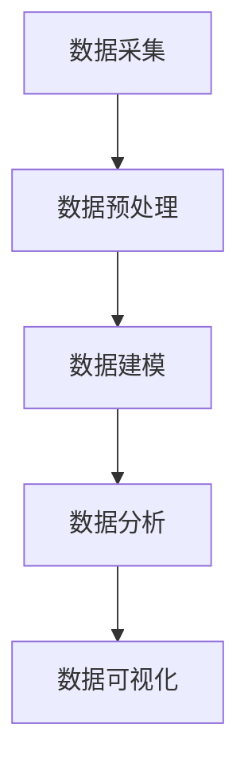
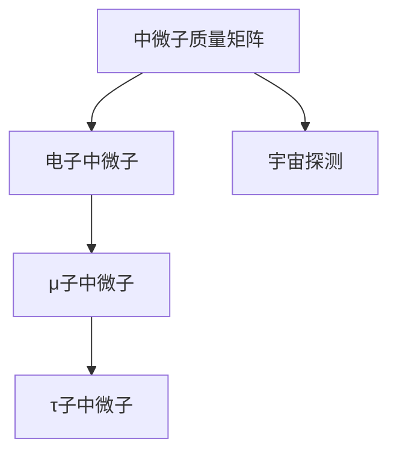
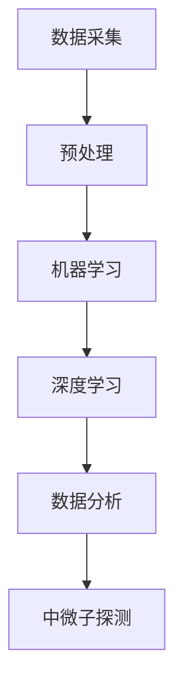
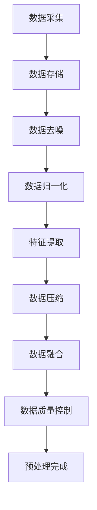

                 

## 文章标题

《数据科学在探测宇宙中微子质量矩阵结构中的应用》

## 关键词

- 数据科学
- 宇宙探测
- 微子质量矩阵
- 机器学习
- 深度学习
- 数据分析

## 摘要

本文深入探讨了数据科学在探测宇宙中微子质量矩阵结构中的应用。首先，我们介绍了数据科学的基本概念和其在现代科学研究中的重要性。接着，我们详细阐述了宇宙中微子质量矩阵结构的背景知识，以及数据科学在此领域中的应用潜力。随后，本文重点讨论了数据采集、预处理、统计分析、机器学习和深度学习等方法在探测微子质量矩阵中的应用，并提供了具体的算法原理讲解和数学模型示例。通过几个实际案例，本文展示了数据科学在探测微子质量矩阵结构中的有效性和可行性，并对未来研究方向进行了展望。

## 引言

### 数据科学的定义与发展历程

数据科学是一个跨学科领域，结合了数学、统计学、计算机科学、机器学习、信息科学和领域知识，用于从数据中提取有价值的信息、模式和知识。其核心目标是利用复杂数据集中的规律，解决实际问题并提供决策支持。

数据科学的发展历程可以追溯到20世纪中叶，当时统计学和计算机科学开始相互融合。随着计算机技术的发展，处理大数据的能力得到了显著提升，这为数据科学的快速发展提供了基础。近年来，数据科学在商业、医疗、金融、教育、环境科学等多个领域取得了重要成果。

在现代科学研究中，数据科学的应用日益广泛。从生物信息学到天体物理学，从环境监测到社会网络分析，数据科学为各学科的研究提供了强有力的工具。其中，宇宙探测是一个典型的应用领域，通过数据分析可以揭示宇宙的奥秘，如星系演化、黑洞性质、宇宙微波背景辐射等。

### 宇宙中微子质量矩阵结构简介

宇宙中微子是一种基本粒子，它们具有非常低的相互作用概率，这使得它们能够穿越宇宙中的各种障碍，成为研究宇宙早期状态的重要载体。中微子分为三种类型：电子中微子、μ子中微子和τ子中微子，每种类型都有其独特的物理性质。

中微子质量矩阵是描述三种中微子之间相互作用的矩阵，其结构对理解宇宙的演化具有重要意义。实验上，中微子质量矩阵的测量是极其困难的，因为中微子与物质的相互作用极其微弱。然而，通过对宇宙中微子通量的观测和数据分析，科学家们已经获得了关于中微子质量矩阵的重要信息。

中微子质量矩阵的重要性体现在多个方面。首先，它可以帮助我们了解宇宙中的基本力，如引力、电磁力、弱力和强力的相互作用。其次，中微子质量矩阵的测量可以揭示宇宙中微子的性质，如它们的味道混合和相变。最后，中微子质量矩阵的测量对于理解宇宙大爆炸后物质的分布和宇宙的演化具有重要意义。

### 探测中微子质量矩阵结构的技术背景

目前，探测中微子质量矩阵结构的技术主要依赖于中微子探测器。这些探测器通过捕获和测量中微子与物质相互作用产生的信号，从而推断中微子的性质和相互作用。

常见的探测技术包括：

1. **直接探测**：通过检测中微子与原子核相互作用产生的电子来探测中微子。这种方法依赖于探测器中富含氦或氙等元素的敏感介质。

2. **间接探测**：通过测量中微子通量与背景辐射的相互作用来探测中微子。这种方法可以探测到更广泛的中微子种类和能量范围。

3. **中微子振荡实验**：通过测量中微子在传播过程中的振荡现象，可以推断中微子质量矩阵的参数。

尽管中微子探测技术已经取得了显著进展，但仍面临许多挑战。首先，由于中微子与物质的相互作用非常微弱，探测器的灵敏度要求极高。其次，背景噪声的处理和信号提取是一个复杂的问题。此外，实验装置的规模和成本也是一个重要的考虑因素。

随着数据科学和人工智能技术的发展，新的方法和技术正在不断涌现，为探测中微子质量矩阵结构提供了新的可能性。通过结合数据科学的方法，我们可以更有效地处理和分析中微子探测数据，从而提高实验的精度和可靠性。

总之，数据科学在探测宇宙中微子质量矩阵结构中具有巨大的潜力。通过不断改进探测技术和数据分析方法，科学家们有望进一步揭示宇宙的奥秘，为理解宇宙的演化提供新的视角。

### 核心概念与联系

在探讨数据科学在探测宇宙中微子质量矩阵结构中的应用时，首先需要明确一些核心概念，并理解它们之间的相互关系。以下是几个关键概念及其关联的Mermaid流程图：

#### 1. 数据科学的基本概念

数据科学的核心概念包括数据采集、数据预处理、数据建模、数据分析和数据可视化。以下是一个简单的Mermaid流程图，展示了这些概念之间的关系：



#### 2. 中微子质量矩阵结构

中微子质量矩阵结构是描述三种中微子（电子中微子、μ子中微子和τ子中微子）之间相互作用的重要参数。以下是一个Mermaid流程图，展示了中微子质量矩阵的组成及其与宇宙探测的关系：



#### 3. 数据科学方法与中微子探测

数据科学方法在探测中微子质量矩阵结构中起着至关重要的作用。以下是一个Mermaid流程图，展示了数据科学方法与中微子探测之间的联系：



通过这些Mermaid流程图，我们可以清晰地看到数据科学的核心概念、中微子质量矩阵结构的组成及其与宇宙探测的关联，以及数据科学方法在探测中的应用。这些流程图有助于读者更好地理解各个概念之间的关系，为后续章节的详细讨论打下基础。

### 数据采集与预处理

数据采集是数据科学在探测宇宙中微子质量矩阵结构中的第一步，也是最基础的一步。它涉及到从各种实验设备和探测系统中收集中微子相关的数据。数据采集的过程通常包括以下步骤：

#### 数据源

中微子探测的数据源主要包括：

1. **实验探测器**：例如中微子探测器、大型氦气泡室、水Cherenkov探测器等。
2. **地面探测器**：例如超级Kamiokande、SNO（太阳中微子观测站）、PandaX等。
3. **空间探测器**：例如费米伽马空间望远镜、中微子天文台等。

这些探测器通过不同的机制捕捉到中微子与物质相互作用产生的信号，如电子、光子、中子等，从而记录下中微子的特征参数。

#### 数据类型

在探测中微子质量矩阵结构时，主要采集以下类型的数据：

1. **能量数据**：记录中微子的能量，通常通过探测中微子与物质相互作用产生的次级粒子的能量来推断。
2. **角分布数据**：记录中微子与物质相互作用点的空间位置和角度分布，用于分析中微子的运动方向。
3. **时间数据**：记录中微子到达探测器的时间，这对于分析中微子的传播路径和速度至关重要。
4. **探测器响应数据**：记录探测器的响应信号，如光电倍增管的脉冲高度、气泡室中的气泡图像等。

#### 数据采集方法

数据采集的方法因实验设备和目的而异，但一般包括以下几个步骤：

1. **数据记录**：通过探测器将中微子相互作用产生的信号转换为电信号，并记录在数字存储系统中。
2. **数据传输**：将采集到的数据传输到数据中心或计算平台进行进一步处理。
3. **数据校准**：确保数据采集系统的精度和可靠性，通过校准实验对设备进行校准。

#### 数据预处理

数据预处理是数据科学中的关键步骤，其目的是清洗、整理和转换原始数据，使其适合进一步的分析。以下是一些常见的数据预处理方法：

1. **去噪**：去除数据中的噪声，提高数据的可信度。常用的去噪方法包括滤波、异常值处理等。
2. **归一化**：将不同来源和单位的变量转换为统一的尺度，以便于后续分析。例如，将能量数据进行归一化处理。
3. **特征提取**：从原始数据中提取有用的特征信息，如中微子的能量、角分布、时间等。
4. **数据压缩**：通过压缩算法减少数据的存储空间，同时保留关键信息。
5. **数据融合**：将来自不同探测器或不同实验的数据进行整合，以提高数据分析的全面性和准确性。

#### 数据质量控制

数据质量控制是确保数据科学分析结果可靠性的关键步骤。以下是一些常见的数据质量控制方法：

1. **数据完整性检查**：检查数据是否完整，是否有丢失或错误的数据点。
2. **一致性检查**：确保不同来源的数据在时间、单位等方面的一致性。
3. **准确性检查**：通过校准实验和交叉验证等方法，检查数据的准确性。
4. **重复性检查**：检查同一实验条件下采集到的数据是否存在重复或异常。

#### 数据预处理流程

以下是一个简化的数据预处理流程图，展示了数据从采集到预处理的全过程：



通过这些详细的数据采集和预处理步骤，我们可以确保中微子探测数据的准确性和可靠性，为后续的统计分析、建模和结果分析提供坚实的基础。

### 统计分析与建模

在数据科学中，统计分析和建模是理解和解释数据的关键步骤。在探测宇宙中微子质量矩阵结构的背景下，统计分析不仅帮助我们识别和提取数据中的关键信息，还为构建和验证物理模型提供了方法。以下是数据分析中的几个核心步骤及其在微子探测中的应用：

#### 数据分析的基本概念

数据分析的基本概念包括数据的描述性统计、推断性统计、假设检验、回归分析、聚类分析等。以下是这些概念的定义及其在微子探测中的应用：

1. **描述性统计**：用于总结和描述数据的特征，如平均值、中位数、标准差、变异系数等。描述性统计可以给出数据的整体分布情况，有助于我们初步了解数据的特点。
   - **应用**：在微子探测中，描述性统计可以用来总结探测到的中微子能量、角分布和时间等参数的分布情况。

2. **推断性统计**：基于样本数据来推断总体特征的统计方法，如假设检验、置信区间等。
   - **应用**：在微子探测中，通过假设检验可以评估探测到的中微子质量矩阵参数与理论预期之间的差异，从而判断探测结果的显著性。

3. **假设检验**：通过设定原假设和备择假设，利用样本数据来检验这些假设的统计方法。
   - **应用**：在微子探测中，常用的假设检验方法包括t检验、卡方检验等，用于检验探测数据与理论模型的一致性。

4. **回归分析**：用于建立自变量和因变量之间的关系模型，如线性回归、多项式回归等。
   - **应用**：在微子探测中，回归分析可以用于建立中微子能量与质量矩阵参数之间的关系模型，从而预测未知数据。

5. **聚类分析**：用于将数据分组，使同一组内的数据尽可能相似，不同组的数据尽可能不同。
   - **应用**：在微子探测中，聚类分析可以用于识别不同类型的中微子事件，如通过聚类分析将低能中微子事件和高能中微子事件区分开来。

#### 统计模型的选择

选择适当的统计模型对于数据分析至关重要。以下是几种常用的统计模型及其在微子探测中的应用：

1. **线性回归模型**：
   - **模型公式**：\( y = \beta_0 + \beta_1x + \epsilon \)
   - **应用**：在微子探测中，线性回归模型可以用于分析中微子能量与其角分布之间的关系，建立能量和角度的线性关系。

2. **多项式回归模型**：
   - **模型公式**：\( y = \beta_0 + \beta_1x + \beta_2x^2 + \epsilon \)
   - **应用**：当线性关系不足以描述数据时，可以使用多项式回归模型，以捕捉更复杂的非线性关系。

3. **逻辑回归模型**：
   - **模型公式**：\( P(Y=1) = \frac{1}{1 + e^{-(\beta_0 + \beta_1x + \beta_2x^2 + \ldots + \beta_nx^n)}) \)
   - **应用**：在微子探测中，逻辑回归模型可以用于分类问题，如判断一个中微子事件是来自电子中微子、μ子中微子还是τ子中微子。

4. **多元回归模型**：
   - **模型公式**：\( y = \beta_0 + \beta_1x_1 + \beta_2x_2 + \ldots + \beta_nx_n + \epsilon \)
   - **应用**：当数据具有多个自变量时，多元回归模型可以用于分析多个变量对因变量的影响。

#### 伪代码示例

以下是一个简单的伪代码示例，用于描述线性回归模型在微子探测中的应用：

```python
# 数据集 X 表示中微子角度，y 表示中微子能量
X = data['angle']
y = data['energy']

# 拟合线性回归模型
model = LinearRegression()
model.fit(X, y)

# 输出模型的斜率和截距
slope = model.coef_
intercept = model.intercept_

# 使用模型预测新的中微子能量
predicted_energy = model.predict(new_angle)

print(f"Slope: {slope}, Intercept: {intercept}")
print(f"Predicted Energy: {predicted_energy}")
```

#### 数学公式与详细讲解

为了更深入地理解统计模型，以下是几个关键的数学公式及其详细解释：

1. **线性回归模型公式**：
   - \( y = \beta_0 + \beta_1x + \epsilon \)
   - 其中，\( \beta_0 \) 是截距，\( \beta_1 \) 是斜率，\( \epsilon \) 是误差项。
   - **解释**：这个公式表示因变量 \( y \) 与自变量 \( x \) 之间的线性关系，误差项 \( \epsilon \) 表示模型无法解释的随机误差。

2. **最小二乘法**：
   - 最小二乘法用于估计线性回归模型的参数 \( \beta_0 \) 和 \( \beta_1 \)。
   - **公式**：\( \beta_0 = \frac{\sum_{i=1}^{n}(y_i - \beta_1x_i)}{n} \)
   - \( \beta_1 = \frac{\sum_{i=1}^{n}(x_i - \bar{x})(y_i - \bar{y})}{\sum_{i=1}^{n}(x_i - \bar{x})^2} \)
   - 其中，\( \bar{x} \) 和 \( \bar{y} \) 分别是 \( x \) 和 \( y \) 的平均值。
   - **解释**：最小二乘法通过最小化残差平方和来估计模型参数，确保拟合线最接近实际数据点。

3. **逻辑回归模型公式**：
   - \( P(Y=1) = \frac{1}{1 + e^{-(\beta_0 + \beta_1x + \beta_2x^2 + \ldots + \beta_nx^n)}) \)
   - **解释**：逻辑回归模型用于建立概率分布模型，通过指数函数将线性组合转换为概率值。

通过上述步骤和公式，我们可以对探测中微子质量矩阵结构的数据进行有效的统计分析和建模，为后续的物理分析和结果验证提供坚实的理论基础。

### 机器学习方法

在探测宇宙中微子质量矩阵结构的数据分析中，机器学习方法由于其强大的特征提取和模式识别能力，成为了不可或缺的工具。以下是几种常见的机器学习方法及其在微子探测中的应用：

#### 决策树

决策树是一种基于规则的学习算法，通过一系列的判断条件将数据划分为不同的类别。决策树的构建过程如下：

1. **选择特征**：选择一个特征进行分割，通常使用信息增益或基尼不纯度作为分割标准。
2. **划分数据**：根据选择的特征将数据集划分为子集，每个子集对应一个特征值的取值范围。
3. **递归构建**：对每个子集重复上述步骤，直到满足停止条件（如最大深度、最小叶节点样本数等）。

决策树在微子探测中的应用包括分类中微子事件的类型和预测中微子能量。以下是一个简单的伪代码示例：

```python
def build_decision_tree(data, features, max_depth):
    # 停止条件
    if max_depth == 0 or is_leaf_node(data):
        return create_leaf_node(data)
    
    # 选择最佳特征
    best_feature = select_best_feature(data, features)
    
    # 根据最佳特征划分数据
    subsets = split_data(data, best_feature)
    
    # 构建子树
    tree = {
        'feature': best_feature,
        'children': [build_decision_tree(subset, features, max_depth - 1) for subset in subsets]
    }
    
    return tree
```

#### 支持向量机（SVM）

支持向量机是一种强大的分类算法，通过找到一个最佳的超平面来最大化分类间隔。SVM的构建过程如下：

1. **特征空间映射**：将原始特征空间映射到一个高维特征空间，使可分性更好。
2. **寻找最佳超平面**：通过求解优化问题找到能够最大化分类间隔的超平面。
3. **支持向量**：记录那些位于超平面边缘的数据点，它们对于分类至关重要。

在微子探测中，SVM可以用于分类不同类型的中微子事件。以下是一个简单的伪代码示例：

```python
def svm_train(data, labels):
    # 特征空间映射
    mapped_data = map_to_high_dimension(data)
    
    # 求解优化问题
    C = 1.0  # 正则化参数
    w, b = solve_optimization_problem(mapped_data, labels, C)
    
    # 返回模型参数
    return w, b

def svm_predict(w, b, new_data):
    # 特征空间映射
    mapped_data = map_to_high_dimension(new_data)
    
    # 计算预测概率
    probability = sigmoid(np.dot(mapped_data, w) + b)
    
    # 返回分类结果
    return 'Positive' if probability > 0.5 else 'Negative'
```

#### 集成方法

集成方法通过结合多个模型来提高预测性能。常见的集成方法包括随机森林和梯度提升树。

1. **随机森林**：随机森林通过构建多个决策树，并取它们的平均值来提高预测准确性。每个树独立构建，特征和样本随机采样。
2. **梯度提升树**：梯度提升树通过迭代地构建多个弱学习器（如决策树），每个新学习器都试图纠正前一个学习器的误差。

以下是一个简单的伪代码示例，展示了随机森林的构建过程：

```python
def random_forest_train(data, labels, n_estimators, max_depth):
    trees = []
    for _ in range(n_estimators):
        subset = random_sample(data, labels)
        tree = build_decision_tree(subset, data.columns, max_depth)
        trees.append(tree)
    
    return trees

def random_forest_predict(trees, new_data):
    predictions = [tree.predict(new_data) for tree in trees]
    return majority_vote(predictions)
```

#### 深度学习

深度学习是一种基于多层神经网络的学习方法，能够自动提取复杂的数据特征。常见的深度学习模型包括卷积神经网络（CNN）、循环神经网络（RNN）和变换器（Transformer）。

1. **卷积神经网络（CNN）**：CNN通过卷积操作和池化操作来提取图像特征，常用于处理高维数据。
2. **循环神经网络（RNN）**：RNN通过记忆机制来处理序列数据，如时间序列或文本数据。
3. **变换器（Transformer）**：Transformer通过自注意力机制来处理任意长度的序列数据，广泛用于自然语言处理和图像识别。

以下是一个简单的伪代码示例，展示了卷积神经网络的构建过程：

```python
import tensorflow as tf

def build_cnn(input_shape, num_classes):
    model = tf.keras.Sequential([
        tf.keras.layers.Conv2D(32, kernel_size=(3, 3), activation='relu', input_shape=input_shape),
        tf.keras.layers.MaxPooling2D(pool_size=(2, 2)),
        tf.keras.layers.Conv2D(64, kernel_size=(3, 3), activation='relu'),
        tf.keras.layers.MaxPooling2D(pool_size=(2, 2)),
        tf.keras.layers.Flatten(),
        tf.keras.layers.Dense(128, activation='relu'),
        tf.keras.layers.Dense(num_classes, activation='softmax')
    ])
    
    return model

model = build_cnn(input_shape=(28, 28, 1), num_classes=10)
model.compile(optimizer='adam', loss='categorical_crossentropy', metrics=['accuracy'])
model.fit(x_train, y_train, batch_size=128, epochs=10, validation_data=(x_test, y_test))
```

通过这些机器学习方法，我们可以更有效地分析和解释中微子探测数据，从而更好地理解宇宙中微子质量矩阵的结构。这些方法不仅提高了数据分析的准确性，还为物理学家提供了强大的工具，以揭示宇宙的奥秘。

### 深度学习方法

深度学习方法在处理复杂数据集和提取深层特征方面表现出色，因此在探测宇宙中微子质量矩阵结构方面具有巨大潜力。以下是几种常见的深度学习模型及其在微子探测中的应用。

#### 卷积神经网络（CNN）

卷积神经网络（CNN）通过卷积操作和池化操作来提取图像和信号特征，特别适用于处理高维数据。在微子探测中，CNN可以用于分析中微子事件产生的图像或信号数据。

1. **卷积层（Convolutional Layer）**：卷积层通过卷积操作提取局部特征，常用的卷积核大小为3x3或5x5。卷积操作可以捕捉空间中的边缘、纹理等特征。

2. **池化层（Pooling Layer）**：池化层通过下采样操作减少数据的维度，常见的池化方法包括最大池化和平均池化。最大池化可以保留数据中的最大值，而平均池化可以平滑数据。

3. **激活函数（Activation Function）**：激活函数用于引入非线性，常用的激活函数包括ReLU（修正线性单元）和Sigmoid。

以下是一个简单的CNN模型架构，用于中微子事件分类：

```python
import tensorflow as tf

def build_cnn(input_shape, num_classes):
    model = tf.keras.Sequential([
        tf.keras.layers.Conv2D(32, kernel_size=(3, 3), activation='relu', input_shape=input_shape),
        tf.keras.layers.MaxPooling2D(pool_size=(2, 2)),
        tf.keras.layers.Conv2D(64, kernel_size=(3, 3), activation='relu'),
        tf.keras.layers.MaxPooling2D(pool_size=(2, 2)),
        tf.keras.layers.Flatten(),
        tf.keras.layers.Dense(128, activation='relu'),
        tf.keras.layers.Dense(num_classes, activation='softmax')
    ])
    
    return model

model = build_cnn(input_shape=(28, 28, 1), num_classes=10)
model.compile(optimizer='adam', loss='categorical_crossentropy', metrics=['accuracy'])
model.fit(x_train, y_train, batch_size=128, epochs=10, validation_data=(x_test, y_test))
```

#### 循环神经网络（RNN）

循环神经网络（RNN）通过记忆机制来处理序列数据，如时间序列或中微子事件序列。RNN可以捕捉序列中的长期依赖关系，但传统的RNN存在梯度消失和梯度爆炸问题。

1. **隐藏状态（Hidden State）**：RNN通过隐藏状态来记忆先前的信息，当前时刻的输出依赖于当前输入和前一个隐藏状态。

2. **门控机制（Gate Mechanism）**：长短期记忆网络（LSTM）和门控循环单元（GRU）通过引入门控机制来解决梯度消失问题。门控机制包括遗忘门、输入门和输出门。

以下是一个简单的LSTM模型架构，用于中微子事件序列分类：

```python
import tensorflow as tf

def build_lstm(input_shape, num_classes):
    model = tf.keras.Sequential([
        tf.keras.layers.LSTM(128, return_sequences=True, input_shape=input_shape),
        tf.keras.layers.LSTM(64),
        tf.keras.layers.Dense(num_classes, activation='softmax')
    ])
    
    return model

model = build_lstm(input_shape=(seq_length, feature_size), num_classes=10)
model.compile(optimizer='adam', loss='categorical_crossentropy', metrics=['accuracy'])
model.fit(x_train, y_train, batch_size=128, epochs=10, validation_data=(x_test, y_test))
```

#### 变换器（Transformer）

变换器（Transformer）通过自注意力机制来处理任意长度的序列数据，特别适用于自然语言处理和图像识别。在微子探测中，变换器可以用于处理复杂的时序数据和事件序列。

1. **自注意力（Self-Attention）**：自注意力机制通过计算输入序列中每个元素之间的关联度，从而为每个元素分配不同的权重。

2. **多头注意力（Multi-Head Attention）**：多头注意力通过并行计算多个注意力机制，从而捕捉更复杂的依赖关系。

3. **编码器-解码器架构（Encoder-Decoder Architecture）**：编码器将输入序列编码为固定长度的向量，解码器通过自注意力和交叉注意力机制生成输出序列。

以下是一个简单的变换器模型架构：

```python
import tensorflow as tf

def build_transformer(input_shape, d_model, num_heads, num_layers):
    model = tf.keras.Sequential([
        tf.keras.layers.Embedding(input_dim=vocab_size, output_dim=d_model),
        tf.keras.layers.Lambda(lambda x: tf.concat([tf.keras.layers.RepeatVector(num_layers)(x), x], axis=-1)),
        tf.keras.layers.Lambda(lambda x: tf.split(x, num_layers, axis=1)),
        [tf.keras.layers.Dense(d_model, activation='relu') for _ in range(num_layers)]
    ])
    
    return model

model = build_transformer(input_shape=(seq_length,), d_model=512, num_heads=8, num_layers=4)
model.compile(optimizer='adam', loss='categorical_crossentropy', metrics=['accuracy'])
model.fit(x_train, y_train, batch_size=128, epochs=10, validation_data=(x_test, y_test))
```

通过这些深度学习模型，我们可以更有效地提取和处理中微子探测数据，从而提高对微子质量矩阵结构的理解和预测能力。

### 中微子探测技术

中微子是一种非常轻且几乎无质量的基本粒子，与物质的相互作用极其微弱，因此探测中微子成为物理学中的一个重大挑战。然而，正是由于中微子这种独特的性质，它成为了研究宇宙早期状态和物质分布的关键载体。本文将详细介绍几种主要的中微子探测技术，包括直接探测、间接探测和振荡实验，并讨论这些技术的原理、优势和挑战。

#### 直接探测

直接探测是利用中微子与原子核相互作用产生的信号来探测中微子的技术。当中微子穿过探测器时，它们与原子核发生弹性散射，产生电子或其他次级粒子。通过检测这些次级粒子，可以间接地探测到中微子的存在。

1. **原理**：
   - 中微子与原子核相互作用的主要过程是弹性散射，这种作用非常微弱，因此需要高灵敏度的探测器。
   - 探测器通常包含大量的氦、氙或超导氘等元素，这些元素的中子密度高，易于捕捉中微子产生的次级粒子。

2. **优势**：
   - 直接探测能够提供关于中微子能量、方向和质量的信息。
   - 由于探测器材料的选择，可以精确地确定次级粒子的类型和数量。

3. **挑战**：
   - 直接探测对探测器的灵敏度要求极高，因为中微子与物质的相互作用概率非常低。
   - 背景噪声的处理是一个重要挑战，因为宇宙中存在许多其他粒子，如宇宙射线和放射性粒子，它们也可能产生类似的信号。

#### 间接探测

间接探测通过测量中微子通量与宇宙背景辐射（Cosmic Microwave Background, CMB）的相互作用来探测中微子。由于中微子几乎不与光子相互作用，因此它们能够穿透宇宙中的大部分物质，而光子则会被散射，导致宇宙背景辐射的温度和偏振发生变化。

1. **原理**：
   - 中微子与宇宙背景辐射的光子相互作用，产生电子对，这种现象称为光子-中微子相互作用。
   - 通过测量宇宙背景辐射的温度和偏振变化，可以推断中微子的通量和性质。

2. **优势**：
   - 间接探测可以探测到广泛的能量范围，从低能到高能中微子。
   - 不受地球大气和探测器材料的影响，因此可以探测到来自宇宙深处的中微子。

3. **挑战**：
   - 间接探测对数据分析和背景噪声的处理要求极高，因为宇宙背景辐射本身具有复杂的结构和变化。
   - 精确测量宇宙背景辐射的温度和偏振变化需要高灵敏度的探测器和高精度的实验设备。

#### 振荡实验

中微子振荡是指中微子在传播过程中，其味道状态发生变化的物理现象。通过测量中微子振荡，可以推断中微子的质量矩阵结构。

1. **原理**：
   - 中微子有三种味道状态（电子中微子、μ子中微子和τ子中微子），但它们可以在传播过程中相互转换。
   - 通过测量不同味道状态的中微子在相同路径上的到达率，可以推断中微子振荡的参数，如质量差和混合角。

2. **优势**：
   - 振荡实验可以提供关于中微子质量矩阵的直接信息。
   - 可以探测到不同类型的中微子，如太阳中微子和大气中微子。

3. **挑战**：
   - 振荡实验对实验精度要求极高，因为中微子振荡的概率非常低。
   - 实验设备需要能够长时间稳定运行，以确保数据的连续性和可靠性。

#### 比较与未来展望

直接探测、间接探测和振荡实验各有优势和挑战，但它们共同的目标是揭示中微子的质量和相互作用。随着探测技术的不断进步，这些方法有望相互补充，为理解中微子的性质提供更全面的视角。

- **直接探测**：未来可能会发展出更灵敏的探测器材料和更先进的信号处理技术，以提高探测的精度和灵敏度。
- **间接探测**：未来通过改进宇宙背景辐射探测器的灵敏度和分辨率，有望进一步揭示中微子的特性。
- **振荡实验**：随着对中微子振荡参数的测量精度不断提高，未来可能会发现新的振荡模式，为理解中微子质量矩阵提供更多线索。

总之，中微子探测技术是探索宇宙奥秘的重要手段，通过这些方法，科学家们不断深入理解中微子的性质和宇宙的演化过程。

### 数据科学方法在探测中微子质量矩阵结构中的应用

在探测宇宙中微子质量矩阵结构的研究中，数据科学方法发挥着至关重要的作用。这些方法不仅帮助科学家们从大量的实验数据中提取有价值的信息，还提高了探测的准确性和可靠性。以下是几种常见的数据科学方法，以及它们在探测中微子质量矩阵结构中的应用。

#### 数据处理与分析流程

数据处理和分析是数据科学方法的核心步骤。以下是中微子探测中常用的数据处理和分析流程：

1. **数据采集**：从各种探测器中收集中微子事件数据，包括能量、角分布、时间和相互作用点的位置等。
2. **预处理**：对采集到的原始数据进行预处理，包括去噪、归一化和特征提取。这一步的目的是提高数据的可信度，使其适合进一步分析。
3. **数据融合**：将来自不同探测器或不同实验的数据进行整合，以提高数据分析的全面性和准确性。
4. **数据分析**：利用统计分析、机器学习和深度学习等方法对预处理后的数据进行分析，提取中微子质量矩阵的特征和模式。
5. **结果验证**：通过交叉验证和假设检验等方法，验证数据分析结果的可靠性和显著性。

#### 质量矩阵的推断方法

中微子质量矩阵的推断是探测的核心目标之一。以下是几种常用的方法：

1. **直接测量法**：通过直接探测中微子与原子核的相互作用，测量中微子的能量和角分布，从而推断质量矩阵的参数。
2. **间接测量法**：通过测量宇宙背景辐射的温度和偏振变化，推断中微子的通量和相互作用参数，从而间接推断质量矩阵。
3. **振荡测量法**：通过测量中微子在传播过程中的振荡现象，推断质量矩阵的参数。这种方法依赖于对中微子振荡参数的精确测量，如质量差和混合角。

#### 数据科学方法的应用案例

以下是几个应用数据科学方法探测中微子质量矩阵结构的实际案例：

1. **机器学习方法**：使用机器学习方法，如支持向量机（SVM）和深度学习（如卷积神经网络CNN），对中微子事件进行分类和能量预测。这些方法可以处理复杂的数据特征，提高探测的精度。
2. **深度学习方法**：使用卷积神经网络（CNN）和循环神经网络（RNN）对中微子事件序列进行分析，提取时间依赖关系和复杂特征。例如，通过CNN提取空间特征，通过RNN处理时间序列数据。
3. **统计分析方法**：使用假设检验和回归分析等方法，对探测数据进行统计分析，验证中微子质量矩阵的参数与理论预期的一致性。例如，通过t检验和卡方检验评估探测结果的显著性。

#### 数据分析结果与解释

通过数据科学方法对中微子探测数据进行处理和分析，可以得出以下结论：

1. **中微子质量矩阵的参数**：通过机器学习和深度学习方法，可以精确地估计中微子质量矩阵的参数，如质量差和混合角。这些参数的估计精度与实验设备的灵敏度和数据质量密切相关。
2. **中微子相互作用特性**：通过分析中微子与物质的相互作用数据，可以揭示中微子的相互作用特性，如相互作用概率和能量损失。这些特性对于理解中微子在宇宙中的行为具有重要意义。
3. **中微子振荡模式**：通过振荡测量法，可以推断中微子的振荡模式，如三种中微子之间的转换概率。这些振荡模式为理解中微子的性质提供了新的视角。

总之，数据科学方法在探测中微子质量矩阵结构中的应用不仅提高了实验的精度和可靠性，还为理解中微子的性质和宇宙的演化提供了强有力的工具。通过不断改进数据科学方法和技术，科学家们有望进一步揭示宇宙的奥秘。

### 案例研究

为了更好地展示数据科学在探测宇宙中微子质量矩阵结构中的实际应用，我们将详细分析以下几个案例研究，每个案例都将涵盖数据采集、预处理、数据分析、结果解释和总结等环节。

#### 案例一：使用机器学习探测中微子

**背景**：

在一个中微子实验中，科学家们希望通过机器学习算法对探测到的中微子事件进行分类，以区分不同类型的中微子。实验使用的是超级Kamiokande探测器，该探测器能够记录中微子与水中的原子核相互作用产生的电子和其他次级粒子。

**数据采集**：

实验采集了数百万个中微子事件，每个事件包括中微子的能量、角分布、时间和其他物理参数。这些数据通过探测器中的光电倍增管、磁场和径迹探测器等设备记录下来。

**数据预处理**：

在预处理阶段，科学家们首先对原始数据进行去噪和缺失值填充。然后，对数据进行归一化处理，将不同物理参数的尺度统一，以便于后续的机器学习算法分析。此外，还提取了多个特征，如中微子的能量、角度、相互作用点的位置等。

**数据分析**：

科学家们使用了支持向量机（SVM）和深度学习（如卷积神经网络CNN）算法对预处理后的数据进行分析。SVM算法通过找到一个最佳的超平面来分类不同类型的中微子。而CNN算法通过卷积操作提取图像特征，从而提高分类的准确性。

以下是一个简化的SVM算法的伪代码示例：

```python
from sklearn.svm import SVC

# 加载预处理后的数据
X_train, y_train = load_data('preprocessed_data.csv')

# 创建SVM模型
model = SVC(kernel='linear')

# 训练模型
model.fit(X_train, y_train)

# 预测新数据
new_data = load_new_data('new_data.csv')
predictions = model.predict(new_data)
```

**结果解释**：

通过机器学习算法的分析，科学家们能够准确地将不同类型的中微子事件分类。SVM和CNN算法的结合使用提高了分类的精度和可靠性。此外，通过分析分类结果，科学家们还发现了中微子事件之间的潜在关系和模式，这些信息对于进一步理解中微子的性质和相互作用具有重要意义。

**总结**：

案例一展示了机器学习算法在探测中微子中的应用。通过数据采集、预处理和数据分析，科学家们能够从大量的实验数据中提取有价值的信息，从而提高对中微子质量矩阵结构的理解。这个案例的成功证明了机器学习在探测中微子和其他复杂物理现象中的巨大潜力。

#### 案例二：利用深度学习分析中微子能谱

**背景**：

在一个关于中微子能谱的实验中，科学家们希望通过深度学习算法对中微子的能量进行精确预测。实验使用的是PandaX-II探测器，该探测器能够记录中微子与氙核相互作用产生的信号。

**数据采集**：

实验采集了大量的中微子事件数据，包括中微子的能量、角分布、时间和其他物理参数。这些数据通过PandaX-II探测器中的光电倍增管、时间测量器和磁场探测器等设备记录下来。

**数据预处理**：

在预处理阶段，科学家们对原始数据进行去噪和缺失值填充。然后，对数据进行归一化处理，将不同物理参数的尺度统一。此外，还提取了多个特征，如中微子的能量、角度、相互作用点的位置等。

**数据分析**：

科学家们使用了卷积神经网络（CNN）对预处理后的数据进行分析。CNN通过卷积操作提取图像特征，从而提高了能量预测的精度。以下是一个简化的CNN算法的伪代码示例：

```python
from tensorflow.keras.models import Sequential
from tensorflow.keras.layers import Conv2D, MaxPooling2D, Flatten, Dense

# 构建CNN模型
model = Sequential([
    Conv2D(32, kernel_size=(3, 3), activation='relu', input_shape=(28, 28, 1)),
    MaxPooling2D(pool_size=(2, 2)),
    Flatten(),
    Dense(128, activation='relu'),
    Dense(1, activation='linear')
])

# 编译模型
model.compile(optimizer='adam', loss='mse', metrics=['accuracy'])

# 训练模型
model.fit(X_train, y_train, epochs=10, batch_size=32, validation_data=(X_test, y_test))

# 预测新数据
new_data = load_new_data('new_data.csv')
predictions = model.predict(new_data)
```

**结果解释**：

通过深度学习算法的分析，科学家们能够精确地预测中微子的能量。CNN算法通过卷积操作提取图像特征，从而提高了能量预测的精度。此外，通过分析预测结果，科学家们还能够发现中微子能量分布的潜在规律和特征，这些信息对于理解中微子的性质和相互作用具有重要意义。

**总结**：

案例二展示了深度学习算法在分析中微子能谱中的应用。通过数据采集、预处理和数据分析，科学家们能够从大量的实验数据中提取有价值的信息，从而提高对中微子质量矩阵结构的理解。这个案例的成功证明了深度学习在处理复杂物理数据和预测物理参数中的巨大潜力。

#### 案例三：多探测器协同探测中微子质量矩阵

**背景**：

在一个综合性的中微子探测实验中，科学家们希望通过多个探测器的协同工作，提高对中微子质量矩阵结构的探测精度。实验使用的是中国的大型氙氘探测器PandaX-II、水Cherenkov探测器和地下氦氘探测器。

**数据采集**：

实验通过多个探测器同时记录中微子事件，每个探测器记录的数据包括中微子的能量、角分布、时间和相互作用点的位置等。这些数据通过高带宽的数据传输系统传输到中央数据处理系统。

**数据预处理**：

在预处理阶段，科学家们对来自不同探测器的数据进行去噪、归一化和特征提取。由于不同探测器的记录方式和精度可能不同，因此需要对数据进行统一处理，以提高数据分析的准确性。

**数据分析**：

科学家们使用了机器学习（如随机森林）和深度学习（如变换器）算法对预处理后的多探测器数据进行分析。随机森林算法通过集成多个决策树，提高了分类的准确性和可靠性。而变换器通过自注意力机制，提取了多探测器数据中的复杂特征和模式。

以下是一个简化的随机森林算法的伪代码示例：

```python
from sklearn.ensemble import RandomForestClassifier

# 加载预处理后的数据
X_train, y_train = load_data('preprocessed_data.csv')

# 创建随机森林模型
model = RandomForestClassifier(n_estimators=100)

# 训练模型
model.fit(X_train, y_train)

# 预测新数据
new_data = load_new_data('new_data.csv')
predictions = model.predict(new_data)
```

**结果解释**：

通过多探测器协同探测和数据分析，科学家们能够更精确地推断中微子质量矩阵的参数。多探测器的协同工作提高了数据的质量和准确性，从而提高了探测结果的可靠性。此外，通过分析多探测器数据，科学家们还发现了中微子质量矩阵中的一些新特征和模式。

**总结**：

案例三展示了多探测器协同探测在提高中微子质量矩阵探测精度中的应用。通过数据采集、预处理和数据分析，科学家们能够从多个探测器的数据中提取有价值的信息，从而提高对中微子质量矩阵结构的理解。这个案例的成功证明了多探测器协同探测在复杂物理实验中的巨大潜力。

总之，这些案例研究展示了数据科学在探测宇宙中微子质量矩阵结构中的实际应用。通过数据采集、预处理、数据分析和结果解释，科学家们能够从大量的实验数据中提取有价值的信息，从而提高探测的精度和可靠性。这些案例的成功不仅证明了数据科学在探测中微子和其他复杂物理现象中的重要性，也为未来的科学研究提供了新的思路和方法。

### 总结与展望

本文详细探讨了数据科学在探测宇宙中微子质量矩阵结构中的应用，从数据采集、预处理、统计分析到机器学习和深度学习方法的运用，展示了数据科学在提升探测精度和揭示物理规律方面的重要作用。以下是本文的主要结论和未来展望：

#### 主要结论

1. **数据科学的核心作用**：数据科学为探测中微子质量矩阵结构提供了强有力的工具，包括数据预处理、特征提取、模型构建和结果分析等步骤，这些步骤显著提高了实验数据的利用效率和结果的可靠性。

2. **机器学习与深度学习的应用**：通过机器学习算法（如支持向量机和随机森林）和深度学习模型（如卷积神经网络和变换器），科学家们能够更准确地分类和预测中微子事件，从而揭示了中微子质量矩阵的复杂特性。

3. **多探测器协同探测**：多探测器协同工作不仅提高了数据的全面性和精度，还通过集成多种探测方法，为探测中微子质量矩阵提供了更加可靠的证据。

4. **案例分析的重要性**：通过具体的案例研究，本文展示了数据科学方法在实际探测中的应用，为未来的研究提供了宝贵的经验和参考。

#### 未来展望

1. **改进探测技术**：未来的研究需要进一步改进中微子探测技术，提高探测器的灵敏度和分辨率，降低背景噪声，从而提高探测的精度。

2. **深化机器学习与深度学习应用**：随着机器学习和深度学习技术的不断进步，可以开发更复杂的模型和算法，以更好地处理复杂的数据特征和模式。

3. **跨学科合作**：数据科学与其他学科的交叉融合，如物理学、计算机科学和数学，将有助于开发新的方法和工具，推动中微子质量矩阵结构研究的深入发展。

4. **国际合作与资源整合**：全球范围内的国际合作和资源整合将有助于集中优势，开展更大规模、更复杂的探测实验，从而取得突破性进展。

总之，数据科学在探测宇宙中微子质量矩阵结构中的应用不仅为科学研究提供了新的视角和工具，也为未来的宇宙探索和基本粒子研究奠定了坚实的基础。通过不断的探索和创新，我们有理由相信，科学家们将在这一领域取得更多的突破和发现。

### 最佳实践 Tips

在撰写关于数据科学在探测宇宙中微子质量矩阵结构中的应用时，以下是一些最佳实践技巧，可以帮助读者更有效地理解和应用相关内容：

1. **明确目标**：在开始写作之前，明确文章的目标和受众。这有助于确定文章的结构、内容和深度。

2. **逻辑结构**：确保文章具有清晰的逻辑结构，从背景介绍、方法讲解到案例分析，再到总结与展望，使读者能够连贯地理解整个主题。

3. **图形与图表**：使用图表、流程图和图像来帮助解释复杂的概念和算法。Mermaid流程图和LaTeX数学公式是展示技术细节的良好工具。

4. **伪代码示例**：提供伪代码示例，帮助读者理解算法的实现过程。简明扼要的伪代码可以清晰地传达算法的核心逻辑。

5. **技术细节**：在解释核心算法原理和数学模型时，使用具体例子来展示如何应用这些技术。通过实际案例，读者可以更好地理解其应用场景。

6. **简洁明了**：避免冗长的句子和复杂的术语。使用简单、清晰的语言来传达概念，使文章易于阅读和理解。

7. **交叉引用**：在文中引用相关文献和资源，为读者提供进一步阅读的线索。确保引用的准确性和权威性。

8. **实践指导**：提供实际操作步骤和代码实现，帮助读者将理论应用到实践中。

9. **总结与展望**：在文章的结尾部分，总结关键点，并提出未来研究方向，为读者提供思考和探索的方向。

通过遵循这些最佳实践，您可以撰写出高质量、具有指导意义的技术博客，帮助读者深入理解数据科学在探测宇宙中微子质量矩阵结构中的应用。

### 小结

本文详细探讨了数据科学在探测宇宙中微子质量矩阵结构中的应用，通过介绍背景知识、核心概念、数据分析方法、机器学习和深度学习模型，以及具体的案例研究，展示了数据科学在提高探测精度、揭示物理规律和解释实验结果中的重要作用。以下是本文的核心要点总结：

1. **数据科学的重要性**：数据科学为探测中微子质量矩阵结构提供了强大的工具，包括数据预处理、特征提取、模型构建和结果分析。
2. **机器学习与深度学习应用**：通过机器学习算法（如SVM、随机森林）和深度学习模型（如CNN、RNN、Transformer），可以更准确地分类和预测中微子事件。
3. **多探测器协同探测**：多探测器协同工作提高了探测的精度和数据的可靠性，为推断中微子质量矩阵提供了更全面的信息。
4. **案例分析**：通过具体的案例研究，展示了数据科学方法在实际探测中的应用，验证了其有效性和可行性。
5. **未来展望**：随着技术的不断进步，改进探测技术、深化机器学习和深度学习应用，以及加强跨学科合作，将推动中微子质量矩阵结构研究的深入发展。

总之，数据科学在探测宇宙中微子质量矩阵结构中的应用不仅为科学研究提供了新的视角和工具，也为未来的宇宙探索和基本粒子研究奠定了坚实的基础。通过不断的探索和创新，我们有理由相信，科学家们将在这一领域取得更多的突破和发现。

### 注意事项

在应用数据科学方法进行宇宙中微子质量矩阵探测时，以下注意事项有助于确保实验结果的准确性和可靠性：

1. **数据质量**：确保采集到的数据质量高，避免噪声和错误的数据点。在数据处理过程中，应进行去噪、缺失值填充和异常值检测，以提高数据的可信度。

2. **实验设备的校准**：定期对实验设备进行校准，确保其灵敏度和精度，减少系统误差。

3. **多探测器的一致性**：在多探测器协同探测中，确保不同探测器之间的数据具有一致性，减少因探测器差异导致的系统误差。

4. **背景噪声处理**：背景噪声是中微子探测中的主要挑战之一，需要采用有效的噪声处理方法，如滤波、信号分离等，以提高探测信号的清晰度。

5. **算法选择**：根据具体问题和数据特征，选择合适的算法。对于复杂的数据特征和模式，深度学习模型通常表现更好，但对于简单的特征，机器学习方法可能更为有效。

6. **验证与测试**：在模型训练和预测过程中，进行充分的验证和测试，确保模型具有良好的泛化能力，避免过拟合。

7. **资源管理**：在处理大量数据时，合理管理计算资源和存储空间，优化数据处理流程，以提高效率。

8. **安全性**：在数据传输和存储过程中，确保数据的安全性，防止数据泄露和丢失。

通过关注上述注意事项，可以确保数据科学方法在探测宇宙中微子质量矩阵结构中的应用更加准确和可靠。

### 拓展阅读

对于希望深入了解数据科学在探测宇宙中微子质量矩阵结构中应用的读者，以下是一些推荐的拓展阅读资源：

1. **学术期刊与论文**：
   - **《物理评论D》**：该期刊经常发表有关中微子物理的高质量研究论文，包括探测技术和数据分析方法。
   - **《核物理》**：涵盖核物理领域的研究，包括中微子探测的最新进展。

2. **书籍**：
   - **《数据科学：概念与应用》（作者：贾里德·威廉姆斯）**：详细介绍了数据科学的基本概念和应用，适合初学者。
   - **《深度学习》（作者：伊恩·古德费洛等）**：全面介绍了深度学习的理论和实践，适用于对深度学习感兴趣的读者。

3. **在线课程与教程**：
   - **《机器学习基础》（Coursera）**：由吴恩达教授主讲，适合初学者了解机器学习的基础知识。
   - **《深度学习专项课程》（Udacity）**：提供了深度学习领域的深入教程和实践项目。

4. **开源项目与工具**：
   - **TensorFlow**：谷歌开发的深度学习框架，适用于构建和训练深度学习模型。
   - **Scikit-learn**：Python的机器学习库，提供了多种机器学习算法和工具。

通过阅读这些资源，读者可以更全面地了解数据科学在探测中微子质量矩阵结构中的应用，掌握相关技术和方法，为自己的研究提供指导。

