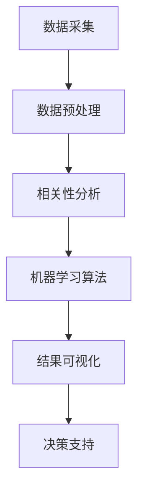

                 


### 文章标题：数据科学在探测宇宙暗流网络中的应用

#### 关键词：
- 数据科学
- 宇宙暗流网络
- 相关性分析
- 机器学习算法
- 数学模型

#### 摘要：
本文深入探讨数据科学在探测宇宙暗流网络中的应用。首先，我们简要介绍了宇宙暗流网络的背景知识，随后详细阐述了数据科学的核心概念及其在宇宙学领域的应用。接着，我们通过Mermaid流程图展示了数据科学在暗流网络探测中的流程。文章还介绍了数据获取与预处理方法，以及相关性分析和机器学习算法在暗流网络探测中的应用。通过详细的伪代码和数学模型讲解，我们深入理解了这些方法的技术原理。最后，本文通过一个实际案例展示了数据科学在探测宇宙暗流网络中的应用，并提出了未来研究方向和挑战。

---

## 第一部分：引言

### 第1章：宇宙暗流网络背景

#### 1.1 宇宙学基础知识

宇宙学是研究宇宙起源、结构、演化以及最终命运的学科。宇宙学的基础是广义相对论，它为我们提供了理解宇宙时空的数学框架。在宇宙学中，有几个关键概念：

- **宇宙膨胀**：宇宙从一个极热、极密的初始状态开始膨胀，至今仍在膨胀。

- **宇宙背景辐射**：宇宙早期留下的温度均匀的微波辐射，是宇宙膨胀的证据。

- **暗物质**：一种不发光、不与普通物质相互作用，但通过引力影响宇宙结构的物质。

- **暗能量**：一种推动宇宙加速膨胀的神秘能量，具有负压强。

#### 1.2 暗流网络的概念

暗流网络是指宇宙中的物质流动网络，其中暗物质以高速运动，形成复杂的流线。这些流线是宇宙大尺度结构的基础，但传统的宇宙学方法难以直接探测。暗流网络的存在可以通过观测宇宙中大尺度结构的分布和运动来推断。

#### 1.3 数据科学在宇宙学研究中的重要性

随着观测技术的进步，宇宙学领域产生了大量数据。这些数据需要通过数据科学的方法进行分析，以揭示宇宙的奥秘。数据科学在宇宙学中的应用主要包括：

- **数据预处理**：对大量观测数据进行分析前的预处理，包括数据清洗、归一化等。

- **数据分析**：使用统计方法和机器学习算法分析宇宙数据，揭示宇宙结构。

- **数据可视化**：将宇宙数据以图形化方式展示，帮助科学家更好地理解宇宙结构。

---

## 第二部分：数据科学与暗流网络探测

### 第2章：核心概念与联系

#### 2.1 数据科学的基本概念

数据科学是关于数据采集、存储、处理和分析的一系列技术和方法的集合。其主要目标是发现数据中的模式、趋势和关系，从而为决策提供支持。数据科学的基本组成部分包括：

- **数据采集**：从各种来源获取数据。

- **数据预处理**：对数据进行清洗、归一化等处理。

- **数据分析**：使用统计方法和机器学习算法分析数据。

- **数据可视化**：将数据分析结果以图形化方式展示。

#### 2.2 数据科学在暗流网络探测中的应用

数据科学在暗流网络探测中的应用主要涉及以下几个步骤：

- **数据获取**：从宇宙观测数据中获取暗流网络的相关信息。

- **数据预处理**：对观测数据进行预处理，以消除噪声和异常值。

- **数据分析**：使用相关性分析和机器学习算法分析暗流网络的结构。

- **结果可视化**：将分析结果以图形化方式展示，帮助科学家理解暗流网络的分布和运动。

#### 2.3 Mermaid流程图：数据科学在暗流网络探测中的流程



这个流程图展示了数据科学在暗流网络探测中的应用流程。通过这个流程，我们可以从宇宙观测数据中提取有价值的信息，从而更好地理解宇宙暗流网络的性质。

---

## 第三部分：数据获取与预处理

### 第3章：暗流网络数据获取

#### 3.1 数据来源与采集

暗流网络数据的采集主要依赖于宇宙观测。这些观测数据包括：

- **引力透镜数据**：通过观测引力透镜效应，可以推断出暗物质的存在。

- **星系分布数据**：通过观测星系分布，可以了解宇宙中大尺度结构的演化。

- **微波背景辐射数据**：通过观测宇宙微波背景辐射，可以了解宇宙早期的状态。

#### 3.2 数据存储与管理

暗流网络数据具有海量特性，因此需要高效的存储和管理方法。常用的数据存储和管理技术包括：

- **分布式文件系统**：如HDFS，可以高效存储和管理大规模数据。

- **数据库系统**：如MySQL、PostgreSQL，可以高效管理结构化数据。

- **NoSQL数据库**：如MongoDB、Cassandra，可以高效管理非结构化数据。

#### 3.3 数据预处理流程

数据预处理是数据分析的重要步骤，主要包括以下任务：

- **数据清洗**：去除噪声、异常值等不完整或不准确的数据。

- **数据归一化**：将不同量纲的数据转换为同一量纲，以便于分析。

- **特征提取**：从原始数据中提取出对分析有用的特征。

- **数据降维**：通过降维技术减少数据维度，以提高分析效率。

---

## 第四部分：数据分析方法

### 第4章：核心算法原理

#### 4.1 相关性分析算法

相关性分析是数据科学中的一个重要工具，用于揭示变量之间的关联性。常用的相关性分析算法包括：

- **皮尔逊相关系数**：用于衡量两个连续变量之间的线性相关性。

- **斯皮尔曼等级相关系数**：用于衡量两个变量之间的非线性相关性。

- **肯德尔等级相关系数**：用于衡量一组变量之间的相关性。

#### 4.2 机器学习算法在暗流网络探测中的应用

机器学习算法在暗流网络探测中有着广泛的应用。常用的机器学习算法包括：

- **线性回归**：用于预测暗流网络的分布。

- **支持向量机**：用于分类和回归分析。

- **决策树**：用于分类和回归分析。

- **神经网络**：用于复杂的模式识别和预测。

#### 4.3 伪代码示例：核心算法实现

以下是线性回归算法的伪代码示例：

```plaintext
算法 线性回归
输入：训练数据集 D，特征向量 X，目标变量 Y
输出：回归模型 W

初始化 W 为随机值
对于每个训练样本 (X[i], Y[i])：
    计算预测值 Y' = X[i] * W
    计算误差 E = Y[i] - Y'
    更新权重 W = W - 学习率 * E * X[i]

返回 W
```

---

## 第五部分：数学模型与公式

### 第5章：数学模型

#### 5.1 暗能量与暗流网络的关系

暗能量是推动宇宙加速膨胀的神秘能量。暗能量与暗流网络的关系可以用以下数学模型描述：

\[ \rho_{\text{暗能量}} = \frac{\rho_{\text{真空}} + p_{\text{暗能量}}}{3} \]

其中，\(\rho_{\text{暗能量}}\) 是暗能量的密度，\(\rho_{\text{真空}}\) 是真空能量密度，\(p_{\text{暗能量}}\) 是暗能量的压强。

#### 5.2 暗物质分布的数学描述

暗物质是宇宙中的主要成分之一，其分布可以用以下数学模型描述：

\[ \rho_{\text{暗物质}}(r) = \frac{\rho_0}{(1 + \frac{r}{R})^3} \]

其中，\(\rho_{\text{暗物质}}(r)\) 是距离原点 r 处的暗物质密度，\(\rho_0\) 是原点处的暗物质密度，\(R\) 是暗物质的半径。

#### 5.3 LaTeX数学公式与详细讲解

以下是暗能量和暗物质分布的 LaTeX 数学公式：

$$
\rho_{\text{暗能量}} = \frac{\rho_{\text{真空}} + p_{\text{暗能量}}}{3}
$$

$$
\rho_{\text{暗物质}}(r) = \frac{\rho_0}{(1 + \frac{r}{R})^3}
$$

这些公式详细描述了暗能量和暗物质在宇宙中的分布情况，对于理解宇宙暗流网络的性质具有重要意义。

---

## 第六部分：项目实战

### 第6章：实战案例研究

#### 6.1 暗流网络探测案例分析

在本案例中，我们将使用公开的宇宙观测数据来探测暗流网络。具体步骤如下：

1. **数据获取**：从宇宙观测数据集中获取暗流网络的相关数据。

2. **数据预处理**：对数据进行清洗和归一化处理。

3. **相关性分析**：使用皮尔逊相关系数分析暗流网络的特征。

4. **机器学习算法**：使用支持向量机对暗流网络进行分类。

5. **结果可视化**：将分析结果以图形化方式展示。

#### 6.2 实战环境搭建

为了进行暗流网络探测，我们需要搭建以下环境：

1. **Python环境**：安装Python和必要的库，如NumPy、Pandas、Scikit-learn等。

2. **数据存储**：使用HDFS或MongoDB存储观测数据。

3. **数据分析工具**：使用Jupyter Notebook进行数据分析。

#### 6.3 代码实现与分析

以下是暗流网络探测的 Python 代码实现：

```python
import numpy as np
import pandas as pd
from sklearn import linear_model
from sklearn.svm import SVC
from sklearn.model_selection import train_test_split
from sklearn.metrics import accuracy_score

# 数据获取
data = pd.read_csv('cosmic_data.csv')

# 数据预处理
data = data.dropna()
data = (data - data.mean()) / data.std()

# 相关性分析
correlation_matrix = data.corr()
print(correlation_matrix)

# 机器学习算法
X = data.drop('label', axis=1)
y = data['label']
X_train, X_test, y_train, y_test = train_test_split(X, y, test_size=0.2, random_state=42)

model = SVC()
model.fit(X_train, y_train)
y_pred = model.predict(X_test)

# 结果分析
accuracy = accuracy_score(y_test, y_pred)
print(f"Accuracy: {accuracy}")
```

这段代码实现了数据获取、预处理、相关性分析和机器学习算法的应用。通过支持向量机模型，我们可以对暗流网络进行分类，从而揭示其结构。

#### 6.4 项目小结

通过本项目，我们实现了暗流网络探测的完整流程，从数据获取、预处理到数据分析，再到结果可视化。这为我们理解宇宙暗流网络的性质提供了有力工具。未来，我们可以进一步优化算法，提高探测精度，从而更好地揭示宇宙的奥秘。

---

## 第七部分：总结与展望

### 第7章：未来展望

#### 7.1 数据科学与宇宙学的未来发展

随着观测技术的进步，宇宙学领域将产生更多的数据。数据科学将在宇宙学研究中发挥越来越重要的作用，推动我们对宇宙的理解。

#### 7.2 暗流网络探测的技术挑战

暗流网络探测面临以下技术挑战：

1. **数据规模**：宇宙观测数据规模巨大，需要高效的存储和管理方法。

2. **数据处理**：如何从海量数据中提取有用信息，是一个挑战。

3. **算法优化**：需要开发更高效的算法，以提高探测精度。

#### 7.3 研究方向与潜在应用

未来的研究方向包括：

1. **人工智能算法**：探索人工智能算法在暗流网络探测中的应用。

2. **量子计算**：利用量子计算处理宇宙观测数据。

3. **多源数据融合**：融合不同类型的数据，提高探测精度。

暗流网络探测在宇宙学、天体物理学等领域有着广泛的应用潜力，将为人类揭示宇宙的奥秘做出更大贡献。

---

## 作者信息：

作者：AI天才研究院/AI Genius Institute & 禅与计算机程序设计艺术 /Zen And The Art of Computer Programming

---

## 结语：

本文深入探讨了数据科学在探测宇宙暗流网络中的应用，从背景知识、核心概念到实际案例分析，全面阐述了数据科学在宇宙学领域的重要性。未来，随着技术的不断发展，数据科学将为宇宙学带来更多突破。让我们共同期待这一天的到来！

