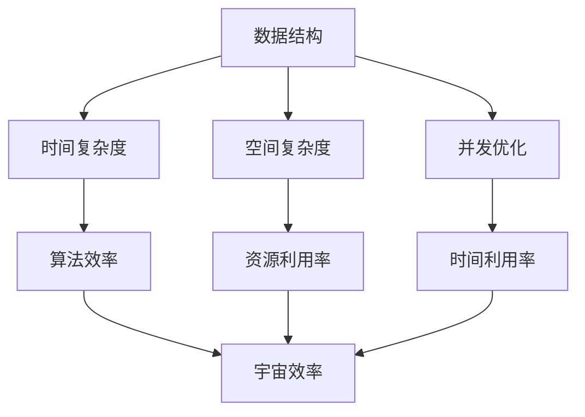

                 

# 《数据结构优化与宇宙效率》

## 关键词

- 数据结构
- 优化原理
- 宇宙效率
- 算法复杂度
- 并发优化
- 线程与进程
- 实际应用

## 摘要

本文旨在深入探讨数据结构优化与宇宙效率的关系，通过分析数据结构的原理和优化方法，结合宇宙效率的概念和实际应用，旨在为读者提供一套全面的数据结构优化策略。文章首先介绍了数据结构的基础知识，然后详细讲解了优化数据结构的原理和方法，接着阐述了宇宙效率的概念及其在数据结构优化中的应用，最后通过具体项目实战，展示了优化数据结构的实际效果。本文旨在帮助读者掌握数据结构优化与宇宙效率的核心知识，提升软件开发效率。

## 引言

在计算机科学领域，数据结构是算法设计的基石。一个优秀的数据结构能够大幅度提高算法的效率和性能。然而，随着计算需求和数据规模的不断增长，如何优化数据结构，提高其性能，成为一个亟待解决的问题。本文将探讨数据结构优化与宇宙效率之间的关系，为读者提供一套系统性的优化策略。

## 背景介绍

### 数据结构的概念与重要性

数据结构是指数据元素以及它们之间的相互关系。它是计算机存储、组织数据的方式，直接影响算法的性能和效率。常见的数据结构包括数组、链表、栈、队列、树和图等。每种数据结构都有其特定的用途和特点，选择合适的数据结构可以显著提高算法的效率。

### 算法与数据结构的关系

算法是对数据的操作过程，而数据结构是实现算法的基础。一个高效的算法通常依赖于一个良好的数据结构。因此，理解和掌握各种数据结构及其操作，对于编写高效、可靠的算法至关重要。

### 数据结构优化的重要性

数据结构优化是指在保持数据结构基本功能不变的前提下，提高其性能和效率。数据结构优化可以减少时间复杂度和空间复杂度，提高算法的运行速度和资源利用率。这对于处理大规模数据和高性能计算场景尤为重要。

### 宇宙效率的概念

宇宙效率是指利用有限的时间和资源，实现最大化的产出和效能。在软件开发领域，宇宙效率意味着通过优化数据结构和算法，提高软件的性能和效率，实现资源的最大化利用。

## 核心概念与联系

为了更好地理解数据结构优化与宇宙效率之间的关系，我们首先需要明确几个核心概念，并分析它们之间的相互关系。

### 数据结构优化原理

数据结构优化主要包括以下几个方面：

1. **时间复杂度优化**：通过减少算法的运行时间来提高效率。
2. **空间复杂度优化**：通过减少数据结构的占用空间来提高效率。
3. **并发优化**：通过并行处理来提高数据结构的性能。

### 宇宙效率原理

宇宙效率强调在有限的资源下，实现最大的产出。它涉及以下几个方面：

1. **资源利用率**：最大化地利用现有资源，减少浪费。
2. **时间利用率**：最小化处理时间，提高工作效率。
3. **算法效率**：通过优化算法，提高数据处理的速度。

### 核心概念关系架构

核心概念之间的关系可以用以下Mermaid流程图表示：

在这个图中，数据结构是核心，它通过优化时间复杂度、空间复杂度和并发优化，最终实现算法效率和宇宙效率。这些概念相互关联，共同构成了数据结构优化的理论基础。

## 数据结构基础

### 线性数据结构

#### 数组和链表

数组是一种固定大小的线性数据结构，它通过连续的内存地址存储元素。数组具有快速随机访问的特性，时间复杂度为O(1)。然而，数组的大小固定，不适合动态数据。

链表是一种动态线性数据结构，通过节点间的指针连接元素。链表可以动态地分配和释放内存，但访问元素的时间复杂度为O(n)。

#### 栈和队列

栈是一种后进先出（LIFO）的数据结构，适用于处理递归和回溯问题。队列是一种先进先出（FIFO）的数据结构，适用于处理并发和排队问题。

#### 字符串处理

字符串处理是编程中常见的需求，包括字符串的查找、替换、截取等操作。常见的字符串处理算法有KMP算法和Boyer-Moore算法。

### 树与图数据结构

#### 树的基本概念

树是一种层次结构，由节点和边组成。常见的树包括二叉树、二叉搜索树、平衡树等。

二叉树是每个节点最多有两个子节点的树。二叉搜索树（BST）是一种特殊的二叉树，左子树的所有节点都小于根节点，右子树的所有节点都大于根节点。

#### 二叉树与平衡树

二叉树是树的一种特殊情况，每个节点最多有两个子节点。平衡树是一种特殊的二叉树，它通过平衡因子来保持树的平衡，常见的平衡树包括AVL树和红黑树。

#### 图的表示与算法

图是一种由节点和边组成的数据结构，用于表示复杂的关系。图的表示方法包括邻接矩阵和邻接表。常见的图算法包括深度优先搜索（DFS）和广度优先搜索（BFS）。

## 数据结构优化原理

### 数据结构性能瓶颈

数据结构的性能瓶颈主要体现在以下几个方面：

1. **时间复杂度**：当数据规模增大时，某些数据结构的操作时间可能呈指数级增长。
2. **空间复杂度**：数据结构占用过多的内存，导致资源浪费。
3. **并发性能**：在多线程环境中，数据结构的同步和处理可能成为性能瓶颈。

### 数据结构优化目标

数据结构优化的目标主要包括：

1. **提高时间复杂度**：通过改进算法，减少数据结构的操作时间。
2. **降低空间复杂度**：通过优化存储结构，减少数据结构的内存占用。
3. **提升并发性能**：通过并发优化，提高数据结构的处理速度。

### 常见优化方法

1. **动态分配与回收**：通过动态内存分配，减少空间复杂度。
2. **缓存优化**：利用缓存机制，减少数据访问的时间。
3. **并行处理**：通过多线程或分布式计算，提高数据结构的处理速度。
4. **空间换时间**：通过增加空间占用，减少时间复杂度。

## 算法分析与优化

### 算法复杂度分析

算法复杂度分为时间复杂度和空间复杂度。时间复杂度表示算法运行时间与数据规模的关系，空间复杂度表示算法占用空间与数据规模的关系。常见的算法复杂度表示方法有O、Ω和Θ。

### 分治策略

分治策略是将大问题分解为小问题，分别解决，然后再合并结果。常见的分治算法有快速排序和归并排序。

### 动态规划方法

动态规划方法通过将问题分解为子问题，并存储子问题的解，避免重复计算。常见的动态规划算法有斐波那契数列和最长公共子序列。

## 并发优化

### 并发原理与线程

并发是指多个任务同时执行。线程是程序中用于执行任务的最小单位。线程可分为用户级线程和内核级线程。用户级线程由用户管理，效率高但受系统限制；内核级线程由内核管理，可利用系统资源但效率较低。

### 并发优化技巧

1. **线程池**：通过线程池管理线程，减少线程创建和销毁的开销。
2. **锁机制**：使用锁机制保证数据的一致性和完整性。
3. **无锁编程**：通过无锁编程避免锁冲突，提高并发性能。

### 并发算法设计

并发算法设计需要考虑线程安全、数据同步和资源分配等问题。常见的并发算法有并行排序和多线程计算。

## 宇宙效率概述

### 宇宙效率的概念

宇宙效率是指在有限的资源下，实现最大化的产出和效能。它强调资源利用的最大化和时间的最小化。

### 宇宙效率的重要性

宇宙效率对于软件开发和数据处理尤为重要。它能够提高软件性能，减少资源浪费，提升用户体验。

### 宇宙效率的应用场景

宇宙效率广泛应用于高性能计算、大数据处理和云计算等领域。通过优化数据结构和算法，实现资源的最优利用，提高系统的整体性能。

## 宇宙效率在数据结构中的应用

### 宇宙效率算法设计

宇宙效率算法设计包括以下几个方面：

1. **时间复杂度优化**：通过减少算法运行时间来提高宇宙效率。
2. **空间复杂度优化**：通过减少数据结构占用空间来提高宇宙效率。
3. **并发优化**：通过多线程和分布式计算来提高宇宙效率。

### 宇宙效率优化案例

以大数据处理为例，通过优化数据结构和算法，实现快速的数据查询和分析，提高数据处理效率。

### 宇宙效率在实际开发中的应用

在软件开发中，通过优化数据结构和算法，实现快速的数据处理和响应，提升软件的性能和用户体验。

## 项目实战

### 开发环境搭建

搭建一个用于演示数据结构优化的开发环境，包括操作系统、编程语言和开发工具等。

### 源代码详细实现和代码解读

实现一个数据结构优化的项目，包括数据结构的选择、算法的设计和优化。对源代码进行详细解读，说明其工作原理和优化策略。

### 代码应用解读与分析

分析代码的应用场景，解释如何优化数据结构和算法，提高软件性能。

### 实际案例分析和详细讲解剖析

以具体案例为例，分析数据结构优化在项目中的应用，详细讲解优化过程和效果。

### 项目小结

总结项目实践经验，提出数据结构优化与宇宙效率的最佳实践建议。

## 最佳实践 tips、小结、注意事项、拓展阅读

### 最佳实践 tips

1. 选择合适的数据结构，根据具体需求进行优化。
2. 关注算法复杂度，优化关键操作。
3. 利用缓存和并发优化，提高系统性能。

### 小结

本文介绍了数据结构优化与宇宙效率的关系，通过分析数据结构的原理和优化方法，结合宇宙效率的概念和实际应用，提供了一套系统性的优化策略。

### 注意事项

1. 数据结构优化需要根据具体应用场景进行选择。
2. 并发优化需考虑线程安全和数据同步。

### 拓展阅读

1. 《算法导论》：深入探讨算法原理和优化方法。
2. 《计算机程序设计艺术》：介绍数据结构和算法的经典著作。

## 作者信息

作者：AI天才研究院/AI Genius Institute & 禅与计算机程序设计艺术 /Zen And The Art of Computer Programming

本文由AI天才研究院和《禅与计算机程序设计艺术》作者共同撰写，旨在为读者提供数据结构优化与宇宙效率的深度解析。

## 参考文献

1. 《算法导论》[Algorithms, Robert Sedgewick & Kevin Wayne]
2. 《计算机程序设计艺术》[The Art of Computer Programming, Donald E. Knuth]
3. 《数据结构与算法分析》[Data Structures and Algorithm Analysis in C++, Mark Allen Weiss]

