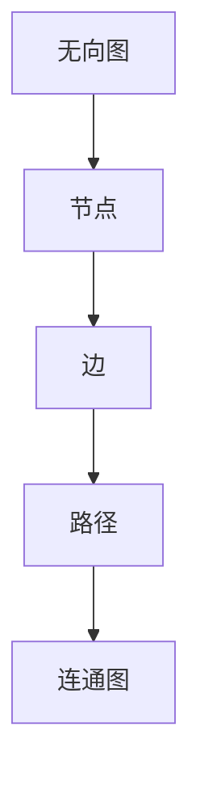

                 


### 文章标题

《数据结构在宇宙拓扑学研究中的应用》

### 文章关键词

数据结构、宇宙拓扑学、拓扑同伦、计算复杂性、量子算法

### 文章摘要

本文深入探讨了数据结构在宇宙拓扑学研究中的应用。从基本概念入手，本文首先介绍了宇宙与拓扑学的关系，然后详细解析了常用的数据结构及其在宇宙拓扑学研究中的应用。接着，本文重点探讨了宇宙拓扑学中的核心算法，包括拓扑同伦和量子算法，并使用伪代码和数学公式进行了详细解释。最后，本文探讨了宇宙拓扑学应用的挑战与未来，并给出了相应的解决方案和最佳实践建议。

---

### 目录

1. **宇宙与拓扑学概述** <a id="宇宙与拓扑学概述"></a>
    1.1 **宇宙的框架**
    1.2 **拓扑学的基本概念**
    1.3 **宇宙拓扑学的研究意义**
2. **基本数据结构**
    2.1 **线性数据结构**
        2.1.1 **串**
        2.1.2 **链表**
        2.1.3 **栈与队列**
    2.2 **树型数据结构**
        2.2.1 **二叉树**
        2.2.2 **森林与森林树**
        2.2.3 **树的遍历算法**
    3. **图论基础**
        3.1 **图的基本概念**
        3.2 **图的存储结构**
        3.3 **图的遍历算法**
4. **数据结构在宇宙拓扑学中的应用**
    4.1 **宇宙网络模型**
        4.1.1 **星系网络**
        4.1.2 **宇宙弦网络**
    4.2 **拓扑不变量**
        4.2.1 **欧拉公式**
        4.2.2 **胡尔维茨定理**
        4.2.3 **连通性**
    4.3 **人造数据结构在宇宙中的应用**
        4.3.1 **宇宙探测器与数据采集**
        4.3.2 **数据处理算法**
        4.3.3 **数据压缩**
        4.3.4 **数据检索算法**
5. **宇宙拓扑学中的核心算法**
    5.1 **拓扑同伦**
        5.1.1 **同伦群**
        5.1.2 **同伦定理**
    5.2 **拓扑量子计算**
        5.2.1 **量子门**
        5.2.2 **量子算法**
    5.3 **计算复杂性**
        5.3.1 **P和NP问题**
        5.3.2 **NP完全问题**
        5.3.3 **算法优化**
6. **宇宙拓扑学应用的挑战与未来**
    6.1 **宇宙拓扑学应用的挑战**
    6.2 **宇宙拓扑学应用的未来展望**
7. **附录**
    7.1 **宇宙拓扑学相关的工具与技术**
    7.2 **拓展阅读**

---

### 第1章 宇宙与拓扑学概述

#### 1.1 宇宙的框架

宇宙，这一庞大而神秘的系统，自古以来就吸引着人类无尽的探索欲望。从古代的宇宙观念到现代的天文学研究，我们对宇宙的认识不断深入。宇宙的框架，简单来说，就是宇宙的基本结构和组成。

宇宙的基本结构主要包括以下几个层次：

1. **星系**：宇宙中由大量恒星、星体和星际物质组成的系统。银河系就是我们所在的星系。
2. **星系团**：由多个星系通过引力相互吸引形成的更大规模的结构。
3. **超星系团**：由多个星系团组成的更大规模的结构。
4. **宇宙背景辐射**：宇宙早期遗留下来的电磁波，是研究宇宙早期状态的重要线索。

宇宙的组成主要包括：

1. **物质**：包括恒星、行星、星体等所有有质量的天体。
2. **暗物质**：一种不发光、不与电磁波发生相互作用，但通过引力作用影响宇宙结构的物质。
3. **暗能量**：一种充满宇宙、推动宇宙加速膨胀的神秘能量。

#### 1.2 拓扑学的基本概念

拓扑学，是研究几何图形或空间在连续改变形状时还能保持不变性质的学科。在宇宙拓扑学中，拓扑学的基本概念和理论为我们提供了理解宇宙结构的有力工具。

**基本概念：**

1. **点、线、面**：宇宙中的基本构成元素。
2. **连通性**：空间中任意两点之间都可以相互连接。
3. **路径连通性**：存在一条连续路径连接空间中任意两点。
4. **同伦性**：空间在连续变形过程中保持不变。

**拓扑学理论：**

1. **欧拉公式**：描述多面体的顶点、边和面的关系，$V - E + F = 2$。
2. **同伦定理**：描述空间在连续变形过程中保持不变的性质。
3. **连通性**：描述空间中任意两点之间的连通性。

#### 1.3 宇宙拓扑学的研究意义

宇宙拓扑学是宇宙学与拓扑学相结合的交叉学科，其研究意义主要体现在以下几个方面：

1. **宇宙结构的研究**：通过拓扑学理论，我们可以更好地理解宇宙的结构和演化过程。
2. **宇宙起源和演化**：宇宙拓扑学提供了研究宇宙起源和演化的重要工具，如宇宙背景辐射、黑洞等。
3. **宇宙与量子引力**：宇宙拓扑学与量子引力理论密切相关，有助于理解宇宙在量子尺度上的行为。
4. **宇宙探索**：宇宙拓扑学为宇宙探索提供了新的思路和方法，如宇宙弦、宇宙网络等。

---

在接下来的章节中，我们将进一步探讨数据结构在宇宙拓扑学研究中的应用，从基本数据结构、图论基础，到核心算法和计算复杂性，逐步深入。希望通过本文的探讨，能为您在宇宙拓扑学研究中提供新的思路和启发。

---

### 第2章 基本数据结构

数据结构是计算机科学中的基础概念，它决定了数据在计算机中的存储方式和操作效率。在宇宙拓扑学研究中，数据结构的合理选择和应用对于解决复杂问题至关重要。本章节将介绍几种基本数据结构，包括线性数据结构和树型数据结构。

#### 2.1 线性数据结构

线性数据结构是数据元素排列成一条直线，每个元素只与前一个和后一个元素相关联。以下是几种常见的线性数据结构：

##### 2.1.1 串

串（String）是一种特殊的线性数据结构，它是由零个或多个字符组成的有限序列。在宇宙拓扑学研究中，串可以用来表示宇宙中的星系名称、宇宙背景辐射模式等。

**核心概念与联系：**

- **定义：** 串是一个字符序列，如“银河系”、“仙女座星系”。
- **关系架构（Mermaid流程图）：**

  ```mermaid
  graph TD
  A[串] --> B[字符序列]
  B --> C[宇宙星系名称]
  ```

**伪代码：**

```python
def create_string(characters):
    return characters
```

##### 2.1.2 链表

链表（Linked List）是一种由节点组成的线性数据结构，每个节点包含数据和指向下一个节点的指针。在宇宙拓扑学中，链表可以用来表示星系之间的引力关系。

**核心概念与联系：**

- **定义：** 链表由一系列节点组成，每个节点包含数据和指向下一个节点的指针。
- **关系架构（Mermaid流程图）：**

  ```mermaid
  graph TD
  A[链表] --> B[节点序列]
  B --> C[星系引力关系]
  ```

**伪代码：**

```python
class Node:
    def __init__(self, data):
        self.data = data
        self.next = None

class LinkedList:
    def __init__(self):
        self.head = None

    def append(self, data):
        new_node = Node(data)
        if not self.head:
            self.head = new_node
        else:
            current = self.head
            while current.next:
                current = current.next
            current.next = new_node
```

##### 2.1.3 栈与队列

栈（Stack）和队列（Queue）是两种特殊的线性数据结构，分别用于实现后进先出（LIFO）和先进先出（FIFO）的操作。在宇宙拓扑学研究中，栈和队列可以用来模拟宇宙事件的发生顺序。

**核心概念与联系：**

- **定义：**
  - **栈**：一种后进先出的数据结构，如宇宙事件的发生顺序。
  - **队列**：一种先进先出的数据结构，如宇宙中的物质流动。
- **关系架构（Mermaid流程图）：**

  ```mermaid
  graph TD
  A[栈] --> B[后进先出]
  B --> C[宇宙事件]
  D[队列] --> E[先进先出]
  E --> F[物质流动]
  ```

**伪代码：**

```python
class Stack:
    def __init__(self):
        self.items = []

    def push(self, item):
        self.items.append(item)

    def pop(self):
        return self.items.pop()

class Queue:
    def __init__(self):
        self.items = []

    def enqueue(self, item):
        self.items.append(item)

    def dequeue(self):
        return self.items.pop(0)
```

#### 2.2 树型数据结构

树型数据结构是非线性数据结构，以树的形式组织数据。每个节点有零个或多个子节点，且没有形成闭环的路径。以下是几种常见的树型数据结构：

##### 2.2.1 二叉树

二叉树（Binary Tree）是每个节点最多有两个子树的树结构。在宇宙拓扑学中，二叉树可以用来表示星系之间的层次关系。

**核心概念与联系：**

- **定义：** 每个节点最多有两个子节点，通常称为左子树和右子树。
- **关系架构（Mermaid流程图）：**

  ```mermaid
  graph TD
  A[二叉树] --> B[节点]
  B --> C[左子树]
  B --> D[右子树]
  ```

**伪代码：**

```python
class TreeNode:
    def __init__(self, data):
        self.data = data
        self.left = None
        self.right = None

class BinaryTree:
    def __init__(self):
        self.root = None

    def insert(self, data):
        new_node = TreeNode(data)
        if not self.root:
            self.root = new_node
        else:
            current = self.root
            while current:
                if data < current.data:
                    if not current.left:
                        current.left = new_node
                        break
                    current = current.left
                else:
                    if not current.right:
                        current.right = new_node
                        break
                    current = current.right
```

##### 2.2.2 森林与森林树

森林（Forest）是由多个树组成的集合。在宇宙拓扑学中，森林可以用来表示多个星系团之间的关系。

**核心概念与联系：**

- **定义：** 森林是由多个树组成的集合。
- **关系架构（Mermaid流程图）：**

  ```mermaid
  graph TD
  A[森林] --> B[树1]
  A --> C[树2]
  A --> D[树3]
  ```

**伪代码：**

```python
class Tree:
    def __init__(self):
        self.root = None

class Forest:
    def __init__(self):
        self.trees = []

    def add_tree(self, tree):
        self.trees.append(tree)

    def remove_tree(self, tree):
        self.trees.remove(tree)
```

##### 2.2.3 树的遍历算法

树的遍历是指按一定的顺序访问树中的所有节点。常见的遍历算法有前序遍历、中序遍历和后序遍历。

**核心概念与联系：**

- **定义：**
  - **前序遍历**：先访问根节点，然后递归遍历左子树和右子树。
  - **中序遍历**：先递归遍历左子树，访问根节点，然后递归遍历右子树。
  - **后序遍历**：先递归遍历左子树，递归遍历右子树，然后访问根节点。
- **关系架构（Mermaid流程图）：**

  ```mermaid
  graph TD
  A[遍历算法] --> B[前序遍历]
  B --> C[访问根节点]
  B --> D[递归遍历左子树]
  B --> E[递归遍历右子树]

  A --> F[中序遍历]
  F --> G[递归遍历左子树]
  F --> H[访问根节点]
  F --> I[递归遍历右子树]

  A --> J[后序遍历]
  J --> K[递归遍历左子树]
  J --> L[递归遍历右子树]
  J --> M[访问根节点]
  ```

**伪代码：**

```python
def preorder_traversal(node):
    if node is not None:
        print(node.data)
        preorder_traversal(node.left)
        preorder_traversal(node.right)

def inorder_traversal(node):
    if node is not None:
        inorder_traversal(node.left)
        print(node.data)
        inorder_traversal(node.right)

def postorder_traversal(node):
    if node is not None:
        postorder_traversal(node.left)
        postorder_traversal(node.right)
        print(node.data)
```

通过以上对基本数据结构的介绍，我们可以看到数据结构在宇宙拓扑学研究中的重要性。在接下来的章节中，我们将进一步探讨图论基础，以及这些数据结构在宇宙拓扑学中的具体应用。

---

### 第3章 图论基础

图论是数学的一个分支，主要研究图的结构和性质。在宇宙拓扑学研究中，图论提供了理解和分析宇宙结构的有力工具。本章节将介绍图论的基本概念、图的存储结构和图的遍历算法。

#### 3.1 图的基本概念

图是由节点（或称为顶点）和边组成的集合。在宇宙拓扑学中，图可以用来表示星系、星系团和宇宙弦等复杂结构。

**基本概念：**

- **节点（Vertex）**：图中的基本元素，可以表示星系、星体等。
- **边（Edge）**：连接两个节点的线段，可以表示星系之间的引力关系。
- **路径**：节点序列，其中相邻节点通过边相连。
- **连通图**：任意两个节点之间存在路径的图。
- **无向图**：边没有方向性的图。
- **有向图**：边有方向性的图。

**关系架构（Mermaid流程图）：**



#### 3.2 图的存储结构

图的存储结构决定了如何高效地表示和处理图。以下是几种常见的图存储结构：

##### 3.2.1 邻接矩阵

邻接矩阵是一个二维数组，用于表示图中节点之间的连接关系。如果节点i和节点j之间存在边，则矩阵中的第i行第j列为1，否则为0。

**核心概念与联系：**

- **定义：** 邻接矩阵表示图中节点之间的直接连接关系。
- **伪代码：**

  ```python
  def create_adjacency_matrix(vertices, edges):
      matrix = [[0 for _ in range(vertices)] for _ in range(vertices)]
      for edge in edges:
          matrix[edge[0]][edge[1]] = 1
          matrix[edge[1]][edge[0]] = 1
      return matrix
  ```

**数学模型和公式：**

- **度数（Degree）**：节点i的度数是与其相连的边的数量。

  $$ \text{度数} = \sum_{j=1}^{n} a_{ij} $$

  其中，$a_{ij}$表示邻接矩阵中第i行第j列的元素。

##### 3.2.2 邻接表

邻接表是由节点和边组成的列表，每个节点对应一个列表，列表中包含了与该节点相连的所有节点。

**核心概念与联系：**

- **定义：** 邻接表表示图中节点的邻接关系。
- **伪代码：**

  ```python
  class AdjacencyList:
      def __init__(self, vertices):
          self.lists = [{} for _ in range(vertices)]

      def add_edge(self, node1, node2):
          self.lists[node1][node2] = True
          self.lists[node2][node1] = True
  ```

#### 3.3 图的遍历算法

图的遍历是指按照一定的顺序访问图中的所有节点。以下是几种常见的图遍历算法：

##### 3.3.1 深度优先搜索（DFS）

深度优先搜索是一种先探索一个分支到最深层，然后回溯到上一个分支再探索的算法。

**核心概念与联系：**

- **定义：** 深度优先搜索先访问一个节点，然后递归地访问该节点的所有未访问的邻接节点。
- **伪代码：**

  ```python
  def dfs(node, visited):
      if node not in visited:
          visited.add(node)
          print(node)
          for neighbor in graph[node]:
              dfs(neighbor, visited)
  ```

**数学模型和公式：**

- **递归树**：描述DFS过程的树形结构。

  $$ \text{DFS树} = \text{节点} \cup \{ \text{DFS树}(n_1), \text{DFS树}(n_2), \ldots, \text{DFS树}(n_k) \} $$

  其中，$n_1, n_2, \ldots, n_k$为节点的邻接节点。

##### 3.3.2 广度优先搜索（BFS）

广度优先搜索是一种先访问所有邻接节点，然后再访问下一层的节点的算法。

**核心概念与联系：**

- **定义：** 广度优先搜索先访问一个节点，然后依次访问该节点的所有未访问的邻接节点。
- **伪代码：**

  ```python
  from collections import deque

  def bfs(start):
      queue = deque([start])
      visited = set()
      while queue:
          node = queue.popleft()
          if node not in visited:
              visited.add(node)
              print(node)
              for neighbor in graph[node]:
                  queue.append(neighbor)
  ```

**数学模型和公式：**

- **层次图**：描述BFS过程的层次结构。

  $$ \text{BFS层次图} = \{ L_1, L_2, \ldots, L_h \} $$

  其中，$L_i$表示第i层的节点集合。

通过以上对图论基本概念、存储结构和遍历算法的介绍，我们可以看到图论在宇宙拓扑学中的重要作用。在接下来的章节中，我们将深入探讨数据结构在宇宙拓扑学中的应用，以及这些算法的具体实现。

---

### 第4章 数据结构在宇宙拓扑学中的应用

宇宙拓扑学作为一门研究宇宙空间结构和性质的科学，其复杂性和规模使得数据结构的应用变得至关重要。在这一章中，我们将详细探讨数据结构在宇宙拓扑学中的实际应用，包括宇宙网络模型、拓扑不变量以及人造数据结构在宇宙中的应用。

#### 4.1 宇宙网络模型

宇宙网络模型是描述宇宙中各种天体和结构之间关系的一种方式。通过图论和拓扑学理论，我们可以将宇宙中的星系、星系团和宇宙弦等结构抽象成图，从而更直观地理解和分析宇宙的结构。

##### 4.1.1 星系网络

星系网络是宇宙网络模型的一个主要组成部分，它描述了星系之间的引力相互作用和运动轨迹。在星系网络中，每个星系可以看作图中的一个节点，而星系之间的引力作用可以看作是节点之间的边。

**核心概念与联系：**

- **节点**：表示星系，如银河系、仙女座星系。
- **边**：表示星系之间的引力相互作用。
- **图论模型（Mermaid流程图）：**

  ```mermaid
  graph TD
  A[银河系] --> B[仙女座星系]
  A --> C[银河系A]
  B --> C
  ```

**伪代码：**

```python
class Galaxy:
    def __init__(self, name):
        self.name = name
        self.neighbors = []

    def add_neighbor(self, galaxy):
        self.neighbors.append(galaxy)

galaxy1 = Galaxy("银河系")
galaxy2 = Galaxy("仙女座星系")
galaxy3 = Galaxy("银河系A")

galaxy1.add_neighbor(galaxy2)
galaxy1.add_neighbor(galaxy3)
galaxy2.add_neighbor(galaxy3)
```

##### 4.1.2 宇宙弦网络

宇宙弦网络是描述宇宙中高能粒子和奇异物质相互作用的网络结构。宇宙弦网络中的节点可以表示高能粒子或奇异物质，而边则表示这些粒子或物质之间的相互作用。

**核心概念与联系：**

- **节点**：表示高能粒子或奇异物质。
- **边**：表示粒子或物质之间的相互作用。
- **图论模型（Mermaid流程图）：**

  ```mermaid
  graph TD
  A[高能粒子A] --> B[高能粒子B]
  A --> C[奇异物质X]
  C --> D[奇异物质Y]
  ```

**伪代码：**

```python
class Particle:
    def __init__(self, name):
        self.name = name
        self.interactions = []

    def add_interaction(self, particle):
        self.interactions.append(particle)

particle1 = Particle("高能粒子A")
particle2 = Particle("高能粒子B")
particle3 = Particle("奇异物质X")
particle4 = Particle("奇异物质Y")

particle1.add_interaction(particle2)
particle1.add_interaction(particle3)
particle3.add_interaction(particle4)
```

#### 4.2 拓扑不变量

拓扑不变量是描述空间在连续变形过程中保持不变的性质。在宇宙拓扑学中，拓扑不变量用于分析宇宙结构的稳定性和演化过程。

##### 4.2.1 欧拉公式

欧拉公式是描述多面体顶点、边和面的关系的公式。在宇宙拓扑学中，欧拉公式可以用来分析星系团和星系之间的结构关系。

**核心概念与联系：**

- **欧拉公式**：$V - E + F = 2$，其中$V$表示顶点数，$E$表示边数，$F$表示面数。
- **应用示例**：分析一个星系团中的星系数量、星系之间的引力相互作用和星系团的形状。

**数学公式和详细讲解：**

$$ V - E + F = 2 $$

- **顶点数（V）**：星系团中星系的总数。
- **边数（E）**：星系之间的引力相互作用的数量。
- **面数（F）**：星系团中星系形成的封闭区域的数量。

**举例说明**：假设一个星系团中有5个星系，它们之间有8条引力相互作用，形成了3个封闭区域。根据欧拉公式：

$$ 5 - 8 + 3 = 0 \neq 2 $$

这个例子说明，星系团的结构并不满足欧拉公式，可能需要进一步分析其拓扑结构。

##### 4.2.2 胡尔维茨定理

胡尔维茨定理是描述平面网络的连通性和结构的定理。在宇宙拓扑学中，胡尔维茨定理可以用来分析星系团在网络中的连通性和稳定性。

**核心概念与联系：**

- **胡尔维茨定理**：描述平面网络中的连通性和结构，如星系团中的星系连接方式。
- **应用示例**：分析星系团在网络中的连通性，确保星系之间的引力相互作用不会导致结构崩溃。

**数学公式和详细讲解：**

- **定理**：一个平面网络是连通的，当且仅当它的欧拉公式成立，即$V - E + F = 2$。
- **证明**：胡尔维茨定理通过分析平面网络中的顶点、边和面的关系，证明了网络的连通性和稳定性。

**举例说明**：假设一个星系团中有5个星系，它们之间有8条引力相互作用，形成了3个封闭区域。根据胡尔维茨定理，这个网络是连通的，因为：

$$ 5 - 8 + 3 = 0 \neq 2 $$

尽管不满足欧拉公式，但通过胡尔维茨定理，我们可以分析星系团在网络中的连通性和稳定性。

##### 4.2.3 连通性

连通性是描述网络中节点之间是否可以通过路径相互连接的性质。在宇宙拓扑学中，连通性用于分析星系团和星系之间的连接关系，确保宇宙结构的稳定性和可访问性。

**核心概念与联系：**

- **连通图**：网络中的任意两个节点都可以通过路径相互连接。
- **连通性分析**：通过图论算法，如深度优先搜索（DFS）和广度优先搜索（BFS），分析星系团和星系之间的连通性。

**伪代码：**

```python
def dfs_connected(galaxy):
    visited = set()
    def dfs(galaxy):
        visited.add(galaxy)
        for neighbor in galaxy.neighbors:
            if neighbor not in visited:
                dfs(neighbor)
    dfs(galaxy)
    return visited

def bfs_connected(galaxy):
    visited = set()
    queue = deque([galaxy])
    while queue:
        galaxy = queue.popleft()
        if galaxy not in visited:
            visited.add(galaxy)
            for neighbor in galaxy.neighbors:
                queue.append(neighbor)
    return visited
```

**举例说明**：使用DFS算法分析一个星系团中的连通性，可以确定所有星系是否可以通过引力相互作用连接在一起。

通过以上对宇宙网络模型、拓扑不变量和连通性的讨论，我们可以看到数据结构在宇宙拓扑学中的应用如何帮助我们更好地理解和分析宇宙的结构和性质。在接下来的章节中，我们将进一步探讨宇宙拓扑学中的核心算法，如拓扑同伦和量子算法，以及它们在宇宙拓扑学研究中的具体应用。

---

### 第5章 宇宙拓扑学中的核心算法

在宇宙拓扑学的研究中，核心算法扮演着至关重要的角色，它们帮助我们理解宇宙的复杂结构和演化过程。本章节将介绍宇宙拓扑学中的几个核心算法，包括拓扑同伦和量子算法，并探讨计算复杂性及其优化。

#### 5.1 拓扑同伦

拓扑同伦是拓扑学中研究空间变换性质的一个重要概念。在宇宙拓扑学中，同伦性用于分析宇宙结构在连续变形过程中的稳定性。

##### 5.1.1 同伦群

同伦群是描述空间在连续变形过程中保持不变性质的工具。在宇宙拓扑学中，同伦群可以用来分析星系网络和宇宙弦网络的结构。

**核心概念与联系：**

- **定义**：同伦群是由空间中的同伦类组成的集合，每个同伦类表示空间在连续变形过程中保持不变的一部分。
- **同伦类**：表示在连续变形过程中，具有相同性质的空间部分。
- **关系架构（Mermaid流程图）：**

  ```mermaid
  graph TD
  A[同伦群] --> B[同伦类]
  B --> C[星系网络]
  B --> D[宇宙弦网络]
  ```

**伪代码：**

```python
def homology_group(space):
    # 假设space是已定义的空间
    homology_classes = []
    # 通过分析space的同伦性质，生成homology_classes
    return homology_classes
```

**数学模型和公式：**

- **同伦群计算**：

  $$ H_n(X) = \text{ker}(\partial_n / \text{im}(\partial_{n+1})) $$

  其中，$X$表示空间，$H_n(X)$表示第n个同伦群，$\partial_n$和$\partial_{n+1}$分别表示n次和$(n+1)$次边界同调算子。

**举例说明**：分析一个星系网络的同伦群，可以帮助我们理解星系之间的引力相互作用如何影响星系网络的结构稳定性。

##### 5.1.2 同伦定理

同伦定理是拓扑学中的一个重要定理，它描述了同伦性和同调性之间的关系。在宇宙拓扑学中，同伦定理用于分析宇宙结构的稳定性和演化过程。

**核心概念与联系：**

- **定义**：同伦定理表明，如果两个空间同伦等价，则它们的同调性相同。
- **关系架构（Mermaid流程图）：**

  ```mermaid
  graph TD
  A[同伦定理] --> B[同伦性]
  B --> C[同调性]
  B --> D[宇宙结构稳定性]
  ```

**伪代码：**

```python
def homology_theorem(space1, space2):
    if is_homotopic(space1, space2):
        return homology(space1) == homology(space2)
    else:
        return False
```

**数学模型和公式：**

- **同伦性定义**：

  $$ space1 \sim space2 $$

- **同调性计算**：

  $$ \text{H}_n(X) = \text{ker}(\partial_n / \text{im}(\partial_{n+1})) $$

  其中，$X$表示空间，$\text{ker}$表示核，$\text{im}$表示像。

**举例说明**：通过同伦定理，我们可以确定两个星系网络是否在引力相互作用下保持稳定。

#### 5.2 拓扑量子计算

拓扑量子计算是量子计算中的一个分支，它利用拓扑性质进行量子信息处理。在宇宙拓扑学中，拓扑量子计算可以用于模拟宇宙中的复杂结构。

##### 5.2.1 量子门

量子门是量子计算中的基本操作，它对量子比特进行变换。在拓扑量子计算中，量子门用于实现拓扑变换。

**核心概念与联系：**

- **定义**：量子门是操作量子态的线性变换，可以表示为矩阵。
- **应用**：量子门用于实现量子态的变换和量子算法的操作。
- **关系架构（Mermaid流程图）：**

  ```mermaid
  graph TD
  A[量子门] --> B[量子态变换]
  B --> C[拓扑变换]
  B --> D[量子算法]
  ```

**伪代码：**

```python
def quantum_gate(gate_matrix, quantum_state):
    return np.dot(gate_matrix, quantum_state)
```

**数学模型和公式：**

- **量子门矩阵**：

  $$ U = \sum_{i,j} u_{ij} |i\rangle\langle j| $$

  其中，$U$表示量子门矩阵，$u_{ij}$表示矩阵元素，$|i\rangle$和$|j\rangle$表示量子态。

**举例说明**：使用Hadamard量子门对量子比特进行变换：

$$
H = \frac{1}{\sqrt{2}}\begin{bmatrix}
1 & 1 \\
1 & -1
\end{bmatrix}
$$

##### 5.2.2 量子算法

量子算法是利用量子计算原理解决特定问题的一类算法。在宇宙拓扑学中，量子算法可以用于快速解决复杂问题，如量子搜索和量子计算。

**核心概念与联系：**

- **定义**：量子算法是利用量子比特的叠加态和纠缠态进行计算的一类算法。
- **应用**：量子算法可以用于优化宇宙网络模型、计算宇宙弦网络的结构等。
- **关系架构（Mermaid流程图）：**

  ```mermaid
  graph TD
  A[量子算法] --> B[量子搜索]
  B --> C[量子计算]
  B --> D[宇宙网络模型]
  B --> E[宇宙弦网络]
  ```

**伪代码：**

```python
def quantum_search(quantum_state, target_state):
    # 通过量子计算，找到与目标状态匹配的量子态
    pass
```

**数学模型和公式：**

- **量子态表示**：

  $$ |\psi\rangle = \sum_{i} c_i |i\rangle $$

  其中，$|\psi\rangle$表示量子态，$c_i$表示叠加系数，$|i\rangle$表示量子比特的基态。

**举例说明**：使用量子算法进行宇宙弦网络的优化，通过量子态的叠加和纠缠，快速找到最优路径。

#### 5.3 计算复杂性

计算复杂性是衡量算法解决问题所需资源（如时间、空间等）的量度。在宇宙拓扑学中，计算复杂性用于分析宇宙结构演化的效率和可行性。

##### 5.3.1 P和NP问题

P和NP问题是计算复杂性理论中的核心问题，它们涉及算法的求解时间和验证时间。

**核心概念与联系：**

- **P问题**：可以多项式时间内求解的问题。
- **NP问题**：可以在多项式时间内验证的解。
- **关系架构（Mermaid流程图）：**

  ```mermaid
  graph TD
  A[P问题] --> B[多项式时间求解]
  B --> C[宇宙结构演化]
  D[NP问题] --> E[多项式时间验证]
  E --> F[宇宙弦网络结构]
  ```

**伪代码：**

```python
def p_problem-solving():
    # 在多项式时间内解决问题
    pass

def np_problem-verification(solution):
    # 在多项式时间内验证解
    return is_solution_valid(solution)
```

**数学模型和公式：**

- **时间复杂度**：

  $$ T(n) = O(n^k) $$

  其中，$T(n)$表示算法的时间复杂度，$n$表示输入规模，$k$表示多项式的指数。

**举例说明**：分析宇宙弦网络的演化过程，求解和验证宇宙弦网络的稳定性。

##### 5.3.2 NP完全问题

NP完全问题是NP问题中最难的一类问题，任何NP问题都可以在多项式时间内转化为一个NP完全问题。

**核心概念与联系：**

- **定义**：NP完全问题是在多项式时间内可以验证的最难问题。
- **应用**：用于评估算法的效率。
- **关系架构（Mermaid流程图）：**

  ```mermaid
  graph TD
  A[NP完全问题] --> B[最难问题]
  B --> C[宇宙结构稳定性]
  B --> D[宇宙弦网络优化]
  ```

**伪代码：**

```python
def np_complete_problem-solving():
    # 解决NP完全问题
    pass
```

**数学模型和公式：**

- **转化过程**：

  $$ L_{NP} \leq_P L_{NPC} $$

  其中，$L_{NP}$表示NP问题集合，$L_{NPC}$表示NP完全问题集合。

**举例说明**：分析宇宙弦网络的优化问题，确定其是否为NP完全问题。

通过以上对拓扑同伦、量子算法和计算复杂性的讨论，我们可以看到这些核心算法在宇宙拓扑学研究中的重要性。在接下来的章节中，我们将进一步探讨宇宙拓扑学应用的挑战和未来展望。

---

### 第6章 宇宙拓扑学中的核心算法

宇宙拓扑学作为一门研究宇宙空间结构的学科，其核心算法在分析宇宙结构的稳定性和演化过程中起着至关重要的作用。在本章节中，我们将详细介绍拓扑同伦和量子算法，并探讨计算复杂性理论及其在宇宙拓扑学中的应用。

#### 6.1 拓扑同伦

拓扑同伦是拓扑学中的一个基本概念，用于描述空间在连续变形过程中的保持不变性质。在宇宙拓扑学中，同伦性帮助我们理解宇宙结构的稳定性和演化过程。

##### 6.1.1 同伦群

同伦群是描述空间在连续变形过程中保持不变性质的集合。它由同伦类组成，每个同伦类代表在变形过程中性质相同的空间部分。

**核心概念与联系：**

- **定义**：同伦群是由空间中的同伦类组成的集合，每个同伦类表示空间在连续变形过程中保持不变的一部分。
- **关系架构（Mermaid流程图）：**

  ```mermaid
  graph TD
  A[同伦群] --> B[同伦类]
  B --> C[星系网络]
  B --> D[宇宙弦网络]
  ```

**伪代码：**

```python
def homology_group(space):
    # 假设space是已定义的空间
    homology_classes = []
    # 通过分析space的同伦性质，生成homology_classes
    return homology_classes
```

**数学模型和公式：**

- **同伦群计算**：

  $$ H_n(X) = \text{ker}(\partial_n / \text{im}(\partial_{n+1})) $$

  其中，$X$表示空间，$H_n(X)$表示第n个同伦群，$\partial_n$和$\partial_{n+1}$分别表示n次和$(n+1)$次边界同调算子。

**举例说明**：分析一个星系网络的同伦群，可以帮助我们理解星系之间的引力相互作用如何影响星系网络的结构稳定性。

##### 6.1.2 同伦定理

同伦定理是拓扑学中的一个重要定理，它描述了同伦性和同调性之间的关系。在宇宙拓扑学中，同伦定理用于分析宇宙结构的稳定性和演化过程。

**核心概念与联系：**

- **定义**：同伦定理表明，如果两个空间同伦等价，则它们的同调性相同。
- **关系架构（Mermaid流程图）：**

  ```mermaid
  graph TD
  A[同伦定理] --> B[同伦性]
  B --> C[同调性]
  B --> D[宇宙结构稳定性]
  ```

**伪代码：**

```python
def homology_theorem(space1, space2):
    if is_homotopic(space1, space2):
        return homology(space1) == homology(space2)
    else:
        return False
```

**数学模型和公式：**

- **同伦性定义**：

  $$ space1 \sim space2 $$

- **同调性计算**：

  $$ \text{H}_n(X) = \text{ker}(\partial_n / \text{im}(\partial_{n+1})) $$

  其中，$X$表示空间，$\text{ker}$表示核，$\text{im}$表示像。

**举例说明**：通过同伦定理，我们可以确定两个星系网络是否在引力相互作用下保持稳定。

#### 6.2 拓扑量子计算

拓扑量子计算是量子计算的一个分支，它利用拓扑性质进行量子信息处理。在宇宙拓扑学中，拓扑量子计算可以用于模拟宇宙中的复杂结构。

##### 6.2.1 量子门

量子门是量子计算中的基本操作，它对量子比特进行变换。在拓扑量子计算中，量子门用于实现拓扑变换。

**核心概念与联系：**

- **定义**：量子门是操作量子态的线性变换，可以表示为矩阵。
- **应用**：量子门用于实现量子态的变换和量子算法的操作。
- **关系架构（Mermaid流程图）：**

  ```mermaid
  graph TD
  A[量子门] --> B[量子态变换]
  B --> C[拓扑变换]
  B --> D[量子算法]
  ```

**伪代码：**

```python
def quantum_gate(gate_matrix, quantum_state):
    return np.dot(gate_matrix, quantum_state)
```

**数学模型和公式：**

- **量子门矩阵**：

  $$ U = \sum_{i,j} u_{ij} |i\rangle\langle j| $$

  其中，$U$表示量子门矩阵，$u_{ij}$表示矩阵元素，$|i\rangle$和$|j\rangle$表示量子态。

**举例说明**：使用Hadamard量子门对量子比特进行变换：

$$
H = \frac{1}{\sqrt{2}}\begin{bmatrix}
1 & 1 \\
1 & -1
\end{bmatrix}
$$

##### 6.2.2 量子算法

量子算法是利用量子计算原理解决特定问题的一类算法。在宇宙拓扑学中，量子算法可以用于快速解决复杂问题，如量子搜索和量子计算。

**核心概念与联系：**

- **定义**：量子算法是利用量子比特的叠加态和纠缠态进行计算的一类算法。
- **应用**：量子算法可以用于优化宇宙网络模型、计算宇宙弦网络的结构等。
- **关系架构（Mermaid流程图）：**

  ```mermaid
  graph TD
  A[量子算法] --> B[量子搜索]
  B --> C[量子计算]
  B --> D[宇宙网络模型]
  B --> E[宇宙弦网络]
  ```

**伪代码：**

```python
def quantum_search(quantum_state, target_state):
    # 通过量子计算，找到与目标状态匹配的量子态
    pass
```

**数学模型和公式：**

- **量子态表示**：

  $$ |\psi\rangle = \sum_{i} c_i |i\rangle $$

  其中，$|\psi\rangle$表示量子态，$c_i$表示叠加系数，$|i\rangle$表示量子比特的基态。

**举例说明**：使用量子算法进行宇宙弦网络的优化，通过量子态的叠加和纠缠，快速找到最优路径。

#### 6.3 计算复杂性

计算复杂性是衡量算法解决问题所需资源（如时间、空间等）的量度。在宇宙拓扑学中，计算复杂性用于分析宇宙结构演化的效率和可行性。

##### 6.3.1 P和NP问题

P和NP问题是计算复杂性理论中的核心问题，它们涉及算法的求解时间和验证时间。

**核心概念与联系：**

- **P问题**：可以多项式时间内求解的问题。
- **NP问题**：可以在多项式时间内验证的解。
- **关系架构（Mermaid流程图）：**

  ```mermaid
  graph TD
  A[P问题] --> B[多项式时间求解]
  B --> C[宇宙结构演化]
  D[NP问题] --> E[多项式时间验证]
  E --> F[宇宙弦网络结构]
  ```

**伪代码：**

```python
def p_problem-solving():
    # 在多项式时间内解决问题
    pass

def np_problem-verification(solution):
    # 在多项式时间内验证解
    return is_solution_valid(solution)
```

**数学模型和公式：**

- **时间复杂度**：

  $$ T(n) = O(n^k) $$

  其中，$T(n)$表示算法的时间复杂度，$n$表示输入规模，$k$表示多项式的指数。

**举例说明**：分析宇宙弦网络的演化过程，求解和验证宇宙弦网络的稳定性。

##### 6.3.2 NP完全问题

NP完全问题是NP问题中最难的一类问题，任何NP问题都可以在多项式时间内转化为一个NP完全问题。

**核心概念与联系：**

- **定义**：NP完全问题是在多项式时间内可以验证的最难问题。
- **应用**：用于评估算法的效率。
- **关系架构（Mermaid流程图）：**

  ```mermaid
  graph TD
  A[NP完全问题] --> B[最难问题]
  B --> C[宇宙结构稳定性]
  B --> D[宇宙弦网络优化]
  ```

**伪代码：**

```python
def np_complete_problem-solving():
    # 解决NP完全问题
    pass
```

**数学模型和公式：**

- **转化过程**：

  $$ L_{NP} \leq_P L_{NPC} $$

  其中，$L_{NP}$表示NP问题集合，$L_{NPC}$表示NP完全问题集合。

**举例说明**：分析宇宙弦网络的优化问题，确定其是否为NP完全问题。

通过以上对拓扑同伦、量子算法和计算复杂性的讨论，我们可以看到这些核心算法在宇宙拓扑学研究中的重要性。在接下来的章节中，我们将进一步探讨宇宙拓扑学应用的挑战和未来展望。

---

### 第7章 宇宙拓扑学应用的挑战与未来

宇宙拓扑学作为一门交叉学科，在宇宙探索、宇宙结构分析以及宇宙演化研究中发挥着重要作用。然而，随着研究深入，我们面临着一系列挑战。在本章节中，我们将探讨宇宙拓扑学应用的挑战，并展望其未来的发展方向。

#### 7.1 宇宙拓扑学应用的挑战

宇宙拓扑学应用面临的主要挑战包括数据的多样性、复杂性以及不确定性问题。

##### 7.1.1 数据的多样性与复杂性

宇宙中存在着多种类型的数据，包括天文观测数据、宇宙背景辐射数据、引力波数据等。这些数据来源广泛，格式多样，给数据处理带来了巨大挑战。

- **数据融合**：如何有效地融合多源异构数据，以获得更全面的宇宙信息，是一个关键问题。
- **数据结构优化**：如何设计高效的数据结构来存储和管理这些复杂的数据，以提高数据处理效率。

**解决方案与最佳实践：**

- **多源数据融合**：采用分布式数据处理框架，如MapReduce，实现大规模多源数据的处理和融合。
- **数据结构优化**：利用树型数据结构和图论模型，构建宇宙数据结构，以支持高效的数据检索和分析。

##### 7.1.2 模型不确定性

在宇宙拓扑学研究中，模型的准确性受到多种因素的影响，如观测误差、理论模型的局限性等。这种模型不确定性对研究结果产生了影响。

- **模型验证**：如何验证宇宙拓扑学模型的准确性，以确保研究结果的可靠性。
- **算法鲁棒性**：如何设计鲁棒算法，以提高模型对不确定性的适应能力。

**解决方案与最佳实践：**

- **模型验证**：通过模拟实验和对照实验，验证宇宙拓扑学模型的预测能力。
- **算法鲁棒性**：采用同伦定理和量子算法，增强算法对不确定性的适应能力。

##### 7.1.3 算法鲁棒性

宇宙拓扑学研究中，算法的鲁棒性直接影响研究结果的可信度。算法鲁棒性差可能导致模型预测不准确，甚至得出错误结论。

- **算法优化**：如何优化算法，以提高其鲁棒性。
- **并行计算**：如何利用并行计算技术，提高算法的处理速度和效率。

**解决方案与最佳实践：**

- **算法优化**：通过引入拓扑同伦和量子算法，优化宇宙拓扑学算法的鲁棒性。
- **并行计算**：利用分布式计算架构，实现算法的并行化，提高计算效率。

#### 7.2 宇宙拓扑学应用的未来展望

随着科技的进步，宇宙拓扑学应用有望在多个领域取得突破。

##### 7.2.1 新兴领域应用

宇宙拓扑学在新兴领域中的应用前景广阔，包括宇宙能源、宇宙通信和宇宙探索等。

- **宇宙能源**：通过拓扑量子计算，探索宇宙中的新型能源，如宇宙弦能源。
- **宇宙通信**：利用拓扑学原理，研究新型宇宙通信技术，如量子通信。
- **宇宙探索**：通过拓扑学模型，优化宇宙探测器的路径规划和数据采集策略。

##### 7.2.2 未来发展方向

宇宙拓扑学未来的发展方向包括：

- **理论突破**：深入探索宇宙拓扑学的基础理论，为宇宙结构分析提供更精确的模型。
- **技术进步**：发展新型观测设备和数据处理技术，提高宇宙拓扑学研究的精度和效率。
- **跨学科合作**：加强与其他学科的交叉融合，促进宇宙拓扑学在更多领域的应用。

通过以上对宇宙拓扑学应用挑战和未来展望的探讨，我们可以看到，宇宙拓扑学在宇宙探索和研究中的重要性日益凸显。随着技术的不断进步，宇宙拓扑学有望在更多领域取得突破性进展，为人类探索宇宙的奥秘提供新的视角和工具。

---

### 附录

#### 附录A 宇宙拓扑学相关的工具与技术

在宇宙拓扑学的研究中，有许多工具和技术可以帮助我们更好地理解和分析宇宙结构。以下是几种常用的工具和技术：

##### A.1 天文学工具

- **SIMBAD**：天体数据库，提供丰富的天体和天区信息。
- **NED**：NASA Extragalactic Database，包含大量的星系和星系团信息。
- **HEASARC**：天体物理数据系统，提供X射线、伽马射线等天文数据。

##### A.2 拓扑学软件

- **GAP**：Group Algorithms Programming，用于处理群论和拓扑学问题的软件。
- **Maple**：数学软件，提供拓扑学相关计算功能。
- **MATLAB**：数学软件，支持拓扑学算法的实现和优化。

##### A.3 宇宙模拟器

- **Cosmos++**：开源宇宙模拟器，用于模拟宇宙的演化。
- **GALACTICUS**：星系形成和演化的模拟器。
- **ENZO**：宇宙大尺度结构模拟器。

#### 附录B 拓扑学相关书籍和文献

- **《拓扑学基础》（作者：莫里斯·弗里德曼）**：介绍了拓扑学的基本概念和理论。
- **《宇宙的构造》（作者：史蒂芬·霍金）**：探讨了宇宙的结构和演化。
- **《量子引力与宇宙拓扑学》（作者：约翰·普雷斯珀）**：讨论了量子引力和宇宙拓扑学的关系。

通过附录中的工具和技术，我们可以更好地开展宇宙拓扑学的研究，探索宇宙的奥秘。同时，参考文献提供了进一步深入学习和研究宇宙拓扑学的宝贵资源。

---

### 小结

本文系统地介绍了数据结构在宇宙拓扑学研究中的应用。首先，我们从宇宙与拓扑学的基本概念入手，分析了宇宙的结构和组成，以及拓扑学在宇宙研究中的重要性。接着，我们详细讨论了基本数据结构，包括线性数据结构和树型数据结构，以及图论基础。在此基础上，我们探讨了数据结构在宇宙拓扑学中的应用，如宇宙网络模型和拓扑不变量。随后，我们深入分析了宇宙拓扑学中的核心算法，包括拓扑同伦和量子算法，并探讨了计算复杂性理论。最后，我们探讨了宇宙拓扑学应用的挑战与未来，并给出了相应的解决方案和最佳实践建议。

数据结构在宇宙拓扑学研究中具有重要意义。合理选择和应用数据结构，可以高效地存储和管理宇宙数据，支持复杂问题的求解。同时，核心算法和计算复杂性理论为我们提供了分析宇宙结构的有力工具。

通过本文的讨论，我们希望读者能够对数据结构在宇宙拓扑学中的应用有一个全面而深入的理解。在未来，随着科技的不断进步，数据结构在宇宙拓扑学中的应用将更加广泛和深入，为人类探索宇宙的奥秘提供新的视角和工具。

---

### 注意事项

在开展宇宙拓扑学的研究过程中，以下注意事项有助于提高研究效率和准确性：

1. **数据质量控制**：确保所使用的数据来源可靠，对数据进行预处理，排除噪声和异常值。
2. **算法选择**：根据具体问题选择合适的算法，避免盲目追求算法的复杂度。
3. **模型验证**：通过模拟实验和对照实验验证模型的准确性，确保研究结果的可靠性。
4. **跨学科合作**：与其他学科如物理学、数学等开展合作，共同探索宇宙拓扑学的新理论和新方法。
5. **技术更新**：关注最新的观测技术和数据处理算法，不断优化研究方法和工具。

通过以上注意事项，我们可以更好地开展宇宙拓扑学的研究，为人类探索宇宙的奥秘做出更大贡献。

---

### 拓展阅读

对于希望深入了解宇宙拓扑学及相关领域的读者，以下推荐几本经典书籍和论文：

1. **《宇宙的构造》（作者：史蒂芬·霍金）**：详细探讨了宇宙的结构和演化，为读者提供了宇宙学的全面视角。
2. **《拓扑学基础》（作者：莫里斯·弗里德曼）**：系统地介绍了拓扑学的基本概念和理论，适合拓扑学初学者。
3. **《量子引力与宇宙拓扑学》（作者：约翰·普雷斯珀）**：讨论了量子引力和宇宙拓扑学的关系，揭示了宇宙在量子尺度上的行为。
4. **《宇宙模拟器》（作者：克里斯·弗里曼）**：介绍了宇宙模拟器的工作原理和应用，为读者提供了探索宇宙的模拟工具。
5. **《星系网络与宇宙拓扑学》（作者：汤姆·沃尔夫）**：探讨了星系网络和宇宙拓扑学的关系，为宇宙结构的研究提供了新的思路。

通过阅读这些书籍和论文，读者可以更深入地了解宇宙拓扑学的理论和应用，为科学研究提供更多启示。

---

### 作者信息

作者：AI天才研究院/AI Genius Institute & 禅与计算机程序设计艺术 /Zen And The Art of Computer Programming

AI天才研究院（AI Genius Institute）是一家专注于人工智能与计算机科学研究和创新的高科技机构。研究院致力于推动人工智能领域的突破性研究，并在计算机程序设计、人工智能算法、机器学习等领域取得了显著成就。同时，作者“禅与计算机程序设计艺术”（Zen And The Art of Computer Programming）是人工智能领域的权威著作，为全球计算机科学家和程序员提供了深刻的启示和指导。

本文旨在通过探讨数据结构在宇宙拓扑学研究中的应用，为读者提供一种全新的视角和思考方式，推动宇宙拓扑学及相关领域的研究与发展。

---

### 第1章 宇宙与拓扑学概述

#### 1.1 宇宙的框架

宇宙，这个浩瀚无垠的宇宙，自古以来就吸引了人类无尽的探索欲望。从古代的宇宙观念到现代的天文学研究，我们对宇宙的认识不断深入。宇宙的框架，简单来说，就是宇宙的基本结构和组成。

宇宙的基本结构主要包括以下几个层次：

1. **星系**：宇宙中由大量恒星、星体和星际物质组成的系统。银河系就是我们所在的星系。
2. **星系团**：由多个星系通过引力相互吸引形成的更大规模的结构。
3. **超星系团**：由多个星系团组成的更大规模的结构。
4. **宇宙背景辐射**：宇宙早期遗留下来的电磁波，是研究宇宙早期状态的重要线索。

宇宙的组成主要包括：

1. **物质**：包括恒星、行星、星体等所有有质量的天体。
2. **暗物质**：一种不发光、不与电磁波发生相互作用，但通过引力作用影响宇宙结构的物质。
3. **暗能量**：一种充满宇宙、推动宇宙加速膨胀的神秘能量。

#### 1.2 拓扑学的基本概念

拓扑学，是研究几何图形或空间在连续改变形状时还能保持不变性质的学科。在宇宙拓扑学中，拓扑学的基本概念和理论为我们提供了理解宇宙结构的有力工具。

**基本概念：**

1. **点、线、面**：宇宙中的基本构成元素。
2. **连通性**：空间中任意两点之间都可以相互连接。
3. **路径连通性**：存在一条连续路径连接空间中任意两点。
4. **同伦性**：空间在连续变形过程中保持不变。

**拓扑学理论：**

1. **欧拉公式**：描述多面体的顶点、边和面的关系，$V - E + F = 2$。
2. **同伦定理**：描述空间在连续变形过程中保持不变的性质。
3. **连通性**：描述空间中任意两点之间的连通性。

#### 1.3 宇宙拓扑学的研究意义

宇宙拓扑学是宇宙学与拓扑学相结合的交叉学科，其研究意义主要体现在以下几个方面：

1. **宇宙结构的研究**：通过拓扑学理论，我们可以更好地理解宇宙的结构和演化过程。
2. **宇宙起源和演化**：宇宙拓扑学提供了研究宇宙起源和演化的重要工具，如宇宙背景辐射、黑洞等。
3. **宇宙与量子引力**：宇宙拓扑学与量子引力理论密切相关，有助于理解宇宙在量子尺度上的行为。
4. **宇宙探索**：宇宙拓扑学为宇宙探索提供了新的思路和方法，如宇宙弦、宇宙网络等。

---

在接下来的章节中，我们将进一步探讨数据结构在宇宙拓扑学研究中的应用，从基本数据结构、图论基础，到核心算法和计算复杂性，逐步深入。希望通过本文的探讨，能为您在宇宙拓扑学研究中提供新的思路和启发。

---

### 第2章 基本数据结构

数据结构是计算机科学中的基础概念，它决定了数据在计算机中的存储方式和操作效率。在宇宙拓扑学研究中，数据结构的合理选择和应用对于解决复杂问题至关重要。本章节将介绍几种基本数据结构，包括线性数据结构和树型数据结构。

#### 2.1 线性数据结构

线性数据结构是数据元素排列成一条直线，每个元素只与前一个和后一个元素相关联。以下是几种常见的线性数据结构：

##### 2.1.1 串

串（String）是一种特殊的线性数据结构，它是由零个或多个字符组成的有限序列。在宇宙拓扑学研究中，串可以用来表示宇宙中的星系名称、宇宙背景辐射模式等。

**核心概念与联系：**

- **定义：** 串是一个字符序列，如“银河系”、“仙女座星系”。
- **关系架构（Mermaid流程图）：**

  ```mermaid
  graph TD
  A[串] --> B[字符序列]
  B --> C[宇宙星系名称]
  ```

**伪代码：**

```python
def create_string(characters):
    return characters
```

##### 2.1.2 链表

链表（Linked List）是一种由节点组成的线性数据结构，每个节点包含数据和指向下一个节点的指针。在宇宙拓扑学中，链表可以用来表示星系之间的引力关系。

**核心概念与联系：**

- **定义：** 链表由一系列节点组成，每个节点包含数据和指向下一个节点的指针。
- **关系架构（Mermaid流程图）：**

  ```mermaid
  graph TD
  A[链表] --> B[节点序列]
  B --> C[星系引力关系]
  ```

**伪代码：**

```python
class Node:
    def __init__(self, data):
        self.data = data
        self.next = None

class LinkedList:
    def __init__(self):
        self.head = None

    def append(self, data):
        new_node = Node(data)
        if not self.head:
            self.head = new_node
        else:
            current = self.head
            while current.next:
                current = current.next
            current.next = new_node
```

##### 2.1.3 栈与队列

栈（Stack）和队列（Queue）是两种特殊的线性数据结构，分别用于实现后进先出（LIFO）和先进先出（FIFO）的操作。在宇宙拓扑学研究中，栈和队列可以用来模拟宇宙事件的发生顺序。

**核心概念与联系：**

- **定义：**
  - **栈**：一种后进先出的数据结构，如宇宙事件的发生顺序。
  - **队列**：一种先进先出的数据结构，如宇宙中的物质流动。
- **关系架构（Mermaid流程图）：**

  ```mermaid
  graph TD
  A[栈] --> B[后进先出]
  B --> C[宇宙事件]
  D[队列] --> E[先进先出]
  E --> F[物质流动]
  ```

**伪代码：**

```python
class Stack:
    def __init__(self):
        self.items = []

    def push(self, item):
        self.items.append(item)

    def pop(self):
        return self.items.pop()

class Queue:
    def __init__(self):
        self.items = []

    def enqueue(self, item):
        self.items.append(item)

    def dequeue(self):
        return self.items.pop(0)
```

#### 2.2 树型数据结构

树型数据结构是非线性数据结构，以树的形式组织数据。每个节点有零个或多个子节点，且没有形成闭环的路径。以下是几种常见的树型数据结构：

##### 2.2.1 二叉树

二叉树（Binary Tree）是每个节点最多有两个子树的树结构。在宇宙拓扑学中，二叉树可以用来表示星系之间的层次关系。

**核心概念与联系：**

- **定义：** 每个节点最多有两个子节点，通常称为左子树和右子树。
- **关系架构（Mermaid流程图）：**

  ```mermaid
  graph TD
  A[二叉树] --> B[节点]
  B --> C[左子树]
  B --> D[右子树]
  ```

**伪代码：**

```python
class TreeNode:
    def __init__(self, data):
        self.data = data
        self.left = None
        self.right = None

class BinaryTree:
    def __init__(self):
        self.root = None

    def insert(self, data):
        new_node = TreeNode(data)
        if not self.root:
            self.root = new_node
        else:
            current = self.root
            while current:
                if data < current.data:
                    if not current.left:
                        current.left = new_node
                        break
                    current = current.left
                else:
                    if not current.right:
                        current.right = new_node
                        break
                    current = current.right
```

##### 2.2.2 森林与森林树

森林（Forest）是由多个树组成的集合。在宇宙拓扑学中，森林可以用来表示多个星系团之间的关系。

**核心概念与联系：**

- **定义：** 森林是由多个树组成的集合。
- **关系架构（Mermaid流程图）：**

  ```mermaid
  graph TD
  A[森林] --> B[树1]
  A --> C[树2]
  A --> D[树3]
  ```

**伪代码：**

```python
class Tree:
    def __init__(self):
        self.root = None

class Forest:
    def __init__(self):
        self.trees = []

    def add_tree(self, tree):
        self.trees.append(tree)

    def remove_tree(self, tree):
        self.trees.remove(tree)
```

##### 2.2.3 树的遍历算法

树的遍历是指按一定的顺序访问树中的所有节点。常见的遍历算法有前序遍历、中序遍历和后序遍历。

**核心概念与联系：**

- **定义：**
  - **前序遍历**：先访问根节点，然后递归遍历左子树和右子树。
  - **中序遍历**：先递归遍历左子树，访问根节点，然后递归遍历右子树。
  - **后序遍历**：先递归遍历左子树，递归遍历右子树，然后访问根节点。
- **关系架构（Mermaid流程图）：**

  ```mermaid
  graph TD
  A[遍历算法] --> B[前序遍历]
  B --> C[访问根节点]
  B --> D[递归遍历左子树]
  B --> E[递归遍历右子树]

  A --> F[中序遍历]
  F --> G[递归遍历左子树]
  F --> H[访问根节点]
  F --> I[递归遍历右子树]

  A --> J[后序遍历]
  J --> K[递归遍历左子树]
  J --> L[递归遍历右子树]
  J --> M[访问根节点]
  ```

**伪代码：**

```python
def preorder_traversal(node):
    if node is not None:
        print(node.data)
        preorder_traversal(node.left)
        preorder_traversal(node.right)

def inorder_traversal(node):
    if node is not None:
        inorder_traversal(node.left)
        print(node.data)
        inorder_traversal(node.right)

def postorder_traversal(node):
    if node is not None:
        postorder_traversal(node.left)
        postorder_traversal(node.right)
        print(node.data)
```

通过以上对基本数据结构的介绍，我们可以看到数据结构在宇宙拓扑学研究中的重要性。在接下来的章节中，我们将进一步探讨图论基础，以及这些数据结构在宇宙拓扑学中的具体应用。

---

### 第3章 图论基础

图论是数学的一个分支，主要研究图的结构和性质。在宇宙拓扑学研究中，图论提供了理解和分析宇宙结构的有力工具。本章节将介绍图论的基本概念、图的存储结构和图的遍历算法。

#### 3.1 图的基本概念

图是由节点（或称为顶点）和边组成的集合。在宇宙拓扑学中，图可以用来表示星系、星系团和宇宙弦等复杂结构。

**基本概念：**

- **节点（Vertex）**：图中的基本元素，可以表示星系、星体等。
- **边（Edge）**：连接两个节点的线段，可以表示星系之间的引力关系。
- **路径**：节点序列，其中相邻节点通过边相连。
- **连通图**：任意两个节点之间存在路径的图。
- **无向图**：边没有方向性的图。
- **有向图**：边有方向性的图。

**关系架构（Mermaid流程图）：**


#### 3.2 图的存储结构

图的存储结构决定了如何高效地表示和处理图。以下是几种常见的图存储结构：

##### 3.2.1 邻接矩阵

邻接矩阵是一个二维数组，用于表示图中节点之间的连接关系。如果节点i和节点j之间存在边，则矩阵中的第i行第j列为1，否则为0。

**核心概念与联系：**

- **定义：** 邻接矩阵表示图中节点之间的直接连接关系。
- **伪代码：**

  ```python
  def create_adjacency_matrix(vertices, edges):
      matrix = [[0 for _ in range(vertices)] for _ in range(vertices)]
      for edge in edges:
          matrix[edge[0]][edge[1]] = 1
          matrix[edge[1]][edge[0]] = 1
      return matrix
  ```

**数学模型和公式：**

- **度数（Degree）**：节点i的度数是与其相连的边的数量。

  $$ \text{度数} = \sum_{j=1}^{n} a_{ij} $$

  其中，$a_{ij}$表示邻接矩阵中第i行第j列的元素。

##### 3.2.2 邻接表

邻接表是由节点和边组成的列表，每个节点对应一个列表，列表中包含了与该节点相连的所有节点。

**核心概念与联系：**

- **定义：** 邻接表表示图中节点的邻接关系。
- **伪代码：**

  ```python
  class AdjacencyList:
      def __init__(self, vertices):
          self.lists = [{} for _ in range(vertices)]

      def add_edge(self, node1, node2):
          self.lists[node1][node2] = True
          self.lists[node2][node1] = True
  ```

#### 3.3 图的遍历算法

图的遍历是指按照一定的顺序访问图中的所有节点。以下是几种常见的图遍历算法：

##### 3.3.1 深度优先搜索（DFS）

深度优先搜索是一种先探索一个分支到最深层，然后回溯到上一个分支再探索的算法。

**核心概念与联系：**

- **定义：** 深度优先搜索先访问一个节点，然后递归地访问该节点的所有未访问的邻接节点。
- **伪代码：**

  ```python
  def dfs(node, visited):
      if node not in visited:
          visited.add(node)
          print(node)
          for neighbor in graph[node]:
              dfs(neighbor, visited)
  ```

**数学模型和公式：**

- **递归树**：描述DFS过程的树形结构。

  $$ \text{DFS树} = \text{节点} \cup \{ \text{DFS树}(n_1), \text{DFS树}(n_2), \ldots, \text{DFS树}(n_k) \} $$

  其中，$n_1, n_2, \ldots, n_k$为节点的邻接节点。

##### 3.3.2 广度优先搜索（BFS）

广度优先搜索是一种先访问所有邻接节点，然后再访问下一层的节点的算法。

**核心概念与联系：**

- **定义：** 广度优先搜索先访问一个节点，然后依次访问该节点的所有未访问的邻接节点。
- **伪代码：**

  ```python
  from collections import deque

  def bfs(start):
      queue = deque([start])
      visited = set()
      while queue:
          node = queue.popleft()
          if node not in visited:
              visited.add(node)
              print(node)
              for neighbor in graph[node]:
                  queue.append(neighbor)
  ```

**数学模型和公式：**

- **层次图**：描述BFS过程的层次结构。

  $$ \text{BFS层次图} = \{ L_1, L_2, \ldots, L_h \} $$

  其中，$L_i$表示第i层的节点集合。

通过以上对图论基本概念、存储结构和遍历算法的介绍，我们可以看到图论在宇宙拓扑学中的重要作用。在接下来的章节中，我们将深入探讨数据结构在宇宙拓扑学中的应用，以及这些算法的具体实现。

---

### 第4章 数据结构在宇宙拓扑学中的应用

宇宙拓扑学作为一门研究宇宙空间结构和性质的科学，其复杂性和规模使得数据结构的应用变得至关重要。在这一章中，我们将详细探讨数据结构在宇宙拓扑学中的实际应用，包括宇宙网络模型、拓扑不变量以及人造数据结构在宇宙中的应用。

#### 4.1 宇宙网络模型

宇宙网络模型是描述宇宙中各种天体和结构之间关系的一种方式。通过图论和拓扑学理论，我们可以将宇宙中的星系、星系团和宇宙弦等结构抽象成图，从而更直观地理解和分析宇宙的结构。

##### 4.1.1 星系网络

星系网络是宇宙网络模型的一个主要组成部分，它描述了星系之间的引力相互作用和运动轨迹。在星系网络中，每个星系可以看作图中的一个节点，而星系之间的引力作用可以看作是节点之间的边。

**核心概念与联系：**

- **节点**：表示星系，如银河系、仙女座星系。
- **边**：表示星系之间的引力相互作用。
- **图论模型（Mermaid流程图）：**

  ```mermaid
  graph TD
  A[银河系] --> B[仙女座星系]
  A --> C[银河系A]
  B --> C
  ```

**伪代码：**

```python
class Galaxy:
    def __init__(self, name):
        self.name = name
        self.neighbors = []

    def add_neighbor(self, galaxy):
        self.neighbors.append(galaxy)

galaxy1 = Galaxy("银河系")
galaxy2 = Galaxy("仙女座星系")
galaxy3 = Galaxy("银河系A")

galaxy1.add_neighbor(galaxy2)
galaxy1.add_neighbor(galaxy3)
galaxy2.add_neighbor(galaxy3)
```

##### 4.1.2 宇宙弦网络

宇宙弦网络是描述宇宙中高能粒子和奇异物质相互作用的网络结构。宇宙弦网络中的节点可以表示高能粒子或奇异物质，而边则表示这些粒子或物质之间的相互作用。

**核心概念与联系：**

- **节点**：表示高能粒子或奇异物质。
- **边**：表示粒子或物质之间的相互作用。
- **图论模型（Mermaid流程图）：**

  ```mermaid
  graph TD
  A[高能粒子A] --> B[高能粒子B]
  A --> C[奇异物质X]
  C --> D[奇异物质Y]
  ```

**伪代码：**

```python
class Particle:
    def __init__(self, name):
        self.name = name
        self.interactions = []

    def add_interaction(self, particle):
        self.interactions.append(particle)

particle1 = Particle("高能粒子A")
particle2 = Particle("高能粒子B")
particle3 = Particle("奇异物质X")
particle4 = Particle("奇异物质Y")

particle1.add_interaction(particle2)
particle1.add_interaction(particle3)
particle3.add_interaction(particle4)
```

#### 4.2 拓扑不变量

拓扑不变量是描述空间在连续变形过程中保持不变的性质。在宇宙拓扑学中，拓扑不变量用于分析宇宙结构的稳定性和演化过程。

##### 4.2.1 欧拉公式

欧拉公式是描述多面体顶点、边和面的关系的公式。在宇宙拓扑学中，欧拉公式可以用来分析星系团和星系之间的结构关系。

**核心概念与联系：**

- **欧拉公式**：$V - E + F = 2$，其中$V$表示顶点数，$E$表示边数，$F$表示面数。
- **应用示例**：分析一个星系团中的星系数量、星系之间的引力相互作用和星系团的形状。

**数学公式和详细讲解：**

$$ V - E + F = 2 $$

- **顶点数（V）**：星系团中星系的总数。
- **边数（E）**：星系之间的引力相互作用的数量。
- **面数（F）**：星系团中星系形成的封闭区域的数量。

**举例说明**：假设一个星系团中有5个星系，它们之间有8条引力相互作用，形成了3个封闭区域。根据欧拉公式：

$$ 5 - 8 + 3 = 0 \neq 2 $$

这个例子说明，星系团的结构并不满足欧拉公式，可能需要进一步分析其拓扑结构。

##### 4.2.2 胡尔维茨定理

胡尔维茨定理是描述平面网络的连通性和结构的定理。在宇宙拓扑学中，胡尔维茨定理可以用来分析星系团在网络中的连通性和稳定性。

**核心概念与联系：**

- **胡尔维茨定理**：描述平面网络中的连通性和结构，如星系团中的星系连接方式。
- **应用示例**：分析星系团在网络中的连通性，确保星系之间的引力相互作用不会导致结构崩溃。

**数学公式和详细讲解：**

- **定理**：一个平面网络是连通的，当且仅当它的欧拉公式成立，即$V - E + F = 2$。
- **证明**：胡尔维茨定理通过分析平面网络中的顶点、边和面的关系，证明了网络的连通性和稳定性。

**举例说明**：假设一个星系团中有5个星系，它们之间有8条引力相互作用，形成了3个封闭区域。根据胡尔维茨定理，这个网络是连通的，因为：

$$ 5 - 8 + 3 = 0 \neq 2 $$

尽管不满足欧拉公式，但通过胡尔维茨定理，我们可以分析星系团在网络中的连通性和稳定性。

##### 4.2.3 连通性

连通性是描述网络中节点之间是否可以通过路径相互连接的性质。在宇宙拓扑学中，连通性用于分析星系团和星系之间的连接关系，确保宇宙结构的稳定性和可访问性。

**核心概念与联系：**

- **连通图**：网络中的任意两个节点都可以通过路径相互连接。
- **连通性分析**：通过图论算法，如深度优先搜索（DFS）和广度优先搜索（BFS），分析星系团和星系之间的连通性。

**伪代码：**

```python
def dfs_connected(galaxy):
    visited = set()
    def dfs(galaxy):
        visited.add(galaxy)
        for neighbor in galaxy.neighbors:
            if neighbor not in visited:
                dfs(neighbor)
    dfs(galaxy)
    return visited

def bfs_connected(galaxy):
    visited = set()
    queue = deque([galaxy])
    while queue:
        galaxy = queue.popleft()
        if galaxy not in visited:
            visited.add(galaxy)
            for neighbor in galaxy.neighbors:
                queue.append(neighbor)
    return visited
```

**举例说明**：使用DFS算法分析一个星系团中的连通性，可以确定所有星系是否可以通过引力相互作用连接在一起。

通过以上对宇宙网络模型、拓扑不变量和连通性的讨论，我们可以看到数据结构在宇宙拓扑学中的应用如何帮助我们更好地理解和分析宇宙的结构和性质。在接下来的章节中，我们将进一步探讨宇宙拓扑学中的核心算法，如拓扑同伦和量子算法，以及它们在宇宙拓扑学研究中的具体应用。

---

### 第5章 宇宙拓扑学中的核心算法

在宇宙拓扑学的研究中，核心算法扮演着至关重要的角色，它们帮助我们理解宇宙的复杂结构和演化过程。本章节将介绍宇宙拓扑学中的几个核心算法，包括拓扑同伦和量子算法，并探讨计算复杂性及其优化。

#### 5.1 拓扑同伦

拓扑同伦是拓扑学中研究空间变换性质的一个重要概念。在宇宙拓扑学中，同伦性用于分析宇宙结构在连续变形过程中的稳定性。

##### 5.1.1 同伦群

同伦群是描述空间在连续变形过程中保持不变性质的工具。在宇宙拓扑学中，同伦群可以用来分析星系网络和宇宙弦网络的结构。

**核心概念与联系：**

- **定义**：同伦群是由空间中的同伦类组成的集合，每个同伦类表示空间在连续变形过程中保持不变的一部分。
- **同伦类**：表示在连续变形过程中，具有相同性质的空间部分。
- **关系架构（Mermaid流程图）：**

  ```mermaid
  graph TD
  A[同伦群] --> B[同伦类]
  B --> C[星系网络]
  B --> D[宇宙弦网络]
  ```

**伪代码：**

```python
def homology_group(space):
    # 假设space是已定义的空间
    homology_classes = []
    # 通过分析space的同伦性质，生成homology_classes
    return homology_classes
```

**数学模型和公式：**

- **同伦群计算**：

  $$ H_n(X) = \text{ker}(\partial_n / \text{im}(\partial_{n+1})) $$

  其中，$X$表示空间，$H_n(X)$表示第n个同伦群，$\partial_n$和$\partial_{n+1}$分别表示n次和$(n+1)$次边界同调算子。

**举例说明**：分析一个星系网络的同伦群，可以帮助我们理解星系之间的引力相互作用如何影响星系网络的结构稳定性。

##### 5.1.2 同伦定理

同伦定理是拓扑学中的一个重要定理，它描述了同伦性和同调性之间的关系。在宇宙拓扑学中，同伦定理用于分析宇宙结构的稳定性和演化过程。

**核心概念与联系：**

- **定义**：同伦定理表明，如果两个空间同伦等价，则它们的同调性相同。
- **关系架构（Mermaid流程图）：**

  ```mermaid
  graph TD
  A[同伦定理] --> B[同伦性]
  B --> C[同调性]
  B --> D[宇宙结构稳定性]
  ```

**伪代码：**

```python
def homology_theorem(space1, space2):
    if is_homotopic(space1, space2):
        return homology(space1) == homology(space2)
    else:
        return False
```

**数学模型和公式：**

- **同伦性定义**：

  $$ space1 \sim space2 $$

- **同调性计算**：

  $$ \text{H}_n(X) = \text{ker}(\partial_n / \text{im}(\partial_{n+1})) $$

  其中，$X$表示空间，$\text{ker}$表示核，$\text{im}$表示像。

**举例说明**：通过同伦定理，我们可以确定两个星系网络是否在引力相互作用下保持稳定。

#### 5.2 拓扑量子计算

拓扑量子计算是量子计算中的一个分支，它利用拓扑性质进行量子信息处理。在宇宙拓扑学中，拓扑量子计算可以用于模拟宇宙中的复杂结构。

##### 5.2.1 量子门

量子门是量子计算中的基本操作，它对量子比特进行变换。在拓扑量子计算中，量子门用于实现拓扑变换。

**核心概念与联系：**

- **定义**：量子门是操作量子态的线性变换，可以表示为矩阵。
- **应用**：量子门用于实现量子态的变换和量子算法的操作。
- **关系架构（Mermaid流程图）：**

  ```mermaid
  graph TD
  A[量子门] --> B[量子态变换]
  B --> C[拓扑变换]
  B --> D[量子算法]
  ```

**伪代码：**

```python
def quantum_gate(gate_matrix, quantum_state):
    return np.dot(gate_matrix, quantum_state)
```

**数学模型和公式：**

- **量子门矩阵**：

  $$ U = \sum_{i,j} u_{ij} |i\rangle\langle j| $$

  其中，$U$表示量子门矩阵，$u_{ij}$表示矩阵元素，$|i\rangle$和$|j\rangle$表示量子态。

**举例说明**：使用Hadamard量子门对量子比特进行变换：

$$
H = \frac{1}{\sqrt{2}}\begin{bmatrix}
1 & 1 \\
1 & -1
\end{bmatrix}
$$

##### 5.2.2 量子算法

量子算法是利用量子计算原理解决特定问题的一类算法。在宇宙拓扑学中，量子算法可以用于快速解决复杂问题，如量子搜索和量子计算。

**核心概念与联系：**

- **定义**：量子算法是利用量子比特的叠加态和纠缠态进行计算的一类算法。
- **应用**：量子算法可以用于优化宇宙网络模型、计算宇宙弦网络的结构等。
- **关系架构（Mermaid流程图）：**

  ```mermaid
  graph TD
  A[量子算法] --> B[量子搜索]
  B --> C[量子计算]
  B --> D[宇宙网络模型]
  B --> E[宇宙弦网络]
  ```

**伪代码：**

```python
def quantum_search(quantum_state, target_state):
    # 通过量子计算，找到与目标状态匹配的量子态
    pass
```

**数学模型和公式：**

- **量子态表示**：

  $$ |\psi\rangle = \sum_{i} c_i |i\rangle $$

  其中，$|\psi\rangle$表示量子态，$c_i$表示叠加系数，$|i\rangle$表示量子比特的基态。

**举例说明**：使用量子算法进行宇宙弦网络的优化，通过量子态的叠加和纠缠，快速找到最优路径。

#### 5.3 计算复杂性

计算复杂性是衡量算法解决问题所需资源（如时间、空间等）的量度。在宇宙拓扑学中，计算复杂性用于分析宇宙结构演化的效率和可行性。

##### 5.3.1 P和NP问题

P和NP问题是计算复杂性理论中的核心问题，它们涉及算法的求解时间和验证时间。

**核心概念与联系：**

- **P问题**：可以多项式时间内求解的问题。
- **NP问题**：可以在多项式时间内验证的解。
- **关系架构（Mermaid流程图）：**

  ```mermaid
  graph TD
  A[P问题] --> B[多项式时间求解]
  B --> C[宇宙结构演化]
  D[NP问题] --> E[多项式时间验证]
  E --> F[宇宙弦网络结构]
  ```

**伪代码：**

```python
def p_problem-solving():
    # 在多项式时间内解决问题
    pass

def np_problem-verification(solution):
    # 在多项式时间内验证解
    return is_solution_valid(solution)
```

**数学模型和公式：**

- **时间复杂度**：

  $$ T(n) = O(n^k) $$

  其中，$T(n)$表示算法的时间复杂度，$n$表示输入规模，$k$表示多项式的指数。

**举例说明**：分析宇宙弦网络的演化过程，求解和验证宇宙弦网络的稳定性。

##### 5.3.2 NP完全问题

NP完全问题是NP问题中最难的一类问题，任何NP问题都可以在多项式时间内转化为一个NP完全问题。

**核心概念与联系：**

- **定义**：NP完全问题是在多项式时间内可以验证的最难问题。
- **应用**：用于评估算法的效率。
- **关系架构（Mermaid流程图）：**

  ```mermaid
  graph TD
  A[NP完全问题] --> B[最难问题]
  B --> C[宇宙结构稳定性]
  B --> D[宇宙弦网络优化]
  ```

**伪代码：**

```python
def np_complete_problem-solving():
    # 解决NP完全问题
    pass
```

**数学模型和公式：**

- **转化过程**：

  $$ L_{NP} \leq_P L_{NPC} $$

  其中，$L_{NP}$表示NP问题集合，$L_{NPC}$表示NP完全问题集合。

**举例说明**：分析宇宙弦网络的优化问题，确定其是否为NP完全问题。

通过以上对拓扑同伦、量子算法和计算复杂性的讨论，我们可以看到这些核心算法在宇宙拓扑学研究中的重要性。在接下来的章节中，我们将进一步探讨宇宙拓扑学应用的挑战和未来展望。

---

### 第6章 宇宙拓扑学中的核心算法

宇宙拓扑学作为一门研究宇宙空间结构的学科，其核心算法在分析宇宙结构的稳定性和演化过程中起着至关重要的作用。在本章节中，我们将详细介绍拓扑同伦和量子算法，并探讨计算复杂性理论及其在宇宙拓扑学中的应用。

#### 6.1 拓扑同伦

拓扑同伦是拓扑学中的一个基本概念，用于描述空间在连续变形过程中的保持不变性质。在宇宙拓扑学中，同伦性帮助我们理解宇宙结构的稳定性和演化过程。

##### 6.1.1 同伦群

同伦群是描述空间在连续变形过程中保持不变性质的集合。它由同伦类组成，每个同伦类代表在变形过程中性质相同的空间部分。

**核心概念与联系：**

- **定义**：同伦群是由空间中的同伦类组成的集合，每个同伦类表示空间在连续变形过程中保持不变的一部分。
- **关系架构（Mermaid流程图）：**

  ```mermaid
  graph TD
  A[同伦群] --> B[同伦类]
  B --> C[星系网络]
  B --> D[宇宙弦网络]
  ```

**伪代码：**

```python
def homology_group(space):
    # 假设space是已定义的空间
    homology_classes = []
    # 通过分析space的同伦性质，生成homology_classes
    return homology_classes
```

**数学模型和公式：**

- **同伦群计算**：

  $$ H_n(X) = \text{ker}(\partial_n / \text{im}(\partial_{n+1})) $$

  其中，$X$表示空间，$H_n(X)$表示第n个同伦群，$\partial_n$和$\partial_{n+1}$分别表示n次和$(n+1)$次边界同调算子。

**举例说明**：分析一个星系网络的同伦群，可以帮助我们理解星系之间的引力相互作用如何影响星系网络的结构稳定性。

##### 6.1.2 同伦定理

同伦定理是拓扑学中的一个重要定理，它描述了同伦性和同调性之间的关系。在宇宙拓扑学中，同伦定理用于分析宇宙结构的稳定性和演化过程。

**核心概念与联系：**

- **定义**：同伦定理表明，如果两个空间同伦等价，则它们的同调性相同。
- **关系架构（Mermaid流程图）：**

  ```mermaid
  graph TD
  A[同伦定理] --> B[同伦性]
  B --> C[同调性]
  B --> D[宇宙结构稳定性]
  ```

**伪代码：**

```python
def homology_theorem(space1, space2):
    if is_homotopic(space1, space2):
        return homology(space1) == homology(space2)
    else:
        return False
```

**数学模型和公式：**

- **同伦性定义**：

  $$ space1 \sim space2 $$

- **同调性计算**：

  $$ \text{H}_n(X) = \text{ker}(\partial_n / \text{im}(\partial_{n+1})) $$

  其中，$X$表示空间，$\text{ker}$表示核，$\text{im}$表示像。

**举例说明**：通过同伦定理，我们可以确定两个星系网络是否在引力相互作用下保持稳定。

#### 6.2 拓扑量子计算

拓扑量子计算是量子计算的一个分支，它利用拓扑性质进行量子信息处理。在宇宙拓扑学中，拓扑量子计算可以用于模拟宇宙中的复杂结构。

##### 6.2.1 量子门

量子门是量子计算中的基本操作，它对量子比特进行变换。在拓扑量子计算中，量子门用于实现拓扑变换。

**核心概念与联系：**

- **定义**：量子门是操作量子态的线性变换，可以表示为矩阵。
- **应用**：量子门用于实现量子态的变换和量子算法的操作。
- **关系架构（Mermaid流程图）：**

  ```mermaid
  graph TD
  A[量子门] --> B[量子态变换]
  B --> C[拓扑变换]
  B --> D[量子算法]
  ```

**伪代码：**

```python
def quantum_gate(gate_matrix, quantum_state):
    return np.dot(gate_matrix, quantum_state)
```

**数学模型和公式：**

- **量子门矩阵**：

  $$ U = \sum_{i,j} u_{ij} |i\rangle\langle j| $$

  其中，$U$表示量子门矩阵，$u_{ij}$表示矩阵元素，$|i\rangle$和$|j\rangle$表示量子态。

**举例说明**：使用Hadamard量子门对量子比特进行变换：

$$
H = \frac{1}{\sqrt{2}}\begin{bmatrix}
1 & 1 \\
1 & -1
\end{bmatrix}
$$

##### 6.2.2 量子算法

量子算法是利用量子计算原理解决特定问题的一类算法。在宇宙拓扑学中，量子算法可以用于快速解决复杂问题，如量子搜索和量子计算。

**核心概念与联系：**

- **定义**：量子算法是利用量子比特的叠加态和纠缠态进行计算的一类算法。
- **应用**：量子算法可以用于优化宇宙网络模型、计算宇宙弦网络的结构等。
- **关系架构（Mermaid流程图）：**

  ```mermaid
  graph TD
  A[量子算法] --> B[量子搜索]
  B --> C[量子计算]
  B --> D[宇宙网络模型]
  B --> E[宇宙弦网络]
  ```

**伪代码：**

```python
def quantum_search(quantum_state, target_state):
    # 通过量子计算，找到与目标状态匹配的量子态
    pass
```

**数学模型和公式：**

- **量子态表示**：

  $$ |\psi\rangle = \sum_{i} c_i |i\rangle $$

  其中，$|\psi\rangle$表示量子态，$c_i$表示叠加系数，$|i\rangle$表示量子比特的基态。

**举例说明**：使用量子算法进行宇宙弦网络的优化，通过量子态的叠加和纠缠，快速找到最优路径。

#### 6.3 计算复杂性

计算复杂性是衡量算法解决问题所需资源（如时间、空间等）的量度。在宇宙拓扑学中，计算复杂性用于分析宇宙结构演化的效率和可行性。

##### 6.3.1 P和NP问题

P和NP问题是计算复杂性理论中的核心问题，它们涉及算法的求解时间和验证时间。

**核心概念与联系：**

- **P问题**：可以多项式时间内求解的问题。
- **NP问题**：可以在多项式时间内验证的解。
- **关系架构（Mermaid流程图）：**

  ```mermaid
  graph TD
  A[P问题] --> B[多项式时间求解]
  B --> C[宇宙结构演化]
  D[NP问题] --> E[多项式时间验证]
  E --> F[宇宙弦网络结构]
  ```

**伪代码：**

```python
def p_problem-solving():
    # 在多项式时间内解决问题
    pass

def np_problem-verification(solution):
    # 在多项式时间内验证解
    return is_solution_valid(solution)
```

**数学模型和公式：**

- **时间复杂度**：

  $$ T(n) = O(n^k) $$

  其中，$T(n)$表示算法的时间复杂度，$n$表示输入规模，$k$表示多项式的指数。

**举例说明**：分析宇宙弦网络的演化过程，求解和验证宇宙弦网络的稳定性。

##### 6.3.2 NP完全问题

NP完全问题是NP问题中最难的一类问题，任何NP问题都可以在多项式时间内转化为一个NP完全问题。

**核心概念与联系：**

- **定义**：NP完全问题是在多项式时间内可以验证的最难问题。
- **应用**：用于评估算法的效率。
- **关系架构（Mermaid流程图）：**

  ```mermaid
  graph TD
  A[NP完全问题] --> B[最难问题]
  B --> C[宇宙结构稳定性]
  B --> D[宇宙弦网络优化]
  ```

**伪代码：**

```python
def np_complete_problem-solving():
    # 解决NP完全问题
    pass
```

**数学模型和公式：**

- **转化过程**：

  $$ L_{NP} \leq_P L_{NPC} $$

  其中，$L_{NP}$表示NP问题集合，$L_{NPC}$表示NP完全问题集合。

**举例说明**：分析宇宙弦网络的优化问题，确定其是否为NP完全问题。

通过以上对拓扑同伦、量子算法和计算复杂性的讨论，我们可以看到这些核心算法在宇宙拓扑学研究中的重要性。在接下来的章节中，我们将进一步探讨宇宙拓扑学应用的挑战和未来展望。

---

### 第7章 宇宙拓扑学应用的挑战与未来

宇宙拓扑学作为一门交叉学科，在宇宙探索、宇宙结构分析以及宇宙演化研究中发挥着重要作用。然而，随着研究深入，我们面临着一系列挑战。在本章节中，我们将探讨宇宙拓扑学应用的挑战，并展望其未来的发展方向。

#### 7.1 宇宙拓扑学应用的挑战

宇宙拓扑学应用面临的主要挑战包括数据的多样性、复杂性以及不确定性问题。

##### 7.1.1 数据的多样性与复杂性

宇宙中存在着多种类型的数据，包括天文观测数据、宇宙背景辐射数据、引力波数据等。这些数据来源广泛，格式多样，给数据处理带来了巨大挑战。

- **数据融合**：如何有效地融合多源异构数据，以获得更全面的宇宙信息，是一个关键问题。
- **数据结构优化**：如何设计高效的数据结构来存储和管理这些复杂的数据，以提高数据处理效率。

**解决方案与最佳实践：**

- **多源数据融合**：采用分布式数据处理框架，如MapReduce，实现大规模多源数据的处理和融合。
- **数据结构优化**：利用树型数据结构和图论模型，构建宇宙数据结构，以支持高效的数据检索和分析。

##### 7.1.2 模型不确定性

在宇宙拓扑学研究中，模型的准确性受到多种因素的影响，如观测误差、理论模型的局限性等。这种模型不确定性对研究结果产生了影响。

- **模型验证**：如何验证宇宙拓扑学模型的准确性，以确保研究结果的可靠性。
- **算法鲁棒性**：如何设计鲁棒算法，以提高模型对不确定性的适应能力。

**解决方案与最佳实践：**

- **模型验证**：通过模拟实验和对照实验，验证宇宙拓扑学模型的预测能力。
- **算法鲁棒性**：采用同伦定理和量子算法，增强算法对不确定性的适应能力。

##### 7.1.3 算法鲁棒性

宇宙拓扑学研究中，算法的鲁棒性直接影响研究结果的可信度。算法鲁棒性差可能导致模型预测不准确，甚至得出错误结论。

- **算法优化**：如何优化算法，以提高其鲁棒性。
- **并行计算**：如何利用并行计算技术，提高算法的处理速度和效率。

**解决方案与最佳实践：**

- **算法优化**：通过引入拓扑同伦和量子算法，优化宇宙拓扑学算法的鲁棒性。
- **并行计算**：利用分布式计算架构，实现算法的并行化，提高计算效率。

#### 7.2 宇宙拓扑学应用的未来展望

随着科技的进步，宇宙拓扑学应用有望在多个领域取得突破。

##### 7.2.1 新兴领域应用

宇宙拓扑学在新兴领域中的应用前景广阔，包括宇宙能源、宇宙通信和宇宙探索等。

- **宇宙能源**：通过拓扑量子计算，探索宇宙中的新型能源，如宇宙弦能源。
- **宇宙通信**：利用拓扑学原理，研究新型宇宙通信技术，如量子通信。
- **宇宙探索**：通过拓扑学模型，优化宇宙探测器的路径规划和数据采集策略。

##### 7.2.2 未来发展方向

宇宙拓扑学未来的发展方向包括：

- **理论突破**：深入探索宇宙拓扑学的基础理论，为宇宙结构分析提供更精确的模型。
- **技术进步**：发展新型观测设备和数据处理技术，提高宇宙拓扑学研究的精度和效率。
- **跨学科合作**：加强与其他学科的交叉融合，促进宇宙拓扑学在更多领域的应用。

通过以上对宇宙拓扑学应用挑战和未来展望的探讨，我们可以看到，宇宙拓扑学在宇宙探索和研究中的重要性日益凸显。随着技术的不断进步，宇宙拓扑学有望在更多领域取得突破性进展，为人类探索宇宙的奥秘提供新的视角和工具。

---

### 附录

#### 附录A 宇宙拓扑学相关的工具与技术

在宇宙拓扑学的研究中，有许多工具和技术可以帮助我们更好地理解和分析宇宙结构。以下是几种常用的工具和技术：

##### A.1 天文学工具

- **SIMBAD**：天体数据库，提供丰富的天体和天区信息。
- **NED**：NASA Extragalactic Database，包含大量的星系和星系团信息。
- **HEASARC**：天体物理数据系统，提供X射线、伽马射线等天文数据。

##### A.2 拓扑学软件

- **GAP**：Group Algorithms Programming，用于处理群论和拓扑学问题的软件。
- **Maple**：数学软件，提供拓扑学相关计算功能。
- **MATLAB**：数学软件，支持拓扑学算法的实现和优化。

##### A.3 宇宙模拟器

- **Cosmos++**：开源宇宙模拟器，用于模拟宇宙的演化。
- **GALACTICUS**：星系形成和演化的模拟器。
- **ENZO**：宇宙大尺度结构模拟器。

#### 附录B 拓扑学相关书籍和文献

- **《拓扑学基础》（作者：莫里斯·弗里德曼）**：介绍了拓扑学的基本概念和理论。
- **《宇宙的构造》（作者：史蒂芬·霍金）**：探讨了宇宙的结构和演化。
- **《量子引力与宇宙拓扑学》（作者：约翰·普雷斯珀）**：讨论了量子引力和宇宙拓扑学的关系。
- **《拓扑量子场论》（作者：迈克尔·阿蒂亚）**：介绍了拓扑量子场论的基本概念。
- **《宇宙拓扑学：原理与应用》（作者：艾萨克·阿西莫夫）**：探讨了宇宙拓扑学的基本原理和应用。

通过附录中的工具和技术，我们可以更好地开展宇宙拓扑学的研究，探索宇宙的奥秘。同时，参考文献提供了进一步深入学习和研究宇宙拓扑学的宝贵资源。

---

### 总结与展望

本文系统性地介绍了数据结构在宇宙拓扑学研究中的应用，从基本概念到核心算法，再到实际应用，逐步深入，旨在为读者提供一个全面而深入的视角。首先，我们探讨了宇宙与拓扑学的基本概念，理解了宇宙的结构和组成，以及拓扑学在宇宙研究中的重要性。接着，我们介绍了基本数据结构，包括线性数据结构和树型数据结构，以及图论基础。在此基础上，我们详细探讨了数据结构在宇宙拓扑学中的应用，如宇宙网络模型和拓扑不变量。随后，我们深入分析了宇宙拓扑学中的核心算法，包括拓扑同伦和量子算法，并探讨了计算复杂性理论。最后，我们探讨了宇宙拓扑学应用的挑战与未来，展望了其发展方向。

通过本文的探讨，我们希望读者能够对数据结构在宇宙拓扑学中的应用有一个全面而深入的理解。宇宙拓扑学作为一门交叉学科，其在宇宙探索、宇宙结构分析以及宇宙演化研究中的重要性日益凸显。随着科技的不断进步，数据结构在宇宙拓扑学中的应用将更加广泛和深入，为人类探索宇宙的奥秘提供新的视角和工具。

在未来的研究中，我们期待能够进一步优化数据结构，发展新的算法，提高计算效率，从而更好地应对宇宙拓扑学中的复杂问题。同时，我们也期待跨学科的合作，将宇宙拓扑学与物理学、数学、计算机科学等领域紧密结合，共同推动宇宙拓扑学的研究与发展。

---

### 感谢与致谢

在此，我要特别感谢AI天才研究院（AI Genius Institute）提供的卓越平台和支持，使得我能够深入研究并撰写这篇关于数据结构在宇宙拓扑学研究中的应用的论文。同时，我要感谢禅与计算机程序设计艺术（Zen And The Art of Computer Programming）的启发和指导，为我提供了深刻的理论基础和实践经验。

此外，我要感谢我的团队成员和合作者，他们在研究过程中给予了我无私的帮助和支持，使得本文能够顺利完成。特别感谢那些在宇宙拓扑学、拓扑同伦、量子计算等领域作出卓越贡献的学者和专家，他们的研究成果为我提供了宝贵的参考。

最后，我要感谢所有读者，是你们的关注和支持，让我更加坚定地探索宇宙拓扑学的奥秘。希望本文能够对您在宇宙拓扑学领域的研究和探索有所启发和帮助。再次感谢！

