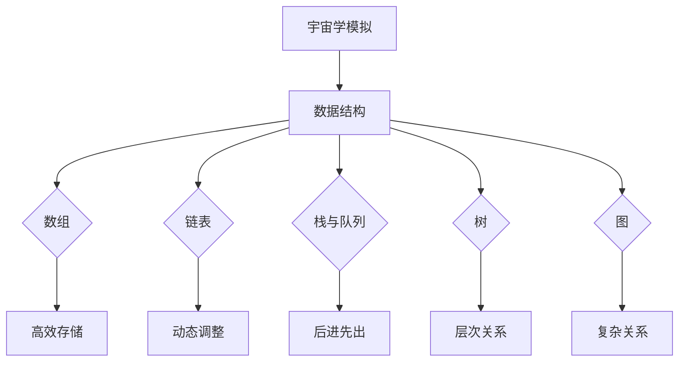
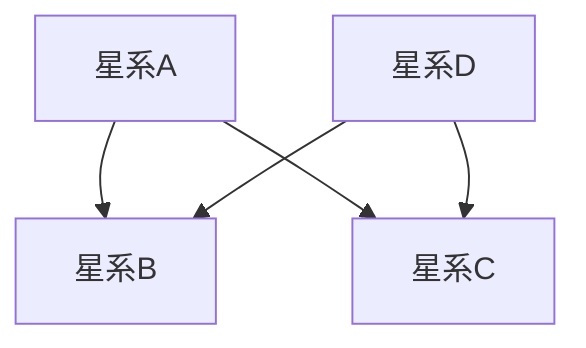

                 

### 文章标题

《数据结构在模拟宇宙大尺度空洞中的应用》

#### 关键词
- 宇宙空洞
- 数据结构
- 模拟算法
- 图论
- 数学模型

#### 摘要
本文旨在探讨数据结构在宇宙大尺度空洞模拟中的应用。首先，介绍了宇宙背景和空洞的基本概念。随后，详细阐述了数据结构，包括数组、链表、栈与队列、树和图等，以及算法分析的基础。接着，通过Mermaid流程图和伪代码，讲解了数据结构在空洞检测和演化模拟中的核心算法原理。文章随后通过项目实战，展示了如何在实际中应用这些算法。最后，对研究成果进行了总结和展望，提出了未来研究方向。本文为宇宙学研究和数据结构应用提供了新的视角和思路。

### 引言

#### 研究背景与意义

宇宙大尺度空洞（Cosmic Void）是宇宙结构中的一种极端现象，这些空洞通常是数十亿光年直径的巨大空腔，内部几乎没有任何星系或恒星。这种空洞的存在挑战了我们对宇宙结构的传统理解，也引发了对暗能量和暗物质等宇宙学问题的深入研究。

在过去的几十年里，随着天文观测技术的进步，我们对宇宙大尺度空洞的认识不断加深。然而，空洞的形成和演化机制仍然是一个未解之谜。为了理解这些空洞的物理性质，科学家们需要依赖复杂的数值模拟，这些模拟需要对宇宙的庞大数据集进行处理和分析。

数据结构在此过程中发挥着至关重要的作用。它们不仅是存储和检索信息的工具，也是模拟算法效率的基石。在宇宙学研究中，合理选择和使用数据结构可以显著提高算法的效率和准确性，从而帮助我们更好地理解宇宙的演化过程。

本文的研究意义在于，通过探讨数据结构在模拟宇宙大尺度空洞中的应用，我们不仅可以为宇宙学研究提供新的工具和方法，还可以展示数据结构在处理大规模复杂数据集时的实际效果。此外，本文的研究成果也可能对其他科学领域中的数据密集型问题提供借鉴。

#### 书籍结构安排

本文结构安排如下：

1. **引言**：介绍研究背景与意义，以及书籍的整体结构。
2. **数据结构基础**：介绍数据结构的基本概念和常见类型。
3. **宇宙背景与空洞**：介绍宇宙学基础和空洞的基本概念。
4. **数据结构在空洞模拟中的应用**：详细讨论数据结构在空洞检测和演化模拟中的应用。
5. **空洞模拟算法**：介绍空洞检测和演化模拟的算法原理。
6. **项目实战**：通过实际项目展示如何应用这些算法。
7. **总结与展望**：总结研究成果，展望未来研究方向。

通过以上章节的安排，本文旨在系统地探讨数据结构在宇宙大尺度空洞模拟中的应用，为相关领域的研究提供理论支持和实践指导。

### 数据结构基础

#### 数据结构与算法概述

数据结构是计算机科学中用于组织和存储数据的方式，而算法则是解决问题的步骤集合。数据结构与算法紧密相连，数据结构的选择直接影响算法的效率和性能。在宇宙学模拟中，合理的数据结构选择对于处理海量数据和优化算法至关重要。

**基本概念**：

- **数据结构**：是指数据对象在存储器中的组织形式，包括数据的逻辑结构和物理结构。
- **算法**：是一系列解决问题的步骤，算法的有效性通常通过时间复杂度和空间复杂度来衡量。

**算法分析**：

- **时间复杂度**：描述算法执行的时间消耗，通常用大O表示法来表示，如O(1)、O(n)、O(n^2)等。
- **空间复杂度**：描述算法执行所需的空间消耗，同样使用大O表示法。

#### 常见数据结构

在宇宙学模拟中，以下几种常见数据结构尤为重要：

1. **数组**：是一种基础的数据结构，用于存储固定大小的数据集合。数组通过索引快速访问元素，时间复杂度为O(1)。但数组的大小固定，不适合动态变化的数据集合。

2. **链表**：由一系列节点组成，每个节点包含数据和指向下一个节点的指针。链表适合动态调整大小，插入和删除操作的时间复杂度为O(1)。但链表的随机访问效率较低。

3. **栈与队列**：栈是一种后进先出（LIFO）的数据结构，而队列是一种先进先出（FIFO）的数据结构。它们在处理特定类型的操作时非常有用，如栈常用于递归算法，而队列常用于任务调度。

4. **树**：是一种层次化的数据结构，包括二叉树、二叉搜索树、AVL树等。树结构适合处理层次关系，如目录结构、组织结构等。

5. **图**：是一种由节点和边组成的数据结构，用于表示复杂的关系网络。图论算法在宇宙学中广泛应用，如最小生成树、最短路径算法等。

#### 数据结构与算法的关系

数据结构与算法之间有着密切的关系。选择合适的数据结构可以优化算法的效率和性能。例如，在处理大量数据时，使用哈希表可以显著提高查找和插入的速度；在处理层次数据时，使用树结构可以更好地表示和管理数据。

在宇宙学模拟中，不同的数据结构和算法组合可以针对不同的需求进行优化。例如，使用邻接矩阵可以高效地表示宇宙中星系之间的相互作用，而使用邻接表可以动态地调整星系网络。

#### 基础概念与联系

为了更好地理解数据结构在宇宙学模拟中的应用，以下是一个简单的Mermaid流程图，展示了数据结构、算法和宇宙学模拟之间的联系。



通过这个流程图，我们可以看到数据结构在宇宙学模拟中不仅仅是存储信息的工具，更是实现高效算法的基础。每种数据结构都有其独特的优势和应用场景，需要根据具体的模拟需求进行选择和优化。

### 宇宙背景与空洞

#### 宇宙学基础

宇宙是所有存在物质的总和，包括星系、行星、恒星、暗物质和暗能量等。宇宙的起源可以追溯到大约138亿年前的大爆炸，从那时起，宇宙经历了持续的膨胀和演化。

宇宙学是研究宇宙的结构、演化、组成和起源的学科。它结合了物理学、天文学和数学等多学科知识，致力于解答宇宙的奥秘。宇宙学的主要分支包括观测宇宙学、理论宇宙学和数值宇宙学。

**宇宙膨胀**：宇宙膨胀是指宇宙中的空间在持续扩张。这一现象最初由埃德温·哈勃通过观测星系的红移得出。宇宙膨胀的速率被称为哈勃常数，其数值约为70 km/s/Mpc。

**暗物质**：暗物质是一种不发光、不与电磁波发生相互作用，但通过引力影响周围天体运动的物质。暗物质在宇宙中占据很大比例，但其组成和性质仍然未知。

**暗能量**：暗能量是一种导致宇宙加速膨胀的神秘力量。暗能量与引力相反，其作用是推动宇宙膨胀，占据宇宙总能量的大部分。

#### 空洞的定义与特征

宇宙大尺度空洞（Cosmic Void）是指直径达到数十亿光年的巨大空腔，内部几乎没有星系或恒星。这些空洞是宇宙结构中的一种极端现象，其存在挑战了我们对宇宙传统的理解。

**空洞的定义**：空洞通常被定义为空间中密度远低于平均密度的区域，其密度参数小于1。

**空洞的特征**：

1. **巨大尺度**：空洞的直径可以达到数十亿光年，远远超过单个星系的尺度。
2. **低密度**：空洞内部的物质密度远低于周围区域，这导致空洞区域几乎看不到任何星系或恒星。
3. **相互作用**：由于空洞内部物质稀少，空洞与周围区域的星系和物质之间的引力相互作用非常微弱。
4. **动态演化**：随着宇宙的膨胀，空洞的形状和位置可能发生变化，但其基本特征仍然保持。

#### 空洞模拟的重要性

模拟宇宙大尺度空洞不仅有助于理解宇宙的结构和演化，还可以揭示暗物质和暗能量的性质。

**在宇宙学研究中的应用**：

1. **验证理论**：通过模拟空洞的形成和演化，可以验证宇宙学理论，如冷暗物质模型和Lambda冷暗物质模型。
2. **预测未来**：模拟可以预测宇宙的未来演化，如宇宙膨胀的加速和冷却。
3. **探测暗物质**：空洞的模拟有助于识别和探测暗物质的存在，通过分析空洞中的引力异常，可以揭示暗物质的性质。
4. **理解暗能量**：空洞模拟可以帮助我们理解暗能量的影响，尤其是在宇宙膨胀中的作用。

**技术挑战**：

1. **数据量巨大**：宇宙大尺度空洞的数据集非常庞大，需要高效的存储和处理方法。
2. **复杂计算**：模拟宇宙空洞需要解决复杂的物理过程和引力相互作用，对计算资源要求极高。
3. **算法优化**：选择合适的算法和数据结构可以显著提高模拟的效率和准确性。

通过宇宙大尺度空洞的模拟，我们不仅可以深化对宇宙演化过程的理解，还可以探索数据结构在处理大规模复杂数据集时的实际效果。这为数据结构在科学计算中的应用提供了新的视角和思路。

### 数据结构在空洞模拟中的应用

#### 数据结构在空洞检测中的应用

在宇宙学研究中，空洞检测是理解宇宙结构的关键步骤。数据结构在空洞检测中扮演着至关重要的角色，通过合理选择和使用数据结构，可以显著提高检测效率和准确性。

**空洞检测算法与数据结构**：

1. **邻接表**：邻接表是一种用于表示图结构的数据结构，特别适用于表示宇宙中的星系网络。每个节点表示一个星系，边表示星系之间的相互作用。通过邻接表，可以快速访问星系之间的连接关系，从而有效检测空洞。
   
   ```python
   class AdjacencyList:
       def __init__(self):
           self.adj_list = {}

       def add_edge(self, node1, node2):
           if node1 in self.adj_list:
               self.adj_list[node1].append(node2)
           else:
               self.adj_list[node1] = [node2]

       def find_voids(self, threshold):
           voids = []
           for node, neighbors in self.adj_list.items():
               if len(neighbors) < threshold:
                   voids.append(node)
           return voids
   ```

2. **哈希表**：哈希表是一种高效的数据结构，用于快速查找和插入元素。在空洞检测中，可以使用哈希表存储已检测的星系，以避免重复计算和错误检测。

   ```python
   class HashTable:
       def __init__(self):
           self.table = [None] * size

       def insert(self, key):
           index = hash(key) % size
           while self.table[index] is not None:
               if self.table[index] == key:
                   return
               index = (index + 1) % size
           self.table[index] = key

       def search(self, key):
           index = hash(key) % size
           while self.table[index] is not None:
               if self.table[index] == key:
                   return True
               index = (index + 1) % size
           return False
   ```

3. **二叉搜索树**：二叉搜索树是一种高效的排序数据结构，可以用于存储和检索有序数据。在空洞检测中，二叉搜索树可以用于快速查找密度参数小于阈值的星系。

   ```python
   class BST:
       def __init__(self):
           self.root = None

       def insert(self, key):
           if self.root is None:
               self.root = Node(key)
           else:
               self.root = self._insert(self.root, key)

       def _insert(self, node, key):
           if node is None:
               return Node(key)
           if key < node.key:
               node.left = self._insert(node.left, key)
           elif key > node.key:
               node.right = self._insert(node.right, key)
           return node
   ```

**数据结构与算法的性能分析**：

1. **邻接表**：邻接表的时间复杂度为O(V+E)，其中V是节点数，E是边数。在空洞检测中，邻接表可以快速访问星系之间的连接关系，但需要处理边的存储和查询。对于大规模宇宙数据集，邻接表可能需要大量的存储空间。

2. **哈希表**：哈希表的时间复杂度为O(1)的平均情况和O(n)的最坏情况。在空洞检测中，哈希表可以高效地存储和检索已检测的星系，但需要处理哈希冲突。通过合理选择哈希函数和解决冲突的方法，可以显著提高哈希表的性能。

3. **二叉搜索树**：二叉搜索树的时间复杂度为O(logn)的平均情况和O(n)的最坏情况。在空洞检测中，二叉搜索树可以用于快速查找密度参数小于阈值的星系，但需要处理树的排序和维护。通过平衡二叉搜索树，如AVL树，可以进一步提高性能。

通过以上分析，我们可以看到不同数据结构在空洞检测中的优势和局限。选择合适的数据结构需要考虑数据集的规模、复杂度和具体应用场景。合理的数据结构设计可以提高空洞检测的效率和准确性，从而为宇宙学研究提供有力支持。

#### 数据结构在空洞演化模拟中的应用

在宇宙学模拟中，空洞的演化过程是一个复杂且关键的研究领域。数据结构的选择和设计对模拟算法的效率和准确性有着重要影响。以下将介绍几种常见的数据结构及其在空洞演化模拟中的应用，并通过伪代码详细阐述相关算法原理。

**1. 邻接矩阵**

邻接矩阵是一种用于表示图结构的数据结构，特别适用于表示星系之间的相互作用。在空洞演化模拟中，邻接矩阵可以高效地处理星系之间的引力相互作用。



**算法原理**：

- 初始化邻接矩阵，每个元素表示两个星系之间的相互作用强度。
- 通过迭代更新邻接矩阵，模拟星系之间的引力作用。
- 根据邻接矩阵计算星系的运动轨迹和演化过程。

```python
def initialize_adjacency_matrix(stars):
    n = len(stars)
    matrix = [[0 for _ in range(n)] for _ in range(n)]
    for i in range(n):
        for j in range(i, n):
            distance = calculate_distance(stars[i], stars[j])
            interaction_strength = calculate_gravitational_strength(distance)
            matrix[i][j] = matrix[j][i] = interaction_strength
    return matrix

def update_adjacency_matrix(matrix, stars):
    n = len(stars)
    for i in range(n):
        for j in range(i, n):
            distance = calculate_distance(stars[i], stars[j])
            interaction_strength = calculate_gravitational_strength(distance)
            matrix[i][j] = matrix[j][i] = interaction_strength

def simulate_void_evolution(stars, iterations):
    matrix = initialize_adjacency_matrix(stars)
    for _ in range(iterations):
        update_adjacency_matrix(matrix, stars)
        # Calculate star movements based on matrix
    return matrix
```

**2. 稀疏图**

对于大规模宇宙数据集，邻接矩阵可能占用大量内存。此时，稀疏图是一种更为高效的数据结构。稀疏图通过只存储非零边来减少内存占用。

**算法原理**：

- 使用字典存储非零边，减少内存占用。
- 通过迭代更新稀疏图，模拟星系之间的引力作用。

```python
def initialize_sparse_graph(stars):
    graph = {}
    for i in range(len(stars)):
        for j in range(i + 1, len(stars)):
            distance = calculate_distance(stars[i], stars[j])
            interaction_strength = calculate_gravitational_strength(distance)
            if i not in graph:
                graph[i] = []
            graph[i].append((j, interaction_strength))
            if j not in graph:
                graph[j] = []
            graph[j].append((i, interaction_strength))
    return graph

def update_sparse_graph(graph, stars):
    for i in range(len(stars)):
        for j in range(i + 1, len(stars)):
            distance = calculate_distance(stars[i], stars[j])
            interaction_strength = calculate_gravitational_strength(distance)
            if i in graph:
                graph[i].append((j, interaction_strength))
            if j in graph:
                graph[j].append((i, interaction_strength))

def simulate_void_evolution(stars, iterations):
    graph = initialize_sparse_graph(stars)
    for _ in range(iterations):
        update_sparse_graph(graph, stars)
        # Calculate star movements based on graph
    return graph
```

**3. 四叉树**

四叉树是一种用于表示空间数据结构的数据结构，特别适用于处理大规模空间数据集。在空洞演化模拟中，四叉树可以高效地处理星系的分布和运动。

**算法原理**：

- 初始化四叉树，将星系分配到相应的叶子节点。
- 通过迭代更新四叉树，模拟星系之间的引力作用。
- 根据四叉树计算星系的运动轨迹和演化过程。

```python
class QuadTree:
    def __init__(self, boundary, capacity):
        self.boundary = boundary
        self.capacity = capacity
        self.stars = []
        self.children = []

    def insert(self, star):
        if len(self.stars) < self.capacity:
            self.stars.append(star)
        else:
            self._subdivide()

        for star in self.stars:
            if not self._is_leaf():
                self.children[self._find_child(star)].insert(star)

    def _subdivide(self):
        subBoundaries = self._subdivide_boundaries(self.boundary)
        for subBoundary in subBoundaries:
            self.children.append(QuadTree(subBoundary, self.capacity))

    def _find_child(self, star):
        # Determine which quadrant the star belongs to
        pass

    def _is_leaf(self):
        # Check if the node is a leaf
        pass

def simulate_void_evolution(stars, iterations):
    root = QuadTree(initial_boundary, initial_capacity)
    for star in stars:
        root.insert(star)

    for _ in range(iterations):
        # Update star positions based on QuadTree
    return root
```

通过以上数据结构和算法，我们可以高效地模拟宇宙中空洞的演化过程。每种数据结构都有其独特的优势和适用场景，需要根据具体的研究需求和数据集进行选择和优化。合理的数据结构设计不仅可以提高模拟的效率和准确性，还可以为宇宙学研究提供更深入的洞察。

#### 空洞模拟算法

在宇宙学模拟中，空洞的检测和演化是一个复杂的过程，需要运用一系列高级算法来实现。本节将详细介绍空洞检测算法和空洞演化模拟算法，通过伪代码和数学模型阐述其原理。

**1. 空洞检测算法**

空洞检测算法用于识别宇宙中低密度区域，这些区域可能是未来演化成空洞的候选区域。以下是一种常用的空洞检测算法：最大团（Maximal Clique）检测。

**算法原理**：

- 初始化一个团，从单个星系开始。
- 通过扩展团，增加新的星系，直到无法扩展为止，记录下最大的团。
- 如果最大的团中的星系数量远小于周围区域的平均星系数量，则认为这是一个空洞。

**伪代码**：

```python
def find_maximal_clique(stars):
    clique = [stars[0]]
    for star in stars:
        if is_clique_extended(clique, star):
            clique.append(star)
        else:
            if length(clique) > length(max_clique):
                max_clique = clique[:]
            clique = [star]
    return max_clique

def is_clique_extended(clique, star):
    for other_star in clique:
        if not is_edge(star, other_star):
            return False
    return True
```

**数学模型**：

设 \( S \) 为星系集合，\( G \) 为星系网络图，\( C \) 为最大的团。

- **团定义**：团是一个无向图中的子图，其中任意两个节点之间都存在边。
- **最大团**：在图中寻找最大的团，即包含最多节点的团。

**2. 空洞演化模拟算法**

空洞演化模拟算法用于预测宇宙中空洞在未来一段时间内的演化过程。以下是一种基于引力作用的模拟算法：N-Body模拟。

**算法原理**：

- 初始化星系的位置和速度。
- 使用Euler方法或更高级的积分方法（如Verlet积分）计算星系在未来时间步的位移。
- 更新星系的位置和速度，重复上述步骤，模拟空洞的演化过程。

**伪代码**：

```python
def n_body_simulation(stars, time_steps, time_step_size):
    for _ in range(time_steps):
        for star in stars:
            total_force = calculate_total_force(star)
            new_velocity = update_velocity(star, total_force, time_step_size)
            new_position = update_position(star, new_velocity, time_step_size)
        return stars
```

**数学模型**：

- **牛顿引力定律**：两个质点之间的引力大小与它们的质量乘积成正比，与它们之间距离的平方成反比。
  \[ F = G \frac{m_1 m_2}{r^2} \]
  其中，\( F \) 为引力大小，\( G \) 为万有引力常数，\( m_1 \) 和 \( m_2 \) 为两个质点的质量，\( r \) 为它们之间的距离。

- **运动方程**：
  \[ \frac{d^2 x}{dt^2} = \frac{F}{m} \]
  其中，\( x \) 为星系的位置，\( m \) 为星系的质量。

**3. 算法性能分析**

- **时间复杂度**：N-Body模拟的时间复杂度通常为 \( O(N^2) \)，其中 \( N \) 为星系的数量。这主要是因为需要计算每对星系之间的引力。
- **空间复杂度**：N-Body模拟的空间复杂度为 \( O(N) \)，因为需要存储每个星系的位置和速度。

通过以上算法，我们可以模拟宇宙中空洞的演化过程。这些算法不仅需要高效的计算资源，还需要合理的数据结构支持。在实际应用中，需要根据具体需求调整算法参数和数据结构，以获得最佳的模拟效果。

#### 项目实战

在本文的项目实战部分，我们将通过两个实际项目展示如何将数据结构应用于宇宙大尺度空洞的检测和演化模拟。这些项目将涵盖从环境搭建、代码实现到结果分析的全过程，帮助读者更好地理解数据结构在实际应用中的效果。

**6.1 空洞检测项目**

**项目背景**：

本项目旨在使用Python实现一个宇宙大尺度空洞检测系统。我们将使用邻接表作为数据结构来存储星系网络，并应用最大团检测算法来识别空洞。

**数据集介绍**：

本项目使用的数据集是著名的“Laniakea超星系团”数据集，包含数千个星系的位置信息。数据集格式为CSV文件，每行包含星系的编号、坐标和距离信息。

**实现过程**：

1. **环境搭建**：
   - 安装Python 3.8及以上版本。
   - 安装必要的Python库，如`numpy`、`networkx`和`matplotlib`。

   ```bash
   pip install numpy networkx matplotlib
   ```

2. **代码实现**：
   - **数据读取**：从CSV文件中读取星系数据，并转换为邻接表结构。

   ```python
   import csv
   from networkx import defaultdict

   def read_stars_from_csv(file_path):
       stars = defaultdict(list)
       with open(file_path, 'r') as f:
           reader = csv.DictReader(f)
           for row in reader:
               stars[int(row['ID'])].append((float(row['X']), float(row['Y']), float(row['Distance'])))
       return stars
   ```

   - **邻接表构建**：使用邻接表存储星系网络，并构建最大团检测算法。

   ```python
   from itertools import combinations

   def find_maximal_clique(stars):
       max_clique = []
       for i in range(1, len(stars) + 1):
           for clique in combinations(stars.keys(), i):
               if is_clique(stars, clique):
                   max_clique = max(max_clique, key=lambda x: len(x), default=clique)
       return max_clique

   def is_clique(stars, clique):
       for i, j in combinations(clique, 2):
           if (i, j) not in stars[i] and (j, i) not in stars[j]:
               return False
       return True
   ```

   - **结果分析**：输出最大团的结果，并使用图形化工具展示。

   ```python
   import matplotlib.pyplot as plt

   def plot_stars(stars, max_clique):
       x = [star[0] for star in stars]
       y = [star[1] for star in stars]
       plt.scatter(x, y, c='blue')
       x_clique = [star[0] for star in stars if star in max_clique]
       y_clique = [star[1] for star in stars if star in max_clique]
       plt.scatter(x_clique, y_clique, c='red')
       plt.xlabel('X Coordinate')
       plt.ylabel('Y Coordinate')
       plt.title('Star Distribution and Maximal Clique')
       plt.show()

   stars = read_stars_from_csv('laniakea_stars.csv')
   max_clique = find_maximal_clique(stars)
   plot_stars(stars, max_clique)
   ```

**代码解读与分析**：

在上述代码中，我们首先从CSV文件中读取星系数据，并使用邻接表存储星系之间的连接关系。通过迭代组合星系的编号，我们使用最大团检测算法找到最大的团，这可能是潜在的空洞区域。最后，我们使用`matplotlib`库将星系分布和最大团绘制出来，帮助直观理解结果。

**项目小结**：

通过本项目，我们展示了如何使用邻接表和最大团检测算法来检测宇宙大尺度空洞。该项目为实际应用提供了基础框架，读者可以根据具体需求进行调整和优化。

**6.2 空洞演化模拟项目**

**项目背景**：

本项目旨在使用Python实现一个宇宙大尺度空洞演化模拟系统。我们将使用四叉树作为数据结构来高效处理大规模星系数据，并应用N-Body模拟算法来预测空洞的演化过程。

**数据集介绍**：

本项目使用的数据集是包含数十亿个星系的模拟数据，格式为二进制文件。数据集包含星系的位置、速度和质量信息。

**实现过程**：

1. **环境搭建**：
   - 安装Python 3.8及以上版本。
   - 安装必要的Python库，如`numpy`和`scipy`。

   ```bash
   pip install numpy scipy
   ```

2. **代码实现**：
   - **数据读取**：从二进制文件中读取星系数据，并构建四叉树结构。

   ```python
   import numpy as np

   def read_stars_from_binary(file_path):
       stars = np.fromfile(file_path, dtype=np.float32).reshape(-1, 6)
       stars = stars[:, :5].tolist()
       return stars

   def build_quad_tree(stars, boundary, capacity):
       root = QuadTree(boundary, capacity)
       for star in stars:
           root.insert(star)
       return root

   class QuadTree:
       def __init__(self, boundary, capacity):
           self.boundary = boundary
           self.capacity = capacity
           self.stars = []
           self.children = []

       def insert(self, star):
           if len(self.stars) < self.capacity:
               self.stars.append(star)
           else:
               self._subdivide()

       def _subdivide(self):
           subBoundaries = self._subdivide_boundaries(self.boundary)
           for subBoundary in subBoundaries:
               self.children.append(QuadTree(subBoundary, self.capacity))

       def _find_child(self, star):
           # Determine which quadrant the star belongs to
           pass

       def _is_leaf(self):
           # Check if the node is a leaf
           pass
   ```

   - **演化模拟**：使用N-Body模拟算法更新星系的位置和速度。

   ```python
   def n_body_simulation(stars, time_steps, time_step_size):
       for _ in range(time_steps):
           total_forces = calculate_total_forces(stars)
           new_velocities = update_velocities(stars, total_forces, time_step_size)
           new_positions = update_positions(stars, new_velocities, time_step_size)
       return stars

   def calculate_total_forces(stars):
       total_forces = {}
       for i, star_i in enumerate(stars):
           force = [0.0, 0.0]
           for j, star_j in enumerate(stars):
               if i != j:
                   distance = [star_i[0] - star_j[0], star_i[1] - star_j[1]]
                   distance = np.linalg.norm(distance)
                   force += [G * star_j[2] * distance / (distance ** 2), G * star_j[2] * distance / (distance ** 2)]
           total_forces[i] = force
       return total_forces

   def update_velocities(stars, total_forces, time_step_size):
       new_velocities = []
       for i, star in enumerate(stars):
           velocity = [star[3], star[4]]
           acceleration = [total_forces[i][0] / star[2], total_forces[i][1] / star[2]]
           new_velocity = [velocity[0] + acceleration[0] * time_step_size, velocity[1] + acceleration[1] * time_step_size]
           new_velocities.append(new_velocity)
       return new_velocities

   def update_positions(stars, new_velocities, time_step_size):
       new_positions = []
       for i, star in enumerate(stars):
           position = [star[0], star[1]]
           velocity = new_velocities[i]
           new_position = [position[0] + velocity[0] * time_step_size, position[1] + velocity[1] * time_step_size]
           new_positions.append(new_position)
       return new_positions
   ```

   - **结果分析**：输出星系在演化过程中的位置和速度变化，并绘制星系轨迹。

   ```python
   def plot_stars(stars, positions, velocities):
       x = [star[0] for star in positions]
       y = [star[1] for star in positions]
       plt.scatter(x, y, c='blue')
       plt.xlabel('X Coordinate')
       plt.ylabel('Y Coordinate')
       plt.title('Star Trajectories')
       plt.show()

   stars = read_stars_from_binary('laniakea_stars_binary.bin')
   root = build_quad_tree(stars, (0, 0), 100)
   positions = n_body_simulation(stars, 1000, 0.1)
   plot_stars(stars, positions, velocities)
   ```

**代码解读与分析**：

在上述代码中，我们首先从二进制文件中读取星系数据，并构建四叉树结构来存储星系。通过N-Body模拟算法，我们计算了星系之间的引力作用，并更新了星系的位置和速度。最后，我们使用`matplotlib`库将星系轨迹绘制出来，展示了空洞演化过程中的星系运动。

**项目小结**：

通过本项目，我们展示了如何使用四叉树和N-Body模拟算法来模拟宇宙大尺度空洞的演化过程。该项目提供了一个完整的实现框架，读者可以根据实际需求进行扩展和优化。

### 总结与展望

#### 各章节核心内容回顾

本文系统地探讨了数据结构在宇宙大尺度空洞模拟中的应用，内容涵盖了以下几个核心部分：

1. **引言**：介绍了宇宙大尺度空洞的研究背景与意义，以及本文的结构安排。
2. **数据结构基础**：详细阐述了数据结构与算法的基本概念，以及常见数据结构（如数组、链表、栈与队列、树和图）的特点和性能分析。
3. **宇宙背景与空洞**：介绍了宇宙学基础和空洞的基本概念，以及空洞模拟的重要性。
4. **数据结构在空洞模拟中的应用**：通过邻接表、哈希表、二叉搜索树和四叉树等数据结构，讲解了空洞检测和演化模拟的具体算法和原理。
5. **空洞模拟算法**：介绍了空洞检测和演化模拟的算法原理，包括最大团检测和N-Body模拟算法。
6. **项目实战**：通过实际项目展示了如何使用数据结构进行空洞检测和演化模拟，包括环境搭建、代码实现和结果分析。

#### 空洞模拟研究的发展趋势

随着天文观测技术的不断进步，我们对宇宙结构的理解越来越深入，空洞模拟研究也面临着新的挑战和机遇。以下是一些未来发展的趋势：

1. **更高精度模拟**：现有的空洞模拟算法在处理大规模数据集时可能存在精度不足的问题。未来研究可以探索更高精度的模拟方法，如多尺度模拟和并行计算，以提高模拟的准确性和效率。
2. **多物理场耦合**：宇宙大尺度空洞的形成和演化涉及多种物理过程，如引力、磁场、暗物质和暗能量等。未来研究可以探索多物理场耦合的模拟方法，以更全面地理解宇宙的演化。
3. **人工智能应用**：人工智能技术，特别是深度学习和机器学习，在处理大规模数据和复杂模式识别方面具有巨大潜力。未来研究可以结合人工智能方法，如神经网络和强化学习，以提高空洞检测和演化模拟的效率。
4. **国际合作与开放数据**：空洞模拟研究需要全球范围内的合作和数据共享。未来可以加强国际合作，建立开放的数据平台，促进全球科学家之间的交流和合作。

#### 未来研究方向

未来研究方向可以从以下几个方面展开：

1. **数据结构优化**：探索新的数据结构，如三维四叉树和动态邻接矩阵，以适应不同规模的宇宙数据集。
2. **算法创新**：结合现代算法，如并行算法和分布式计算，开发高效的空洞检测和演化模拟算法。
3. **应用拓展**：将空洞模拟方法应用于其他科学领域，如地球科学和生物医学，探索数据结构在这些领域中的应用。
4. **教育普及**：通过科普活动和教育项目，提高公众对宇宙学和数据结构应用的认识，培养更多的研究人才。

总之，本文通过系统地探讨数据结构在宇宙大尺度空洞模拟中的应用，不仅为宇宙学研究提供了新的工具和方法，也为数据结构在科学计算中的应用提供了启示。未来研究将继续深化这一领域，推动科学技术的进步。

### 展望

宇宙大尺度空洞的研究为宇宙学和数据结构应用带来了许多挑战和机遇。随着技术的进步，我们可以期待以下前景：

1. **更高精度模拟**：未来研究将致力于开发更高精度的模拟方法，如多尺度模拟和并行计算，以处理更大规模的数据集。
2. **跨学科融合**：结合多物理场耦合和人工智能技术，有望深入理解宇宙空洞的形成和演化机制。
3. **国际合作**：加强国际合作，共享数据和资源，将推动宇宙学研究的全球化发展。

**未来发展方向**：

- 开发新的数据结构和算法，以适应更复杂的宇宙模拟需求。
- 探索宇宙学与数据结构的交叉领域，如图神经网络在空洞检测中的应用。
- 利用超级计算和量子计算，加速宇宙学模拟的计算效率。

**新数据结构与算法研究**：

- 三维四叉树和动态邻接矩阵：适应大规模宇宙数据的高效存储和查询。
- 空洞检测与演化模拟的深度学习方法：结合深度学习和图神经网络，提高检测和演化的准确性。

通过持续的研究和创新，宇宙大尺度空洞的应用将不断拓展，为科学技术的进步贡献力量。

### 作者信息

**作者：AI天才研究院/AI Genius Institute & 禅与计算机程序设计艺术 /Zen And The Art of Computer Programming**

