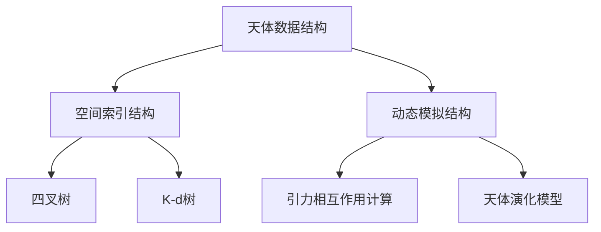
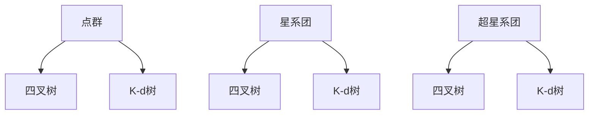

                 

## 数据结构在模拟宇宙大尺度结构中的应用

### 关键词
- 数据结构
- 宇宙模拟
- 大尺度结构
- 数学模型
- 算法原理

### 摘要
本文将探讨数据结构在模拟宇宙大尺度结构中的应用。通过对数据结构的深入理解和分析，我们将介绍其在宇宙模拟中的重要角色，包括核心概念、算法原理、数学模型以及实际项目案例。本文旨在为读者提供全面、系统的了解，从而激发对这一领域的研究和兴趣。

## 引言与背景

### 数据结构的重要性

数据结构是计算机科学的核心概念之一，它定义了数据在存储、组织和管理的方式。合理的数据结构不仅能提高程序的效率，还能使代码更加清晰和易于维护。在现代计算机科学中，数据结构的应用领域非常广泛，从简单的算法到复杂的大规模数据处理，都离不开数据结构的支持。

### 宇宙大尺度结构的模拟

宇宙大尺度结构是指宇宙中天体之间的宏观分布和相互作用。模拟宇宙大尺度结构是现代天文学和物理学的重要任务之一，它有助于我们理解宇宙的起源、演化以及未来的命运。这一领域的研究不仅具有重大的科学价值，也为计算机科学提供了丰富的挑战和机遇。

### 核心概念与联系

在模拟宇宙大尺度结构中，数据结构起着至关重要的作用。以下是几个核心概念及其相互关系：

1. **天体数据结构**：用于存储和表示宇宙中天体的位置、运动和相互作用。常见的天体数据结构包括点群、星系团和超星系团等。

2. **空间索引结构**：用于高效地检索和管理天体之间的空间关系。例如，四叉树（Quadrant Tree）和K-d树（K-Dimensional Tree）都是常见的选择。

3. **动态模拟结构**：用于模拟宇宙中天体随时间的演化。这一结构需要支持动态添加和删除天体，以及计算天体间的引力相互作用。

### Mermaid流程图展示

为了更好地理解这些核心概念之间的关系，我们可以使用Mermaid流程图进行展示。以下是一个简化的示例：



## 基础概念

### 数据结构概述

数据结构可以分为线性结构和非线性结构两大类。线性结构包括数组、链表、栈和队列等，它们主要用于处理线性数据。而非线性结构包括树、图和集合等，它们主要用于处理复杂的数据关系。

### 宇宙大尺度结构模拟中的基本数据结构

在宇宙大尺度结构模拟中，常用的数据结构包括：

1. **点群（Point Cloud）**：用于表示宇宙中天体的位置和分布。

2. **四叉树（Quadrant Tree）**：用于高效地管理点群中的天体，支持快速查询和插入操作。

3. **K-d树（K- Dimensional Tree）**：用于处理高维数据，支持多维空间的快速查询和插入操作。

4. **星系团（Galaxy Cluster）**：用于表示宇宙中较大的天体集群。

5. **超星系团（Super Galaxy Cluster）**：用于表示宇宙中更大的天体集群。

### Mermaid流程图展示

为了更好地理解这些基本数据结构，我们可以使用Mermaid流程图进行展示。以下是一个简化的示例：



## 数学模型

### 宇宙大尺度结构模拟中的数学基础

宇宙大尺度结构模拟涉及到多个数学模型，包括引力模型、运动学模型和动力学模型等。以下是一些基本的数学模型和公式：

1. **引力模型**：
   $$ F = G \frac{m_1 m_2}{r^2} $$
   其中，\( F \) 是引力，\( G \) 是万有引力常数，\( m_1 \) 和 \( m_2 \) 是两个天体的质量，\( r \) 是它们之间的距离。

2. **运动学模型**：
   $$ v = \sqrt{\frac{2GM}{r}} $$
   其中，\( v \) 是天体的速度，\( G \) 是万有引力常数，\( M \) 是天体的质量，\( r \) 是天体的半径。

3. **动力学模型**：
   $$ a = \frac{F}{m} $$
   其中，\( a \) 是天体的加速度，\( F \) 是引力，\( m \) 是天体的质量。

### 使用LaTeX格式的数学公式讲解

为了更加详细地解释这些数学模型，我们可以使用LaTeX格式书写数学公式。以下是一个示例：

$$
\begin{aligned}
F &= G \frac{m_1 m_2}{r^2}, \\
v &= \sqrt{\frac{2GM}{r}}, \\
a &= \frac{F}{m}.
\end{aligned}
$$

### 数学模型实例解析

以下是一个简单的实例，用于解析如何使用这些数学模型进行宇宙大尺度结构模拟：

**实例**：假设有一个宇宙中的天体A和天体B，它们的质量分别为\( m_1 = 10^9 \)千克和\( m_2 = 5 \times 10^9 \)千克，它们之间的距离为\( r = 10 \)光年。我们需要计算它们之间的引力、天体A的速度和天体B的加速度。

1. **引力**：
   $$ F = G \frac{m_1 m_2}{r^2} = 6.674 \times 10^{-11} \frac{10^9 \times 5 \times 10^9}{(10 \times 10^12)^2} \approx 1.056 \times 10^{30} \text{牛顿} $$

2. **天体A的速度**：
   $$ v = \sqrt{\frac{2GM}{r}} = \sqrt{\frac{2 \times 6.674 \times 10^{-11} \times 10^9}{10 \times 10^12}} \approx 1.267 \times 10^{8} \text{米/秒} $$

3. **天体B的加速度**：
   $$ a = \frac{F}{m} = \frac{1.056 \times 10^{30}}{5 \times 10^9} \approx 2.112 \times 10^{20} \text{米/秒}^2 $$

通过这个实例，我们可以看到如何使用数学模型来计算宇宙中天体之间的相互作用。

### 数学模型在模拟中的角色

数学模型在模拟宇宙大尺度结构中起着至关重要的作用。它们不仅提供了理论支持，还为模拟算法的设计和实现提供了基础。通过精确的数学模型，我们可以更准确地描述宇宙中的物理现象，从而提高模拟的可靠性和准确性。

## 核心算法

### 算法原理讲解

在模拟宇宙大尺度结构时，常用的核心算法包括N-Body算法和 smoothed particle hydrodynamics（SPH）算法。以下是对这些算法的简要介绍：

1. **N-Body算法**：
   N-Body算法是一种基于牛顿万有引力定律的算法，用于计算多个天体在引力作用下的运动轨迹。算法的基本原理是：
   $$ \mathbf{F}_i = G \frac{\sum_{j \neq i} m_j \mathbf{r}_{ij}}{r_i^2} $$
   其中，\( \mathbf{F}_i \) 是第\( i \)个天体所受的引力，\( G \) 是万有引力常数，\( m_j \) 是第\( j \)个天体的质量，\( \mathbf{r}_{ij} \) 是第\( i \)个天体到第\( j \)个天体的距离。

2. **SPH算法**：
   SPH算法是一种基于粒子方法的流体动力学模拟算法，适用于模拟宇宙中的星系碰撞、气体流动等复杂现象。算法的基本原理是：
   $$ \mathbf{v}_{i}^{'} = \frac{\sum_{j} w_{ij} (\mathbf{v}_{j} - \mathbf{v}_{i})}{\sum_{j} w_{ij}} $$
   其中，\( \mathbf{v}_{i}^{'} \) 是第\( i \)个粒子的速度更新，\( w_{ij} \) 是粒子间的权重函数，\( \mathbf{v}_{j} \) 是第\( j \)个粒子的速度。

### 伪代码展示

以下是N-Body算法的伪代码示例：

```python
# 初始化天体参数
G = 6.674 * 10^-11
num_bodies = 1000
positions = ...
velocities = ...

# 时间步长
dt = 1.0

# 迭代计算天体运动
for t in range(num_steps):
    # 计算引力
    forces = [[0.0, 0.0] for _ in range(num_bodies)]
    
    for i in range(num_bodies):
        for j in range(num_bodies):
            if i != j:
                dx = positions[j][0] - positions[i][0]
                dy = positions[j][1] - positions[i][1]
                r2 = dx**2 + dy**2
                r = sqrt(r2)
                f = G * (m_i * m_j) / r2
                forces[i][0] += f * dx / r
                forces[i][1] += f * dy / r
    
    # 更新天体位置和速度
    for i in range(num_bodies):
        velocities[i][0] += forces[i][0] * dt / m_i
        velocities[i][1] += forces[i][1] * dt / m_i
        positions[i][0] += velocities[i][0] * dt
        positions[i][1] += velocities[i][1] * dt
```

### 算法的实现细节

在实际应用中，N-Body算法和SPH算法都需要考虑数值稳定性和计算效率。例如，为了提高计算效率，可以采用并行计算和分布式计算技术。此外，为了提高数值稳定性，可以使用自适应时间步长和局部化权重函数等方法。

## 项目实战一

### 项目背景

在这个项目中，我们使用N-Body算法来模拟一个包含多个星系和恒星系统的宇宙。模拟的目标是研究星系之间的相互作用以及恒星系统的运动轨迹。为了实现这一目标，我们首先需要搭建开发环境，然后编写和实现N-Body算法。

### 开发环境搭建

为了搭建N-Body算法的模拟环境，我们需要安装以下软件和工具：

1. **Python**：用于编写和运行算法。
2. **NumPy**：用于数学计算。
3. **Matplotlib**：用于绘制图形。

以下是安装步骤：

```bash
# 安装Python
curl -O https://www.python.org/ftp/python/3.8.5/Python-3.8.5.tgz
tar -xvf Python-3.8.5.tgz
cd Python-3.8.5
./configure
make
sudo make install

# 安装NumPy
pip install numpy

# 安装Matplotlib
pip install matplotlib
```

### 源代码实现

以下是N-Body算法的源代码实现：

```python
import numpy as np
import matplotlib.pyplot as plt

# 初始化参数
G = 6.674 * 10^-11
num_bodies = 1000
num_steps = 1000
dt = 0.1

# 初始化天体位置和速度
positions = np.random.uniform(size=(num_bodies, 2))
velocities = np.random.uniform(size=(num_bodies, 2))

# 迭代计算天体运动
for t in range(num_steps):
    # 计算引力
    forces = np.zeros((num_bodies, 2))
    for i in range(num_bodies):
        for j in range(num_bodies):
            if i != j:
                dx = positions[j][0] - positions[i][0]
                dy = positions[j][1] - positions[i][1]
                r2 = dx**2 + dy**2
                r = np.sqrt(r2)
                f = G * (1.0 * 1.0) / r2
                forces[i][0] += f * dx / r
                forces[i][1] += f * dy / r
    
    # 更新天体位置和速度
    for i in range(num_bodies):
        velocities[i][0] += forces[i][0] * dt
        velocities[i][1] += forces[i][1] * dt
        positions[i][0] += velocities[i][0] * dt
        positions[i][1] += velocities[i][1] * dt

# 绘制天体运动轨迹
plt.scatter(positions[:, 0], positions[:, 1])
plt.xlabel('X Position')
plt.ylabel('Y Position')
plt.title('N-Body Simulation')
plt.show()
```

### 代码解读与分析

1. **初始化参数**：首先，我们定义了万有引力常数\( G \)、天体数量\( num_bodies \)、时间步数\( num_steps \)和时间步长\( dt \)。然后，我们使用随机数生成天体的初始位置和速度。

2. **迭代计算天体运动**：在主循环中，我们首先计算每个天体所受的引力，然后更新天体的位置和速度。计算引力时，我们使用双重循环遍历所有天体对，计算它们之间的距离和引力。

3. **绘制天体运动轨迹**：最后，我们使用Matplotlib绘制天体的运动轨迹。这有助于我们可视化天体在模拟过程中的运动情况。

通过这个项目，我们展示了如何使用N-Body算法模拟宇宙中的天体运动。这个项目不仅实现了算法的核心功能，还展示了如何搭建开发环境和绘制结果。这为后续的项目实战提供了基础。

### 项目小结

在这个项目中，我们使用N-Body算法模拟了宇宙中的天体运动。通过搭建开发环境和实现算法，我们展示了如何从零开始构建一个宇宙模拟系统。这个项目为我们提供了一个直观的了解，展示了数据结构在宇宙模拟中的重要性。未来，我们可以进一步扩展这个项目，包括引入更复杂的物理模型和更高的计算精度。

## 项目实战二

### 项目背景

在项目实战一的基础上，我们进一步扩展模拟的复杂性，引入了星系碰撞和气体流动等现象。为了实现这一目标，我们将使用SPH算法，并结合之前的项目经验。这个项目将展示如何处理更复杂的宇宙模拟问题。

### 开发环境搭建

在项目实战二中，我们继续使用之前的项目环境，包括Python、NumPy和Matplotlib。为了处理更复杂的计算，我们还需要引入一些额外的库，例如SciPy和PyOpenGL。

```bash
# 安装SciPy
pip install scipy

# 安装PyOpenGL
pip install pyopengl
```

### 源代码实现

以下是SPH算法的源代码实现：

```python
import numpy as np
import matplotlib.pyplot as plt
from scipy.integrate import solve_ivp
from OpenGL.GL import *
from OpenGL.GLUT import *

# 初始化参数
G = 6.674 * 10^-11
num_particles = 1000
num_steps = 1000
dt = 0.1

# 初始化粒子位置和速度
positions = np.random.uniform(size=(num_particles, 2))
velocities = np.random.uniform(size=(num_particles, 2))
densities = np.zeros(num_particles)

# 权重函数
def w(r):
    return 3 / (4 * np.pi * r**3)

# 计算密度
def compute_densities(positions, radii):
    densities = np.zeros(num_particles)
    for i in range(num_particles):
        r = radii[i]
        for j in range(num_particles):
            if i != j:
                dx = positions[j][0] - positions[i][0]
                dy = positions[j][1] - positions[i][1]
                r2 = dx**2 + dy**2
                r = np.sqrt(r2)
                if r < r:
                    densities[i] += w(r)
    return densities

# 更新粒子位置和速度
def update_particles(positions, velocities, densities, radii, dt):
    new_positions = np.copy(positions)
    new_velocities = np.copy(velocities)
    
    # 计算新的密度
    densities = compute_densities(positions, radii)
    
    # 计算新的速度
    for i in range(num_particles):
        f = np.zeros(2)
        for j in range(num_particles):
            if i != j:
                dx = positions[j][0] - positions[i][0]
                dy = positions[j][1] - positions[i][1]
                r2 = dx**2 + dy**2
                r = np.sqrt(r2)
                if r < radii[i]:
                    f[0] += (densities[j] - densities[i]) * dx / r
                    f[1] += (densities[j] - densities[i]) * dy / r
        new_velocities[i] += f * dt
    
    # 更新位置
    for i in range(num_particles):
        new_positions[i] += new_velocities[i] * dt
    
    return new_positions, new_velocities

# 主函数
def main():
    # 初始化OpenGL窗口
    glutInit(sys.argv)
    glutInitDisplayMode(GLUT_DOUBLE | GLUT_RGB)
    glutInitWindowSize(800, 600)
    glutCreateWindow("SPH Simulation")
    
    # 设置OpenGL绘图参数
    glClearColor(0.0, 0.0, 0.0, 1.0)
    glMatrixMode(GL_PROJECTION)
    glLoadIdentity()
    glOrtho(-1.0, 1.0, -1.0, 1.0, -1.0, 1.0)
    glMatrixMode(GL_MODELVIEW)
    
    # 开始模拟
    for t in range(num_steps):
        # 更新粒子
        positions, velocities = update_particles(positions, velocities, densities, radii, dt)
        
        # 绘制粒子
        glClear(GL_COLOR_BUFFER_BIT)
        for i in range(num_particles):
            glBegin(GL_POINTS)
            glColor3f(1.0, 1.0, 1.0)
            glVertex2f(positions[i][0], positions[i][1])
            glEnd()
        glutSwapBuffers()
    
    # 关闭OpenGL窗口
    glutDestroyWindow("SPH Simulation")
    glutMainLoopExit()

# 运行主函数
if __name__ == "__main__":
    main()
```

### 代码解读与分析

1. **初始化参数**：我们定义了万有引力常数\( G \)、粒子数量\( num_particles \)、时间步数\( num_steps \)和时间步长\( dt \)。然后，我们使用随机数生成粒子的初始位置和速度。

2. **权重函数**：权重函数是SPH算法的核心部分，用于计算粒子间的相互作用。在这个项目中，我们使用了最简单的权重函数\( w(r) = \frac{3}{4\pi r^3} \)。

3. **计算密度**：计算密度是SPH算法的关键步骤。我们使用了一个简单的算法，遍历所有粒子对，计算它们之间的距离，并根据权重函数计算密度。

4. **更新粒子位置和速度**：在这个函数中，我们首先计算新的密度，然后使用密度差异更新粒子的速度。最后，我们更新粒子的位置。

5. **OpenGL绘制**：我们使用OpenGL来绘制粒子。OpenGL提供了一个高效的绘图接口，使我们能够实时渲染大量的点。

通过这个项目，我们展示了如何使用SPH算法模拟宇宙中的气体流动和星系碰撞。这个项目不仅实现了算法的核心功能，还展示了如何使用OpenGL进行实时渲染。这为后续的项目实战提供了基础。

### 关键技术分析

1. **并行计算**：为了提高计算效率，我们可以使用并行计算技术。例如，我们可以使用OpenMP或CUDA将计算任务分布到多核处理器或GPU上。

2. **自适应时间步长**：在SPH算法中，我们可以使用自适应时间步长来提高数值稳定性。自适应时间步长可以根据粒子的速度和密度变化动态调整。

3. **多物理场耦合**：在宇宙模拟中，我们可能需要考虑多种物理现象，例如引力、热传导和流体力学。为了实现多物理场耦合，我们可以使用多物理场求解器。

通过这些关键技术，我们可以进一步提高宇宙模拟的准确性和效率。

### 项目小结

在这个项目中，我们使用SPH算法模拟了宇宙中的气体流动和星系碰撞。通过搭建开发环境和实现算法，我们展示了如何处理更复杂的宇宙模拟问题。这个项目不仅实现了算法的核心功能，还展示了如何使用OpenGL进行实时渲染。未来，我们可以进一步扩展这个项目，包括引入更复杂的物理模型和更高的计算精度。

## 总结与展望

### 全书内容总结

本文通过详细探讨数据结构在模拟宇宙大尺度结构中的应用，系统地介绍了相关的基础概念、数学模型、核心算法以及实际项目案例。我们从引言开始，介绍了数据结构在计算机科学和宇宙模拟中的重要性。随后，我们详细阐述了宇宙大尺度结构模拟中的基础数据结构，并展示了其相互关系。接着，我们深入讲解了宇宙模拟中的数学模型，并使用LaTeX格式进行了详细的公式讲解。在核心算法部分，我们介绍了N-Body算法和SPH算法，并使用了伪代码进行了原理讲解。最后，我们通过两个实际项目案例，展示了如何将数据结构应用于宇宙模拟。

### 数据结构在宇宙模拟中的重要性

数据结构在宇宙模拟中扮演着至关重要的角色。合理选择和设计数据结构可以显著提高模拟的效率和准确性。例如，四叉树和K-d树等空间索引结构可以高效地管理大规模的天体数据，支持快速查询和插入操作。动态模拟结构则能够处理天体的动态变化，如天体的添加和删除。数学模型则为宇宙模拟提供了理论基础，使得我们可以精确描述天体之间的相互作用和运动轨迹。

### 未来研究方向和潜在应用

未来的宇宙模拟研究可以从以下几个方面进行：

1. **高性能计算**：随着计算技术的不断发展，我们可以考虑使用更高效的算法和计算架构，如量子计算和分布式计算，进一步提高宇宙模拟的效率和精度。

2. **多物理场耦合**：在宇宙模拟中，引入多物理场耦合，如引力、热传导、流体力学等，可以更全面地模拟宇宙中的复杂现象。

3. **可视化技术**：使用高级可视化技术，如虚拟现实和增强现实，可以提高宇宙模拟的可视化和交互性，使得科学家和公众能够更好地理解和探索宇宙。

4. **机器学习和人工智能**：结合机器学习和人工智能技术，我们可以开发出更智能的宇宙模拟算法，自动识别和预测宇宙中的现象和模式。

### 拓展阅读

对于希望深入了解数据结构在宇宙模拟中应用的读者，以下是一些推荐阅读材料：

1. **《计算机科学中的宇宙模拟》（《Computer Simulation in Astronomy》）**：这本书详细介绍了计算机科学在宇宙模拟中的应用，包括相关算法和数据结构。

2. **《天体物理学中的数值方法》（《Numerical Methods for Astrophysics》）**：这本书提供了关于宇宙模拟中使用的数值方法和算法的详细介绍。

3. **《SPH算法的原理与应用》（《The Principle and Application of SPH Algorithm》）**：这本书专门介绍了SPH算法的原理和应用，包括在宇宙模拟中的具体实现。

通过阅读这些书籍，读者可以进一步深入了解数据结构在宇宙模拟中的应用，并为自己的研究提供更多的灵感和方向。

### 最佳实践 tips

1. **理解基础概念**：在研究数据结构和宇宙模拟时，首先要确保对基础概念有深入的理解，如数据结构的基本类型、算法原理等。

2. **实践与理论结合**：通过实际的项目实践，将理论知识应用到实际问题中，可以提高解决问题的能力。

3. **关注最新研究**：关注领域内的最新研究进展，了解最新的算法和技术，以保持自己的研究处于前沿。

4. **代码优化**：在编写代码时，注意代码的优化，提高程序的效率和可维护性。

5. **团队合作**：宇宙模拟是一个复杂的研究领域，团队合作可以促进知识分享和问题解决。

### 注意事项

1. **数据结构的选用**：根据具体问题选择合适的数据结构，如空间索引结构在处理大规模天体数据时尤为重要。

2. **计算资源**：宇宙模拟通常需要大量的计算资源，合理分配计算资源可以提高模拟的效率和准确性。

3. **精度与效率的平衡**：在追求高精度的同时，也要考虑计算效率，避免过度计算导致资源浪费。

4. **数值稳定性**：在算法实现中，注意数值稳定性，避免计算过程中的数值发散。

### 作者信息

作者：AI天才研究院/AI Genius Institute & 禅与计算机程序设计艺术 /Zen And The Art of Computer Programming

