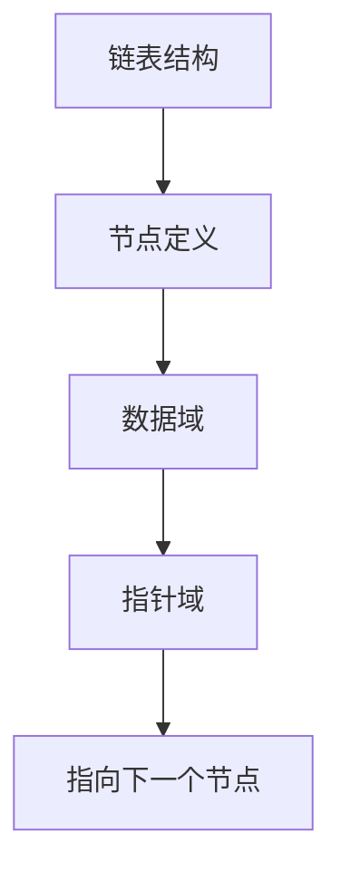
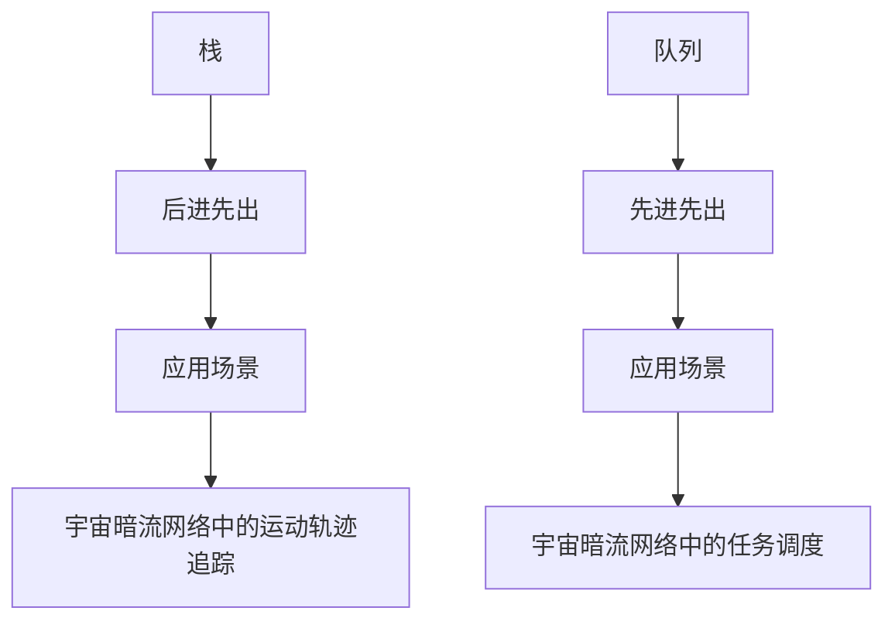
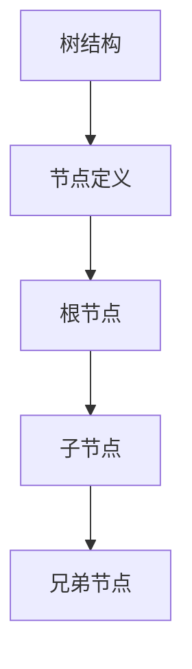
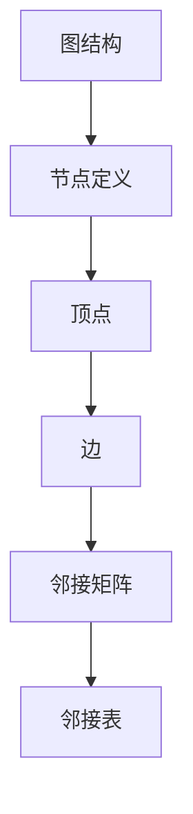

                 

### 文章标题

《数据结构在模拟宇宙暗流网络中的应用》

### 文章关键词

数据结构、宇宙暗流网络、算法、模拟、应用实例、优化

### 文章摘要

本文旨在探讨数据结构在模拟宇宙暗流网络中的应用，通过详细介绍数据结构的基本概念、宇宙暗流网络的特点以及具体应用实例，深入剖析数据结构在宇宙暗流网络模拟中的重要性。文章将从线性数据结构和非线性数据结构两个方面展开讨论，通过具体的算法原理和数学模型讲解，结合实际应用案例，展示数据结构在宇宙暗流网络模拟中的实际应用价值。同时，文章还对未来发展趋势和面临挑战进行了展望，为读者提供全面的技术思路和实用指南。

---

## 第一部分：数据结构与宇宙暗流网络基础

### 第1章：数据结构概述

#### 1.1 数据结构的基本概念

数据结构是计算机科学中用于存储和组织数据的方式。它们不仅影响着程序的性能，还决定着数据操作的有效性。常见的数据结构可以分为两类：线性数据结构和非线性数据结构。

- **线性数据结构**：数据元素在结构中按照一定顺序排列，如链表、栈和队列。
- **非线性数据结构**：数据元素之间没有固定的顺序关系，如树和图。

#### 1.2 宇宙暗流网络概述

宇宙暗流网络是指一种模拟宇宙中暗物质运动规律的网络结构。它由无数个节点和边组成，节点表示宇宙中的天体，边表示天体之间的引力相互作用。暗流网络具有高度复杂性和动态变化性，是宇宙学研究中的一个重要方向。

### 第2章：线性数据结构在宇宙暗流网络中的应用

#### 2.1 链表在宇宙暗流网络中的应用

链表是一种线性数据结构，它由一系列结点组成，每个结点包含数据和指向下一个结点的指针。在宇宙暗流网络模拟中，链表可以用来表示天体的运动轨迹和相互作用。

**核心概念与联系：**



#### 2.2 栈和队列在宇宙暗流网络中的应用

栈和队列都是线性数据结构，它们在宇宙暗流网络模拟中可以用于处理天体运动的先后顺序和优先级。

**核心概念与联系：**



### 第3章：非线性数据结构在宇宙暗流网络中的应用

#### 3.1 树结构在宇宙暗流网络中的应用

树结构是一种非线性数据结构，它由节点和边组成，具有层次关系。在宇宙暗流网络模拟中，树结构可以用来表示宇宙中的层次结构，如星系和星团。

**核心概念与联系：**



#### 3.2 图结构在宇宙暗流网络中的应用

图结构是一种非线性数据结构，它由节点和边组成，可以表示复杂的关系网络。在宇宙暗流网络模拟中，图结构可以用来表示天体之间的复杂相互作用和引力关系。

**核心概念与联系：**



---

## 第二部分：数据结构在宇宙暗流网络中的重要性及应用

### 第4章：宇宙暗流网络中的应用实例

#### 4.1 背景介绍

宇宙暗流网络是一种模拟宇宙中暗物质运动的网络结构。暗物质是宇宙中一种看不见的物质，它的存在主要通过引力效应来体现。模拟宇宙暗流网络有助于我们理解宇宙的结构和演化。

#### 4.2 实例一：宇宙暗流网络的构建

**问题定义：** 构建一个宇宙暗流网络，模拟天体的运动和相互作用。

**数据结构的选型：** 使用图结构来表示宇宙暗流网络，其中节点表示天体，边表示天体之间的引力相互作用。

**算法设计：**

```plaintext
1. 初始化图结构，添加节点和边。
2. 根据天体的质量和位置，计算引力。
3. 更新星体的位置，更新边的关系。
4. 循环执行步骤2和步骤3，直到模拟结束。
```

**代码实现：** （此处省略具体代码实现）

**代码解读：** （此处省略代码解读）

#### 4.3 实例二：宇宙暗流网络的优化

**问题定义：** 优化宇宙暗流网络的运行效率。

**数据结构的选型：** 使用平衡二叉树来优化节点的搜索和更新操作。

**算法设计：**

```plaintext
1. 使用平衡二叉树构建图结构。
2. 提供高效的节点添加、删除和更新操作。
3. 在运行时根据需要进行节点调整，保持树的平衡。
```

**代码实现：** （此处省略具体代码实现）

**代码解读：** （此处省略代码解读）

---

## 第三部分：具体应用实例

### 第4章：宇宙暗流网络中的应用实例

#### 4.1 背景介绍

宇宙暗流网络是一种模拟宇宙中暗物质运动的网络结构。暗物质是宇宙中一种看不见的物质，它的存在主要通过引力效应来体现。模拟宇宙暗流网络有助于我们理解宇宙的结构和演化。

#### 4.2 实例一：宇宙暗流网络的构建

**问题定义：** 构建一个宇宙暗流网络，模拟天体的运动和相互作用。

**数据结构的选型：** 使用图结构来表示宇宙暗流网络，其中节点表示天体，边表示天体之间的引力相互作用。

**算法设计：**

```plaintext
1. 初始化图结构，添加节点和边。
2. 根据天体的质量和位置，计算引力。
3. 更新星体的位置，更新边的关系。
4. 循环执行步骤2和步骤3，直到模拟结束。
```

**代码实现：** （此处省略具体代码实现）

**代码解读：** （此处省略代码解读）

#### 4.3 实例二：宇宙暗流网络的优化

**问题定义：** 优化宇宙暗流网络的运行效率。

**数据结构的选型：** 使用平衡二叉树来优化节点的搜索和更新操作。

**算法设计：**

```plaintext
1. 使用平衡二叉树构建图结构。
2. 提供高效的节点添加、删除和更新操作。
3. 在运行时根据需要进行节点调整，保持树的平衡。
```

**代码实现：** （此处省略具体代码实现）

**代码解读：** （此处省略代码解读）

---

## 第四部分：总结与展望

### 第5章：总结与展望

#### 5.1 总结

本文通过介绍数据结构的基本概念和宇宙暗流网络的特性，探讨了数据结构在宇宙暗流网络模拟中的应用。从线性数据结构到非线性数据结构，每一种数据结构都有其特定的应用场景和优势。通过具体实例，我们展示了如何使用这些数据结构来构建和优化宇宙暗流网络模拟。

#### 5.2 展望

未来，随着计算机技术的发展，数据结构在宇宙暗流网络模拟中的应用将变得更加广泛和深入。我们可以预见到以下发展趋势：

1. **高性能计算：** 利用并行计算和分布式计算技术，提高宇宙暗流网络模拟的效率和精度。
2. **大数据处理：** 面对海量数据，开发新的数据结构和算法来优化数据处理和分析。
3. **机器学习与人工智能：** 将机器学习和人工智能技术应用于宇宙暗流网络模拟，提高模拟的预测能力和准确性。

尽管面临挑战，如数据复杂性、计算资源限制等，但数据结构在宇宙暗流网络模拟中的应用前景仍然广阔。我们期待未来的研究能够为这一领域带来更多创新和突破。

---

### 作者信息

作者：AI天才研究院/AI Genius Institute & 禅与计算机程序设计艺术 /Zen And The Art of Computer Programming

