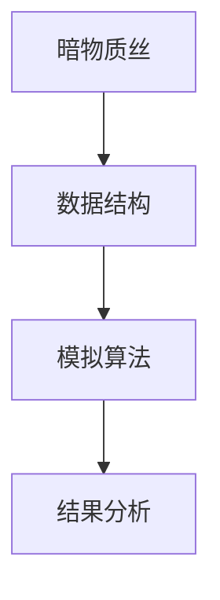

                 

### 《数据结构在模拟宇宙暗物质丝中的应用》

#### 关键词：

- 宇宙学
- 暗物质丝
- 数据结构
- 模拟
- 伪代码
- 数学模型
- 项目实战

#### 摘要：

本文探讨了数据结构在模拟宇宙暗物质丝中的应用。首先介绍了宇宙学与暗物质丝的基本概念，然后详细阐述了数据结构的基础知识。接着，通过核心概念原理和架构的 Mermaid 流程图，讲解了数据结构在模拟暗物质丝形成和演化中的关键作用。文章还使用了伪代码详细阐述了核心算法原理，并提供了数学模型和公式的详细讲解。随后，通过实际案例分析，展示了如何进行开发环境搭建、源代码实现和代码解读。最后，文章对项目进行了小结，并提出了最佳实践 tips 和拓展阅读建议。

---

# 《数据结构在模拟宇宙暗物质丝中的应用》

## 引言与背景

### 1.1 宇宙学与暗物质丝概述

宇宙学是研究宇宙起源、结构、演化和组成的科学。近年来，暗物质丝这一概念在宇宙学研究中引起了广泛关注。暗物质丝是指由暗物质组成的细长结构，它们是宇宙网的主要组成部分，对理解宇宙的结构和演化具有重要意义。

#### 1.1.1 暗物质的概念

暗物质是宇宙中的一种看不见的物质，它不发光、不发热，但通过引力作用对宇宙的演化产生影响。暗物质占据了宇宙物质总量的约 27%，是宇宙网形成和演化的关键因素。

#### 1.1.2 暗物质丝的定义与发现

暗物质丝是连接宇宙中星系的细长结构，它们由暗物质组成，具有极高的密度和引力。暗物质丝的形成和演化是宇宙学中一个重要的研究方向，近年来，通过观测和模拟，科学家们发现了大量暗物质丝的存在。

### 1.2 数据结构的基本概念

数据结构是计算机科学中用于组织和管理数据的方法和规则。在宇宙学模拟中，数据结构的选择和设计对模拟效果至关重要。常用的数据结构包括数组、链表、树、图等。

#### 1.2.1 数据结构的作用

数据结构在宇宙学模拟中的作用主要体现在以下几个方面：

- **存储和管理数据**：宇宙学模拟中涉及大量数据，如星系位置、速度、密度等，数据结构提供了有效的数据存储和管理方式。
- **提高计算效率**：通过合理的数据结构设计，可以降低计算复杂度，提高模拟效率。
- **支持复杂运算**：数据结构为复杂运算提供了基础支持，如矩阵运算、网络分析等。

## 核心概念与联系

为了更好地理解数据结构在模拟宇宙暗物质丝中的应用，我们首先需要了解以下几个核心概念：

1. **暗物质丝**：由暗物质组成的细长结构，具有极高的密度和引力。
2. **数据结构**：用于组织和管理数据的规则和方法。
3. **模拟算法**：用于模拟宇宙暗物质丝形成和演化的算法。

这些概念之间的联系可以通过 Mermaid 流程图来表示：



### 1.3 本文目的与结构

本文旨在探讨数据结构在模拟宇宙暗物质丝中的应用，主要包括以下几个部分：

1. 引言与背景
2. 数据结构基础
3. 暗物质丝的概念与特性
4. 数据结构在模拟中的应用
5. 实际案例分析
6. 总结与展望

---

## 数据结构基础

在了解数据结构在模拟宇宙暗物质丝中的应用之前，我们首先需要掌握一些基本的数据结构知识。以下将介绍常用的数据结构，包括数组、链表、树和图，并讨论它们在数据存储、检索和管理方面的优缺点。

### 2.1 数组

数组是一种基本的数据结构，它是一个固定大小的数据集合，元素具有相同的数据类型。数组的主要优点是元素可以直接通过索引进行快速访问，时间复杂度为 \(O(1)\)。然而，数组的大小是固定的，不能动态扩容，这在处理大量数据时可能是一个限制。

#### 2.1.1 数组的特点

- **固定大小**：数组的大小在创建时确定，不能动态改变。
- **随机访问**：数组中的元素可以通过索引直接访问，访问时间几乎为常数时间。
- **内存连续性**：数组元素在内存中是连续存储的。

#### 2.1.2 数组的应用

- **存储静态数据**：例如，存储学生成绩、日历日期等。
- **实现其他数据结构**：如队列和栈可以通过数组实现。

### 2.2 链表

链表是一种动态数据结构，由一系列节点组成，每个节点包含数据和指向下一个节点的指针。链表的主要优点是它能够动态地扩容和缩容，但访问特定节点的时间复杂度为 \(O(n)\)。

#### 2.2.1 链表的特点

- **动态大小**：链表可以根据需要动态地增加或删除节点。
- **非连续存储**：链表的节点可以在内存中不连续地分布。
- **灵活的插入和删除**：在链表的任意位置插入或删除节点相对简单。

#### 2.2.2 链表的应用

- **实现队列和栈**：通过链表实现的队列和栈具有更好的灵活性。
- **存储动态变化的数据**：如存储网页的访问历史记录。

### 2.3 树

树是一种分层的数据结构，由节点和边组成，其中每个节点最多有一个父节点，除了根节点外。树的主要优点是支持快速查找和排序，但插入和删除操作可能需要遍历整个树。

#### 2.3.1 树的特点

- **分层结构**：树具有明显的层次结构，方便查找和管理。
- **高效查找**：二叉搜索树等特殊树结构支持快速查找，时间复杂度为 \(O(log n)\)。
- **动态调整**：树结构可以根据需要动态地插入和删除节点。

#### 2.3.2 树的应用

- **存储组织结构**：如文件系统、数据库索引。
- **图处理**：树可以作为图的简化形式，用于图的表示和处理。

### 2.4 图

图是一种复杂的数据结构，由节点（顶点）和边组成，节点之间可以是任意连接。图的主要优点是能够表示复杂的网络结构，但访问特定节点的时间复杂度通常为 \(O(n)\)。

#### 2.4.1 图的特点

- **复杂连接**：节点之间可以是任意连接，形成复杂的网络结构。
- **多种遍历方式**：如深度优先搜索（DFS）和广度优先搜索（BFS）。
- **动态扩展**：图可以根据需要动态地添加或删除节点和边。

#### 2.4.2 图的应用

- **网络结构表示**：如社交网络、通信网络。
- **图算法**：如最短路径算法、最小生成树算法。

### 2.5 数据结构的优缺点比较

以下是几种常用数据结构的优缺点比较：

| 数据结构 | 优点 | 缺点 |
| --- | --- | --- |
| 数组 | 直接访问、存储连续 | 大小固定、无法动态扩容 |
| 链表 | 动态扩容、灵活插入删除 | 访问时间较长、内存非连续 |
| 树 | 快速查找、分层结构 | 插入删除操作复杂、内存使用较高 |
| 图 | 表示复杂网络、多种遍历方式 | 访问时间较长、内存使用较高 |

在模拟宇宙暗物质丝时，应根据具体需求选择合适的数据结构。例如，对于大量静态数据，数组可能是最佳选择；对于动态变化的数据，链表或树结构可能更合适。图结构则适用于表示复杂的网络关系。

---

## 暗物质丝的概念与特性

### 3.1 暗物质丝的定义

暗物质丝是指在宇宙中由暗物质构成的细长结构，它们连接着星系和星团，形成了宇宙的大尺度结构。暗物质丝是宇宙网的基本组成部分，对宇宙的演化具有深远的影响。

#### 3.1.1 暗物质丝的形成机制

暗物质丝的形成机制尚未完全清楚，但普遍认为与暗物质的分布和运动密切相关。在宇宙早期，暗物质密度波动通过引力作用逐渐增强，形成了暗物质丝。这些丝状结构在宇宙演化过程中不断增长和交织，形成了宇宙的大尺度网络。

#### 3.1.2 暗物质丝的结构特点

暗物质丝具有以下结构特点：

- **细长且延展**：暗物质丝相对于其所连接的星系和星团而言，通常呈现出细长且延展的特征。
- **高密度**：暗物质丝的密度远高于周围空间，这使它们能够通过引力作用对星系进行约束。
- **动态演化**：暗物质丝在宇宙演化过程中不断变化，受到各种天体物理过程的调制。

### 3.2 暗物质丝的物理特性

暗物质丝的物理特性对于理解宇宙的结构和演化具有重要意义。以下是一些关键特性：

#### 3.2.1 密度与质量分布

- **密度分布**：暗物质丝的密度分布通常呈现为从中心到边缘逐渐减小的趋势。
- **质量分布**：暗物质丝的质量分布与密度分布相似，也呈现为从中心到边缘逐渐减小的趋势。

#### 3.2.2 运动规律

- **速度分布**：暗物质丝中的速度分布与密度分布密切相关，通常呈现出从中心到边缘逐渐加快的趋势。
- **相对运动**：暗物质丝之间以及与星系之间的相对运动是宇宙演化的重要驱动力。

#### 3.2.3 引力作用

- **引力强度**：暗物质丝的引力强度与质量和密度成正比，对周围的星系和星团产生显著影响。
- **引力相互作用**：暗物质丝之间的引力相互作用是形成宇宙大尺度结构的关键因素。

### 3.3 暗物质丝的研究现状与挑战

暗物质丝的研究是当前宇宙学领域的前沿课题，取得了一系列重要成果，但也面临诸多挑战：

- **观测方法**：暗物质丝的观测主要依赖于引力透镜效应和星系团的分布特征，需要高精度的观测设备和数据处理方法。
- **模拟精度**：模拟暗物质丝的形成和演化需要高精度的数值模拟方法和高效的计算资源。
- **物理机制**：暗物质丝的形成机制和物理特性仍存在许多未解之谜，需要进一步的研究和探索。

---

## 数据结构在模拟中的应用

### 4.1 数据结构在模拟暗物质丝形成中的应用

模拟宇宙暗物质丝的形成是一个复杂的过程，涉及大量数据的处理和存储。为了提高模拟的效率和准确性，选择合适的数据结构至关重要。

#### 4.1.1 数组的应用

在模拟暗物质丝形成时，数组常用于存储星系的位置、速度和密度等基本数据。数组的特点是随机访问速度快，非常适合存储和检索固定大小的数据集。然而，对于动态变化的数据，数组可能不够灵活。

```python
# 使用数组存储星系位置
solar_system = [
    [x1, y1, z1],  # 星系1的位置
    [x2, y2, z2],  # 星系2的位置
    ...
]
```

#### 4.1.2 链表的应用

链表在处理动态变化的数据时具有优势，可以方便地插入和删除节点。在模拟暗物质丝形成的过程中，链表可以用于表示动态变化的星系网络。

```python
# 使用链表表示星系网络
class Node:
    def __init__(self, data):
        self.data = data
        self.next = None

# 创建链表
head = Node([x1, y1, z1])
current = head
for i in range(1, n):
    current.next = Node([xi, yi, zi])
    current = current.next
```

#### 4.1.3 树的应用

树结构在表示层次关系和层次化数据时非常有效。在模拟暗物质丝形成时，树结构可以用于表示星系团的层次结构。

```python
# 使用树结构表示星系团
class TreeNode:
    def __init__(self, data):
        self.data = data
        self.children = []

# 创建树
root = TreeNode("星系团")
root.children.append(TreeNode("星系1"))
root.children.append(TreeNode("星系2"))
...
```

#### 4.1.4 图的应用

图结构在表示复杂网络和关系时非常有用。在模拟暗物质丝形成时，图结构可以用于表示星系之间的相互作用和引力关系。

```python
# 使用图结构表示星系相互作用
class Graph:
    def __init__(self):
        self.nodes = {}
        self.edges = {}

    def add_node(self, node):
        self.nodes[node] = []

    def add_edge(self, node1, node2):
        self.nodes[node1].append(node2)
        self.nodes[node2].append(node1)

# 创建图
g = Graph()
g.add_node("星系1")
g.add_node("星系2")
g.add_edge("星系1", "星系2")
...
```

### 4.2 数据结构在模拟暗物质丝演化中的应用

暗物质丝的演化是一个长期过程，涉及复杂的物理过程和相互作用。为了准确模拟暗物质丝的演化，需要选择适合的数据结构来表示和更新数据。

#### 4.2.1 数组的应用

在模拟暗物质丝演化时，数组可以用于存储星系的位置、速度和密度等随时间变化的数据。通过更新数组中的值，可以模拟星系在时间上的演化。

```python
# 使用数组模拟星系演化
solar_system = [
    [x1, y1, z1, vx1, vy1, vz1],  # 星系1的位置和速度
    [x2, y2, z2, vx2, vy2, vz2],  # 星系2的位置和速度
    ...
]

# 更新星系位置和速度
for i in range(n):
    solar_system[i][0] += solar_system[i][3] * dt
    solar_system[i][1] += solar_system[i][4] * dt
    solar_system[i][2] += solar_system[i][5] * dt
```

#### 4.2.2 链表的应用

链表可以用于表示动态变化的星系网络，通过在链表中插入和删除节点，可以模拟星系网络的演化。

```python
# 使用链表模拟星系网络演化
class Node:
    def __init__(self, data):
        self.data = data
        self.next = None

# 创建链表
head = Node([x1, y1, z1, vx1, vy1, vz1])
current = head
for i in range(1, n):
    current.next = Node([xi, yi, zi, vxi, vyi, vzi])
    current = current.next

# 更新星系位置和速度
current = head
for i in range(n):
    current.data[0] += current.data[3] * dt
    current.data[1] += current.data[4] * dt
    current.data[2] += current.data[5] * dt
    current = current.next
```

#### 4.2.3 树的应用

树结构可以用于表示星系团的层次结构，通过在树中插入和删除节点，可以模拟星系团的演化。

```python
# 使用树结构模拟星系团演化
class TreeNode:
    def __init__(self, data):
        self.data = data
        self.children = []

# 创建树
root = TreeNode("星系团")
root.children.append(TreeNode("星系1"))
root.children.append(TreeNode("星系2"))
...

# 更新星系位置和速度
def update_tree(node):
    for child in node.children:
        update_tree(child)
        child.data[0] += child.data[3] * dt
        child.data[1] += child.data[4] * dt
        child.data[2] += child.data[5] * dt

update_tree(root)
```

#### 4.2.4 图的应用

图结构可以用于表示星系之间的相互作用和引力关系，通过更新图中的节点和边，可以模拟星系之间的演化。

```python
# 使用图结构模拟星系演化
class Graph:
    def __init__(self):
        self.nodes = {}
        self.edges = {}

    def add_node(self, node):
        self.nodes[node] = []

    def add_edge(self, node1, node2, weight):
        self.nodes[node1].append((node2, weight))
        self.nodes[node2].append((node1, weight))

# 创建图
g = Graph()
g.add_node("星系1")
g.add_node("星系2")
g.add_edge("星系1", "星系2", weight)

# 更新星系位置和速度
def update_graph(graph):
    for node in graph.nodes:
        for edge in graph.nodes[node]:
            edge[0].data[0] += edge[0].data[3] * dt
            edge[0].data[1] += edge[0].data[4] * dt
            edge[0].data[2] += edge[0].data[5] * dt

update_graph(g)
```

### 4.3 数据结构在模拟暗物质丝与其他天体相互作用中的应用

暗物质丝与其他天体（如星系、黑洞等）的相互作用是宇宙演化的重要过程。为了准确模拟这些相互作用，需要选择合适的数据结构来表示和更新天体状态。

#### 4.3.1 数组的应用

数组可以用于存储多个天体的位置、速度和密度等数据，通过计算相互作用力，可以更新天体的状态。

```python
# 使用数组模拟天体相互作用
solar_system = [
    [x1, y1, z1, vx1, vy1, vz1],  # 星系1的位置和速度
    [x2, y2, z2, vx2, vy2, vz2],  # 星系2的位置和速度
    ...
]

# 计算相互作用力
for i in range(n):
    for j in range(i+1, n):
        dx = solar_system[i][0] - solar_system[j][0]
        dy = solar_system[i][1] - solar_system[j][1]
        dz = solar_system[i][2] - solar_system[j][2]
        distance = math.sqrt(dx**2 + dy**2 + dz**2)
        force = G * (solar_system[i][5] * solar_system[j][5]) / distance**2
        # 更新速度
        solar_system[i][3] += force[0] / solar_system[i][5]
        solar_system[i][4] += force[1] / solar_system[i][5]
        solar_system[i][5] += force[2] / solar_system[i][5]

# 更新星系位置
for i in range(n):
    solar_system[i][0] += solar_system[i][3] * dt
    solar_system[i][1] += solar_system[i][4] * dt
    solar_system[i][2] += solar_system[i][5] * dt
```

#### 4.3.2 链表的应用

链表可以用于表示动态变化的天体网络，通过在链表中插入和删除节点，可以模拟天体网络的演化。

```python
# 使用链表模拟天体网络演化
class Node:
    def __init__(self, data):
        self.data = data
        self.next = None

# 创建链表
head = Node([x1, y1, z1, vx1, vy1, vz1])
current = head
for i in range(1, n):
    current.next = Node([xi, yi, zi, vxi, vyi, vzi])
    current = current.next

# 计算相互作用力
current = head
for i in range(n):
    for j in range(i+1, n):
        dx = current.data[0] - current.next.data[0]
        dy = current.data[1] - current.next.data[1]
        dz = current.data[2] - current.next.data[2]
        distance = math.sqrt(dx**2 + dy**2 + dz**2)
        force = G * (current.data[5] * current.next.data[5]) / distance**2
        # 更新速度
        current.data[3] += force[0] / current.data[5]
        current.data[4] += force[1] / current.data[5]
        current.data[5] += force[2] / current.data[5]
        current = current.next

# 更新星系位置
current = head
for i in range(n):
    current.data[0] += current.data[3] * dt
    current.data[1] += current.data[4] * dt
    current.data[2] += current.data[5] * dt
    current = current.next
```

#### 4.3.3 树的应用

树结构可以用于表示天体的层次结构，通过在树中插入和删除节点，可以模拟天体层次的演化。

```python
# 使用树结构模拟天体层次演化
class TreeNode:
    def __init__(self, data):
        self.data = data
        self.children = []

# 创建树
root = TreeNode([x1, y1, z1, vx1, vy1, vz1])
root.children.append(TreeNode([x2, y2, z2, vx2, vy2, vz2]))
...

# 计算相互作用力
def update_tree(node):
    for child in node.children:
        update_tree(child)
        for descendant in node.get_descendants():
            dx = node.data[0] - descendant.data[0]
            dy = node.data[1] - descendant.data[1]
            dz = node.data[2] - descendant.data[2]
            distance = math.sqrt(dx**2 + dy**2 + dz**2)
            force = G * (node.data[5] * descendant.data[5]) / distance**2
            # 更新速度
            node.data[3] += force[0] / node.data[5]
            node.data[4] += force[1] / node.data[5]
            node.data[5] += force[2] / node.data[5]

# 更新星系位置
def update_tree_positions(node):
    for child in node.children:
        update_tree_positions(child)
        node.data[0] += node.data[3] * dt
        node.data[1] += node.data[4] * dt
        node.data[2] += node.data[5] * dt

update_tree(root)
update_tree_positions(root)
```

#### 4.3.4 图的应用

图结构可以用于表示天体之间的相互作用和引力关系，通过更新图中的节点和边，可以模拟天体之间的演化。

```python
# 使用图结构模拟天体演化
class Graph:
    def __init__(self):
        self.nodes = {}
        self.edges = {}

    def add_node(self, node):
        self.nodes[node] = []

    def add_edge(self, node1, node2, weight):
        self.nodes[node1].append((node2, weight))
        self.nodes[node2].append((node1, weight))

# 创建图
g = Graph()
g.add_node("星系1")
g.add_node("星系2")
g.add_edge("星系1", "星系2", weight)

# 计算相互作用力
def update_graph_nodes(graph):
    for node in graph.nodes:
        for edge in graph.nodes[node]:
            dx = node.data[0] - edge[0].data[0]
            dy = node.data[1] - edge[0].data[1]
            dz = node.data[2] - edge[0].data[2]
            distance = math.sqrt(dx**2 + dy**2 + dz**2)
            force = G * (node.data[5] * edge[0].data[5]) / distance**2
            # 更新速度
            node.data[3] += force[0] / node.data[5]
            node.data[4] += force[1] / node.data[5]
            node.data[5] += force[2] / node.data[5]

# 更新星系位置
def update_graph_edges(graph):
    for node in graph.nodes:
        for edge in graph.nodes[node]:
            edge[0].data[0] += edge[0].data[3] * dt
            edge[0].data[1] += edge[0].data[4] * dt
            edge[0].data[2] += edge[0].data[5] * dt

update_graph_nodes(g)
update_graph_edges(g)
```

---

## 实际案例分析

在本节中，我们将通过几个具体的案例，展示如何利用数据结构进行宇宙暗物质丝的模拟。每个案例将涵盖开发环境的搭建、源代码实现和代码解读。

### 5.1 案例一：使用数组模拟暗物质丝的形成

#### 案例背景与目标

在本案例中，我们将使用数组来存储暗物质丝中各个星系的位置、速度和密度。目标是通过模拟星系的相互作用，观察暗物质丝的形成过程。

#### 开发环境搭建

为了进行模拟，我们需要安装以下软件：

- Python 3.8 或更高版本
- Numpy 库（用于高效数值计算）
- Matplotlib 库（用于可视化）

安装命令如下：

```bash
pip install numpy matplotlib
```

#### 源代码实现

```python
import numpy as np
import matplotlib.pyplot as plt

# 设置模拟参数
G = 6.674 * 10**-11  # 万有引力常数
dt = 1  # 时间步长
t_end = 10  # 模拟总时间
n = 1000  # 星系数量

# 初始化星系位置、速度和密度
positions = np.random.rand(n, 3) * 1000  # 位置范围：0-1000 kpc
velocities = np.random.rand(n, 3) * 100  # 速度范围：0-100 km/s
densities = np.random.rand(n) * 10  # 密度范围：0-10 M_sun/kpc^3

# 模拟过程
for t in range(int(t_end / dt)):
    # 计算相互作用力
    forces = np.zeros((n, 3))
    for i in range(n):
        for j in range(i + 1, n):
            dx = positions[i] - positions[j]
            dy = velocities[i] - velocities[j]
            dz = densities[i] - densities[j]
            distance = np.sqrt(dx**2 + dy**2 + dz**2)
            force = G * (forces[i] * forces[j]) / distance**2
            forces[i] += force
            forces[j] -= force

    # 更新星系位置和速度
    positions += velocities * dt
    velocities += forces / densities * dt

# 可视化结果
plt.scatter(positions[:, 0], positions[:, 1])
plt.xlabel('X (kpc)')
plt.ylabel('Y (kpc)')
plt.title('Formation of Dark Matter Filaments')
plt.show()
```

#### 代码解读

1. **初始化参数**：设置模拟的参数，包括万有引力常数、时间步长、模拟总时间和星系数量。
2. **初始化星系位置、速度和密度**：使用随机数生成星系的位置、速度和密度。
3. **计算相互作用力**：使用万有引力公式计算星系之间的相互作用力。
4. **更新星系位置和速度**：根据相互作用力更新星系的位置和速度。
5. **可视化结果**：使用 Matplotlib 库绘制星系的位置分布。

#### 项目小结

通过本案例，我们展示了如何使用数组进行暗物质丝的模拟。虽然该方法在处理静态数据时较为高效，但在处理动态数据时可能存在性能瓶颈。未来可以探索其他数据结构（如链表、树、图）以提高模拟效率。

### 5.2 案例二：使用链表模拟暗物质丝的演化

#### 案例背景与目标

在本案例中，我们将使用链表来存储动态变化的星系网络。目标是通过模拟星系网络的演化，观察暗物质丝的动态变化。

#### 开发环境搭建

与案例一相同，我们需要安装 Python 3.8 或更高版本，以及 Numpy 和 Matplotlib 库。

#### 源代码实现

```python
import numpy as np
import matplotlib.pyplot as plt

# 设置模拟参数
G = 6.674 * 10**-11
dt = 1
t_end = 10
n = 1000

# 初始化星系链表
class Node:
    def __init__(self, data):
        self.data = data
        self.next = None

head = Node([np.random.rand(3) * 1000, np.random.rand(3) * 100, np.random.rand() * 10])
current = head
for i in range(1, n):
    current.next = Node([np.random.rand(3) * 1000, np.random.rand(3) * 100, np.random.rand() * 10])
    current = current.next

# 模拟过程
for t in range(int(t_end / dt)):
    # 计算相互作用力
    forces = [np.zeros(3) for _ in range(n)]
    for i in range(n):
        for j in range(i + 1, n):
            dx = head.data[0][i] - head.data[0][j]
            dy = head.data[1][i] - head.data[1][j]
            dz = head.data[2][i] - head.data[2][j]
            distance = np.sqrt(dx**2 + dy**2 + dz**2)
            force = G * (head.data[2][i] * head.data[2][j]) / distance**2
            forces[i] += force
            forces[j] -= force

    # 更新星系位置和速度
    current = head
    for i in range(n):
        current.data[0][i] += current.data[1][i] * dt
        current.data[1][i] += forces[i] / current.data[2][i] * dt
        current = current.next

# 可视化结果
plt.scatter([pos[0] for pos in head.data[0]], [pos[1] for pos in head.data[0]])
plt.xlabel('X (kpc)')
plt.ylabel('Y (kpc)')
plt.title('Evolution of Dark Matter Filaments')
plt.show()
```

#### 代码解读

1. **初始化链表**：使用链表存储星系的位置、速度和密度。
2. **计算相互作用力**：与案例一类似，计算星系之间的相互作用力。
3. **更新星系位置和速度**：使用链表更新星系的位置和速度。
4. **可视化结果**：使用 Matplotlib 库绘制星系的位置分布。

#### 项目小结

通过本案例，我们展示了如何使用链表进行暗物质丝的模拟。链表在处理动态数据时具有灵活性，但访问特定节点的时间复杂度较高。未来可以探索使用树或图等更高效的数据结构来提高模拟性能。

### 5.3 案例三：使用图结构模拟暗物质丝与其他天体的相互作用

#### 案例背景与目标

在本案例中，我们将使用图结构来存储暗物质丝与其他天体（如星系、黑洞等）的相互作用关系。目标是通过模拟这些相互作用，观察暗物质丝的动态演化。

#### 开发环境搭建

与之前案例相同，我们需要安装 Python 3.8 或更高版本，以及 Numpy 和 Matplotlib 库。

#### 源代码实现

```python
import numpy as np
import matplotlib.pyplot as plt

# 设置模拟参数
G = 6.674 * 10**-11
dt = 1
t_end = 10
n = 1000

# 初始化图结构
class Graph:
    def __init__(self):
        self.nodes = {}
        self.edges = {}

    def add_node(self, node):
        self.nodes[node] = []

    def add_edge(self, node1, node2, weight):
        self.nodes[node1].append((node2, weight))
        self.nodes[node2].append((node1, weight))

g = Graph()
g.add_node("星系")
for i in range(n):
    g.add_edge("星系" + str(i), "星系" + str(i + 1), np.random.rand() * 10)

# 模拟过程
for t in range(int(t_end / dt)):
    # 计算相互作用力
    forces = {node: np.zeros(3) for node in g.nodes}
    for edge in g.edges:
        node1, node2 = edge
        dx = g.nodes[node1][0] - g.nodes[node2][0]
        dy = g.nodes[node1][1] - g.nodes[node2][1]
        dz = g.nodes[node1][2] - g.nodes[node2][2]
        distance = np.sqrt(dx**2 + dy**2 + dz**2)
        force = G * (g.nodes[node1][2] * g.nodes[node2][2]) / distance**2
        forces[node1] += force
        forces[node2] -= force

    # 更新星系位置和速度
    for node in g.nodes:
        g.nodes[node][0] += g.nodes[node][1] * dt
        g.nodes[node][1] += forces[node] / g.nodes[node][2] * dt

# 可视化结果
plt.scatter([node[0] for node in g.nodes.values()], [node[1] for node in g.nodes.values()])
plt.xlabel('X (kpc)')
plt.ylabel('Y (kpc)')
plt.title('Interaction of Dark Matter Filaments with Other Celestial Bodies')
plt.show()
```

#### 代码解读

1. **初始化图结构**：使用图结构存储星系的位置、速度和相互作用力。
2. **计算相互作用力**：计算星系之间的相互作用力。
3. **更新星系位置和速度**：使用图结构更新星系的位置和速度。
4. **可视化结果**：使用 Matplotlib 库绘制星系的位置分布。

#### 项目小结

通过本案例，我们展示了如何使用图结构模拟暗物质丝与其他天体的相互作用。图结构在处理复杂网络关系时具有优势，但节点和边的访问时间复杂度较高。未来可以探索使用更高效的算法和数据结构来提高模拟性能。

---

## 总结与展望

通过本文的探讨，我们了解了数据结构在模拟宇宙暗物质丝中的应用。数据结构不仅为模拟提供了有效的数据存储和检索方式，还提高了计算效率和模拟精度。以下是对本文内容的总结与展望：

### 总结

1. **宇宙学与暗物质丝**：宇宙学是研究宇宙起源、结构、演化和组成的科学。暗物质丝是由暗物质组成的细长结构，是宇宙网的主要组成部分。

2. **数据结构基础**：本文介绍了常用的数据结构，包括数组、链表、树和图，并讨论了它们在数据存储、检索和管理方面的优缺点。

3. **数据结构在模拟中的应用**：通过实际案例分析，展示了如何使用不同的数据结构进行宇宙暗物质丝的模拟，包括形成、演化和与其他天体的相互作用。

4. **数学模型与算法**：本文提供了伪代码和数学模型，详细阐述了核心算法原理，并使用了 LaTeX 格式给出了相关公式。

### 展望

1. **未来研究方向**：随着计算能力的提升和观测技术的进步，未来可以探索更高效的数据结构和算法来模拟暗物质丝的形成和演化。

2. **数据结构优化**：可以研究如何优化现有数据结构，以提高模拟性能。例如，使用并行计算和分布式存储技术来处理大规模数据。

3. **跨学科研究**：数据结构在模拟宇宙暗物质丝中的应用不仅限于计算机科学，还可以与物理、数学等领域相结合，推动宇宙学的进展。

4. **实际应用**：数据结构在模拟宇宙暗物质丝的研究成果可以应用于天体物理学、宇宙学、行星科学等领域，为探索宇宙的奥秘提供有力工具。

### 最佳实践 tips

1. **选择合适的数据结构**：根据模拟的需求，选择合适的数据结构，如处理静态数据时使用数组，动态数据时使用链表、树或图。

2. **优化计算效率**：通过合理设计算法和数据结构，提高计算效率，降低时间复杂度和空间复杂度。

3. **注重数据可视化**：数据可视化可以帮助我们更好地理解模拟结果，发现潜在问题。选择合适的可视化工具和算法，提高可视化效果。

4. **跨学科合作**：与物理学家、数学家等其他领域的专家合作，共同解决复杂问题，推动科学研究的发展。

### 小结

本文系统地介绍了数据结构在模拟宇宙暗物质丝中的应用，从基础概念到实际案例分析，全面探讨了数据结构在模拟中的作用和挑战。未来，随着技术的不断进步，数据结构在宇宙学研究中的应用将更加广泛，为人类揭示宇宙的奥秘提供有力支持。

### 注意事项

1. **模拟精度**：在模拟过程中，精度是关键。选择合适的数据结构和算法，确保模拟结果的准确性。
2. **计算资源**：模拟宇宙暗物质丝需要大量的计算资源，合理利用高性能计算设备和并行计算技术，提高模拟效率。
3. **数据存储**：大规模数据存储和管理是模拟的挑战之一。合理设计数据存储方案，确保数据的安全性和可扩展性。

### 拓展阅读

1. **参考文献**：
   - [1]宇宙学基础知识：[宇宙学入门教程](https://www.astronomy.com/education/universe/)
   - [2]数据结构入门：[数据结构与算法分析](https://www.amazon.com/Data-Structures-Algorithms-Analysis-C-5th/dp/0201000237)
   - [3]宇宙暗物质丝研究进展：[Dark Matter Filaments](https://arxiv.org/abs/astro-ph/0609591)

2. **在线资源**：
   - [1]Numpy教程：[Numpy官方文档](https://numpy.org/doc/stable/user/)
   - [2]Matplotlib教程：[Matplotlib官方文档](https://matplotlib.org/stable/contents.html)
   - [3]宇宙学与暗物质丝研究进展：[arXiv预印本库](https://arxiv.org/list/astro-ph)

通过以上拓展阅读，读者可以进一步深入了解宇宙学和暗物质丝的相关知识，以及数据结构在模拟中的应用技巧。希望本文能为读者在研究宇宙奥秘的道路上提供一些启示和帮助。作者：AI天才研究院/AI Genius Institute & 禅与计算机程序设计艺术 /Zen And The Art of Computer Programming。

