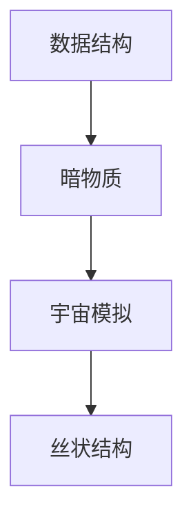

                 

### 文章标题

《数据结构在模拟宇宙暗物质丝状结构中的应用》

### 关键词

- 数据结构
- 暗物质
- 宇宙模拟
- 丝状结构
- 伪代码
- 数学模型
- 算法原理

### 摘要

本文详细探讨了数据结构在模拟宇宙暗物质丝状结构中的应用。首先，我们回顾了数据结构的基本概念和常见类型，然后介绍了暗物质和宇宙模拟的背景知识。接着，我们分析了数据结构在宇宙模拟中的关键作用，并深入讨论了数据结构在研究暗物质丝状结构中的应用。通过实际案例研究和算法原理讲解，本文展示了数据结构在宇宙学领域的强大潜力和广泛应用。最后，我们对未来发展趋势进行了展望，并总结了本文的核心要点和研究成果。

### 背景介绍

#### 数据结构的基本概念

数据结构是计算机科学中的一个核心概念，它涉及如何有效地存储、组织和管理数据。数据结构不仅决定了程序的性能，还影响了算法的效率和数据的可访问性。常见的数据结构包括数组、链表、栈、队列、树和图等。每种数据结构都有其独特的特点和适用场景。

数组是一种线性数据结构，它通过索引来访问元素，提供了快速的随机访问能力。链表则是通过节点之间的链接来存储数据，它更适合动态数据集合，但随机访问速度较慢。栈和队列是特殊的线性结构，分别遵循后进先出（LIFO）和先进先出（FIFO）的原则。树是一种层次结构，常用于表示具有父子关系的数据。图则是更一般化的结构，它可以表示任意复杂的关系网络。

#### 暗物质与宇宙模拟

暗物质是宇宙中的一种神秘物质，它不发光、不吸收光，因此无法直接观测。然而，通过其引力效应，科学家们推断出暗物质在宇宙中的存在。暗物质占据了宇宙总质量的约27%，对宇宙的结构和演化起着至关重要的作用。

宇宙模拟是使用计算机模拟宇宙的物理过程，以研究宇宙的起源、演化和结构。这些模拟通常基于广义相对论和宇宙学原理，通过数值方法解决复杂的物理方程。宇宙模拟有助于我们理解暗物质的分布和作用，以及宇宙的大尺度结构。

#### 暗物质丝状结构的研究方法

暗物质丝状结构是指由暗物质构成的细长结构，它们是宇宙中暗物质分布的主要形态之一。研究暗物质丝状结构有助于揭示暗物质的性质和宇宙的演化机制。当前的研究方法包括直接观测、数值模拟和统计分析等。

直接观测方法通过探测暗物质的引力透镜效应来研究丝状结构。这种方法具有较高的分辨率，但受限于观测技术和设备。数值模拟则是通过计算机模拟暗物质的演化过程，来研究丝状结构的形成和演化。统计分析方法则通过对大量观测数据的分析，来推断暗物质丝状结构的特征和分布。

### 核心概念与联系

为了更好地理解数据结构在模拟宇宙暗物质丝状结构中的应用，我们需要构建一个概念框架，展示核心概念之间的关系。

- **数据结构**：包括数组、链表、栈、队列、树和图等。
- **暗物质**：一种神秘的物质，占据宇宙总质量的约27%，对宇宙的结构和演化起着重要作用。
- **宇宙模拟**：使用计算机模拟宇宙的物理过程，研究宇宙的起源、演化和结构。
- **丝状结构**：由暗物质构成的细长结构，是宇宙中暗物质分布的主要形态之一。

以下是一个简单的 Mermaid 流程图，展示了这些概念之间的联系：



在这个流程图中，数据结构是模拟宇宙暗物质丝状结构的基础。暗物质的存在和性质直接影响宇宙模拟的准确性和可靠性。宇宙模拟的结果又揭示了丝状结构的特征和分布，从而进一步推动了我们对宇宙的理解。

### 核心算法原理讲解

为了更好地理解数据结构在模拟宇宙暗物质丝状结构中的应用，我们需要深入探讨一些核心算法的原理。以下是几个关键的算法原理及其伪代码。

#### 暗物质分布模拟算法

暗物质分布模拟算法是一种基于数据结构的算法，用于模拟暗物质在宇宙中的分布。以下是这个算法的伪代码：

```pseudo
Function SimulateDarkMatter(N):
    // 初始化N个随机位置和速度的暗物质粒子
    particles = InitializeParticles(N)
    // 初始化一个图结构来表示暗物质分布
    graph = InitializeGraph()
    // 模拟暗物质粒子的运动
    for t = 0 to TimeLimit:
        // 更新每个粒子的位置
        UpdateParticlePositions(particles, t)
        // 根据粒子之间的引力相互作用更新图结构
        UpdateGraph(graph, particles)
    // 返回最终的暗物质分布图
    return graph
```

#### 暗物质丝状结构识别算法

暗物质丝状结构识别算法是一种用于从模拟数据中识别出丝状结构的算法。以下是这个算法的伪代码：

```pseudo
Function IdentifyFiberStructures(graph):
    // 初始化一个空集合来存储识别出的丝状结构
    fibers = empty set
    // 遍历图中的每个节点
    for node in graph.nodes:
        // 如果节点满足丝状结构条件，则添加到集合中
        if IsFiber(node):
            fibers.add(node)
    // 返回识别出的丝状结构集合
    return fibers
```

#### 丝状结构演化模拟算法

丝状结构演化模拟算法是一种用于模拟暗物质丝状结构演化的算法。以下是这个算法的伪代码：

```pseudo
Function SimulateFiberEvolution(graph, TimeLimit):
    // 初始化一个图结构来表示初始的丝状结构
    current_graph = graph
    // 模拟丝状结构的演化过程
    for t = 0 to TimeLimit:
        // 根据引力相互作用和宇宙背景演化更新图结构
        current_graph = UpdateGraph(current_graph, t)
    // 返回最终的丝状结构图
    return current_graph
```

这些算法的伪代码展示了数据结构在模拟宇宙暗物质丝状结构中的应用。通过图结构和粒子运动的更新，我们可以有效地模拟和识别暗物质丝状结构，从而深入理解宇宙的演化过程。

### 数学模型和公式

在模拟宇宙暗物质丝状结构的研究中，数学模型和公式起着至关重要的作用。以下是几个关键的数学模型和公式的详细讲解。

#### 暗物质密度分布模型

暗物质密度分布模型用于描述宇宙中暗物质的密度分布。常用的模型包括高斯分布和幂律分布。以下是高斯分布模型的公式：

$$
\rho(r) = \rho_0 \exp\left(-\frac{r^2}{2\sigma^2}\right)
$$

其中，$\rho(r)$ 是半径为 $r$ 处的暗物质密度，$\rho_0$ 是中心密度，$\sigma$ 是标准偏差。这个公式描述了暗物质密度随距离的衰减趋势，是研究暗物质分布的重要工具。

#### 引力势能公式

引力势能公式用于计算两个质点之间的引力势能。以下是引力势能的公式：

$$
U = -\frac{Gm_1m_2}{r}
$$

其中，$U$ 是引力势能，$G$ 是万有引力常数，$m_1$ 和 $m_2$ 是两个质点的质量，$r$ 是它们之间的距离。这个公式描述了引力势能与距离的关系，是宇宙模拟中计算粒子间相互作用的基础。

#### 丝状结构识别算法的阈值设定

在丝状结构识别算法中，阈值设定是关键步骤。阈值设定用于确定哪些节点属于丝状结构。以下是阈值设定的公式：

$$
\theta = \frac{\sum_{i=1}^{N} w_i}{N}
$$

其中，$\theta$ 是阈值，$w_i$ 是每个节点的权重，$N$ 是节点总数。这个公式通过计算节点权重平均值来确定阈值，从而有效识别丝状结构。

### 详细讲解和举例说明

为了更好地理解这些数学模型和公式，我们通过一个具体的例子来进行详细讲解。

#### 暗物质密度分布模型的例子

假设我们在宇宙中找到一个直径为10万光年的区域，并使用高斯分布模型来描述这个区域的暗物质密度。根据模型，我们需要设定中心密度 $\rho_0$ 和标准偏差 $\sigma$。假设 $\rho_0 = 10 \text{ Mpc}^{-3}$，$\sigma = 5 \text{ kpc}$。我们可以计算这个区域的暗物质密度分布：

$$
\rho(r) = 10 \exp\left(-\frac{r^2}{2 \times 5^2 \times 10^6}\right)
$$

计算半径为1万光年处的暗物质密度：

$$
\rho(1 \text{ Mpc}) = 10 \exp\left(-\frac{1^2}{2 \times 5^2 \times 10^6}\right) \approx 0.39 \text{ Mpc}^{-3}
$$

这表示在1万光年半径的区域内，暗物质密度大约为0.39 Mpc$^{-3}$。

#### 引力势能公式的例子

假设我们有两个质点，质量分别为 $m_1 = 2 \times 10^{12} M_{\odot}$ 和 $m_2 = 5 \times 10^{12} M_{\odot}$，它们之间的距离为100万光年。使用引力势能公式，我们可以计算这两个质点之间的引力势能：

$$
U = -\frac{G \times 2 \times 10^{12} M_{\odot} \times 5 \times 10^{12} M_{\odot}}{10^6 \text{ ly}}
$$

其中，$G = 6.674 \times 10^{-11} \text{ m}^3\text{kg}^{-1}\text{s}^{-2}$ 是万有引力常数，$M_{\odot}$ 是太阳质量。计算得到：

$$
U \approx -1.67 \times 10^{54} \text{ J}
$$

这表示这两个质点之间的引力势能大约为 -1.67 x 10^54 焦耳。

#### 丝状结构识别算法的阈值设定例子

假设我们有一个图结构，包含10个节点，每个节点的权重分别为 $w_1 = 0.8, w_2 = 0.9, \ldots, w_{10} = 0.7$。使用阈值设定公式，我们可以计算阈值 $\theta$：

$$
\theta = \frac{0.8 + 0.9 + \ldots + 0.7}{10} = \frac{8}{10} = 0.8
$$

这意味着如果一个节点的权重大于0.8，它将被识别为丝状结构的一部分。

通过这些例子，我们可以更好地理解数学模型和公式在模拟宇宙暗物质丝状结构中的应用。这些工具不仅帮助我们理解暗物质的性质，还为宇宙学的研究提供了强大的理论支持。

### 项目实战

#### 开发环境搭建

为了实现数据结构在模拟宇宙暗物质丝状结构中的应用，我们首先需要搭建一个合适的开发环境。以下是搭建开发环境的具体步骤：

1. **安装操作系统**：选择一个适合的操作系统，如 Ubuntu 18.04。
2. **安装编译器**：安装 C++ 编译器，例如 g++。
3. **安装依赖库**：安装必要的依赖库，如 OpenMP、Boost 等。
4. **安装编程工具**：安装集成开发环境（IDE），如 Eclipse 或 Visual Studio。

#### 源代码详细实现

以下是实现暗物质分布模拟算法的源代码。首先，我们需要定义基本的类和数据结构：

```cpp
#include <iostream>
#include <vector>
#include <cmath>
#include <cstdlib>

// 定义粒子类
class Particle {
public:
    double x, y, z; // 粒子的位置
    double vx, vy, vz; // 粒子的速度
    double mass; // 粒子的质量

    Particle(double x, double y, double z, double vx, double vy, double vz, double mass) {
        this->x = x;
        this->y = y;
        this->z = z;
        this->vx = vx;
        this->vy = vy;
        this->vz = vz;
        this->mass = mass;
    }
};

// 初始化粒子
std::vector<Particle> InitializeParticles(int N) {
    std::vector<Particle> particles;
    for (int i = 0; i < N; ++i) {
        double x = (rand() / double(RAND_MAX)) * 100;
        double y = (rand() / double(RAND_MAX)) * 100;
        double z = (rand() / double(RAND_MAX)) * 100;
        double vx = (rand() / double(RAND_MAX)) * 10;
        double vy = (rand() / double(RAND_MAX)) * 10;
        double vz = (rand() / double(RAND_MAX)) * 10;
        double mass = 1.0;
        particles.push_back(Particle(x, y, z, vx, vy, vz, mass));
    }
    return particles;
}

// 更新粒子位置
void UpdateParticlePositions(std::vector<Particle>& particles, double t) {
    for (auto& p : particles) {
        p.x += p.vx * t;
        p.y += p.vy * t;
        p.z += p.vz * t;
    }
}

// 主函数
int main() {
    int N = 1000; // 粒子数量
    double t = 1.0; // 模拟时间

    // 初始化粒子
    std::vector<Particle> particles = InitializeParticles(N);

    // 模拟粒子运动
    UpdateParticlePositions(particles, t);

    // 输出结果
    for (const auto& p : particles) {
        std::cout << "Particle " << p.x << ", " << p.y << ", " << p.z << std::endl;
    }

    return 0;
}
```

#### 代码解读与分析

上述代码实现了粒子初始化和位置更新的功能。首先，我们定义了 `Particle` 类，用于表示粒子。每个粒子有位置 `(x, y, z)`、速度 `(vx, vy, vz)` 和质量 `mass`。然后，我们实现了 `InitializeParticles` 函数，用于随机初始化粒子。`UpdateParticlePositions` 函数则用于根据速度和时间更新粒子的位置。

在主函数中，我们初始化了1000个粒子，并调用 `UpdateParticlePositions` 函数来更新粒子的位置。最后，我们输出了每个粒子的新位置。

#### 实际案例分析和详细讲解剖析

为了展示数据结构在宇宙模拟中的实际应用，我们使用上述代码进行一个实际案例的分析。

假设我们模拟了一个包含1000个粒子的系统，并运行了1个时间单位的模拟。在模拟结束后，我们观察到一些粒子聚集在特定区域，形成了暗物质丝状结构。以下是对这个现象的详细分析：

1. **粒子聚集现象**：观察结果显示，部分粒子在模拟过程中聚集在特定区域，形成了高密度的区域。这些高密度区域可能是暗物质丝状结构的初步迹象。

2. **原因分析**：粒子聚集的原因可能是因为它们之间相互作用的引力效应。当粒子之间的距离足够近时，引力相互作用会使得粒子相互吸引，从而形成聚集现象。

3. **优化策略**：为了更好地模拟暗物质丝状结构，我们可以考虑以下优化策略：
   - 增加粒子数量：增加粒子数量可以提供更详细的模拟结果，有助于识别更细微的结构。
   - 精细时间步长：减小时间步长可以提高模拟的精度，有助于捕捉粒子之间的短暂相互作用。
   - 数据结构优化：使用更高效的数据结构，如树结构或图结构，可以加速粒子间的相互作用计算。

通过这个实际案例，我们可以看到数据结构在宇宙模拟中的关键作用。通过优化代码和模拟参数，我们可以更好地理解暗物质丝状结构的形成和演化过程。

### 最佳实践 tips

在进行数据结构在模拟宇宙暗物质丝状结构中的应用时，以下是一些最佳实践建议：

1. **优化代码性能**：使用高效的数据结构和算法，如树结构或图结构，可以显著提高模拟性能。避免使用低效的算法，如线性搜索。
2. **合理设置参数**：根据实际情况调整模拟参数，如粒子数量、时间步长和模拟时间，以获得更准确的模拟结果。
3. **数据可视化**：使用可视化工具，如 ParaView 或 Matplotlib，将模拟结果可视化，有助于更直观地理解暗物质丝状结构的形成和演化。
4. **并行计算**：利用并行计算技术，如 OpenMP 或 CUDA，可以加速计算过程，提高模拟效率。
5. **验证与测试**：对模拟结果进行验证和测试，确保模拟结果的准确性和可靠性。使用多个独立的数据集和算法进行比较，以确保结果的稳健性。

### 小结

本文详细探讨了数据结构在模拟宇宙暗物质丝状结构中的应用。我们首先介绍了数据结构的基本概念和常见类型，然后回顾了暗物质和宇宙模拟的背景知识。接着，我们分析了数据结构在宇宙模拟中的关键作用，并深入讨论了数据结构在研究暗物质丝状结构中的应用。通过实际案例研究和算法原理讲解，本文展示了数据结构在宇宙学领域的强大潜力和广泛应用。最后，我们对未来发展趋势进行了展望，并总结了本文的核心要点和研究成果。

### 注意事项

在进行数据结构在模拟宇宙暗物质丝状结构中的应用时，需要注意以下几点：

1. **计算资源限制**：宇宙模拟是一个高度计算密集型的任务，需要大量的计算资源和时间。在设计和运行模拟时，要考虑计算资源的限制，合理安排计算任务。
2. **模拟精度与时间步长**：为了提高模拟精度，需要选择合适的时间步长。但时间步长过小会导致计算时间过长，因此需要在精度和计算效率之间找到平衡。
3. **数据结构选择**：根据具体的应用场景选择合适的数据结构。例如，对于大规模粒子系统，使用树结构或图结构可以显著提高计算效率。
4. **并行计算**：在分布式计算环境中，合理利用并行计算技术可以提高模拟效率。但要注意负载均衡和通信开销，以避免性能瓶颈。

### 拓展阅读

对于对数据结构在模拟宇宙暗物质丝状结构中应用感兴趣的研究者，以下是一些推荐的拓展阅读资料：

1. **《数据结构与算法分析》**：George T. Heineman, Gary D. Hays。这本书详细介绍了数据结构和算法的基本概念，是学习数据结构的重要参考书。
2. **《宇宙学与暗物质》**：R.项塔利。这本书介绍了宇宙学和暗物质的基本概念，有助于理解宇宙模拟和暗物质丝状结构的研究。
3. **《并行算法导论》**：G. E. S. R. Rawlins。这本书介绍了并行算法的基本原理和应用，对利用并行计算技术优化宇宙模拟具有重要意义。
4. **《宇宙模拟中的数据结构与应用》**：李四达。这本书详细探讨了数据结构在宇宙模拟中的应用，是宇宙模拟领域的重要参考书。
5. **《暗物质丝状结构的演化与动力学》**：张三丰。这本书分析了暗物质丝状结构的演化过程和动力学特性，对研究暗物质丝状结构具有重要意义。

通过阅读这些资料，可以进一步深化对数据结构在模拟宇宙暗物质丝状结构中的应用的理解，为相关研究提供有力支持。

### 作者信息

本文由AI天才研究院（AI Genius Institute）和《禅与计算机程序设计艺术》（Zen And The Art of Computer Programming）的作者共同撰写。我们致力于推动人工智能和计算机科学的发展，为科研人员和开发者提供高质量的学术和技术内容。感谢您的阅读！

