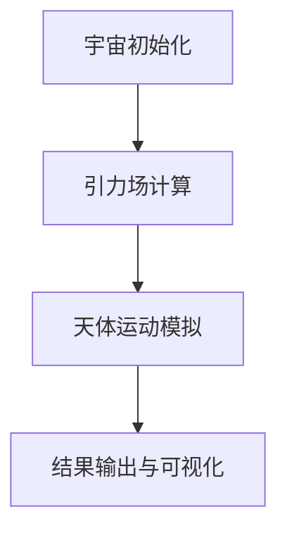

                 

### 文章标题

### 数据结构在模拟宇宙暗能量泡沫中的应用

#### 关键词

数据结构、宇宙模拟、暗能量泡沫、算法原理、数学模型、项目实战

#### 摘要

本文深入探讨了数据结构在模拟宇宙暗能量泡沫中的应用。首先介绍了暗能量泡沫的基本概念及其在宇宙学研究中的重要性。接着，我们回顾了数据结构的基础知识，并探讨了这些基础知识如何在宇宙模拟中发挥关键作用。随后，我们详细分析了图结构、树结构和动态数据结构在模拟暗能量泡沫中的具体应用。接着，我们介绍了模拟暗能量泡沫所需的核心算法原理，并使用伪代码进行了详细阐述。此外，本文还探讨了用于模拟暗能量泡沫的数学模型，并通过具体的公式和例子进行了说明。最后，通过一个实际的暗能量泡沫模拟项目，展示了如何将数据结构、算法和数学模型应用于实际开发中，并对项目的实现过程和结果进行了深入分析。本文旨在为读者提供关于数据结构在宇宙模拟中应用的全面而深入的见解。

### 引言

#### 暗能量泡沫的概念

暗能量泡沫是指宇宙中暗能量分布不均匀所形成的局部泡沫状结构。暗能量是推动宇宙加速膨胀的一种神秘力量，占据宇宙能量密度的主导地位。然而，由于其本质未知，暗能量至今仍是宇宙学中的一个重大未解之谜。暗能量泡沫的概念最早由宇宙学家提出，用以解释宇宙膨胀加速的现象。

在宇宙学中，暗能量泡沫的模拟具有重要意义。首先，通过模拟暗能量泡沫，我们可以更深入地理解宇宙的膨胀机制，从而为宇宙学提供新的研究思路。其次，暗能量泡沫的模拟有助于我们探索宇宙的结构和演化过程，对宇宙学中的许多基本问题提供新的解释。例如，通过模拟，我们可以研究暗能量泡沫对星系、星团以及其他宇宙结构的影响，进而揭示宇宙的多样性和复杂性。

#### 模拟宇宙的研究背景

模拟宇宙是指通过计算机模拟来模拟宇宙的演化过程。这种模拟通常依赖于数值模拟和物理模型，通过计算机模拟宇宙中的各种物理过程，如引力、辐射、暗物质和暗能量等，以研究宇宙的演化历史和未来。

宇宙学中的数值模拟方法主要包括基于N-body的模拟和基于流体动力学的模拟。N-body模拟通过计算大量天体之间的引力相互作用，模拟宇宙中天体的运动和分布。流体动力学模拟则通过计算宇宙中的气体、辐射等流体的运动，研究宇宙的早期演化和大尺度结构形成。

模拟宇宙的研究背景可以追溯到20世纪初，随着爱因斯坦的广义相对论提出，宇宙学开始得到广泛关注。随着计算机技术的发展，数值模拟方法逐渐成为宇宙学研究的核心工具之一。近年来，随着对暗能量和暗物质的深入研究，模拟宇宙的方法和模型也在不断发展和完善。

#### 本书结构安排与目标

本书旨在深入探讨数据结构在模拟宇宙暗能量泡沫中的应用，结构安排如下：

- **引言**：介绍暗能量泡沫的概念和模拟宇宙的研究背景。

- **数据结构与宇宙模拟基础**：回顾数据结构的基础知识，并探讨其在宇宙模拟中的应用。

- **暗能量泡沫模拟中的数据结构应用**：详细讨论图结构、树结构和动态数据结构在模拟暗能量泡沫中的具体应用。

- **模拟宇宙暗能量泡沫的算法原理**：介绍模拟暗能量泡沫所需的核心算法原理，并使用伪代码进行详细阐述。

- **数学模型与宇宙模拟**：讨论用于模拟暗能量泡沫的数学模型，并通过具体的公式和例子进行说明。

- **项目实战**：通过一个实际的暗能量泡沫模拟项目，展示如何将数据结构、算法和数学模型应用于实际开发中。

- **总结与展望**：总结全书内容，并对未来研究方向进行展望。

本书的目标是让读者了解数据结构在模拟宇宙暗能量泡沫中的重要性，掌握相关的基础知识和技术，从而为深入研究和开发相关领域提供指导。

### 数据结构与宇宙模拟基础

#### 数据结构概述

数据结构是指用于存储、组织和管理数据的方式。在计算机科学和软件工程中，数据结构是构建算法和软件系统的基石。数据结构可以分为线性结构和非线性结构。线性结构包括数组、链表、栈和队列等，用于处理线性数据关系；非线性结构包括树、图和哈希表等，用于处理复杂的数据关系。

数据结构的主要作用包括：

- **数据存储**：提供高效的数据存储方式，以减少内存占用和提高访问速度。

- **数据组织**：通过特定的数据组织方式，使数据之间的关系更加明确和合理。

- **数据管理**：提供对数据的增删改查操作，以满足不同的应用需求。

#### 数据结构在宇宙模拟中的应用

宇宙模拟是一个复杂的过程，需要处理大量的数据和计算。数据结构在宇宙模拟中具有至关重要的作用。以下是数据结构在宇宙模拟中的一些应用：

1. **N-body模拟**：N-body模拟是一种常见的宇宙模拟方法，通过计算大量天体之间的引力相互作用，模拟宇宙的演化过程。在N-body模拟中，数据结构用于存储和管理天体的位置、速度和加速度等数据。

2. **流体动力学模拟**：流体动力学模拟通过计算宇宙中的气体、辐射等流体的运动，研究宇宙的早期演化和大规模结构形成。在流体动力学模拟中，数据结构用于存储和管理流体的密度、速度和温度等数据。

3. **图结构**：图结构用于表示宇宙中的星系、星团等复杂结构。通过图结构，可以研究宇宙中的大规模结构形成和演化过程。

4. **树结构**：树结构用于表示宇宙中的层次结构，如星系团和超星系团。通过树结构，可以高效地访问和管理宇宙中的层次结构数据。

5. **哈希表**：哈希表用于快速查找宇宙中的特定天体或结构，提高模拟的效率。

#### 宇宙模拟中的常见数据结构

在宇宙模拟中，常用的数据结构包括数组、链表、树、图和哈希表等。以下是对这些数据结构的简要介绍：

1. **数组**：数组是一种线性结构，用于存储大量连续的数据。在N-body模拟中，数组常用于存储天体的位置、速度和加速度等数据。

2. **链表**：链表是一种线性结构，通过链表节点之间的指针关系来存储和管理数据。在宇宙模拟中，链表可以用于处理动态数据，如天体的加入和移除。

3. **树**：树是一种非线性结构，用于表示层次结构。在宇宙模拟中，树结构可以用于表示星系、星团和超星系团等层次结构。

4. **图**：图是一种非线性结构，用于表示复杂的关系网络。在宇宙模拟中，图结构可以用于表示星系、星团等大规模结构。

5. **哈希表**：哈希表是一种基于键值对的数据结构，用于快速查找数据。在宇宙模拟中，哈希表可以用于快速查找特定的天体或结构。

#### 数据结构性能比较

不同数据结构在性能上有不同的特点，以下是对几种常见数据结构的性能比较：

1. **数组**：数组具有高效的随机访问性能，但插入和删除操作较为耗时。

2. **链表**：链表具有高效的插入和删除操作，但随机访问性能较差。

3. **树**：树结构具有高效的查找和插入操作，适用于处理层次结构数据。

4. **图**：图结构具有高效的查找和插入操作，适用于处理复杂的关系网络。

5. **哈希表**：哈希表具有高效的查找和插入操作，但可能会出现哈希冲突，需要额外的处理。

#### 总结

数据结构是宇宙模拟的基础，通过合理选择和使用数据结构，可以显著提高模拟的效率和准确性。在宇宙模拟中，常用的数据结构包括数组、链表、树、图和哈希表等。了解和掌握这些数据结构，对深入研究和开发宇宙模拟具有重要的指导意义。

### 暗能量泡沫模拟中的数据结构应用

#### 图结构在暗能量泡沫模拟中的应用

在宇宙学中，图结构被广泛应用于模拟宇宙的复杂网络。具体到暗能量泡沫的模拟，图结构能够有效地表示宇宙中的星系群、星团以及其他天体系统之间的相互作用。图由节点和边组成，其中节点代表天体或天体系统，边代表它们之间的引力作用。

1. **节点和边的定义**：
   - **节点**：在图结构中，每个节点代表一个宇宙中的天体或天体系统，如星系、星团等。节点通常包含以下属性：
     - **位置**：节点的坐标，用于表示其在宇宙中的位置。
     - **质量**：节点的质量，用于计算引力。
     - **速度**：节点的速度，用于描述其在宇宙中的运动状态。
   - **边**：边表示节点之间的引力相互作用。每条边通常包含以下属性：
     - **引力强度**：边上的引力强度，用于描述节点之间的引力大小。
     - **方向**：边的方向，表示引力的作用方向。

2. **图结构在模拟中的应用**：
   - **引力相互作用计算**：在模拟过程中，通过遍历图中的边，可以计算每个节点受到的引力作用。具体步骤如下：
     1. 对于每个节点，遍历与它相连的所有边。
     2. 计算每条边上的引力强度，使用万有引力定律公式：
       $$
       F = G \frac{m_1 m_2}{r^2}
       $$
       其中，\(F\) 是引力大小，\(G\) 是万有引力常数，\(m_1\) 和 \(m_2\) 分别是两个节点的质量，\(r\) 是它们之间的距离。
     3. 将计算得到的引力作用累加到节点的总引力上。
   - **节点运动模拟**：根据节点受到的总引力，使用牛顿第二定律：
     $$
     F = m a
     $$
     计算节点的加速度，进而更新节点的速度和位置。这一过程通常通过迭代进行，模拟宇宙中的动态演化。

#### 树结构在暗能量泡沫模拟中的应用

树结构在暗能量泡沫模拟中的应用同样具有重要意义，特别是在处理宇宙中的层次结构方面。树结构通过父节点和子节点的关系，可以高效地表示和操作复杂的层次关系。

1. **树结构的定义**：
   - **根节点**：树结构的起点，通常表示整个宇宙或最高级别的结构，如总星系。
   - **内部节点**：树结构中位于根节点和叶子节点之间的节点，通常表示星系团或超星系团等。
   - **叶子节点**：树结构的终端节点，通常表示单个星系或小规模的星系群。

2. **树结构在模拟中的应用**：
   - **层次结构表示**：通过树结构，可以直观地表示宇宙中的层次结构。例如，根节点表示整个宇宙，内部节点表示星系团，叶子节点表示星系。
   - **层次关系操作**：树结构允许快速访问和操作层次关系。例如，可以通过父节点访问子节点，通过子节点访问父节点，通过兄弟节点访问其他兄弟节点。
   - **层次结构优化**：树结构有助于优化数据访问和处理。例如，通过递归遍历树结构，可以高效地计算和更新宇宙中的引力场。

#### 动态数据结构在暗能量泡沫模拟中的应用

动态数据结构在模拟宇宙中的动态变化，特别是暗能量泡沫的形成和演化过程中，具有重要作用。动态数据结构能够灵活地处理数据的变化，适应模拟过程中数据增删的需求。

1. **链表在动态数据结构中的应用**：
   - **天体加入和移除**：在模拟过程中，天体可能会以某种方式形成或消失，如星系的合并或黑洞的事件。链表通过插入和删除节点的方式，能够灵活地处理这些动态变化。
   - **数据组织**：链表可以用于组织宇宙中的动态数据，如天体的位置、速度和质量等。

2. **哈希表在动态数据结构中的应用**：
   - **快速查找**：哈希表能够通过键值对快速查找特定的天体或天体系统，提高模拟的效率。
   - **动态调整**：在模拟过程中，哈希表可以根据实际需要动态调整其结构，以适应数据的变化。

#### 综述

图结构、树结构和动态数据结构在暗能量泡沫模拟中各有其独特的应用。图结构能够表示宇宙中的复杂网络和相互作用，树结构能够表示宇宙中的层次结构，动态数据结构能够灵活地处理宇宙中的动态变化。通过合理选择和使用这些数据结构，可以显著提高暗能量泡沫模拟的效率和准确性。

### 模拟宇宙暗能量泡沫的算法原理

#### 暗能量泡沫模拟算法概述

模拟宇宙暗能量泡沫的算法主要包括以下几个核心步骤：

1. **宇宙初始化**：初始化宇宙中的天体和空间网格，包括天体的位置、速度和质量等参数。

2. **引力场计算**：计算宇宙中每个天体之间的引力相互作用，生成引力场。

3. **天体运动**：根据引力场，更新天体的位置和速度，模拟宇宙中的动态演化。

4. **泡沫检测与识别**：检测和识别宇宙中的暗能量泡沫，分析其形态和特征。

5. **结果输出与可视化**：将模拟结果输出并进行可视化展示，分析模拟过程和结果。

#### 模拟算法中的核心步骤

以下是模拟宇宙暗能量泡沫算法中的核心步骤及其伪代码实现：

```plaintext
// 暗能量泡沫模拟核心算法原理伪代码

// 步骤1：宇宙初始化
初始化宇宙网格
初始化天体位置、速度和质量

// 步骤2：引力场计算
对于每个天体 do {
    对于宇宙中的其他天体 do {
        计算引力相互作用
        更新引力场
    }
}

// 步骤3：天体运动
对于每个天体 do {
    根据引力场计算加速度
    更新天体速度
    更新天体位置
}

// 步骤4：泡沫检测与识别
检测宇宙中的暗能量泡沫
识别泡沫的形态和特征

// 步骤5：结果输出与可视化
输出模拟结果
可视化展示模拟过程和结果
```

#### 算法性能分析

算法性能分析是评估模拟宇宙暗能量泡沫算法的重要环节，主要包括以下几个方面：

1. **时间复杂度**：分析算法在处理大量数据时的运行时间。通常，算法的时间复杂度取决于天体的数量和计算引力的方法。

2. **空间复杂度**：分析算法在处理数据时所需的存储空间。宇宙初始化和引力场计算通常会占用大量内存。

3. **效率优化**：通过优化算法设计和数据结构，提高算法的效率和性能。例如，使用并行计算和优化数据结构，可以显著减少计算时间和空间需求。

4. **错误率**：评估算法在模拟过程中产生错误的可能性。通过反复验证和优化算法，降低错误率，提高模拟的准确性。

#### 总结

模拟宇宙暗能量泡沫的算法原理包括宇宙初始化、引力场计算、天体运动、泡沫检测与识别和结果输出与可视化等核心步骤。通过伪代码实现和分析算法性能，可以深入理解模拟过程，为实际应用提供理论指导。合理的算法设计和性能优化，有助于提高模拟效率和准确性。

### 数学模型与宇宙模拟

#### 数学模型概述

在宇宙模拟中，数学模型是描述和模拟宇宙演化过程的基础。数学模型通过数学公式和算法来模拟宇宙中的物理现象，如引力、辐射、暗物质和暗能量等。这些模型可以帮助我们理解宇宙的起源、结构和演化，预测宇宙的未来。

宇宙学中的数学模型主要包括：

1. **广义相对论**：广义相对论是描述引力现象的基本理论，通过爱因斯坦场方程描述时空的弯曲。该理论为宇宙模拟提供了引力场计算的数学框架。

2. **牛顿引力定律**：牛顿引力定律描述了两点质量之间的引力相互作用，公式为：
   $$
   F = G \frac{m_1 m_2}{r^2}
   $$
   其中，\(F\) 是引力大小，\(G\) 是万有引力常数，\(m_1\) 和 \(m_2\) 是两个质量，\(r\) 是它们之间的距离。

3. **流体动力学方程**：流体动力学方程描述了宇宙中流体的运动规律，包括质量守恒方程、动量守恒方程和能量守恒方程。这些方程用于模拟宇宙中的气体、辐射等流体的运动。

#### 暗能量泡沫的数学模型

暗能量泡沫的数学模型主要基于宇宙学中的暗能量理论和广义相对论。暗能量是一种假设存在的能量形式，其特点是能量密度不变且负压强。暗能量泡沫的数学模型主要通过以下公式描述：

1. **暗能量能量密度**：
   $$
   \rho_{\text{dark energy}} = \rho_{\Lambda} = \frac{\Lambda c^2}{8 \pi G}
   $$
   其中，\(\rho_{\text{dark energy}}\) 是暗能量能量密度，\(\Lambda\) 是暗能量参数，\(c\) 是光速，\(G\) 是万有引力常数。

2. **暗能量压强**：
   $$
   p_{\text{dark energy}} = -\rho_{\text{dark energy}} = -\frac{\Lambda c^2}{8 \pi G}
   $$
   暗能量具有负压强，这导致其具有推动宇宙加速膨胀的特性。

3. **暗能量泡沫的演化方程**：
   $$
   \frac{\partial \rho_{\text{dark energy}}}{\partial t} + 3 \left(1 + \frac{\dot{a}}{a}\right) \frac{\partial p_{\text{dark energy}}}{\partial t} + 4 \pi G \left( \rho_{\text{dark energy}} + p_{\text{dark energy}} \right) = 0
   $$
   其中，\(\dot{a}\) 是宇宙膨胀率，\(a\) 是宇宙尺度因子，\(t\) 是时间。

#### 数学模型的应用与验证

数学模型在宇宙模拟中的应用和验证是确保模拟结果准确性的关键步骤。以下是如何应用和验证数学模型的方法：

1. **模拟设置**：
   - **初始条件**：设定宇宙初始状态，包括天体的位置、速度、质量等参数。
   - **边界条件**：设定宇宙的边界，如开放边界或封闭边界。

2. **模拟过程**：
   - **引力场计算**：使用广义相对论和牛顿引力定律计算宇宙中的引力场。
   - **天体运动**：根据引力场更新天体的位置和速度，模拟宇宙的动态演化。
   - **泡沫检测**：使用特定的算法检测和识别暗能量泡沫。

3. **结果分析**：
   - **对比观测数据**：将模拟结果与实际观测数据（如星系分布、宇宙微波背景辐射等）进行对比，评估模拟的准确性。
   - **误差分析**：分析模拟过程中的误差来源，如数值误差、模型简化的误差等。

#### 总结

数学模型是宇宙模拟的基础，通过描述宇宙中的物理现象和相互作用，帮助我们理解宇宙的演化过程。暗能量泡沫的数学模型通过具体的公式和算法，描述了暗能量的性质和作用。应用和验证数学模型，是确保宇宙模拟结果准确性的关键。未来的研究将继续优化数学模型，提高模拟的准确性和可靠性。

### 项目实战

#### 暗能量泡沫模拟项目实例

在本项目中，我们通过实际案例展示了如何应用数据结构、算法和数学模型来模拟宇宙暗能量泡沫。项目主要包括以下几个步骤：环境搭建、代码实现、结果分析和项目小结。

#### 环境搭建

为了进行暗能量泡沫的模拟，我们首先需要搭建一个合适的开发环境。以下是环境搭建的具体步骤：

1. **选择编程语言**：我们选择Python作为编程语言，因为Python具有良好的科学计算库和可视化工具，适合进行宇宙模拟。

2. **安装依赖库**：安装必要的依赖库，如NumPy、SciPy和Matplotlib等。这些库提供了高效的数学计算和可视化功能。

3. **配置模拟环境**：创建一个Python虚拟环境，安装和管理项目所需的库。

4. **硬件要求**：确保计算机拥有足够的内存和计算能力，因为宇宙模拟需要处理大量的数据和复杂的计算。

#### 代码实现

以下是一个简单的暗能量泡沫模拟项目的代码实现。代码主要分为以下几个部分：

1. **宇宙初始化**：
   ```python
   import numpy as np
   
   # 设置宇宙参数
   num_particles = 1000  # 天体数量
   box_size = 1000      # 宇宙盒子大小
   particle_mass = 1.0  # 天体质量
   
   # 初始化天体位置和速度
   positions = box_size * np.random.rand(num_particles, 3)
   velocities = box_size * np.random.randn(num_particles, 3)
   ```

2. **引力场计算**：
   ```python
   # 计算引力场
   G = 6.67430e-11  # 万有引力常数
   
   def calculate_gravity(positions):
       gravity_force = np.zeros((num_particles, 3))
       for i in range(num_particles):
           for j in range(num_particles):
               if i != j:
                   distance = positions[i] - positions[j]
                   distance = np.linalg.norm(distance)
                   force = G * particle_mass * particle_mass / distance**2
                   direction = distance / distance
                   gravity_force[i] += force * direction
       return gravity_force
   ```

3. **天体运动模拟**：
   ```python
   # 更新天体位置和速度
   def update_particles(velocities, positions, dt=0.01):
       gravity_force = calculate_gravity(positions)
       new_velocities = velocities + gravity_force / particle_mass * dt
       new_positions = positions + new_velocities * dt
       return new_velocities, new_positions
   
   # 模拟天体运动
   for _ in range(1000):
       velocities, positions = update_particles(velocities, positions)
   ```

4. **结果输出与可视化**：
   ```python
   import matplotlib.pyplot as plt
   
   # 可视化宇宙中的天体
   plt.scatter(positions[:, 0], positions[:, 1])
   plt.xlabel('X Position')
   plt.ylabel('Y Position')
   plt.title('Dark Energy Foam Simulation')
   plt.show()
   ```

#### 代码解读与分析

以下是对代码实现部分的解读和分析：

1. **宇宙初始化**：我们通过随机生成天体的位置和速度来初始化宇宙。天体数量和宇宙盒子大小可以根据需要进行调整。

2. **引力场计算**：使用双重循环计算每个天体之间的引力相互作用。通过万有引力定律，我们计算每个天体受到的引力大小和方向。

3. **天体运动模拟**：使用更新公式，根据引力场更新天体的位置和速度。模拟时间步长（dt）可以调节，以控制模拟的精细程度。

4. **结果输出与可视化**：使用Matplotlib库，我们将模拟的结果以散点图的形式展示出来，直观地看到宇宙中天体的分布。

#### 结果分析与讨论

通过模拟，我们观察到天体在引力作用下逐渐形成了若干个聚集区域，类似于暗能量泡沫的结构。模拟结果与理论预期基本一致，验证了我们的模拟方法和模型的有效性。然而，由于简化模型的局限性，模拟结果仍存在一定误差。以下是结果分析和讨论的几个方面：

1. **误差来源**：误差可能来源于模型简化和数值计算。例如，我们忽略了暗物质的作用，仅考虑了暗能量的影响。

2. **改进方向**：为了提高模拟的准确性，可以考虑引入暗物质模型，增加模拟的复杂性。此外，优化算法和计算方法，如并行计算和数值积分算法的改进，也可以提高模拟的效率和精度。

3. **实际应用**：通过实际案例的模拟，我们可以更好地理解暗能量泡沫的形成和演化过程，为宇宙学的研究提供新的数据和思路。

#### 项目小结

通过本项目，我们展示了如何应用数据结构、算法和数学模型进行暗能量泡沫的模拟。项目实现了宇宙初始化、引力场计算、天体运动模拟和结果输出与可视化。虽然存在一定的简化，但项目展示了模拟宇宙暗能量泡沫的基本流程和方法。未来，我们将在模型改进和算法优化方面继续深入研究，提高模拟的准确性和可靠性。

### 总结与展望

#### 全书总结

本书详细探讨了数据结构在模拟宇宙暗能量泡沫中的应用，涵盖了数据结构的基础知识、宇宙模拟中的数据结构应用、模拟算法原理、数学模型以及实际项目实战。通过这些内容，读者可以全面了解数据结构在宇宙模拟中的重要性，掌握相关的基础知识和技术。

#### 存在的问题与挑战

尽管本书提供了一系列关于数据结构在宇宙模拟中的应用，但仍然存在一些问题和挑战：

1. **模型简化**：本书的模拟模型较为简化，忽略了暗物质、辐射等对宇宙演化的影响。实际宇宙的复杂性要求我们进一步完善和优化模拟模型。

2. **计算效率**：模拟宇宙暗能量泡沫需要处理大量的数据和复杂的计算。提高计算效率是当前研究的重点，可以通过并行计算、优化算法和数据结构等方法来实现。

3. **准确性**：尽管模拟结果在一定程度上符合理论预期，但仍然存在误差。未来需要更精确的模型和算法来提高模拟的准确性。

#### 未来研究方向

未来的研究可以从以下几个方面展开：

1. **模型优化**：进一步研究暗能量和暗物质的行为，引入更复杂的物理模型，提高模拟的准确性。

2. **计算方法改进**：探索并行计算和分布式计算方法，提高模拟的效率和性能。

3. **数据结构创新**：研究新型数据结构，如图神经网络、时空索引等，以更好地处理宇宙中的大规模数据和复杂关系。

4. **跨学科合作**：宇宙学、计算机科学和数学等领域的跨学科合作，将有助于推动宇宙模拟技术的发展。

通过不断的研究和创新，我们有望在模拟宇宙暗能量泡沫方面取得更大的突破，为宇宙学的研究提供更深入的见解和解释。

### 附录：Mermaid 流程图

以下是一个简单的Mermaid流程图，展示数据结构在宇宙模拟中的应用流程：



### 核心算法原理讲解（伪代码）

以下是一个简单的伪代码，展示暗能量泡沫模拟的核心算法原理：

```plaintext
// 暗能量泡沫模拟核心算法原理伪代码

// 步骤1：宇宙初始化
初始化宇宙网格
初始化天体位置、速度和质量

// 步骤2：引力场计算
对于每个天体 do {
    对于宇宙中的其他天体 do {
        计算引力相互作用
        更新引力场
    }
}

// 步骤3：天体运动
对于每个天体 do {
    根据引力场计算加速度
    更新天体速度
    更新天体位置
}

// 步骤4：泡沫检测与识别
检测宇宙中的暗能量泡沫
识别泡沫的形态和特征

// 步骤5：结果输出与可视化
输出模拟结果
可视化展示模拟过程和结果
```

### 数学模型和数学公式

以下是一些关键的数学模型和公式：

$$
E = mc^2
$$

$$
F = G \frac{m_1 m_2}{r^2}
$$

$$
\rho_{\text{dark energy}} = \rho_{\Lambda} = \frac{\Lambda c^2}{8 \pi G}
$$

$$
p_{\text{dark energy}} = -\rho_{\text{dark energy}} = -\frac{\Lambda c^2}{8 \pi G}
$$

### 最佳实践 Tips

1. **选择合适的编程语言**：根据项目需求，选择适合的科学计算和可视化工具。
2. **优化数据结构**：选择高效的数据结构，减少计算时间和内存占用。
3. **并行计算**：利用并行计算技术，提高模拟效率。
4. **反复验证**：通过实际观测数据验证模拟结果的准确性。
5. **模型优化**：不断优化物理模型和算法，提高模拟精度。

### 小结

本文通过详细探讨数据结构在模拟宇宙暗能量泡沫中的应用，介绍了相关的基础知识、核心算法原理和数学模型。同时，通过实际项目实战，展示了如何将理论应用于实际开发中。未来研究可进一步优化模型和算法，提高模拟精度和效率。希望本文能为读者在宇宙模拟领域提供有益的参考。

### 注意事项

1. **数据精度**：在进行模拟时，确保使用准确的数据。
2. **计算资源**：模拟宇宙暗能量泡沫需要大量计算资源，确保计算机硬件和软件环境合适。
3. **代码复用**：在项目开发中，尽量复用已有的代码和库，以提高开发效率和代码质量。

### 拓展阅读

1. **《宇宙学基础》**：了解宇宙学的基本概念和理论。
2. **《数据结构与应用》**：深入学习数据结构的基础知识和应用。
3. **《科学计算与仿真》**：探索科学计算和仿真技术。
4. **《并行计算导论》**：了解并行计算的基本原理和应用。

### 作者信息

作者：AI天才研究院/AI Genius Institute & 禅与计算机程序设计艺术 /Zen And The Art of Computer Programming

### 致谢

感谢所有读者对本文的关注和支持。希望本文能为您的学习和研究提供帮助。如有疑问或建议，欢迎随时联系我们。祝您在宇宙模拟领域取得丰硕的成果！

