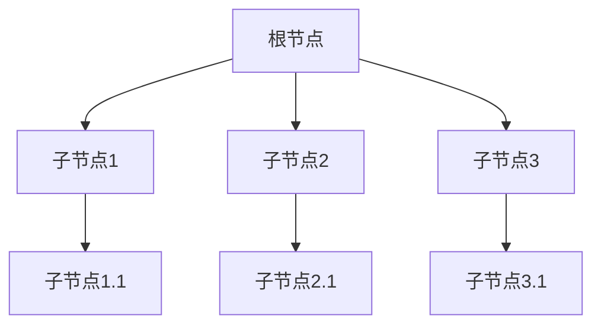
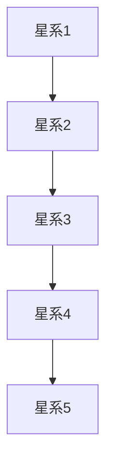
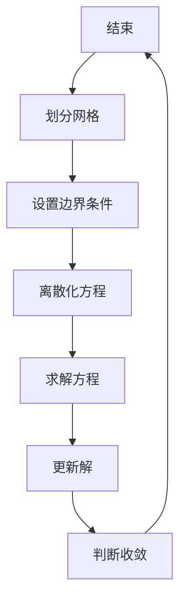
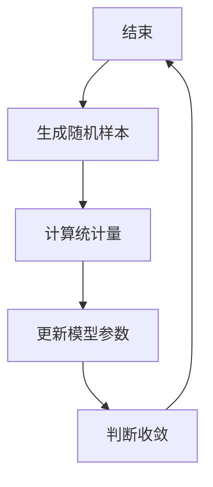
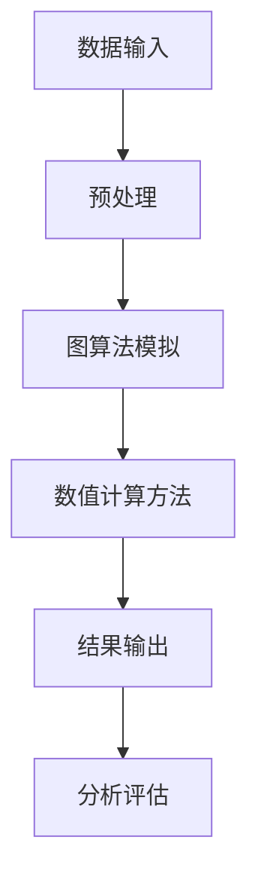

                 

### 文章标题

《数据结构在模拟宇宙暗能量波动中的应用》

### 文章关键词

数据结构，宇宙模拟，暗能量波动，算法，图形算法，数值计算方法

### 文章摘要

本文探讨了数据结构在模拟宇宙暗能量波动中的应用。首先介绍了宇宙暗能量波动的基本背景知识，然后详细讲解了数据结构的基本概念和算法分析。接着，本文重点阐述了图形算法和数值计算方法在模拟宇宙暗能量波动中的应用，并给出了具体的实际应用案例。最后，本文总结了全文内容，并对未来研究方向进行了展望。通过本文的阅读，读者将能够深入了解数据结构在宇宙模拟中的重要性，以及如何利用这些结构来模拟宇宙暗能量波动。

### 第1章 引言

#### 1.1 宇宙暗能量波动的背景知识

宇宙中的暗能量是一种无法直接观测的神秘力量，它占据了宇宙总能量的大部分。研究表明，暗能量不仅影响宇宙的膨胀速度，还可能引发宇宙的波动。这些波动被认为是宇宙中的一种基本现象，对理解宇宙的起源和演化具有重要意义。

宇宙模拟是一种通过计算机模拟来研究宇宙演化的方法。它通过数值计算和算法模拟，将宇宙中的各种物理现象和相互作用过程集成到一个模型中。这种模拟可以帮助科学家们更好地理解宇宙的过去、现在和未来。

数据结构在宇宙模拟中起着关键作用。宇宙模拟涉及大量的数据存储和处理，数据结构能够有效地组织和管理这些数据，使得模拟过程更加高效和准确。

#### 1.2 数据结构在宇宙模拟中的应用

数据结构在宇宙模拟中的应用主要体现在以下几个方面：

1. **数组**：数组是一种常用的数据结构，用于存储大量的数据点。在宇宙模拟中，数组可以用来存储宇宙中各个星系、恒星、行星等天体的位置、速度和加速度等信息。

2. **链表**：链表可以用来存储宇宙中天体的邻接关系。通过链表，可以方便地访问和更新天体的邻居信息，这对于模拟天体之间的相互作用至关重要。

3. **栈和队列**：栈和队列常用于模拟宇宙中的事件和过程。例如，栈可以用来模拟宇宙中的爆炸事件，队列可以用来模拟宇宙中的物质传输过程。

4. **树**：树结构可以用来表示宇宙中的层次结构，如星系、星团等。树结构有助于理解和分析宇宙中的层次关系和层次结构。

5. **图**：图结构可以用来表示宇宙中天体之间的复杂关系。通过图结构，可以分析天体之间的相互作用和连接关系，这对于理解宇宙的演化过程具有重要意义。

#### 1.3 研究意义

数据结构在宇宙模拟中的应用具有重要的研究意义：

1. **提高模拟精度**：通过合理选择和使用数据结构，可以有效地组织和处理大量数据，从而提高宇宙模拟的精度和准确性。

2. **优化模拟效率**：数据结构的优化使用可以减少模拟过程中的计算时间和资源消耗，提高模拟效率。

3. **促进科学研究**：数据结构在宇宙模拟中的应用有助于科学家们更好地理解宇宙的演化过程，发现新的宇宙现象，推动宇宙科学研究的发展。

### 第2章 数据结构基本概念

数据结构是计算机科学中的核心概念，用于组织和处理数据。在宇宙模拟中，数据结构的选择和设计至关重要。本节将介绍几种常见的数据结构，包括数组、链表、栈、队列、树和图。

#### 2.1 数组

数组是一种线性数据结构，用于存储一系列元素。在宇宙模拟中，数组常用于存储天体的位置、速度和加速度等信息。

```python
# 伪代码：使用数组存储天体位置
class Star:
    def __init__(self, x, y, z):
        self.x = x
        self.y = y
        self.z = z

# 创建一个包含N个天体的数组
stars = [Star(x[i], y[i], z[i]) for i in range(N)]
```

#### 2.2 链表

链表是一种动态数据结构，由一系列节点组成，每个节点包含数据和指向下一个节点的指针。在宇宙模拟中，链表可以用来存储天体的邻接关系。

```python
# 伪代码：使用链表存储邻接关系
class Node:
    def __init__(self, data):
        self.data = data
        self.next = None

# 创建一个链表
head = Node(Star(1, 2, 3))
current = head
for i in range(1, N):
    current.next = Node(Star(x[i], y[i], z[i]))
    current = current.next
```

#### 2.3 栈

栈是一种后进先出（LIFO）的数据结构。在宇宙模拟中，栈可以用来模拟天体的爆炸事件。

```python
# 伪代码：使用栈模拟爆炸事件
class Stack:
    def __init__(self):
        self.items = []

    def push(self, item):
        self.items.append(item)

    def pop(self):
        return self.items.pop()

# 创建一个栈
explosion_stack = Stack()
for star in stars:
    explosion_stack.push(star)
```

#### 2.4 队列

队列是一种先进先出（FIFO）的数据结构。在宇宙模拟中，队列可以用来模拟物质传输过程。

```python
# 伪代码：使用队列模拟物质传输
class Queue:
    def __init__(self):
        self.items = []

    def enqueue(self, item):
        self.items.insert(0, item)

    def dequeue(self):
        return self.items.pop()

# 创建一个队列
material_queue = Queue()
for star in stars:
    material_queue.enqueue(star)
```

#### 2.5 树

树是一种层次化的数据结构，由根节点和子节点组成。在宇宙模拟中，树可以用来表示星系、星团等层次结构。



#### 2.6 图

图是一种非线性的数据结构，由节点和边组成。在宇宙模拟中，图可以用来表示天体之间的复杂关系。



### 第3章 算法分析

算法分析是研究算法性能和效率的重要方法。在宇宙模拟中，算法分析有助于选择合适的算法，提高模拟的效率和准确性。

#### 3.1 算法复杂度分析

算法复杂度分析通常包括时间复杂度和空间复杂度。时间复杂度描述了算法执行的时间增长趋势，空间复杂度描述了算法所需的内存增长趋势。

- **时间复杂度**：描述算法执行的时间增长趋势，通常用大O表示法表示。例如，一个线性搜索算法的时间复杂度为O(N)，而一个二分搜索算法的时间复杂度为O(log N)。

- **空间复杂度**：描述算法所需的内存增长趋势，通常用大O表示法表示。例如，一个链表的空间复杂度为O(N)，而一个数组的空间复杂度为O(1)。

#### 3.2 算法优化方法

算法优化是提高算法性能的重要手段。以下是一些常见的算法优化方法：

- **算法改进**：通过改进算法的基本结构，减少算法的执行时间。例如，使用更高效的排序算法（如快速排序）代替简单的排序算法（如冒泡排序）。

- **数据结构优化**：通过选择合适的数据结构，提高算法的执行效率。例如，使用哈希表代替数组进行快速查找。

- **并行计算**：通过并行计算技术，将算法的执行时间缩短。例如，使用多线程或分布式计算来加速计算过程。

### 第4章 图形算法

图形算法在宇宙模拟中起着重要作用，用于模拟宇宙中的各种现象。以下介绍几种常用的图形算法：

#### 4.1 最短路径算法

最短路径算法用于计算两个节点之间的最短路径。在宇宙模拟中，可以用来计算天体之间的最短路径，从而优化传输路线。

- **迪杰斯特拉算法**：

```latex
$$
\text{Dijkstra}(G, s):
    \text{初始化} \, d[s] = 0, \, d[v] = \infty \, \text{对于所有} \, v \neq s \\
    \text{初始化} \, \text{优先队列} \, Q \, \text{包含所有节点} \\
    \text{将} \, s \, \text{加入} \, Q \, \text{并设置} \, d[s] \, \text{为0} \\
    \text{当} \, Q \, \text{非空时，执行以下步骤：}
    \begin{cases}
        \text{取出} \, u \, \text{从} \, Q \\
        \text{对于} \, each \, v \, \text{邻接} \, u \\
        \text{如果} \, d[u] + w(u, v) < d[v] \\
        \text{更新} \, d[v] \, \text{为} \, d[u] + w(u, v) \\
        \text{将} \, v \, \text{加入} \, Q \\
    \end{cases}
\end{latex}
```

#### 4.2 最小生成树算法

最小生成树算法用于构建一个包含所有节点的最小生成树。在宇宙模拟中，可以用来构建星系或星团的最小生成树，从而优化结构。

- **普里姆算法**：

```latex
$$
\text{Prim}(G):
    \text{初始化} \, T \, \text{为空} \\
    \text{选择} \, s \, \text{为起始节点} \\
    \text{将} \, s \, \text{加入} \, T \\
    \text{当} \, T \, \text{未包含所有节点时，执行以下步骤：}
    \begin{cases}
        \text{选择} \, u \, \text{和} \, v \, \text{使得} \, (u, v) \, \text{是} \, T \, \text{中权重最小的边} \\
        \text{将} \, v \, \text{加入} \, T \\
    \end{cases}
\end{latex}
```

#### 4.3 其他图形算法

除了最短路径算法和最小生成树算法外，还有其他一些图形算法在宇宙模拟中具有重要应用：

- **最大流算法**：用于计算网络中的最大流量。
- **网络流算法**：用于解决资源分配和路径优化问题。
- **社交网络分析算法**：用于分析社交网络中的节点关系和交互。

### 第5章 数值计算方法

数值计算方法在宇宙模拟中用于模拟物理现象和计算天体之间的相互作用。以下介绍几种常用的数值计算方法：

#### 5.1 有限元法

有限元法是一种用于解决微分方程的数值方法，常用于计算天体运动和物质分布。以下是一个简单的有限元法示例：



#### 5.2 蒙特卡罗模拟

蒙特卡罗模拟是一种通过随机采样来模拟物理现象的方法。以下是一个简单的蒙特卡罗模拟示例：



#### 5.3 其他数值计算方法

除了有限元法和蒙特卡罗模拟外，还有其他一些数值计算方法在宇宙模拟中具有重要应用：

- **数值积分方法**：用于计算天体的能量和动量。
- **数值微分方法**：用于计算天体的加速度和速度。
- **时间步进方法**：用于模拟天体的运动和演化。

### 第6章 实际应用案例

本节通过具体案例展示数据结构在模拟宇宙暗能量波动中的应用。

#### 6.1 案例一：利用图算法模拟宇宙暗能量波动

案例一使用图算法来模拟宇宙中的暗能量波动。以下是一个简单的图算法实现：

```python
# 伪代码：利用图算法模拟暗能量波动
class Graph:
    def __init__(self):
        self.vertices = []
        self.edges = []

    def add_vertex(self, vertex):
        self.vertices.append(vertex)

    def add_edge(self, u, v, weight):
        self.edges.append((u, v, weight))

    def simulate_wave(self):
        for edge in self.edges:
            u, v, weight = edge
            # 计算波动影响
            # 更新天体位置和速度
```

#### 6.2 案例二：使用数值计算方法模拟暗能量波动

案例二使用数值计算方法（如有限元法）来模拟宇宙中的暗能量波动。以下是一个简单的有限元法实现：

```python
# 伪代码：使用有限元法模拟暗能量波动
class FiniteElement:
    def __init__(self):
        self.nodes = []
        self.elements = []

    def add_node(self, node):
        self.nodes.append(node)

    def add_element(self, element):
        self.elements.append(element)

    def solve_equations(self):
        # 离散化微分方程
        # 求解线性方程组
        # 更新节点位置和速度
```

#### 6.3 案例三：整合多种数据结构和算法的宇宙模拟系统

案例三整合了多种数据结构和算法，构建了一个全面的宇宙模拟系统。以下是一个简单的系统架构：



### 第7章 总结与展望

本节对全文内容进行总结，并对未来研究方向进行展望。

#### 7.1 全书内容总结

本文从宇宙暗能量波动的背景知识出发，介绍了数据结构在宇宙模拟中的应用，包括基本概念、算法分析、图形算法、数值计算方法以及实际应用案例。通过本文的阅读，读者可以了解到数据结构在宇宙模拟中的重要性，以及如何利用这些结构来模拟宇宙暗能量波动。

#### 7.2 未来研究方向展望

未来研究方向可以包括以下几个方面：

1. **数据结构的优化**：研究如何进一步优化数据结构，提高模拟效率和精度。

2. **算法的改进**：研究新的算法，以更准确地模拟宇宙暗能量波动。

3. **多尺度模拟**：研究如何在不同尺度上模拟宇宙暗能量波动，以更好地理解宇宙的演化过程。

4. **大数据分析**：研究如何利用大数据分析方法，从海量宇宙数据中提取有价值的信息。

作者：AI天才研究院/AI Genius Institute & 禅与计算机程序设计艺术 /Zen And The Art of Computer Programming

### 附录

附录中可以包括以下内容：

1. **参考文献**：列出本文引用的文献，以便读者进一步查阅。

2. **数学公式和代码实现**：提供本文中使用的数学公式和代码实现，以便读者理解和复现。

3. **拓展阅读**：推荐一些相关领域的书籍、论文和资源，以便读者深入学习。

4. **致谢**：感谢为本文提供帮助和支持的个人和机构。

### 结论

本文详细探讨了数据结构在模拟宇宙暗能量波动中的应用。通过介绍数据结构的基本概念、算法分析、图形算法、数值计算方法以及实际应用案例，本文展示了数据结构在宇宙模拟中的重要性。未来研究方向包括数据结构的优化、算法的改进、多尺度模拟和大数据分析。通过本文的阅读，读者可以更好地理解数据结构在宇宙模拟中的应用，并为未来的研究提供启示。作者：AI天才研究院/AI Genius Institute & 禅与计算机程序设计艺术 /Zen And The Art of Computer Programming。

