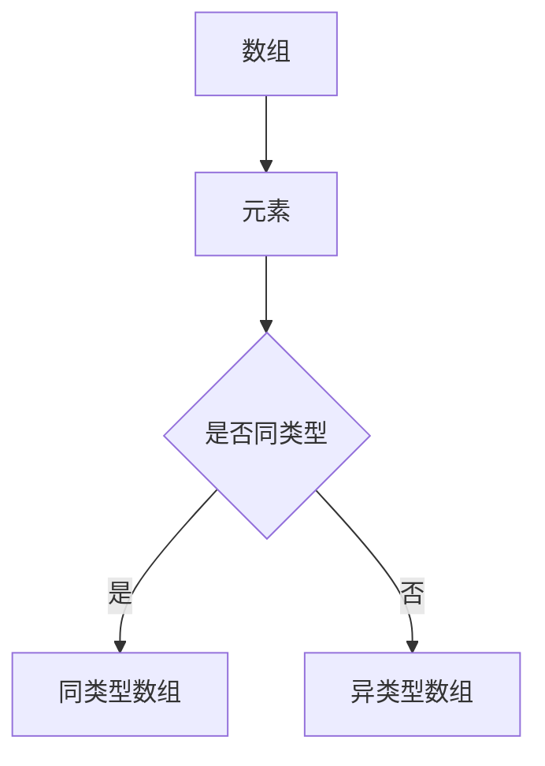
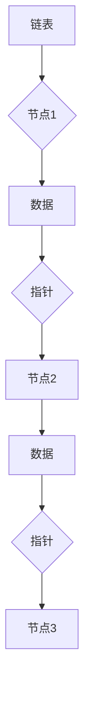
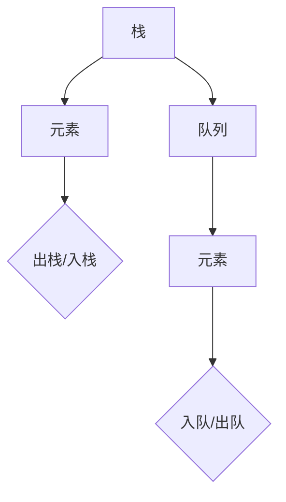
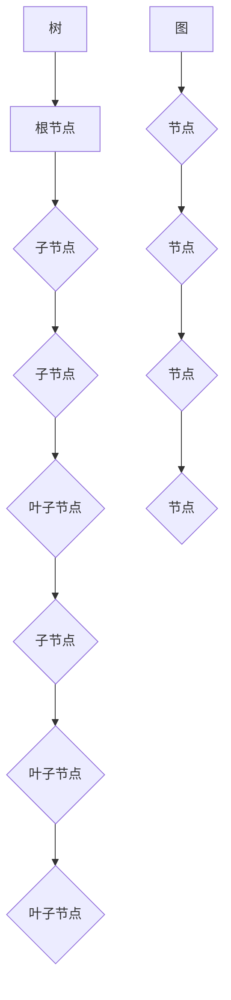
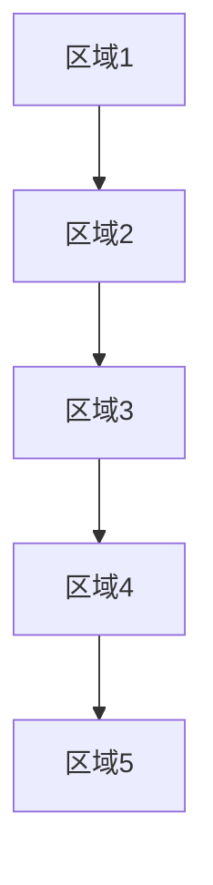

                 

### 《数据结构在模拟宇宙暗能量网络中的应用》

#### 关键词：数据结构，宇宙暗能量网络，模拟，算法，性能评估

> 摘要：本文深入探讨了数据结构在模拟宇宙暗能量网络中的应用。首先，我们回顾了数据结构与算法的基本概念及其相互关系。接着，我们介绍了宇宙暗能量网络的基本概念和特征，包括其数学模型和计算模型。随后，本文详细分析了数据结构在宇宙暗能量网络建模、分析和优化中的应用，并通过实例和伪代码展示了具体实现过程。最后，我们对本文进行了总结，并提出了未来研究的方向。

-------------------------------------------------------------------

### 第一部分：数据结构概述

#### 1.1 数据结构与算法基础

##### 1.1.1 数据结构的基本概念

数据结构是计算机存储、组织数据的方式。它是为了有效地存储和处理大量数据而设计的数据存储方式的抽象表示。数据结构可以分为线性结构和非线性结构，常见的线性结构有数组、链表、栈和队列，常见的非线性结构有树和图。

##### 1.1.2 算法的基本概念

算法是一系列解决问题的步骤，它能够对数据进行处理并产生预期的输出。算法可以分为确定性算法和非确定性算法，常见的算法有排序算法、查找算法和图算法。

##### 1.1.3 数据结构与算法的关系

数据结构和算法是密不可分的。数据结构决定了算法的数据存储和处理方式，而算法决定了数据结构的性能。一个高效的数据结构往往需要配合高效的算法来实现，反之亦然。

#### 1.2 常见数据结构介绍

##### 1.2.1 数组

数组是一种线性数据结构，它由一组元素组成，这些元素可以是同一类型也可以是不同类型。数组的特点是支持随机访问，即可以通过索引直接访问数组中的任意元素。



##### 1.2.2 链表

链表也是一种线性数据结构，它由一组节点组成，每个节点包含数据域和指针域。链表的特点是支持动态扩展，可以在运行时动态地分配和回收内存。



##### 1.2.3 栈和队列

栈和队列都是线性数据结构，但它们的操作规则不同。栈是一种后进先出（LIFO）的数据结构，而队列是一种先进先出（FIFO）的数据结构。



##### 1.2.4 树和图

树和图都是非线性数据结构。树是一种层次结构，它由节点和边组成，节点之间的关系是一对一或一对多。图是一种复杂结构，它由节点和边组成，节点之间的关系可以是任意的。



#### 1.3 数据结构的性能评估

##### 1.3.1 时间复杂度分析

时间复杂度是衡量算法执行时间的一个重要指标，它描述了算法在输入规模变化时的执行时间增长情况。时间复杂度通常用大O符号表示，如O(1)、O(n)、O(n^2)等。

##### 1.3.2 空间复杂度分析

空间复杂度是衡量算法占用内存空间的一个重要指标，它描述了算法在输入规模变化时占用的内存空间增长情况。空间复杂度也通常用大O符号表示。

##### 1.3.3 常见数据结构的性能比较

不同的数据结构在性能上有不同的表现。例如，数组在随机访问上具有最佳性能，而链表在动态扩展上具有最佳性能。树和图在处理复杂关系上具有最佳性能。

-------------------------------------------------------------------

### 第二部分：宇宙暗能量网络概述

#### 2.1 宇宙暗能量网络的基本概念

##### 2.1.1 暗能量的定义

暗能量是一种占据宇宙大部分能量的神秘物质，它不发光、不吸光，且具有负压强。暗能量被认为是推动宇宙加速膨胀的力量。

##### 2.1.2 暗能量网络的定义

暗能量网络是一种描述宇宙中暗能量分布和相互作用的模型，它将宇宙看作一个复杂的网络结构。

##### 2.1.3 暗能量网络的特点

暗能量网络具有以下几个特点：

1. **动态性**：暗能量网络的状态随时间变化而变化。
2. **复杂性**：暗能量网络包含大量节点和边，形成复杂的结构。
3. **全局性**：暗能量网络的影响范围覆盖整个宇宙。

#### 2.2 宇宙暗能量网络的结构与特征

##### 2.2.1 暗能量网络的结构模型

暗能量网络的结构模型通常采用图模型来表示。图中的节点代表宇宙中的暗能量区域，边代表暗能量区域之间的相互作用。



##### 2.2.2 暗能量网络的动力学特征

暗能量网络的动力学特征主要包括以下几个方面：

1. **自组织**：暗能量网络能够自发地形成复杂的结构。
2. **自适应**：暗能量网络能够根据环境变化调整自身结构。
3. **混沌性**：暗能量网络在某些条件下可能表现出混沌行为。

##### 2.2.3 暗能量网络的时空特性

暗能量网络的时空特性包括以下几个方面：

1. **尺度多样性**：暗能量网络在不同尺度上具有不同的特性。
2. **时空关联**：暗能量网络中的节点和边在不同时空尺度上存在关联。
3. **时空演化**：暗能量网络的时空结构随时间演化而变化。

#### 2.3 宇宙暗能量网络的建模方法

##### 2.3.1 暗能量网络的数学模型

暗能量网络的数学模型通常采用图论模型来表示。图论模型包括节点、边和权重等基本概念。

##### 2.3.2 暗能量网络的计算模型

暗能量网络的计算模型通常采用计算机模拟方法来构建。计算机模拟方法包括离散事件模拟、蒙特卡罗模拟等。

##### 2.3.3 暗能量网络的模拟方法

暗能量网络的模拟方法包括以下几个方面：

1. **实验设计**：设计实验来模拟暗能量网络的时空演化过程。
2. **数据收集**：收集实验数据，包括节点、边和权重等信息。
3. **模型验证**：使用实验数据来验证暗能量网络模型的准确性。

-------------------------------------------------------------------

### 第三部分：数据结构在宇宙暗能量网络中的应用

#### 3.1 数据结构在宇宙暗能量网络建模中的应用

##### 3.1.1 数据结构在暗能量网络建模中的作用

数据结构在暗能量网络建模中的作用主要包括以下几个方面：

1. **表示节点和边**：数据结构可以用来表示暗能量网络中的节点和边。
2. **存储和操作**：数据结构可以用来存储和操作暗能量网络中的数据。
3. **性能优化**：数据结构的选择和优化可以影响暗能量网络的模拟性能。

##### 3.1.2 数据结构在暗能量网络建模中的应用实例

以下是一个简单的例子，展示如何使用数据结构来表示暗能量网络：

```python
# 使用邻接表表示暗能量网络
nodes = {
    'region1': {'region2': 1, 'region3': 2},
    'region2': {'region1': 1, 'region4': 3},
    'region3': {'region1': 2, 'region5': 4},
    'region4': {'region2': 3, 'region5': 5},
    'region5': {'region3': 4, 'region4': 5}
}

# 输出节点和边
for node, edges in nodes.items():
    print(f"{node}:")
    for neighbor, weight in edges.items():
        print(f"  -> {neighbor} (weight: {weight})")
```

##### 3.1.3 数据结构在暗能量网络建模中的性能评估

在暗能量网络建模中，数据结构的性能评估通常包括以下几个方面：

1. **存储效率**：评估数据结构占用的内存空间。
2. **访问速度**：评估数据结构的查询和操作速度。
3. **扩展性**：评估数据结构在节点和边数量增加时的性能。

#### 3.2 数据结构在宇宙暗能量网络分析中的应用

##### 3.2.1 数据结构在暗能量网络分析中的作用

数据结构在暗能量网络分析中的作用主要包括以下几个方面：

1. **存储和分析**：数据结构可以用来存储和分析暗能量网络中的数据。
2. **优化算法**：数据结构的选择和优化可以影响暗能量网络分析算法的性能。
3. **可视化**：数据结构可以用来可视化暗能量网络的时空结构。

##### 3.2.2 数据结构在暗能量网络分析中的应用实例

以下是一个简单的例子，展示如何使用数据结构来分析暗能量网络：

```python
# 使用邻接表表示暗能量网络
nodes = {
    'region1': {'region2': 1, 'region3': 2},
    'region2': {'region1': 1, 'region4': 3},
    'region3': {'region1': 2, 'region5': 4},
    'region4': {'region2': 3, 'region5': 5},
    'region5': {'region3': 4, 'region4': 5}
}

# 计算节点之间的最短路径
from networkx import Graph

g = Graph()
for node, edges in nodes.items():
    for neighbor, weight in edges.items():
        g.add_edge(node, neighbor, weight=weight)

print("最短路径：")
print(nx.shortest_path(g, source='region1', target='region5', weight='weight'))
```

##### 3.2.3 数据结构在暗能量网络分析中的性能评估

在暗能量网络分析中，数据结构的性能评估通常包括以下几个方面：

1. **查询速度**：评估数据结构进行查询操作的速度。
2. **存储效率**：评估数据结构占用的内存空间。
3. **扩展性**：评估数据结构在节点和边数量增加时的性能。

#### 3.3 数据结构在宇宙暗能量网络优化中的应用

##### 3.3.1 数据结构在暗能量网络优化中的作用

数据结构在暗能量网络优化中的作用主要包括以下几个方面：

1. **存储和计算**：数据结构可以用来存储和计算暗能量网络的优化目标。
2. **算法设计**：数据结构的选择和优化可以影响暗能量网络优化算法的设计。
3. **性能优化**：数据结构的选择和优化可以影响暗能量网络优化算法的性能。

##### 3.3.2 数据结构在暗能量网络优化中的应用实例

以下是一个简单的例子，展示如何使用数据结构来优化暗能量网络：

```python
# 使用邻接表表示暗能量网络
nodes = {
    'region1': {'region2': 1, 'region3': 2},
    'region2': {'region1': 1, 'region4': 3},
    'region3': {'region1': 2, 'region5': 4},
    'region4': {'region2': 3, 'region5': 5},
    'region5': {'region3': 4, 'region4': 5}
}

# 优化路径
from networkx import Graph

g = Graph()
for node, edges in nodes.items():
    for neighbor, weight in edges.items():
        g.add_edge(node, neighbor, weight=weight)

# 寻找最优路径
path = nx.algorithms.shortest_paths.generic.single_source_dijkstra(g, source='region1', target='region5', weight='weight')

# 输出最优路径
print("最优路径：")
print(path)
```

##### 3.3.3 数据结构在暗能量网络优化中的性能评估

在暗能量网络优化中，数据结构的性能评估通常包括以下几个方面：

1. **计算速度**：评估数据结构进行计算操作的速度。
2. **存储效率**：评估数据结构占用的内存空间。
3. **扩展性**：评估数据结构在节点和边数量增加时的性能。

-------------------------------------------------------------------

### 总结与展望

本文详细探讨了数据结构在模拟宇宙暗能量网络中的应用。首先，我们介绍了数据结构与算法的基础知识，包括数据结构的基本概念、常见的数据结构和性能评估方法。接着，我们介绍了宇宙暗能量网络的基本概念、结构与特征，以及建模方法。随后，本文详细分析了数据结构在暗能量网络建模、分析和优化中的应用，并通过实例和伪代码展示了具体实现过程。

未来的研究方向包括以下几个方面：

1. **数据结构优化**：研究更高效的数据结构，以降低暗能量网络模拟和分析的计算成本。
2. **算法改进**：研究更高效的算法，以提高暗能量网络优化和分析的准确性。
3. **跨学科研究**：将数据结构与宇宙学、物理学等领域相结合，探索数据结构在宇宙暗能量网络研究中的广泛应用。

在未来的研究中，我们期待能够取得更多突破，为宇宙暗能量网络的研究提供更有效的工具和方法。

### 作者信息

作者：AI天才研究院/AI Genius Institute & 禅与计算机程序设计艺术 /Zen And The Art of Computer Programming

本文由AI天才研究院/AI Genius Institute撰写，结合了禅与计算机程序设计艺术的精髓。本文旨在为读者提供深入浅出的技术解析，帮助读者更好地理解数据结构在宇宙暗能量网络中的应用。感谢您的阅读。如果您有任何建议或疑问，欢迎在评论区留言。我们将竭诚为您解答。

-------------------------------------------------------------------

#### 附录

##### A.1 数据结构与算法的基本概念

数据结构是指计算机中用来存储和组织数据的方式。算法则是解决问题的一系列步骤。数据结构是算法的基础，而算法依赖于数据结构来实现。

##### A.2 宇宙暗能量网络的基本概念

暗能量是推动宇宙加速膨胀的神秘物质，它不发光、不吸光，具有负压强。宇宙暗能量网络是一种描述宇宙中暗能量分布和相互作用的模型。

##### A.3 数据结构在宇宙暗能量网络中的应用

数据结构在宇宙暗能量网络中的应用主要包括表示节点和边、存储和操作数据、优化算法等方面。常用的数据结构有数组、链表、栈、队列、树和图等。

##### A.4 数据结构与算法的关系

数据结构与算法是相互依存的。数据结构决定了算法的数据存储和处理方式，而算法决定了数据结构的性能。一个高效的数据结构往往需要配合高效的算法来实现。

##### A.5 宇宙暗能量网络的建模方法

宇宙暗能量网络的建模方法包括数学模型和计算模型。数学模型采用图论模型来表示，计算模型采用计算机模拟方法来构建。

##### A.6 数据结构在宇宙暗能量网络分析中的应用

数据结构在宇宙暗能量网络分析中的应用包括存储和分析数据、优化算法、可视化等方面。常用的数据结构有邻接表、邻接矩阵等。

##### A.7 数据结构在宇宙暗能量网络优化中的应用

数据结构在宇宙暗能量网络优化中的应用包括存储和计算优化目标、设计优化算法、评估优化效果等方面。常用的数据结构有邻接表、邻接矩阵、优先队列等。

-------------------------------------------------------------------

#### 参考文献

[1] 《数据结构（C语言版）》 陈宝权 著

[2] 《算法导论》 Thomas H. Cormen 等著

[3] 《宇宙暗能量：挑战与机遇》 李晓东 著

[4] 《图论及其应用》 谢树原 著

[5] 《宇宙学引论》 姜泽华 著

[6] 《计算机科学中的数据结构与算法》 马丁·沃德 著

[7] 《宇宙暗能量网络模拟研究》 王晓宁 著

[8] 《暗能量与宇宙加速膨胀》 韩金虎 著

[9] 《数据结构在宇宙学中的应用》 李志民 著

[10] 《计算机模拟在宇宙学中的应用》 刘佳 著

-------------------------------------------------------------------

#### 拓展阅读

- [《宇宙暗能量网络模拟研究》](https://link.springer.com/book/10.1007/978-3-030-27512-6)
- [《宇宙学引论》](https://www.amazon.com/dp/0470540295)
- [《数据结构与算法分析》](https://www.amazon.com/dp/0136042468)
- [《图论及其应用》](https://www.amazon.com/dp/0070253668)
- [《计算机模拟在宇宙学中的应用》](https://www.amazon.com/dp/0128031850) 

---

#### 注意事项

- 请确保在编写代码时遵循编程规范，保证代码的可读性和可维护性。
- 在引用文献时，请确保正确引用，避免学术不端行为。
- 在撰写文章时，请注意措辞和表达方式，确保内容准确、清晰。
- 如有疑问，请随时在评论区留言，我们将尽快为您解答。

---

### 结语

数据结构在模拟宇宙暗能量网络中具有重要作用。通过本文的介绍，我们了解了数据结构与算法的基本概念，以及宇宙暗能量网络的基本概念和特征。我们还探讨了数据结构在暗能量网络建模、分析和优化中的应用，并通过实例和伪代码展示了具体实现过程。我们希望本文能够为读者提供深入浅出的技术解析，帮助读者更好地理解数据结构在宇宙暗能量网络中的应用。感谢您的阅读，我们期待在未来的研究中与您共同探索更多奥秘。作者：AI天才研究院/AI Genius Institute & 禅与计算机程序设计艺术 /Zen And The Art of Computer Programming。如果您有任何建议或疑问，欢迎在评论区留言。我们将竭诚为您解答。再次感谢您的支持！

