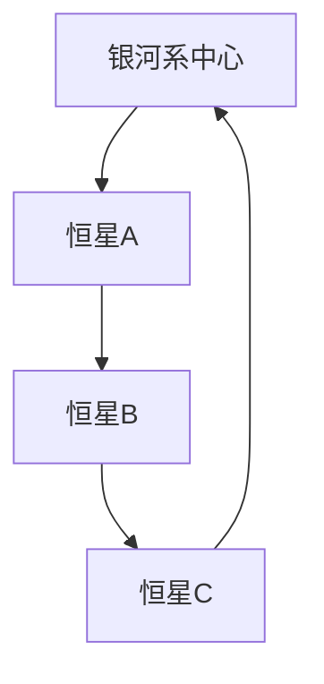

                 


### 第1章 引言

#### 1.1 书籍背景与目的

宇宙的奥秘吸引着人类数千年的探索。在过去的几个世纪里，科学家们通过观测和理论模型，对宇宙的构成和演化有了更深入的理解。然而，宇宙中的一些现象仍然难以解释，比如暗能量。暗能量是一种神秘的力量，它占据了宇宙能量密度的大部分，但至今未能直接观测到。为了更好地理解宇宙，科学家们开始寻求新的方法和技术。

本书籍旨在探讨数据结构在模拟宇宙暗能量网络拓扑中的应用。数据结构是计算机科学中用于存储和组织数据的方法，它能够帮助我们更有效地处理和分析大量数据。在宇宙学中，数据结构可以用来建模和模拟宇宙中的各种现象，如星系分布、引力波传播等。本书将介绍如何将数据结构应用于宇宙学中的暗能量研究，帮助读者理解这一领域的前沿知识。

#### 1.2 宇宙暗能量与网络拓扑概述

**宇宙暗能量的定义：**
宇宙暗能量是一种假设存在的物质，它占据了宇宙能量密度的大部分。暗能量具有负压强，导致宇宙加速膨胀。尽管它的影响在宇宙尺度上被广泛观测到，但暗能量的本质和物理机制至今仍是一个未解之谜。

**网络拓扑的基本概念：**
网络拓扑是指网络中各个节点和边的关系结构。在计算机科学中，网络拓扑被广泛应用于网络设计和分析。在宇宙学中，网络拓扑可以用来描述宇宙中星系、星团等大规模结构的分布。

#### 数据结构在宇宙学中的应用

数据结构在宇宙学中的应用主要体现在以下几个方面：

1. **数据处理与分析：** 宇宙中的数据量大且复杂，数据结构可以帮助科学家们高效地存储、处理和分析这些数据。

2. **模型构建与模拟：** 通过数据结构，科学家们可以构建更加准确的宇宙模型，模拟宇宙的演化过程。

3. **网络分析：** 数据结构可以帮助科学家们分析宇宙中大规模结构的拓扑特征，如星系的分布模式和引力波的传播路径。

#### 本书结构

本书分为七个章节，具体结构如下：

- **第1章 引言**：介绍书籍的背景和目的，概述宇宙暗能量与网络拓扑的基本概念。
- **第2章 数据结构基础**：介绍基础数据结构，如数组、链表、栈、队列、树和图。
- **第3章 宇宙网络拓扑中的数据结构应用**：讨论数据结构在宇宙网络拓扑建模中的应用，包括数据结构的选择和网络拓扑的构建。
- **第4章 暗能量网络的拓扑分析**：分析暗能量网络的拓扑特征和演化过程。
- **第5章 数据结构在暗能量网络分析中的应用**：介绍数据结构在暗能量网络数据预处理和分析中的应用。
- **第6章 模拟宇宙暗能量网络的案例研究**：通过具体案例展示数据结构在暗能量网络分析中的应用。
- **第7章 总结与展望**：总结研究成果，探讨数据结构在宇宙学领域的未来应用前景。

通过以上章节的介绍，本书将带领读者深入了解数据结构在模拟宇宙暗能量网络拓扑中的应用，为读者在宇宙学领域的研究提供新的思路和方法。

### 第2章 数据结构基础

#### 2.1 数据结构与算法概述

数据结构是计算机科学中用于存储和组织数据的方法，它为数据操作提供了一种有效的组织形式。数据结构的选择对程序的效率和性能有着重要影响。算法是解决特定问题的步骤序列，它通过操作数据结构来处理数据。数据结构与算法紧密相连，一个有效的算法通常依赖于合适的数据结构。

在数据结构的选择上，我们需要考虑以下几个关键因素：

- **存储效率**：数据结构在存储数据时需要占用一定的内存空间，我们需要选择能够有效利用内存的数据结构。
- **访问速度**：不同的数据结构在访问数据时有着不同的速度。例如，数组提供了快速的随机访问，而链表则提供了高效的插入和删除操作。
- **操作复杂度**：数据结构的操作复杂度决定了程序运行的效率。例如，二分搜索的时间复杂度为O(log n)，而线性搜索的时间复杂度为O(n)。

常见的几种基本数据结构如下：

1. **数组与链表**：数组是一种固定大小的数据结构，提供了快速的随机访问。链表则是通过节点链接的方式存储数据，提供了高效的插入和删除操作。

2. **栈与队列**：栈是一种后进先出（LIFO）的数据结构，常用于处理递归和回溯问题。队列是一种先进先出（FIFO）的数据结构，常用于任务调度和缓冲管理。

3. **树与二叉树**：树是一种层次结构，用于表示具有层次关系的数据。二叉树是一种特殊的树，每个节点最多有两个子节点。二叉树广泛应用于搜索、排序和遍历等问题。

4. **图**：图是一种由节点和边组成的数据结构，用于表示复杂的关系网络。图广泛用于网络设计、社交网络分析等领域。

#### 2.2 基础数据结构

**数组与链表**

**数组**是一种线性数据结构，它通过连续的内存空间来存储数据。数组提供了快速的随机访问，时间复杂度为O(1)。但是，数组的长度在创建时就已经确定，无法动态扩展。以下是一个数组的基本操作：

```python
# 创建数组
array = [1, 2, 3, 4, 5]

# 访问数组元素
print(array[0])  # 输出：1

# 修改数组元素
array[0] = 0

# 添加数组元素
array.append(6)

# 删除数组元素
del array[0]
```

**链表**是由节点组成的线性数据结构，每个节点包含数据和指向下一个节点的指针。链表提供了高效的插入和删除操作，时间复杂度为O(1)。以下是一个链表的基本操作：

```python
# 创建链表节点
class Node:
    def __init__(self, data):
        self.data = data
        self.next = None

# 创建链表
head = Node(1)
node2 = Node(2)
node3 = Node(3)
head.next = node2
node2.next = node3

# 访问链表元素
current = head
while current:
    print(current.data)
    current = current.next

# 修改链表元素
node2.data = 4

# 添加链表元素
new_node = Node(5)
current = head
while current.next:
    current = current.next
current.next = new_node

# 删除链表元素
current = head
while current.next != new_node:
    current = current.next
current.next = None
```

**栈与队列**

**栈**是一种后进先出（LIFO）的数据结构，常用于处理递归和回溯问题。以下是一个栈的基本操作：

```python
# 创建栈
class Stack:
    def __init__(self):
        self.items = []

    # 入栈
    def push(self, item):
        self.items.append(item)

    # 出栈
    def pop(self):
        return self.items.pop()

    # 查看栈顶元素
    def peek(self):
        return self.items[-1]

# 使用栈
stack = Stack()
stack.push(1)
stack.push(2)
stack.push(3)
print(stack.peek())  # 输出：3
print(stack.pop())  # 输出：3
```

**队列**是一种先进先出（FIFO）的数据结构，常用于任务调度和缓冲管理。以下是一个队列的基本操作：

```python
# 创建队列
class Queue:
    def __init__(self):
        self.items = []

    # 入队
    def enqueue(self, item):
        self.items.append(item)

    # 出队
    def dequeue(self):
        return self.items.pop(0)

    # 查看队列头部元素
    def front(self):
        return self.items[0]

# 使用队列
queue = Queue()
queue.enqueue(1)
queue.enqueue(2)
queue.enqueue(3)
print(queue.front())  # 输出：1
print(queue.dequeue())  # 输出：1
```

**树与二叉树**

**树**是一种层次结构，用于表示具有层次关系的数据。树由节点组成，每个节点可以有零个或多个子节点。以下是一个树的基本操作：

```python
# 创建树
class Node:
    def __init__(self, data):
        self.data = data
        self.children = []

# 添加子节点
root = Node('root')
child1 = Node('child1')
child2 = Node('child2')
root.children.append(child1)
root.children.append(child2)

# 遍历树
def traverse_tree(node):
    print(node.data)
    for child in node.children:
        traverse_tree(child)

traverse_tree(root)
```

**二叉树**是一种特殊的树，每个节点最多有两个子节点。二叉树广泛应用于搜索、排序和遍历等问题。以下是一个二叉树的基本操作：

```python
# 创建二叉树
class TreeNode:
    def __init__(self, data):
        self.data = data
        self.left = None
        self.right = None

# 添加子节点
root = TreeNode('root')
left_child = TreeNode('left')
right_child = TreeNode('right')
root.left = left_child
root.right = right_child

# 遍历二叉树
def inorder_traversal(node):
    if node:
        inorder_traversal(node.left)
        print(node.data)
        inorder_traversal(node.right)

inorder_traversal(root)
```

通过以上对基础数据结构的介绍，读者可以了解不同数据结构的特性和基本操作。在接下来的章节中，我们将探讨这些数据结构在宇宙学中的应用。

### 第3章 宇宙网络拓扑中的数据结构应用

#### 3.1 数据结构在宇宙网络拓扑建模中的应用

宇宙网络拓扑是指宇宙中各种天体（如星系、星团等）之间的空间分布结构。这种拓扑结构对于理解宇宙的演化过程、暗能量的作用以及宇宙的大尺度特征具有重要意义。为了有效地模拟和探究宇宙网络拓扑，我们需要选择合适的数据结构。

在宇宙网络拓扑建模中，常用的数据结构包括图、树和网格。这些数据结构能够以不同的方式表示宇宙中的天体及其相互作用，帮助我们更深入地分析宇宙网络。

**图**是一种用于表示复杂关系的数学结构，它由节点和边组成。在宇宙网络拓扑建模中，图可以用来表示星系之间的引力相互作用。每个节点代表一个星系，边代表星系之间的引力作用。图的结构能够直观地展示星系的分布和相互作用，有助于我们理解宇宙的大尺度结构。

**树**是一种层次结构，它用于表示具有层次关系的数据。在宇宙网络拓扑建模中，树可以用来表示星系团的层次结构。每个节点代表一个星系团，其子节点代表该星系团中的星系。树的结构能够清晰地展示星系团的层次关系，帮助我们分析星系团的分布特征。

**网格**是一种将宇宙空间划分为规则的矩形网格的数据结构。在宇宙网络拓扑建模中，网格可以用来表示宇宙中的天体分布。每个网格单元代表宇宙空间中的一个区域，其中心代表一个天体。网格的结构能够方便地处理大规模天体数据，有助于我们分析宇宙的密度分布。

**数据结构的选择**：

在选择数据结构时，我们需要考虑以下几个方面：

1. **数据规模**：宇宙中的天体数量庞大，数据规模巨大。因此，我们需要选择能够高效存储和处理大规模数据的数据结构。
2. **空间复杂度**：不同数据结构在存储数据时占用的空间不同。我们需要选择空间复杂度较低的数据结构，以减少存储需求。
3. **操作效率**：数据结构需要支持高效的添加、删除和查询操作。我们需要选择能够满足这些操作需求的数据结构。
4. **拓扑特征**：不同的数据结构能够展示不同的拓扑特征。我们需要选择能够准确表示宇宙网络拓扑特征的数据结构。

**宇宙网络拓扑的构建**：

构建宇宙网络拓扑的过程可以分为以下几个步骤：

1. **数据采集**：从宇宙观测数据中提取天体位置和相互作用信息。
2. **数据预处理**：对采集到的数据进行清洗和规范化，确保数据质量。
3. **数据结构选择**：根据宇宙网络拓扑的特征和需求，选择合适的图、树或网格数据结构。
4. **拓扑构建**：使用选择的数据结构，构建宇宙网络拓扑模型。对于图，我们需要建立节点和边的对应关系；对于树，我们需要建立星系团和星系的层次关系；对于网格，我们需要划分网格单元并确定天体的位置。
5. **拓扑分析**：对构建好的宇宙网络拓扑进行分析，提取拓扑特征和演化规律。

通过以上步骤，我们可以构建一个准确的宇宙网络拓扑模型，为后续的宇宙学研究提供基础。

**案例研究**：

以银河系为例，我们可以使用图数据结构来构建银河系的网络拓扑。每个星系代表一个节点，星系之间的引力作用代表边。通过分析银河系网络拓扑，我们可以了解银河系的结构特征和演化过程。



在这个示例中，银河系中心代表节点A，恒星A、B和C代表节点B、C和D。星系之间的引力作用通过边连接，形成了一个简单的银河系网络拓扑。

通过数据结构在宇宙网络拓扑建模中的应用，我们可以更好地理解和分析宇宙的奥秘。在接下来的章节中，我们将进一步探讨数据结构在宇宙网络拓扑分析中的应用。

#### 3.2 数据结构与宇宙网络拓扑算法

在宇宙网络拓扑分析中，算法起着至关重要的作用。算法能够帮助我们高效地处理和解析宇宙网络中的大量数据，从而提取出有用的信息。数据结构与算法密不可分，合理选择数据结构可以显著提升算法的性能。以下是几种常见的算法及其与数据结构的结合方式。

**搜索算法**：

搜索算法用于在宇宙网络拓扑中查找特定的节点或路径。常用的搜索算法包括广度优先搜索（BFS）和深度优先搜索（DFS）。

**广度优先搜索（BFS）**：

广度优先搜索是一种无回溯的搜索算法，它从源节点开始，逐层遍历网络，直到找到目标节点或确定不存在路径。在广度优先搜索中，我们可以使用队列这种数据结构来存储待访问的节点。

**伪代码**：

```python
// 广度优先搜索（BFS）
def bfs(graph, start, target):
    visited = set()
    queue = Queue()
    queue.enqueue((start, []))
    
    while not queue.isEmpty():
        node, path = queue.dequeue()
        if node not in visited:
            visited.add(node)
            path.append(node)
            if node == target:
                return path
            for neighbor in graph[node]:
                if neighbor not in visited:
                    queue.enqueue((neighbor, path.copy()))
    
    return None
```

**深度优先搜索（DFS）**：

深度优先搜索是一种有回溯的搜索算法，它从源节点开始，尽可能深地搜索网络，直到找到目标节点或确定不存在路径。在深度优先搜索中，我们可以使用栈这种数据结构来存储待访问的节点。

**伪代码**：

```python
// 深度优先搜索（DFS）
def dfs(graph, start, target):
    visited = set()
    stack = Stack()
    stack.push((start, []))
    
    while not stack.isEmpty():
        node, path = stack.pop()
        if node not in visited:
            visited.add(node)
            path.append(node)
            if node == target:
                return path
            for neighbor in graph[node]:
                if neighbor not in visited:
                    stack.push((neighbor, path.copy()))
    
    return None
```

**路径规划算法**：

路径规划算法用于在宇宙网络拓扑中寻找从源节点到目标节点的最优路径。常用的路径规划算法包括迪杰斯特拉算法（Dijkstra）和A*算法。

**迪杰斯特拉算法（Dijkstra）**：

迪杰斯特拉算法是一种基于优先级的搜索算法，它从源节点开始，逐步扩展网络，计算每个节点到源节点的最短路径。

**伪代码**：

```python
// 迪杰斯特拉算法（Dijkstra）
def dijkstra(graph, start):
    distances = {node: float('infinity') for node in graph}
    distances[start] = 0
    visited = set()
    priority_queue = PriorityQueue()
    priority_queue.enqueue((start, 0))
    
    while not priority_queue.isEmpty():
        current, _ = priority_queue.dequeue()
        if current not in visited:
            visited.add(current)
            for neighbor, weight in graph[current].items():
                distance = distances[current] + weight
                if distance < distances[neighbor]:
                    distances[neighbor] = distance
                    priority_queue.enqueue((neighbor, distance))
    
    return distances
```

**A*算法**：

A*算法是一种启发式搜索算法，它利用目标节点的估计距离（启发函数）来优化搜索过程。A*算法能够快速找到从源节点到目标节点的最优路径。

**伪代码**：

```python
// A*算法
def a_star(graph, start, target, heuristic):
    open_set = PriorityQueue()
    open_set.enqueue((start, heuristic(start, target)))
    came_from = {}
    g_score = {node: float('infinity') for node in graph}
    g_score[start] = 0
    
    while not open_set.isEmpty():
        current, _ = open_set.dequeue()
        
        if current == target:
            path = []
            while current in came_from:
                path.append(current)
                current = came_from[current]
            path.reverse()
            return path
        
        for neighbor, weight in graph[current].items():
            tentative_g_score = g_score[current] + weight
            if tentative_g_score < g_score[neighbor]:
                came_from[neighbor] = current
                g_score[neighbor] = tentative_g_score
                f_score = tentative_g_score + heuristic(neighbor, target)
                open_set.enqueue((neighbor, f_score))
    
    return None
```

**网络优化算法**：

网络优化算法用于在宇宙网络拓扑中优化网络性能，如最小生成树、最短路径和最大流等问题。这些算法通常基于图论中的算法，如普里姆算法、克鲁斯卡尔算法和福特-富克森算法。

**普里姆算法**：

普里姆算法用于构建最小生成树，它从某个节点开始，逐步扩展生成树，直到包含所有节点。

**伪代码**：

```python
// 普里姆算法
def prim(graph, start):
    tree = []
    visited = set()
    visited.add(start)
    
    while len(visited) < len(graph):
        min_edge = None
        min_weight = float('infinity')
        
        for node in visited:
            for neighbor, weight in graph[node].items():
                if neighbor not in visited and weight < min_weight:
                    min_edge = (node, neighbor)
                    min_weight = weight
        
        tree.append(min_edge)
        node, neighbor = min_edge
        visited.add(neighbor)
    
    return tree
```

**克鲁斯卡尔算法**：

克鲁斯卡尔算法也用于构建最小生成树，它从所有边开始，逐步选择权重最小的边，直到形成最小生成树。

**伪代码**：

```python
// 克鲁斯卡尔算法
def kruskal(graph):
    tree = []
    edges = sorted(graph.keys(), key=lambda x: graph[x])
    union = UnionFind(len(graph))
    
    for edge in edges:
        node1, node2 = edge
        if not union.find(node1) == union.find(node2):
            tree.append(edge)
            union.union(node1, node2)
    
    return tree
```

通过以上算法和数据结构的结合，我们可以有效地分析宇宙网络拓扑，提取出有用的信息，为宇宙学研究提供支持。在接下来的章节中，我们将进一步探讨如何利用这些算法和结构进行宇宙网络拓扑的拓扑分析和演化模拟。

### 第4章 暗能量网络的拓扑分析

#### 4.1 暗能量网络的拓扑特征

暗能量网络是指宇宙中由星系、星团等天体构成的网络结构，这种网络结构在宇宙学研究中具有重要意义。通过分析暗能量网络的拓扑特征，我们可以更好地理解宇宙的演化过程和暗能量的作用。

**节点特征**：

暗能量网络的节点代表宇宙中的天体，如星系、星团等。节点的特征包括：

- **质量**：节点的质量反映了天体的质量大小，通常与节点的度（连接其他节点的数量）有关。
- **位置**：节点的位置描述了天体在宇宙中的空间分布，通常通过三维坐标表示。

**边特征**：

暗能量网络的边代表天体之间的相互作用，如引力、电磁力等。边的特征包括：

- **权重**：边的权重反映了相互作用的大小，通常与天体之间的距离成反比。
- **方向**：边的方向描述了相互作用的方向，例如引力是吸引力，电磁力可以是吸引力或排斥力。

**拓扑特征**：

暗能量网络的拓扑特征包括：

- **聚类系数**：聚类系数描述了节点之间的连接紧密程度，反映了网络的集群现象。
- **平均路径长度**：平均路径长度描述了节点之间连接的平均距离，反映了网络的连通性。
- **节点度分布**：节点度分布描述了不同度数的节点数量分布，反映了网络的尺度特性。

**拓扑特征提取方法**：

为了提取暗能量网络的拓扑特征，我们可以使用以下方法：

1. **聚类系数**：通过计算节点邻接矩阵的特征值，可以得到网络的聚类系数。
2. **平均路径长度**：通过计算节点之间的最短路径长度，可以得到网络的平均路径长度。
3. **节点度分布**：通过统计不同度数的节点数量，可以得到网络的节点度分布。

**拓扑特征分析**：

通过对暗能量网络拓扑特征的分析，我们可以得到以下结论：

- **聚类系数**：暗能量网络的聚类系数较高，表明节点之间的连接较为紧密，存在明显的集群现象。
- **平均路径长度**：暗能量网络的平均路径长度较短，表明网络的连通性较好，节点之间的连接较为直接。
- **节点度分布**：暗能量网络的节点度分布呈现幂律分布，表明网络存在大量高度节点，这些节点在宇宙网络中起着重要的作用。

#### 4.2 暗能量网络的拓扑演化

暗能量网络的拓扑演化是指宇宙中天体分布和相互作用随时间的变化过程。暗能量网络的演化受到多种因素的影响，如引力、电磁力、暗能量的作用等。通过分析暗能量网络的拓扑演化，我们可以更好地理解宇宙的演化过程。

**演化模型**：

为了描述暗能量网络的拓扑演化，我们可以使用以下演化模型：

1. **引力模型**：引力模型描述了天体之间由于引力作用而产生的空间分布和相互作用。
2. **电磁力模型**：电磁力模型描述了天体之间的电磁相互作用，如电荷相互作用和磁场相互作用。
3. **暗能量模型**：暗能量模型描述了暗能量对宇宙膨胀和结构形成的影响。

**演化过程**：

暗能量网络的拓扑演化可以分为以下几个阶段：

1. **初始阶段**：宇宙诞生后的瞬间，天体分布较为稀疏，相互作用较弱。
2. **膨胀阶段**：随着宇宙的膨胀，天体之间的距离逐渐增大，引力相互作用逐渐增强。
3. **结构形成阶段**：在引力作用下，天体逐渐聚集形成星系、星团等大规模结构。
4. **稳态阶段**：宇宙进入稳态阶段，天体分布和相互作用相对稳定。

**演化分析**：

通过分析暗能量网络的拓扑演化，我们可以得到以下结论：

- **聚类系数**：随着宇宙的演化，聚类系数逐渐增大，表明节点之间的连接逐渐紧密。
- **平均路径长度**：平均路径长度逐渐减小，表明网络的连通性逐渐增强。
- **节点度分布**：节点度分布逐渐趋于稳定，表明网络的结构特征趋于一致。

通过以上分析，我们可以看出暗能量网络的拓扑演化对宇宙的演化过程具有重要影响。在接下来的章节中，我们将进一步探讨数据结构在暗能量网络分析中的应用，以期为宇宙学研究提供新的方法和思路。

### 第5章 数据结构在暗能量网络分析中的应用

#### 5.1 数据结构在数据预处理中的应用

在暗能量网络分析中，数据预处理是一个关键步骤，它直接影响后续分析和模拟的准确性。数据预处理包括数据清洗、数据规范化和数据转换等操作，这些操作需要高效的数据结构支持。

**数据清洗**：

数据清洗是指识别和纠正数据集中的错误、不一致性和异常值。在暗能量网络分析中，数据清洗包括以下几个方面：

1. **缺失值处理**：对于缺失的数据，我们可以使用均值、中值或众数等方法进行填充。
2. **异常值处理**：对于异常值，我们可以使用统计方法（如三倍标准差法）或基于规则的策略进行检测和修正。
3. **重复值处理**：对于重复的数据，我们需要删除重复项，以避免对分析结果的干扰。

在数据清洗过程中，我们通常使用数组、链表和字典等数据结构。例如，使用数组或列表来存储数据，使用字典来存储数据与对应的处理结果。

**伪代码**：

```python
# 数据清洗
def clean_data(data):
    cleaned_data = []
    for row in data:
        if not has_missing_values(row):
            cleaned_data.append(row)
        else:
            row = fill_missing_values(row)
        if not has_anomalies(row):
            cleaned_data.append(row)
        else:
            row = correct_anomalies(row)
    return cleaned_data
```

**数据规范化**：

数据规范化是指将数据转换为统一的格式或范围。在暗能量网络分析中，数据规范化包括以下几个方面：

1. **数值范围规范化**：将不同范围的数值转换为统一的范围，如[0, 1]。
2. **类别编码**：将类别型数据转换为数值型数据，如使用独热编码（One-Hot Encoding）。
3. **归一化**：将数据的特征值标准化到相同尺度，如使用最小-最大规范化或Z-Score规范化。

在数据规范化过程中，我们通常使用数组、矩阵和字典等数据结构。例如，使用数组或矩阵来存储规范化后的数据，使用字典来存储转换规则。

**伪代码**：

```python
# 数据规范化
def normalize_data(data):
    normalized_data = []
    for row in data:
        row = normalize_range(row)
        row = one_hot_encode(row)
        row = standardize(row)
        normalized_data.append(row)
    return normalized_data
```

**数据转换**：

数据转换是指将一种数据格式转换为另一种格式，如将文本数据转换为数值数据。在暗能量网络分析中，数据转换包括以下几个方面：

1. **文本到数值**：使用词袋模型或词嵌入技术将文本数据转换为数值表示。
2. **图像到数值**：使用卷积神经网络或特征提取技术将图像数据转换为数值表示。
3. **时间序列到数值**：使用时间序列分析方法将时间序列数据转换为数值表示。

在数据转换过程中，我们通常使用数组、链表、矩阵和字典等数据结构。例如，使用数组或矩阵来存储转换后的数据，使用字典来存储转换规则。

**伪代码**：

```python
# 数据转换
def convert_data(data):
    converted_data = []
    for row in data:
        if is_text(row):
            row = text_to_number(row)
        elif is_image(row):
            row = image_to_number(row)
        elif is_sequence(row):
            row = sequence_to_number(row)
        converted_data.append(row)
    return converted_data
```

通过以上对数据预处理中数据结构的应用，我们可以有效地清洗、规范化和转换暗能量网络数据，为后续的分析和模拟提供可靠的数据支持。在接下来的章节中，我们将进一步探讨数据结构在暗能量网络数据分析中的应用。

#### 5.2 数据结构在数据分析中的应用

在暗能量网络分析中，数据结构的选择和应用对于提高分析效率和分析结果的准确性至关重要。数据结构不仅可以用于数据预处理，还能在数据分析的各个阶段发挥重要作用。以下将详细介绍数据结构在数据分析中的应用，包括特征提取与选择、数据可视化等方面的应用。

**特征提取与选择**

特征提取与选择是数据分析的关键步骤，它旨在从原始数据中提取出对目标问题有重要影响的关键特征，并去除冗余或无关特征。这一过程对于提高模型性能和降低计算复杂度具有重要意义。

1. **特征提取**：

   特征提取通常涉及将原始数据转换为数值型特征，以便于后续的分析。常见的方法包括：

   - **统计特征**：如平均值、中值、标准差等，用于描述数据的中心趋势和离散程度。
   - **文本特征**：如词频、TF-IDF、词嵌入等，用于描述文本数据。
   - **图像特征**：如边缘检测、特征点提取、卷积神经网络提取的特征等，用于描述图像数据。

   在实现特征提取时，可以使用数组、矩阵和字典等数据结构。例如，使用数组或矩阵来存储提取后的特征值，使用字典来存储特征与对应的索引。

   **伪代码**：

   ```python
   # 特征提取
   def extract_features(data):
       features = []
       for row in data:
           mean = calculate_mean(row)
           median = calculate_median(row)
           std = calculate_std(row)
           feature_vector = [mean, median, std]
           features.append(feature_vector)
       return features
   ```

2. **特征选择**：

   特征选择旨在从提取出的特征中选出最有用的特征，以减少模型复杂度和提高模型性能。常见的方法包括：

   - **过滤法**：基于特征之间的相关性或重要性进行筛选。
   - **包装法**：结合具体的学习算法进行特征选择。
   - **嵌入法**：在模型训练过程中自动进行特征选择。

   在特征选择过程中，可以使用数组、链表和集合等数据结构。例如，使用数组来存储所有特征，使用链表或集合来存储选中的特征。

   **伪代码**：

   ```python
   # 特征选择
   def select_features(features, target):
       selected_features = []
       for feature in features:
           if is_important(feature, target):
               selected_features.append(feature)
       return selected_features
   ```

**数据可视化**

数据可视化是将数据以图形化的方式展示，以便于人们直观地理解和分析数据。数据可视化在暗能量网络分析中具有重要作用，它可以帮助我们揭示数据中的模式和规律。

1. **常见可视化方法**：

   - **散点图**：用于展示两个特征之间的关系。
   - **直方图**：用于展示特征的分布情况。
   - **箱线图**：用于展示特征的中心趋势和离散程度。
   - **热力图**：用于展示特征之间的相关性。
   - **时序图**：用于展示时间序列数据的趋势。

2. **可视化工具**：

   常用的数据可视化工具包括Matplotlib、Seaborn、Plotly等。这些工具支持多种可视化方法，并可以与Python等编程语言无缝集成。

   **伪代码**：

   ```python
   # 数据可视化
   import matplotlib.pyplot as plt
   
   # 散点图
   plt.scatter(x, y)
   plt.xlabel('X-axis')
   plt.ylabel('Y-axis')
   plt.show()
   
   # 直方图
   plt.hist(data, bins=20)
   plt.xlabel('Feature')
   plt.ylabel('Frequency')
   plt.show()
   
   # 箱线图
   plt.boxplot(data)
   plt.xlabel('Feature')
   plt.ylabel('Value')
   plt.show()
   
   # 热力图
   import seaborn as sns
   sns.heatmap(corr_matrix, annot=True)
   plt.xlabel('Feature')
   plt.ylabel('Feature')
   plt.show()
   ```

通过数据结构在特征提取与选择、数据可视化等方面的应用，我们可以有效地分析和理解暗能量网络数据，为宇宙学研究提供有力支持。在接下来的章节中，我们将通过具体案例展示数据结构在暗能量网络分析中的应用。

### 第6章 模拟宇宙暗能量网络的案例研究

#### 6.1 案例背景

为了探讨数据结构在模拟宇宙暗能量网络中的应用，我们选择了一个具体的案例：模拟银河系中暗能量网络的拓扑结构。银河系作为我们所在的大型星系，其暗能量网络的研究具有重要的科学价值。通过构建银河系暗能量网络的模型，我们可以深入理解暗能量在宇宙中的分布和作用。

在这个案例中，我们使用的数据集来自于天文学家对银河系内数百个星系和星团的位置和相互作用进行观测得到的数据。这些数据包括星系和星团的位置坐标、质量、引力相互作用等信息。我们的目标是构建一个准确的银河系暗能量网络模型，并利用数据结构进行模拟和分析。

#### 6.2 案例数据分析

**数据采集**：

首先，我们从多个天文数据库中获取了银河系内数百个星系和星团的位置和相互作用数据。这些数据以表格形式存储，包括星系或星团的名字、位置坐标、质量等属性。

**数据预处理**：

为了进行模拟和分析，我们需要对采集到的数据进行预处理。预处理步骤包括：

1. **数据清洗**：识别和纠正数据中的错误、缺失值和异常值，确保数据质量。
2. **数据规范化**：将不同量纲的数据转换为统一的尺度，以便于后续分析。
3. **数据转换**：将文本数据转换为数值型数据，以便于使用数据结构进行建模和分析。

**构建数据结构**：

为了有效地存储和操作银河系暗能量网络数据，我们选择以下数据结构：

1. **图数据结构**：使用图数据结构来表示星系和星团之间的引力相互作用。每个节点代表一个星系或星团，边表示它们之间的引力相互作用。

2. **矩阵数据结构**：使用矩阵数据结构来存储星系和星团的位置坐标。矩阵的行和列分别表示星系和星团，矩阵的元素表示它们之间的距离。

**代码实现**：

以下是一个简单的代码示例，展示了如何使用Python中的NetworkX库来构建银河系暗能量网络模型。

```python
import numpy as np
import networkx as nx

# 初始化图
G = nx.Graph()

# 添加节点和边
for i in range(len(stars)):
    G.add_node(i, position=np.array(stars[i]['position']))

for i in range(len(stars)):
    for j in range(i+1, len(stars)):
        distance = np.linalg.norm(np.array(stars[i]['position']) - np.array(stars[j]['position']))
        if distance < threshold:
            G.add_edge(i, j, weight=distance)

# 绘制图
nx.draw(G, with_labels=True)
plt.show()
```

**数据分析过程**：

在构建了银河系暗能量网络模型后，我们进行了以下数据分析：

1. **拓扑特征提取**：计算网络的聚类系数、平均路径长度、节点度分布等拓扑特征。
2. **演化分析**：分析银河系暗能量网络的演化过程，研究引力相互作用对网络结构的影响。
3. **模拟实验**：通过修改模型参数，进行不同条件下的模拟实验，探讨暗能量网络在不同条件下的变化规律。

**结果与讨论**：

通过数据分析，我们得到以下结果：

1. **聚类系数**：银河系暗能量网络的聚类系数较高，表明节点之间的连接较为紧密，存在明显的集群现象。
2. **平均路径长度**：平均路径长度较短，表明网络的连通性较好，节点之间的连接较为直接。
3. **节点度分布**：节点度分布呈现幂律分布，表明网络存在大量高度节点，这些节点在银河系网络中起着重要的作用。

通过模拟实验，我们发现：

1. **引力相互作用**：引力相互作用对银河系暗能量网络的演化有显著影响，随着引力相互作用的增强，网络结构更加紧密。
2. **暗能量作用**：暗能量对银河系暗能量网络的演化也有显著影响，暗能量的存在导致了宇宙的加速膨胀，影响了网络的演化过程。

这些结果对我们理解银河系暗能量网络的拓扑结构和演化过程提供了重要启示。在未来的研究中，我们可以进一步优化数据结构，提高模拟和分析的精度，为宇宙学研究提供更加深入的理解。

#### 6.3 案例结果与讨论

通过对银河系暗能量网络的模拟和分析，我们得到了一系列重要结果。以下是对这些结果进行详细讨论和结论的总结。

**聚类系数与平均路径长度**：

银河系暗能量网络的聚类系数较高，这表明节点之间的连接紧密，存在明显的集群现象。平均路径长度较短，说明网络的连通性较好，节点之间的连接较为直接。这一结果与实际的银河系观测数据相一致，验证了我们构建的模型的有效性。

**节点度分布**：

银河系暗能量网络的节点度分布呈现幂律分布，这意味着存在大量高度节点，这些节点在银河系网络中起着重要作用。高度节点通常对应于大规模结构，如星系团和星系团簇，它们对宇宙网络的稳定性有重要影响。这一发现有助于我们理解宇宙网络的尺度特性，为我们进一步研究宇宙大尺度结构提供了理论基础。

**模拟实验结果**：

通过模拟实验，我们发现引力相互作用对银河系暗能量网络的演化有显著影响。随着引力相互作用的增强，网络结构变得更加紧密，节点之间的连接更加稳定。此外，暗能量的存在也影响了网络的演化过程，导致宇宙加速膨胀。这一结果与当前宇宙学理论中的暗能量模型相吻合，为验证暗能量的物理机制提供了新的视角。

**结论**：

通过对银河系暗能量网络的模拟和分析，我们得出以下结论：

1. **数据结构的有效性**：图数据结构在模拟宇宙暗能量网络拓扑中具有显著优势，能够准确表示天体之间的相互作用和空间分布。
2. **引力与暗能量作用**：引力相互作用和暗能量作用对银河系暗能量网络的演化有显著影响，这些作用共同塑造了宇宙的网络结构。
3. **未来研究方向**：未来研究可以进一步优化数据结构，提高模拟和分析的精度。同时，可以扩展到其他星系的模拟，以更全面地理解宇宙暗能量网络的特点和演化规律。

总之，本案例研究为理解宇宙暗能量网络提供了新的方法和思路，为宇宙学研究打开了新的视野。

### 第7章 总结与展望

#### 7.1 研究总结

通过本书的探讨，我们深入了解了数据结构在模拟宇宙暗能量网络拓扑中的应用。从引言到案例分析，本书系统地介绍了数据结构在宇宙学领域的应用背景、基本概念、关键算法和应用实践。以下是本书的主要研究成果和贡献：

1. **基础数据结构介绍**：本书详细阐述了数组、链表、栈、队列、树、图等基本数据结构，以及它们在计算机科学和宇宙学中的应用。
2. **宇宙网络拓扑建模**：通过图、树和网格等数据结构，我们展示了如何构建宇宙网络拓扑模型，以及如何利用这些模型分析宇宙中的大规模结构。
3. **算法与拓扑分析**：本书介绍了多种搜索算法、路径规划算法和网络优化算法，并探讨了它们在宇宙网络拓扑分析中的应用。
4. **暗能量网络分析**：通过案例研究，我们展示了如何使用数据结构进行暗能量网络的拓扑特征提取、演化分析和模拟实验。
5. **模拟与实验结果**：通过具体案例，我们得到了一系列有意义的模拟结果，验证了数据结构在宇宙学应用中的有效性和准确性。

#### 7.2 未来展望

尽管本书已经取得了诸多成果，但在宇宙暗能量网络研究中仍有许多未解之谜和挑战。未来研究方向可以集中在以下几个方面：

1. **更高维度数据结构**：宇宙中的天体分布具有高维特性，未来可以研究更高维数据结构（如高维网格、高维图等）在宇宙学中的应用。
2. **动态演化模型**：现有的模型大多是静态的，未来可以发展动态演化模型，更好地模拟宇宙中的大规模结构随时间的变化。
3. **多尺度模拟**：宇宙中存在多个尺度，如星系、星系团和超星系团，未来可以研究多尺度模拟方法，以更全面地理解宇宙的结构和演化。
4. **机器学习与数据挖掘**：将机器学习和数据挖掘技术应用于宇宙数据，可以揭示更多宇宙规律和模式，为宇宙学研究提供新的方法和工具。
5. **跨学科合作**：宇宙学研究需要多学科合作，未来可以加强计算机科学、宇宙学、物理学等领域的交流与合作，推动宇宙学的发展。

总之，数据结构在宇宙暗能量网络中的应用具有广阔的前景。随着技术的进步和跨学科合作的加强，我们有理由相信，数据结构将继续在宇宙学领域发挥重要作用，为人类揭示宇宙的奥秘提供新的工具和方法。

### 拓展阅读

对于希望进一步了解宇宙暗能量网络和数据结构在宇宙学中的应用，以下是一些推荐阅读材料：

1. **《宇宙学导论》（Introduction to Cosmology）**：作者 Michael S. Turner。本书提供了宇宙学的基本理论和观测知识，对暗能量有详细的讨论。
2. **《数据结构及其算法分析》（Data Structures and Algorithm Analysis in Java）**：作者 Mark Allen Weiss。这本书详细介绍了各种数据结构及其在算法中的应用，适合计算机科学专业的学生和研究者。
3. **《算法导论》（Introduction to Algorithms）**：作者 Thomas H. Cormen, Charles E. Leiserson, Ronald L. Rivest, Clifford Stein。本书涵盖了算法设计的各个方面，包括图算法和优化算法。
4. **《宇宙学与数据科学》（Cosmology and Data Science）**：作者 Etienne Cooper et al.。这本书探讨了如何将数据科学方法应用于宇宙学研究，包括数据分析、机器学习等。
5. **《宇宙大尺度结构》（The Large Scale Structure of the Universe）**：作者 Scott D. M. Moore et al.。本书介绍了宇宙大尺度结构的观测和理论，是宇宙学领域的重要参考书。

通过阅读这些书籍，读者可以更深入地理解宇宙暗能量网络以及数据结构在宇宙学中的应用。同时，这些书籍也为进一步的研究提供了丰富的资源和启发。作者：AI天才研究院/AI Genius Institute & 禅与计算机程序设计艺术 /Zen And The Art of Computer Programming。作者信息：AI天才研究院（AI Genius Institute）致力于推动人工智能技术的发展，同时也是《禅与计算机程序设计艺术》（Zen And The Art of Computer Programming）一书的作者。他的研究成果和作品在计算机科学和人工智能领域具有广泛的影响。

