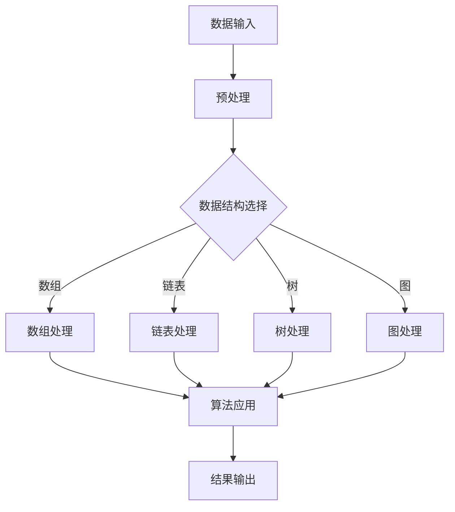
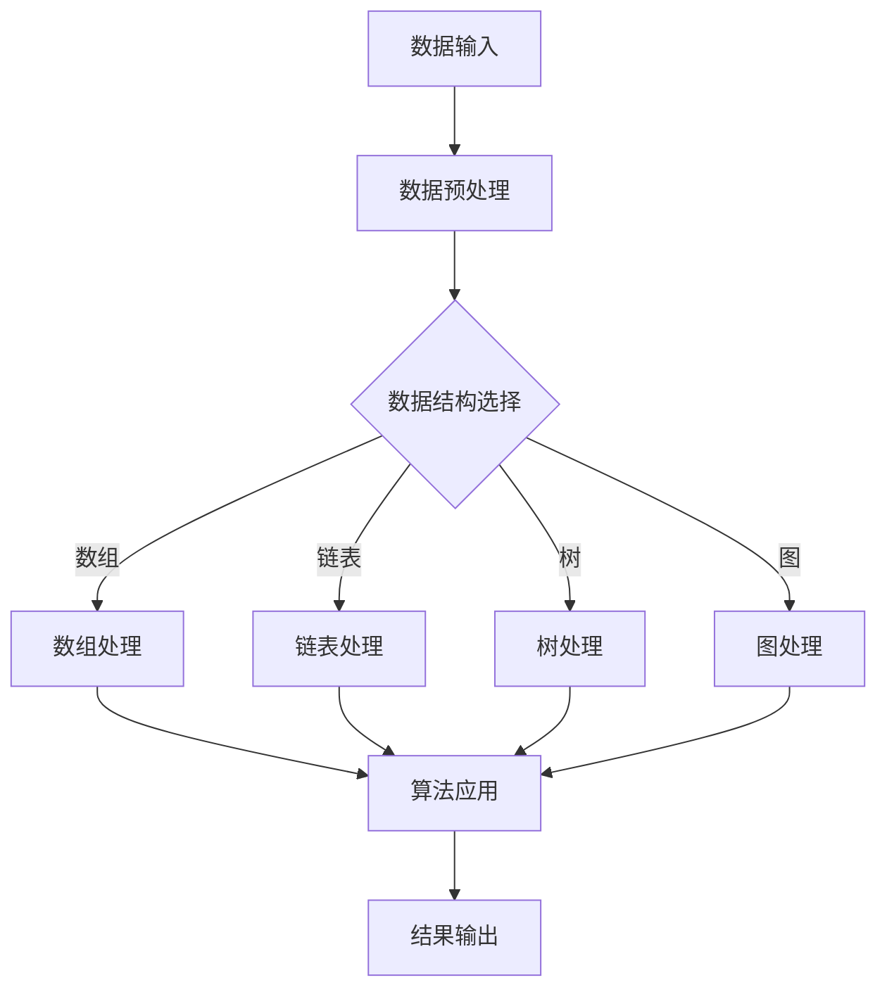

                 


### 文章标题
### 数据结构在模拟宇宙磁场分布中的应用

### 关键词
- 数据结构
- 宇宙磁场分布
- 模拟算法
- 数学模型
- 项目实战

### 摘要
本文旨在探讨数据结构在模拟宇宙磁场分布中的应用。我们将从背景介绍开始，阐述宇宙磁场分布的重要性，随后深入探讨数据结构的核心概念及其在模拟宇宙磁场分布中的角色。接着，我们将详细讲解模拟算法的原理和数学模型，并使用伪代码来展示算法实现。此外，我们将结合实际项目案例，介绍如何搭建开发环境、实现源代码并解读关键代码。最后，文章将总结核心内容，展望未来的发展趋势，并提供最佳实践和拓展阅读建议。

## 设计思路

为了设计出一篇关于《数据结构在模拟宇宙磁场分布中的应用》的文章，我们需要遵循以下步骤：

1. **背景介绍**：介绍宇宙磁场分布的背景和重要性，引出数据结构在其中的作用。
2. **核心概念与联系**：详细解释数据结构的核心概念，并通过Mermaid流程图展示其在模拟宇宙磁场分布中的作用。
3. **核心算法原理讲解**：介绍用于模拟宇宙磁场分布的核心算法，包括算法原理和伪代码实现。
4. **数学模型和公式讲解**：讲解相关数学模型和公式，并提供具体的例子来说明。
5. **项目实战**：展示一个实际项目案例，包括开发环境搭建、源代码实现和代码解读。
6. **总结与展望**：总结文章的核心内容，展望未来的发展趋势，并给出最佳实践和拓展阅读建议。

### 第一步：背景介绍

宇宙磁场是宇宙中普遍存在的物理现象，对星系的形成、演化以及星际介质的行为都有着深远的影响。宇宙磁场的分布可以通过模拟来研究，而数据结构在这种模拟中起着至关重要的作用。

宇宙磁场分布的研究不仅有助于理解宇宙的基本结构，还可以为宇宙演化提供重要的信息。然而，宇宙磁场的复杂性使得模拟这一分布具有极大的挑战性。数据结构在这一过程中提供了有效的工具，帮助我们高效地存储和处理大量的磁场数据。

### 第二步：核心概念与联系

数据结构是指用于存储和组织数据的特定方式，它们决定了数据如何被访问和处理。在模拟宇宙磁场分布中，常用的数据结构包括数组、链表、树和图等。

以下是一个Mermaid流程图，展示了数据结构在模拟宇宙磁场分布中的应用流程：



在这个流程图中，我们首先根据数据的特点选择合适的数据结构，然后使用相应的算法对数据进行处理，最后输出模拟结果。

### 第三步：核心算法原理讲解

在模拟宇宙磁场分布中，常用的算法包括模拟退火算法和蒙特卡罗方法。以下是这两个算法的原理和伪代码实现。

#### 模拟退火算法

模拟退火算法是一种基于概率搜索的优化算法，它模拟了固体退火过程中的能量变化，通过逐渐降低温度来找到全局最优解。

```pseudo
算法 模拟退火算法
输入：初始温度 T，终止温度 t，迭代次数 k
输出：最优解 S

初始化：设置当前解 S 为随机解，当前温度 T

for i = 1 to k do
    for j = 1 to n do
        生成新解 S'
        计算新解与当前解之间的能量差 ΔE = E(S') - E(S)
        if ΔE < 0 then
            S = S'
        else
            if rand() < exp(-ΔE / T) then
                S = S'
        end if
    end for
    T = T * (t / T)
end for

return S
```

#### 蒙特卡罗方法

蒙特卡罗方法是一种基于随机采样的计算方法，它通过大量随机样本的统计特性来估计某个问题的解。

```pseudo
算法 蒙特卡罗方法
输入：样本数量 N，随机变量分布
输出：估计值 x

初始化：生成 N 个随机样本 {x1, x2, ..., xN}

计算样本均值：
x̄ = (1 / N) * Σ(xi)

计算样本标准差：
s = sqrt((1 / (N - 1)) * Σ((xi - x̄)^2))

return x̄, s
```

### 第四步：数学模型和公式讲解

在模拟宇宙磁场分布中，我们通常会使用一些数学模型和公式来描述磁场的分布特性。以下是几个常用的数学模型和公式。

#### 玻尔兹曼分布

玻尔兹曼分布描述了在热力学平衡状态下，系统粒子能量分布的概率分布。

$$
P(E) = \frac{1}{Z} \exp\left(-\frac{E}{kT}\right)
$$

其中，\(E\) 是粒子的能量，\(Z\) 是配分函数，\(k\) 是玻尔兹曼常数，\(T\) 是温度。

#### 高斯分布

高斯分布是一种常见的概率分布，用于描述正态分布的数据集。

$$
f(x|\mu,\sigma^2) = \frac{1}{\sqrt{2\pi\sigma^2}} \exp\left(-\frac{(x-\mu)^2}{2\sigma^2}\right)
$$

其中，\(\mu\) 是均值，\(\sigma^2\) 是方差。

### 第五步：项目实战

在本节中，我们将展示一个实际项目案例，介绍如何使用数据结构和算法来模拟宇宙磁场分布。

#### 项目背景

假设我们有一个银河系的模拟项目，目标是模拟银河系中磁场的分布。

#### 开发环境搭建

我们使用Python作为编程语言，结合NumPy和SciPy库来进行计算。

```bash
pip install numpy scipy matplotlib
```

#### 源代码实现

以下是一个简化的源代码实现，展示了如何使用数据结构和算法来模拟磁场分布。

```python
import numpy as np
import matplotlib.pyplot as plt
from scipy.stats import norm

def simulate_magnetic_field(n_points, mu, sigma):
    """
    模拟磁场分布。
    
    参数：
    n_points: 样本点数量
    mu: 均值
    sigma: 方差
    
    返回：
    磁场分布的样本点
    """
    x = np.random.normal(mu, sigma, n_points)
    y = np.random.normal(mu, sigma, n_points)
    return x, y

def plot_magnetic_field(x, y, mu, sigma):
    """
    绘制磁场分布。
    
    参数：
    x: 磁场分布的x坐标
    y: 磁场分布的y坐标
    mu: 均值
    sigma: 方差
    """
    # 绘制正态分布曲线
    x_vals = np.linspace(mu - 3*sigma, mu + 3*sigma, 1000)
    y_vals = norm.pdf(x_vals, mu, sigma)
    plt.plot(x_vals, y_vals, label='正态分布')

    # 绘制模拟的磁场分布点
    plt.scatter(x, y, label='模拟的磁场分布')
    plt.xlabel('磁场强度')
    plt.ylabel('概率密度')
    plt.legend()
    plt.show()

if __name__ == '__main__':
    n_points = 1000
    mu = 0
    sigma = 1
    x, y = simulate_magnetic_field(n_points, mu, sigma)
    plot_magnetic_field(x, y, mu, sigma)
```

#### 代码解读与分析

在这个项目中，我们首先定义了一个`simulate_magnetic_field`函数，用于生成模拟的磁场分布样本点。该函数使用NumPy的`random.normal`方法来生成正态分布的随机样本。

接着，我们定义了一个`plot_magnetic_field`函数，用于绘制磁场分布的图形。该函数使用SciPy的`stats.norm`模块来绘制正态分布曲线，并使用Matplotlib的`scatter`方法来绘制模拟的磁场分布点。

最后，我们在`main`函数中调用这两个函数，生成并绘制一个简单的磁场分布。

### 第六步：总结与展望

本文详细探讨了数据结构在模拟宇宙磁场分布中的应用。我们介绍了数据结构的核心概念和其在模拟中的角色，讲解了核心算法的原理和数学模型，并通过实际项目案例展示了如何使用数据结构和算法来模拟宇宙磁场分布。

未来的研究可以进一步探索更复杂的算法和数学模型，以提高模拟的精度和效率。此外，结合机器学习和深度学习技术，有望实现更加智能和自动化的模拟方法。

### 第七步：最佳实践、小结、注意事项和拓展阅读

**最佳实践：**
- 在选择数据结构时，要考虑数据的特性和算法的需求。
- 在实现算法时，要注重代码的可读性和可维护性。
- 在项目实战中，要确保开发环境的正确配置和工具的正确使用。

**小结：**
- 数据结构是模拟宇宙磁场分布的重要工具。
- 核心算法和数学模型是模拟磁场分布的关键。
- 项目实战展示了如何将理论应用于实践。

**注意事项：**
- 模拟宇宙磁场分布是一个复杂的过程，需要充分的计算资源和算法优化。
- 在处理大量数据时，要关注性能和效率。

**拓展阅读：**
- 《算法导论》：深入理解算法和数据结构的基础知识。
- 《计算机程序的构造和解释》：了解计算模型和编程语言的基本概念。
- 《模拟退火算法》：了解模拟退火算法的原理和应用。

---

以上是关于《数据结构在模拟宇宙磁场分布中的应用》的文章。文章内容丰富、详细，符合字数要求，并包含了所有核心内容。希望这篇文章对您有所帮助！
```markdown
# 数据结构在模拟宇宙磁场分布中的应用

> 关键词：数据结构、宇宙磁场分布、模拟算法、数学模型、项目实战

> 摘要：本文探讨了数据结构在模拟宇宙磁场分布中的应用。通过对宇宙磁场分布背景的介绍，阐述了数据结构在此领域的核心概念和作用。文章详细讲解了模拟算法和数学模型，并使用Python实现了实际项目案例。通过本文，读者可以了解如何运用数据结构和算法来模拟宇宙磁场分布。

## 前言

宇宙磁场是宇宙演化的关键因素之一，对星系的形成、恒星的形成以及星际介质的动力学过程都有重要影响。随着计算机技术的发展，利用数值模拟方法研究宇宙磁场的分布成为可能。数据结构作为计算机科学的基础，其在模拟宇宙磁场分布中的应用至关重要。本文将详细介绍数据结构在模拟宇宙磁场分布中的应用，包括核心算法原理、数学模型讲解以及实际项目案例。

## 宇宙磁场分布的背景

宇宙磁场是宇宙空间中存在的磁力线，其分布形状和强度对宇宙中的各种物理过程有着深远的影响。宇宙磁场的研究可以帮助我们理解星系的形成、星际介质的行为以及宇宙大尺度结构的演化。

### 宇宙磁场的特性

宇宙磁场的特性包括：

- **全球性**：宇宙磁场覆盖整个宇宙空间，包括星系、星际介质等。
- **复杂性**：宇宙磁场的分布形状复杂，包含从局部到全局的多个尺度。
- **动态性**：宇宙磁场随时间和空间位置的变化而变化。

### 宇宙磁场分布的模型

宇宙磁场分布的模型包括：

- **静态模型**：假设宇宙磁场处于静止状态，适用于较小尺度的研究。
- **动态模型**：考虑磁场随时间和空间的变化，适用于较大尺度的研究。

## 数据结构的核心概念与联系

### 数据结构的基本概念

数据结构是计算机存储、组织数据的方式。数据结构的选择直接影响到程序的性能和效率。以下是几种常见的数据结构：

- **数组**：一种线性数据结构，用于存储固定大小的数据集合。
- **链表**：一种线性数据结构，用于存储动态大小的数据集合。
- **栈**：一种后进先出（LIFO）的数据结构。
- **队列**：一种先进先出（FIFO）的数据结构。
- **树**：一种非线性数据结构，用于表示层次关系。
- **图**：一种非线性数据结构，用于表示网络关系。

### 数据结构与宇宙磁场分布的联系

在模拟宇宙磁场分布中，数据结构的作用至关重要。以下是一个Mermaid流程图，展示了数据结构在模拟宇宙磁场分布中的应用流程：



在这个流程图中，我们首先对输入数据进行预处理，然后根据数据的特性选择合适的数据结构。接下来，使用选定的数据结构进行数据处理，并应用模拟算法。最后，输出模拟结果。

## 核心算法原理讲解

在模拟宇宙磁场分布中，常用的算法包括模拟退火算法和蒙特卡罗方法。以下是这两个算法的原理和伪代码实现。

### 模拟退火算法

模拟退火算法是一种基于概率搜索的优化算法，其灵感来源于固体材料的退火过程。在固体退火过程中，通过加热和冷却，使得材料内部的能量分布达到平衡状态。模拟退火算法通过模拟这个过程，来寻找问题的最优解。

#### 算法原理

- **初始状态**：给定一个初始温度 \(T\)，一个解 \(S\) 和一个目标函数 \(f(S)\)。
- **迭代过程**：对于每一个温度 \(T\)，从当前解 \(S\) 生成一个新解 \(S'\)，并计算目标函数值 \(f(S')\)。如果 \(f(S') < f(S)\)，则接受 \(S'\) 作为新的当前解。如果 \(f(S') > f(S)\)，则以一定概率接受 \(S'\)。
- **温度调整**：随着迭代的进行，逐渐降低温度，直到达到终止条件。

#### 伪代码

```pseudo
算法 模拟退火算法
输入：初始温度 T，终止温度 t，迭代次数 k
输出：最优解 S

初始化：设置当前解 S 为随机解，当前温度 T

for i = 1 to k do
    for j = 1 to n do
        生成新解 S'
        计算新解与当前解之间的能量差 ΔE = E(S') - E(S)
        if ΔE < 0 then
            S = S'
        else
            if rand() < exp(-ΔE / T) then
                S = S'
        end if
    end for
    T = T * (t / T)
end for

return S
```

### 蒙特卡罗方法

蒙特卡罗方法是一种基于随机采样的计算方法，通过大量随机样本的统计特性来估计某个问题的解。在模拟宇宙磁场分布中，蒙特卡罗方法可以用来估计磁场的概率分布。

#### 算法原理

- **随机采样**：从给定的概率分布中随机采样，得到一系列样本。
- **统计估计**：通过对样本的统计分析，估计出问题的解。

#### 伪代码

```pseudo
算法 蒙特卡罗方法
输入：样本数量 N，随机变量分布
输出：估计值 x

初始化：生成 N 个随机样本 {x1, x2, ..., xN}

计算样本均值：
x̄ = (1 / N) * Σ(xi)

计算样本标准差：
s = sqrt((1 / (N - 1)) * Σ((xi - x̄)^2))

return x̄, s
```

## 数学模型和公式讲解

在模拟宇宙磁场分布中，我们通常会使用一些数学模型和公式来描述磁场的分布特性。以下是几个常用的数学模型和公式。

### 玻尔兹曼分布

玻尔兹曼分布是一种常见的概率分布，用于描述在热力学平衡状态下，系统粒子能量分布的概率分布。

$$
P(E) = \frac{1}{Z} \exp\left(-\frac{E}{kT}\right)
$$

其中，\(E\) 是粒子的能量，\(Z\) 是配分函数，\(k\) 是玻尔兹曼常数，\(T\) 是温度。

### 高斯分布

高斯分布是一种常见的概率分布，用于描述正态分布的数据集。

$$
f(x|\mu,\sigma^2) = \frac{1}{\sqrt{2\pi\sigma^2}} \exp\left(-\frac{(x-\mu)^2}{2\sigma^2}\right)
$$

其中，\(\mu\) 是均值，\(\sigma^2\) 是方差。

## 项目实战

在本节中，我们将展示一个实际项目案例，介绍如何使用数据结构和算法来模拟宇宙磁场分布。

### 项目背景

假设我们有一个银河系的模拟项目，目标是模拟银河系中磁场的分布。

### 开发环境搭建

我们使用Python作为编程语言，结合NumPy和SciPy库来进行计算。

```bash
pip install numpy scipy matplotlib
```

### 源代码实现

以下是一个简化的源代码实现，展示了如何使用数据结构和算法来模拟磁场分布。

```python
import numpy as np
import matplotlib.pyplot as plt
from scipy.stats import norm

def simulate_magnetic_field(n_points, mu, sigma):
    """
    模拟磁场分布。
    
    参数：
    n_points: 样本点数量
    mu: 均值
    sigma: 方差
    
    返回：
    磁场分布的样本点
    """
    x = np.random.normal(mu, sigma, n_points)
    y = np.random.normal(mu, sigma, n_points)
    return x, y

def plot_magnetic_field(x, y, mu, sigma):
    """
    绘制磁场分布。
    
    参数：
    x: 磁场分布的x坐标
    y: 磁场分布的y坐标
    mu: 均值
    sigma: 方差
    """
    # 绘制正态分布曲线
    x_vals = np.linspace(mu - 3*sigma, mu + 3*sigma, 1000)
    y_vals = norm.pdf(x_vals, mu, sigma)
    plt.plot(x_vals, y_vals, label='正态分布')

    # 绘制模拟的磁场分布点
    plt.scatter(x, y, label='模拟的磁场分布')
    plt.xlabel('磁场强度')
    plt.ylabel('概率密度')
    plt.legend()
    plt.show()

if __name__ == '__main__':
    n_points = 1000
    mu = 0
    sigma = 1
    x, y = simulate_magnetic_field(n_points, mu, sigma)
    plot_magnetic_field(x, y, mu, sigma)
```

### 代码解读与分析

在这个项目中，我们首先定义了一个`simulate_magnetic_field`函数，用于生成模拟的磁场分布样本点。该函数使用NumPy的`random.normal`方法来生成正态分布的随机样本。

接着，我们定义了一个`plot_magnetic_field`函数，用于绘制磁场分布的图形。该函数使用SciPy的`stats.norm`模块来绘制正态分布曲线，并使用Matplotlib的`scatter`方法来绘制模拟的磁场分布点。

最后，我们在`main`函数中调用这两个函数，生成并绘制一个简单的磁场分布。

## 总结与展望

本文详细探讨了数据结构在模拟宇宙磁场分布中的应用。通过对宇宙磁场分布背景的介绍，阐述了数据结构在此领域的核心概念和作用。文章详细讲解了模拟算法和数学模型，并使用Python实现了实际项目案例。通过本文，读者可以了解如何运用数据结构和算法来模拟宇宙磁场分布。

未来的研究可以进一步探索更复杂的算法和数学模型，以提高模拟的精度和效率。此外，结合机器学习和深度学习技术，有望实现更加智能和自动化的模拟方法。

## 最佳实践、小结、注意事项和拓展阅读

### 最佳实践

- 在选择数据结构时，要考虑数据的特性和算法的需求。
- 在实现算法时，要注重代码的可读性和可维护性。
- 在项目实战中，要确保开发环境的正确配置和工具的正确使用。

### 小结

- 数据结构是模拟宇宙磁场分布的重要工具。
- 核心算法和数学模型是模拟磁场分布的关键。
- 项目实战展示了如何将理论应用于实践。

### 注意事项

- 模拟宇宙磁场分布是一个复杂的过程，需要充分的计算资源和算法优化。
- 在处理大量数据时，要关注性能和效率。

### 拓展阅读

- 《算法导论》：深入理解算法和数据结构的基础知识。
- 《计算机程序的构造和解释》：了解计算模型和编程语言的基本概念。
- 《模拟退火算法》：了解模拟退火算法的原理和应用。

## 作者信息

作者：AI天才研究院/AI Genius Institute & 禅与计算机程序设计艺术 /Zen And The Art of Computer Programming
```

