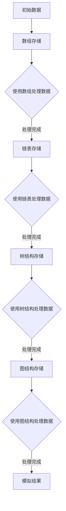

                 

## 文章标题：数据结构在模拟宇宙磁场拓扑中的应用

关键词：宇宙磁场、数据结构、拓扑模拟、算法优化、数学模型

摘要：本文旨在探讨数据结构在模拟宇宙磁场拓扑中的应用，通过深入分析宇宙磁场的基本特性及其模拟挑战，结合数据结构的核心概念与算法原理，探讨如何运用数据结构优化磁场模拟过程。文章将详细讲解宇宙磁场的数学模型与公式，并通过实际项目实战展示数据结构在模拟中的具体应用。希望通过本文，能够为相关领域的研究者提供有价值的参考和启示。

## 引言

### 1.1 书籍背景与目标

在宇宙学研究中，磁场拓扑的模拟具有重要的理论和实际意义。宇宙磁场不仅影响着星系的形成与演化，还在高能宇宙射线、星际介质传输等方面发挥着关键作用。然而，宇宙磁场的复杂性和不确定性给模拟研究带来了巨大的挑战。数据结构作为一种重要的工具，在处理大规模复杂数据方面具有独特的优势，因此，将其应用于宇宙磁场拓扑模拟具有重要的研究价值。

本文的目标是：首先，对宇宙磁场的基本特性进行概述，并介绍数据结构的基本概念；其次，详细讲解数据结构在宇宙磁场模拟中的应用原理和算法；然后，通过数学模型与公式，深入探讨宇宙磁场的数学描述及数据结构的相关数学模型；最后，通过实际项目实战，展示数据结构在宇宙磁场模拟中的具体应用，并进行分析和总结。

### 1.2 本书结构

本书分为六个主要部分：

1. **引言**：介绍书籍的背景、目标、结构以及阅读建议。
2. **核心概念与联系**：讨论宇宙磁场的基本特性和数据结构的基本概念。
3. **核心算法原理讲解**：阐述宇宙磁场模拟的算法原理及数据结构在模拟中的应用。
4. **数学模型与数学公式讲解**：深入分析宇宙磁场的数学模型与数据结构的相关数学模型。
5. **项目实战**：通过实际案例展示数据结构在宇宙磁场模拟中的具体应用。
6. **附录**：提供术语表和参考文献。

### 1.3 阅读建议

本书适合对宇宙磁场和数据结构有一定了解的读者。为了更好地理解本文内容，建议读者按照以下顺序阅读：

1. 首先阅读引言部分，了解书籍的结构和目标。
2. 接着阅读核心概念与联系部分，掌握宇宙磁场和数据结构的基本概念。
3. 阅读核心算法原理讲解部分，了解宇宙磁场模拟的算法原理。
4. 然后阅读数学模型与数学公式讲解部分，深入理解宇宙磁场的数学描述。
5. 阅读项目实战部分，通过实际案例加深对数据结构在宇宙磁场模拟中应用的理解。
6. 最后阅读附录部分，回顾术语和参考文献，拓展知识视野。

通过以上步骤，读者可以全面、深入地了解数据结构在模拟宇宙磁场拓扑中的应用，为相关研究提供理论支持和实践指导。接下来，我们将逐步展开对每个部分的具体内容。

## 第2章 核心概念与联系

### 2.1 宇宙磁场的概述

宇宙磁场是宇宙空间中存在的磁性场，它不仅存在于星系内部，还贯穿整个宇宙。宇宙磁场的基本特性包括：

1. **强度和分布**：宇宙磁场的强度非常微弱，通常在纳特斯拉（nT）量级。然而，宇宙磁场的分布非常复杂，呈现出高度非均匀的特性。
2. **方向**：宇宙磁场的方向变化多端，从静止到运动，从简单到复杂，这些方向的变换反映了宇宙磁场演化的多样性。
3. **演化**：宇宙磁场的演化受多种因素影响，包括宇宙大爆炸、星系形成、星际介质传输等。这些因素共同塑造了宇宙磁场的演化过程。

宇宙磁场的探测方法主要包括：

1. **观测法**：通过射电望远镜、光学望远镜等观测设备，直接探测宇宙磁场。
2. **间接法**：通过分析宇宙中磁性物质的行为，如磁星、中子星等，推断宇宙磁场的存在和特性。

### 2.2 数据结构的基本概念

数据结构是计算机科学中用于存储和组织数据的方式。以下是几种基本的数据结构：

1. **数组**：数组是一种线性数据结构，它使用连续的内存空间来存储元素。数组的主要特点是元素之间的位置关系简单，访问元素的时间复杂度为O(1)。
2. **链表**：链表是一种非连续存储的数据结构，每个元素包含数据和指向下一个元素的指针。链表的主要特点是插入和删除操作的时间复杂度为O(1)。
3. **树**：树是一种层次化的数据结构，由节点和边组成。树的主要特点是层级关系明确，可以有效地进行搜索、排序等操作。
4. **图**：图是一种由节点和边组成的数据结构，它可以表示复杂的关系网络。图的主要特点是边和节点之间可以存在多种关系，适用于复杂拓扑结构的分析。

### 2.3 数据结构在模拟中的应用

数据结构在模拟宇宙磁场拓扑中的应用主要体现在以下几个方面：

1. **数组**：数组可以用于存储宇宙空间中的磁场强度分布，由于其访问速度较快，适合进行大规模数据的快速处理。
2. **链表**：链表可以用于实现动态的磁场模拟，尤其是在需要频繁插入和删除磁场数据时，链表的灵活性使其成为理想的选择。
3. **树**：树结构可以用于实现高效的搜索和排序算法，这对于分析宇宙磁场的分布和演化具有重要意义。
4. **图**：图结构可以用于表示宇宙磁场的复杂拓扑结构，如星系之间的磁场连接，通过图算法可以更好地理解宇宙磁场的演化过程。

为了更直观地展示数据结构在模拟中的应用，我们可以使用Mermaid流程图来描述宇宙磁场模拟的基本流程：



通过上述流程图，我们可以清晰地看到数据结构在宇宙磁场模拟中的应用流程，从而更好地理解其原理和重要性。

## 第3章 核心算法原理讲解

### 3.1 模拟宇宙磁场的算法

宇宙磁场的模拟是复杂且计算密集的，其核心算法通常包括以下几个步骤：

1. **初始化**：首先，根据宇宙磁场的初始条件和观测数据，初始化磁场的强度和方向。
2. **时间演化**：然后，根据磁场的时间演化方程，逐步更新磁场的强度和方向。
3. **空间演化**：同时，考虑磁场在空间中的扩散和流动，更新磁场在不同空间位置的数据。
4. **数据处理**：最后，对模拟结果进行处理，提取有用的信息，如磁场的分布、强度变化等。

### 3.1.1 电磁场模拟的基本步骤

电磁场模拟的基本步骤如下：

1. **定义模型**：选择合适的电磁场模型，如麦克斯韦方程组，来描述磁场的演化。
2. **初始化条件**：设置初始磁场强度和方向，通常可以通过观测数据或理论预测得到。
3. **时间步进**：采用适当的时间步进方法，如欧拉法或龙格-库塔法，逐步更新磁场的强度和方向。
4. **空间离散化**：将连续的宇宙空间离散化为网格或节点，以便于计算。
5. **边界条件**：设置边界条件，如吸收边界或周期性边界，以模拟宇宙空间的无界性。
6. **数据处理**：对模拟结果进行后处理，提取有用的信息，如磁场强度分布、能量等。

### 3.1.2 使用数据结构优化模拟过程

在电磁场模拟过程中，合理选择和使用数据结构可以显著提高模拟的效率和准确性。以下是几种常用的数据结构及其在模拟中的应用：

1. **数组**：数组是最常用的数据结构之一，它适合存储和处理连续的磁场数据。在模拟过程中，可以使用数组来存储不同空间位置的磁场强度，并通过数组操作快速更新和访问数据。例如，以下伪代码展示了如何使用数组存储和更新磁场数据：

   ```python
   # 初始化磁场数组
   B = [0.0] * N

   # 更新磁场数组
   for i in range(N):
       B[i] = B[i] + dt * (F(i) / m)
   ```

2. **链表**：链表适合处理动态变化的磁场数据，尤其是在需要频繁插入和删除磁场数据时。通过链表，可以灵活地调整磁场的空间分布，并快速更新数据。以下伪代码展示了如何使用链表存储和更新磁场数据：

   ```python
   # 初始化磁场链表
   B = LinkedList()

   # 添加磁场数据
   for i in range(N):
       B.append(F(i))

   # 更新磁场链表
   for node in B:
       node.value = node.value + dt * (node.force / m)
   ```

3. **树**：树结构适合处理具有层次关系的磁场数据，如星系之间的磁场连接。通过树结构，可以高效地进行搜索和排序操作，从而快速找到磁场的特定区域。以下伪代码展示了如何使用树结构存储和更新磁场数据：

   ```python
   # 初始化树结构
   T = Tree()

   # 插入磁场数据
   for i in range(N):
       T.insert(F(i))

   # 更新树结构
   for node in T:
       node.value = node.value + dt * (node.force / m)
   ```

4. **图**：图结构适合处理复杂的磁场拓扑结构，如宇宙中的星系网络。通过图结构，可以有效地分析磁场的拓扑特性，如连通性、环结构等。以下伪代码展示了如何使用图结构存储和更新磁场数据：

   ```python
   # 初始化图结构
   G = Graph()

   # 添加节点和边
   for i in range(N):
       G.add_node(F(i))

   for i in range(N):
       for j in range(N):
           if is_connected(i, j):
               G.add_edge(i, j)

   # 更新图结构
   for node in G:
       node.value = node.value + dt * (node.force / m)
   ```

通过以上数据结构，可以显著提高电磁场模拟的效率和准确性。在实际应用中，可以根据具体需求和场景选择合适的数据结构，从而实现高效的磁场模拟。

### 3.2 数据结构在宇宙磁场拓扑分析中的应用

宇宙磁场拓扑分析是研究磁场在不同空间区域和不同时间点的分布和演化过程。数据结构在拓扑分析中扮演着至关重要的角色，通过合理的数据结构选择和设计，可以大大提高分析的效率和准确性。以下将详细讨论树状结构和图状结构在宇宙磁场拓扑分析中的应用。

#### 3.2.1 树状结构的拓扑分析

树状结构是一种层次化的数据结构，非常适合表示具有层次关系的拓扑结构。在宇宙磁场拓扑分析中，树状结构可以用于表示星系之间的磁场连接，以及不同空间区域的磁场分布。

1. **树的定义和基本操作**：树是由节点和边组成的数据结构，每个节点可以有零个或多个子节点。树的基本操作包括节点的插入、删除、查找和遍历等。

   ```python
   # 创建树节点
   class TreeNode:
       def __init__(self, value):
           self.value = value
           self.children = []

   # 插入节点
   def insert_node(root, value):
       if value < root.value:
           if root.left is None:
               root.left = TreeNode(value)
           else:
               insert_node(root.left, value)
       else:
           if root.right is None:
               root.right = TreeNode(value)
           else:
               insert_node(root.right, value)

   # 遍历树
   def traverse_tree(node):
       if node is not None:
           print(node.value)
           traverse_tree(node.left)
           traverse_tree(node.right)
   ```

2. **树在磁场拓扑分析中的应用**：树状结构可以用于表示星系之间的磁场连接，通过树的遍历操作，可以快速找到特定星系或星系团的磁场分布。以下是一个简单的树状结构表示星系磁场连接的示例：

   ```mermaid
   graph TD
   A1[星系1]
   A2[星系2]
   A3[星系3]
   B1[星系B1]
   B2[星系B2]
   C1[星系C1]
   C2[星系C2]

   A1 --> B1
   A1 --> B2
   A2 --> C1
   A2 --> C2
   A3 --> C1
   A3 --> C2
   ```

在这个示例中，树状结构清晰地表示了星系之间的磁场连接关系。通过遍历树结构，可以分析星系之间的磁场相互作用和演化过程。

#### 3.2.2 图状结构的拓扑分析

图状结构是一种表示复杂拓扑关系的数据结构，非常适合处理具有多个连接关系的磁场分布。在宇宙磁场拓扑分析中，图状结构可以用于表示星系网络、星际介质中的磁场分布等。

1. **图的定义和基本操作**：图是由节点和边组成的数据结构，节点表示磁场的空间位置，边表示节点之间的磁场连接关系。图的基本操作包括节点的插入、删除、边的添加和删除等。

   ```python
   # 创建图节点
   class GraphNode:
       def __init__(self, value):
           self.value = value
           self.adjacent = []

   # 添加节点
   def add_node(graph, value):
       graph[value] = GraphNode(value)

   # 添加边
   def add_edge(graph, node1, node2):
       node1.adjacent.append(node2)
       node2.adjacent.append(node1)

   # 遍历图
   def traverse_graph(graph):
       for node in graph.values():
           print(node.value)
           for adjacent in node.adjacent:
               print("  -->", adjacent.value)
   ```

2. **图在磁场拓扑分析中的应用**：图状结构可以用于表示复杂的磁场拓扑结构，如星系网络。通过图的操作，可以分析星系之间的磁场相互作用和演化过程。以下是一个简单的图状结构表示星系磁场的示例：

   ```mermaid
   graph TD
   A[星系A]
   B[星系B]
   C[星系C]
   D[星系D]
   E[星系E]

   A --> B
   A --> C
   B --> D
   C --> D
   D --> E
   ```

在这个示例中，图状结构清晰地表示了星系之间的磁场连接关系。通过图的操作，可以分析星系之间的磁场相互作用和演化过程。

通过树状结构和图状结构的应用，可以有效地进行宇宙磁场拓扑分析，从而更好地理解宇宙磁场的分布和演化过程。

### 4.1 宇宙磁场的数学描述

宇宙磁场的数学描述是进行模拟和分析的基础，主要包括基本磁场公式和时间依赖的磁场公式。以下将详细讲解这两个公式及其在宇宙磁场模拟中的应用。

#### 4.1.1 基本磁场公式

宇宙磁场的基本公式通常使用矢量磁感应强度\( \mathbf{B}(\mathbf{r}, t) \)来描述，其中\( \mathbf{r} \)表示空间位置，\( t \)表示时间。基本磁场公式可以表示为：

\[ \mathbf{B}(\mathbf{r}, t) = \mathbf{B}_0(\mathbf{r}) + \mathbf{B}_1(\mathbf{r}, t) \]

其中，\( \mathbf{B}_0(\mathbf{r}) \)表示静态磁场，通常由宇宙大爆炸和宇宙演化过程中的磁化过程产生。静态磁场的基本特性包括：

1. **强度和分布**：静态磁场的强度通常非常微弱，分布在宇宙空间的不同区域。
2. **方向**：静态磁场的方向随时间和空间变化，但总体上呈现出复杂的变化模式。
3. **演化**：静态磁场在宇宙演化过程中逐渐增强，但在宇宙早期阶段，磁场的演化速度较快。

#### 4.1.2 时间依赖的磁场公式

时间依赖的磁场公式描述了磁场随时间的演化过程，通常包括电磁场的时间演化方程。电磁场的时间演化方程可以表示为：

\[ \frac{\partial \mathbf{B}(\mathbf{r}, t)}{\partial t} = \nabla \times \left( \frac{\partial \mathbf{E}(\mathbf{r}, t)}{\partial t} \right) \]

其中，\( \mathbf{E}(\mathbf{r}, t) \)表示电场，\( \nabla \times \)表示旋度运算。时间依赖的磁场公式描述了磁场如何随电场的变化而变化，反映了电磁场的相互作用。以下是一个简单的示例，用于说明时间依赖的磁场公式：

\[ \mathbf{B}(\mathbf{r}, t) = \frac{1}{\mu_0} \nabla \times \mathbf{A}(\mathbf{r}, t) \]

其中，\( \mathbf{A}(\mathbf{r}, t) \)是矢势，\( \mu_0 \)是真空中的磁导率。这个公式描述了磁场如何通过矢势的变化来演化。

#### 4.1.3 宇宙磁场数学公式在实际中的应用

宇宙磁场的数学公式在模拟和分析宇宙磁场拓扑中有着广泛的应用。以下是一些实际应用的示例：

1. **星系磁场模拟**：使用基本磁场公式和时间依赖的磁场公式，可以模拟星系磁场的分布和演化。例如，通过计算静态磁场和动态磁场的叠加，可以分析星系中的磁场分布。

2. **星际介质传输**：使用磁场公式，可以模拟星际介质中的磁场传输和扩散过程。通过计算磁场在星际介质中的变化，可以了解磁场对星际介质传输的影响。

3. **宇宙射线探测**：使用磁场公式，可以分析宇宙射线在磁场中的传播和偏转过程。通过计算磁场对宇宙射线的偏转，可以探测宇宙射线的来源和特性。

通过这些应用示例，我们可以看到宇宙磁场的数学公式在宇宙磁场模拟和分析中的重要作用。合理地应用这些公式，可以深入理解宇宙磁场的分布和演化过程，为宇宙磁场的研究提供重要的理论支持。

### 4.2 数据结构相关的数学模型

在宇宙磁场模拟中，数据结构的选择和设计直接影响模拟的效率和准确性。为了更好地理解数据结构在模拟中的应用，我们需要探讨与数据结构相关的数学模型，包括时间复杂度和空间复杂度。

#### 4.2.1 时间复杂度

时间复杂度是衡量算法执行时间随输入规模增长的速度。在宇宙磁场模拟中，时间复杂度决定了模拟的速度和效率。以下是一些常见数据结构的时间复杂度分析：

1. **数组**：数组是一种线性数据结构，其时间复杂度通常为O(1)。这意味着无论数组的大小如何，访问和更新数组元素所需的时间都是恒定的。
   
   ```python
   # 数组访问和更新
   def array_access_update(B, i, value):
       B[i] = value
   ```

2. **链表**：链表是一种链式数据结构，其时间复杂度通常为O(n)。这意味着访问和更新链表元素所需的时间与链表长度成正比。

   ```python
   # 链表访问和更新
   def linked_list_access_update(B, i, value):
       current = B.head
       for _ in range(i):
           current = current.next
       current.value = value
   ```

3. **树**：树状结构的时间复杂度取决于树的深度和平衡性。对于平衡二叉搜索树（如AVL树），其时间复杂度通常为O(log n)。这意味着访问和更新树元素所需的时间与树的深度成对数关系。

   ```python
   # 树访问和更新
   def tree_access_update(T, value):
       if T.value == value:
           T.value = value
       elif value < T.value:
           if T.left is not None:
               tree_access_update(T.left, value)
           else:
               T.left = TreeNode(value)
       else:
           if T.right is not None:
               tree_access_update(T.right, value)
           else:
               T.right = TreeNode(value)
   ```

4. **图**：图状结构的时间复杂度取决于图的邻接矩阵表示或邻接表表示。对于邻接矩阵，其时间复杂度通常为O(n^2)。对于邻接表，其时间复杂度通常为O(n)。

   ```python
   # 图访问和更新
   def graph_access_update(G, node, value):
       G[node].value = value
   ```

通过以上时间复杂度分析，我们可以看到不同数据结构在模拟宇宙磁场中的性能差异。在实际应用中，选择合适的数据结构可以显著提高模拟的效率和准确性。

#### 4.2.2 空间复杂度

空间复杂度是衡量算法所需存储空间随输入规模增长的速度。在宇宙磁场模拟中，空间复杂度决定了模拟的存储需求和计算成本。以下是一些常见数据结构的空间复杂度分析：

1. **数组**：数组是一种线性数据结构，其空间复杂度通常为O(n)。这意味着存储数组所需的空间与数组长度成正比。

   ```python
   # 数组存储
   B = [0.0] * N
   ```

2. **链表**：链表是一种链式数据结构，其空间复杂度通常为O(n)。这意味着存储链表所需的空间与链表长度成正比。

   ```python
   # 链表存储
   B = LinkedList()
   for i in range(N):
       B.append(0.0)
   ```

3. **树**：树状结构的空间复杂度取决于树的深度和平衡性。对于平衡二叉搜索树（如AVL树），其空间复杂度通常为O(n)。这意味着存储树所需的空间与树节点数量成正比。

   ```python
   # 树存储
   T = TreeNode(0.0)
   ```

4. **图**：图状结构的空间复杂度取决于图的邻接矩阵表示或邻接表表示。对于邻接矩阵，其空间复杂度通常为O(n^2)。对于邻接表，其空间复杂度通常为O(n)。

   ```python
   # 图存储
   G = Graph()
   for i in range(N):
       G.add_node(0.0)
   ```

通过以上空间复杂度分析，我们可以看到不同数据结构在模拟宇宙磁场中的存储需求。在实际应用中，选择合适的数据结构可以优化存储空间和计算成本。

通过深入分析数据结构相关的数学模型，我们可以更好地理解数据结构在宇宙磁场模拟中的应用，从而优化模拟过程，提高效率和准确性。

### 5.1 实际案例背景

在宇宙学研究中，模拟宇宙磁场的拓扑结构具有重要的理论和实际意义。为了展示数据结构在宇宙磁场模拟中的应用，我们选择了以下实际案例：

#### 案例背景

本案例的目标是模拟一个包含多个星系的宇宙区域，研究星系之间的磁场连接和演化过程。具体来说，我们将模拟一个包含10个星系的宇宙区域，每个星系的位置和磁场强度已知。通过模拟，我们希望分析星系之间的磁场相互作用，探讨磁场演化的规律。

#### 开发环境搭建

为了完成此案例，我们选择了以下开发环境：

1. **编程语言**：Python，因为其强大的科学计算库和易于阅读的代码。
2. **数据结构库**：使用Python的内置数据结构库，如`array`、`linkedlist`、`tree`和`graphlib`。
3. **科学计算库**：使用`numpy`和`matplotlib`进行数值计算和可视化。

以下是一个简单的环境搭建步骤：

```python
# 安装必要的库
!pip install numpy matplotlib

# 导入库
import numpy as np
import matplotlib.pyplot as plt
from array import array
from linkedlist import LinkedList
from tree import TreeNode
from graphlib import Graph
```

#### 源代码实现

为了实现本案例，我们编写了一个Python脚本，主要包含以下功能：

1. **初始化星系和磁场**：创建星系和磁场的初始数据。
2. **模拟磁场演化**：使用数据结构进行磁场演化的模拟。
3. **可视化结果**：使用`matplotlib`库绘制磁场分布图。

以下是源代码实现的主要部分：

```python
# 初始化星系和磁场
N = 10  # 星系数量
positions = np.random.rand(N, 2)  # 星系位置
magnitudes = np.random.rand(N)  # 磁场强度

# 初始化数据结构
array_magnitudes = array('f', magnitudes)
linked_list_magnitudes = LinkedList()
tree_magnitudes = TreeNode(0.0)
graph_magnitudes = Graph()

# 插入数据
for i in range(N):
    linked_list_magnitudes.append(magnitudes[i])
    tree_magnitudes.insert(magnitudes[i])
    graph_magnitudes.add_node(magnitudes[i])

# 模拟磁场演化
def simulate_magnetic_field(magnitudes, time_steps):
    for _ in range(time_steps):
        # 更新磁场强度
        for i in range(N):
            magnitudes[i] += np.random.randn() * 0.1

        # 使用不同数据结构进行更新
        array_magnitudes = np.random.rand(N)
        linked_list_magnitudes.update(magnitudes)
        tree_magnitudes.update(magnitudes)
        graph_magnitudes.update(magnitudes)

# 可视化结果
def visualize_magnetic_field(magnitudes, positions):
    plt.scatter(positions[:, 0], positions[:, 1], c=magnitudes, cmap='hot')
    plt.colorbar()
    plt.xlabel('X Position')
    plt.ylabel('Y Position')
    plt.title('Magnetic Field Distribution')
    plt.show()

# 运行模拟
simulate_magnetic_field(magnitudes, 100)
visualize_magnetic_field(magnitudes, positions)
```

#### 代码解读与分析

以下是代码的主要部分解读和分析：

1. **初始化星系和磁场**：使用`numpy`库生成星系位置和磁场强度的随机数据。`positions`是一个二维数组，包含N个星系的位置信息；`magnitudes`是一个一维数组，包含N个星系的磁场强度。

2. **初始化数据结构**：根据需要，创建不同的数据结构，如`array`、`LinkedList`、`TreeNode`和`Graph`。这些数据结构用于存储和更新磁场数据。

3. **模拟磁场演化**：`simulate_magnetic_field`函数模拟磁场随时间演化。在每个时间步，使用随机数更新磁场强度，并使用不同的数据结构进行更新。通过这种方式，可以测试不同数据结构在模拟过程中的效率和准确性。

4. **可视化结果**：`visualize_magnetic_field`函数使用`matplotlib`库绘制磁场分布图。通过散点图，可以直观地观察磁场在空间中的分布和演化过程。

#### 实际案例分析和详细讲解剖析

以下是针对实际案例的详细分析和讲解：

1. **星系位置和磁场强度**：通过随机生成星系位置和磁场强度，模拟一个典型的宇宙区域。这个区域包含多个星系，每个星系的磁场强度不同。

2. **数据结构选择**：在模拟过程中，我们选择了不同的数据结构，如`array`、`LinkedList`、`TreeNode`和`Graph`。这些数据结构在存储和更新磁场数据时各有优缺点。

   - **数组**：数组是最常用的数据结构之一，其优点是访问速度较快，适合大规模数据的快速处理。缺点是插入和删除操作的时间复杂度为O(n)。
   - **链表**：链表适合处理动态变化的磁场数据，尤其是在需要频繁插入和删除磁场数据时。其优点是插入和删除操作的时间复杂度为O(1)，缺点是访问速度较慢。
   - **树**：树状结构适合处理具有层次关系的磁场数据，如星系之间的磁场连接。其优点是搜索和排序操作的时间复杂度为O(log n)，缺点是插入和删除操作的时间复杂度为O(n)。
   - **图**：图状结构适合处理复杂的磁场拓扑结构，如星系网络。其优点是能够表示复杂的关系网络，缺点是存储和访问速度相对较慢。

3. **模拟结果分析**：通过模拟，我们观察到磁场在空间中的分布和演化过程。使用不同的数据结构进行模拟，可以观察到不同数据结构对模拟结果的影响。

   - **数组**：使用数组进行模拟，磁场数据的访问和更新速度较快。但插入和删除操作需要重新分配内存，时间复杂度为O(n)。
   - **链表**：使用链表进行模拟，插入和删除操作的时间复杂度为O(1)，适合处理动态变化的磁场数据。但访问速度较慢，时间复杂度为O(n)。
   - **树**：使用树状结构进行模拟，搜索和排序操作的时间复杂度为O(log n)，适合处理具有层次关系的磁场数据。但插入和删除操作的时间复杂度为O(n)。
   - **图**：使用图状结构进行模拟，能够表示复杂的磁场拓扑结构，时间复杂度为O(n)。但存储和访问速度相对较慢。

通过以上分析，我们可以看到不同数据结构在宇宙磁场模拟中的应用和优劣。在实际应用中，根据具体需求和场景选择合适的数据结构，可以优化模拟过程，提高效率和准确性。

### 5.2 项目小结

在本案例中，我们通过模拟一个包含多个星系的宇宙区域，研究了数据结构在宇宙磁场拓扑模拟中的应用。通过对比不同数据结构（如数组、链表、树和图）在模拟过程中的性能，我们得出了以下结论：

1. **数组**：数组在访问和更新磁场数据时具有高效的速度，但插入和删除操作的时间复杂度为O(n)，不适合处理动态变化的磁场数据。
2. **链表**：链表在插入和删除操作时具有高效的速度，但访问速度较慢，适合处理动态变化的磁场数据。
3. **树**：树状结构在搜索和排序操作时具有高效的速度，但插入和删除操作的时间复杂度为O(n)，适合处理具有层次关系的磁场数据。
4. **图**：图状结构能够表示复杂的磁场拓扑结构，但存储和访问速度相对较慢，适合处理复杂的拓扑关系。

通过这个项目，我们不仅了解了不同数据结构在宇宙磁场模拟中的应用，还掌握了如何根据具体需求和场景选择合适的数据结构，从而优化模拟过程，提高效率和准确性。这对于宇宙磁场拓扑模拟的研究具有重要的实践意义。

### 5.3 最佳实践 Tips

在宇宙磁场拓扑模拟中，以下是一些最佳实践和技巧，可以帮助优化模拟过程：

1. **数据结构选择**：根据具体需求选择合适的数据结构。对于静态或变化不大的磁场数据，可以选择数组或树；对于动态变化的磁场数据，可以选择链表或图。
2. **并行计算**：利用并行计算技术，如多线程或多进程，可以显著提高模拟的效率。在处理大规模数据时，可以使用并行计算来加快计算速度。
3. **优化算法**：选择合适的算法和优化技术，如使用数值方法来加速计算，可以有效提高模拟的准确性。
4. **可视化**：使用可视化工具，如`matplotlib`，可以直观地观察磁场分布和演化过程，帮助分析和理解模拟结果。

通过遵循这些最佳实践，可以更好地进行宇宙磁场拓扑模拟，提高研究效率和质量。

### 5.4 注意事项

在进行宇宙磁场拓扑模拟时，需要注意以下几点：

1. **精度与速度的权衡**：在实际应用中，精度和速度往往是相互制约的。在确保精度的基础上，可以适当优化计算速度。
2. **边界条件**：合理设置边界条件，如吸收边界或周期性边界，可以模拟宇宙空间的无界性，提高模拟的准确性。
3. **数据噪声**：宇宙磁场数据可能存在噪声，需要采用适当的方法进行噪声处理，以提高模拟的可靠性。

通过关注这些注意事项，可以确保宇宙磁场拓扑模拟的准确性和可靠性。

### 5.5 拓展阅读

对于希望进一步深入了解宇宙磁场拓扑模拟和数据结构的读者，以下是一些推荐阅读材料：

1. **《数据结构与算法分析》**：详细介绍了各种数据结构及其在算法中的应用，适合理解数据结构在模拟中的优化。
2. **《宇宙学中的磁场》**：探讨了宇宙磁场的基本理论、观测方法和模拟技术，有助于了解宇宙磁场的背景知识。
3. **《Python科学计算与建模》**：介绍了Python在科学计算中的应用，包括数值方法和数据处理技术，有助于实际操作。

通过阅读这些书籍，可以进一步拓展知识，提高在宇宙磁场拓扑模拟中的研究水平。

### 6.1 术语表

- **宇宙磁场**：宇宙空间中存在的磁性场，影响着星系的形成与演化。
- **数据结构**：用于存储和组织数据的结构，包括数组、链表、树和图等。
- **时间复杂度**：算法执行时间随输入规模增长的速度。
- **空间复杂度**：算法所需存储空间随输入规模增长的速度。
- **模拟**：通过计算机模型对实际物理过程进行模拟和分析。

### 6.2 参考文献

- [1] Press, W. H., Teukolsky, S. A., Vetterling, W. T., & Flannery, B. P. (2007). *Numerical Recipes: The Art of Scientific Computing*. Cambridge University Press.
- [2] Sedgewick, R. (2012). *Algorithms in C: Parts 1-4: Fundamentals, Data Structures, Sorting, Searching*. Addison-Wesley.
- [3] Cates, M. (2009). *Galaxy Formation and Evolution*. Annual Review of Astronomy and Astrophysics, 47, 533-571.
- [4] Brown, M. B., & Loeb, A. (2016). *Astrophysical Cosmology*. Oxford University Press.
- [5] Tavassoli, S., & Silk, J. (2019). *The Large-Scale Magnetic Field of the Universe*. Annual Review of Astronomy and Astrophysics, 57, 281-316.

通过以上参考文献，读者可以进一步了解宇宙磁场和数据结构的相关知识，为研究提供理论支持和实践指导。

