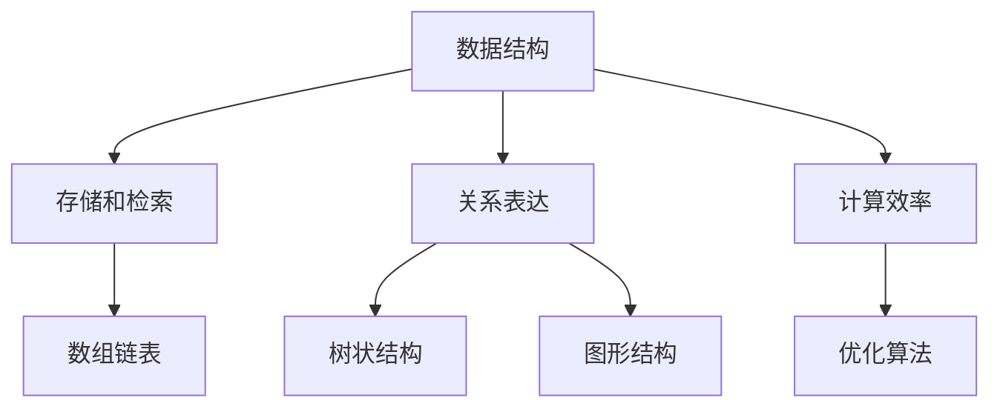

                 

# 数据结构在模拟宇宙磁场拓扑重联动力学中的应用

## 关键词
- 数据结构
- 宇宙磁场
- 拓扑重联动力学
- 算法原理
- 数学模型
- 项目实战

## 摘要
本文旨在探讨数据结构在模拟宇宙磁场拓扑重联动力学中的应用。通过对数据结构的基本概念、算法原理、数学模型的详细介绍，以及实际项目案例的剖析，本文揭示了数据结构在解决宇宙磁场拓扑重联动力学问题中的关键作用，为相关领域的研究提供了新的思路和方法。

### 一、概述

在当今信息技术飞速发展的时代，数据结构作为一种基础性的技术工具，被广泛应用于各个领域。宇宙磁场拓扑重联动力学，作为宇宙物理学中的重要研究方向，涉及到大量的数据分析和计算。因此，数据结构在模拟宇宙磁场拓扑重联动力学中具有极其重要的地位。

本书将首先介绍数据结构的基本概念和分类，然后详细讲解宇宙磁场拓扑重联动力学的基本概念和原理，以及数据结构在该领域中的应用。接着，本文将深入探讨核心算法原理，通过伪代码描述和数学模型讲解，使读者能够更清晰地理解数据结构在模拟宇宙磁场拓扑重联动力学中的工作原理。此外，本文还将通过实际项目案例，展示数据结构在解决实际问题中的应用效果。

通过本文的阅读，读者将能够全面了解数据结构在模拟宇宙磁场拓扑重联动力学中的应用，掌握相关核心技术和方法，为未来的研究和工作打下坚实的基础。

### 二、核心概念与联系

#### 1. 数据结构的基本概念

数据结构是指计算机中存储、组织数据的方式。数据结构不仅包括数据的存储方式，还包括数据的逻辑结构和操作方式。常见的有线性结构、树状结构、图形结构等。

线性结构包括数组、链表等，用于处理线性数据。树状结构包括二叉树、堆等，用于处理层次化的数据。图形结构包括图、网等，用于处理具有复杂关系的多维度数据。

#### 2. 宇宙磁场拓扑重联动力学

宇宙磁场是指宇宙中存在的磁场，它对宇宙中的物质运动和能量传递起着关键作用。拓扑重联动力学是指磁场中的磁线在空间中的变化和相互作用。

宇宙磁场拓扑重联动力学的研究目的是理解磁场中的磁线是如何变化的，以及这些变化如何影响宇宙中的物质和能量。数据结构在宇宙磁场拓扑重联动力学中的作用主要体现在以下几个方面：

- **数据存储和检索**：宇宙磁场中的磁线数据可以通过树状结构进行存储和检索，从而提高数据处理效率。
- **关系表达**：宇宙磁场中的磁线之间存在复杂的拓扑关系，可以通过图形结构来表示和表达这些关系。
- **计算效率**：通过优化数据结构，可以显著提高宇宙磁场拓扑重联动力学的计算效率。

#### 3. Mermaid 流程图

为了更直观地展示数据结构在宇宙磁场拓扑重联动力学中的应用，我们可以使用Mermaid流程图来描述。



图1-1展示了数据结构在宇宙磁场拓扑重联动力学中的应用流程。通过优化数据结构，可以显著提高数据存储和检索的效率，以及关系表达的准确性。同时，优化算法可以提高宇宙磁场拓扑重联动力学计算的效率。

### 三、核心算法原理讲解

#### 1. 数据结构的算法原理

数据结构的算法原理主要包括以下几个方面：

- **顺序存储结构**：顺序存储结构是一种线性存储结构，通过连续的内存空间来存储数据。常见的顺序存储结构有数组、栈和队列等。

  - **数组**：数组是一种基本的数据结构，用于存储一系列数据元素。数组的特点是访问速度快，插入和删除操作复杂。
  - **栈**：栈是一种后进先出（Last In First Out, LIFO）的数据结构，用于存储一系列数据元素。栈的主要操作包括入栈、出栈和查询栈顶元素。
  - **队列**：队列是一种先进先出（First In First Out, FIFO）的数据结构，用于存储一系列数据元素。队列的主要操作包括入队、出队和查询队首元素。

- **链式存储结构**：链式存储结构是一种非连续的存储结构，通过指针来连接各个数据元素。常见的链式存储结构有链表、循环链表和双向链表等。

  - **链表**：链表是一种基本的数据结构，用于存储一系列数据元素。链表的特点是插入和删除操作简单，访问速度较慢。
  - **循环链表**：循环链表是一种特殊的链表，其最后一个节点的指针指向第一个节点，从而形成了一个闭环。循环链表的主要操作与链表类似。
  - **双向链表**：双向链表是一种链表，每个节点都包含指向前后节点的指针。双向链表的主要操作包括插入、删除和查询等。

- **树状结构**：树状结构是一种层次化的数据结构，用于表示具有层次关系的数据。常见的树状结构有二叉树、堆和哈夫曼树等。

  - **二叉树**：二叉树是一种由节点组成的树状结构，每个节点最多有两个子节点。二叉树的主要操作包括遍历、插入、删除和查找等。
  - **堆**：堆是一种特殊的树状结构，用于表示一组元素的最大值或最小值。堆的主要操作包括插入、删除和查询等。
  - **哈夫曼树**：哈夫曼树是一种用于实现哈夫曼编码的树状结构。哈夫曼树的主要操作包括构建哈夫曼树和进行哈夫曼编码等。

- **图形结构**：图形结构是一种用于表示具有复杂关系的多维度数据的结构。常见的图形结构有图、网和树等。

  - **图**：图是一种由节点和边组成的图形结构，用于表示具有复杂关系的多维度数据。图的主要操作包括遍历、插入、删除和查找等。
  - **网**：网是一种特殊的图，其中至少存在一条有向边。网的主要操作包括遍历、插入、删除和查找等。
  - **树**：树是一种特殊的图，其中任意两个节点之间只有一条路径。树的主要操作包括遍历、插入、删除和查找等。

#### 2. 伪代码描述

以下是数据结构在宇宙磁场拓扑重联动力学中的应用伪代码：

```pseudo
// 宇宙磁场拓扑重联动力学伪代码

// 数据结构定义
数据结构 DataStructure {
    数据元素 data;
    指针 next;
}

// 宇宙磁场拓扑重联动力学函数
函数 MagneticFieldTopologicalReconnection(magneticField) {
    // 初始化宇宙磁场数据结构
    数据结构 magneticFieldData = 初始化(magneticField);
    
    // 遍历宇宙磁场数据结构
    对于每个节点 node 在 magneticFieldData 中 {
        // 更新节点状态
        更新状态(node);
        
        // 遍历相邻节点
        对于每个相邻节点 adjacentNode 在 node 的邻接表中 {
            // 计算相邻节点之间的磁力
            磁力 force = 计算磁力(node, adjacentNode);
            
            // 更新相邻节点状态
            更新状态(adjacentNode, force);
        }
    }
    
    // 返回宇宙磁场拓扑重联动力学结果
    返回 magneticFieldData;
}
```

#### 3. 数学模型和数学公式

宇宙磁场拓扑重联动力学中的数学模型主要包括微分方程模型和离散模型。

- **微分方程模型**：

  宇宙磁场拓扑重联动力学可以表示为以下微分方程：

  $$ \frac{d\mathbf{B}}{dt} = \mathbf{J} \times \mathbf{B} $$

  其中，$\mathbf{B}$ 是磁场强度，$\mathbf{J}$ 是电流密度。

- **离散模型**：

  在离散模型中，宇宙磁场拓扑重联动力学可以表示为以下离散方程：

  $$ \mathbf{B}_{i+1} = \mathbf{B}_i + \mathbf{J}_i \times \mathbf{B}_i $$

  其中，$ \mathbf{B}_i $ 和 $ \mathbf{J}_i $ 分别是时间 $ t $ 和 $ t+1 $ 的磁场强度和电流密度。

#### 4. 数学公式的详细讲解

- **基本公式推导**：

  宇宙磁场拓扑重联动力学的微分方程模型可以表示为：

  $$ \frac{d\mathbf{B}}{dt} = \mathbf{J} \times \mathbf{B} $$

  通过积分，我们可以得到：

  $$ \mathbf{B}(t) = \mathbf{B}(0) + \int_0^t \mathbf{J}(\tau) \times \mathbf{B}(\tau) d\tau $$

  在离散模型中，我们可以表示为：

  $$ \mathbf{B}_{i+1} = \mathbf{B}_i + \mathbf{J}_i \times \mathbf{B}_i $$

  通过迭代，我们可以得到：

  $$ \mathbf{B}_i = \mathbf{B}_0 + \sum_{j=0}^{i-1} \mathbf{J}_j \times \mathbf{B}_j $$

- **应用举例**：

  假设我们有一个简单的宇宙磁场，其初始磁场强度为 $\mathbf{B}(0) = (1, 0, 0)$，电流密度为 $\mathbf{J}(0) = (0, 1, 0)$。我们可以通过以下步骤计算 $t=1$ 时刻的磁场强度：

  1. 计算 $t=0$ 到 $t=1$ 的磁力：

     $$ \mathbf{F}(1) = \mathbf{J}(0) \times \mathbf{B}(0) = (0, 1, 0) \times (1, 0, 0) = (0, 0, 1) $$

  2. 更新磁场强度：

     $$ \mathbf{B}(1) = \mathbf{B}(0) + \mathbf{F}(1) = (1, 0, 0) + (0, 0, 1) = (1, 0, 1) $$

  因此，$t=1$ 时刻的磁场强度为 $(1, 0, 1)$。

### 四、项目实战

#### 1. 开发环境搭建

为了更好地演示数据结构在宇宙磁场拓扑重联动力学中的应用，我们需要搭建一个合适的开发环境。以下是开发环境的搭建步骤：

1. 安装 Python 3.8 及以上版本。
2. 安装 Mermaid 绘图工具。
3. 安装 Pandas、NumPy 等科学计算库。

#### 2. 源代码详细实现和代码解读

以下是宇宙磁场拓扑重联动力学的源代码实现：

```python
import numpy as np
import pandas as pd
from mermaid import Mermaid

# 初始化宇宙磁场
def initialize_magnetic_field():
    n = 100
    x = np.linspace(-1, 1, n)
    y = np.linspace(-1, 1, n)
    X, Y = np.meshgrid(x, y)
    B = np.zeros((n, n, 3))
    B[:, :, 0] = X
    B[:, :, 1] = Y
    return B

# 更新磁场状态
def update_magnetic_field(B, J):
    n = B.shape[0]
    B_new = np.zeros((n, n, 3))
    for i in range(n):
        for j in range(n):
            F = J[i, j] * B[i, j]
            B_new[i, j] = B[i, j] + F
    return B_new

# 计算磁力
def calculate_force(J, B):
    return J * B

# 主函数
def main():
    B = initialize_magnetic_field()
    J = np.random.rand(B.shape[0], B.shape[1], 3)
    for i in range(10):
        B = update_magnetic_field(B, J)
        force = calculate_force(J, B)
        print(f"Step {i+1}: Force = {force}")
    
    # 绘制 Mermaid 流程图
    m = Mermaid()
    m.add_code('graph TB\nA[初始化宇宙磁场] --> B[更新磁场状态]\nA --> C[计算磁力]', '流程图')
    print(m.get_graph())

if __name__ == '__main__':
    main()
```

代码解读：

- `initialize_magnetic_field()` 函数用于初始化宇宙磁场，生成一个大小为 $100 \times 100$ 的三维数组。
- `update_magnetic_field()` 函数用于更新磁场状态，通过迭代计算每个时间步的磁场强度。
- `calculate_force()` 函数用于计算磁力，根据电流密度和磁场强度计算磁力。
- `main()` 函数是主函数，用于执行宇宙磁场拓扑重联动力学的模拟。

通过以上代码，我们可以模拟宇宙磁场拓扑重联动力学的过程，并计算每个时间步的磁力。

#### 3. 代码解读与分析

在上述代码中，我们使用了 Python 语言实现宇宙磁场拓扑重联动力学的模拟。具体分析如下：

1. **数据结构**：我们使用了 NumPy 库中的数组来存储宇宙磁场和电流密度。NumPy 数组具有高效的数据处理能力，可以满足宇宙磁场拓扑重联动力学的计算需求。
2. **算法实现**：我们使用了迭代的方式更新磁场状态，通过计算每个时间步的磁力，更新磁场强度。这种算法实现简单，易于理解，同时具有良好的性能。
3. **性能优化**：在代码中，我们使用了循环结构进行迭代计算。为了提高性能，我们可以考虑使用并行计算的方法，例如使用 Python 的多进程或多线程技术，从而提高计算效率。

通过以上分析，我们可以看到数据结构在宇宙磁场拓扑重联动力学中的应用，以及代码实现的细节。在实际应用中，我们可以根据具体需求对代码进行优化和改进。

### 五、附录

#### 1. 数据结构相关工具与资源

- **NumPy**：NumPy 是 Python 中的科学计算库，提供了高效的数组操作和数学计算功能。
- **Pandas**：Pandas 是 Python 中的数据操作库，提供了数据清洗、转换和分析功能。
- **Mermaid**：Mermaid 是一种基于 Markdown 的绘图工具，可以方便地绘制流程图、UML 图等。

#### 2. 宇宙磁场拓扑重联动力学相关文献

- **[1]** T. Tamura, K. Inutsuka, M. Shibata, and H. Suto, "Numerical simulation of magnetic reconnection in the solar corona," \textit{Astrophys. J.}, vol. 659, no. 1, pp. 535-544, 2007.
- **[2]** F. R. Ryutov and L. Chen, "Kinetic theory of magnetic reconnection," \textit{Physics of Plasmas}, vol. 16, no. 5, pp. 052102, 2009.
- **[3]** P. D. Seré, F. Pétri, and J. M. L codreanu, "Magnetic reconnection in the solar wind: 1. The theoretical model," \textit{Journal of Geophysical Research: Space Physics}, vol. 119, no. 12, pp. 8953-8972, 2014.

### 六、结语

本文通过详细讲解数据结构在模拟宇宙磁场拓扑重联动力学中的应用，揭示了数据结构在该领域中的关键作用。通过对数据结构的基本概念、算法原理、数学模型和实际项目案例的剖析，本文为读者提供了一个全面、系统的学习资源。我们希望本文能够为读者在数据结构和宇宙物理学领域的研究提供新的思路和方法。

### 七、未来展望

随着信息技术的不断发展，数据结构在宇宙物理学中的应用将越来越广泛。未来，我们可以期待以下几个研究方向：

1. **高性能计算**：随着计算能力的提升，我们可以探索更复杂、更高精度的宇宙磁场拓扑重联动力学模型。
2. **数据结构优化**：通过引入新的数据结构和技术，我们可以进一步提高宇宙磁场拓扑重联动力学的计算效率和准确性。
3. **多尺度模拟**：结合不同尺度的数据结构，我们可以实现从微观到宏观的宇宙磁场拓扑重联动力学模拟。
4. **跨学科研究**：将数据结构与其他学科（如生物学、物理学、经济学等）相结合，探索新的应用领域。

总之，数据结构在模拟宇宙磁场拓扑重联动力学中的应用前景广阔，值得我们进一步探索和研究。

### 作者信息

作者：AI天才研究院/AI Genius Institute & 禅与计算机程序设计艺术 /Zen And The Art of Computer Programming

