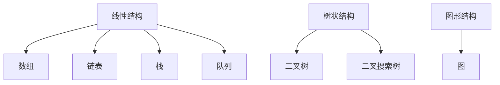

                 

### 文章标题：数据结构：程序世界的基石

数据结构是计算机科学中最基础、最核心的概念之一，它为程序员提供了一个抽象的框架，用于高效地存储、组织和管理数据。无论是编写一个简单的程序，还是开发复杂的软件系统，数据结构都是必不可少的基石。本文将深入探讨数据结构的重要性，详细解析各种基本数据结构，并展示它们在实际编程中的应用，帮助读者构建坚实的编程基础。

### 文章关键词

- 数据结构
- 程序设计
- 算法
- 数组
- 链表
- 树
- 图
- 排序
- 查找

### 摘要

本文旨在帮助程序员深入理解数据结构的基本概念和原理，并通过实例分析、伪代码和实际项目实战，展现数据结构在程序开发中的关键作用。文章将分为以下几个部分：数据结构与算法概述，线性结构，树与图，排序与查找，算法分析与设计，数据结构应用案例，以及总结与展望。通过本文的阅读，读者将对数据结构有全面而深入的认识。

---

## 第一部分：数据结构与算法概述

### 第1章：引论

数据结构是程序设计中的核心概念，它指的是数据元素的组织形式及其相互关系。而算法则是解决问题的步骤集合，用于处理数据结构中的数据元素。数据结构与算法密不可分，数据结构决定了算法的性能和效率。

首先，我们需要了解数据结构的基本概念。数据结构可以大致分为线性结构、树状结构和图形结构。线性结构包括数组、链表、栈和队列等；树状结构包括二叉树、二叉搜索树等；图形结构则包括图的各种表示方法。

### 1.1 数据结构与算法的基本概念

数据结构：
- 数据元素：数据的基本单位，如数字、字符等。
- 数据集合：由若干数据元素组成。
- 数据的逻辑结构：数据元素之间的逻辑关系。
- 数据的物理结构：数据在计算机中的存储形式。

算法：
- 算法的有穷性：算法必须能在执行有限步后终止。
- 算法的确定性：算法的每一步都有确切的定义，不存在歧义。
- 算法的有效性：算法能够解决问题，并能在合理的时间内完成。

### 1.2 数据结构的重要性

数据结构对于程序设计的几个关键影响：
1. **效率提升**：合适的结构可以使数据处理更加高效，减少时间复杂度和空间复杂度。
2. **内存管理**：合理的数据结构可以优化内存使用，提高程序性能。
3. **代码可读性**：清晰的数据结构有助于编写易于理解和维护的代码。
4. **抽象层次**：数据结构提供了抽象的层次，使得程序员可以专注于算法的实现，而不是底层的存储细节。

### 1.3 算法分析

算法分析是评估算法性能的重要手段，主要包括：
- **时间复杂度**：描述算法执行时间与数据规模的关系，常用的表示方法有\(O(\cdot)\)、\(\Omega(\cdot)\)和\(\Theta(\cdot)\)。
- **空间复杂度**：描述算法执行过程中占用的内存空间与数据规模的关系。

例如，插入排序的时间复杂度为\(O(n^2)\)，而归并排序的时间复杂度为\(O(n \log n)\)。通过算法分析，我们可以选择更适合问题的算法，以达到最佳的性能。

### 数据结构之间的关系架构

以下是一个简单的 Mermaid 流程图，展示了数据结构之间的关系：



通过这个图，我们可以清晰地看到线性结构、树状结构和图形结构之间的关联，以及它们在程序设计中的应用。

### 1.4 数据结构的选择

选择合适的数据结构对于程序设计至关重要。以下是一些常见数据结构的选择标准：

- **数组**：适用于固定大小的数据集合，访问元素速度快，但不适合动态增删元素。
- **链表**：适用于动态大小的数据集合，插入和删除操作灵活，但访问元素速度较慢。
- **栈和队列**：常用于模拟程序中的逻辑顺序，如后进先出（LIFO）和先进先出（FIFO）。
- **树**：适用于分层的数据，如文件系统、组织结构等。
- **图**：适用于复杂的关系网络，如社交网络、交通网络等。

通过合理选择数据结构，我们可以使程序设计更加高效、灵活和可维护。

---

在下一章中，我们将深入探讨线性结构，包括数组、链表、栈和队列等，以及它们的核心概念和实现原理。通过具体的算法原理讲解和伪代码展示，帮助读者理解这些数据结构在实际编程中的应用。

## 第二部分：线性结构

### 第2章：线性结构

线性结构是数据结构中最基础和常用的一种类型。它们的特点是数据元素按照线性顺序排列，每个元素只有一个前驱和一个后继。线性结构包括数组、链表、栈和队列等。本章将详细讨论这些结构的核心概念、实现原理以及在实际编程中的应用。

### 2.1 数组

数组是一种线性结构，它使用连续的内存空间来存储一系列元素。数组的特点是访问元素速度快，但动态扩展较困难。

#### 2.1.1 数组的定义与特点

数组定义：
- 数组是一种集合数据类型，用于存储具有相同数据类型的固定数量元素。
- 每个元素可以通过索引（或下标）访问，索引从0开始。

数组特点：
1. **随机访问**：可以直接通过索引访问数组中的任意元素，时间复杂度为\(O(1)\)。
2. **固定大小**：数组的大小在创建时确定，不能动态扩展。
3. **连续存储**：数组元素在内存中连续存储，有助于提高访问速度。

#### 2.1.2 数组操作

常见的数组操作包括初始化、访问、修改、插入和删除等。

初始化：
```cpp
int arr[5] = {1, 2, 3, 4, 5};
```

访问和修改：
```cpp
int value = arr[2];  // 访问第3个元素（索引2）
arr[2] = 10;  // 修改第3个元素（索引2）为10
```

插入和删除（示例）：
```cpp
void insert(int* arr, int n, int index, int value) {
    for (int i = n; i > index; i--) {
        arr[i] = arr[i - 1];
    }
    arr[index] = value;
}

void deleteElement(int* arr, int n, int index) {
    for (int i = index; i < n - 1; i++) {
        arr[i] = arr[i + 1];
    }
    arr[n - 1] = 0;  // 或使用其他填充值
}
```

### 2.2 链表

链表是一种动态数据结构，它由一系列节点组成，每个节点包含数据域和指向下一个节点的指针。链表的特点是插入和删除操作灵活，但访问速度较慢。

#### 2.2.1 单链表

单链表定义：
- 每个节点包含数据域和一个指向下一个节点的指针。

单链表特点：
1. **动态大小**：链表的大小在运行时动态调整，不需要预先分配固定空间。
2. **非连续存储**：节点在内存中的位置不连续，由指针连接。

单链表操作（伪代码）：

创建节点：
```cpp
Node* createNode(int data) {
    Node* newNode = new Node();
    newNode->data = data;
    newNode->next = nullptr;
    return newNode;
}
```

插入节点（在末尾）：
```cpp
void insertAtEnd(Node* head, int data) {
    Node* newNode = createNode(data);
    if (head == nullptr) {
        head = newNode;
    } else {
        Node* temp = head;
        while (temp->next != nullptr) {
            temp = temp->next;
        }
        temp->next = newNode;
    }
}
```

删除节点（根据值）：
```cpp
void deleteNode(Node* head, int value) {
    Node* temp = head;
    if (temp != nullptr && temp->data == value) {
        head = temp->next;
        delete temp;
        return;
    }
    while (temp != nullptr && temp->next != nullptr) {
        if (temp->next->data == value) {
            Node* toDelete = temp->next;
            temp->next = toDelete->next;
            delete toDelete;
            return;
        }
        temp = temp->next;
    }
}
```

### 2.3 栈与队列

栈和队列都是特殊的线性结构，分别用于实现后进先出（LIFO）和先进先出（FIFO）的逻辑。

#### 2.3.1 栈的实现

栈操作（伪代码）：

压栈（push）：
```cpp
void push(Stack* stack, int value) {
    Node* newNode = createNode(value);
    if (stack->top == nullptr) {
        stack->top = newNode;
    } else {
        newNode->next = stack->top;
        stack->top = newNode;
    }
}
```

出栈（pop）：
```cpp
int pop(Stack* stack) {
    if (stack->top == nullptr) {
        return -1;  // 或抛出异常
    }
    int value = stack->top->data;
    Node* temp = stack->top;
    stack->top = stack->top->next;
    delete temp;
    return value;
}
```

#### 2.3.2 队列的实现

队列操作（伪代码）：

入队（enqueue）：
```cpp
void enqueue(Queue* queue, int value) {
    Node* newNode = createNode(value);
    if (queue->rear == nullptr) {
        queue->front = queue->rear = newNode;
    } else {
        queue->rear->next = newNode;
        queue->rear = newNode;
    }
}
```

出队（dequeue）：
```cpp
int dequeue(Queue* queue) {
    if (queue->front == nullptr) {
        return -1;  // 或抛出异常
    }
    int value = queue->front->data;
    Node* temp = queue->front;
    queue->front = queue->front->next;
    if (queue->front == nullptr) {
        queue->rear = nullptr;
    }
    delete temp;
    return value;
}
```

### 2.4 线性结构比较

数组、链表、栈和队列各有优缺点，选择时应根据具体需求进行权衡。

- **数组**：访问速度快，适用于固定大小和频繁访问的场景。
- **链表**：动态扩展灵活，适用于频繁插入和删除的场景。
- **栈**：适用于后进先出的逻辑，如函数调用、表达式求值等。
- **队列**：适用于先进先出的逻辑，如任务队列、打印队列等。

### 2.5 实践与思考

在实际编程中，合理选择和使用线性结构可以显著提高代码的效率和可维护性。例如，在实现一个缓存系统时，可以使用数组来存储热点数据，利用链表实现缓存淘汰策略；在实现一个任务调度系统时，可以使用队列来管理任务队列，利用栈来跟踪任务的执行顺序。

通过本章的学习，读者应该能够深入理解线性结构的核心概念和实现原理，并在实际编程中灵活应用。

在下一章中，我们将探讨树与图这两种重要的非线性结构，分析它们的特点和应用场景。

## 第三部分：树与图

### 第3章：树与图

树和图是两种重要的非线性数据结构，它们在计算机科学中有着广泛的应用。树结构模拟了现实世界中的层次关系，如文件系统、组织结构等；而图结构则用于描述复杂的关系网络，如社交网络、交通网络等。本章将详细讨论树与图的基本概念、核心算法原理以及在实际编程中的应用。

### 3.1 树的基本概念

树（Tree）是一种重要的非线性结构，由节点（Node）组成，每个节点包含数据域和指向子节点的指针。树的特点是具有层次结构，每个节点有且只有一个父节点，除根节点外，其他节点有且只有一个子节点。

#### 3.1.1 二叉树

二叉树（Binary Tree）是树的一种特殊形式，每个节点最多有两个子节点，通常称为左子节点和右子节点。二叉树的节点定义如下：

```cpp
struct TreeNode {
    int data;
    TreeNode* left;
    TreeNode* right;
};
```

二叉树的基本操作包括创建节点、插入节点、删除节点、查找节点等。

创建节点（伪代码）：

```cpp
TreeNode* createNode(int data) {
    TreeNode* newNode = new TreeNode();
    newNode->data = data;
    newNode->left = newNode->right = nullptr;
    return newNode;
}
```

插入节点（递归）：

```cpp
TreeNode* insertNode(TreeNode* root, int data) {
    if (root == nullptr) {
        return createNode(data);
    }
    if (data < root->data) {
        root->left = insertNode(root->left, data);
    } else {
        root->right = insertNode(root->right, data);
    }
    return root;
}
```

删除节点（递归）：

```cpp
TreeNode* deleteNode(TreeNode* root, int data) {
    if (root == nullptr) {
        return root;
    }
    if (data < root->data) {
        root->left = deleteNode(root->left, data);
    } else if (data > root->data) {
        root->right = deleteNode(root->right, data);
    } else {
        if (root->left == nullptr) {
            TreeNode* temp = root->right;
            delete root;
            root = temp;
        } else if (root->right == nullptr) {
            TreeNode* temp = root->left;
            delete root;
            root = temp;
        } else {
            TreeNode* temp = minValueNode(root->right);
            root->data = temp->data;
            root->right = deleteNode(root->right, temp->data);
        }
    }
    return root;
}

TreeNode* minValueNode(TreeNode* root) {
    TreeNode* current = root;
    while (current->left != nullptr) {
        current = current->left;
    }
    return current;
}
```

查找节点（递归）：

```cpp
TreeNode* searchNode(TreeNode* root, int data) {
    if (root == nullptr || root->data == data) {
        return root;
    }
    if (data < root->data) {
        return searchNode(root->left, data);
    } else {
        return searchNode(root->right, data);
    }
}
```

#### 3.1.2 二叉搜索树

二叉搜索树（Binary Search Tree，BST）是一种特殊的二叉树，它满足以下性质：
- 左子树上所有节点的值均小于根节点的值。
- 右子树上所有节点的值均大于根节点的值。
- 左、右子树也都是二叉搜索树。

二叉搜索树具有高效的查找、插入和删除操作，时间复杂度为\(O(\log n)\)。

### 3.2 图的基本概念

图（Graph）是一种由节点（Vertex）和边（Edge）组成的数据结构，用于描述复杂的关系网络。图可以分为无向图和有向图，节点之间的边可以是任意方向的。

图的节点定义如下：

```cpp
struct GraphNode {
    int id;
    bool visited;
    list<GraphNode*> neighbors;
};
```

图的基本操作包括创建节点、添加边、遍历图等。

创建节点（伪代码）：

```cpp
GraphNode* createNode(int id) {
    GraphNode* newNode = new GraphNode();
    newNode->id = id;
    newNode->visited = false;
    return newNode;
}
```

添加边（伪代码）：

```cpp
void addEdge(GraphNode* node1, GraphNode* node2) {
    node1->neighbors.push_back(node2);
    node2->neighbors.push_back(node1);
}
```

#### 3.2.1 无向图与有向图

- **无向图**：节点之间的边没有方向，如社交网络。
- **有向图**：节点之间的边具有方向，如网页链接。

#### 3.2.2 图的表示方法

图的表示方法主要有邻接矩阵和邻接表。

- **邻接矩阵**：使用二维数组表示，矩阵的元素表示节点之间的边，值为1表示相邻，值为0表示不相邻。

- **邻接表**：使用数组表示，数组中的每个元素是一个链表，链表中的节点表示与该节点相邻的其他节点。

邻接矩阵（伪代码）：

```cpp
int adjMatrix[MAX_NODES][MAX_NODES];

void addEdge(int node1, int node2) {
    adjMatrix[node1][node2] = 1;
    adjMatrix[node2][node1] = 1;
}
```

邻接表（伪代码）：

```cpp
list<GraphNode*> adjList[MAX_NODES];

void addEdge(int node1, int node2) {
    adjList[node1].push_back(createNode(node2));
    adjList[node2].push_back(createNode(node1));
}
```

### 3.3 图的遍历算法

图的遍历算法用于访问图中的所有节点。常用的遍历算法有深度优先搜索（DFS）和广度优先搜索（BFS）。

#### 3.3.1 深度优先搜索（DFS）

深度优先搜索是一种递归算法，它从起始节点开始，沿着一个分支深入到最远的节点，然后回溯并沿着另一条分支继续搜索。

DFS（递归）：

```cpp
void DFS(GraphNode* node) {
    if (node == nullptr) {
        return;
    }
    node->visited = true;
    cout << node->id << " ";
    for (GraphNode* neighbor : node->neighbors) {
        if (!neighbor->visited) {
            DFS(neighbor);
        }
    }
}
```

#### 3.3.2 广度优先搜索（BFS）

广度优先搜索是一种迭代算法，它从起始节点开始，逐层访问图中的节点。

BFS（迭代）：

```cpp
void BFS(GraphNode* startNode) {
    queue<GraphNode*> queue;
    startNode->visited = true;
    queue.push(startNode);

    while (!queue.empty()) {
        GraphNode* currentNode = queue.front();
        cout << currentNode->id << " ";
        queue.pop();

        for (GraphNode* neighbor : currentNode->neighbors) {
            if (!neighbor->visited) {
                neighbor->visited = true;
                queue.push(neighbor);
            }
        }
    }
}
```

### 3.4 树与图的应用

树和图在计算机科学中有着广泛的应用，如文件系统、网络拓扑、社交网络、搜索引擎等。以下是一些实际应用案例：

- **文件系统**：文件系统通常采用树状结构来组织文件和目录。
- **网络拓扑**：网络拓扑图描述了网络中各个设备之间的连接关系。
- **社交网络**：社交网络可以使用图结构来描述用户之间的联系。
- **搜索引擎**：搜索引擎使用图结构来表示网页之间的链接关系，优化搜索结果。

### 3.5 实践与思考

在实际编程中，合理选择和使用树和图可以显著提高代码的效率和可维护性。例如，在实现一个社交网络系统时，可以使用图结构来表示用户之间的联系；在实现一个搜索引擎时，可以使用图结构来优化搜索结果。

通过本章的学习，读者应该能够深入理解树和图的核心概念和算法原理，并在实际编程中灵活应用。

在下一章中，我们将探讨排序与查找算法，分析它们的基本原理和实际应用。

## 第四部分：排序与查找

### 第4章：排序与查找

排序与查找是数据结构中的两个重要操作。排序是指将一组数据元素按照某种规则排列成一个有序序列；而查找则是寻找特定元素的位置或值。本章将详细介绍几种常用的排序算法和查找算法，包括它们的原理、实现方法以及在实际编程中的应用。

### 4.1 排序算法

排序算法可以分为内部排序和外部排序。内部排序是指所有的数据都在内存中进行排序，而外部排序是指数据量较大，需要在外部存储（如硬盘）上进行排序。

#### 4.1.1 插入排序

插入排序（Insertion Sort）是一种简单直观的排序算法。它的工作原理是通过构建有序序列，对于未排序数据，在已排序序列中从后向前扫描，找到相应位置并插入。

插入排序过程（伪代码）：

```cpp
void insertionSort(int arr[], int n) {
    for (int i = 1; i < n; i++) {
        int key = arr[i];
        int j = i - 1;

        while (j >= 0 && arr[j] > key) {
            arr[j + 1] = arr[j];
            j = j - 1;
        }
        arr[j + 1] = key;
    }
}
```

插入排序的时间复杂度为\(O(n^2)\)，适用于小规模数据的排序。

#### 4.1.2 选择排序

选择排序（Selection Sort）是一种简单的排序算法。它的工作原理是每次从未排序的元素中找到最小（或最大）的元素，将其放到已排序序列的末尾。

选择排序过程（伪代码）：

```cpp
void selectionSort(int arr[], int n) {
    for (int i = 0; i < n - 1; i++) {
        int minIndex = i;
        for (int j = i + 1; j < n; j++) {
            if (arr[j] < arr[minIndex]) {
                minIndex = j;
            }
        }
        swap(arr[minIndex], arr[i]);
    }
}
```

选择排序的时间复杂度为\(O(n^2)\)，适用于小规模数据的排序。

#### 4.1.3 交换排序

交换排序是指通过交换元素的位置来实现排序，包括冒泡排序和快速排序。

- **冒泡排序（Bubble Sort）**：通过重复遍历要排序的数列，每次比较两个相邻的元素，如果它们的顺序错误就把它们交换过来。

冒泡排序过程（伪代码）：

```cpp
void bubbleSort(int arr[], int n) {
    for (int i = 0; i < n - 1; i++) {
        for (int j = 0; j < n - i - 1; j++) {
            if (arr[j] > arr[j + 1]) {
                swap(arr[j], arr[j + 1]);
            }
        }
    }
}
```

冒泡排序的时间复杂度为\(O(n^2)\)，适用于小规模数据的排序。

- **快速排序（Quick Sort）**：通过选取一个基准元素，将数组分为两部分，一部分比基准元素小，另一部分比基准元素大，然后递归地对这两部分进行快速排序。

快速排序过程（伪代码）：

```cpp
int partition(int arr[], int low, int high) {
    int pivot = arr[high];
    int i = (low - 1);

    for (int j = low; j <= high - 1; j++) {
        if (arr[j] < pivot) {
            i++;
            swap(arr[i], arr[j]);
        }
    }
    swap(arr[i + 1], arr[high]);
    return (i + 1);
}

void quickSort(int arr[], int low, int high) {
    if (low < high) {
        int pi = partition(arr, low, high);

        quickSort(arr, low, pi - 1);
        quickSort(arr, pi + 1, high);
    }
}
```

快速排序的平均时间复杂度为\(O(n \log n)\)，适用于大规模数据的排序。

#### 4.1.4 归并排序

归并排序（Merge Sort）是一种分治算法，它将一个序列分成若干个子序列，分别进行排序，然后将排好序的子序列合并成一个完整的有序序列。

归并排序过程（伪代码）：

```cpp
void merge(int arr[], int l, int m, int r) {
    int n1 = m - l + 1;
    int n2 = r - m;

    int L[n1], R[n2];

    for (int i = 0; i < n1; i++) {
        L[i] = arr[l + i];
    }
    for (int j = 0; j < n2; j++) {
        R[j] = arr[m + 1 + j];
    }

    int i = 0, j = 0, k = l;
    while (i < n1 && j < n2) {
        if (L[i] <= R[j]) {
            arr[k] = L[i];
            i++;
        } else {
            arr[k] = R[j];
            j++;
        }
        k++;
    }

    while (i < n1) {
        arr[k] = L[i];
        i++;
        k++;
    }

    while (j < n2) {
        arr[k] = R[j];
        j++;
        k++;
    }
}

void mergeSort(int arr[], int l, int r) {
    if (l < r) {
        int m = l + (r - l) / 2;

        mergeSort(arr, l, m);
        mergeSort(arr, m + 1, r);

        merge(arr, l, m, r);
    }
}
```

归并排序的时间复杂度为\(O(n \log n)\)，适用于大规模数据的排序。

### 4.2 查找算法

查找算法用于在数据结构中寻找特定元素。常见的查找算法有线性查找和二分查找。

#### 4.2.1 线性查找

线性查找（Linear Search）是一种最简单的查找算法。它从数组的第一个元素开始，依次向后搜索，直到找到目标元素或到达数组的末尾。

线性查找过程（伪代码）：

```cpp
int linearSearch(int arr[], int n, int target) {
    for (int i = 0; i < n; i++) {
        if (arr[i] == target) {
            return i;
        }
    }
    return -1;  // 或抛出异常
}
```

线性查找的时间复杂度为\(O(n)\)，适用于数据量较小的情况。

#### 4.2.2 二分查找

二分查找（Binary Search）是一种高效的查找算法，它适用于已经排序的数组。二分查找通过不断缩小查找范围，每次将查找范围减半，直到找到目标元素或确定目标元素不存在。

二分查找过程（伪代码）：

```cpp
int binarySearch(int arr[], int l, int r, int target) {
    while (l <= r) {
        int m = l + (r - l) / 2;

        if (arr[m] == target) {
            return m;
        } else if (arr[m] < target) {
            l = m + 1;
        } else {
            r = m - 1;
        }
    }
    return -1;  // 或抛出异常
}
```

二分查找的时间复杂度为\(O(\log n)\)，适用于数据量较大且已经排序的情况。

### 4.3 排序与查找比较

排序算法和查找算法的选择取决于具体的应用场景和数据的特性。以下是一些常见的比较：

- **插入排序**：简单易实现，适用于小规模数据。
- **选择排序**：简单易实现，但效率较低，适用于小规模数据。
- **冒泡排序**：简单易懂，但效率较低，适用于小规模数据。
- **快速排序**：平均效率较高，适用于大规模数据。
- **归并排序**：稳定高效，适用于大规模数据。
- **线性查找**：简单易实现，适用于小规模数据。
- **二分查找**：高效，适用于大规模已排序数据。

### 4.4 实践与思考

在实际编程中，选择合适的排序和查找算法可以显著提高代码的效率和性能。例如，在实现一个文件检索系统时，可以使用二分查找来快速定位文件；在实现一个排序算法库时，可以选择不同的排序算法来满足不同场景的需求。

通过本章的学习，读者应该能够掌握排序和查找算法的基本原理和实现方法，并在实际编程中灵活应用。

在下一章中，我们将探讨算法分析与设计，深入理解时间复杂度和空间复杂度，以及常见的算法设计技巧。

## 第五部分：算法分析与设计

### 第5章：算法分析与设计

算法分析是评估算法性能的重要手段，通过分析算法的时间复杂度和空间复杂度，我们可以判断算法的效率以及在实际应用中的适用性。同时，掌握一些常见的算法设计技巧，如分治策略、动态规划、贪心算法等，可以帮助我们解决复杂问题。本章将详细讨论算法分析与设计的基本概念、常用方法以及实际应用。

### 5.1 时间复杂度分析

时间复杂度描述了算法执行时间与数据规模之间的关系，用于评估算法的运行效率。它通常使用大O符号（\(O(\cdot)\)）来表示。

#### 5.1.1 基本概念

- **常数时间复杂度**：算法执行时间不随数据规模增长而变化，记为\(O(1)\)。
- **线性时间复杂度**：算法执行时间与数据规模成正比，记为\(O(n)\)。
- **对数时间复杂度**：算法执行时间与数据规模的对数成正比，记为\(O(\log n)\)。
- **多项式时间复杂度**：算法执行时间与数据规模的某个多项式成正比，如\(O(n^2)\)、\(O(n^3)\)等。
- **指数时间复杂度**：算法执行时间与数据规模的指数成正比，记为\(O(2^n)\)。

#### 5.1.2 常见复杂度分析

以下是一些常见算法的时间复杂度分析：

- **插入排序**：\(O(n^2)\)
- **选择排序**：\(O(n^2)\)
- **冒泡排序**：\(O(n^2)\)
- **快速排序**：平均情况为\(O(n \log n)\)，最坏情况为\(O(n^2)\)
- **归并排序**：\(O(n \log n)\)
- **线性查找**：\(O(n)\)
- **二分查找**：\(O(\log n)\)

通过时间复杂度分析，我们可以选择更适合问题的算法，以达到最佳的性能。

### 5.2 算法设计技巧

常见的算法设计技巧包括分治策略、动态规划、贪心算法等，它们可以帮助我们解决复杂问题。

#### 5.2.1 分治策略

分治策略将一个大问题分解成若干个规模较小的相同问题，分别解决后再合并结果。分治算法通常具有递归结构。

分治策略的基本步骤：

1. **分解**：将问题分解成若干个规模较小的相同问题。
2. **解决**：递归地解决这些子问题。
3. **合并**：将子问题的解合并为原问题的解。

示例：快速排序

```cpp
int partition(int arr[], int low, int high) {
    int pivot = arr[high];
    int i = (low - 1);

    for (int j = low; j <= high - 1; j++) {
        if (arr[j] < pivot) {
            i++;
            swap(arr[i], arr[j]);
        }
    }
    swap(arr[i + 1], arr[high]);
    return (i + 1);
}

void quickSort(int arr[], int low, int high) {
    if (low < high) {
        int pi = partition(arr, low, high);

        quickSort(arr, low, pi - 1);
        quickSort(arr, pi + 1, high);
    }
}
```

#### 5.2.2 动态规划

动态规划是一种解决优化问题的方法，它通过将问题分解成子问题，并保存子问题的解，以避免重复计算。

动态规划的基本步骤：

1. **定义子问题**：将原问题分解成若干个互不相同的子问题。
2. **递推关系**：找出子问题之间的关系，建立递推关系式。
3. **边界条件**：确定递推关系的边界条件。
4. **计算顺序**：确定子问题的计算顺序。

示例：斐波那契数列

```cpp
int fib(int n) {
    if (n <= 1) {
        return n;
    }
    int dp[n + 1];
    dp[0] = 0;
    dp[1] = 1;
    for (int i = 2; i <= n; i++) {
        dp[i] = dp[i - 1] + dp[i - 2];
    }
    return dp[n];
}
```

#### 5.2.3 贪心算法

贪心算法是一种在每一步选择最优解的策略，它通过做出当前看来最优的选择，以期在整体上得到最优解。

贪心算法的基本步骤：

1. **初始状态**：确定问题的初始状态。
2. **选择策略**：选择一个策略，使得每一步都能做出当前最优的选择。
3. **迭代更新**：根据当前状态更新问题的解，并迭代进行。

示例：背包问题

```cpp
int knapsack(int weights[], int values[], int capacity) {
    int n = sizeof(weights) / sizeof(weights[0]);
    int dp[capacity + 1];

    for (int i = 0; i <= capacity; i++) {
        dp[i] = 0;
    }

    for (int i = 0; i < n; i++) {
        for (int j = capacity; j >= weights[i]; j--) {
            dp[j] = max(dp[j], dp[j - weights[i]] + values[i]);
        }
    }

    return dp[capacity];
}
```

### 5.3 算法分析与设计实践

在实际编程中，算法分析与设计是解决复杂问题的关键。以下是一些实践技巧：

- **选择合适的数据结构**：根据问题的特性选择合适的数据结构，以提高算法的效率。
- **优化代码**：通过分析算法的复杂度，找出瓶颈并进行优化。
- **代码复用**：将通用的算法设计模块化，提高代码的可维护性和可复用性。
- **性能测试**：对算法进行性能测试，评估其效率。

### 5.4 实践与思考

在实际编程中，掌握算法分析与设计技巧对于编写高效、可维护的代码至关重要。例如，在实现一个网络爬虫时，可以使用分治策略来并行处理多个URL；在实现一个财务报表系统时，可以使用动态规划来计算最优投资策略。

通过本章的学习，读者应该能够掌握算法分析与设计的基本概念和技巧，并在实际编程中灵活应用。

在下一章中，我们将探讨数据结构在实际编程中的应用，通过具体的案例展示数据结构在实际开发中的重要性。

## 第六部分：数据结构应用案例

### 第6章：数据结构在实际编程中的应用

数据结构不仅是理论上的概念，更是在实际编程中不可或缺的工具。通过合理选择和使用数据结构，可以显著提高程序的性能、可读性和可维护性。本章将通过几个实际编程案例，展示数据结构在开发中的应用。

### 6.1 数据结构在实际开发中的应用

数据结构在软件开发中的重要性体现在以下几个方面：

- **性能优化**：合理的数据结构可以显著提高程序的运行效率，降低时间复杂度和空间复杂度。
- **内存管理**：通过合理的数据结构，可以优化内存使用，减少内存泄漏和冗余。
- **代码可读性**：清晰的数据结构有助于编写简洁、易懂的代码，提高代码的可维护性。
- **抽象层次**：数据结构提供了抽象的层次，使得程序员可以专注于问题的解决，而不必担心底层的细节。

### 6.2 社交网络中的数据结构应用

社交网络是一个复杂的系统，涉及大量用户之间的互动和信息交流。合理的数据结构对于提升社交网络的性能和用户体验至关重要。以下是一些常见的数据结构应用：

- **用户关系图**：社交网络中的用户关系通常用图结构来表示。图中的节点表示用户，边表示用户之间的联系。例如，可以使用邻接表或邻接矩阵来存储用户关系图。
- **用户信息存储**：用户的个人信息，如姓名、年龄、性别等，可以使用数组或哈希表进行存储，以便快速访问。
- **消息队列**：社交网络中的消息通常使用队列来管理，确保消息的顺序性和可靠性。

#### 案例一：用户关系图的实现

以下是一个简单的用户关系图实现的示例：

```cpp
#include <iostream>
#include <list>

using namespace std;

struct User {
    int id;
    string name;
    list<int> friends;
};

void addFriend(User& user1, User& user2) {
    user1.friends.push_back(user2.id);
    user2.friends.push_back(user1.id);
}

int main() {
    User users[4];
    users[0].id = 1;
    users[0].name = "Alice";
    users[1].id = 2;
    users[1].name = "Bob";
    users[2].id = 3;
    users[2].name = "Charlie";
    users[3].id = 4;
    users[3].name = "Diana";

    addFriend(users[0], users[1]);
    addFriend(users[0], users[2]);
    addFriend(users[1], users[2]);
    addFriend(users[2], users[3]);

    for (int i = 0; i < 4; i++) {
        cout << users[i].name << "'s friends: ";
        for (int friendId : users[i].friends) {
            cout << "User " << friendId << " ";
        }
        cout << endl;
    }

    return 0;
}
```

#### 案例二：用户信息存储

以下是一个使用哈希表存储用户信息的示例：

```cpp
#include <iostream>
#include <unordered_map>

using namespace std;

struct User {
    int id;
    string name;
};

unordered_map<int, User> userMap;

void addUser(int id, string name) {
    userMap[id] = {id, name};
}

void deleteUser(int id) {
    userMap.erase(id);
}

void printUsers() {
    for (auto& pair : userMap) {
        cout << "User " << pair.first << ": " << pair.second.name << endl;
    }
}

int main() {
    addUser(1, "Alice");
    addUser(2, "Bob");
    addUser(3, "Charlie");

    printUsers();

    deleteUser(2);

    printUsers();

    return 0;
}
```

### 6.3 大数据处理中的数据结构应用

在大数据处理中，合理的数据结构对于处理海量数据至关重要。以下是一些常见的数据结构应用：

- **分布式哈希表**：用于在大规模分布式系统中高效地存储和查找数据。
- **布隆过滤器**：用于检测数据是否存在于集合中，具有较低的内存占用。
- **图数据库**：用于存储和查询复杂的图结构数据，如社交网络、知识图谱等。

#### 案例一：分布式哈希表的实现

以下是一个简单的分布式哈希表的实现的伪代码：

```cpp
class DistributedHashTable {
public:
    void put(int key, int value) {
        int hashValue = hashFunction(key);
        int bucketIndex = hashValue % NUM_BUCKETS;
        buckets[bucketIndex].put(key, value);
    }

    int get(int key) {
        int hashValue = hashFunction(key);
        int bucketIndex = hashValue % NUM_BUCKETS;
        return buckets[bucketIndex].get(key);
    }

private:
    vector<HashMap> buckets;
    int hashFunction(int key) {
        // Implement a hash function
    }
};
```

#### 案例二：布隆过滤器的实现

以下是一个简单的布隆过滤器的实现的伪代码：

```cpp
class BloomFilter {
public:
    BloomFilter(int size, double falsePositiveRate) {
        // Initialize the filter with the given size and false positive rate
    }

    void add(int value) {
        // Add the value to the filter
    }

    bool contains(int value) {
        // Check if the value is likely to be in the filter
    }
};
```

### 6.4 项目实战

在本节中，我们将通过两个项目实战，展示如何在实际开发中使用数据结构。

#### 实战一：实现简单的社交网络系统

在本实战中，我们将使用C++实现一个简单的社交网络系统，包括用户注册、添加好友、发送消息等功能。

**开发环境搭建：**
- 开发工具：Visual Studio
- 编程语言：C++

**源代码实现与解读：**

```cpp
// User.h
#include <iostream>
#include <list>
#include <unordered_map>
#include <string>

struct User {
    int id;
    string name;
    list<int> friends;
};

// SocialNetwork.h
#include "User.h"

class SocialNetwork {
public:
    void registerUser(int id, string name) {
        users[id] = {id, name};
    }

    void addFriend(int userId1, int userId2) {
        User& user1 = users[userId1];
        User& user2 = users[userId2];
        user1.friends.push_back(userId2);
        user2.friends.push_back(userId1);
    }

    void sendMessage(int senderId, int receiverId, string message) {
        // Implement message sending logic
    }

private:
    unordered_map<int, User> users;
};

// main.cpp
#include "SocialNetwork.h"

int main() {
    SocialNetwork network;
    network.registerUser(1, "Alice");
    network.registerUser(2, "Bob");
    network.addFriend(1, 2);

    return 0;
}
```

**代码应用解读与分析：**
- 用户注册：通过`registerUser`函数将用户信息存储在哈希表中，便于快速访问。
- 添加好友：通过修改用户的`friends`列表，实现好友关系的建立。
- 发送消息：预留了`sendMessage`函数的实现，用于后续消息系统的开发。

#### 实战二：优化数据处理算法

在本实战中，我们将使用Python实现一个数据处理系统，对用户数据进行清洗、排序和统计分析。

**开发环境搭建：**
- 开发工具：PyCharm
- 编程语言：Python

**源代码实现与解读：**

```python
import csv
from collections import Counter

def read_data(file_path):
    with open(file_path, 'r') as file:
        reader = csv.reader(file)
        data = [row for row in reader]
    return data

def clean_data(data):
    cleaned_data = []
    for row in data:
        cleaned_row = [x.strip() for x in row]
        cleaned_data.append(cleaned_row)
    return cleaned_data

def sort_data(data):
    sorted_data = sorted(data, key=lambda x: x[0])
    return sorted_data

def analyze_data(data):
    ages = [int(row[1]) for row in data]
    age_counts = Counter(ages)
    return age_counts

if __name__ == "__main__":
    file_path = "data.csv"
    data = read_data(file_path)
    cleaned_data = clean_data(data)
    sorted_data = sort_data(cleaned_data)
    age_counts = analyze_data(sorted_data)
    print(age_counts)
```

**代码应用解读与分析：**
- 读取数据：使用`csv`模块读取CSV文件，将数据转换为列表。
- 数据清洗：使用列表推导式去除数据中的空格，实现数据清洗。
- 数据排序：使用`sorted`函数根据某一列（如年龄）进行排序。
- 数据分析：使用`Counter`类统计年龄分布，实现数据分析。

#### 项目小结

通过以上两个实战案例，我们可以看到数据结构在实际编程中的应用和重要性。合理选择和使用数据结构，不仅可以提高程序的效率，还可以简化代码逻辑，提升开发效率。

### 最佳实践 Tips

- **选择合适的数据结构**：根据问题的特性和需求，选择合适的数据结构，以实现最佳的性能和可维护性。
- **优化代码**：通过分析算法的复杂度，找出瓶颈并进行优化，如避免不必要的循环、减少内存占用等。
- **代码复用**：将通用的算法和数据结构模块化，提高代码的可维护性和可复用性。

通过本章的学习，读者应该能够掌握数据结构在实际编程中的应用，并在实际开发中灵活运用。

### 小结与展望

本章通过实际案例展示了数据结构在社交网络和大数据处理中的应用，帮助读者理解数据结构在实际编程中的重要性。未来，随着技术的不断发展，数据结构的应用将更加广泛和深入，例如在物联网、人工智能等领域。读者应不断学习新技术，提升自己的编程能力，以应对未来更多复杂的编程挑战。

### 附录

#### A.1 常用数据结构与算法参考

- 数组、链表、栈、队列、二叉树、图、哈希表、堆、布隆过滤器等。
- 排序算法：插入排序、选择排序、冒泡排序、快速排序、归并排序等。
- 查找算法：线性查找、二分查找、树查找等。

#### A.2 编程环境与工具

- 开发工具：Visual Studio、PyCharm、Eclipse等。
- 编程语言：C++、Python、Java等。
- 版本控制：Git。

#### A.3 参考文献

- 《数据结构与算法分析》（第3版），Mark Allen Weiss。
- 《算法导论》（第3版），Thomas H. Cormen、Charles E. Leiserson、Ronald L. Rivest、Clifford Stein。
- 《深度学习》（第1版），Ian Goodfellow、Yoshua Bengio、Aaron Courville。

通过本章节的学习，读者可以更加深入地理解数据结构在实际编程中的应用，提高编程能力和解决复杂问题的能力。

---

### 作者信息

作者：AI天才研究院/AI Genius Institute & 禅与计算机程序设计艺术 /Zen And The Art of Computer Programming

