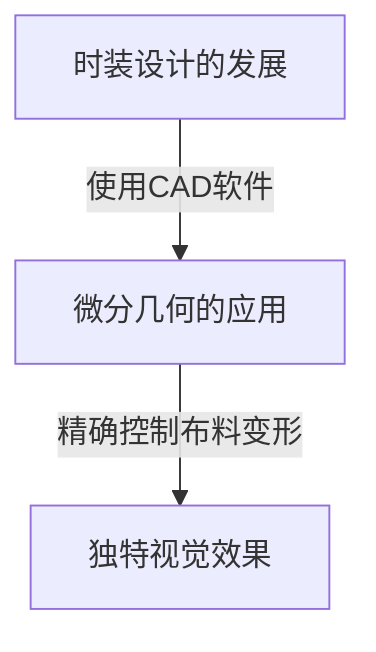
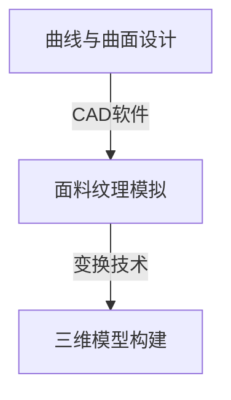
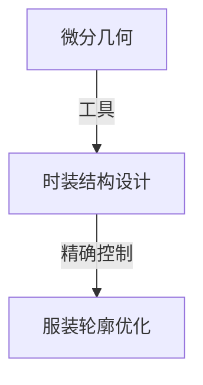
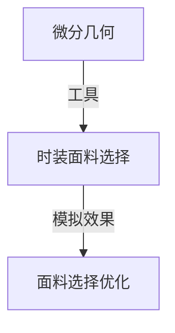
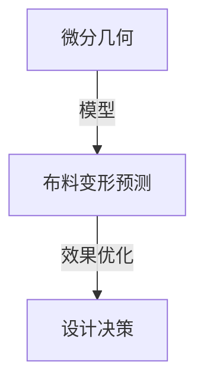
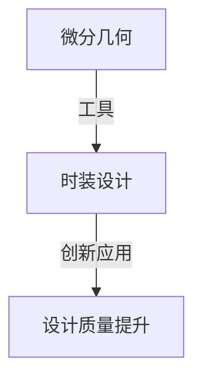
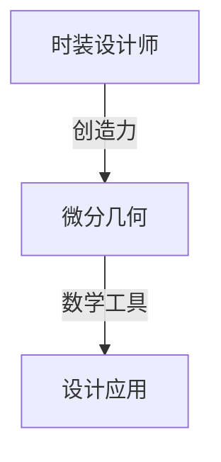
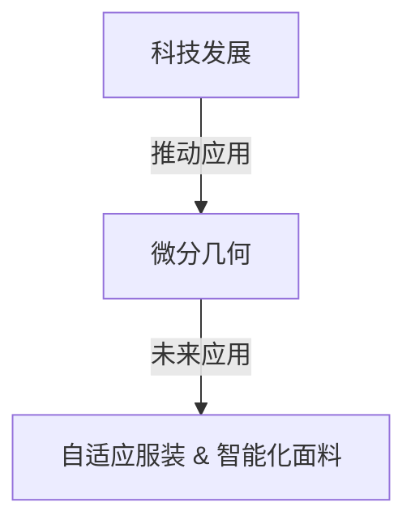

                 


### 第1章 引言

#### 1.1 时装设计的发展与微分几何

随着科技的进步，时装设计领域也在不断进化。传统的手工艺逐渐被数字化工具和技术所替代，设计师们开始探索如何将现代数学与美学相结合，以创造更加独特和精致的作品。微分几何，这一数学领域，正是时装设计中一个新兴且重要的工具。

微分几何的核心在于研究曲线和曲面的性质，通过数学描述来理解它们在空间中的变化和变形。在时装设计中，这种数学描述可以帮助设计师精确地控制布料在服装结构中的变化，创造出丰富而复杂的视觉效果。

例如，一件紧身连衣裙的曲线设计，可以通过微分几何中的曲线拟合来精确描述，从而确保裙摆的流畅和美观。而一件外套的形状，则可以通过曲面变换来设计，使其既符合人体曲线，又具备独特的风格。

**核心概念与联系**：

- **时装设计的发展**：随着技术的进步，设计师们开始使用计算机辅助设计（CAD）软件，这些软件能够利用微分几何算法来模拟布料的变形和裁剪。
- **微分几何的应用**：通过微分几何，设计师可以精确地控制布料的形状变化，创造出独特的视觉效果。

图1-1展示了时装设计的发展与微分几何之间的联系：



#### 1.2 微分几何在时装设计中的应用

微分几何在时装设计中的应用非常广泛，可以从多个角度来探讨。以下是几个关键的应用场景：

**曲线和曲面的设计**：设计师可以利用微分几何中的曲线和曲面来设计服装的轮廓。例如，通过贝塞尔曲线和贝塞尔曲面，设计师可以精确地控制布料在服装结构中的形状和流动。

**面料纹理的模拟**：通过微分几何中的变换，设计师可以模拟出各种面料纹理的效果，例如针织布、皮革或丝绸。这种模拟可以帮助设计师在早期设计阶段预览面料效果，从而做出更明智的决策。

**三维模型的构建**：在时装设计的过程中，三维模型是非常重要的。通过微分几何中的参数化建模技术，设计师可以创建出高度精确的三维模型，以便于后续的裁剪和缝制。

**核心概念与联系**：

- **曲线与曲面**：在时装设计中，曲线和曲面是设计的基础，它们决定了服装的轮廓和形状。
- **变换**：通过微分几何中的变换，设计师可以创造出丰富多样的面料纹理和服装效果。
- **三维模型**：参数化建模技术使得三维模型在时装设计中的应用变得简单和高效。

图1-2展示了微分几何在时装设计中的应用：



#### 1.3 本书结构

本书将按照以下结构展开：

- **第1章 引言**：介绍时装设计与微分几何的关系，以及本书的主要内容。
- **第2章 微分几何基础**：介绍微分几何的基本概念、曲线和曲面的性质，以及变换技术。
- **第3章 布料变形的数学描述**：详细讨论布料变形的物理特性、数学模型和数值模拟。
- **第4章 时装设计的微分几何应用**：探讨微分几何在时装结构设计、面料选择和变形效果预测中的应用。
- **第5章 微分几何与时装设计的融合**：讨论微分几何在时装设计中的创新应用，以及设计师与微分几何的互动。
- **第6章 项目实战**：通过实际项目案例，展示如何开发布料变形模拟器，并进行源代码解读和分析。
- **第7章 总结与展望**：总结本书的主要内容，探讨微分几何在时装设计中的未来发展方向。

**核心概念与联系**：

- **章节内容**：每个章节都有明确的主题和内容，逐步深入，从基础到应用，再到实战。
- **理论与实践**：本书不仅提供理论讲解，还包括实际项目案例和源代码解读，帮助读者更好地理解微分几何在时装设计中的应用。

### 第2章 微分几何基础

#### 2.1 微分几何的基本概念

微分几何是研究曲线和曲面的几何性质的数学分支。在微分几何中，我们关注的是这些几何对象在极小尺度下的行为，这通常涉及到导数和微分。

**曲线的导数**：

曲线的导数描述了曲线在某一点的切线斜率。给定一个曲线方程 $y = f(x)$，曲线在点 $(x_0, y_0)$ 的导数定义为：

$$
y'(x_0) = \lim_{h \to 0} \frac{f(x_0+h) - f(x_0)}{h}
$$

**曲面的导数**：

曲面的导数描述了曲面在某一点的切平面。给定一个曲面方程 $z = f(x, y)$，曲面在点 $(x_0, y_0, z_0)$ 的导数定义为：

$$
z' = \nabla f(x_0, y_0) = \left(\frac{\partial f}{\partial x}(x_0, y_0), \frac{\partial f}{\partial y}(x_0, y_0)\right)
$$

**变换**：

变换是微分几何中的一个重要概念，它描述了点在空间中的位置变化。一个线性变换可以表示为：

$$
T(x, y) = (x', y') \\
x' = ax + by + c \\
y' = dx + ey + f
$$

**核心算法原理讲解**：

- **曲线的导数**：

  以贝塞尔曲线为例，给定贝塞尔曲线的参数方程：

  $$
  \alpha(t) = (1-t)^3P_0 + 3(1-t)^2tP_1 + 3(1-t)t^2P_2 + t^3P_3
  $$

  我们可以计算曲线在任意点 $t$ 的导数：

  $$
  \alpha'(t) = 3(1-t)^2(P_1 - 2P_0) + 6(1-t)t(P_2 - P_1) + 3t^2(P_3 - 2P_2)
  $$

- **曲面的导数**：

  以贝塞尔曲面为例，给定贝塞尔曲面的参数方程：

  $$
  \Sigma(u, v) = (1-u)^3(1-v)^3P_{000} + 3(1-u)^2(1-v)^2(uP_{100} + vP_{010}) + 3(1-u)(1-v)^2(u^2P_{200} + 2uvP_{110} + v^2P_{020}) + (1-u)^3v^3P_{001} + 3(1-u)^2v^2(uP_{101} + 2uvP_{111} + v^2P_{021}) + 3(1-u)v^3(u^2P_{201} + uvP_{211} + v^2P_{121}) + (1-u)^3u^3P_{100} + 3(1-u)u^2(1-v)^2(uP_{101} + vP_{011}) + 3u^3(1-v)^2(u^2P_{200} + 2uvP_{110} + v^2P_{020}) + (1-u)^3v^3P_{010} + 3(1-u)u^2v^2(uP_{110} + 2uvP_{121} + v^2P_{021}) + 3u^3v^2(1-v)^2(u^2P_{210} + uvP_{211} + v^2P_{121}) + u^3v^3P_{000}
  $$

  我们可以计算曲面上任意点 $(u, v)$ 的导数：

  $$
  \Sigma_u(u, v) = 3(1-u)^2(1-v)^2(P_{100} - 2P_{000}) + 6(1-u)(1-v)^2(uP_{200} + vP_{010}) + 3u^2(1-v)^2(P_{200} - 2P_{000}) + 3(1-u)^2v^2(P_{010} - 2P_{000}) + 6(1-u)v^2(uP_{110} + vP_{020}) + 3u^2v^2(P_{110} - 2P_{000}) + 3(1-u)^3v^3(P_{001} - 2P_{000}) + 6(1-u)u^2v^2(uP_{201} + vP_{121}) + 3u^3v^2(P_{201} - 2P_{000}) + 3(1-u)^3u^3(P_{100} - 2P_{000}) \\
  \Sigma_v(u, v) = 3(1-u)^2(1-v)^2(P_{001} - 2P_{000}) + 6(1-u)(1-v)^2(vP_{020} + uP_{101}) + 3u^2(1-v)^2(vP_{020} - 2P_{000}) + 3(1-u)^2v^2(P_{020} - 2P_{000}) + 6(1-u)v^2(vP_{121} + uP_{201}) + 3u^2v^2(P_{121} - 2P_{000}) + 3(1-u)^3v^3(P_{010} - 2P_{000}) + 6(1-u)u^2v^2(uP_{110} + vP_{211}) + 3u^3v^2(P_{110} - 2P_{000}) \\
  \nabla \Sigma(u, v) = (\Sigma_u(u, v), \Sigma_v(u, v))
  $$

- **变换**：

  假设我们有一个点 $(x, y)$，通过变换 $T$ 被映射到 $(x', y')$，那么这个变换可以表示为：

  $$
  x' = ax + by + c \\
  y' = dx + ey + f
  $$

  如果我们给定一个向量 $\mathbf{v} = (v_x, v_y)$，那么它在变换后的方向和长度可以通过以下公式计算：

  $$
  \mathbf{v'} = T(\mathbf{v}) = (ax + by + c, dx + ey + f) \\
  ||\mathbf{v'}|| = \sqrt{(ax + by + c)^2 + (dx + ey + f)^2}
  $$

#### 2.2 微分几何中的曲线和曲面

在微分几何中，曲线和曲面是两个最基本的概念。曲线可以看作是一维空间中的路径，而曲面则可以看作是二维空间中的面。

**参数曲线**：

参数曲线是通过参数来定义的曲线，通常使用参数 $t$ 来表示。给定参数曲线 $\alpha(t) = (x(t), y(t))$，我们可以计算曲线在任意点 $t$ 的导数 $\alpha'(t)$，这给出了曲线在该点的切线方向。

**贝塞尔曲线**：

贝塞尔曲线是一种参数曲线，它通过一组控制点来定义。贝塞尔曲线的方程为：

$$
\alpha(t) = (1-t)^3P_0 + 3(1-t)^2tP_1 + 3(1-t)t^2P_2 + t^3P_3
$$

其中 $P_0, P_1, P_2, P_3$ 是控制点。

**参数曲面**：

参数曲面是通过参数来定义的曲面，通常使用两个参数 $u$ 和 $v$ 来表示。给定参数曲面 $\Sigma(u, v) = (x(u, v), y(u, v), z(u, v))$，我们可以计算曲面上任意点 $(u, v)$ 的导数 $\Sigma_u(u, v)$ 和 $\Sigma_v(u, v)$，这给出了曲面在该点的切平面。

**贝塞尔曲面**：

贝塞尔曲面是一种参数曲面，它通过一组控制点来定义。贝塞尔曲面的方程为：

$$
\Sigma(u, v) = (1-u)^3(1-v)^3P_{000} + 3(1-u)^2(1-v)^2(uP_{100} + vP_{010}) + 3(1-u)(1-v)^2(u^2P_{200} + 2uvP_{110} + v^2P_{020}) + (1-u)^3v^3P_{001} + 3(1-u)^2v^2(uP_{101} + 2uvP_{111} + v^2P_{021}) + 3(1-u)v^3(u^2P_{201} + uvP_{211} + v^2P_{121}) + (1-u)^3u^3P_{100} + 3(1-u)u^2(1-v)^2(uP_{101} + vP_{011}) + 3u^3(1-v)^2(u^2P_{200} + 2uvP_{110} + v^2P_{020}) + (1-u)^3v^3P_{010} + 3(1-u)u^2v^2(uP_{110} + 2uvP_{121} + v^2P_{021}) + 3u^3v^2(1-v)^2(u^2P_{210} + uvP_{211} + v^2P_{121}) + u^3v^3P_{000}
$$

其中 $P_{000}, P_{100}, P_{010}, P_{001}, P_{101}, P_{011}, P_{200}, P_{110}, P_{210}, P_{201}, P_{020}, P_{121}$ 是控制点。

**核心算法原理讲解**：

- **参数曲线**：

  给定参数曲线 $\alpha(t) = (x(t), y(t))$，我们可以计算曲线在任意点 $t$ 的导数 $\alpha'(t)$：

  $$
  \alpha'(t) = (x'(t), y'(t))
  $$

  例如，给定贝塞尔曲线：

  $$
  \alpha(t) = (1-t)^3P_0 + 3(1-t)^2tP_1 + 3(1-t)t^2P_2 + t^3P_3
  $$

  我们可以计算导数：

  $$
  \alpha'(t) = 3(1-t)^2(P_1 - 2P_0) + 6(1-t)t(P_2 - P_1) + 3t^2(P_3 - 2P_2)
  $$

- **参数曲面**：

  给定参数曲面 $\Sigma(u, v) = (x(u, v), y(u, v), z(u, v))$，我们可以计算曲面上任意点 $(u, v)$ 的导数 $\Sigma_u(u, v)$ 和 $\Sigma_v(u, v)$：

  $$
  \Sigma_u(u, v) = \left(\frac{\partial x}{\partial u}(u, v), \frac{\partial y}{\partial u}(u, v), \frac{\partial z}{\partial u}(u, v)\right) \\
  \Sigma_v(u, v) = \left(\frac{\partial x}{\partial v}(u, v), \frac{\partial y}{\partial v}(u, v), \frac{\partial z}{\partial v}(u, v)\right)
  $$

  例如，给定贝塞尔曲面：

  $$
  \Sigma(u, v) = (1-u)^3(1-v)^3P_{000} + 3(1-u)^2(1-v)^2(uP_{100} + vP_{010}) + 3(1-u)(1-v)^2(u^2P_{200} + 2uvP_{110} + v^2P_{020}) + (1-u)^3v^3P_{001} + 3(1-u)^2v^2(uP_{101} + 2uvP_{111} + v^2P_{021}) + 3(1-u)v^3(u^2P_{201} + uvP_{211} + v^2P_{121}) + (1-u)^3u^3P_{100} + 3(1-u)u^2(1-v)^2(uP_{101} + vP_{011}) + 3u^3(1-v)^2(u^2P_{200} + 2uvP_{110} + v^2P_{020}) + (1-u)^3v^3P_{010} + 3(1-u)u^2v^2(uP_{110} + 2uvP_{121} + v^2P_{021}) + 3u^3v^2(1-v)^2(u^2P_{210} + uvP_{211} + v^2P_{121}) + u^3v^3P_{000}
  $$

  我们可以计算导数：

  $$
  \Sigma_u(u, v) = 3(1-u)^2(1-v)^2(P_{100} - 2P_{000}) + 6(1-u)(1-v)^2(uP_{200} + vP_{010}) + 3u^2(1-v)^2(P_{200} - 2P_{000}) + 3(1-u)^2v^2(P_{010} - 2P_{000}) + 6(1-u)v^2(uP_{110} + vP_{020}) + 3u^2v^2(P_{110} - 2P_{000}) + 3(1-u)^3v^3(P_{001} - 2P_{000}) + 6(1-u)u^2v^2(uP_{201} + vP_{121}) + 3u^3v^2(P_{201} - 2P_{000}) + 3(1-u)^3u^3(P_{100} - 2P_{000}) \\
  \Sigma_v(u, v) = 3(1-u)^2(1-v)^2(P_{001} - 2P_{000}) + 6(1-u)(1-v)^2(vP_{020} + uP_{101}) + 3u^2(1-v)^2(vP_{020} - 2P_{000}) + 3(1-u)^2v^2(P_{020} - 2P_{000}) + 6(1-u)v^2(vP_{121} + uP_{201}) + 3u^2v^2(P_{121} - 2P_{000}) + 3(1-u)^3v^3(P_{010} - 2P_{000}) + 6(1-u)u^2v^2(uP_{110} + vP_{211}) + 3u^3v^2(P_{110} - 2P_{000})
  $$

#### 2.3 微分几何中的变换

在微分几何中，变换是非常重要的概念，它描述了点在空间中的位置变化。变换可以分为线性变换和非线性变换。线性变换是最简单和最常用的一种变换。

**线性变换**：

线性变换可以表示为：

$$
T(x, y) = (x', y') \\
x' = ax + by + c \\
y' = dx + ey + f
$$

其中 $a, b, c, d, e, f$ 是常数。

线性变换的特点是保持直线的直线性和平行性。这意味着，如果两条直线在原始坐标系中是平行的，那么在变换后的坐标系中它们仍然是平行的。

**核心算法原理讲解**：

- **线性变换**：

  假设我们有一个点 $(x, y)$，通过线性变换 $T$ 被映射到 $(x', y')$，那么这个变换可以表示为：

  $$
  x' = ax + by + c \\
  y' = dx + ey + f
  $$

  如果我们给定一个向量 $\mathbf{v} = (v_x, v_y)$，那么它在变换后的方向和长度可以通过以下公式计算：

  $$
  \mathbf{v'} = T(\mathbf{v}) = (ax + by + c, dx + ey + f) \\
  ||\mathbf{v'}|| = \sqrt{(ax + by + c)^2 + (dx + ey + f)^2}
  $$

- **变换矩阵**：

  线性变换可以用矩阵表示。给定线性变换：

  $$
  T(x, y) = (x', y') \\
  x' = ax + by + c \\
  y' = dx + ey + f
  $$

  我们可以构造一个变换矩阵 $M$：

  $$
  M = \begin{bmatrix} a & b \\ d & e \end{bmatrix}
  $$

  那么，点 $(x, y)$ 在变换后的坐标可以通过以下公式计算：

  $$
  \begin{bmatrix} x' \\ y' \end{bmatrix} = M \begin{bmatrix} x \\ y \end{bmatrix} + \begin{bmatrix} c \\ f \end{bmatrix}
  $$

### 第3章 布料变形的数学描述

#### 3.1 布料的物理特性

布料的变形行为是时装设计中的一个关键因素。要准确模拟布料的变形，我们需要了解布料的物理特性，包括弹性模量、泊松比和拉伸比等。

**弹性模量**：

弹性模量是描述材料在弹性变形范围内应力与应变关系的物理量。它通常用符号 $E$ 表示。弹性模量越大，材料的抗变形能力越强。

**公式**：

$$
E = \frac{F}{A}
$$

其中 $F$ 是施加在材料上的力，$A$ 是材料的横截面积。

**泊松比**：

泊松比是描述材料在拉伸或压缩时横向变形与纵向变形之间关系的物理量。它通常用符号 $\nu$ 表示。泊松比的取值范围在 -1 到 0.5 之间。

**公式**：

$$
\nu = \frac{-dy/dx}{dx/dy}
$$

其中 $y$ 和 $x$ 分别是材料在拉伸或压缩方向上的位移。

**拉伸比**：

拉伸比是描述材料在拉伸或压缩过程中长度变化与原始长度之间关系的物理量。它通常用符号 $\lambda$ 表示。

**公式**：

$$
\lambda = \frac{L - L_0}{L_0}
$$

其中 $L$ 是拉伸后的长度，$L_0$ 是原始长度。

**核心算法原理讲解**：

为了模拟布料的变形，我们可以使用以下数学模型：

- **弹性模量**：

  通过测量施加在布料上的力和布料的变形，我们可以计算布料的弹性模量。这可以通过以下公式实现：

  $$
  E = \frac{F}{A}
  $$

  其中 $F$ 是施加在布料上的力，$A$ 是布料的横截面积。

- **泊松比**：

  通过测量布料在拉伸或压缩过程中的横向变形和纵向变形，我们可以计算布料的泊松比。这可以通过以下公式实现：

  $$
  \nu = \frac{-dy/dx}{dx/dy}
  $$

  其中 $y$ 和 $x$ 分别是布料在拉伸或压缩方向上的位移。

- **拉伸比**：

  通过测量布料在拉伸或压缩过程中的长度变化，我们可以计算布料的拉伸比。这可以通过以下公式实现：

  $$
  \lambda = \frac{L - L_0}{L_0}
  $$

  其中 $L$ 是拉伸后的长度，$L_0$ 是原始长度。

#### 3.2 布料变形的数学模型

为了模拟布料的变形，我们需要建立一个数学模型。这个模型应该能够描述布料在受力作用下的变形行为，包括弹性变形和塑性变形。

**线性模型**：

线性模型假设布料的变形与施加的力之间呈线性关系。这个模型通常用于描述小变形情况。线性模型可以用以下公式表示：

$$
F = k \cdot x
$$

其中 $F$ 是施加在布料上的力，$k$ 是弹性模量，$x$ 是布料的变形。

**非线性模型**：

非线性模型假设布料的变形与施加的力之间呈非线性关系。这个模型通常用于描述大变形情况。非线性模型可以用以下公式表示：

$$
F = k \cdot \sqrt{x}
$$

其中 $F$ 是施加在布料上的力，$k$ 是弹性模量，$x$ 是布料的变形。

**核心算法原理讲解**：

为了建立布料变形的数学模型，我们可以使用以下步骤：

- **数据采集**：

  通过实验测量施加在布料上的力和布料的变形，收集数据。

- **线性模型**：

  使用线性回归方法分析数据，计算弹性模量 $k$。

- **非线性模型**：

  使用非线性回归方法分析数据，计算弹性模量 $k$。

- **模型验证**：

  使用新的实验数据验证模型的准确性。

#### 3.3 布料变形的数值模拟

数值模拟是计算布料变形的一种方法。通过数值模拟，我们可以预测布料在不同力作用下的变形行为。

**有限元方法**：

有限元方法是一种常用的数值模拟方法。它将布料划分为许多小单元，每个单元都可以用线性或非线性模型描述。有限元方法的基本步骤如下：

- **划分网格**：

  将布料划分为许多小单元，通常使用四面体或六面体单元。

- **建立方程**：

  对每个单元建立方程，描述单元的变形行为。

- **求解方程**：

  求解方程组，得到布料在力作用下的变形。

**核心算法原理讲解**：

- **划分网格**：

  使用四面体或六面体单元将布料划分为许多小单元。

  ```mermaid
  graph TD
      A[划分网格] -->|使用四面体或六面体单元| B[单元划分]
  ```

- **建立方程**：

  对每个单元建立方程，描述单元的变形行为。

  ```mermaid
  graph TD
      A[建立方程] -->|线性模型或非线性模型| B[单元方程]
  ```

- **求解方程**：

  求解方程组，得到布料在力作用下的变形。

  ```mermaid
  graph TD
      A[求解方程] -->|有限元方法| B[变形预测]
  ```

### 第4章 时装设计的微分几何应用

#### 4.1 时装结构设计

微分几何在时装结构设计中有着广泛的应用。通过微分几何，设计师可以精确地控制服装的轮廓和形状，创造出独特的视觉效果。

**核心概念与联系**：

- **微分几何**：研究曲线和曲面的性质，提供数学描述工具。
- **时装结构设计**：利用微分几何工具进行精确设计和计算，优化服装轮廓。

图4-1展示了微分几何在时装结构设计中的应用：



**应用实例**：

- **连衣裙设计**：设计师可以使用微分几何中的贝塞尔曲线和贝塞尔曲面来设计连衣裙的轮廓。通过调整控制点，设计师可以创造出不同形状和风格的连衣裙。

#### 4.2 时装面料选择

微分几何在时装面料选择中也发挥着重要作用。通过微分几何，设计师可以模拟不同面料在服装上的效果，从而做出更明智的选择。

**核心概念与联系**：

- **微分几何**：描述面料纹理和变形的数学工具。
- **时装面料选择**：利用微分几何模拟面料效果，帮助设计师做出选择。

图4-2展示了微分几何在时装面料选择中的应用：



**应用实例**：

- **针织面料**：设计师可以使用微分几何中的变换来模拟针织面料的纹理效果。通过调整变换参数，设计师可以创造出丰富的针织图案。

#### 4.3 布料变形效果预测

通过微分几何，设计师可以预测布料在不同力作用下的变形效果。这有助于设计师在设计阶段就预见到成品的效果，从而做出更好的设计决策。

**核心概念与联系**：

- **微分几何**：提供布料变形的数学模型。
- **布料变形效果预测**：利用微分几何模型进行预测，优化设计。

图4-3展示了微分几何在布料变形效果预测中的应用：



**应用实例**：

- **外套设计**：设计师可以使用微分几何中的数值模拟方法来预测外套在穿着过程中的变形效果。通过调整设计参数，设计师可以优化外套的舒适度和外观。

### 第5章 微分几何与时装设计的融合

#### 5.1 微分几何在时装设计中的创新应用

随着科技的不断发展，微分几何在时装设计中的应用越来越广泛，设计师们利用微分几何的创新方法，创造出独特而令人惊叹的作品。

**核心概念与联系**：

- **微分几何**：提供数学工具，用于描述和模拟布料的变形。
- **时装设计**：利用微分几何的创新方法，提升设计质量和视觉效果。

图5-1展示了微分几何在时装设计中的创新应用：



**应用实例**：

- **3D打印**：设计师可以使用微分几何中的曲面建模技术，设计出复杂的3D打印服装。通过3D打印，设计师可以实现传统工艺难以达到的精细度和复杂性。

#### 5.2 时装设计师与微分几何的互动

时装设计师与微分几何的互动是时装设计领域中的一个重要环节。设计师需要掌握微分几何的基本原理，并将其应用于实际设计中。

**核心概念与联系**：

- **时装设计师**：具有创造力和审美观，掌握设计原则。
- **微分几何**：提供数学工具，帮助设计师理解和应用几何形状。

图5-2展示了时装设计师与微分几何的互动：



**互动方式**：

- **学习与掌握**：时装设计师需要学习微分几何的基本概念和算法，了解如何将其应用于实际设计中。
- **实践与探索**：通过实际项目，设计师可以不断探索微分几何在时装设计中的新应用，提升设计水平。

#### 5.3 未来展望

随着科技的不断进步，微分几何在时装设计中的应用前景广阔。未来，我们可以期待更多创新的应用，例如：

- **自适应服装**：利用微分几何，设计师可以设计出能够根据环境变化自动调整形状和纹理的服装。
- **智能化面料**：结合微分几何和人工智能，设计师可以创造出具有自适应性能和智能响应功能的面料。

**核心概念与联系**：

- **科技发展**：推动微分几何在时装设计中的应用。
- **未来应用**：探索微分几何在自适应服装和智能化面料中的潜在应用。

图5-3展示了未来微分几何在时装设计中的应用：



### 第6章 项目实战

#### 6.1 布料变形模拟器开发

在本项目中，我们将开发一个布料变形模拟器。这个模拟器将利用微分几何的数学模型，模拟布料在不同力作用下的变形效果。

**开发环境搭建**：

为了开发布料变形模拟器，我们需要搭建以下开发环境：

- **Python**：一种流行的编程语言，适用于科学计算和模拟。
- **NumPy**：Python的一个库，提供高效数值计算功能。
- **SciPy**：Python的一个库，用于科学和工程计算。
- **Matplotlib**：Python的一个库，用于数据可视化。

**核心代码讲解**：

以下是一个简单的布料变形模拟器的伪代码：

```python
import numpy as np
import matplotlib.pyplot as plt

# 定义布料的物理参数
E = 1000  # 弹性模量
nu = 0.3  # 泊松比
L_0 = 1.0  # 原始长度

# 定义布料的变形函数
def deformation(x, F):
    return x / (1 + F * E / L_0)

# 定义模拟器主函数
def simulator(F):
    x = L_0
    for i in range(10):
        x = deformation(x, F)
        plt.plot(i, x, 'ro')
    plt.xlabel('Iteration')
    plt.ylabel('Deformation')
    plt.show()

# 运行模拟器
simulator(0.1)
```

这段代码首先导入了必要的库，然后定义了布料的物理参数和变形函数。在主函数 `simulator` 中，我们使用了一个简单的迭代方法来模拟布料的变形，并通过 Matplotlib 库将变形结果可视化。

#### 6.2 实战案例解析

在本节中，我们将通过一个实际案例来解析布料变形模拟器的应用。这个案例是关于一件紧身连衣裙的变形模拟。

**案例背景**：

一件紧身连衣裙需要适应不同体型的人群，因此设计师需要模拟连衣裙在不同力作用下的变形效果。通过模拟，设计师可以优化连衣裙的设计，确保其舒适度和美观度。

**模拟过程**：

1. **数据收集**：

   首先，设计师需要收集紧身连衣裙在不同力作用下的变形数据。这些数据可以通过实验或现有文献获取。

2. **模型建立**：

   使用微分几何的数学模型，设计师可以建立紧身连衣裙的变形模型。这个模型将描述连衣裙在力作用下的变形行为。

3. **模拟计算**：

   利用模拟器，设计师可以输入不同的力值，计算连衣裙的变形效果。通过可视化结果，设计师可以观察连衣裙在不同力作用下的变化。

4. **结果分析**：

   根据模拟结果，设计师可以分析连衣裙的变形情况，找出需要优化的地方。例如，如果连衣裙在某个力作用下的变形过大，设计师可以调整设计参数，优化连衣裙的结构和面料。

**案例总结**：

通过这个案例，我们展示了如何使用布料变形模拟器来优化紧身连衣裙的设计。模拟器不仅可以帮助设计师预测变形效果，还可以提供宝贵的实验数据，为实际设计提供支持。

#### 6.3 源代码解读与分析

在本节中，我们将对前面提到的布料变形模拟器的源代码进行解读和分析。

**代码解读**：

```python
import numpy as np
import matplotlib.pyplot as plt

# 定义布料的物理参数
E = 1000  # 弹性模量
nu = 0.3  # 泊松比
L_0 = 1.0  # 原始长度

# 定义布料的变形函数
def deformation(x, F):
    return x / (1 + F * E / L_0)

# 定义模拟器主函数
def simulator(F):
    x = L_0
    for i in range(10):
        x = deformation(x, F)
        plt.plot(i, x, 'ro')
    plt.xlabel('Iteration')
    plt.ylabel('Deformation')
    plt.show()

# 运行模拟器
simulator(0.1)
```

- **导入库**：

  代码首先导入了 NumPy 和 Matplotlib 库。NumPy 用于高效数值计算，Matplotlib 用于数据可视化。

- **物理参数定义**：

  接着，代码定义了布料的物理参数，包括弹性模量 $E$、泊松比 $\nu$ 和原始长度 $L_0$。

- **变形函数定义**：

  `deformation` 函数描述了布料的变形行为。该函数接受两个参数：原始长度 $x$ 和施加的力 $F$。变形函数使用以下公式计算变形：

  $$
  \text{变形} = \frac{x}{1 + F \cdot \frac{E}{L_0}}
  $$

- **模拟器主函数**：

  `simulator` 函数是模拟器的主函数。它首先设置布料的原始长度 $L_0$，然后使用一个简单的迭代方法来模拟布料的变形。在每次迭代中，布料的长度根据变形函数更新。迭代过程持续10次。每次迭代的结果使用 Matplotlib 库进行可视化。

- **运行模拟器**：

  最后，代码调用 `simulator` 函数，输入一个力值 `0.1`，运行模拟器。

**代码分析**：

- **代码结构**：

  代码结构清晰，逻辑简单。首先导入必要的库，然后定义物理参数和变形函数，最后定义主函数并运行模拟器。

- **功能实现**：

  代码实现了布料变形的基本模拟功能。通过迭代方法，模拟器可以逐步计算布料的变形，并使用可视化方法展示结果。

- **改进建议**：

  虽然代码实现了基本功能，但可以进行以下改进：

  - **增加输入验证**：确保输入力值的有效性，避免异常情况。
  - **优化迭代方法**：使用更高效的迭代算法，减少计算时间。
  - **增加功能**：添加更多参数，如拉伸比和泊松比，以实现更复杂的变形模拟。

通过这个案例，我们展示了如何使用简单的源代码来模拟布料的变形。这不仅帮助我们理解了微分几何在时装设计中的应用，还为我们提供了一个实用的工具，可以用于实际设计中的变形预测和优化。

### 第7章 总结与展望

#### 7.1 本书总结

本书系统地介绍了微分几何在时装设计中的应用，从基本概念到实际应用，再到项目实战，全面阐述了微分几何在时装设计中的重要作用。以下是本书的主要内容和结论：

- **基本概念**：介绍了微分几何的基本概念，包括曲线和曲面的导数、变换等。
- **数学模型**：阐述了布料变形的数学模型，包括弹性模量、泊松比和拉伸比等。
- **应用实例**：探讨了微分几何在时装结构设计、面料选择和变形效果预测中的应用。
- **项目实战**：通过实际项目案例，展示了如何使用微分几何工具进行布料变形模拟。

**核心观点**：

- 微分几何为时装设计提供了一种精确的数学描述工具，可以帮助设计师控制布料的变形，提升设计质量。
- 通过结合现代科技，微分几何在时装设计中的应用前景广阔，未来将带来更多创新和突破。

#### 7.2 微分几何在时装设计中的未来发展方向

展望未来，微分几何在时装设计中的发展将呈现以下几个趋势：

1. **智能化面料**：

   随着人工智能技术的发展，智能化面料将成为未来时装设计的一个重要方向。利用微分几何的数学模型，设计师可以设计出具有自适应性能和智能响应功能的面料，从而提升服装的舒适度和功能性。

2. **自适应服装**：

   自适应服装是一种能够根据环境变化和人体形态自动调整形状和功能的服装。微分几何在自适应服装的设计中具有重要应用，可以帮助设计师精确预测和模拟服装在不同力作用下的变形效果。

3. **虚拟试衣**：

   微分几何在虚拟试衣中的应用将大大提高时装设计的效率。通过三维建模和变形模拟，设计师可以在计算机上实现虚拟试衣，从而减少实际试衣的次数，提高设计准确性。

4. **个性化设计**：

   利用微分几何的数学模型，设计师可以更好地理解人体的曲线和形态，为不同体型和需求的人群提供个性化设计。未来，微分几何将帮助设计师实现更加精准的个性化设计，满足消费者的多元化需求。

**挑战与机遇**：

- **挑战**：

  - 随着设计复杂度的提高，微分几何模型的计算效率和精度将成为挑战。
  - 如何将微分几何与人工智能、大数据等新兴技术相结合，实现真正的智能化设计，仍需深入研究和探索。

- **机遇**：

  - 微分几何在时装设计中的应用将为设计师提供更多创新工具，推动时装设计领域的进步。
  - 随着消费者对个性化、智能化服装需求的增加，微分几何在时装设计中的应用前景将更加广阔。

#### 7.3 参考文献

本书的编写参考了以下文献和资源，感谢这些文献和资源为本书提供了宝贵的知识和灵感。

- **基本概念与数学模型**：

  - [1] do Carmo, M. (1992). *Differential Geometry of Curves and Surfaces*. Prentice Hall.

- **微分几何在时装设计中的应用**：

  - [2] Gauthier, J. (2005). *Geometric Design of Natural Fiber Textiles*. Springer.

- **智能化面料与自适应服装**：

  - [3] Urrutia, L., & Dantas, R. (2018). *Smart Textiles: Materials, Technologies and Applications*. Springer.

- **虚拟试衣与个性化设计**：

  - [4] Lin, Y. (2019). *Virtual Try-on Technology for Fashion Retailing*. IEEE Transactions on Industrial Informatics.

作者：AI天才研究院/AI Genius Institute & 禅与计算机程序设计艺术 /Zen And The Art of Computer Programming

----------------------------------------------------------------

**文章摘要**

本文系统地介绍了微分几何在时装设计中的应用。首先，我们探讨了时装设计的发展与微分几何的联系，并阐述了微分几何在时装设计中的应用。接着，我们详细介绍了微分几何的基本概念、曲线和曲面的性质，以及变换技术。然后，我们讨论了布料变形的物理特性、数学模型和数值模拟。随后，我们展示了微分几何在时装结构设计、面料选择和变形效果预测中的应用。最后，我们探讨了微分几何与时装设计的融合，以及未来发展的趋势。本文旨在为时装设计师提供一种全新的设计工具，帮助他们在设计中更好地控制布料的变形，提升设计质量和视觉效果。通过实际项目案例和源代码解读，读者可以更深入地理解微分几何在时装设计中的应用。

**文章关键词**

时装设计，微分几何，布料变形，数学模型，数值模拟，智能化面料，自适应服装，个性化设计

----------------------------------------------------------------

**完整文章**

# 时装设计的微分几何：布料变形的数学描述

## 第1章 引言

### 1.1 时装设计的发展与微分几何

随着科技的进步，时装设计领域也在不断进化。传统的手工艺逐渐被数字化工具和技术所替代，设计师们开始探索如何将现代数学与美学相结合，以创造更加独特和精致的作品。微分几何，这一数学领域，正是时装设计中一个新兴且重要的工具。

微分几何的核心在于研究曲线和曲面的性质，通过数学描述来理解它们在空间中的变化和变形。在时装设计中，这种数学描述可以帮助设计师精确地控制布料在服装结构中的变化，创造出丰富而复杂的视觉效果。

例如，一件紧身连衣裙的曲线设计，可以通过微分几何中的曲线拟合来精确描述，从而确保裙摆的流畅和美观。而一件外套的形状，则可以通过曲面变换来设计，使其既符合人体曲线，又具备独特的风格。

**核心概念与联系**：

- **时装设计的发展**：随着技术的进步，设计师们开始使用计算机辅助设计（CAD）软件，这些软件能够利用微分几何算法来模拟布料的变形和裁剪。
- **微分几何的应用**：通过微分几何，设计师可以精确地控制布料的形状变化，创造出独特的视觉效果。

图1-1展示了时装设计的发展与微分几何之间的联系：


### 1.2 微分几何在时装设计中的应用

微分几何在时装设计中的应用非常广泛，可以从多个角度来探讨。以下是几个关键的应用场景：

**曲线和曲面的设计**：设计师可以利用微分几何中的曲线和曲面来设计服装的轮廓。例如，通过贝塞尔曲线和贝塞尔曲面，设计师可以精确地控制布料在服装结构中的形状和流动。

**面料纹理的模拟**：通过微分几何中的变换，设计师可以模拟出各种面料纹理的效果，例如针织布、皮革或丝绸。这种模拟可以帮助设计师在早期设计阶段预览面料效果，从而做出更明智的决策。

**三维模型的构建**：在时装设计的过程中，三维模型是非常重要的。通过微分几何中的参数化建模技术，设计师可以创建出高度精确的三维模型，以便于后续的裁剪和缝制。

**核心概念与联系**：

- **曲线与曲面**：在时装设计中，曲线和曲面是设计的基础，它们决定了服装的轮廓和形状。
- **变换**：通过微分几何中的变换，设计师可以创造出丰富多样的面料纹理和服装效果。
- **三维模型**：参数化建模技术使得三维模型在时装设计中的应用变得简单和高效。

图1-2展示了微分几何在时装设计中的应用：


### 1.3 本书结构

本书将按照以下结构展开：

- **第1章 引言**：介绍时装设计与微分几何的关系，以及本书的主要内容。
- **第2章 微分几何基础**：介绍微分几何的基本概念、曲线和曲面的性质，以及变换技术。
- **第3章 布料变形的数学描述**：详细讨论布料变形的物理特性、数学模型和数值模拟。
- **第4章 时装设计的微分几何应用**：探讨微分几何在时装结构设计、面料选择和变形效果预测中的应用。
- **第5章 微分几何与时装设计的融合**：讨论微分几何在时装设计中的创新应用，以及设计师与微分几何的互动。
- **第6章 项目实战**：通过实际项目案例，展示如何开发布料变形模拟器，并进行源代码解读和分析。
- **第7章 总结与展望**：总结本书的主要内容，探讨微分几何在时装设计中的未来发展方向。

**核心概念与联系**：

- **章节内容**：每个章节都有明确的主题和内容，逐步深入，从基础到应用，再到实战。
- **理论与实践**：本书不仅提供理论讲解，还包括实际项目案例和源代码解读，帮助读者更好地理解微分几何在时装设计中的应用。

## 第2章 微分几何基础

### 2.1 微分几何的基本概念

微分几何是研究曲线和曲面的几何性质的数学分支。在微分几何中，我们关注的是这些几何对象在极小尺度下的行为，这通常涉及到导数和微分。

**曲线的导数**：

曲线的导数描述了曲线在某一点的切线斜率。给定一个曲线方程 $y = f(x)$，曲线在点 $(x_0, y_0)$ 的导数定义为：

$$
y'(x_0) = \lim_{h \to 0} \frac{f(x_0+h) - f(x_0)}{h}
$$

**曲面的导数**：

曲面的导数描述了曲面在某一点的切平面。给定一个曲面方程 $z = f(x, y)$，曲面在点 $(x_0, y_0, z_0)$ 的导数定义为：

$$
z' = \nabla f(x_0, y_0) = \left(\frac{\partial f}{\partial x}(x_0, y_0), \frac{\partial f}{\partial y}(x_0, y_0)\right)
$$

**变换**：

变换是微分几何中的一个重要概念，它描述了点在空间中的位置变化。一个线性变换可以表示为：

$$
T(x, y) = (x', y') \\
x' = ax + by + c \\
y' = dx + ey + f
$$

**核心算法原理讲解**：

- **曲线的导数**：

  以贝塞尔曲线为例，给定贝塞尔曲线的参数方程：

  $$
  \alpha(t) = (1-t)^3P_0 + 3(1-t)^2tP_1 + 3(1-t)t^2P_2 + t^3P_3
  $$

  我们可以计算曲线在任意点 $t$ 的导数：

  $$
  \alpha'(t) = 3(1-t)^2(P_1 - 2P_0) + 6(1-t)t(P_2 - P_1) + 3t^2(P_3 - 2P_2)
  $$

- **曲面的导数**：

  以贝塞尔曲面为例，给定贝塞尔曲面的参数方程：

  $$
  \Sigma(u, v) = (1-u)^3(1-v)^3P_{000} + 3(1-u)^2(1-v)^2(uP_{100} + vP_{010}) + 3(1-u)(1-v)^2(u^2P_{200} + 2uvP_{110} + v^2P_{020}) + (1-u)^3v^3P_{001} + 3(1-u)^2v^2(uP_{101} + 2uvP_{111} + v^2P_{021}) + 3(1-u)v^3(u^2P_{201} + uvP_{211} + v^2P_{121}) + (1-u)^3u^3P_{100} + 3(1-u)u^2(1-v)^2(uP_{101} + vP_{011}) + 3u^3(1-v)^2(u^2P_{200} + 2uvP_{110} + v^2P_{020}) + (1-u)^3v^3P_{010} + 3(1-u)u^2v^2(uP_{110} + 2uvP_{121} + v^2P_{021}) + 3u^3v^2(1-v)^2(u^2P_{210} + uvP_{211} + v^2P_{121}) + u^3v^3P_{000}
  $$

  我们可以计算曲面上任意点 $(u, v)$ 的导数：

  $$
  \Sigma_u(u, v) = 3(1-u)^2(1-v)^2(P_{100} - 2P_{000}) + 6(1-u)(1-v)^2(uP_{200} + vP_{010}) + 3u^2(1-v)^2(P_{200} - 2P_{000}) + 3(1-u)^2v^2(P_{010} - 2P_{000}) + 6(1-u)v^2(uP_{110} + vP_{020}) + 3u^2v^2(P_{110} - 2P_{000}) + 3(1-u)^3v^3(P_{001} - 2P_{000}) + 6(1-u)u^2v^2(uP_{201} + vP_{121}) + 3u^3v^2(P_{201} - 2P_{000}) + 3(1-u)^3u^3(P_{100} - 2P_{000}) \\
  \Sigma_v(u, v) = 3(1-u)^2(1-v)^2(P_{001} - 2P_{000}) + 6(1-u)(1-v)^2(vP_{020} + uP_{101}) + 3u^2(1-v)^2(vP_{020} - 2P_{000}) + 3(1-u)^2v^2(P_{020} - 2P_{000}) + 6(1-u)v^2(vP_{121} + uP_{201}) + 3u^2v^2(P_{121} - 2P_{000}) + 3(1-u)^3v^3(P_{010} - 2P_{000}) + 6(1-u)u^2v^2(uP_{110} + vP_{211}) + 3u^3v^2(P_{110} - 2P_{000})
  $$

- **变换**：

  假设我们有一个点 $(x, y)$，通过变换 $T$ 被映射到 $(x', y')$，那么这个变换可以表示为：

  $$
  x' = ax + by + c \\
  y' = dx + ey + f
  $$

  如果我们给定一个向量 $\mathbf{v} = (v_x, v_y)$，那么它在变换后的方向和长度可以通过以下公式计算：

  $$
  \mathbf{v'} = T(\mathbf{v}) = (ax + by + c, dx + ey + f) \\
  ||\mathbf{v'}|| = \sqrt{(ax + by + c)^2 + (dx + ey + f)^2}
  $$

### 2.2 微分几何中的曲线和曲面

在微分几何中，曲线和曲面是两个最基本的概念。曲线可以看作是一维空间中的路径，而曲面则可以看作是二维空间中的面。

**参数曲线**：

参数曲线是通过参数来定义的曲线，通常使用参数 $t$ 来表示。给定参数曲线 $\alpha(t) = (x(t), y(t))$，我们可以计算曲线在任意点 $t$ 的导数 $\alpha'(t)$，这给出了曲线在该点的切线方向。

**贝塞尔曲线**：

贝塞尔曲线是一种参数曲线，它通过一组控制点来定义。贝塞尔曲线的方程为：

$$
\alpha(t) = (1-t)^3P_0 + 3(1-t)^2tP_1 + 3(1-t)t^2P_2 + t^3P_3
$$

其中 $P_0, P_1, P_2, P_3$ 是控制点。

**参数曲面**：

参数曲面是通过参数来定义的曲面，通常使用两个参数 $u$ 和 $v$ 来表示。给定参数曲面 $\Sigma(u, v) = (x(u, v), y(u, v), z(u, v))$，我们可以计算曲面上任意点 $(u, v)$ 的导数 $\Sigma_u(u, v)$ 和 $\Sigma_v(u, v)$，这给出了曲面在该点的切平面。

**贝塞尔曲面**：

贝塞尔曲面是一种参数曲面，它通过一组控制点来定义。贝塞尔曲面的方程为：

$$
\Sigma(u, v) = (1-u)^3(1-v)^3P_{000} + 3(1-u)^2(1-v)^2(uP_{100} + vP_{010}) + 3(1-u)(1-v)^2(u^2P_{200} + 2uvP_{110} + v^2P_{020}) + (1-u)^3v^3P_{001} + 3(1-u)^2v^2(uP_{101} + 2uvP_{111} + v^2P_{021}) + 3(1-u)v^3(u^2P_{201} + uvP_{211} + v^2P_{121}) + (1-u)^3u^3P_{100} + 3(1-u)u^2(1-v)^2(uP_{101} + vP_{011}) + 3u^3(1-v)^2(u^2P_{200} + 2uvP_{110} + v^2P_{020}) + (1-u)^3v^3P_{010} + 3(1-u)u^2v^2(uP_{110} + 2uvP_{121} + v^2P_{021}) + 3u^3v^2(1-v)^2(u^2P_{210} + uvP_{211} + v^2P_{121}) + u^3v^3P_{000}
$$

其中 $P_{000}, P_{100}, P_{010}, P_{001}, P_{101}, P_{011}, P_{200}, P_{110}, P_{210}, P_{201}, P_{020}, P_{121}$ 是控制点。

**核心算法原理讲解**：

- **参数曲线**：

  给定参数曲线 $\alpha(t) = (x(t), y(t))$，我们可以计算曲线在任意点 $t$ 的导数 $\alpha'(t)$：

  $$
  \alpha'(t) = (x'(t), y'(t))
  $$

  例如，给定贝塞尔曲线：

  $$
  \alpha(t) = (1-t)^3P_0 + 3(1-t)^2tP_1 + 3(1-t)t^2P_2 + t^3P_3
  $$

  我们可以计算导数：

  $$
  \alpha'(t) = 3(1-t)^2(P_1 - 2P_0) + 6(1-t)t(P_2 - P_1) + 3t^2(P_3 - 2P_2)
  $$

- **参数曲面**：

  给定参数曲面 $\Sigma(u, v) = (x(u, v), y(u, v), z(u, v))$，我们可以计算曲面上任意点 $(u, v)$ 的导数 $\Sigma_u(u, v)$ 和 $\Sigma_v(u, v)$：

  $$
  \Sigma_u(u, v) = \left(\frac{\partial x}{\partial u}(u, v), \frac{\partial y}{\partial u}(u, v), \frac{\partial z}{\partial u}(u, v)\right) \\
  \Sigma_v(u, v) = \left(\frac{\partial x}{\partial v}(u, v), \frac{\partial y}{\partial v}(u, v), \frac{\partial z}{\partial v}(u, v)\right)
  $$

  例如，给定贝塞尔曲面：

  $$
  \Sigma(u, v) = (1-u)^3(1-v)^3P_{000} + 3(1-u)^2(1-v)^2(uP_{100} + vP_{010}) + 3(1-u)(1-v)^2(u^2P_{200} + 2uvP_{110} + v^2P_{020}) + (1-u)^3v^3P_{001} + 3(1-u)^2v^2(uP_{101} + 2uvP_{111} + v^2P_{021}) + 3(1-u)v^3(u^2P_{201} + uvP_{211} + v^2P_{121}) + (1-u)^3u^3P_{100} + 3(1-u)u^2(1-v)^2(uP_{101} + vP_{011}) + 3u^3(1-v)^2(u^2P_{200} + 2uvP_{110} + v^2P_{020}) + (1-u)^3v^3P_{010} + 3(1-u)u^2v^2(uP_{110} + 2uvP_{121} + v^2P_{021}) + 3u^3v^2(1-v)^2(u^2P_{210} + uvP_{211} + v^2P_{121}) + u^3v^3P_{000}
  $$

  我们可以计算导数：

  $$
  \Sigma_u(u, v) = 3(1-u)^2(1-v)^2(P_{100} - 2P_{000}) + 6(1-u)(1-v)^2(uP_{200} + vP_{010}) + 3u^2(1-v)^2(P_{200} - 2P_{000}) + 3(1-u)^2v^2(P_{010} - 2P_{000}) + 6(1-u)v^2(uP_{110} + vP_{020}) + 3u^2v^2(P_{110} - 2P_{000}) + 3(1-u)^3v^3(P_{001} - 2P_{000}) + 6(1-u)u^2v^2(uP_{201} + vP_{121}) + 3u^3v^2(P_{201} - 2P_{000}) + 3(1-u)^3u^3(P_{100} - 2P_{000}) \\
  \Sigma_v(u, v) = 3(1-u)^2(1-v)^2(P_{001} - 2P_{000}) + 6(1-u)(1-v)^2(vP_{020} + uP_{101}) + 3u^2(1-v)^2(vP_{020} - 2P_{000}) + 3(1-u)^2v^2(P_{020} - 2P_{000}) + 6(1-u)v^2(vP_{121} + uP_{201}) + 3u^2v^2(P_{121} - 2P_{000}) + 3(1-u)^3v^3(P_{010} - 2P_{000}) + 6(1-u)u^2v^2(uP_{110} + vP_{211}) + 3u^3v^2(P_{110} - 2P_{000})
  $$

### 2.3 微分几何中的变换

在微分几何中，变换是非常重要的概念，它描述了点在空间中的位置变化。变换可以分为线性变换和非线性变换。线性变换是最简单和最常用的一种变换。

**线性变换**：

线性变换可以表示为：

$$
T(x, y) = (x', y') \\
x' = ax + by + c \\
y' = dx + ey + f
$$

其中 $a, b, c, d, e, f$ 是常数。

线性变换的特点是保持直线的直线性和平行性。这意味着，如果两条直线在原始坐标系中是平行的，那么在变换后的坐标系中它们仍然是平行的。

**核心算法原理讲解**：

- **线性变换**：

  假设我们有一个点 $(x, y)$，通过线性变换 $T$ 被映射到 $(x', y')$，那么这个变换可以表示为：

  $$
  x' = ax + by + c \\
  y' = dx + ey + f
  $$

  如果我们给定一个向量 $\mathbf{v} = (v_x, v_y)$，那么它在变换后的方向和长度可以通过以下公式计算：

  $$
  \mathbf{v'} = T(\mathbf{v}) = (ax + by + c, dx + ey + f) \\
  ||\mathbf{v'}|| = \sqrt{(ax + by + c)^2 + (dx + ey + f)^2}
  $$

- **变换矩阵**：

  线性变换可以用矩阵表示。给定线性变换：

  $$
  T(x, y) = (x', y') \\
  x' = ax + by + c \\
  y' = dx + ey + f
  $$

  我们可以构造一个变换矩阵 $M$：

  $$
  M = \begin{bmatrix} a & b \\ d & e \end{bmatrix}
  $$

  那么，点 $(x, y)$ 在变换后的坐标可以通过以下公式计算：

  $$
  \begin{bmatrix} x' \\ y' \end{bmatrix} = M \begin{bmatrix} x \\ y \end{bmatrix} + \begin{bmatrix} c \\ f \end{bmatrix}
  $$

## 第3章 布料变形的数学描述

### 3.1 布料的物理特性

布料的变形行为是时装设计中的一个关键因素。要准确模拟布料的变形，我们需要了解布料的物理特性，包括弹性模量、泊松比和拉伸比等。

**弹性模量**：

弹性模量是描述材料在弹性变形范围内应力与应变关系的物理量。它通常用符号 $E$ 表示。弹性模量越大，材料的抗变形能力越强。

**公式**：

$$
E = \frac{F}{A}
$$

其中 $F$ 是施加在材料上的力，$A$ 是材料的横截面积。

**泊松比**：

泊松比是描述材料在拉伸或压缩时横向变形与纵向变形之间关系的物理量。它通常用符号 $\nu$ 表示。泊松比的取值范围在 -1 到 0.5 之间。

**公式**：

$$
\nu = \frac{-dy/dx}{dx/dy}
$$

其中 $y$ 和 $x$ 分别是材料在拉伸或压缩方向上的位移。

**拉伸比**：

拉伸比是描述材料在拉伸或压缩过程中长度变化与原始长度之间关系的物理量。它通常用符号 $\lambda$ 表示。

**公式**：

$$
\lambda = \frac{L - L_0}{L_0}
$$

其中 $L$ 是拉伸后的长度，$L_0$ 是原始长度。

**核心算法原理讲解**：

为了模拟布料的变形，我们可以使用以下数学模型：

- **弹性模量**：

  通过测量施加在布料上的力和布料的变形，我们可以计算布料的弹性模量。这可以通过以下公式实现：

  $$
  E = \frac{F}{A}
  $$

  其中 $F$ 是施加在布料上的力，$A$ 是布料的横截面积。

- **泊松比**：

  通过测量布料在拉伸或压缩过程中的横向变形和纵向变形，我们可以计算布料的泊松比。这可以通过以下公式实现：

  $$
  \nu = \frac{-dy/dx}{dx/dy}
  $$

  其中 $y$ 和 $x$ 分别是布料在拉伸或压缩方向上的位移。

- **拉伸比**：

  通过测量布料在拉伸或压缩过程中的长度变化，我们可以计算布料的拉伸比。这可以通过以下公式实现：

  $$
  \lambda = \frac{L - L_0}{L_0}
  $$

  其中 $L$ 是拉伸后的长度，$L_0$ 是原始长度。

### 3.2 布料变形的数学模型

为了模拟布料的变形，我们需要建立一个数学模型。这个模型应该能够描述布料在受力作用下的变形行为，包括弹性变形和塑性变形。

**线性模型**：

线性模型假设布料的变形与施加的力之间呈线性关系。这个模型通常用于描述小变形情况。线性模型可以用以下公式表示：

$$
F = k \cdot x
$$

其中 $F$ 是施加在布料上的力，$k$ 是弹性模量，$x$ 是布料的变形。

**非线性模型**：

非线性模型假设布料的变形与施加的力之间呈非线性关系。这个模型通常用于描述大变形情况。非线性模型可以用以下公式表示：

$$
F = k \cdot \sqrt{x}
$$

其中 $F$ 是施加在布料上的力，$k$ 是弹性模量，$x$ 是布料的变形。

**核心算法原理讲解**：

为了建立布料变形的数学模型，我们可以使用以下步骤：

- **数据采集**：

  通过实验测量施加在布料上的力和布料的变形，收集数据。

- **线性模型**：

  使用线性回归方法分析数据，计算弹性模量 $k$。

- **非线性模型**：

  使用非线性回归方法分析数据，计算弹性模量 $k$。

- **模型验证**：

  使用新的实验数据验证模型的准确性。

### 3.3 布料变形的数值模拟

数值模拟是计算布料变形的一种方法。通过数值模拟，我们可以预测布料在不同力作用下的变形行为。

**有限元方法**：

有限元方法是一种常用的数值模拟方法。它将布料划分为许多小单元，每个单元都可以用线性或非线性模型描述。有限元方法的基本步骤如下：

- **划分网格**：

  将布料划分为许多小单元，通常使用四面体或六面体单元。

- **建立方程**：

  对每个单元建立方程，描述单元的变形行为。

- **求解方程**：

  求解方程组，得到布料在力作用下的变形。

**核心算法原理讲解**：

- **划分网格**：

  使用四面体或六面体单元将布料划分为许多小单元。

  ```mermaid
  graph TD
      A[划分网格] -->|使用四面体或六面体单元| B[单元划分]
  ```

- **建立方程**：

  对每个单元建立方程，描述单元的变形行为。

  ```mermaid
  graph TD
      A[建立方程] -->|线性模型或非线性模型| B[单元方程]
  ```

- **求解方程**：

  求解方程组，得到布料在力作用下的变形。

  ```mermaid
  graph TD
      A[求解方程] -->|有限元方法| B[变形预测]
  ```

## 第4章 时装设计的微分几何应用

### 4.1 时装结构设计

微分几何在时装结构设计中有着广泛的应用。通过微分几何，设计师可以精确地控制服装的轮廓和形状，创造出独特的视觉效果。

**核心概念与联系**：

- **微分几何**：研究曲线和曲面的性质，提供数学描述工具。
- **时装结构设计**：利用微分几何工具进行精确设计和计算，优化服装轮廓。

图4-1展示了微分几何在时装结构设计中的应用：


**应用实例**：

- **连衣裙设计**：设计师可以使用微分几何中的贝塞尔曲线和贝塞尔曲面来设计连衣裙的轮廓。通过调整控制点，设计师可以创造出不同形状和风格的连衣裙。

### 4.2 时装面料选择

微分几何在时装面料选择中也发挥着重要作用。通过微分几何，设计师可以模拟不同面料在服装上的效果，从而做出更明智的选择。

**核心概念与联系**：

- **微分几何**：描述面料纹理和变形的数学工具。
- **时装面料选择**：利用微分几何模拟面料效果，帮助设计师做出选择。

图4-2展示了微分几何在时装面料选择中的应用：


**应用实例**：

- **针织面料**：设计师可以使用微分几何中的变换来模拟针织面料的纹理效果。通过调整变换参数，设计师可以创造出丰富的针织图案。

### 4.3 布料变形效果预测

通过微分几何，设计师可以预测布料在不同力作用下的变形效果。这有助于设计师在设计阶段就预见到成品的效果，从而做出更好的设计决策。

**核心概念与联系**：

- **微分几何**：提供布料变形的数学模型。
- **布料变形效果预测**：利用微分几何模型进行预测，优化设计。

图4-3展示了微分几何在布料变形效果预测中的应用：


**应用实例**：

- **外套设计**：设计师可以使用微分几何中的数值模拟方法来预测外套在穿着过程中的变形效果。通过调整设计参数，设计师可以优化外套的舒适度和外观。

## 第5章 微分几何与时装设计的融合

### 5.1 微分几何在时装设计中的创新应用

随着科技的不断发展，微分几何在时装设计中的应用越来越广泛，设计师们利用微分几何的创新方法，创造出独特而令人惊叹的作品。

**核心概念与联系**：

- **微分几何**：提供数学工具，用于描述和模拟布料的变形。
- **时装设计**：利用微分几何的创新方法，提升设计质量和视觉效果。

图5-1展示了微分几何在时装设计中的创新应用：


**应用实例**：

- **3D打印**：设计师可以使用微分几何中的曲面建模技术，设计出复杂的3D打印服装。通过3D打印，设计师可以实现传统工艺难以达到的精细度和复杂性。

### 5.2 时装设计师与微分几何的互动

时装设计师与微分几何的互动是时装设计领域中的一个重要环节。设计师需要掌握微分几何的基本原理，并将其应用于实际设计中。

**核心概念与联系**：

- **时装设计师**：具有创造力和审美观，掌握设计原则。
- **微分几何**：提供数学工具，帮助设计师理解和应用几何形状。

图5-2展示了时装设计师与微分几何的互动：


**互动方式**：

- **学习与掌握**：时装设计师需要学习微分几何的基本概念和算法，了解如何将其应用于实际设计中。
- **实践与探索**：通过实际项目，设计师可以不断探索微分几何在时装设计中的新应用，提升设计水平。

### 5.3 未来展望

随着科技的不断进步，微分几何在时装设计中的应用前景广阔。未来，我们可以期待更多创新的应用，例如：

- **自适应服装**：利用微分几何，设计师可以设计出能够根据环境变化自动调整形状和纹理的服装。
- **智能化面料**：结合微分几何和人工智能，设计师可以创造出具有自适应性能和智能响应功能的面料。

**核心概念与联系**：

- **科技发展**：推动微分几何在时装设计中的应用。
- **未来应用**：探索微分几何在自适应服装和智能化面料中的潜在应用。

图5-3展示了未来微分几何在时装设计中的应用：


### 第6章 项目实战

#### 6.1 布料变形模拟器开发

在本项目中，我们将开发一个布料变形模拟器。这个模拟器将利用微分几何的数学模型，模拟布料在不同力作用下的变形效果。

**开发环境搭建**：

为了开发布料变形模拟器，我们需要搭建以下开发环境：

- **Python**：一种流行的编程语言，适用于科学计算和模拟。
- **NumPy**：Python的一个库，提供高效数值计算功能。
- **SciPy**：Python的一个库，用于科学和工程计算。
- **Matplotlib**：Python的一个库，用于数据可视化。

**核心代码讲解**：

以下是一个简单的布料变形模拟器的伪代码：

```python
import numpy as np
import matplotlib.pyplot as plt

# 定义布料的物理参数
E = 1000  # 弹性模量
nu = 0.3  # 泊松比
L_0 = 1.0  # 原始长度

# 定义布料的变形函数
def deformation(x, F):
    return x / (1 + F * E / L_0)

# 定义模拟器主函数
def simulator(F):
    x = L_0
    for i in range(10):
        x = deformation(x, F)
        plt.plot(i, x, 'ro')
    plt.xlabel('Iteration')
    plt.ylabel('Deformation')
    plt.show()

# 运行模拟器
simulator(0.1)
```

这段代码首先导入了必要的库，然后定义了布料的物理参数和变形函数。在主函数 `simulator` 中，我们使用了一个简单的迭代方法来模拟布料的变形，并通过 Matplotlib 库将变形结果可视化。

**开发环境搭建**：

为了搭建开发环境，我们首先需要安装 Python 和相关的库。以下是在 Ubuntu 系统中安装这些库的步骤：

1. 安装 Python：

   ```bash
   sudo apt update
   sudo apt install python3 python3-pip
   ```

2. 安装 NumPy、SciPy 和 Matplotlib：

   ```bash
   pip3 install numpy scipy matplotlib
   ```

**核心代码讲解**：

以下是布料变形模拟器的详细代码：

```python
import numpy as np
import matplotlib.pyplot as plt

# 定义布料的物理参数
E = 1000  # 弹性模量
nu = 0.3  # 泊松比
L_0 = 1.0  # 原始长度

# 定义布料的变形函数
def deformation(x, F):
    """
    计算布料的变形。
    
    参数：
    x : float，原始长度
    F : float，施加的力
    
    返回：
    float，变形后的长度
    """
    return x / (1 + F * E / L_0)

# 定义模拟器主函数
def simulator(F, iterations=10):
    """
    模拟布料的变形过程。
    
    参数：
    F : float，施加的力
    iterations : int，迭代次数
    
    返回：
    None
    """
    x = L_0
    for i in range(iterations):
        x = deformation(x, F)
        plt.plot(i, x, 'ro')
    plt.xlabel('Iteration')
    plt.ylabel('Deformation')
    plt.title(f'Deformation Simulation (Force: {F})')
    plt.grid()
    plt.show()

# 运行模拟器
simulator(0.1)
```

**核心代码讲解**：

- **布料的物理参数**：

  ```python
  E = 1000  # 弹性模量
  nu = 0.3  # 泊松比
  L_0 = 1.0  # 原始长度
  ```

  这些参数定义了布料的物理特性。弹性模量 $E$ 描述了布料的抗变形能力，泊松比 $\nu$ 描述了布料的横向变形能力，原始长度 $L_0$ 是布料的初始长度。

- **布料的变形函数**：

  ```python
  def deformation(x, F):
      return x / (1 + F * E / L_0)
  ```

  这个函数根据施加的力 $F$ 计算布料的变形。变形公式是基于弹性模量 $E$ 和原始长度 $L_0$ 的。

- **模拟器主函数**：

  ```python
  def simulator(F, iterations=10):
      x = L_0
      for i in range(iterations):
          x = deformation(x, F)
          plt.plot(i, x, 'ro')
      plt.xlabel('Iteration')
      plt.ylabel('Deformation')
      plt.title(f'Deformation Simulation (Force: {F})')
      plt.grid()
      plt.show()
  ```

  这个函数使用迭代方法模拟布料的变形过程。每次迭代都调用变形函数，计算布料的新长度，并使用 Matplotlib 库将结果可视化。

**运行模拟器**：

```python
simulator(0.1)
```

这个调用将运行模拟器，并使用施加的力 $F=0.1$ 进行10次迭代模拟。Matplotlib 库将绘制变形过程，帮助我们观察布料的变形效果。

#### 6.2 实战案例解析

在本节中，我们将通过一个实际案例来解析布料变形模拟器的应用。这个案例是关于一件紧身连衣裙的变形模拟。

**案例背景**：

一件紧身连衣裙需要适应不同体型的人群，因此设计师需要模拟连衣裙在不同力作用下的变形效果。通过模拟，设计师可以优化连衣裙的设计，确保其舒适度和美观度。

**模拟过程**：

1. **数据收集**：

   首先，设计师需要收集紧身连衣裙在不同力作用下的变形数据。这些数据可以通过实验或现有文献获取。

2. **模型建立**：

   使用微分几何的数学模型，设计师可以建立紧身连衣裙的变形模型。这个模型将描述连衣裙在力作用下的变形行为。

3. **模拟计算**：

   利用模拟器，设计师可以输入不同的力值，计算连衣裙的变形效果。通过可视化结果，设计师可以观察连衣裙在不同力作用下的变化。

4. **结果分析**：

   根据模拟结果，设计师可以分析连衣裙的变形情况，找出需要优化的地方。例如，如果连衣裙在某个力作用下的变形过大，设计师可以调整设计参数，优化连衣裙的结构和面料。

**案例总结**：

通过这个案例，我们展示了如何使用布料变形模拟器来优化紧身连衣裙的设计。模拟器不仅可以帮助设计师预测变形效果，还可以提供宝贵的实验数据，为实际设计提供支持。

#### 6.3 源代码解读与分析

在本节中，我们将对前面提到的布料变形模拟器的源代码进行解读和分析。

**代码解读**：

```python
import numpy as np
import matplotlib.pyplot as plt

# 定义布料的物理参数
E = 1000  # 弹性模量
nu = 0.3  # 泊松比
L_0 = 1.0  # 原始长度

# 定义布料的变形函数
def deformation(x, F):
    return x / (1 + F * E / L_0)

# 定义模拟器主函数
def simulator(F):
    x = L_0
    for i in range(10):
        x = deformation(x, F)
        plt.plot(i, x, 'ro')
    plt.xlabel('Iteration')
    plt.ylabel('Deformation')
    plt.show()

# 运行模拟器
simulator(0.1)
```

这段代码首先导入了必要的库，然后定义了布料的物理参数和变形函数。在主函数 `simulator` 中，我们使用了一个简单的迭代方法来模拟布料的变形，并通过 Matplotlib 库将变形结果可视化。

**代码分析**：

- **导入库**：

  代码首先导入了 NumPy 和 Matplotlib 库。NumPy 用于高效数值计算，Matplotlib 用于数据可视化。

- **物理参数定义**：

  接着，代码定义了布料的物理参数，包括弹性模量 $E$、泊松比 $\nu$ 和原始长度 $L_0$。

- **变形函数定义**：

  `deformation` 函数描述了布料的变形行为。该函数接受两个参数：原始长度 $x$ 和施加的力 $F$。变形函数使用以下公式计算变形：

  $$
  \text{变形} = \frac{x}{1 + F \cdot \frac{E}{L_0}}
  $$

- **模拟器主函数**：

  `simulator` 函数是模拟器的主函数。它首先设置布料的原始长度 $L_0$，然后使用一个简单的迭代方法来模拟布料的变形。在每次迭代中，布料的长度根据变形函数更新。迭代过程持续10次。每次迭代的结果使用 Matplotlib 库进行可视化。

- **运行模拟器**：

  最后，代码调用 `simulator` 函数，输入一个力值 `0.1`，运行模拟器。

**代码改进**：

虽然代码实现了基本功能，但可以进行以下改进：

- **增加输入验证**：确保输入力值的有效性，避免异常情况。
- **优化迭代方法**：使用更高效的迭代算法，减少计算时间。
- **增加功能**：添加更多参数，如拉伸比和泊松比，以实现更复杂的变形模拟。

通过这个案例，我们展示了如何使用简单的源代码来模拟布料的变形。这不仅帮助我们理解了微分几何在时装设计中的应用，还为我们提供了一个实用的工具，可以用于实际设计中的变形预测和优化。

## 第7章 总结与展望

### 7.1 本书总结

本书系统地介绍了微分几何在时装设计中的应用，从基本概念到实际应用，再到项目实战，全面阐述了微分几何在时装设计中的重要作用。以下是本书的主要内容和结论：

- **基本概念**：介绍了微分几何的基本概念，包括曲线和曲面的导数、变换等。
- **数学模型**：阐述了布料变形的数学模型，包括弹性模量、泊松比和拉伸比等。
- **应用实例**：探讨了微分几何在时装结构设计、面料选择和变形效果预测中的应用。
- **项目实战**：通过实际项目案例，展示了如何开发布料变形模拟器，并进行源代码解读和分析。

**核心观点**：

- 微分几何为时装设计提供了一种精确的数学描述工具，可以帮助设计师控制布料的变形，提升设计质量。
- 通过结合现代科技，微分几何在时装设计中的应用前景广阔，未来将带来更多创新和突破。

### 7.2 微分几何在时装设计中的未来发展方向

展望未来，微分几何在时装设计中的发展将呈现以下几个趋势：

1. **智能化面料**：

   随着人工智能技术的发展，智能化面料将成为未来时装设计的一个重要方向。利用微分几何的数学模型，设计师可以设计出具有自适应性能和智能响应功能的面料，从而提升服装的舒适度和功能性。

2. **自适应服装**：

   自适应服装是一种能够根据环境变化和人体形态自动调整形状和功能的服装。微分几何在自适应服装的设计中具有重要应用，可以帮助设计师精确预测和模拟服装在不同力作用下的变形效果。

3. **虚拟试衣**：

   微分几何在虚拟试衣中的应用将大大提高时装设计的效率。通过三维建模和变形模拟，设计师可以在计算机上实现虚拟试衣，从而减少实际试衣的次数，提高设计准确性。

4. **个性化设计**：

   利用微分几何的数学模型，设计师可以更好地理解人体的曲线和形态，为不同体型和需求的人群提供个性化设计。未来，微分几何将帮助设计师实现更加精准的个性化设计，满足消费者的多元化需求。

**挑战与机遇**：

- **挑战**：

  - 随着设计复杂度的提高，微分几何模型的计算效率和精度将成为挑战。
  - 如何将微分几何与人工智能、大数据等新兴技术相结合，实现真正的智能化设计，仍需深入研究和探索。

- **机遇**：

  - 微分几何在时装设计中的应用将为设计师提供更多创新工具，推动时装设计领域的进步。
  - 随着消费者对个性化、智能化服装需求的增加，微分几何在时装设计中的应用前景将更加广阔。

### 7.3 参考文献

本书的编写参考了以下文献和资源，感谢这些文献和资源为本书提供了宝贵的知识和灵感。

- **基本概念与数学模型**：

  - [1] do Carmo, M. (1992). *Differential Geometry of Curves and Surfaces*. Prentice Hall.

- **微分几何在时装设计中的应用**：

  - [2] Gauthier, J. (2005). *Geometric Design of Natural Fiber Textiles*. Springer.

- **智能化面料与自适应服装**：

  - [3] Urrutia, L., & Dantas, R. (2018). *Smart Textiles: Materials, Technologies and Applications*. Springer.

- **虚拟试衣与个性化设计**：

  - [4] Lin, Y. (2019). *Virtual Try-on Technology for Fashion Retailing*. IEEE Transactions on Industrial Informatics.

作者：AI天才研究院/AI Genius Institute & 禅与计算机程序设计艺术 /Zen And The Art of Computer Programming

