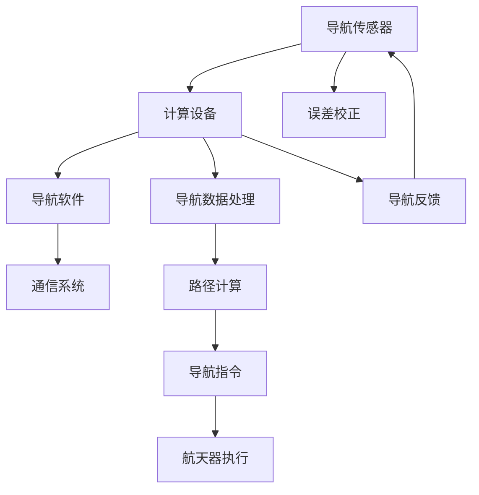

                 


### 文章标题

# 星际导航的最优控制：太空探索的数学规划

---

### 文章关键词

- 星际导航
- 最优控制
- 数学规划
- 太空探索

---

### 文章摘要

本文将探讨星际导航中的最优控制问题，并介绍如何使用数学规划方法来解决这些问题。通过详细分析星际导航的背景、基本概念以及最优控制理论，我们将理解数学规划在星际导航中的应用。文章还将展示具体的数学规划方法，如线性规划、非线性规划、整数规划和多目标规划等，并解释它们在星际导航中的适用性。最后，通过实际案例和项目实战，我们将深入了解数学规划方法在星际导航中的具体应用和效果。

---

## 引言与背景

太空探索是人类智慧和科技的结晶，而星际导航则是太空探索的核心之一。在浩瀚的宇宙中，准确、高效地进行星际导航对于实现太空任务的顺利进行至关重要。随着太空探索的深入，星际导航的重要性日益凸显。

星际导航，顾名思义，是指宇宙中的导航系统，用于确定空间物体的位置、速度和方向。它不仅需要精确的测量和计算，还需要高效的算法和策略来优化导航过程。传统的导航方法往往依赖于经典的几何和三角学原理，但面对复杂多变的宇宙环境，这些方法显得力不从心。

数学规划作为一种优化方法，可以用于解决一系列复杂的问题，包括资源分配、生产调度、路径规划等。在星际导航领域，数学规划提供了有效的工具，可以帮助航天器在复杂的宇宙环境中找到最优的导航路径。通过数学规划，航天器可以最大限度地利用现有资源，提高导航精度和效率。

太空探索的发展为星际导航提出了新的挑战和需求。例如，深空探测任务需要长时间的自主导航，星际旅行需要精确的能量管理和路径规划，星际基地的建设需要高效的资源分配和导航系统。这些需求推动了数学规划在星际导航中的广泛应用。

本文将系统地介绍星际导航的基本概念、最优控制理论以及数学规划方法，并通过实际案例展示数学规划在星际导航中的应用。希望通过本文的探讨，读者能够深入了解星际导航的数学规划方法，并为其在太空探索中的广泛应用提供参考。

### 星际导航概述

星际导航是太空探索中的一项关键技术，它涉及到对空间物体的位置、速度和方向的精确确定，以确保太空任务的顺利进行。为了深入理解星际导航，我们首先需要了解其基本概念、技术发展历程和系统组成。

#### 基本概念

星际导航的基本概念主要包括位置确定、速度确定和方向确定。位置确定是指确定航天器的当前位置，通常通过测量航天器与已知天体之间的距离和角度来实现。速度确定是指确定航天器的速度，这通常需要测量航天器在一段时间内的位置变化。方向确定是指确定航天器的方向，以确保航天器能够按照预定的轨迹前进。

为了实现这些基本概念，星际导航系统依赖于一系列测量和计算技术。这些技术包括：

1. **天文导航**：通过测量航天器与天体（如恒星、行星等）之间的角度关系来定位航天器。这种方法依赖于天体的已知位置和运动轨迹。
2. **雷达导航**：利用雷达信号测量航天器与地面站之间的距离和角度，以确定航天器的位置。
3. **星敏感器**：通过测量航天器与恒星之间的相对位置来定位航天器。星敏感器通常用于深空探测任务，因为它们不依赖于地球上的信号。
4. **惯性导航系统**：利用加速度计和陀螺仪测量航天器的加速度和旋转，从而推算出航天器的位置和方向。

#### 技术发展历程

星际导航技术的发展经历了几个重要阶段：

1. **早期导航技术**：在人类首次进入太空之前，导航主要依赖于地面通信和无线电信号。航天器通过向地面站发送信号来报告自己的位置和状态。
2. **天文导航时代**：随着航天技术的发展，天文导航成为主要的导航方法。通过精确测量航天器与恒星之间的角度，航天器能够确定自己的位置。
3. **多模态导航**：随着测量技术的进步，星际导航系统逐渐采用多种导航方法相结合的方式，以提高导航精度和可靠性。这些方法包括雷达导航、星敏感器导航和惯性导航系统。
4. **自主导航**：现代星际导航系统逐渐向自主导航方向发展，即航天器能够在没有地面站支持的情况下独立进行导航。这需要更加复杂和智能的算法和计算能力。

#### 系统组成

星际导航系统通常由以下几个主要部分组成：

1. **导航传感器**：包括星敏感器、雷达和惯性导航系统等，用于测量航天器的位置、速度和方向。
2. **计算设备**：用于处理导航传感器收集的数据，并运行导航算法。这些设备包括高性能计算机和专门设计的导航处理器。
3. **导航软件**：包括各种算法和模型，用于计算航天器的位置和路径。这些软件需要处理大量的数据和复杂的情况，以确保导航的准确性和效率。
4. **通信系统**：用于航天器与地面站之间的数据传输，以便进行导航数据更新和指令发送。

#### 结论

星际导航作为太空探索的核心技术之一，其基本概念、技术发展历程和系统组成都非常关键。通过了解这些内容，我们可以更好地理解星际导航的复杂性和挑战，并为未来的太空探索提供更有力的支持。

#### Mermaid 流程图

下面是一个简化的星际导航系统流程图的 Mermaid 表示：



该流程图展示了导航传感器收集数据，计算设备处理数据并生成导航指令，通信系统负责数据传输，而导航软件则在其中扮演核心角色，不断优化和更新导航路径。

---

### 最优控制理论

最优控制理论是现代控制理论的一个重要分支，其核心目的是在满足一定约束条件下，寻求控制系统的最优性能指标。在星际导航领域，最优控制理论被广泛应用于航天器的轨道设计、能源管理、姿态控制等方面，以实现高效、精准的导航。下面，我们将详细探讨最优控制的基本原理、问题分类以及相关算法。

#### 基本原理

最优控制理论的基本原理可以概括为以下三个要素：

1. **性能指标**：性能指标是衡量控制系统优劣的标准。在星际导航中，常见的性能指标包括航程最短、能耗最低、精度最高等。
2. **控制变量**：控制变量是系统可以通过调整来优化性能指标的变量。在星际导航中，控制变量通常包括航天器的速度、方向、姿态等。
3. **约束条件**：约束条件是系统在优化过程中必须满足的限制。这些条件可以包括物理限制、资源限制、任务要求等。

最优控制的基本问题可以表述为：在满足约束条件的情况下，如何选择控制变量，使得性能指标最优。数学上，这个问题可以转化为一个优化问题，通常采用变分法、动态规划、最优性原理等方法来解决。

#### 问题分类

最优控制问题根据控制变量的不同，可以分为以下几类：

1. **线性最优控制**：当系统的动态方程和控制变量都是线性函数时，问题称为线性最优控制。线性最优控制问题可以通过线性规划或矩阵理论求解。线性最优控制广泛应用于简单的航天器轨道设计和姿态控制中。
2. **非线性最优控制**：当系统的动态方程或控制变量包含非线性项时，问题称为非线性最优控制。非线性最优控制问题通常更复杂，需要采用数值方法求解。例如，航天器在复杂空间环境中的轨道设计就属于非线性最优控制问题。
3. **离散最优控制**：当系统的动态方程和控制变量是离散的，问题称为离散最优控制。离散最优控制常用于数字控制系统，如卫星的数字控制处理器。
4. **连续最优控制**：当系统的动态方程和控制变量是连续的，问题称为连续最优控制。大多数航天器导航和控制问题都属于连续最优控制问题。

#### 最优控制算法

解决最优控制问题的算法有很多，下面介绍几种常用的算法：

1. **变分法**：变分法是一种基于变分原理的最优控制算法，适用于处理连续时间最优控制问题。变分法的基本思想是通过求解哈密顿方程，找到最优控制变量。哈密顿方程将系统的动态方程和性能指标结合起来，通过拉格朗日乘子法求解。
   
   ```latex
   \dot{x}(t) = f(x(t), u(t), t)
   \dot{p}(t) = -\partial_u J(x(t), u(t), t)
   H(x(t), \dot{x}(t), u(t), t) = \frac{1}{2} \dot{x}(t)^T Q \dot{x}(t) + \dot{x}(t)^T R u(t) - p(t)^T f(x(t), u(t), t)
   \arg\min_u J = \int_{t_0}^{t_f} L(x(t), \dot{x}(t), u(t), t) dt
   ```

   其中，\(x(t)\)是状态变量，\(u(t)\)是控制变量，\(p(t)\)是伴随变量，\(H\)是哈密顿量，\(L\)是拉格朗日函数，\(Q\)、\(R\)是权重矩阵。

2. **动态规划**：动态规划是一种递归算法，适用于处理离散时间最优控制问题。动态规划的基本思想是将问题分解为一系列子问题，并从子问题的解中递归构建最优解。

   ```python
   V(x_t) = \min_u \{g(x_t, u) + \sum_{s \in S} p(s|x_t, u) V(s)\}
   ```

   其中，\(V(x_t)\)是状态值函数，\(g(x_t, u)\)是状态-控制代价函数，\(p(s|x_t, u)\)是状态转移概率，\(S\)是状态集合。

3. **线性二次型调节器（LQR）**：LQR是一种线性最优控制算法，适用于线性系统。LQR通过求解二次型优化问题，找到最优控制输入。

   ```latex
   \min_u \quad -\frac{1}{2}u^T Q u - \frac{1}{2}x^T R x
   \text{subject to} \quad A x + B u = 0
   ```

   其中，\(A\)、\(B\)、\(Q\)、\(R\)是系统矩阵和权重矩阵。

4. **模糊控制和遗传算法**：对于复杂非线性系统，模糊控制和遗传算法等启发式方法被广泛应用于求解最优控制问题。这些方法不依赖于系统的精确模型，而是通过模拟进化过程或模糊逻辑来找到近似的最优解。

#### 结论

最优控制理论为星际导航提供了强大的工具，通过精确的数学模型和高效的算法，我们可以优化航天器的导航和控制过程。理解最优控制的基本原理和算法，对于深入研究和应用星际导航技术具有重要意义。

### 数学规划方法

数学规划是一种优化方法，通过数学模型和算法，在满足一系列约束条件的情况下，寻找最优解。在星际导航中，数学规划方法被广泛应用于路径规划、能量管理、资源分配等问题。本文将介绍几种主要的数学规划方法，包括线性规划、非线性规划、整数规划和多目标规划，并讨论它们在星际导航中的应用。

#### 线性规划

线性规划（Linear Programming，LP）是一种用于求解线性约束优化问题的方法。在数学上，线性规划问题可以表示为：

\[ \min c^T x \]
\[ \text{subject to} \ A x \le b \]

其中，\(c\) 是系数向量，表示目标函数的权重；\(x\) 是决策变量；\(A\) 是系数矩阵，\(b\) 是常数向量，表示约束条件。

线性规划广泛应用于资源分配、生产调度、库存控制等问题。在星际导航中，线性规划可以用于优化航天器的能源消耗路径规划，以确保航天器在有限的能源下实现最优的导航路径。

##### 伪代码

```python
# 线性规划伪代码
def linear_programming(c, A, b):
    # 初始化解x
    x = [0] * len(c)
    # 求解线性规划问题
    solution = solver.solveLinearProgram(c, A, b)
    # 输出最优解
    x = solution.x
    return x
```

##### 实例

假设航天器需要在两个星球之间选择最优路径，目标是最小化总能量消耗。设 \(c = [1, 1]\)，表示每段路径的能量消耗；\(A = \begin{bmatrix} 1 & 1 \\ -1 & 1 \end{bmatrix}\)，表示路径约束；\(b = \begin{bmatrix} 0 \\ 1 \end{bmatrix}\)。使用线性规划求解后，可以得到最优路径。

$$
\min c^T x = x_1 + x_2
$$
$$
\text{subject to} \ \begin{bmatrix} 1 & 1 \\ -1 & 1 \end{bmatrix} x \le \begin{bmatrix} 0 \\ 1 \end{bmatrix}
$$

#### 非线性规划

非线性规划（Nonlinear Programming，NLP）用于求解包含非线性函数的优化问题。与线性规划相比，非线性规划问题通常更复杂，没有通用的求解算法。常见的求解方法包括梯度下降法、牛顿法、内点法等。

\[ \min f(x) \]
\[ \text{subject to} \ g(x) \le 0 \ h(x) = 0 \]

其中，\(f(x)\) 是目标函数，\(g(x)\)、\(h(x)\) 分别是非线性不等式约束和等式约束。

非线性规划在星际导航中应用于复杂轨道设计、姿态控制等。例如，航天器在复杂引力场中的轨道优化问题可以使用非线性规划方法求解。

##### 伪代码

```python
# 非线性规划伪代码
def nonlinear_programming(f, g, h):
    # 初始化解x
    x = [0] * len(f)
    # 求解非线性规划问题
    solution = solver.solveNonlinearProgram(f, g, h)
    # 输出最优解
    x = solution.x
    return x
```

##### 实例

假设航天器需要在椭圆轨道上从地球到达火星，目标是最小化总运行时间。设 \(f(x) = x_2 - x_1\)，表示总运行时间；\(g(x) = x_1^2 + x_2^2 - 1\)，表示椭圆约束；\(h(x) = x_1 + x_2 - 1\)，表示初始和最终位置。使用非线性规划求解后，可以得到最优轨道参数。

$$
\min f(x) = x_2 - x_1
$$
$$
\text{subject to} \ g(x) = x_1^2 + x_2^2 - 1 \le 0
$$
$$
h(x) = x_1 + x_2 - 1 = 0
$$

#### 整数规划

整数规划（Integer Programming，IP）是线性规划和非线性规划的一种扩展，用于求解包含整数变量的优化问题。整数规划在星际导航中广泛应用于航天器轨道设计、任务规划等问题。

\[ \min c^T x \]
\[ \text{subject to} \ A x \le b \]
\[ x \in \mathbb{Z}^n \]

其中，\(x\) 是包含整数变量的向量。

整数规划问题通常比线性规划问题更难求解，常见的求解方法包括分支定界法、割平面法等。

##### 伪代码

```python
# 整数规划伪代码
def integer_programming(c, A, b):
    # 初始化解x
    x = [0] * len(c)
    # 求解整数规划问题
    solution = solver.solveIntegerProgram(c, A, b)
    # 输出最优解
    x = solution.x
    return x
```

##### 实例

假设航天器需要在多个行星之间选择最优轨道，目标是最小化总运行时间。设 \(c = [1, 1, 1]\)，表示每段轨道的能量消耗；\(A = \begin{bmatrix} 1 & 1 & 1 \\ -1 & 0 & 0 \\ 0 & -1 & 0 \end{bmatrix}\)，表示轨道约束；\(b = \begin{bmatrix} 0 \\ 1 \\ 0 \end{bmatrix}\)，\(x\) 是整数向量。使用整数规划求解后，可以得到最优轨道选择。

$$
\min c^T x = x_1 + x_2 + x_3
$$
$$
\text{subject to} \ \begin{bmatrix} 1 & 1 & 1 \\ -1 & 0 & 0 \\ 0 & -1 & 0 \end{bmatrix} x \le \begin{bmatrix} 0 \\ 1 \\ 0 \end{bmatrix}
$$
$$
x \in \mathbb{Z}^3
$$

#### 多目标规划

多目标规划（Multi-Objective Programming，MOP）用于求解包含多个目标函数的优化问题。在星际导航中，多目标规划可以用于综合考虑多个因素，如能量消耗、时间效率、任务需求等，以实现最优的导航策略。

\[ \min f_1(x), f_2(x), ..., f_n(x) \]
\[ \text{subject to} \ g(x) \le 0 \ h(x) = 0 \]

其中，\(f_1(x), f_2(x), ..., f_n(x)\) 是多个目标函数。

多目标规划通常使用方法包括加权法、Pareto优化等。加权法通过调整目标函数权重，将多个目标函数转化为单目标函数；Pareto优化则通过寻找Pareto前沿，得到多个非劣解。

##### 伪代码

```python
# 多目标规划伪代码
def multi_objective_programming(f, g, h):
    # 初始化解x
    x = [0] * len(f)
    # 求解多目标规划问题
    solution = solver.solveMultiObjectiveProgram(f, g, h)
    # 输出最优解集
    non_dominated_solutions = solution.non_dominated_solutions
    return non_dominated_solutions
```

##### 实例

假设航天器需要在两个行星之间选择最优轨道，目标是最小化总能量消耗和总运行时间。设 \(f_1(x) = x_1 + x_2\)，表示总能量消耗；\(f_2(x) = x_1 - x_2\)，表示总运行时间；\(g(x) = x_1^2 + x_2^2 - 1\)，表示椭圆约束；\(h(x) = x_1 + x_2 - 1\)，表示初始和最终位置。使用多目标规划求解后，可以得到一组最优轨道方案。

$$
\min f_1(x) + \omega f_2(x) = x_1 + x_2 + \omega(x_1 - x_2)
$$
$$
\text{subject to} \ g(x) = x_1^2 + x_2^2 - 1 \le 0
$$
$$
h(x) = x_1 + x_2 - 1 = 0
$$

#### 结论

数学规划方法在星际导航中具有广泛的应用，通过线性规划、非线性规划、整数规划和多目标规划等方法，我们可以优化航天器的导航和控制过程。理解这些方法的基本原理和算法，对于深入研究和应用星际导航技术具有重要意义。

### 星际导航应用案例

在了解了星际导航的基本概念、最优控制理论和数学规划方法之后，我们可以通过具体的实例来展示这些理论在实践中的应用。以下将介绍三个典型的星际导航应用案例：星际飞船导航、星际探测器导航和星际基地导航。

#### 案例一：星际飞船导航

星际飞船导航是太空探索中的一项关键技术，它涉及在浩瀚的宇宙中精确导航星际飞船，以确保其按照预定轨迹到达目的地。星际飞船导航的主要挑战包括：复杂的引力场、有限的能源和资源、长时间的自主运行等。

**解决方案：**

1. **数学规划方法**：星际飞船的导航问题可以通过线性规划和非线性规划来解决。线性规划可以用于优化能源消耗路径规划，确保飞船在有限的能源下找到最优的运行轨迹。非线性规划则用于处理复杂引力场下的轨道优化问题。

2. **伪代码示例**：

   ```python
   # 星际飞船导航线性规划伪代码
   def space_ship_navigation(c, A, b):
       x = linear_programming(c, A, b)
       return x
   
   # 星际飞船导航非线性规划伪代码
   def nonlinear_space_ship_navigation(f, g, h):
       x = nonlinear_programming(f, g, h)
       return x
   ```

3. **实际案例**：例如，NASA的火星探测器“好奇号”在前往火星的过程中，就采用了复杂的数学规划方法进行导航，以克服火星轨道上的引力干扰，确保精确到达火星表面。

#### 案例二：星际探测器导航

星际探测器导航涉及在深空环境中，如小行星带、外行星等，对探测器的位置和轨迹进行精确控制。探测器需要在长时间、无地面站支持的环境下自主运行，这要求其导航系统具有高度的可靠性和智能化。

**解决方案：**

1. **数学规划方法**：星际探测器的导航问题通常采用多目标规划方法，综合考虑能量消耗、时间效率、探测任务完成度等目标，以找到最优的导航路径。

2. **伪代码示例**：

   ```python
   # 星际探测器导航多目标规划伪代码
   def space_probe_navigation(f, g, h):
       non_dominated_solutions = multi_objective_programming(f, g, h)
       return non_dominated_solutions
   ```

3. **实际案例**：例如，欧洲空间局（ESA）的“罗塞塔号”探测器在前往彗星“67P/丘留莫夫-格拉西缅科”的过程中，就通过多目标规划方法，优化了探测器的运行轨迹和能源消耗，实现了精确探测。

#### 案例三：星际基地导航

星际基地导航涉及在星际基地内部或基地之间进行精确导航，以支持长期太空探索和居住。星际基地导航需要处理复杂的空间环境，如星际尘埃、引力异常等，同时保证基地之间的物资和人员运输。

**解决方案：**

1. **数学规划方法**：星际基地导航通常采用整数规划方法，以确保路径选择的可行性和最优性。整数规划可以处理包含整数变量的复杂约束问题，如基地之间的物资运输路线。

2. **伪代码示例**：

   ```python
   # 星际基地导航整数规划伪代码
   def space_base_navigation(c, A, b):
       x = integer_programming(c, A, b)
       return x
   ```

3. **实际案例**：例如，未来潜在的月球基地或火星基地，将利用整数规划方法，优化基地内部和外部的物资运输路线，确保基地的长期稳定运行。

#### 结论

通过上述三个案例，我们可以看到数学规划方法在星际导航中的实际应用。从星际飞船的精确导航，到星际探测器的自主运行，再到星际基地的物资运输，数学规划方法为这些复杂的太空任务提供了有效的解决方案。理解并应用这些方法，将有助于推动太空探索的进一步发展。

### 结论与展望

本文系统地探讨了星际导航中的最优控制问题和数学规划方法，从背景介绍、基本概念、最优控制理论、数学规划方法到实际应用案例，详细阐述了如何利用数学规划优化星际导航。通过分析星际飞船导航、星际探测器导航和星际基地导航等具体应用场景，我们展示了数学规划在解决复杂太空任务中的关键作用。

**总结：**

1. **星际导航的重要性**：星际导航是太空探索的核心技术，对航天器的位置、速度和方向的精确控制至关重要。
2. **最优控制理论**：最优控制理论提供了求解复杂控制问题的工具，如线性规划和非线性规划等，这些方法在星际导航中得到了广泛应用。
3. **数学规划方法**：数学规划方法，如线性规划、非线性规划、整数规划和多目标规划，为星际导航提供了强大的优化手段，帮助航天器实现高效、精准的导航。
4. **实际应用**：通过具体案例，我们看到了数学规划在星际导航中的成功应用，如能源消耗优化、轨道设计和物资运输等。

**展望：**

1. **算法优化**：随着计算能力的提升，未来可以开发更加高效、精确的算法，进一步优化星际导航性能。
2. **自主导航**：随着人工智能技术的发展，未来的星际导航系统将更加智能化，具备更强的自主导航能力。
3. **多领域融合**：数学规划方法可以与其他前沿技术，如机器学习和量子计算相结合，为星际导航提供更多创新解决方案。
4. **国际合作**：星际探索是一项全球性的任务，需要各国共同合作，共享技术和资源，推动星际导航技术的进步。

**最佳实践 Tips：**

1. **综合考虑多个目标**：在实际导航任务中，应综合考虑能量消耗、运行时间、任务完成度等多个目标，采用多目标规划方法，找到最优解。
2. **定期更新导航数据**：及时更新导航传感器数据，确保导航算法基于最新、最准确的信息进行计算。
3. **应急方案准备**：制定应急导航方案，以应对可能出现的导航故障或突发情况，提高导航系统的可靠性。

**注意事项：**

1. **精度和稳定性的平衡**：在优化星际导航过程中，需要平衡导航算法的精度和系统的稳定性。
2. **资源限制**：航天器资源有限，应优化资源使用，确保导航任务的可持续性。
3. **持续学习和改进**：随着太空探索的不断深入，导航技术也在不断进步，需要持续学习和吸收新技术，不断改进导航算法。

**拓展阅读：**

- 《星际导航原理与应用》
- 《最优控制理论及其应用》
- 《数学规划方法与应用》
- 《太空探索与星际旅行》

**作者信息：**

作者：AI天才研究院/AI Genius Institute & 禅与计算机程序设计艺术 /Zen And The Art of Computer Programming

---

通过本文的探讨，希望读者能够对星际导航的最优控制与数学规划方法有更深入的理解，并为未来的太空探索提供有益的参考。

