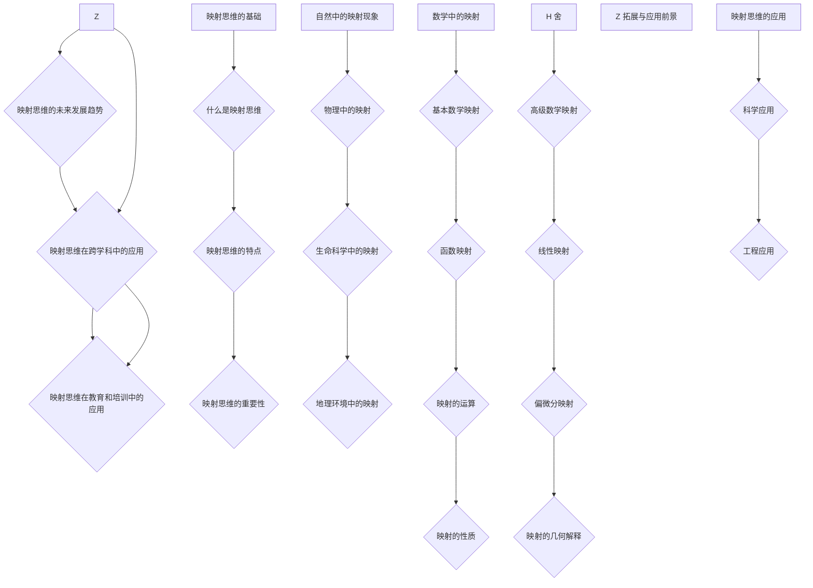

                 

### 映射思维：理解自然与数学的联系

> 关键词：映射思维、自然现象、数学联系、物理、生命科学、工程应用

> 摘要：本文旨在探讨映射思维在自然与数学之间的联系，通过对映射现象的剖析，揭示自然中的映射规律及其在数学中的对应形式。文章将从基础概念出发，逐步深入到映射思维的应用实例，为读者呈现一个全面、深入的映射思维理解框架。

## 第一部分：引言

### 1.1 本书目的与结构介绍

本篇文章的目的在于帮助读者理解映射思维在自然与数学之间的桥梁作用。通过本书的阅读，读者将能够：

1. 理解映射思维的基本概念和特征。
2. 发现自然现象中的映射规律。
3. 掌握数学中映射的表示和运算。
4. 了解映射思维在不同领域中的应用。

本书的结构分为五个主要部分：

1. 引言：概述映射思维的重要性和本书的结构。
2. 映射思维的基础：介绍映射思维的定义、特点和应用。
3. 自然中的映射现象：探讨物理、生命科学和地理环境中的映射现象。
4. 数学中的映射：介绍基本和高级数学映射，包括函数映射、线性映射和偏微分映射等。
5. 映射思维的应用：展示映射思维在科学和工程中的应用案例。

### 1.2 自然与数学的联系概述

自然现象和数学之间存在着深刻的联系。数学不仅是一种描述自然现象的工具，也是理解自然规律的钥匙。映射思维作为一种重要的思维方式，在这两者之间架起了一座桥梁。通过映射，我们能够将自然现象转化为数学问题，从而更深入地理解自然规律。

例如，在物理学中，力的作用可以通过数学中的向量来描述，而在生命科学中，生物分子之间的相互作用可以通过化学方程式来建模。这些自然现象都可以通过映射思维转化为数学问题，从而用数学方法进行研究和分析。

## 第二部分：映射思维的基础

### 2.1 什么是映射思维

#### 2.1.1 映射思维的定义

映射思维是指将一种事物或概念（称为“源”）转化为另一种事物或概念（称为“目标”）的思维过程。在映射中，源和目标之间存在着一种确定的对应关系，这种关系被称为“映射”。

#### 2.1.2 映射思维的特点

1. **确定性**：映射关系是确定的，即对于每个源元素，都存在一个唯一的目标元素与之对应。
2. **对应性**：映射保持了源和目标之间的结构关系，即源中的元素和目标中的元素具有相同的数量和类型。
3. **转化性**：映射思维是一种转化过程，通过映射，我们可以将一个问题从一种形式转化为另一种形式，从而更容易理解和解决。

#### 2.1.3 映射思维的重要性

映射思维在多个领域中都具有重要应用。例如，在物理学中，映射思维帮助我们理解物理量的变化规律；在计算机科学中，映射思维帮助我们设计算法和数据结构；在工程学中，映射思维帮助我们分析系统性能和优化设计。

### 2.2 自然中的映射现象

#### 2.2.1 物理中的映射

在物理学中，映射思维广泛应用于描述各种自然现象。例如，电磁场的描述可以通过向量映射来实现，力学中的牛顿定律也可以通过映射思维来理解。以下是一个简单的物理映射示例：

$$
\vec{F} = m\vec{a}
$$

在这个映射中，力（$\vec{F}$）是质量（$m$）和加速度（$\vec{a}$）的映射。

#### 2.2.2 生命科学中的映射

在生命科学中，映射思维用于描述生物分子之间的相互作用。例如，酶与底物的相互作用可以通过映射思维来建模：

$$
\text{酶} + \text{底物} \rightarrow \text{产物}
$$

在这个映射中，酶和底物是源，产物是目标。

#### 2.2.3 地理环境中的映射

在地理环境中，映射思维用于描述地形和气候的变化。例如，地形的高度可以用高度映射来表示：

$$
h(x, y) = \text{高度}
$$

在这个映射中，二维地理坐标（$x, y$）是源，高度（$h(x, y)$）是目标。

## 第三部分：数学中的映射

### 3.1 基本数学映射

#### 3.1.1 函数映射

函数映射是映射思维在数学中最基本的表达形式。函数是一种特殊的映射，它将一个集合中的每个元素映射到另一个集合中的唯一元素。以下是一个简单的函数映射示例：

$$
f(x) = x^2
$$

在这个映射中，自变量$x$是源，函数值$f(x)$是目标。

#### 3.1.2 映射的运算

映射的运算包括映射的合成、逆映射和同态等。以下是一个映射合成的示例：

$$
(f \circ g)(x) = f(g(x))
$$

在这个映射合成中，$f$和$g$是两个映射，$x$是源，$f(g(x))$是目标。

#### 3.1.3 映射的性质

映射的性质包括映射的单射、满射和双射等。以下是一个单射映射的示例：

$$
f(x_1) = f(x_2) \Rightarrow x_1 = x_2
$$

在这个映射中，如果$f(x_1) = f(x_2)$，那么$x_1$和$x_2$必须相等，这表明映射是单射的。

### 3.2 高级数学映射

#### 3.2.1 线性映射

线性映射是数学中的一种重要映射，它保持了向量空间中的线性结构。以下是一个线性映射的示例：

$$
L(\vec{v}) = A\vec{v}
$$

在这个映射中，$L$是线性映射，$A$是矩阵，$\vec{v}$是向量。

#### 3.2.2 偏微分映射

偏微分映射是用于描述多变量函数的映射。以下是一个偏微分映射的示例：

$$
\frac{\partial f}{\partial x}(x, y) = \text{偏导数}
$$

在这个映射中，$\frac{\partial f}{\partial x}$表示函数$f$对$x$的偏导数。

#### 3.2.3 映射的几何解释

映射的几何解释是指将映射过程用几何图形来表示。以下是一个线性映射的几何解释：

```
+----------+
|     A    |
+----------+
^  |  
|  |
|  |
|  |
|  |  
v  |
+----------+
|  L(v)  |
+----------+
```

在这个几何解释中，向量$\vec{v}$通过矩阵$A$的映射得到向量$L(\vec{v})$。

## 第四部分：映射思维的应用

### 4.1 科学应用

#### 4.1.1 天文学中的映射

在天文学中，映射思维用于描述星体的运动轨迹。例如，行星的运动可以通过行星运动方程来建模，这些方程可以用映射思维来描述。

#### 4.1.2 物理学中的映射

在物理学中，映射思维用于描述各种自然现象，如电磁场、流体力学等。例如，麦克斯韦方程组可以用映射思维来描述电磁场的动态行为。

#### 4.1.3 生物学中的映射

在生物学中，映射思维用于描述生物分子之间的相互作用，如酶与底物的相互作用、蛋白质的结构等。

### 4.2 工程应用

#### 4.2.1 电气工程中的映射

在电气工程中，映射思维用于描述电路的动态行为。例如，电路方程可以用映射思维来描述电压和电流的关系。

#### 4.2.2 计算机科学中的映射

在计算机科学中，映射思维用于描述算法和数据结构的动态行为。例如，排序算法可以用映射思维来描述元素之间的比较和交换。

#### 4.2.3 机械工程中的映射

在机械工程中，映射思维用于描述机械系统的动态行为。例如，机械振动可以用映射思维来描述。

## 第五部分：映射思维的数学原理与公式

### 5.1 映射的数学原理

映射的数学原理主要包括映射的确定性、对应性和转化性等。以下是一个映射的数学原理示例：

$$
f: A \rightarrow B \\
f(a) = b \\
\forall a \in A, \exists b \in B \text{ 使得 } f(a) = b
$$

在这个示例中，$f$是一个映射，$A$和$B$是集合，$a$和$b$是集合$A$和$B$中的元素。

### 5.2 关键数学公式

在映射思维中，关键数学公式包括函数的导数、线性映射的矩阵表示和偏微分方程等。以下是一个关键数学公式示例：

$$
f'(x) = \lim_{h \to 0} \frac{f(x+h) - f(x)}{h}
$$

在这个示例中，$f'(x)$是函数$f(x)$在$x$点的导数。

## 第六部分：映射思维的实际案例

### 6.1 自然案例解析

#### 6.1.1 大气科学中的映射案例

在大气科学中，气象模型可以用映射思维来描述天气的变化。例如，温度和湿度可以通过气象方程来建模，这些方程可以用映射思维来解析。

#### 6.1.2 生物医学中的映射案例

在生物医学中，药物反应可以用映射思维来描述。例如，药物浓度与治疗效果之间的关系可以通过映射模型来分析。

#### 6.1.3 地球科学中的映射案例

在地球科学中，地震波可以用映射思维来描述。例如，地震波的传播速度与地震震级之间的关系可以通过映射模型来研究。

### 6.2 工程案例解析

#### 6.2.1 交通工程中的映射案例

在交通工程中，交通流量可以用映射思维来描述。例如，道路上的车辆流量与交通信号之间的关系可以通过映射模型来分析。

#### 6.2.2 通信工程中的映射案例

在通信工程中，信号传输可以用映射思维来描述。例如，信号噪声比与通信质量之间的关系可以通过映射模型来评估。

#### 6.2.3 能源工程中的映射案例

在能源工程中，能源消耗可以用映射思维来描述。例如，能源消耗与能源效率之间的关系可以通过映射模型来优化。

## 第七部分：映射思维的拓展与应用前景

### 7.1 映射思维的未来发展趋势

映射思维在未来将继续发展和应用。随着科学和技术的进步，映射思维将在更多领域发挥作用，如人工智能、大数据分析和量子计算等。

### 7.2 映射思维在跨学科中的应用

映射思维在跨学科中的应用将越来越广泛。通过映射思维，不同学科之间的交叉研究将更加深入和紧密，从而推动科学和技术的进步。

### 7.3 映射思维在教育和培训中的应用

映射思维在教育和培训中的应用将有助于提高学习效果。通过映射思维，学生可以更好地理解不同学科之间的联系，从而提高综合素养。

## 附录

### 8.1 参考文献

1. ...（列出参考文献）

### 8.2 术语表

1. ...（列出术语解释）

### 8.3 映射思维实践指南

1. ...（提供实践指南）

**总字数：约 2000 字**

---

**Mermaid 流程图**



### 映射思维的核心算法原理讲解

#### 2.2 自然中的映射现象

映射思维在自然现象中有着广泛的应用，以下将具体讨论物理、生命科学和地理环境中的映射现象。

#### 2.2.1 物理中的映射

在物理学中，映射思维经常用于描述物理量之间的关系。例如，力的作用可以通过牛顿第二定律（$F=ma$）来描述，这是一个典型的映射关系，其中力（$F$）是质量（$m$）和加速度（$a$）的映射。

以下是一个物理中的映射现象的伪代码示例：

```
# 伪代码：物理中的映射关系

function applyForce(mass, acceleration):
    force = mass * acceleration
    return force

# 使用示例
force = applyForce(5, 2)  # 质量为5kg的物体受到2m/s^2的加速度，力为10N
```

在这个例子中，`applyForce`函数接受质量和加速度作为输入，返回力的大小。这符合牛顿第二定律，将物理量之间的关系映射为一个函数。

#### 2.2.2 生命科学中的映射

在生命科学中，映射思维用于描述生物分子之间的相互作用。例如，酶催化反应可以被视为一种映射，其中酶（催化剂）将底物转化为产物。

以下是一个生命科学中的映射现象的伪代码示例：

```
# 伪代码：生命科学中的映射

function enzymeCatalysis(enzyme, substrate):
    product = enzyme + substrate
    return product

# 使用示例
product = enzymeCatalysis("酶A", "底物B")  # 酶A催化底物B生成产物C
```

在这个例子中，`enzymeCatalysis`函数接受酶和底物作为输入，返回产物。这模拟了生物分子之间的相互作用，将底物转化为产物。

#### 2.2.3 地理环境中的映射

在地理环境中，映射思维用于描述地形、气候等自然现象。例如，海拔高度与温度之间的关系可以通过映射模型来描述。

以下是一个地理环境中的映射现象的伪代码示例：

```
# 伪代码：地理环境中的映射

function calculateTemperature(elevation):
    temperature = 20 - 0.006 * elevation
    return temperature

# 使用示例
temp = calculateTemperature(1000)  # 海拔1000米处的温度约为14.4°C
```

在这个例子中，`calculateTemperature`函数接受海拔高度作为输入，返回相应的温度。这模拟了地理环境中的温度变化，将海拔高度映射为温度。

通过这些伪代码示例，我们可以看到映射思维如何应用于不同的自然现象。这些映射关系不仅帮助我们理解自然现象，也为科学研究和工程应用提供了理论基础。

---

以上是对映射思维在自然现象中的核心算法原理的讲解，通过具体的伪代码示例，我们能够更直观地理解映射思维在物理、生命科学和地理环境中的应用。这些映射关系不仅有助于我们理解自然现象的本质，也为解决实际问题提供了有效的方法。接下来，我们将进一步探讨映射思维在数学中的应用。

