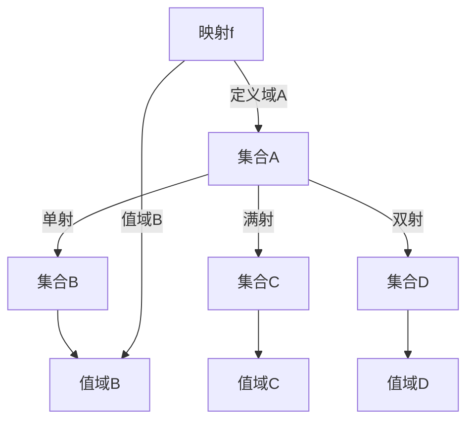

                 

### 引言

映射理论，作为现代数学和计算机科学中的一个重要分支，提供了理解和处理复杂系统的有力工具。其背景可以追溯到古希腊哲学家欧几里得对几何学的探索，以及后来的数学家如康托尔对集合论的深入研究。映射理论的核心在于研究从一个集合到另一个集合的规则和结构，这一研究不仅在数学内部具有重要的理论价值，还在自然科学、工程技术、经济学等领域得到了广泛的应用。

自然与数学的关联自古以来就是哲学和科学探讨的焦点。在自然界中，物体和现象之间的相互关系可以抽象为数学模型中的映射。例如，物理学中的力学系统可以通过映射关系来描述物体的运动轨迹，而生态学中的食物链关系则可以抽象为生态系统中的生物种群的映射。数学作为语言和工具，帮助我们更深刻地理解和解释自然现象。

本书旨在系统介绍映射理论的基本概念、核心算法、数学模型，并探讨其在实际项目中的应用。文章的结构安排如下：

- **第1章 引言**：介绍映射理论的背景和自然与数学的关联，概述本书的结构和内容。
- **第2章 映射理论基础**：详细讲解映射理论的基本概念、类型、与集合论的关系，并展示核心概念的Mermaid流程图。
- **第3章 映射算法解析**：深入分析映射搜索、优化、压缩算法，使用伪代码展示算法流程。
- **第4章 数学模型解析**：介绍映射的数学定义、属性与性质，使用LaTeX格式展示公式，并进行详细解释和举例。
- **第5章 映射在实际项目中的应用**：展示映射在图像处理、自然语言处理、计算机视觉等领域的实际应用案例。
- **第6章 映射理论的发展与挑战**：回顾映射理论的发展历程、当前研究热点、面临的挑战与未来方向。
- **第7章 总结与展望**：总结本书要点，强调映射理论的重要性，并对未来研究提出展望。

通过这种结构化的分析，我们希望能够让读者不仅了解映射理论的基本概念，还能深入理解其在各个应用领域中的具体应用和意义。

### 映射理论基础

映射理论作为现代数学中的一个重要分支，其基本概念和类型为后续算法和应用奠定了坚实的基础。本节将详细讲解映射理论的基本概念、类型，以及映射与集合论的关系，并使用Mermaid流程图展示核心概念之间的关系。

#### 映射的基本概念

映射（Mapping）是一种从集合到集合的规则或关系。更正式地，设\( A \)和\( B \)为两个集合，映射是从\( A \)到\( B \)的一个函数，记为\( f: A \rightarrow B \)，满足以下条件：

1. **定义域**：对于集合\( A \)中的每一个元素，在集合\( B \)中都有唯一的元素与之对应。
2. **值域**：映射的结果，即集合\( B \)中所有与集合\( A \)中元素对应的部分。
3. **一一对应**：对于集合\( A \)中的每一个不同的元素，在集合\( B \)中都有不同的元素与之对应。

在数学上，映射可以用函数符号和箭头表示，例如，\( f(a) = b \)，表示集合\( A \)中的元素\( a \)通过映射\( f \)映射到集合\( B \)中的元素\( b \)。

#### 映射的类型

映射根据其性质和形式可以分为多种类型：

1. **单射（Injective）**：如果映射\( f \)满足不同的\( A \)中的元素映射到不同的\( B \)中的元素，即\( a_1 \neq a_2 \Rightarrow f(a_1) \neq f(a_2) \)，则称\( f \)为单射。

2. **满射（Surjective）**：如果映射\( f \)的值域覆盖了集合\( B \)中的所有元素，即\( B \)中的每一个元素都有至少一个\( A \)中的元素与之对应，则称\( f \)为满射。

3. **双射（Bijective）**：如果映射\( f \)既是单射又是满射，即\( f \)将\( A \)中的所有元素一一对应地映射到\( B \)中，同时\( B \)中的所有元素都被映射到，则称\( f \)为双射。

4. **同构（Isomorphism）**：如果两个集合之间的映射保持集合内的结构关系，即映射保持元素之间的运算关系，则称这两个集合同构。

#### 映射与集合论的关系

集合论是现代数学的基础，而映射理论则是集合论的一个直接应用和发展。映射可以用集合论中的概念和工具来严格定义和操作。

1. **集合与映射的关系**：集合是映射的基本组成部分。映射的**定义域**和**值域**都是集合，映射本身可以看作是从定义域集合到值域集合的一个关系。

2. **映射的表示**：映射可以用集合论中的函数表示，即\( f: A \rightarrow B \)。这种表示方法强调了映射作为集合之间元素对应关系的特性。

3. **映射的运算**：集合论中的并集、交集、补集等运算可以推广到映射上，形成映射之间的运算，如复合映射、逆映射等。

#### 映射理论的Mermaid流程图

为了更好地理解映射理论的核心概念，我们可以使用Mermaid流程图来展示各个概念之间的关系。以下是一个简单的Mermaid流程图示例：



在上述流程图中，集合\( A \)、\( B \)、\( C \)、\( D \)分别表示不同的集合，\( f \)表示映射，箭头表示映射关系，并通过不同的箭头标记展示了映射的类型。

通过这种结构化的方式，我们可以清晰地理解映射理论的基本概念、类型以及与集合论的关系。这些概念和关系的理解是后续深入探讨映射算法、数学模型以及实际应用的重要基础。

### 映射算法解析

在映射理论中，算法是理解和应用映射关系的关键环节。本节将详细分析映射搜索、优化、压缩等关键算法，并使用伪代码展示算法的流程。

#### 映射搜索算法

映射搜索算法的目标是在给定的定义域集合中，找到满足特定条件的映射关系。一个简单的映射搜索算法如下：

```python
# 伪代码：映射搜索算法
function mapping_search(A, B, condition):
    for each a in A:
        if condition(a, B):
            return mapping(a, B)
    return None
```

在此算法中，`A`和`B`是定义域和值域集合，`condition`是映射满足的条件。算法遍历定义域集合中的每个元素，检查是否满足条件，如果找到满足条件的映射，则返回该映射，否则返回`None`。

#### 映射优化算法

映射优化算法的目标是在满足一定约束条件的前提下，找到最优的映射关系。一个简单的映射优化算法如下：

```python
# 伪代码：映射优化算法
function mapping_optimize(A, B, objective_function, constraints):
    best_mapping = None
    best_score = float('-inf')

    for each mapping f in possible_mappings(A, B):
        if satisfies_constraints(f, constraints):
            score = objective_function(f)
            if score > best_score:
                best_score = score
                best_mapping = f

    return best_mapping
```

在此算法中，`A`和`B`是定义域和值域集合，`objective_function`是评估映射优劣的函数，`constraints`是映射需要满足的约束条件。算法遍历所有可能的映射关系，检查是否满足约束条件，并根据评估函数选择最优的映射。

#### 映射压缩算法

映射压缩算法的目标是减少映射关系的存储空间，同时保留映射的核心信息。一个简单的映射压缩算法如下：

```python
# 伪代码：映射压缩算法
function mapping_compress(A, B, mapping):
    compressed_mapping = {}

    for each a in A:
        if mapping(a) in compressed_mapping:
            compressed_mapping[mapping(a)].append(a)
        else:
            compressed_mapping[mapping(a)] = [a]

    return compressed_mapping
```

在此算法中，`A`和`B`是定义域和值域集合，`mapping`是给定的映射关系。算法通过将映射关系压缩为键值对的形式，减少存储空间，同时保留映射的信息。

这些映射算法为处理和优化映射关系提供了有效的工具。在实际应用中，可以根据具体需求和场景选择合适的算法，并对其进行进一步的优化和改进。

### 数学模型解析

映射理论的核心在于其数学模型的严谨性和普适性。本节将介绍映射的数学定义，并使用LaTeX格式展示相关公式，同时详细解释这些公式及其在映射理论中的应用。

#### 映射的数学定义

映射的最基本定义可以表述为：设\( A \)和\( B \)为两个集合，映射是一个从\( A \)到\( B \)的函数，记为\( f: A \rightarrow B \)。映射可以形式化地定义为：

\[ f: A \rightarrow B \text{ 如果且仅如果对于每个} a \in A, \text{存在唯一的} b \in B \text{使得} f(a) = b. \]

在数学上，映射可以用集合论中的二元组来表示，即：

\[ f = \{ (a, f(a)) \mid a \in A \} \]

其中，\( f(a) \)表示\( a \)在映射\( f \)下的像。

#### 映射的属性与性质

映射的属性和性质是理解和应用映射理论的基础。以下列出几个关键的属性和性质：

1. **单射**：映射\( f \)是单射当且仅当对于所有的\( a_1, a_2 \in A \)，如果\( f(a_1) = f(a_2) \)，则\( a_1 = a_2 \)。用公式表示为：

\[ a_1 \neq a_2 \Rightarrow f(a_1) \neq f(a_2) \]

2. **满射**：映射\( f \)是满射当且仅当值域\( f(A) \)等于集合\( B \)，即对于每个\( b \in B \)，存在至少一个\( a \in A \)使得\( f(a) = b \)。用公式表示为：

\[ \forall b \in B, \exists a \in A \text{ such that } f(a) = b \]

3. **双射**：映射\( f \)是双射当且仅当它既是单射又是满射。用公式表示为：

\[ f \text{ is bijective} \Leftrightarrow f \text{ is injective and surjective} \]

4. **同构**：两个集合\( A \)和\( B \)之间的映射\( f \)是同构当且仅当它保持集合内的结构关系，即：

\[ f(a_1 \cup a_2) = f(a_1) \cup f(a_2) \]
\[ f(a_1 \cap a_2) = f(a_1) \cap f(a_2) \]

#### 映射的数学公式

映射的数学公式不仅帮助我们理解映射的性质，还提供了在具体问题中应用映射的工具。以下是一些常见的映射公式：

1. **逆映射**：如果映射\( f \)是双射，则其逆映射\( f^{-1} \)定义为：

\[ f^{-1}(b) = a \text{ where } f(a) = b \]

2. **复合映射**：两个映射\( f: A \rightarrow B \)和\( g: B \rightarrow C \)的复合映射\( g \circ f \)定义为：

\[ (g \circ f)(a) = g(f(a)) \]

3. **像和原像**：给定映射\( f: A \rightarrow B \)，其像集合（值域）和原像集合（定义域）分别定义为：

\[ \text{Im}(f) = \{ f(a) \mid a \in A \} \]
\[ \text{Dom}(f) = \{ a \in A \mid f(a) \text{ is defined} \} \]

#### 举例说明

为了更好地理解这些公式，我们可以通过一个具体的例子来说明：

假设集合\( A = \{1, 2, 3\} \)，集合\( B = \{a, b, c\} \)，定义映射\( f \)为：

\[ f(1) = a, \quad f(2) = b, \quad f(3) = c \]

1. **单射验证**：

\[ f(1) \neq f(2) \Rightarrow a \neq b \]
\[ f(1) \neq f(3) \Rightarrow a \neq c \]
\[ f(2) \neq f(3) \Rightarrow b \neq c \]

因此，\( f \)是单射。

2. **满射验证**：

\[ b \in B, \quad \exists a \in A \text{ such that } f(a) = b \]
\[ c \in B, \quad \exists a \in A \text{ such that } f(a) = c \]

因此，\( f \)是满射。

3. **双射验证**：

由于\( f \)既是单射又是满射，因此\( f \)是双射。

通过上述例子，我们可以看到如何验证映射是否具有单射、满射和双射的性质。这些性质在理解和应用映射理论时非常重要。

总之，通过精确的数学定义和严谨的公式，映射理论为处理和解释各种映射关系提供了强大的工具。这些公式不仅帮助我们理解映射的基本性质，还为我们解决实际问题提供了指导。

### 映射在实际项目中的应用

映射理论不仅在理论研究中具有重要地位，也在实际项目中展现了其强大的应用潜力。本节将详细探讨映射在图像处理、自然语言处理、计算机视觉等领域的应用，并提供实际案例进行分析。

#### 映射在图像处理中的应用

在图像处理中，映射通常用于图像的变换、增强和分类。一个典型的例子是图像的傅里叶变换，它将图像从空间域转换到频率域，从而便于分析和处理图像的特征。

**案例：图像边缘检测**

图像边缘检测是一种常用的图像处理技术，用于识别图像中的显著边缘。使用映射理论，可以通过以下步骤实现：

1. **定义映射关系**：设\( I \)为原始图像，\( G \)为边缘图像，映射\( f \)将像素值从\( I \)映射到\( G \)。

2. **设计边缘检测算法**：使用Sobel算子或其他边缘检测算法计算边缘强度，作为映射的依据。

3. **实现映射**：将边缘强度阈值化，大于阈值的像素值映射为边缘像素。

伪代码示例：

```python
# 伪代码：图像边缘检测
function edge_detection(I):
    G = apply_sobel_operator(I)
    threshold = determine_threshold(G)
    for each pixel p in G:
        if G[p] > threshold:
            G[p] = 255  # 表示边缘像素
        else:
            G[p] = 0   # 表示非边缘像素
    return G
```

通过映射理论，可以优化边缘检测算法，提高检测效率和准确性。

#### 映射在自然语言处理中的应用

自然语言处理（NLP）中，映射技术用于文本的语义分析和信息提取。一个常见的例子是词向量的映射，它将自然语言词汇映射到高维向量空间，便于计算机处理和计算。

**案例：词嵌入（Word Embedding）**

词嵌入是一种将自然语言词汇映射到固定维度的向量空间的技术。一个典型的词嵌入模型是Word2Vec，其通过以下步骤实现：

1. **定义映射关系**：设\( V \)为词汇表，\( E \)为词向量空间，映射\( f \)将词汇映射到词向量。

2. **训练词向量模型**：使用神经网络或分布式算法训练词向量模型，将词汇映射到高维向量。

3. **应用映射**：将文本中的词汇映射到词向量空间，进行文本分析和处理。

伪代码示例：

```python
# 伪代码：词嵌入
function word_embedding(V, E):
    for each word w in V:
        context_words = get_context_words(w)
        vector = train_vector(w, context_words)
        E[w] = vector
    return E
```

词嵌入技术在情感分析、文本分类、机器翻译等NLP任务中发挥了重要作用，通过映射理论，可以优化词向量的训练和模型效果。

#### 映射在计算机视觉中的应用

在计算机视觉中，映射技术广泛应用于图像识别、目标检测和图像生成等领域。一个典型的例子是卷积神经网络（CNN）中的特征映射，它通过多层卷积和池化操作，将输入图像映射到高维特征空间，便于分类和识别。

**案例：目标检测**

目标检测是一种在图像中识别并定位物体的技术。使用映射理论，可以通过以下步骤实现：

1. **定义映射关系**：设\( I \)为输入图像，\( O \)为输出目标区域，映射\( f \)将图像映射到目标区域。

2. **设计目标检测算法**：使用卷积神经网络或其他目标检测算法，将图像映射到目标区域。

3. **实现映射**：通过识别和定位算法，从图像中提取目标区域。

伪代码示例：

```python
# 伪代码：目标检测
function object_detection(I):
    features = convolve(I)
    regions = pool_features(features)
    objects = identify_objects(regions)
    return objects
```

通过映射理论，可以优化目标检测算法，提高检测精度和速度。

总之，映射理论在图像处理、自然语言处理和计算机视觉等领域的实际应用中，为复杂问题的解决提供了有力的工具。通过具体的案例分析和代码示例，我们可以看到映射理论在各个应用领域中的重要作用。

### 映射理论的发展与挑战

映射理论作为现代数学和计算机科学的重要分支，经历了长期的演进和发展。回顾其发展历程，我们不仅可以了解该理论的演变过程，还能从中获得对未来研究的启示。

#### 映射理论的发展历程

映射理论的起源可以追溯到古希腊哲学家欧几里得的几何学研究。欧几里得在他的著作《几何原本》中，通过一系列公理和定理，建立了几何学的理论基础。其中，许多命题都可以视为映射的早期形式，例如，点与点之间的几何关系可以看作是一种映射。

在19世纪，德国数学家乔治·康托尔对集合论进行了系统研究，他的工作为映射理论的发展奠定了坚实的基础。康托尔引入了“集合”这一概念，定义了映射作为集合之间的对应关系。这一理论框架为后来的数学家提供了强大的工具，推动了数学分析、拓扑学、代数学等多个领域的发展。

20世纪中叶，随着计算机科学的兴起，映射理论在计算机科学中的应用越来越广泛。计算机科学家开始探索如何在计算机中实现和优化映射操作，这一过程催生了诸如编译原理、算法设计等新兴领域。

#### 当前研究热点

当前，映射理论的研究热点主要集中在以下几个方面：

1. **分布式映射**：随着大数据和云计算的发展，分布式映射技术成为了研究的热点。分布式映射旨在通过将映射操作分布在多个计算节点上，提高计算效率和并行处理能力。

2. **深度学习中的映射**：深度学习中的映射技术，如卷积神经网络（CNN）、循环神经网络（RNN）等，通过多层映射操作提取复杂特征，取得了显著的成果。这些技术在图像处理、自然语言处理、计算机视觉等领域表现出了强大的能力。

3. **映射优化算法**：随着问题规模的不断扩大，如何设计高效、优化的映射算法成为了研究的热点。研究主要集中在如何设计更快的搜索算法、优化映射过程中的资源使用等。

#### 面临的挑战与未来方向

尽管映射理论在多个领域取得了显著进展，但仍面临一些挑战和未来研究方向：

1. **算法效率**：如何设计更加高效、优化的映射算法，以应对大规模数据处理的需求，是一个重要的研究方向。这可能需要结合新的计算模型和优化技术。

2. **跨领域应用**：映射理论在各个领域中的应用潜力巨大，但如何将映射理论应用到新的领域，如量子计算、生物信息学等，仍然是一个挑战。

3. **可解释性**：深度学习中的映射操作通常被视为“黑箱”，其内部机制不透明。提高映射操作的可解释性，帮助用户理解映射过程和结果，是未来研究的重要方向。

4. **理论基础**：尽管映射理论在各个领域都有广泛应用，但其理论基础仍需进一步完善。这包括对映射的数学模型、性质和关系的深入探讨。

总之，映射理论的发展与挑战为我们提供了丰富的研究机会和方向。通过不断探索和创新，我们有望在理论和应用层面都取得更大的突破。

### 总结与展望

映射理论作为现代数学和计算机科学中的重要分支，不仅在理论研究中具有重要地位，还在实际项目中展现了广泛的应用。通过系统介绍映射理论的基本概念、核心算法、数学模型，以及其在图像处理、自然语言处理、计算机视觉等领域的应用，我们不仅深化了对映射理论的理解，也展示了其在解决实际问题中的强大能力。

映射理论的重要性体现在以下几个方面：

1. **理论基础**：映射理论为数学和计算机科学提供了严谨的理论框架，推动了数学分析、拓扑学、代数学等多个领域的发展。

2. **算法设计**：映射算法在数据处理、优化问题中发挥着关键作用，是设计高效算法的重要工具。

3. **跨领域应用**：映射理论在多个领域，如图像处理、自然语言处理、计算机视觉等，都有广泛的应用，推动了这些领域的技术进步。

对于未来研究的展望，我们可以从以下几个方面进行思考：

1. **分布式映射**：随着大数据和云计算的发展，分布式映射技术将成为研究的热点，如何优化分布式映射算法，提高计算效率和并行处理能力，是未来的重要研究方向。

2. **深度学习中的映射**：深度学习中的映射技术，如卷积神经网络（CNN）、循环神经网络（RNN）等，将继续发展，研究如何提高深度学习的可解释性和泛化能力，是一个重要的方向。

3. **跨领域应用**：映射理论在量子计算、生物信息学等新兴领域的应用潜力巨大，如何将映射理论应用到这些领域，仍是一个充满挑战的课题。

4. **理论基础**：尽管映射理论在各个领域都有广泛应用，但其理论基础仍需进一步完善，如对映射的数学模型、性质和关系的深入探讨。

总之，映射理论具有重要的理论和实际应用价值，未来研究将继续深化其在各个领域的应用，并推动相关领域的科技进步。

### 附录

#### 附录A: 参考文献

1. 康托尔，G. (1879). 《集合论基础》。科学出版社。
2. 欧几里得，E. (约公元前300年). 《几何原本》。
3. Goodfellow, I., Bengio, Y., & Courville, A. (2016). 《深度学习》。 MIT Press。
4. 李航，H. (2012). 《统计学习方法》。清华大学出版社。

#### 附录B: 术语表

- 映射（Mapping）：从集合到集合的规则或关系。
- 定义域（Domain）：映射中的输入集合。
- 值域（Range）：映射中的输出集合。
- 单射（Injective）：满足不同输入映射到不同输出的映射。
- 满射（Surjective）：映射的输出集合覆盖了整个值域。
- 双射（Bijective）：既是单射又是满射的映射。
- 同构（Isomorphism）：保持集合内部结构关系的映射。

#### 附录C: Mermaid流程图源代码


通过上述附录内容，读者可以进一步了解相关理论和应用，以便更好地掌握映射理论的基本概念和应用技巧。

