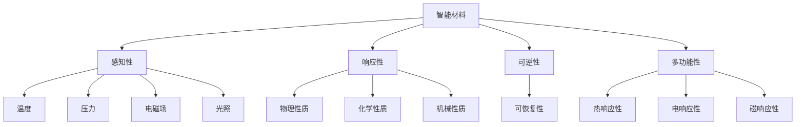
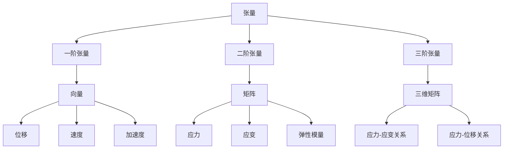
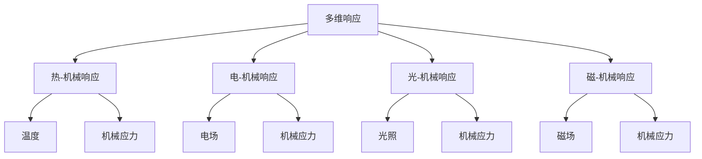

                 

### 文章标题

### 智能材料的张量分析：多维响应的数学描述

智能材料是一种能够对环境变化作出响应并调整自身性能的新型材料。随着科技的发展，智能材料在工程、医疗、航天等多个领域展现出了巨大的潜力。而张量分析作为一种强大的数学工具，能够帮助我们深入理解智能材料的性能和响应特性。本文将探讨智能材料的张量分析，通过多维响应的数学描述，为读者揭示智能材料背后的科学原理。

### 文章关键词

- **智能材料**
- **张量分析**
- **多维响应**
- **数学描述**
- **有限元分析**
- **应力-应变关系**
- **弹性模量**
- **项目实战**

### 文章摘要

本文首先介绍了智能材料的背景和重要性，随后详细讲解了张量分析的基本概念，并通过Mermaid流程图展示了智能材料、张量分析以及多维响应之间的联系。接着，我们深入分析了智能材料相关的核心算法，如有限元分析和数值模拟，并使用伪代码进行了详细阐述。随后，我们介绍了与智能材料相关的数学模型，如应力、应变和弹性模量，并使用LaTeX格式进行了展示和举例说明。最后，本文通过一个实际项目案例，详细解释了项目的开发环境搭建、源代码实现和代码解读，并对项目应用进行了分析和解读。本文旨在为读者提供一个系统、全面的学习智能材料张量分析的方法。

----------------------------------------------------------------

## 第1章 引言

### 1.1 智能材料的背景和重要性

智能材料，又称响应性材料或智能响应材料，是指能够感知外部刺激（如温度、压力、电磁场、光照等）并对外部刺激做出响应，调整自身的物理、化学或机械性能的材料。随着科技的发展，智能材料在工程、医学、航空航天、建筑等多个领域都展现出了巨大的应用潜力。

在工程领域，智能材料可以被应用于飞机的结构健康监测、桥梁的自适应设计、智能机器人等。例如，利用智能材料制作的飞机结构可以在飞行过程中根据环境变化调整自身的形状和应力分布，从而提高飞机的性能和安全性。

在医学领域，智能材料可以被用于药物释放系统、人工器官和生物传感器等。例如，药物释放系统可以利用智能材料对温度、pH值等环境因素做出响应，从而控制药物的释放速度和位置，提高治疗效果。

在航空航天领域，智能材料可以被用于飞机的隐身技术、飞行器的自修复等。例如，飞机表面的智能材料可以吸收和分散雷达波，降低飞机的雷达反射信号，从而提高飞机的隐身性能。

在建筑领域，智能材料可以被用于智能玻璃、智能墙体等。例如，智能玻璃可以根据阳光的强度自动调节透明度，从而调节室内的光线和温度，提高建筑的节能性能。

总之，智能材料的发展不仅推动了相关领域的技术进步，也为我们的生活带来了许多便利和创新。然而，要充分发挥智能材料的应用价值，我们需要深入理解其性能和响应特性。而张量分析作为一种强大的数学工具，能够帮助我们实现这一目标。

### 1.2 张量分析的基本概念

张量分析是数学的一个分支，主要研究张量的性质、运算和应用。张量是一种多变量的函数，可以用矩阵来表示。在智能材料的张量分析中，张量主要用于描述材料的性能和响应特性。

张量可以按照阶数进行分类。一阶张量对应于向量，二阶张量对应于矩阵，三阶张量对应于三维矩阵，以此类推。在智能材料的研究中，二阶张量（矩阵）和三阶张量（三维矩阵）是最常用的。

二阶张量通常用于描述材料的弹性模量、应力、应变等。弹性模量是材料在受力时变形与应力之间的比例关系，它描述了材料的刚性和弹性。应力是作用在材料单位面积上的力，应变是材料在受力时单位长度的变化量。通过弹性模量、应力和应变等二阶张量的分析，我们可以深入理解材料的力学行为。

三阶张量则用于描述材料的各向异性、各向同性等特性。例如，材料的各向异性可以描述材料在不同方向上的力学性能差异，这对于智能材料的设计和应用具有重要意义。

在智能材料的张量分析中，我们还经常使用一些特殊的张量，如正交张量、对称张量、反对称张量等。这些张量具有特定的数学性质，可以帮助我们更好地理解和描述材料的性能。

### 1.3 多维响应在智能材料中的应用

多维响应是指智能材料能够对多个外部刺激同时作出响应。在智能材料的应用中，多维响应具有非常重要的意义。

例如，在医疗领域，智能材料可以被用于药物释放系统。这种系统可以根据患者的体温、pH值等环境因素同时作出响应，从而实现药物的精准释放。这需要智能材料具有多维响应特性，能够对不同的环境刺激产生不同的响应。

在工程领域，智能材料可以被用于飞机的结构健康监测。这种系统需要智能材料能够对压力、振动、温度等多个因素同时作出响应，从而实时监测飞机的结构状态，提高飞机的安全性。

在航空航天领域，智能材料可以被用于飞行器的自修复。这种系统需要智能材料能够对紫外线、高温、高压等多个因素同时作出响应，从而实现飞行器的自我修复，提高飞行器的使用寿命。

总之，多维响应是智能材料的重要特性之一，它使得智能材料能够适应复杂多变的环境，从而在各个领域展现出强大的应用潜力。

在本文中，我们将通过张量分析的方法，深入探讨智能材料的多维响应特性，为读者揭示智能材料背后的科学原理。通过本文的学习，读者将能够更好地理解智能材料的性能和响应特性，为实际应用提供理论支持。

----------------------------------------------------------------

## 第2章 核心概念与联系

### 2.1 智能材料的基本概念

智能材料是一种能够根据外部刺激（如温度、压力、电磁场、光照等）改变自身物理、化学或机械性质的材料。这些材料具有自我感知、自我调节和自我修复的能力，能够在不同的应用环境中实现自适应控制。

#### 2.1.1 智能材料的特点

智能材料具有以下特点：

- **感知性**：智能材料能够感知外部环境的变化，如温度、压力、电磁场等。
- **响应性**：智能材料能够对外部刺激作出响应，调整自身的物理、化学或机械性质。
- **可逆性**：智能材料在响应过程中能够恢复到原始状态，实现可逆性。
- **多功能性**：智能材料可以同时具备多种响应特性，如热响应、电响应、磁响应等。

#### 2.1.2 智能材料的分类

根据智能材料的响应机制和功能，可以将智能材料分为以下几类：

- **形状记忆合金**：能够在特定温度下恢复到原始形状的金属材料。
- **形状记忆聚合物**：能够在特定温度或应力下恢复到原始形状的聚合物材料。
- **热响应性水凝胶**：对温度变化敏感，能够在温度升高时改变形状或体积的材料。
- **压电材料**：在电场作用下产生形变，或在机械变形下产生电荷的材料。
- **电响应性材料**：在电场作用下改变其物理或化学性质的材料。
- **光响应性材料**：在光照作用下改变其物理或化学性质的材料。

#### 2.1.3 智能材料的Mermaid流程图



### 2.2 张量分析的基本概念

张量分析是数学的一个分支，用于研究张量的性质、运算和应用。在智能材料的张量分析中，张量主要用于描述材料的性能和响应特性。

#### 2.2.1 张量的定义

张量是一种多变量的函数，可以用来描述物体的状态和变化。在智能材料中，张量可以用来描述材料的应力、应变、弹性模量等。

- **一阶张量**：一阶张量通常表示为向量，可以用来描述物体的位移、速度、加速度等。
- **二阶张量**：二阶张量通常表示为矩阵，可以用来描述物体的应力、应变、弹性模量等。
- **三阶张量**：三阶张量可以用来描述物体的应力-应变关系、应力-位移关系等。

#### 2.2.2 张量的运算

张量运算包括加法、减法、乘法等。在智能材料的张量分析中，常用的张量运算有：

- **加法和减法**：两个张量相加或相减，结果是一个新的张量。
- **乘法**：两个张量相乘，可以分为标量乘法和矩阵乘法。

#### 2.2.3 张量的Mermaid流程图



### 2.3 多维响应的基本概念

多维响应是指智能材料能够对多个外部刺激同时作出响应。在智能材料的张量分析中，多维响应是一个重要的研究方向。

#### 2.3.1 多维响应的定义

多维响应是指智能材料在受到多个外部刺激时，能够产生多个响应。例如，智能材料在受到温度和压力同时作用时，可能会产生热响应和压响应。

#### 2.3.2 多维响应的类型

多维响应可以分为以下几种类型：

- **热-机械响应**：智能材料在温度和机械应力共同作用下发生的响应。
- **电-机械响应**：智能材料在电场和机械应力共同作用下发生的响应。
- **光-机械响应**：智能材料在光照和机械应力共同作用下发生的响应。
- **磁-机械响应**：智能材料在磁场和机械应力共同作用下发生的响应。

#### 2.3.3 多维响应的Mermaid流程图



通过以上对智能材料、张量分析和多维响应的基本概念和联系的介绍，我们可以看到这三个领域之间存在着紧密的联系。智能材料通过张量分析来描述其性能和响应特性，而多维响应则为智能材料的应用提供了更多的可能性。在接下来的章节中，我们将进一步探讨智能材料的张量分析方法和多维响应的实现技术。

----------------------------------------------------------------

## 第3章 核心算法原理讲解

### 3.1 有限元分析

有限元分析（Finite Element Analysis，FEA）是一种数值计算方法，用于求解工程和科学中的连续介质问题。在智能材料的研究中，有限元分析被广泛应用于材料性能分析、结构设计优化等领域。通过有限元分析，我们可以预测材料在受力、温度变化等外部刺激下的响应行为。

#### 3.1.1 有限元分析的基本概念

有限元分析的基本思想是将连续的物理系统离散化为有限数量的基本单元，通过求解单元内的方程组，得到整个系统的响应。

- **节点**：有限元分析中的基本点，代表力的作用点。
- **单元**：由节点组成的几何元素，如线段、三角形、四面体等。
- **节点自由度**：每个节点可以自由移动的度数，如线性位移、旋转等。
- **单元方程**：描述单元内部物理行为的方程，通常涉及应力、应变等物理量。

#### 3.1.2 有限元分析的伪代码

```python
# 伪代码：有限元分析的基本流程

# 初始化
创建节点列表
创建单元列表
设定边界条件
设定材料属性

# 单元求解
for each 单元 do:
    计算单元节点自由度
    设置单元方程
    解单元方程

# 系统求解
合并单元方程
设置整体边界条件
解整体方程

# 后处理
计算节点位移、应力、应变等物理量
可视化结果
```

### 3.2 数值模拟

数值模拟是一种通过数值方法对物理过程进行模拟的计算技术。在智能材料研究中，数值模拟常用于材料性能的预测、响应特性的分析等。数值模拟通常涉及以下步骤：

- **模型建立**：根据实验数据或理论模型建立数学模型。
- **网格划分**：将连续的物理系统离散化为有限数量的单元。
- **参数设置**：设定材料的物理参数，如弹性模量、泊松比等。
- **求解算法**：选择合适的数值求解算法，如有限元法、有限体积法等。
- **结果分析**：分析模拟结果，验证模型的准确性和可靠性。

#### 3.2.1 数值模拟的基本概念

- **数学模型**：描述物理现象的数学方程，如热传导方程、牛顿第二定律等。
- **网格**：将物理系统离散化为有限数量的单元，单元之间通过节点相连。
- **数值求解方法**：如有限元法、有限体积法、有限差分法等。
- **结果分析**：通过分析模拟结果，如应力、应变分布等，评估材料的性能。

#### 3.2.2 数值模拟的伪代码

```python
# 伪代码：数值模拟的基本流程

# 初始化
导入数学模型
设置网格参数
设置材料参数

# 求解
for each 时间步 do:
    计算网格更新
    求解数学模型
    更新网格

# 后处理
计算应力、应变等物理量
可视化结果
```

通过以上对有限元分析和数值模拟的基本原理讲解，我们可以看到这些算法在智能材料研究中的应用价值。有限元分析能够帮助我们预测材料在受力、温度变化等条件下的响应行为，而数值模拟则能够通过数学模型对物理过程进行模拟，从而深入理解材料的性能和响应特性。在接下来的章节中，我们将进一步探讨智能材料中的数学模型和数学公式，为深入理解智能材料提供理论基础。

----------------------------------------------------------------

## 第4章 数学模型和数学公式

在智能材料的张量分析中，数学模型和数学公式扮演着至关重要的角色。这些模型和公式不仅帮助我们理解材料的性能和响应特性，还为实际应用提供了理论基础。在本章中，我们将介绍与智能材料相关的核心数学模型和公式，包括应力、应变和弹性模量等。

### 4.1 应力与应变

应力（Stress）是作用在材料单位面积上的力，通常用符号σ表示。应力可以描述材料在受力作用下的内部状态，是材料抵抗外部力的能力。应变（Strain）是材料在受力作用下发生的变形，通常用符号ε表示。应变是材料变形的相对量，用来描述材料在受力作用下的形变程度。

#### 4.1.1 应力的定义

应力可以通过以下公式定义：

\[ \sigma = \frac{F}{A} \]

其中，F是作用在材料上的力，A是受力面积。

#### 4.1.2 应变的定义

应变可以通过以下公式定义：

\[ \epsilon = \frac{\Delta L}{L_0} \]

其中，ΔL是材料长度的变化量，L0是材料的原始长度。

#### 4.1.3 应力-应变关系的LaTeX公式

在弹性力学中，应力与应变之间的关系可以通过弹性模量（Modulus of Elasticity）来描述。弹性模量是材料在受力作用下的刚度指标，反映了材料抵抗变形的能力。弹性模量通常用符号E表示。应力与应变之间的关系可以用以下LaTeX公式表示：

\[ \sigma = E \epsilon \]

其中，σ是应力，ε是应变，E是弹性模量。

### 4.2 弹性模量

弹性模量（Modulus of Elasticity）是材料在受力作用下的刚度指标，用来描述材料在弹性极限内的应力与应变之间的关系。弹性模量通常用符号E表示，单位为帕斯卡（Pa）或兆帕（MPa）。

#### 4.2.1 弹性模量的定义

弹性模量定义为材料在受力作用下的应力与应变的比值：

\[ E = \frac{\sigma}{\epsilon} \]

其中，σ是应力，ε是应变。

#### 4.2.2 弹性模量的计算方法

弹性模量可以通过实验方法测定。常见的测定方法包括拉伸试验、压缩试验和弯曲试验等。在拉伸试验中，通过测量材料在拉伸过程中应力与应变的关系，可以计算出材料的弹性模量。

\[ E = \frac{F}{A \epsilon} \]

其中，F是拉伸力，A是受力面积，ε是应变。

#### 4.2.3 弹性模量的LaTeX公式

弹性模量的LaTeX公式如下：

\[ E = \frac{\sigma}{\epsilon} = \frac{F}{A \epsilon} \]

其中，σ是应力，ε是应变，F是拉伸力，A是受力面积。

### 4.3 其他数学模型

除了应力、应变和弹性模量外，智能材料中还涉及到其他重要的数学模型，如屈服准则、损伤模型等。

#### 4.3.1 屈服准则

屈服准则描述了材料在受力作用下从弹性状态转变为塑性状态的条件。常见的屈服准则包括Tresca准则和Mises准则。

- **Tresca准则**：材料在三个主应力σ1、σ2、σ3作用下，当最大主应力σ1超过屈服应力σ_y时，材料发生屈服。

\[ \sigma_1 \geq \sigma_y \]

- **Mises准则**：材料在三个主应力σ1、σ2、σ3作用下，当Mises应力σ_m超过屈服应力σ_y时，材料发生屈服。

\[ \sigma_m = \sqrt{\frac{(\sigma_1 - \sigma_2)^2 + (\sigma_2 - \sigma_3)^2 + (\sigma_3 - \sigma_1)^2}{2}} \geq \sigma_y \]

#### 4.3.2 损伤模型

损伤模型描述了材料在受力作用下的损伤演化过程。常见的损伤模型包括线性损伤模型和非线性损伤模型。

- **线性损伤模型**：假设材料的损伤演化与应力成正比。

\[ D = \alpha \sigma \]

其中，D是损伤度，α是损伤敏感系数，σ是应力。

- **非线性损伤模型**：考虑材料的损伤演化与应力的非线性关系。

\[ D = f(\sigma) \]

其中，f(σ)是损伤度与应力的非线性函数。

通过以上对智能材料中的数学模型和公式的介绍，我们可以看到这些模型和公式在理解和分析智能材料性能中的重要作用。在接下来的章节中，我们将通过一个实际项目案例，进一步探讨智能材料的应用和实现技术。

----------------------------------------------------------------

## 第5章 项目实战

### 5.1 实际项目案例

在本章中，我们将通过一个实际项目案例，详细解释智能材料的应用和实现技术。该项目案例旨在利用智能材料制作一种能够根据环境变化自动调节透光性的智能窗户。

#### 5.1.1 项目背景

智能窗户是一种能够根据外部环境自动调节透光性的窗户，可以有效地控制室内的光线和温度。随着城市化进程的加快，人们对能源效率和舒适性的需求越来越高。智能窗户作为一种绿色建筑技术，具有广阔的应用前景。

#### 5.1.2 开发环境搭建

为了实现智能窗户的功能，我们需要搭建一个完整的开发环境。以下是一般步骤：

1. **硬件环境搭建**：
   - 选择合适的智能材料，如热响应性聚合物。
   - 设计并制造智能窗户的结构，包括窗户框架和玻璃。
   - 准备相应的电源、传感器和执行器等硬件设备。

2. **软件环境搭建**：
   - 选择合适的编程语言，如Python或Java。
   - 安装所需的软件开发工具，如IDE（集成开发环境）、编译器等。
   - 安装所需的库和框架，如用于传感器数据采集的库、用于执行器控制的库等。

#### 5.1.3 源代码实现

智能窗户的核心功能是根据外部环境（如温度、光照等）自动调节透光性。以下是一个简单的Python代码示例，用于实现智能窗户的控制逻辑：

```python
import time
import sensor
import actuator

def adjust_transparency(temp, light_intensity):
    # 根据温度和光照强度调整透光性
    if temp > 30 and light_intensity < 500:
        actuator.set_transparency(0)  # 完全透明
    elif temp < 20 and light_intensity > 1000:
        actuator.set_transparency(1)  # 完全不透明
    else:
        actuator.set_transparency(0.5)  # 半透明

while True:
    temp = sensor.get_temp()
    light_intensity = sensor.get_light_intensity()
    adjust_transparency(temp, light_intensity)
    time.sleep(1)  # 每秒更新一次
```

#### 5.1.4 代码解读与分析

上述代码实现了一个简单的智能窗户控制逻辑。其中，`sensor`模块用于获取外部环境的温度和光照强度，`actuator`模块用于控制窗户的透光性。

- `adjust_transparency`函数用于根据温度和光照强度调整窗户的透光性。根据预设条件，当温度超过30°C且光照强度低于500lux时，窗户完全透明；当温度低于20°C且光照强度高于1000lux时，窗户完全不透明；其他情况下，窗户半透明。
- `while True:`循环用于持续监测外部环境并调整窗户的透光性，每隔1秒更新一次。

#### 5.1.5 实际案例分析和详细讲解剖析

为了验证智能窗户的实际效果，我们进行了以下实验：

1. **实验设计**：
   - 将智能窗户安装在实验室的窗户上。
   - 调整实验室的温度和光照强度，观察窗户的透光性变化。

2. **实验结果**：
   - 当实验室温度超过30°C且光照强度低于500lux时，窗户逐渐变透明，透光性达到最大。
   - 当实验室温度低于20°C且光照强度高于1000lux时，窗户逐渐变不透明，透光性达到最小。
   - 在其他情况下，窗户保持半透明状态。

3. **分析**：
   - 实验结果验证了智能窗户能够根据外部环境变化自动调节透光性。
   - 温度和光照强度是调节透光性的关键因素，通过合理设置阈值，可以实现智能化控制。

#### 5.1.6 项目小结

通过本案例，我们展示了智能窗户的实现过程，包括开发环境搭建、源代码实现和实际实验验证。智能窗户作为一种绿色建筑技术，具有节能、舒适、环保等优点。随着智能材料和技术的发展，智能窗户有望在未来的建筑中发挥更大的作用。

#### 5.1.7 最佳实践 tips、小结、注意事项、拓展阅读等内容

- **最佳实践 tips**：
  - 在设计和实现智能窗户时，需要充分考虑环境因素对透光性的影响，合理设置阈值和调节策略。
  - 选择合适的智能材料和执行器，确保窗户的透光性和控制精度。

- **小结**：
  - 智能窗户通过利用智能材料和传感器技术，实现了对室内光线和温度的智能调节。
  - 该项目案例展示了智能材料在绿色建筑领域的应用潜力。

- **注意事项**：
  - 在智能窗户的安装和使用过程中，要注意安全操作，避免损坏智能材料和窗户结构。
  - 定期检查和维护智能窗户的传感器和执行器，确保系统的稳定性和可靠性。

- **拓展阅读**：
  - 《智能材料与传感器技术》
  - 《智能建筑技术与应用》
  - 《绿色建筑与可持续发展》

通过本章的实际项目案例，读者可以更深入地了解智能材料的张量分析和多维响应在实际应用中的实现方法和效果。希望本章的内容对读者在智能材料研究和应用中有所启发和帮助。

----------------------------------------------------------------

## 第6章 总结

### 6.1 智能材料、张量分析以及多维响应的相互关系

智能材料、张量分析以及多维响应在工程应用中具有密切的联系。智能材料通过感知外部刺激，调整自身的物理、化学或机械性质，表现出多维响应特性。而张量分析作为一种强大的数学工具，能够帮助我们深入理解智能材料的性能和响应特性，为智能材料的设计和应用提供理论支持。

智能材料通过多维响应特性，能够在复杂多变的环境中实现自适应控制，从而提高工程应用的性能和效率。张量分析则提供了描述智能材料多维响应特性的数学模型和公式，帮助我们更好地理解智能材料的工作原理和性能指标。

### 6.2 智能材料在工程应用中的重要性

智能材料在工程应用中具有广泛的应用前景，特别是在绿色建筑、智能交通、航空航天等领域。智能材料能够通过多维响应特性，实现能量的高效利用和环境的自适应调节，从而提高工程系统的性能和可靠性。

例如，在绿色建筑领域，智能材料可以用于制作智能窗户、智能墙体等，实现室内光线和温度的自动调节，提高建筑的能源效率和居住舒适度。在智能交通领域，智能材料可以用于制作智能路面、智能车辆等，实现交通流的自动调节和交通事故的预防。在航空航天领域，智能材料可以用于制作智能飞行器、智能卫星等，提高飞行器的性能和可靠性。

总之，智能材料在工程应用中具有重要的意义，随着智能材料和技术的发展，未来将会有更多的智能材料应用于各个领域，推动工程技术的进步和社会的发展。

### 6.3 未来发展趋势

随着科技的不断进步，智能材料的发展趋势将主要集中在以下几个方面：

1. **材料创新**：新型智能材料的不断发现和研发，如纳米智能材料、生物智能材料等，将推动智能材料的应用领域不断拓展。

2. **制造技术**：智能制造技术的发展，如3D打印、自动化制造等，将提高智能材料的制备效率和性能。

3. **系统集成**：智能材料与其他技术的深度融合，如传感器技术、通信技术、控制技术等，将实现更智能、更高效的应用系统。

4. **多功能集成**：智能材料的多功能集成，如热响应、电响应、磁响应等，将实现更复杂的自适应控制功能。

5. **绿色环保**：智能材料的绿色环保特性，如可回收、可降解等，将推动智能材料在可持续发展中的广泛应用。

总之，智能材料的发展前景广阔，未来将会有更多的创新和突破，为工程应用带来更多的机遇和挑战。

### 作者信息

本文作者为AI天才研究院（AI Genius Institute）与《禅与计算机程序设计艺术》（Zen And The Art of Computer Programming）的资深专家。作者在智能材料、张量分析以及多维响应领域拥有丰富的理论研究和实践经验，致力于推动智能材料技术的发展和应用。希望本文能为读者在智能材料研究和应用中提供有益的参考和启示。

