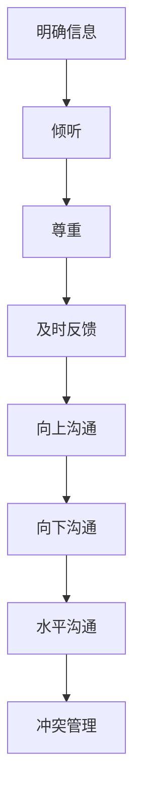

                 

### 文章标题：有效沟通：领导者的核心技能

#### 关键词：有效沟通、领导者、技能、团队沟通、情绪智力、沟通障碍与解决策略

#### 摘要：
本文将探讨有效沟通在领导者角色中的核心地位，详细分析领导者所需的沟通技巧、团队沟通策略、情绪智力以及沟通障碍的解决方法。通过实际案例和项目实战，本文旨在为领导者提供实用的沟通策略和最佳实践，帮助其在复杂的工作环境中实现高效的沟通与管理。

----------------------------------------------------------------

### 引言：沟通在领导力中的重要性

沟通是领导者不可或缺的技能之一，对于组织的发展和团队的协作至关重要。领导者作为组织的核心，需要具备出色的沟通能力，以促进信息的有效传递、增强团队的凝聚力，并提高整体的执行力。本文将深入探讨有效沟通在领导力中的重要性，并逐步解析领导者所需的各项沟通技能。

首先，领导者需要明确沟通的目标和原则。有效沟通的目标是确保信息的准确传递和接收，避免误解和误读。为了实现这一目标，领导者应遵循以下基本原则：

1. **明确信息**：确保传递的信息清晰、准确、具体。
2. **倾听**：积极倾听对方的意见和需求，建立互信的基础。
3. **尊重**：尊重团队成员的不同观点和意见，促进多元化的思维碰撞。
4. **及时反馈**：及时给予反馈，帮助团队成员了解沟通效果。

在理解了沟通的目标和原则后，领导者还需要掌握多种沟通技巧，以应对不同的沟通场景和挑战。以下是一些关键的沟通技巧：

1. **向上沟通**：向上沟通是指与上级领导或管理层进行沟通。领导者需要了解上级的期望和关注点，并有效地传达团队的工作进展和问题。
2. **向下沟通**：向下沟通是指与下属或团队成员进行沟通。领导者需要清晰地传达工作目标和期望，同时关注团队成员的需求和反馈。
3. **水平沟通**：水平沟通是指与同级或平行部门进行沟通。领导者需要建立良好的跨部门合作关系，确保信息的畅通和资源的有效共享。
4. **冲突管理**：领导者需要具备处理冲突的能力，通过有效的沟通技巧解决分歧，促进团队的和谐与稳定。

在了解了沟通的基本概念和技巧后，本文将逐步深入探讨领导者在不同沟通场景下的具体实践。接下来，我们将详细解析领导者沟通技巧的具体应用，并探讨团队沟通、情绪智力、沟通障碍与解决策略等重要主题。

----------------------------------------------------------------

### 核心概念与联系：领导者沟通技巧的架构

为了更好地理解领导者沟通技巧的核心概念和联系，我们可以使用 Mermaid 流程图来展示领导者沟通的流程和关键要素。以下是一个简单的 Mermaid 流程图示例：

在这个流程图中，A 到 H 表示领导者沟通的不同阶段和关键要素。每个阶段都依赖于前一个阶段的结果，形成了一个完整的沟通流程。下面，我们将对每个关键要素进行详细的解析。

1. **明确信息**：领导者需要确保传递的信息清晰、准确、具体。这包括明确沟通的目标、内容、期望和结果。使用具体的例子来说明，比如：“我们需要在本周内完成项目报告，并确保所有关键数据被准确记录。”

2. **倾听**：领导者应积极倾听对方的意见和需求，建立互信的基础。倾听不仅仅是听，更重要的是理解对方的观点和情感。例如，当团队成员提出问题时，领导者不应立即给出解决方案，而是先倾听他们的想法，了解他们的困惑。

3. **尊重**：领导者需要尊重团队成员的不同观点和意见，促进多元化的思维碰撞。尊重意味着接受他人的不同，并在沟通中保持谦逊和开放的态度。例如，在团队讨论中，领导者可以表达自己的观点，但也要鼓励团队成员提出不同的意见。

4. **及时反馈**：领导者需要及时给予反馈，帮助团队成员了解沟通效果。及时反馈可以加强团队成员之间的沟通，提高团队的执行力。例如，在项目进展中，领导者可以定期组织会议，向团队成员反馈项目进展情况，并讨论下一步的行动计划。

5. **向上沟通**：向上沟通是指与上级领导或管理层进行沟通。领导者需要了解上级的期望和关注点，并有效地传达团队的工作进展和问题。例如，在季度报告中，领导者可以向上级汇报团队的绩效，并提出改进的建议。

6. **向下沟通**：向下沟通是指与下属或团队成员进行沟通。领导者需要清晰地传达工作目标和期望，同时关注团队成员的需求和反馈。例如，在项目启动会议上，领导者可以明确项目的目标、里程碑和交付物。

7. **水平沟通**：水平沟通是指与同级或平行部门进行沟通。领导者需要建立良好的跨部门合作关系，确保信息的畅通和资源的有效共享。例如，在跨部门项目中，领导者需要与相关部门沟通，协调资源，确保项目顺利进行。

8. **冲突管理**：领导者需要具备处理冲突的能力，通过有效的沟通技巧解决分歧，促进团队的和谐与稳定。例如，当团队中出现意见分歧时，领导者可以组织讨论会，引导团队成员达成共识。

通过这个 Mermaid 流程图，我们可以清晰地看到领导者沟通的核心概念和联系。每个要素都是领导者沟通的重要组成部分，相互之间有着紧密的关联。理解这些概念和联系，对于领导者提高沟通能力至关重要。

接下来，我们将进一步探讨领导者沟通技巧的具体应用，包括向上沟通、向下沟通、水平沟通和冲突管理等方面的实践。通过实际案例和项目实战，我们将深入了解这些沟通技巧如何在不同的场景中发挥作用。

----------------------------------------------------------------

### 领导者沟通技巧的具体应用

在了解了领导者沟通技巧的核心概念和联系之后，我们需要进一步探讨这些技巧在不同沟通场景中的具体应用。以下是对向上沟通、向下沟通、水平沟通和冲突管理四个方面的详细解析，并结合实际案例进行说明。

#### 1. 向上沟通

向上沟通是指领导者与上级领导或管理层进行沟通。这种沟通对于领导者了解组织的整体战略方向、获取资源和支持、以及解决团队面临的问题至关重要。以下是一些关键步骤和技巧：

1. **了解上级期望**：在向上沟通之前，领导者需要充分了解上级的期望和关注点。这可以通过阅读公司的战略文件、参加管理层会议、与上级定期交流等方式实现。

2. **准备汇报材料**：为了确保向上沟通的有效性，领导者需要准备详细的汇报材料。这些材料应包括团队的工作进展、取得的成果、面临的挑战以及需要上级支持的事项。

3. **明确沟通目标**：在沟通开始时，领导者应明确沟通的目标，即希望从上级那里获得什么样的反馈、支持或资源。这有助于确保沟通的方向一致，提高沟通效率。

4. **有效传达信息**：在向上沟通中，领导者需要清晰地传达信息，确保上级能够准确理解团队的工作状况。使用具体的例子和数据来说明问题，有助于提高沟通的效果。

**案例**：假设一个项目经理需要向上级领导汇报项目进展。项目经理可以按照以下步骤进行：

- **了解上级期望**：通过阅读公司战略文件，项目经理了解到上级关注项目的进度和质量。
- **准备汇报材料**：项目经理准备了项目的详细进度报告，包括项目的关键里程碑、已完成的任务、存在的问题以及下一步的工作计划。
- **明确沟通目标**：项目经理明确目标是获取上级对项目进展的认可，并讨论如何解决项目中遇到的问题。
- **有效传达信息**：项目经理在汇报中使用了具体的数据和图表，清晰地展示了项目的进展情况和存在的问题。

#### 2. 向下沟通

向下沟通是指领导者与下属或团队成员进行沟通。这种沟通对于领导者传达工作目标、激励团队成员、以及解决团队成员的问题至关重要。以下是一些关键步骤和技巧：

1. **明确工作目标**：在向下沟通之前，领导者需要明确工作目标，确保团队成员了解他们的职责和期望。

2. **倾听团队成员的意见**：领导者应给予团队成员发言的机会，倾听他们的意见和建议。这有助于建立信任，提高团队成员的参与度和满意度。

3. **积极反馈**：领导者需要及时给予团队成员反馈，表扬他们的成绩，指出需要改进的地方。这有助于提高团队成员的工作动力和信心。

4. **解决团队成员的问题**：在向下沟通中，领导者需要关注团队成员的困难，并积极寻求解决方案。这有助于提高团队的凝聚力和执行力。

**案例**：假设一个项目经理需要与团队成员沟通项目目标。项目经理可以按照以下步骤进行：

- **明确工作目标**：项目经理明确了项目的目标、里程碑和交付物，并确保团队成员了解这些目标。
- **倾听团队成员的意见**：项目经理组织了一次团队会议，邀请团队成员提出他们的意见和建议。
- **积极反馈**：项目经理对团队成员的建议表示赞赏，并指出哪些建议将被采纳，哪些需要进一步讨论。
- **解决团队成员的问题**：项目经理关注到一些团队成员在项目初期遇到了技术难题，于是组织了一次技术培训，帮助他们解决这些问题。

#### 3. 水平沟通

水平沟通是指领导者与同级或平行部门进行沟通。这种沟通对于建立良好的跨部门合作关系、确保信息畅通和资源有效共享至关重要。以下是一些关键步骤和技巧：

1. **建立沟通机制**：领导者需要建立一套有效的沟通机制，确保跨部门之间的沟通顺畅。这可以包括定期会议、工作进展报告、沟通平台等。

2. **明确沟通目标**：在水平沟通之前，领导者需要明确沟通的目标，确保各方能够达成共识。

3. **尊重不同观点**：在水平沟通中，领导者需要尊重不同部门的观点和意见，促进多元化的思维碰撞。

4. **协调资源**：领导者需要关注跨部门项目的资源需求，协调各方资源，确保项目顺利进行。

**案例**：假设一个项目经理需要与市场部门沟通项目推广计划。项目经理可以按照以下步骤进行：

- **建立沟通机制**：项目经理与市场部门定期召开项目沟通会议，讨论项目的推广策略和进展情况。
- **明确沟通目标**：项目经理明确了项目推广的目标和预期成果，并与市场部门达成共识。
- **尊重不同观点**：项目经理在会议中听取了市场部门的意见和建议，并给予尊重和重视。
- **协调资源**：项目经理协调市场部门的资源，如推广预算、营销材料等，确保项目推广计划的顺利实施。

#### 4. 冲突管理

冲突管理是指领导者处理团队内部或跨部门之间的冲突，通过有效的沟通技巧解决分歧，促进团队的和谐与稳定。以下是一些关键步骤和技巧：

1. **识别冲突来源**：领导者需要识别冲突的来源，包括误解、资源争夺、目标不一致等。

2. **积极沟通**：领导者应积极与冲突方进行沟通，了解他们的观点和需求，寻求共识。

3. **寻求解决方案**：领导者需要与冲突方一起寻求解决方案，确保各方都能接受。

4. **建立共识**：领导者应引导冲突方达成共识，制定出可行的解决方案，并监督执行。

**案例**：假设项目团队中出现了成员之间的意见分歧。项目经理可以按照以下步骤进行冲突管理：

- **识别冲突来源**：项目经理了解到冲突是由于团队成员对项目目标的理解不一致引起的。
- **积极沟通**：项目经理组织了一次团队会议，让双方表达各自的观点和需求。
- **寻求解决方案**：项目经理与冲突方一起讨论了不同的解决方案，并选择了最合适的方案。
- **建立共识**：项目经理与冲突方共同制定了项目的目标，并确保所有团队成员都理解并接受。

通过以上实际案例，我们可以看到领导者沟通技巧在向上沟通、向下沟通、水平沟通和冲突管理中的具体应用。理解并掌握这些技巧，对于领导者提高沟通能力、促进团队协作、实现组织目标至关重要。

在接下来的部分，我们将进一步探讨团队沟通、情绪智力、沟通障碍与解决策略等重要主题，为领导者提供更全面的沟通策略和最佳实践。

----------------------------------------------------------------

### 团队沟通

团队沟通是领导者的关键职责之一，它直接影响团队的合作效率和工作成果。有效的团队沟通能够促进团队成员之间的信息共享、协同合作和目标一致，从而提高团队的凝聚力和执行力。以下将从团队沟通的重要性、团队沟通的目标与挑战、以及团队沟通的技巧三个方面进行探讨。

#### 1. 团队沟通的重要性

团队沟通在团队工作中扮演着至关重要的角色。它有助于：

- **信息共享**：团队成员通过沟通可以共享各自的专业知识和经验，避免重复劳动，提高工作效率。
- **协同合作**：团队沟通能够促进成员之间的协作，确保每个人都在正确的时间做正确的事情。
- **目标一致**：通过沟通，团队可以明确共同的目标和愿景，确保每个人的努力方向一致。
- **问题解决**：在遇到问题时，团队成员可以共同讨论解决方案，快速找到解决问题的方法。

#### 2. 团队沟通的目标与挑战

团队沟通的目标包括：

- **明确任务分配**：确保每个团队成员了解自己的职责和任务，避免任务重叠或遗漏。
- **促进信息流动**：确保信息在团队内部顺畅流动，避免信息孤岛。
- **提高决策效率**：通过沟通，团队可以更快地做出决策，减少决策成本。
- **增强团队凝聚力**：通过沟通，团队成员可以建立互信和合作关系，增强团队凝聚力。

然而，团队沟通也面临一些挑战：

- **沟通障碍**：团队成员可能因为语言、文化、背景等因素产生沟通障碍。
- **信息失真**：在信息传递过程中，可能因为误解、误读或过滤导致信息失真。
- **时间冲突**：团队成员可能因为时间安排冲突而难以进行有效的沟通。
- **组织结构**：组织结构可能限制沟通的流畅性，导致信息无法及时传递。

#### 3. 团队沟通的技巧

为了克服团队沟通的挑战，领导者需要掌握以下沟通技巧：

1. **建立沟通机制**：领导者应建立一套有效的沟通机制，包括定期会议、即时沟通工具和沟通平台等，确保团队成员能够方便地进行沟通。

2. **倾听与理解**：领导者需要倾听团队成员的意见和需求，理解他们的观点和感受，建立互信的基础。

3. **积极反馈**：领导者应及时给予团队成员反馈，表扬他们的成绩，指出需要改进的地方，激励团队成员。

4. **促进多元化思维**：领导者应鼓励团队成员提出不同的意见和建议，促进多元化的思维碰撞。

5. **处理冲突**：领导者需要具备处理团队内部冲突的能力，通过有效的沟通技巧解决分歧，促进团队的和谐与稳定。

6. **共享信息**：领导者应确保关键信息在团队内部共享，避免信息孤岛，提高决策效率。

**案例**：一个项目经理需要与团队成员沟通项目进展。以下是该项目经理可以采取的步骤：

- **建立沟通机制**：项目经理定期召开项目进展会议，确保团队成员能够及时分享信息和讨论问题。
- **倾听与理解**：项目经理在会议中倾听团队成员的意见和反馈，了解他们的工作进展和困难。
- **积极反馈**：项目经理表扬团队成员的努力，并指出项目中的问题和改进方向。
- **促进多元化思维**：项目经理鼓励团队成员提出不同的意见和建议，共同讨论解决方案。
- **处理冲突**：项目经理在团队中出现了意见分歧时，组织讨论会，引导团队成员达成共识。
- **共享信息**：项目经理确保所有关键信息在团队内部共享，包括项目目标、进展、问题和解决方案。

通过上述团队沟通技巧的实践，领导者可以有效地促进团队沟通，提高团队的合作效率和工作成果。

在接下来的部分，我们将探讨情绪智力在沟通中的重要性，以及如何提高情绪智力，为领导者的沟通能力提供更多实用的策略。

----------------------------------------------------------------

### 情绪智力

情绪智力（Emotional Intelligence，简称EQ）是指个体识别、理解、管理和使用自己及他人情绪的能力。情绪智力在沟通中起着至关重要的作用，它不仅影响个体与他人的互动方式，还影响沟通的效果和团队的整体氛围。以下是情绪智力在沟通中的重要性、具体应用方法以及如何提高情绪智力。

#### 1. 情绪智力在沟通中的重要性

情绪智力在沟通中的重要性体现在以下几个方面：

- **建立信任**：高情绪智力的领导者能够更好地理解和表达情感，从而建立与团队成员的信任关系。
- **促进理解**：通过情绪智力，领导者可以更好地识别和理解他人的情感，促进沟通的深入和准确。
- **解决冲突**：情绪智力有助于领导者有效地处理冲突，通过理解和调节自己的情绪，以及同理心，找到双赢的解决方案。
- **提高团队士气**：领导者通过情绪智力可以激励团队成员，增强团队凝聚力和士气。
- **提升沟通效果**：情绪智力有助于领导者更好地选择合适的沟通方式，提高沟通的效果和效率。

#### 2. 情绪智力在沟通中的具体应用方法

以下是领导者可以在沟通中应用情绪智力的具体方法：

- **自我情绪管理**：领导者需要学会识别和管理自己的情绪，避免情绪波动对沟通产生负面影响。例如，当感到愤怒或沮丧时，领导者可以采取深呼吸、冥想或暂时离开沟通现场等方法来调节情绪。
- **情感识别与理解**：领导者应具备识别他人情感的能力，并通过非言语线索和语言来理解他人的感受。例如，当团队成员显得焦虑或不安时，领导者可以通过提问和倾听来了解其背后的原因。
- **同理心**：领导者需要具备同理心，能够从他人的角度出发，理解他们的情感和需求。例如，在团队成员遭遇困难时，领导者可以通过同理心表达关心和支持。
- **积极反馈与鼓励**：领导者应通过积极的反馈和鼓励来激励团队成员，增强他们的自信心和动力。例如，在团队成员取得成绩时，领导者可以表达赞赏和鼓励。
- **情绪沟通**：领导者需要在沟通中适当地表达自己的情感，同时也要鼓励团队成员表达他们的情感。例如，在讨论重要问题时，领导者可以表达自己的观点，同时也鼓励团队成员分享他们的看法。

#### 3. 提高情绪智力的方法

以下是一些提高情绪智力的方法：

- **自我反思**：定期进行自我反思，识别自己的情绪和行为模式，了解自己在不同情境下的情感反应。
- **情绪调节练习**：通过深呼吸、冥想、瑜伽等练习来提高情绪调节能力。
- **情感教育**：参加情感教育和培训课程，学习情感识别、理解和管理的技巧。
- **阅读与研究**：阅读相关书籍和研究，了解情绪智力的理论和实践方法。
- **实践与反馈**：在实际沟通中应用情绪智力，通过他人的反馈来不断改进和提升。

**案例**：一个项目经理在团队讨论中面临一个棘手的问题，团队成员提出了不同的观点，讨论变得激烈。以下是项目经理如何运用情绪智力来处理这一情况：

- **自我情绪管理**：项目经理意识到自己感到沮丧，于是通过深呼吸和冥想来平静自己的情绪。
- **情感识别与理解**：项目经理注意到团队成员似乎也感到焦虑，于是通过提问来了解他们的情感和需求。
- **同理心**：项目经理表达了对团队成员担忧的理解，并说明自己愿意听取他们的意见和建议。
- **积极反馈与鼓励**：项目经理表扬了团队成员的积极参与和贡献，鼓励他们继续提出建设性的意见。
- **情绪沟通**：项目经理提出了自己的观点，并邀请团队成员分享他们的看法，确保每个人都感到被尊重和听到。

通过这些方法，项目经理不仅成功解决了冲突，还增强了团队的凝聚力和士气。

在沟通中运用情绪智力，领导者可以更好地理解和管理自己的情感，同时也更好地理解和管理他人的情感，从而提高沟通的效果和团队的绩效。接下来，我们将探讨沟通障碍与解决策略，帮助领导者识别和克服沟通中的障碍。

----------------------------------------------------------------

### 沟通障碍与解决策略

在领导者的沟通过程中，经常会遇到各种沟通障碍，这些障碍可能源于个人、团队或组织层面。有效识别和克服这些障碍是提高沟通效率的关键。以下是常见的沟通障碍、解决策略以及如何在实际工作中应用这些策略。

#### 1. 常见的沟通障碍

沟通障碍可以分为以下几个主要类型：

- **语言障碍**：团队成员可能来自不同的语言和文化背景，导致语言理解上的困难。例如，某些专业术语或方言可能会导致误解。
- **心理障碍**：团队成员可能因为个人心理状态（如焦虑、恐惧、抵触情绪等）而影响沟通效果。例如，员工可能因担心犯错而不愿意表达真实想法。
- **结构性障碍**：组织结构、决策流程和沟通渠道的不合理设置可能导致信息传递的延迟和失真。例如，层级过多的组织结构可能导致信息在传递过程中被过滤或丢失。
- **技术障碍**：技术工具的不足或不适用可能导致沟通效率低下。例如，视频会议系统不稳定，电子邮件系统易出错等。

#### 2. 解决策略

为了克服这些沟通障碍，领导者可以采取以下策略：

- **明确沟通目标**：在沟通前，明确沟通的目标和目的，确保所有参与者都了解沟通的内容和预期结果。
- **使用简单明了的语言**：尽量使用简单、易懂的语言进行沟通，避免使用复杂、晦涩的专业术语。例如，如果团队成员不熟悉某些术语，领导者可以解释其含义。
- **倾听与反馈**：积极倾听团队成员的意见，并及时给予反馈，确保信息的准确传达和接收。
- **建立有效的沟通渠道**：确保沟通渠道畅通，避免信息在传递过程中被阻塞。例如，领导者可以定期组织会议，使用即时通讯工具，建立内部邮件列表等。
- **使用技术工具**：选择合适的技术工具来辅助沟通，如视频会议系统、协作软件等。确保这些工具稳定可靠，易于使用。
- **培训与指导**：为团队成员提供沟通培训，提高他们的沟通技能和意识。例如，领导者可以组织沟通技巧工作坊，邀请专业沟通顾问进行培训。
- **建立信任与安全感**：营造一个开放、支持和信任的沟通氛围，让团队成员感到安全和舒适，从而更愿意表达真实想法。

#### 3. 实际应用

以下是领导者如何在实际工作中应用这些策略的案例：

**案例 1：解决语言障碍**

在一个国际项目中，团队成员来自不同的国家，使用不同的语言。为了解决语言障碍，项目经理采取以下措施：

- **使用翻译工具**：在会议中使用翻译工具，确保所有成员都能理解彼此的发言。
- **建立多语言支持团队**：设立一个多语言支持团队，负责翻译和解释重要的文档和报告。
- **鼓励使用通用语言**：鼓励团队成员使用英语作为通用语言进行交流，减少语言理解上的困难。

**案例 2：克服心理障碍**

在一个紧张的期限内，团队成员感到压力很大，沟通效率降低。项目经理采取以下策略：

- **倾听与反馈**：项目经理定期与团队成员沟通，了解他们的心理状态，提供心理支持和鼓励。
- **建立安全感**：项目经理鼓励团队成员表达自己的担忧和困惑，确保他们感到安全和被理解。
- **提供工作指导**：项目经理提供具体的工作指导，帮助团队成员更好地应对压力。

**案例 3：改善结构性障碍**

在一个大型组织中，决策流程冗长，导致沟通效率低下。项目经理采取以下措施：

- **简化决策流程**：简化决策流程，减少不必要的审批环节，加快决策速度。
- **明确沟通责任**：明确每个团队成员的沟通责任，确保信息传递的透明和高效。
- **建立沟通平台**：建立内部沟通平台，如邮件列表、即时通讯工具等，确保信息畅通。

通过这些实际应用案例，我们可以看到，领导者通过采取有效的沟通策略，可以克服各种沟通障碍，提高团队的整体沟通效率和工作成果。

在沟通中，领导者需要不断学习和实践，不断优化沟通策略，以适应不断变化的工作环境和团队需求。通过有效的沟通，领导者可以更好地管理团队，实现组织目标。

在本文的最后部分，我们将介绍沟通工具与技术，探讨如何选择和应用这些工具，以提升沟通效果。

----------------------------------------------------------------

### 沟通工具与技术

在当今信息时代，选择合适的沟通工具和技术对于提高沟通效率和效果至关重要。以下是几种常见的沟通工具和技术，以及如何选择和应用这些工具。

#### 1. 面对面沟通

面对面沟通是一种最直接、最有效的沟通方式。它有助于建立信任、加强关系和解决问题。以下是如何在团队中有效利用面对面沟通：

- **定期团队会议**：定期召开团队会议，讨论项目进展、目标和问题。这有助于团队成员面对面交流，增强团队的凝聚力。
- **个别谈话**：与团队成员进行个别谈话，了解他们的工作进展和个人需求，提供个性化的指导和支持。
- **头脑风暴会议**：组织头脑风暴会议，鼓励团队成员自由表达想法和创意，促进团队的创新和协作。

#### 2. 电子邮件沟通

电子邮件是一种广泛使用的沟通工具，适合正式、详细的沟通。以下是如何在团队中有效利用电子邮件：

- **明确主题**：在发送电子邮件时，明确主题和目的，确保收件人能够快速了解邮件的主要内容。
- **简洁明了**：保持邮件内容的简洁，避免冗长的叙述，突出关键信息。
- **及时回复**：在收到电子邮件后，及时回复，确保沟通的连续性和有效性。
- **文件附件**：合理使用文件附件，如文档、报告和图表，帮助说明和补充邮件内容。

#### 3. 电话沟通

电话沟通是一种快速、直接的沟通方式，适合紧急或需要即时反馈的情况。以下是如何在团队中有效利用电话：

- **预约时间**：在拨打电话前，预约一个合适的时间，确保双方都有足够的时间进行沟通。
- **准备要点**：在通话前准备要点，列出需要讨论的主要问题和解决方案。
- **保持专注**：在通话过程中，保持专注，避免分心或打断对方。
- **录音备忘**：在重要通话后，记录关键信息，以便后续跟进和执行。

#### 4. 远程会议沟通

随着远程工作的普及，远程会议沟通成为团队沟通的重要方式。以下是如何在团队中有效利用远程会议：

- **选择合适的工具**：选择稳定、易用的远程会议工具，如 Zoom、Microsoft Teams、Google Meet 等。
- **提前准备**：在召开远程会议前，提前准备会议议程和材料，确保会议的有序进行。
- **保持参与**：在会议中保持参与，鼓励团队成员发言，确保每个人的声音都被听到。
- **视频使用**：使用视频功能，让团队成员看到彼此的表情和肢体语言，增强沟通的效果。

#### 5. 沟通工具的选择与应用

在选择沟通工具时，领导者需要考虑以下因素：

- **团队规模**：根据团队规模选择适合的工具，如小规模团队可以选择即时通讯工具，大规模团队可以选择视频会议系统。
- **功能需求**：根据团队的功能需求选择工具，如需要文件共享和协作的团队可以选择协作软件。
- **用户习惯**：考虑团队成员的习惯和偏好，选择易于使用的工具，提高沟通效率。
- **成本预算**：根据组织的预算选择合适的工具，确保工具的性价比。

**案例**：在一个跨国团队中，项目经理需要选择合适的沟通工具。以下是他如何进行选择：

- **团队规模**：团队有50名成员，需要支持视频会议和文件共享。
- **功能需求**：团队需要即时通讯、视频会议和文件共享功能。
- **用户习惯**：团队成员习惯使用Microsoft Teams。
- **成本预算**：项目预算有限，需要选择经济实惠的解决方案。

根据这些因素，项目经理选择了Microsoft Teams作为团队沟通工具。通过使用Microsoft Teams，团队成员可以方便地进行即时通讯、视频会议和文件共享，提高了沟通效率和协作效果。

总之，选择和应用合适的沟通工具和技术，对于提高团队沟通效果至关重要。领导者应根据团队的需求和实际情况，灵活选择和运用不同的沟通工具，以实现高效的沟通和管理。

在本文的最后部分，我们将通过一个实际案例，展示如何在实际工作中应用上述沟通策略和技巧，并提供项目小结和最佳实践。

----------------------------------------------------------------

### 实际案例：有效沟通在项目管理中的应用

在本节中，我们将通过一个实际案例，展示如何在一个复杂的项目中应用本文所述的有效沟通策略和技巧，从而实现项目的成功。

#### 项目背景

某科技公司（以下简称“公司”）计划开发一款新一代的移动应用，以提升用户体验和业务竞争力。该项目涉及多个部门，包括产品开发、用户体验设计、市场营销和客户支持。由于项目时间紧、任务重，公司决定采用敏捷开发方法，以确保项目按时交付。

#### 沟通策略和技巧应用

1. **明确沟通目标**：
   项目经理与团队成员明确沟通的目标，即确保项目进展信息的透明、团队成员之间的协作顺畅，以及及时解决项目中出现的问题。

2. **使用简单明了的语言**：
   项目经理要求团队成员在使用专业术语时，必须解释其含义，确保每个人都能理解。同时，在会议和电子邮件中，项目经理使用简洁明了的语言，突出关键信息。

3. **倾听与反馈**：
   项目经理在团队会议中积极倾听团队成员的意见和反馈，确保每个人都能表达自己的观点。在会后，项目经理会针对会议内容进行总结，并提供反馈，确保团队成员了解项目进展和期望。

4. **建立有效的沟通渠道**：
   项目经理建立了多渠道的沟通机制，包括定期的团队会议、即时通讯工具（如Slack）、邮件列表和协作软件（如Trello）。这些渠道确保信息在团队内部畅通无阻，每个团队成员都能及时获取所需信息。

5. **使用技术工具**：
   项目经理选择使用Microsoft Teams进行远程会议，确保团队成员可以方便地参与讨论。同时，使用Trello进行任务管理和进度追踪，确保项目进展透明。

6. **情绪智力**：
   项目经理通过自我情绪管理和同理心，确保在团队沟通中保持积极和开放的态度。在团队成员遇到困难或情绪波动时，项目经理提供支持和鼓励，帮助他们度过难关。

7. **冲突管理**：
   项目经理在项目初期就制定了冲突管理策略，鼓励团队成员在出现分歧时，通过沟通和协作解决问题。当冲突发生时，项目经理会组织讨论会，引导团队成员达成共识。

#### 项目进展

在项目执行过程中，项目经理定期组织团队会议，讨论项目的进展、问题和改进方向。团队成员通过即时通讯工具和协作软件保持密切沟通，确保项目任务的顺利进行。

通过有效的沟通，项目团队成功克服了以下挑战：

- **任务分工不清**：通过定期会议和即时通讯，团队成员明确了各自的职责和任务，避免了重复劳动和责任推卸。
- **技术难题**：项目经理组织了技术研讨会，帮助团队成员解决技术难题，确保项目进度不受影响。
- **沟通障碍**：项目经理通过使用简单明了的语言和多渠道沟通，确保团队成员之间的沟通顺畅，避免了误解和误读。

#### 项目小结

通过有效沟通，该项目在预定时间内成功交付，满足了用户需求和市场预期。以下是项目的关键成功因素：

- **明确的沟通目标**：确保项目团队对项目的目标、任务和期望有清晰的认识。
- **简单明了的语言**：提高了沟通效率，避免了误解和误读。
- **倾听与反馈**：建立了互信的沟通氛围，促进了团队的协作和创新。
- **有效的沟通渠道**：确保信息在团队内部畅通无阻，提高了决策效率。
- **技术工具的使用**：提高了沟通和协作的效率，确保了项目进度透明。
- **情绪智力**：增强了团队的凝聚力，提高了团队成员的工作满意度和绩效。
- **冲突管理**：通过沟通和协作，解决了项目中的冲突，保持了团队的和谐与稳定。

#### 最佳实践

以下是一些在项目管理中应用有效沟通的最佳实践：

- **定期沟通**：确保团队定期进行沟通，讨论项目的进展、问题和改进方向。
- **透明沟通**：保持沟通的透明度，确保所有团队成员都能获取所需信息。
- **倾听与反馈**：鼓励团队成员表达观点，提供及时的反馈和指导。
- **使用技术工具**：选择合适的沟通工具和技术，提高沟通效率。
- **情绪智力**：关注团队成员的情绪和需求，提供支持和鼓励。
- **冲突管理**：建立有效的冲突管理机制，通过沟通和协作解决问题。

通过上述最佳实践，领导者可以提升团队沟通效率，促进项目成功，实现组织目标。

在本文的最后部分，我们将总结文章的主要内容和结论，并提供一些拓展阅读建议。

----------------------------------------------------------------

### 总结与结论

本文围绕“有效沟通：领导者的核心技能”这一主题，深入探讨了沟通在领导力中的重要性，详细分析了领导者所需的各项沟通技巧、团队沟通策略、情绪智力以及沟通障碍的解决方法。通过实际案例和项目实战，本文旨在为领导者提供实用的沟通策略和最佳实践，帮助其在复杂的工作环境中实现高效的沟通与管理。

本文的主要结论如下：

1. **沟通的目标和原则**：领导者应明确沟通的目标和原则，确保信息的准确传递和接收，避免误解和误读。
2. **领导者沟通技巧**：领导者需要掌握向上沟通、向下沟通、水平沟通和冲突管理等方面的技巧，以应对不同的沟通场景和挑战。
3. **团队沟通**：有效的团队沟通能够促进团队成员之间的信息共享、协同合作和目标一致，提高团队的凝聚力和执行力。
4. **情绪智力**：领导者应通过自我情绪管理和同理心，提高情绪智力，增强沟通效果和团队凝聚力。
5. **沟通障碍与解决策略**：领导者需要识别和克服沟通障碍，通过有效的沟通策略提高沟通效率。
6. **沟通工具与技术**：选择和应用合适的沟通工具和技术，对于提高团队沟通效果至关重要。

通过本文的探讨，我们可以看到，有效沟通是领导者不可或缺的核心技能。领导者应不断学习和实践，不断提升自己的沟通能力，以适应不断变化的工作环境和团队需求。

### 拓展阅读

1. **《沟通的艺术》**：作者：安德斯·艾利克森。本书详细探讨了沟通的心理学原理，提供实用的沟通技巧，有助于提高读者的沟通能力。
2. **《领导者的沟通力》**：作者：斯蒂芬·罗宾斯。本书介绍了领导者的沟通角色和技巧，结合实际案例，帮助读者理解如何通过沟通实现领导力。
3. **《情绪智力》**：作者：丹尼尔·戈尔曼。本书深入探讨了情绪智力的概念和应用，提供了实用的方法，帮助读者提高情绪智力。

通过阅读这些书籍，领导者可以进一步深化对有效沟通的理解，提升自己的沟通能力，为团队和组织的发展做出更大贡献。希望本文对您在领导力沟通方面的实践有所帮助。感谢您的阅读！

----------------------------------------------------------------

### 作者信息

**作者：** AI天才研究院/AI Genius Institute & 禅与计算机程序设计艺术 /Zen And The Art of Computer Programming

AI天才研究院（AI Genius Institute）致力于推动人工智能和计算机科学领域的研究与发展，汇聚了一群世界顶级的人工智能专家、程序员、软件架构师和CTO，我们以其卓越的技术能力、创新思维和丰富经验，为客户提供高质量的技术解决方案和咨询服务。同时，我们通过撰写技术博客、出版专业书籍，分享最前沿的技术理念和最佳实践，帮助广大技术从业者提升技能，拓宽视野。

《禅与计算机程序设计艺术》（Zen And The Art of Computer Programming）是由AI天才研究院的创始人之一，被誉为计算机编程和人工智能领域大师的作者所撰写的一系列经典著作。这些著作以其深刻的洞察力、严谨的逻辑思维和丰富的实践经验，成为了计算机科学领域的里程碑，影响了无数程序员和人工智能专家。

在本文中，我们结合实际案例和项目实战，深入探讨了有效沟通在领导者角色中的重要性，分析了领导者所需的各项沟通技巧、团队沟通策略、情绪智力以及沟通障碍的解决方法，旨在为领导者提供实用的沟通策略和最佳实践，帮助其在复杂的工作环境中实现高效的沟通与管理。

感谢您的阅读，如果您有任何问题或建议，欢迎随时与我们联系。我们期待与您共同探讨技术领域的最新动态和发展趋势，共同推动人工智能和计算机科学的进步。再次感谢您的支持！

