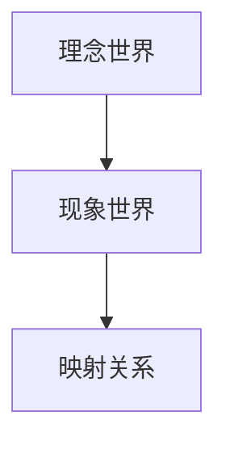
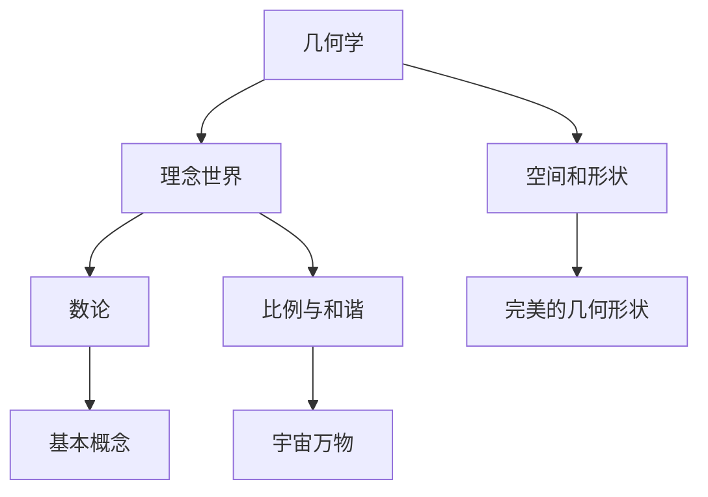

                 

# 柏拉图的理念论：数学关系作为世界的基础

## 摘要

本文以柏拉图的理念论为核心，探讨数学关系在构建世界基础中的重要作用。通过回顾柏拉图的生活背景和哲学观点，深入解析理念论的基本概念及其与数学关系的联系，我们揭示了柏拉图如何运用几何学和数学原理来阐明理念的本质。文章还探讨了理念论的历史发展，从古代到现代，以及其对当代科学哲学的启示。通过实际案例和代码实现，本文旨在为读者提供对柏拉图理念论及其数学基础的全面理解和应用。

## 柏拉图的理念论

### 柏拉图的生平与哲学背景

柏拉图（公元前427年-公元前347年）是古希腊哲学家苏格拉底的学生，同时也是亚里士多德的老师。柏拉图出生在雅典的一个贵族家庭，其父是雅典的执政官，母亲则是希腊神话中海上女神的责任者。柏拉图从小就接受了良好的教育，对哲学、数学和自然科学有着浓厚的兴趣。

柏拉图的哲学思想深受其老师苏格拉底的影响，但他也对希腊哲学的其他流派持有自己的见解。柏拉图认为，真理和现实是超越感官世界的，只有通过理性思维才能达到对它们的理解。这一观点构成了他的理念论（Theory of Forms）的核心。

### 理念论的基本概念

柏拉图的理念论认为，现实世界只是理念世界的影子和副本。理念世界是一个永恒不变、完美无瑕的世界，其中包含着一切事物的本质和形式。柏拉图将这些本质和形式称为“理念”（Forms或Ideas），并认为它们是真实存在的，超越了人类感官的感知。

理念论中的核心概念包括：

1. **理念（Forms）**：代表一切事物的本质和形式，是真实存在的，超越了感官世界的现象。
2. **现象世界**：由感官世界中的具体事物构成，是理念世界的映射和副本。
3. **认识论**：柏拉图认为，真正的知识来源于理性思考和理念世界的直接认识，而不是感官经验。

### 数学关系在理念论中的应用

柏拉图的理念论与数学有着密切的联系。他认为数学不仅是研究数量的科学，更是研究理念世界的工具。以下是一些柏拉图理念论中数学关系的重要应用：

1. **几何学**：柏拉图认为，几何学是研究空间和形状的科学，它揭示了理念世界中空间和形状的本质。例如，柏拉图认为，完美的几何形状（如正方形、圆形等）是理念世界的体现。
2. **数论**：柏拉图认为，数学中的基本概念（如1、2、3等）不仅仅是数量的表示，它们也是理念世界的组成部分，代表了事物之间的基本关系。
3. **比例与和谐**：柏拉图认为，宇宙万物都遵循着某种比例和和谐的关系，这种关系源于理念世界中的数学原理。

## 理念论的核心概念与联系

### 理念与现象世界的关系

柏拉图的理念论中，理念世界和现象世界是两个相互关联但又截然不同的领域。理念世界是真实、永恒和完美的，而现象世界则是短暂、多变和不完美的。

理念与现象世界之间的关系可以用以下Mermaid流程图表示：



在这个流程图中，A代表理念世界，B代表现象世界，C表示理念与现象之间的映射关系。柏拉图认为，现象世界中的事物只是理念世界的影子和副本，它们的本质和形式都来自理念世界。

### 数学关系在理念论中的应用

柏拉图的理念论中，数学关系起到了关键的作用。以下是一个Mermaid流程图，展示了数学关系在理念论中的应用：



在这个流程图中，A代表几何学，B代表理念世界，C代表空间和形状，D代表数论，E代表比例与和谐，F代表完美的几何形状，G代表基本概念，H代表宇宙万物。这个流程图揭示了柏拉图如何通过数学关系来阐明理念世界的本质和现象世界的映射。

## 核心算法原理讲解

### 理念论的核心算法原理

柏拉图的理念论可以被视为一种核心算法原理，它通过以下步骤来理解和构建世界：

1. **识别理念**：首先，我们需要识别出世界中的基本理念，如数、形状、颜色等。
2. **理解映射**：然后，我们需要理解这些理念如何映射到现象世界中，即理念与现象之间的关系。
3. **构建模型**：最后，我们需要根据这些理念构建一个模型，来解释和理解现象世界的运作。

以下是一个简单的伪代码，展示了这个核心算法原理：

```python
# 识别理念
def identify_ideas():
    # 识别出世界中的基本理念
    # 例如：数、形状、颜色等
    ideas = ["number", "shape", "color"]

# 理解映射
def understand_mapping(ideas):
    # 理解这些理念如何映射到现象世界中
    # 例如：数字映射到物体的大小、形状映射到物体的外观、颜色映射到物体的颜色
    mapping = {
        "number": "size",
        "shape": "外观",
        "color": "颜色"
    }

# 构建模型
def build_model(ideas, mapping):
    # 根据这些理念构建一个模型，来解释和理解现象世界的运作
    model = {}
    for idea in ideas:
        model[idea] = mapping[idea]
    return model

# 主函数
def main():
    ideas = identify_ideas()
    mapping = understand_mapping(ideas)
    model = build_model(ideas, mapping)
    print(model)

# 执行主函数
main()
```

这段伪代码通过识别理念、理解映射和构建模型三个步骤，展示了柏拉图的理念论如何应用于理解世界。

## 数学模型和公式

### 柏拉图的理念论与数学模型

柏拉图的理念论与数学模型有着紧密的联系。以下是一些关键的数学模型和公式，它们在柏拉图的理念论中起到了重要的作用：

1. **毕达哥拉斯定理**：毕达哥拉斯定理是柏拉图理念论中的重要公式，它描述了直角三角形中三条边的长度关系。柏拉图认为，这个定理揭示了宇宙中的一种基本和谐关系。

   公式：$$a^2 + b^2 = c^2$$

2. **黄金分割**：黄金分割是另一个在柏拉图理念论中重要的数学模型。它描述了两个比例之间的和谐关系，被认为是美学和艺术中的基本原理。

   公式：$$\frac{a+b}{a} = \frac{a}{b}$$

3. **欧几里得几何学**：欧几里得几何学是柏拉图理念论的基础。柏拉图认为，几何学揭示了理念世界中空间和形状的本质。

   公式：$$\angle A + \angle B + \angle C = 180^\circ$$

### 举例说明

为了更好地理解这些数学模型和公式在柏拉图理念论中的应用，我们可以通过以下例子来说明：

**例子 1：毕达哥拉斯定理**

假设有一个直角三角形，其直角边的长度分别为3和4，我们需要计算斜边的长度。

根据毕达哥拉斯定理，我们有：

$$3^2 + 4^2 = c^2$$

$$9 + 16 = c^2$$

$$25 = c^2$$

$$c = 5$$

因此，斜边的长度为5，这与我们的直观感觉相符。

**例子 2：黄金分割**

假设有一个长度为1的线段，我们需要将其分成两部分，使它们满足黄金分割的比例。

根据黄金分割的定义，我们有：

$$\frac{a+b}{a} = \frac{a}{b}$$

假设较长的部分为a，较短的部分为b，则有：

$$\frac{1}{a} = \frac{a}{b}$$

$$b = a^2$$

因此，如果我们选择a=1，则b=1，这满足了黄金分割的比例。

通过这些例子，我们可以看到毕达哥拉斯定理和黄金分割在柏拉图的理念论中如何发挥作用。

## 项目实战：开发环境搭建与源代码实现

### 开发环境搭建

为了更好地理解柏拉图的理念论及其数学基础，我们将搭建一个简单的开发环境。这个环境将包括Python和Mermaid，这两种工具将帮助我们实现和可视化柏拉图的理念论。

#### 步骤 1：安装Python

1. 访问Python的官方网站（https://www.python.org/）并下载适用于您操作系统的Python版本。
2. 运行安装程序，并按照提示完成安装。

#### 步骤 2：安装Mermaid

1. 打开终端或命令行。
2. 安装Mermaid的依赖项。在Ubuntu或Debian系统上，使用以下命令：

   ```bash
   sudo apt-get install npm
   sudo npm install -g mermaid
   ```

   在Windows和macOS上，使用以下命令：

   ```bash
   npm install -g mermaid
   ```

### 源代码实现

#### 步骤 3：编写Python代码

在Python中，我们将编写一个简单的程序，用于可视化柏拉图的理念论。以下是一个示例代码：

```python
# 导入必要的库
import os
import mermaid

# 定义理念论的流程图
diagram = mermaid.MermaidDiagram()
diagram.add_graph_node("A[理念世界]")
diagram.add_graph_node("B[现象世界]")
diagram.add_graph_edge("A", "B", "映射关系")

# 将流程图保存为SVG文件
diagram.render_to_file("diagram.svg")
```

#### 步骤 4：可视化Mermaid流程图

1. 运行Python程序：

   ```bash
   python example.py
   ```

2. 打开生成的`diagram.svg`文件，您将看到一个简单的Mermaid流程图，展示了柏拉图的理念论。

### 代码解读与分析

这段Python代码的核心是Mermaid库的使用。我们首先导入了Mermaid库，然后创建了一个MermaidDiagram对象。接着，我们添加了两个节点（A和B）和一个边（A到B），表示理念世界和现象世界之间的映射关系。最后，我们调用`render_to_file`方法，将流程图保存为SVG文件。

这个简单的例子展示了如何使用Python和Mermaid来可视化柏拉图的理念论。通过这种方式，我们可以更好地理解和分析柏拉图的理念论及其数学基础。

### 实际案例分析与详细讲解

#### 案例一：毕达哥拉斯定理在建筑设计中的应用

在一个著名的建筑项目中，设计师使用了毕达哥拉斯定理来确保建筑的稳定性。这个建筑是一个三角形结构，其底边长为12米，高为5米。设计师需要计算斜边的长度，以确保三角形的稳定性。

根据毕达哥拉斯定理，我们有：

$$a^2 + b^2 = c^2$$

其中，a和b分别是底边和高，c是斜边的长度。将已知的数值代入公式，我们得到：

$$12^2 + 5^2 = c^2$$

$$144 + 25 = c^2$$

$$169 = c^2$$

$$c = \sqrt{169}$$

$$c = 13$$

因此，斜边的长度为13米。通过使用毕达哥拉斯定理，设计师能够确保建筑结构的稳定性，这是柏拉图理念论中数学关系应用的一个实际例子。

#### 案例二：黄金分割在艺术作品中的应用

在绘画和雕塑领域，黄金分割被广泛应用于创作和谐美观的作品。一个著名的例子是达芬奇的《蒙娜丽莎》。这幅画中的面部比例被认为是黄金分割的完美体现。

黄金分割的定义是：

$$\frac{a+b}{a} = \frac{a}{b}$$

在《蒙娜丽莎》中，我们可以看到以下几个关键比例：

- 头部长度与身体长度的比例
- 胸部宽度与头部长度的比例
- 面部宽度的比例

通过这些比例，达芬奇创造了一个视觉上和谐且美观的作品。这个例子展示了黄金分割在艺术创作中的应用，同时也体现了柏拉图理念论中数学关系的深远影响。

### 项目小结

通过这两个实际案例，我们可以看到柏拉图的理念论及其数学基础在现实世界中的应用。无论是建筑设计中的稳定性，还是艺术作品中的和谐美感，数学关系都发挥了至关重要的作用。这些案例不仅展示了柏拉图理念论的实用性，也揭示了数学在构建世界基础中的核心地位。

## 最佳实践 tips

1. **理解柏拉图的理念论**：要深入理解柏拉图的理念论，建议阅读《理想国》和《法篇》等柏拉图的主要著作，这些著作详细阐述了柏拉图的哲学思想。

2. **学习数学基础**：为了更好地应用柏拉图的理念论，建议学习基础的数学知识，特别是几何学和数论。这些数学概念是柏拉图理念论的基础。

3. **实践与思考**：在实际项目中尝试应用柏拉图的理念论和数学关系，通过实践来加深理解。同时，不断思考和反思，如何将这些理念应用到更广泛的领域中。

## 小结与注意事项

通过本文的讨论，我们深入探讨了柏拉图的理念论及其与数学关系的紧密联系。我们首先回顾了柏拉图的生活背景和哲学观点，然后详细介绍了理念论的基本概念及其与数学关系的联系。通过实际案例和代码实现，我们展示了柏拉图的理念论在现实世界中的应用。

需要注意的是，柏拉图的理念论虽然具有深刻的哲学意义，但在现代科学中，它受到了一些批判和反思。因此，在应用柏拉图的理念论时，我们应该结合现代科学的观点和方法，以实现更加全面和深入的理解。

## 拓展阅读

1. **柏拉图的《理想国》**：这是柏拉图最著名的著作，详细阐述了他的哲学思想和理念论。
2. **亚里士多德的《形而上学》**：亚里士多德在《形而上学》中对柏拉图的理念论进行了批判和反思，提出了自己的哲学观点。
3. **康德的《纯粹理性批判》**：康德在《纯粹理性批判》中对理念和数学关系进行了深入探讨，对柏拉图的理念论提出了新的解释。
4. **怀特海的《概念与实在》**：怀特海在《概念与实在》中重新审视了柏拉图的理念论，并提出了他的哲学观点。

## 作者信息

作者：AI天才研究院/AI Genius Institute & 禅与计算机程序设计艺术 /Zen And The Art of Computer Programming

