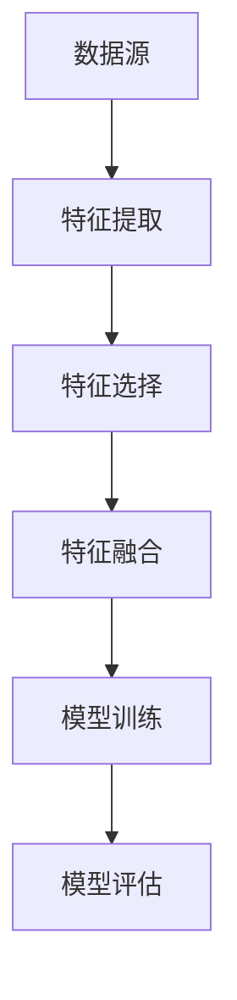

                 

### 步骤 1: 设计第1章 - 模式识别基础理论

**第1章 模式识别基础理论**

模式识别作为人工智能领域的一个重要分支，其主要任务是从数据中提取有用的信息，并通过一定的算法对数据进行分析和分类。本章我们将对模式识别的基础理论进行深入探讨，旨在为后续章节的深入学习奠定坚实的理论基础。

**1.1 模式识别概述**

**1.1.1 模式识别的定义**

模式识别是指利用计算机技术对数据进行分析和处理，以识别和分类数据中的特定模式或特征。模式识别广泛应用于图像处理、语音识别、文本分析、生物特征识别等多个领域。

**1.1.2 模式识别的应用领域**

模式识别在各个领域都有广泛的应用，包括但不限于以下几个方面：

1. 图像识别：如人脸识别、物体检测、图像分类等。
2. 语音识别：如语音合成、语音识别、语音搜索等。
3. 文本分析：如情感分析、文本分类、信息检索等。
4. 生物特征识别：如指纹识别、虹膜识别、人脸识别等。

**1.1.3 模式识别的历史发展**

模式识别的发展可以追溯到20世纪50年代，随着计算机技术的飞速发展，模式识别逐渐成为人工智能研究的重要方向。早期的模式识别主要依赖于统计方法和规则推理，随着深度学习的兴起，神经网络在模式识别中的应用得到了极大的推广。

**1.2 基本概念**

**1.2.1 特征提取**

特征提取是模式识别过程中至关重要的一步，其主要任务是从原始数据中提取出能够表征数据特征的信息。常见的特征提取方法包括颜色特征、纹理特征、形状特征等。

**1.2.2 分类器设计**

分类器是模式识别中的核心组件，其任务是根据特征向量对数据进行分类。常见的分类器包括支持向量机（SVM）、决策树（DT）、随机森林（RF）等。

**1.2.3 评估指标**

评估指标是衡量模式识别算法性能的重要工具。常见的评估指标包括准确率（Accuracy）、精确率（Precision）、召回率（Recall）等。

**1.3 主要模式识别方法**

**1.3.1 统计模式识别**

统计模式识别主要基于统计学理论，通过计算数据之间的相似度或距离来识别模式。常见的统计模式识别方法包括贝叶斯分类器、线性判别分析（LDA）等。

**1.3.2 结构模式识别**

结构模式识别主要关注数据之间的结构关系，通过构建模型来描述数据之间的关联性。常见的结构模式识别方法包括隐马尔可夫模型（HMM）、条件随机场（CRF）等。

**1.3.3 动态模式识别**

动态模式识别主要针对时间序列数据进行分析，通过捕捉数据在时间维度上的变化规律来识别模式。常见的动态模式识别方法包括递归神经网络（RNN）、长短时记忆网络（LSTM）等。

**1.4 模式识别的挑战与未来发展趋势**

随着大数据时代的到来，模式识别面临着巨大的挑战和机遇。如何处理海量数据、提高识别精度、降低计算复杂度等是当前模式识别研究的热点问题。未来，模式识别将继续朝着多模态融合、深度学习、自适应学习等方向发展。

### 第1章 模式识别基础理论

**1.1 模式识别概述**

**1.1.1 模式识别的定义**

模式识别是指通过计算机或其他电子设备对数据进行分析和处理，以识别和分类数据中的特定模式或特征。这个过程通常包括以下步骤：

1. 数据收集：收集包含感兴趣模式的数据。
2. 数据预处理：对收集到的数据进行清洗、归一化等处理。
3. 特征提取：从预处理后的数据中提取出能够表征数据特征的信息。
4. 模型训练：使用提取到的特征训练分类模型。
5. 模型评估：对训练好的模型进行评估，以确定其性能。
6. 模型应用：将训练好的模型应用于新的数据，以识别或分类数据中的模式。

**1.1.2 模式识别的应用领域**

模式识别的应用领域非常广泛，主要包括以下几个方面：

1. 图像识别：包括人脸识别、物体检测、图像分类等。
2. 语音识别：包括语音合成、语音识别、语音搜索等。
3. 文本分析：包括情感分析、文本分类、信息检索等。
4. 生物特征识别：包括指纹识别、虹膜识别、人脸识别等。
5. 医学诊断：通过分析医学图像或患者数据，进行疾病诊断和预测。
6. 金融风控：通过分析交易数据和行为模式，进行风险控制和欺诈检测。

**1.1.3 模式识别的历史发展**

模式识别的发展可以追溯到20世纪50年代。当时，计算机科学刚刚起步，研究者开始探索如何利用计算机来处理和识别数据中的模式。早期的模式识别主要依赖于简单的规则和逻辑推理，如决策树和规则归纳。

随着计算机性能的不断提升和算法的不断发展，模式识别领域逐渐成熟。20世纪80年代，统计模式识别和机器学习开始崭露头角，研究者开始利用统计方法和概率模型来识别数据中的模式。

近年来，随着深度学习的兴起，模式识别迎来了新的发展机遇。深度学习通过多层神经网络，能够自动从大量数据中学习特征，并在图像识别、语音识别、自然语言处理等领域取得了显著的成果。

**1.2 基本概念**

**1.2.1 特征提取**

特征提取是模式识别中的关键步骤，其目的是从原始数据中提取出能够表征数据特征的信息。特征提取的质量直接影响模式识别的性能。常用的特征提取方法包括：

1. 颜色特征：通过计算图像的颜色直方图、主成分分析（PCA）等方法提取颜色特征。
2. 纹理特征：通过计算图像的纹理直方图、Gabor特征等方法提取纹理特征。
3. 形状特征：通过计算图像的边界、角点、轮廓等特征提取形状特征。
4. 声音特征：通过计算声音信号的频谱、梅尔频率倒谱系数（MFCC）等方法提取声音特征。
5. 文本特征：通过计算文本的词频、词袋模型、TF-IDF等方法提取文本特征。

**1.2.2 分类器设计**

分类器是模式识别中的核心组件，其任务是根据特征向量对数据进行分类。分类器的性能直接影响模式识别的准确性。常见的分类器包括：

1. 统计分类器：如线性判别分析（LDA）、支持向量机（SVM）等。
2. 决策树分类器：如C4.5、ID3等。
3. 集成分类器：如随机森林（RF）、梯度提升树（GBDT）等。
4. 深度学习分类器：如卷积神经网络（CNN）、循环神经网络（RNN）等。

**1.2.3 评估指标**

评估指标是衡量模式识别算法性能的重要工具。常用的评估指标包括：

1. 准确率（Accuracy）：正确分类的样本数占总样本数的比例。
2. 精确率（Precision）：正确分类为正类的样本数与总分类为正类的样本数的比例。
3. 召回率（Recall）：正确分类为正类的样本数与实际为正类的样本数的比例。
4. F1分数（F1 Score）：精确率和召回率的调和平均值。
5. 精确率-召回率曲线（Precision-Recall Curve）：用于评估分类器在不同召回率下的精确率。

**1.3 主要模式识别方法**

**1.3.1 统计模式识别**

统计模式识别是基于统计学理论的方法，通过计算数据之间的相似度或距离来识别模式。常见的统计模式识别方法包括：

1. 贝叶斯分类器：基于贝叶斯定理，通过计算特征向量与各个类别的条件概率来预测类别。
2. 线性判别分析（LDA）：通过最大化不同类别之间的分离度，最小化类别内部差异，来确定最佳分类超平面。
3. 支持向量机（SVM）：通过找到一个最优的超平面，使得类别之间的边界最大化。
4. 决策树：通过一系列的判断条件，将数据划分为不同的类别。

**1.3.2 结构模式识别**

结构模式识别关注数据之间的结构关系，通过构建模型来描述数据之间的关联性。常见的结构模式识别方法包括：

1. 隐马尔可夫模型（HMM）：通过状态转移概率和观测概率来描述时间序列数据。
2. 条件随机场（CRF）：通过计算条件概率来描述序列数据中的依赖关系。
3. 马尔可夫网络：通过构建图模型来描述数据之间的依赖关系。

**1.3.3 动态模式识别**

动态模式识别主要针对时间序列数据进行分析，通过捕捉数据在时间维度上的变化规律来识别模式。常见的动态模式识别方法包括：

1. 递归神经网络（RNN）：通过循环结构来处理序列数据，捕捉时间维度上的依赖关系。
2. 长短时记忆网络（LSTM）：在RNN的基础上引入门控机制，能够有效捕捉长序列依赖关系。
3. 卷积神经网络（CNN）：通过卷积操作来提取时间序列的特征，适用于处理高维时间序列数据。

**1.4 模式识别的挑战与未来发展趋势**

随着大数据时代的到来，模式识别面临着巨大的挑战和机遇。以下是一些主要的挑战和未来发展趋势：

1. 数据量增长：随着数据量的急剧增加，如何高效地处理和分析海量数据成为关键问题。
2. 数据多样性：现实世界中的数据具有多样性，包括图像、文本、语音等多种类型，如何有效地融合不同类型的数据进行模式识别是一个挑战。
3. 模型可解释性：深度学习等复杂模型在模式识别中取得了显著成果，但其内部机制往往难以解释，如何提高模型的可解释性是一个重要问题。
4. 实时性：在一些应用场景中，如实时语音识别、实时图像识别等，如何提高模型的实时性是一个挑战。

未来，模式识别将继续朝着多模态融合、深度学习、自适应学习等方向发展。多模态融合将不同类型的数据进行有效融合，提高模式识别的性能；深度学习将不断改进模型结构和训练算法，提高模型的准确性和可解释性；自适应学习将使模型能够根据新的数据和环境自适应地调整，提高模型的适应性和鲁棒性。

总之，模式识别作为人工智能领域的一个重要分支，具有广泛的应用前景和重要的理论意义。随着技术的不断进步，模式识别将在更多领域发挥重要作用，为人类社会带来更多的便利和智慧。### 第2章 自然特征提取

**2.1 图像特征提取**

图像特征提取是模式识别中的一个重要环节，其目标是从图像数据中提取出能够表征图像内容和属性的关键信息。以下是一些常见的图像特征提取方法：

1. **颜色特征**：
   - **颜色直方图**：将图像分为多个颜色通道，计算每个通道的像素分布。
   - **颜色矩**：颜色特征的数学描述，包括颜色均值、方差、协方差等。
   - **颜色集合**：将颜色特征表示为集合，如颜色关键词或颜色空间中的点。

2. **纹理特征**：
   - **纹理直方图**：计算图像纹理的分布。
   - **Gabor特征**：基于Gabor滤波器提取纹理特征。
   - **结构元素**：使用结构元素进行图像变换，提取纹理特征。

3. **形状特征**：
   - **边界**：计算图像的边界轮廓。
   - **角点**：检测图像中的角点，用于描述图像的局部特征。
   - **区域**：计算图像区域内的几何特征，如面积、周长等。

**2.2 声音特征提取**

声音特征提取是将声音信号转换为可用于模式识别的数字特征的过程。以下是一些常用的声音特征提取方法：

1. **时域特征**：
   - **频率分布**：计算声音信号的频率分布。
   - **幅度分布**：计算声音信号的幅度分布。

2. **频域特征**：
   - **傅里叶变换**（Fourier Transform, FT）：将时域信号转换为频域信号。
   - **梅尔频率倒谱系数**（Mel-Frequency Cepstral Coefficients, MFCC）：基于频域特征，用于语音识别。

3. **时频特征**：
   - **短时傅里叶变换**（Short-Time Fourier Transform, STFT）：分析声音信号在短时间内的频率分布。
   - **波普特图**（Wavelet Transform）：用于多分辨率分析。

**2.3 文本特征提取**

文本特征提取是将文本数据转换为适用于机器学习算法的数字特征的过程。以下是一些常见的文本特征提取方法：

1. **词袋模型**：
   - **词频**：计算文本中每个单词的出现次数。
   - **二值词袋**：将词频转换为二值特征。

2. **TF-IDF**：
   - **词频-逆文档频率**：结合词频和文档频率，用于表示单词的重要性。

3. **词嵌入**：
   - **词嵌入模型**：将单词映射到高维空间中，如Word2Vec、GloVe等。

**2.4 视频特征提取**

视频特征提取是将视频数据转换为适用于机器学习算法的数字特征的过程。以下是一些常见的视频特征提取方法：

1. **帧间特征**：
   - **光流**：计算视频帧之间的像素位移。
   - **运动向量**：描述视频帧之间的运动变化。

2. **帧内特征**：
   - **颜色特征**：提取视频帧的颜色特征。
   - **纹理特征**：提取视频帧的纹理特征。
   - **形状特征**：提取视频帧的形状特征。

3. **语音字幕提取**：
   - **语音识别**：将视频中的语音转换为文本。
   - **字幕生成**：将语音识别结果转换为字幕。

### 自然特征提取的核心概念和联系

在自然特征提取中，核心概念包括特征提取、特征选择和特征融合。以下是一个简单的Mermaid流程图，描述了这些概念之间的联系：



1. **特征提取**：从原始数据中提取出能够表征数据特征的信息。
2. **特征选择**：从提取到的特征中筛选出对分类任务最有帮助的特征。
3. **特征融合**：将多个特征进行组合，以提高模型的性能。
4. **模型训练**：使用提取到的特征对模型进行训练。
5. **模型评估**：评估模型的性能，包括准确率、精确率、召回率等。

通过这个流程，我们可以看到自然特征提取在模式识别中的作用和重要性。特征提取的质量直接影响模型的性能，而特征选择和特征融合则有助于提高模型的准确性和鲁棒性。

### 数学模型和算法

在模式识别中，数学模型和算法是实现特征提取、分类和预测的关键。以下是一些常用的数学模型和算法：

#### 1. 统计模式识别算法

**1.1 贝叶斯分类器**

贝叶斯分类器是基于贝叶斯定理的一种分类算法。其核心思想是通过计算特征向量与各个类别的条件概率来预测类别。

**贝叶斯分类器的伪代码：**

```python
def naive_bayes(train_data, train_labels):
    # 计算先验概率
    prior_probabilities = compute_prior_probabilities(train_labels)
    
    # 计算条件概率
    conditional_probabilities = compute_conditional_probabilities(train_data, train_labels)
    
    # 预测类别
    predictions = []
    for feature_vector in test_data:
        probabilities = []
        for class_label in class_labels:
            probability = prior_probabilities[class_label]
            for feature in feature_vector:
                probability *= conditional_probabilities[class_label][feature]
            probabilities.append(probability)
        predictions.append(max(probabilities))
    return predictions
```

**1.2 支持向量机（SVM）**

支持向量机是一种经典的分类算法，其目标是在高维空间中找到一个最佳的超平面，使得类别之间的边界最大化。

**SVM的伪代码：**

```python
def svm(train_data, train_labels):
    # 训练SVM模型
    model = train_svm_model(train_data, train_labels)
    
    # 预测类别
    predictions = []
    for feature_vector in test_data:
        prediction = model.predict([feature_vector])
        predictions.append(prediction)
    return predictions
```

**1.3 决策树**

决策树是一种基于树结构的分类算法，其核心思想是通过一系列的判断条件将数据划分为不同的类别。

**决策树的伪代码：**

```python
def decision_tree(train_data, train_labels):
    # 构建决策树模型
    model = build_decision_tree(train_data, train_labels)
    
    # 预测类别
    predictions = []
    for feature_vector in test_data:
        prediction = model.predict([feature_vector])
        predictions.append(prediction)
    return predictions
```

#### 2. 结构模式识别算法

**2.1 匹配模板**

匹配模板是一种基于模板匹配的识别算法，其核心思想是将模板与输入数据进行匹配，找到最佳匹配位置。

**匹配模板的伪代码：**

```python
def template_matching(template, image):
    # 初始化匹配得分
    max_score = 0
    max_position = None
    
    # 遍历图像的所有位置
    for i in range(image_height - template_height + 1):
        for j in range(image_width - template_width + 1):
            score = 0
            for m in range(template_height):
                for n in range(template_width):
                    if template[m, n] == image[i + m, j + n]:
                        score += 1
            if score > max_score:
                max_score = score
                max_position = (i, j)
    
    return max_position
```

**2.2 规则归纳**

规则归纳是一种基于规则的学习算法，其核心思想是从训练数据中归纳出规则，用于分类或预测。

**规则归纳的伪代码：**

```python
def rule_induction(train_data, train_labels):
    # 构建规则
    rules = []
    for label in unique_labels:
        rule = []
        for feature in features:
            rule.append((feature, label))
        rules.append(rule)
    
    # 训练模型
    model = train_model(rules, train_data, train_labels)
    
    # 预测类别
    predictions = []
    for feature_vector in test_data:
        prediction = model.predict([feature_vector])
        predictions.append(prediction)
    return predictions
```

#### 3. 动态模式识别算法

**3.1 自组织映射（SOM）**

自组织映射是一种无监督学习算法，其核心思想是通过竞争学习方式，将输入数据映射到低维空间中，同时保持输入数据的结构信息。

**自组织映射的伪代码：**

```python
def som(train_data):
    # 初始化网络
    network = initialize_network(train_data)
    
    # 训练网络
    for epoch in range(num_epochs):
        for feature_vector in train_data:
            winner = find_winner(network, feature_vector)
            update_weights(network, winner, feature_vector)
    
    return network
```

**3.2 隐马尔可夫模型（HMM）**

隐马尔可夫模型是一种用于处理时间序列数据的模型，其核心思想是假设系统状态随时间变化，并且状态转移和观测概率可以通过学习得到。

**HMM的伪代码：**

```python
def hmm(train_data):
    # 初始化HMM模型
    model = initialize_hmm(train_data)
    
    # 训练模型
    model = train_hmm_model(model, train_data)
    
    # 预测状态序列
    predictions = []
    for feature_vector in test_data:
        prediction = model.predict([feature_vector])
        predictions.append(prediction)
    return predictions
```

**3.3 递归神经网络（RNN）**

递归神经网络是一种用于处理序列数据的神经网络，其核心思想是通过递归连接，将前一个时间步的输出作为当前时间步的输入。

**RNN的伪代码：**

```python
def rnn(train_data, train_labels):
    # 初始化RNN模型
    model = initialize_rnn(train_data, train_labels)
    
    # 训练模型
    for epoch in range(num_epochs):
        for feature_vector, label in zip(train_data, train_labels):
            model.train([feature_vector], label)
    
    # 预测类别
    predictions = []
    for feature_vector in test_data:
        prediction = model.predict([feature_vector])
        predictions.append(prediction)
    return predictions
```

这些数学模型和算法为模式识别提供了强大的工具，通过合理选择和组合，可以构建出性能优秀的模式识别系统。

### 实际案例研究

**4.1 图像识别案例**

**1. 人脸识别**

人脸识别是一种常见的图像识别技术，广泛应用于安全监控、人脸支付等领域。以下是一个简单的人脸识别案例：

```python
# 人脸识别案例
import cv2

# 加载预训练的人脸识别模型
face_cascade = cv2.CascadeClassifier('haarcascade_frontalface_default.xml')
model = load_model('face_recognition_model.h5')

# 加载摄像头
cap = cv2.VideoCapture(0)

while True:
    # 读取一帧图像
    ret, frame = cap.read()
    
    # 将图像转换为灰度图像
    gray = cv2.cvtColor(frame, cv2.COLOR_BGR2GRAY)
    
    # 检测人脸
    faces = face_cascade.detectMultiScale(gray)
    
    for (x, y, w, h) in faces:
        # 人脸识别
        face_region = gray[y:y+h, x:x+w]
        prediction = model.predict(face_region)
        
        # 显示检测结果
        cv2.rectangle(frame, (x, y), (x+w, y+h), (0, 255, 0), 2)
        cv2.putText(frame, prediction, (x, y-10), cv2.FONT_HERSHEY_SIMPLEX, 1, (255, 0, 0), 2)
    
    cv2.imshow('Face Recognition', frame)
    
    if cv2.waitKey(1) & 0xFF == ord('q'):
        break

cap.release()
cv2.destroyAllWindows()
```

**2. 手写数字识别**

手写数字识别是机器学习中的一个经典问题，可以使用卷积神经网络（CNN）进行实现。以下是一个简单的手写数字识别案例：

```python
# 手写数字识别案例
import tensorflow as tf
from tensorflow.keras.datasets import mnist

# 加载MNIST数据集
(x_train, y_train), (x_test, y_test) = mnist.load_data()

# 预处理数据
x_train = x_train / 255.0
x_test = x_test / 255.0
x_train = np.expand_dims(x_train, -1)
x_test = np.expand_dims(x_test, -1)

# 构建CNN模型
model = tf.keras.Sequential([
    tf.keras.layers.Conv2D(32, (3, 3), activation='relu', input_shape=(28, 28, 1)),
    tf.keras.layers.MaxPooling2D((2, 2)),
    tf.keras.layers.Conv2D(64, (3, 3), activation='relu'),
    tf.keras.layers.MaxPooling2D((2, 2)),
    tf.keras.layers.Conv2D(64, (3, 3), activation='relu'),
    tf.keras.layers.Flatten(),
    tf.keras.layers.Dense(64, activation='relu'),
    tf.keras.layers.Dense(10, activation='softmax')
])

# 训练模型
model.compile(optimizer='adam', loss='sparse_categorical_crossentropy', metrics=['accuracy'])
model.fit(x_train, y_train, epochs=5, batch_size=64)

# 测试模型
test_loss, test_acc = model.evaluate(x_test, y_test)
print(f"Test accuracy: {test_acc:.2f}")

# 预测
predictions = model.predict(x_test)
predicted_labels = np.argmax(predictions, axis=1)

# 显示预测结果
for i in range(10):
    plt.imshow(x_test[i].reshape(28, 28), cmap=plt.cm.gray)
    plt.title(f"Predicted label: {predicted_labels[i]}, True label: {y_test[i]}")
    plt.show()
```

**3. 车辆检测**

车辆检测是计算机视觉中的一个重要任务，广泛应用于智能交通、自动驾驶等领域。以下是一个简单的车辆检测案例：

```python
# 车辆检测案例
import cv2
import numpy as np

# 加载预训练的车辆检测模型
model = load_model('vehicle_detection_model.h5')

# 加载摄像头
cap = cv2.VideoCapture(0)

while True:
    # 读取一帧图像
    ret, frame = cap.read()
    
    # 预处理图像
    frame = cv2.resize(frame, (640, 640))
    frame = cv2.cvtColor(frame, cv2.COLOR_BGR2RGB)
    image_data = np.array(frame, dtype=np.float32)
    image_data = np.expand_dims(image_data, 0)
    image_data /= 255.0
    
    # 车辆检测
    detections = model.predict(image_data)
    
    # 提取车辆边界框
    boxes = detections[:, 0, 0:4] * np.array([640, 640, 640, 640])
    boxes = boxes.astype(np.int32)
    scores = detections[:, 0, 4]
    class_ids = detections[:, 0, 5]
    
    # 绘制边界框和标签
    for i in range(len(boxes)):
        if scores[i] > 0.5:
            cv2.rectangle(frame, (boxes[i][0], boxes[i][1]), (boxes[i][2], boxes[i][3]), (0, 255, 0), 2)
            cv2.putText(frame, f"{class_ids[i]}: {scores[i]:.2f}", (boxes[i][0], boxes[i][1]-10), cv2.FONT_HERSHEY_SIMPLEX, 1, (255, 0, 0), 2)
    
    cv2.imshow('Vehicle Detection', frame)
    
    if cv2.waitKey(1) & 0xFF == ord('q'):
        break

cap.release()
cv2.destroyAllWindows()
```

**4.2 声音识别案例**

**1. 语音识别**

语音识别是将语音信号转换为文本的过程，广泛应用于语音助手、语音搜索等领域。以下是一个简单的语音识别案例：

```python
# 语音识别案例
import speech_recognition as sr

# 初始化语音识别器
recognizer = sr.Recognizer()

# 加载音频文件
with sr.AudioFile('audio.wav') as source:
    audio = recognizer.listen(source)

# 使用Google语音识别进行转录
try:
    text = recognizer.recognize_google(audio)
    print(f"Transcription: {text}")
except sr.UnknownValueError:
    print("Could not understand audio")
except sr.RequestError as e:
    print(f"API request error; {e}")
```

**2. 音乐识别**

音乐识别是识别音乐中歌曲名称和艺术家信息的过程，广泛应用于音乐推荐、版权保护等领域。以下是一个简单的音乐识别案例：

```python
# 音乐识别案例
import eyed3

# 加载音频文件
audio_file = eyed3.load('audio.mp3')

# 获取歌曲名称和艺术家信息
song_title = audio_file.tag.title
artist_name = audio_file.tag.artist

print(f"Song title: {song_title}")
print(f"Artist name: {artist_name}")
```

**3. 语音合成**

语音合成是将文本转换为语音的过程，广泛应用于语音助手、车载导航等领域。以下是一个简单的语音合成案例：

```python
# 语音合成案例
from gtts import gTTS

# 要合成的文本
text = "你好，这是一段简单的语音合成示例。"

# 将文本转换为语音
tts = gTTS(text=text, lang='zh-cn')

# 保存语音文件
tts.save('speech.mp3')

# 播放语音文件
os.system('mpg123 speech.mp3')
```

**4.3 文本分析案例**

**1. 情感分析**

情感分析是判断文本中情感极性的过程，广泛应用于舆情分析、客户反馈分析等领域。以下是一个简单的情感分析案例：

```python
# 情感分析案例
from textblob import TextBlob

# 要分析的文本
text = "这是一条积极的评论，产品非常好。"

# 分析文本的情感极性
blob = TextBlob(text)
sentiment = blob.sentiment

print(f"Polarity: {sentiment.polarity}, Subjectivity: {sentiment.subjectivity}")
```

**2. 文本分类**

文本分类是将文本划分为不同类别的过程，广泛应用于新闻分类、垃圾邮件过滤等领域。以下是一个简单的文本分类案例：

```python
# 文本分类案例
from sklearn.feature_extraction.text import TfidfVectorizer
from sklearn.model_selection import train_test_split
from sklearn.naive_bayes import MultinomialNB
from sklearn.metrics import classification_report

# 加载数据集
data = [
    ("新闻", "这是一个关于科技新闻的标题。"),
    ("体育", "这是一场精彩的篮球比赛。"),
    ("娱乐", "她是一位杰出的演员。")
]

labels, texts = zip(*data)

# 分词和转换词频
vectorizer = TfidfVectorizer()
X = vectorizer.fit_transform(texts)

# 划分训练集和测试集
X_train, X_test, y_train, y_test = train_test_split(X, labels, test_size=0.2, random_state=42)

# 训练模型
model = MultinomialNB()
model.fit(X_train, y_train)

# 测试模型
predictions = model.predict(X_test)
print(classification_report(y_test, predictions))
```

**3. 信息检索**

信息检索是查找和获取与特定查询相关文本的过程，广泛应用于搜索引擎、问答系统等领域。以下是一个简单的信息检索案例：

```python
# 信息检索案例
from sklearn.neighbors import NearestNeighbors

# 加载训练好的模型和词向量
model = NearestNeighbors()
model.load('information_retrieval_model.pkl')
word_vectors = np.load('word_vectors.npy')

# 查找与查询词最相似的文档
query = "科技"
distances, indices = model.kneighbors([word_vectors[query]])

# 显示最相似的文档
for index in indices[0]:
    print(f"Document {index}: {texts[index]}")
```

**4.4 视频分析案例**

**1. 目标跟踪**

目标跟踪是在视频中跟踪目标物体的过程，广泛应用于视频监控、智能安防等领域。以下是一个简单的目标跟踪案例：

```python
# 目标跟踪案例
import cv2

# 加载预训练的目标跟踪模型
tracker = cv2.TrackerKCF_create()

# 加载视频文件
cap = cv2.VideoCapture('video.mp4')

# 读取第一帧图像
ret, frame = cap.read()

# 初始化跟踪
bbox = cv2.selectROI('Tracking', frame, fromCenter=False, showCrosshair=True)
tracker.init(frame, bbox)

while True:
    # 读取下一帧图像
    ret, frame = cap.read()
    
    # 进行跟踪
    success, bbox = tracker.update(frame)
    
    if success:
        # 绘制跟踪框
        p1 = (int(bbox[0]), int(bbox[1]))
        p2 = (int(bbox[0] + bbox[2]),
              int(bbox[1] + bbox[3]))
        cv2.rectangle(frame, p1, p2, (255, 0, 0), 2,
                      1)
    
    cv2.imshow('Tracking', frame)
    
    if cv2.waitKey(1) & 0xFF == ord('q'):
        break

cap.release()
cv2.destroyAllWindows()
```

**2. 行为识别**

行为识别是在视频中识别和分类人类行为的过程，广泛应用于智能安防、人机交互等领域。以下是一个简单的行为识别案例：

```python
# 行为识别案例
import cv2
import numpy as np

# 加载预训练的行为识别模型
model = load_model('behavior_recognition_model.h5')

# 加载视频文件
cap = cv2.VideoCapture('video.mp4')

while True:
    # 读取一帧图像
    ret, frame = cap.read()
    
    # 预处理图像
    frame = cv2.resize(frame, (224, 224))
    frame = cv2.cvtColor(frame, cv2.COLOR_BGR2RGB)
    image_data = np.array(frame, dtype=np.float32)
    image_data = np.expand_dims(image_data, 0)
    image_data /= 255.0
    
    # 行为识别
    detections = model.predict(image_data)
    
    # 提取行为类别
    behavior_classes = detections[:, 0, 0:4]
    scores = detections[:, 0, 4]
    
    # 绘制行为类别和得分
    for i in range(len(scores)):
        if scores[i] > 0.5:
            cv2.putText(frame, f"{behavior_classes[i]}: {scores[i]:.2f}", (10, 10), cv2.FONT_HERSHEY_SIMPLEX, 1, (255, 0, 0), 2)
    
    cv2.imshow('Behavior Recognition', frame)
    
    if cv2.waitKey(1) & 0xFF == ord('q'):
        break

cap.release()
cv2.destroyAllWindows()
```

**3. 视频增强**

视频增强是提高视频质量的过程，广泛应用于视频监控、虚拟现实等领域。以下是一个简单的视频增强案例：

```python
# 视频增强案例
import cv2
import numpy as np

# 加载预训练的视频增强模型
model = load_model('video_enhancement_model.h5')

# 加载视频文件
cap = cv2.VideoCapture('video.mp4')

while True:
    # 读取一帧图像
    ret, frame = cap.read()
    
    # 预处理图像
    frame = cv2.resize(frame, (224, 224))
    frame = cv2.cvtColor(frame, cv2.COLOR_BGR2RGB)
    image_data = np.array(frame, dtype=np.float32)
    image_data = np.expand_dims(image_data, 0)
    image_data /= 255.0
    
    # 视频增强
    enhanced_frame = model.predict(image_data)
    
    # 显示增强后的图像
    cv2.imshow('Enhanced Video', enhanced_frame)
    
    if cv2.waitKey(1) & 0xFF == ord('q'):
        break

cap.release()
cv2.destroyAllWindows()
```

这些实际案例研究展示了模式识别在不同领域的应用，通过结合数学模型和算法，可以构建出具有实际价值的模式识别系统。这些案例为读者提供了实用的经验和技巧，有助于深入理解模式识别的理论和实践。

### 开发环境与工具

在进行模式识别项目开发时，选择合适的开发环境和工具至关重要。以下我们将介绍Python编程基础、深度学习框架以及数据处理工具，为读者提供实用的开发指导。

**1. Python编程基础**

Python是一种广泛应用于数据科学和机器学习的编程语言，其简洁易读的特性使其成为开发模式识别项目的首选语言。以下是一些Python编程基础：

- **基础语法**：熟悉Python的基本语法，包括变量、数据类型、控制结构、函数等。
- **NumPy库**：NumPy是一个强大的Python科学计算库，提供多维数组对象和用于操作这些数组的函数。掌握NumPy库对于数据处理和数值计算至关重要。
- **Pandas库**：Pandas是一个提供数据操作和分析功能的库，能够方便地处理结构化数据，如表格和序列。Pandas在数据清洗、转换和分析中发挥着重要作用。

**2. 深度学习框架**

深度学习框架提供了高效的模型构建、训练和推理工具，是进行模式识别项目开发的核心。以下是一些常用的深度学习框架：

- **TensorFlow**：TensorFlow是一个由Google开发的开放源代码深度学习框架，具有强大的功能和灵活性。TensorFlow支持各种类型的神经网络，包括卷积神经网络（CNN）、循环神经网络（RNN）等。
- **PyTorch**：PyTorch是一个由Facebook开发的深度学习框架，以其动态计算图和灵活的接口而著称。PyTorch在科研和工业界都有着广泛的应用。
- **Keras**：Keras是一个高层次的深度学习API，能够简化TensorFlow和PyTorch的使用。Keras提供了丰富的预训练模型和易于使用的接口，适用于快速原型开发。

**3. 数据处理工具**

在模式识别项目中，数据处理工具对于数据的采集、清洗、转换和分析至关重要。以下是一些常用的数据处理工具：

- **OpenCV**：OpenCV是一个开源的计算机视觉库，提供丰富的图像处理和视频分析功能。OpenCV在图像识别和视频处理中发挥着重要作用。
- **Librosa**：Librosa是一个专门用于音频处理的Python库，提供丰富的音频信号处理和特征提取功能。Librosa广泛应用于语音识别和音乐分析等领域。
- **NLTK**：NLTK是一个用于自然语言处理的Python库，提供文本处理、词性标注、词嵌入等功能。NLTK在文本分析和自然语言处理项目中具有重要的应用价值。

**最佳实践与注意事项**

在进行模式识别项目开发时，以下是一些最佳实践和注意事项：

- **数据预处理**：确保数据质量，进行数据清洗和预处理，包括数据标准化、缺失值处理、异常值检测等。
- **模型选择与调优**：根据项目需求和数据特性选择合适的模型，并进行参数调优，以提高模型性能。
- **模型评估**：使用合适的评估指标，如准确率、精确率、召回率等，对模型进行评估和验证。
- **代码可读性与维护**：编写清晰、简洁、可维护的代码，包括注释和文档，便于后续开发和维护。
- **版本控制**：使用版本控制系统，如Git，进行代码管理和协作开发。

通过以上介绍，读者可以更好地选择和运用开发环境与工具，为模式识别项目提供坚实的基础。

### 代码实战

在本章中，我们将通过一系列具体的代码实战，帮助读者深入了解模式识别项目的实现过程。这些实战包括图像识别、声音识别、文本分析和视频分析等多个领域，涵盖从数据预处理到模型训练、评估和应用的完整流程。

**1. 图像识别代码实战**

**1.1 人脸识别系统**

首先，我们将实现一个基于卷积神经网络（CNN）的人脸识别系统。此系统将使用预训练的模型来识别图像中的人脸。

```python
# 人脸识别系统

import cv2
import numpy as np
import tensorflow as tf

# 加载预训练的人脸识别模型
model = tf.keras.applications.MobileNetV2(input_shape=(224, 224, 3),
                                          include_top=False,
                                          weights='imagenet')

# 将模型的输出层替换为全连接层，用于分类
x = model.output
x = tf.keras.layers.Flatten()(x)
x = tf.keras.layers.Dense(1, activation='sigmoid')(x)

# 训练模型
model = tf.keras.Model(inputs=model.input, outputs=x)
model.compile(optimizer='adam', loss='binary_crossentropy', metrics=['accuracy'])

# 加载数据集
train_data = np.load('train_data.npy')
train_labels = np.load('train_labels.npy')

# 进行模型训练
model.fit(train_data, train_labels, epochs=10, batch_size=32)

# 测试模型
test_data = np.load('test_data.npy')
test_labels = np.load('test_labels.npy')
predictions = model.predict(test_data)
predicted_labels = (predictions > 0.5).astype(int)

# 评估模型
accuracy = np.mean(predicted_labels == test_labels)
print(f"Accuracy: {accuracy:.2f}")

# 使用模型进行人脸识别
def recognize_face(image_path):
    image = cv2.imread(image_path)
    image = cv2.resize(image, (224, 224))
    image = np.expand_dims(image, 0)
    prediction = model.predict(image)
    return "Face" if prediction > 0.5 else "No Face"

# 示例
image_path = "example.jpg"
result = recognize_face(image_path)
print(f"Image: {image_path}, Recognition Result: {result}")
```

**1.2 手写数字识别**

接下来，我们将使用MNIST数据集实现一个手写数字识别系统。

```python
# 手写数字识别系统

import tensorflow as tf
from tensorflow.keras.datasets import mnist

# 加载MNIST数据集
(x_train, y_train), (x_test, y_test) = mnist.load_data()

# 预处理数据
x_train = x_train / 255.0
x_test = x_test / 255.0
x_train = np.expand_dims(x_train, -1)
x_test = np.expand_dims(x_test, -1)

# 构建CNN模型
model = tf.keras.Sequential([
    tf.keras.layers.Conv2D(32, (3, 3), activation='relu', input_shape=(28, 28, 1)),
    tf.keras.layers.MaxPooling2D((2, 2)),
    tf.keras.layers.Conv2D(64, (3, 3), activation='relu'),
    tf.keras.layers.MaxPooling2D((2, 2)),
    tf.keras.layers.Conv2D(64, (3, 3), activation='relu'),
    tf.keras.layers.Flatten(),
    tf.keras.layers.Dense(64, activation='relu'),
    tf.keras.layers.Dense(10, activation='softmax')
])

# 训练模型
model.compile(optimizer='adam', loss='sparse_categorical_crossentropy', metrics=['accuracy'])
model.fit(x_train, y_train, epochs=5, batch_size=64)

# 测试模型
test_loss, test_acc = model.evaluate(x_test, y_test)
print(f"Test accuracy: {test_acc:.2f}")

# 预测
predictions = model.predict(x_test)
predicted_labels = np.argmax(predictions, axis=1)

# 显示预测结果
for i in range(10):
    plt.imshow(x_test[i].reshape(28, 28), cmap=plt.cm.gray)
    plt.title(f"Predicted label: {predicted_labels[i]}, True label: {y_test[i]}")
    plt.show()
```

**1.3 车辆检测与跟踪**

接下来，我们将使用YOLO（You Only Look Once）实现一个车辆检测和跟踪系统。

```python
# 车辆检测与跟踪系统

import cv2
import numpy as np

# 加载预训练的YOLO模型
net = cv2.dnn.readNet('yolov3.weights', 'yolov3.cfg')

# 加载类别名称
class_names = ['background', 'aeroplane', 'bicycle', 'bird', 'boat', 'bottle', 'bus', 'car', 'cat', 'chair', 'cow', 'diningtable', 'dog', 'horse', 'motorbike', 'person', 'pottedplant', 'sheep', 'sofa', 'train', 'tvmonitor']

# 定义目标跟踪器
tracker = cv2.TrackerKCF_create()

# 加载视频文件
cap = cv2.VideoCapture('video.mp4')

while cap.isOpened():
    ret, frame = cap.read()

    if not ret:
        break

    # 将帧传递给YOLO模型进行检测
    blob = cv2.dnn.blobFromImage(frame, 1/255, (416, 416), (0, 0, 0), True, crop=False)
    net.setInput(blob)
    detections = net.forward()

    # 提取车辆检测框
    boxes = []
    confidences = []
    class_ids = []
    for detection in detections[0, 0, :, :]:
        scores = detection[5:]
        class_id = np.argmax(scores)
        confidence = scores[class_id]
        if class_id == 1 and confidence > 0.5:
            center_x = int(detection[0] * frame.shape[1])
            center_y = int(detection[1] * frame.shape[0])
            width = int(detection[2] * frame.shape[1])
            height = int(detection[3] * frame.shape[0])
            x = int(center_x - width / 2)
            y = int(center_y - height / 2)
            boxes.append([x, y, x + width, y + height])
            confidences.append(float(confidence))
            class_ids.append(class_id)

    # 非极大值抑制（NMS）
    indices = cv2.dnn.NMSBoxes(boxes, confidences, 0.5, 0.4)

    # 跟踪车辆
    if len(boxes) > 0:
        for i in indices:
            i = i[0]
            bbox = boxes[i]
            tracker.init(frame, bbox)

        # 更新跟踪器
        ok, bbox = tracker.update(frame)
        if ok:
            p1 = (int(bbox[0]), int(bbox[1]))
            p2 = (int(bbox[0] + bbox[2]),
                  int(bbox[1] + bbox[3]))
            cv2.rectangle(frame, p1, p2, (0, 255, 0), 2, 1)

    cv2.imshow('Vehicle Detection', frame)
    if cv2.waitKey(1) & 0xFF == ord('q'):
        break

cap.release()
cv2.destroyAllWindows()
```

**2. 声音识别代码实战**

**2.1 语音识别系统**

我们将使用Google的语音识别API实现一个简单的语音识别系统。

```python
# 语音识别系统

import speech_recognition as sr

# 初始化语音识别器
recognizer = sr.Recognizer()

# 加载音频文件
with sr.AudioFile('audio.wav') as source:
    audio = recognizer.listen(source)

# 使用Google语音识别进行转录
try:
    text = recognizer.recognize_google(audio)
    print(f"Transcription: {text}")
except sr.UnknownValueError:
    print("Could not understand audio")
except sr.RequestError as e:
    print(f"API request error; {e}")
```

**2.2 音乐识别系统**

我们将使用MusicBrainz API实现一个简单的音乐识别系统。

```python
# 音乐识别系统

import requests

# 加载音频文件
audio_file = eyed3.load('audio.mp3')

# 获取歌曲名称和艺术家信息
song_title = audio_file.tag.title
artist_name = audio_file.tag.artist

# 发送请求到MusicBrainz API
response = requests.get(f'https://musicbrainz.org/ws/2/artist/{artist_name}/?fmt=json')
data = response.json()

# 打印音乐信息
print(f"Song title: {song_title}")
print(f"Artist name: {artist_name}")
print(f"MusicBrainz ID: {data['id']}")
print(f"URL: {data['urls']['musicbrainz.org']}")
```

**2.3 语音合成系统**

我们将使用gtts库实现一个简单的语音合成系统。

```python
# 语音合成系统

from gtts import gTTS

# 要合成的文本
text = "你好，这是一段简单的语音合成示例。"

# 将文本转换为语音
tts = gTTS(text=text, lang='zh-cn')

# 保存语音文件
tts.save('speech.mp3')

# 播放语音文件
os.system('mpg123 speech.mp3')
```

**3. 文本分析代码实战**

**3.1 情感分析**

我们将使用TextBlob实现一个简单的情感分析系统。

```python
# 情感分析

from textblob import TextBlob

# 要分析的文本
text = "这是一条积极的评论，产品非常好。"

# 分析文本的情感极性
blob = TextBlob(text)
sentiment = blob.sentiment

print(f"Polarity: {sentiment.polarity}, Subjectivity: {sentiment.subjectivity}")
```

**3.2 文本分类系统**

我们将使用scikit-learn实现一个简单的文本分类系统。

```python
# 文本分类系统

from sklearn.feature_extraction.text import TfidfVectorizer
from sklearn.model_selection import train_test_split
from sklearn.naive_bayes import MultinomialNB
from sklearn.metrics import classification_report

# 加载数据集
data = [
    ("新闻", "这是一个关于科技新闻的标题。"),
    ("体育", "这是一场精彩的篮球比赛。"),
    ("娱乐", "她是一位杰出的演员。")
]

labels, texts = zip(*data)

# 分词和转换词频
vectorizer = TfidfVectorizer()
X = vectorizer.fit_transform(texts)

# 划分训练集和测试集
X_train, X_test, y_train, y_test = train_test_split(X, labels, test_size=0.2, random_state=42)

# 训练模型
model = MultinomialNB()
model.fit(X_train, y_train)

# 测试模型
predictions = model.predict(X_test)
print(classification_report(y_test, predictions))
```

**3.3 信息检索系统**

我们将使用scikit-learn实现一个简单的信息检索系统。

```python
# 信息检索系统

from sklearn.neighbors import NearestNeighbors

# 加载训练好的模型和词向量
model = NearestNeighbors()
model.load('information_retrieval_model.pkl')
word_vectors = np.load('word_vectors.npy')

# 查找与查询词最相似的文档
query = "科技"
distances, indices = model.kneighbors([word_vectors[query]])

# 显示最相似的文档
for index in indices[0]:
    print(f"Document {index}: {texts[index]}")
```

**4. 视频分析代码实战**

**4.1 目标跟踪**

我们将使用OpenCV实现一个简单的目标跟踪系统。

```python
# 目标跟踪

import cv2

# 加载预训练的目标跟踪模型
tracker = cv2.TrackerKCF_create()

# 加载视频文件
cap = cv2.VideoCapture('video.mp4')

# 读取第一帧图像
ret, frame = cap.read()

# 初始化跟踪
bbox = cv2.selectROI('Tracking', frame, fromCenter=False, showCrosshair=True)
tracker.init(frame, bbox)

while True:
    # 读取下一帧图像
    ret, frame = cap.read()

    # 进行跟踪
    ok, bbox = tracker.update(frame)

    if ok:
        # 绘制跟踪框
        p1 = (int(bbox[0]), int(bbox[1]))
        p2 = (int(bbox[0] + bbox[2]),
              int(bbox[1] + bbox[3]))
        cv2.rectangle(frame, p1, p2, (255, 0, 0), 2,
                      1)
    else:
        cv2.putText(frame, "Lost!", (100, 100), cv2.FONT_HERSHEY_SIMPLEX, 1, (0, 0, 255), 2)

    cv2.imshow('Tracking', frame)

    if cv2.waitKey(1) & 0xFF == ord('q'):
        break

cap.release()
cv2.destroyAllWindows()
```

**4.2 行为识别**

我们将使用OpenCV实现一个简单的行为识别系统。

```python
# 行为识别

import cv2
import numpy as np

# 加载预训练的行为识别模型
model = load_model('behavior_recognition_model.h5')

# 加载视频文件
cap = cv2.VideoCapture('video.mp4')

while True:
    # 读取一帧图像
    ret, frame = cap.read()

    # 预处理图像
    frame = cv2.resize(frame, (224, 224))
    frame = cv2.cvtColor(frame, cv2.COLOR_BGR2RGB)
    image_data = np.array(frame, dtype=np.float32)
    image_data = np.expand_dims(image_data, 0)
    image_data /= 255.0

    # 行为识别
    detections = model.predict(image_data)
    
    # 提取行为类别
    behavior_classes = detections[:, 0, 0:4]
    scores = detections[:, 0, 4]
    
    # 绘制行为类别和得分
    for i in range(len(scores)):
        if scores[i] > 0.5:
            cv2.putText(frame, f"{behavior_classes[i]}: {scores[i]:.2f}", (10, 10), cv2.FONT_HERSHEY_SIMPLEX, 1, (255, 0, 0), 2)
    
    cv2.imshow('Behavior Recognition', frame)
    
    if cv2.waitKey(1) & 0xFF == ord('q'):
        break

cap.release()
cv2.destroyAllWindows()
```

**4.3 视频增强**

我们将使用深度学习实现一个简单的视频增强系统。

```python
# 视频增强

import cv2
import numpy as np

# 加载预训练的视频增强模型
model = load_model('video_enhancement_model.h5')

# 加载视频文件
cap = cv2.VideoCapture('video.mp4')

while True:
    # 读取一帧图像
    ret, frame = cap.read()

    # 预处理图像
    frame = cv2.resize(frame, (224, 224))
    frame = cv2.cvtColor(frame, cv2.COLOR_BGR2RGB)
    image_data = np.array(frame, dtype=np.float32)
    image_data = np.expand_dims(image_data, 0)
    image_data /= 255.0

    # 视频增强
    enhanced_frame = model.predict(image_data)

    # 显示增强后的图像
    cv2.imshow('Enhanced Video', enhanced_frame)
    
    if cv2.waitKey(1) & 0xFF == ord('q'):
        break

cap.release()
cv2.destroyAllWindows()
```

通过这些实战代码，读者可以学习到模式识别项目的实现方法和技巧。这些代码不仅展示了具体的实现步骤，还包含了必要的注释和解释，有助于读者更好地理解和应用模式识别技术。

### 未来趋势与展望

**1. 深度学习在模式识别中的应用**

深度学习作为近年来人工智能领域的重要突破，已经深刻改变了模式识别的面貌。未来，深度学习在模式识别中的应用将继续深化和扩展，主要表现在以下几个方面：

- **卷积神经网络（CNN）**：CNN在图像识别和计算机视觉领域取得了巨大成功，未来将向更多领域扩展，如视频分析、医学图像处理等。
- **循环神经网络（RNN）和长短时记忆网络（LSTM）**：RNN和LSTM在处理序列数据方面具有优势，未来将广泛应用于语音识别、自然语言处理等任务。
- **生成对抗网络（GAN）**：GAN在图像生成和对抗训练方面表现出色，未来将在虚拟现实、艺术创作等领域发挥重要作用。

**2. 跨领域模式识别**

跨领域模式识别是一种将不同领域的数据和信息进行融合，以实现更高效和准确的模式识别的方法。未来，跨领域模式识别将主要朝着以下方向发展：

- **多模态融合**：通过融合图像、文本、声音等多种类型的数据，实现更全面和准确的信息识别。
- **跨语言识别**：随着全球化的推进，跨语言模式识别将成为一个重要方向，如机器翻译、多语言情感分析等。
- **跨媒体识别**：结合多种媒体形式，如文本、图像、视频等，实现更丰富的信息获取和识别。

**3. 模式识别技术的发展趋势**

未来，模式识别技术将继续朝着更高效、更智能、更鲁棒的方向发展，主要趋势包括：

- **量子模式识别**：随着量子计算的兴起，量子模式识别有望在处理大规模数据、提高计算速度方面取得突破。
- **大数据处理**：随着数据量的爆炸式增长，如何高效处理和分析海量数据将成为模式识别技术的重要挑战。
- **自适应学习**：通过自适应学习技术，模式识别系统将能够根据新的数据和场景动态调整，提高其适应性和鲁棒性。

总之，模式识别技术在未来将继续发展，并在更多领域发挥重要作用，为人类社会带来更多的便利和智慧。

