                 


### 直正领导：赢得团队尊重的基础

#### 关键词：正直领导、团队建设、领导力、诚信、透明、责任感

#### 摘要：

在信息技术飞速发展的时代，领导者的角色变得更加重要。正直领导作为一种高级领导力，其核心在于通过诚信、透明和正直的方式赢得团队尊重。本文将探讨直正领导的定义与价值观、核心特质、行为实践、团队建设、领导力发展以及应用场景，旨在帮助读者理解和掌握这种有效的领导方式，从而提升个人和组织绩效。

---

## 第1章 引言

### 1.1 领导力的本质

领导力不仅仅是管理能力，更是一种影响力。它能够激发和引导团队成员共同达成目标，推动组织的发展。在信息技术领域，领导力显得尤为重要，因为它直接关系到团队的创新能力、协作效率和项目成功率。

领导力的本质可以理解为一种影响力，它通过以下几个方面体现：

1. **目标导向**：领导者应该具备明确的目标意识，能够将团队的目标与组织的目标相结合，从而引领团队朝着共同的目标前进。
2. **影响力**：领导者通过自己的行为、决策和沟通方式影响团队成员，激发他们的潜力，推动团队实现目标。
3. **沟通能力**：有效的沟通是领导力的重要组成部分，领导者需要具备良好的沟通技巧，能够清晰表达自己的想法，理解团队成员的需求和反馈。

### 1.2 直正领导的重要性

直正领导是一种能够赢得团队成员尊重的领导方式，它强调领导者应以诚实、透明和正直的态度来引导和管理团队。在信息技术领域，直正领导的重要性体现在以下几个方面：

1. **建立信任**：信任是团队协作的基础，直正领导通过诚信、透明和正直的行为，能够建立和维护团队成员之间的信任关系。
2. **降低冲突**：直正领导能够有效地管理冲突，通过坦诚沟通和公平处理，降低团队成员之间的矛盾和摩擦。
3. **提高团队效能**：直正领导能够激发团队成员的积极性和创造力，提高团队的整体效能，从而推动组织的发展。

### 1.3 本书目标与结构

本书旨在探讨直正领导的概念、特质、行为实践、团队建设、领导力发展以及应用场景，帮助读者理解和掌握这种有效的领导方式。本书的结构如下：

1. **第1章 引言**：介绍领导力的本质、直正领导的重要性以及本书的目标和结构。
2. **第2章 直正领导的定义与价值观**：探讨直正领导的定义、核心价值观以及与道德伦理的关系。
3. **第3章 直正领导的核心特质**：介绍直正领导的核心特质，包括坦诚与透明、诚信与正直、责任感等。
4. **第4章 直正领导的行为实践**：讨论直正领导的行为实践，包括沟通、建立信任、管理冲突、激励与引导团队等。
5. **第5章 直正领导与团队建设**：探讨直正领导在团队建设中的作用，包括团队文化建设、团队协作与分工、团队成员激励与关怀、团队效能评估与改进等。
6. **第6章 直正领导与领导力发展**：介绍直正领导与领导力发展的关系，包括领导力发展途径、领导力提升方法、领导力培养策略等。
7. **第7章 直正领导的应用场景**：分析直正领导在不同应用场景中的作用，包括跨文化团队、组织变革等。
8. **第8章 直正领导的实践与反思**：探讨直正领导的实践案例、挑战与应对策略以及未来发展趋势。
9. **第9章 总结与展望**：总结直正领导的核心要点，展望其发展趋势。

---

## 第2章 直正领导的定义与价值观

### 2.1 直正领导的定义

直正领导是一种以诚实、透明和正直的态度来引导和管理团队的方式。它强调领导者应以身作则，树立良好的道德榜样，赢得团队成员的信任和尊重。直正领导不仅仅是一种管理技巧，更是一种道德伦理的实践。

直正领导可以理解为：

$$
\text{直正领导} = \text{诚实} + \text{透明} + \text{正直}
$$

- **诚实**：领导者应以真诚的态度对待团队成员，不隐瞒、不掩饰，做到言行一致。
- **透明**：领导者应公开透明地处理团队事务，让团队成员了解决策过程和结果，增加团队的信任度。
- **正直**：领导者应具备高度的道德标准，遵守组织规定和职业道德，以身作则，树立正直的榜样。

### 2.2 直正领导的核心价值观

直正领导的核心价值观包括诚信、责任感、公平、尊重和持续成长。

#### 2.2.1 诚信

诚信是直正领导的基础，它要求领导者言行一致，遵守承诺，保持高度的道德标准。诚信不仅体现在领导者与团队成员之间的关系中，也体现在领导者与组织、客户和其他利益相关者之间的关系中。

#### 2.2.2 责任感

责任感要求领导者对自己的行为和决策负责，能够承担责任并勇于承认错误。责任感是领导者必备的品质，它能够提高领导者的决策质量和团队的整体绩效。

#### 2.2.3 公平

公平要求领导者对待团队成员一视同仁，不偏不倚地分配资源和机会。公平能够建立团队成员之间的信任，提高团队的凝聚力和工作效率。

#### 2.2.4 尊重

尊重要求领导者尊重团队成员的意见和感受，鼓励多样性和创新。尊重能够激发团队成员的积极性，提高团队的创造力和创新能力。

#### 2.2.5 持续成长

持续成长要求领导者不断学习和进步，提升自己的领导能力。持续成长不仅能够提高领导者的个人能力，也能够推动团队和组织的发展。

### 2.3 直正领导与道德伦理

直正领导不仅仅是技术层面的管理，更是道德伦理层面的领导。它要求领导者具备良好的道德品质和伦理意识，能够在复杂的环境中做出正确的决策。

道德伦理是直正领导的重要组成部分，它关系到领导者的行为选择和决策质量。道德伦理不仅体现在领导者的个人行为上，也体现在领导者的管理实践中。

直正领导与道德伦理的关系可以概括为：

$$
\text{直正领导} = \text{道德伦理} + \text{技术管理}
$$

- **道德伦理**：提供领导者的行为准则和道德标准。
- **技术管理**：将道德伦理融入领导实践，提高领导效率和团队绩效。

### 2.4 直正领导与领导力

直正领导是领导力的一种高级形态，它要求领导者不仅具备基本的领导力，还需要具备高度的道德伦理意识和责任感。直正领导与领导力的关系可以理解为：

$$
\text{直正领导} = \text{领导力} + \text{道德伦理}
$$

- **领导力**：提供领导者的影响力和管理能力。
- **道德伦理**：提供领导者的道德品质和行为准则。

直正领导强调领导者应以正直、诚实和透明的方式领导团队，这不仅能够提高团队绩效，也能够提升领导者的个人声誉和职业发展。

---

## 第3章 直正领导的核心特质

### 3.1 坦诚与透明

坦诚与透明是直正领导的重要特质，它要求领导者能够真诚地表达自己的想法和感受，同时公开透明地处理团队事务。

#### 3.1.1 坦诚

坦诚要求领导者能够真诚地表达自己的想法和感受，不隐瞒、不掩饰。在信息技术领域，坦诚的表达能够促进团队成员之间的沟通和理解，提高团队的协作效率。

**核心概念与联系：**

坦诚的表达可以理解为一种双向沟通机制，它包括：

1. **自我表达**：领导者应真诚地表达自己的观点和感受，不掩饰自己的真实想法。
2. **倾听**：领导者应积极倾听团队成员的意见和反馈，尊重他们的观点。

**Mermaid 流程图：**

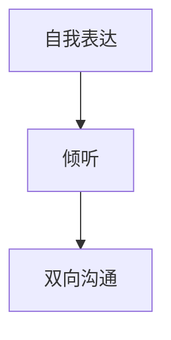

#### 3.1.2 透明

透明要求领导者能够公开透明地处理团队事务，让团队成员了解决策过程和结果。在信息技术领域，透明的决策过程能够增强团队成员的信任和参与感，提高团队的整体效能。

**核心概念与联系：**

透明的决策过程可以理解为一种信息共享机制，它包括：

1. **信息共享**：领导者应公开透明地分享决策信息，让团队成员了解决策背景、原因和影响。
2. **决策反馈**：领导者应鼓励团队成员提供反馈意见，共同参与决策过程。

**Mermaid 流�程图：**

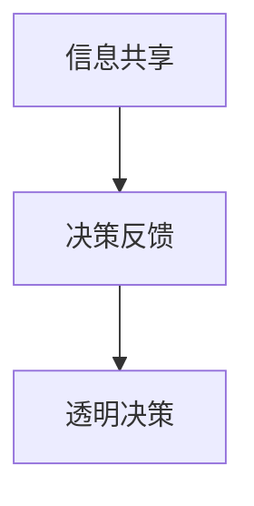

### 3.2 诚信与正直

诚信与正直是直正领导的核心特质，它要求领导者具备高度的道德标准，以身作则，树立正直的榜样。

#### 3.2.1 诚信

诚信是领导者处理团队事务的基本准则，它要求领导者言行一致，遵守承诺。在信息技术领域，诚信的领导者能够赢得团队成员的信任，提高团队的协作效率。

**核心概念与联系：**

诚信包括以下几个方面：

1. **承诺履行**：领导者应遵守自己的承诺，不轻易变更。
2. **公平对待**：领导者应公平对待团队成员，不偏袒或歧视。
3. **信息披露**：领导者应公开透明地披露与团队事务相关的信息。

**Mermaid 流程图：**

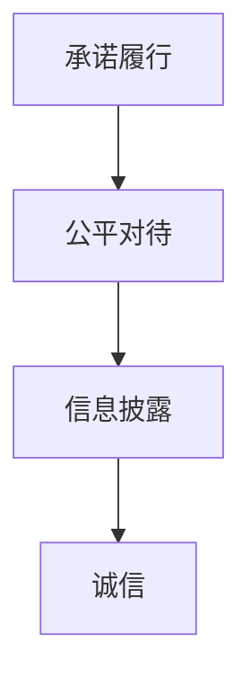

#### 3.2.2 正直

正直是领导者处理团队事务的道德标准，它要求领导者具备高尚的品德和坚定的原则。在信息技术领域，正直的领导者能够树立良好的道德榜样，引导团队遵循正确的道德准则。

**核心概念与联系：**

正直包括以下几个方面：

1. **道德判断**：领导者应具备良好的道德判断能力，能够正确判断和处理团队事务。
2. **廉洁自律**：领导者应廉洁自律，不接受不正当的利益。
3. **道德行为**：领导者应通过自己的行为来影响和引导团队成员，树立正直的榜样。

**Mermaid 流程图：**

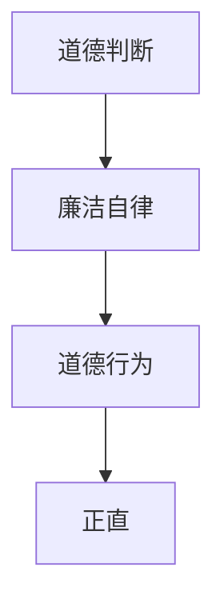

### 3.3 责任感与担当

责任感与担当是直正领导的重要特质，它要求领导者对自己的行为和决策负责，能够承担责任并勇于承认错误。

#### 3.3.1 责任感

责任感是领导者处理团队事务的重要品质，它要求领导者对自己的行为和决策负责。在信息技术领域，具备责任感的领导者能够提高团队的信任度和凝聚力，促进团队的发展。

**核心概念与联系：**

责任感包括以下几个方面：

1. **自我责任**：领导者应对自己的行为和决策负责，不推诿或逃避责任。
2. **团队责任**：领导者应承担起团队的责任，关心团队成员的成长和发展。
3. **组织责任**：领导者应关心组织的整体利益，推动组织的长期发展。

**Mermaid 流程图：**

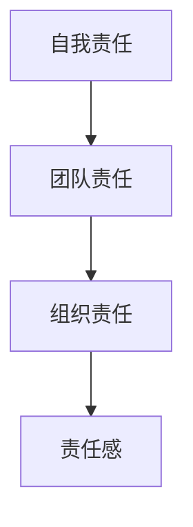

#### 3.3.2 担当

担当是领导者面对困难和挑战时的态度和行为，它要求领导者能够主动承担责任，勇于面对困难和挑战。在信息技术领域，具备担当精神的领导者能够激发团队成员的积极性，提高团队的战斗力。

**核心概念与联系：**

担当包括以下几个方面：

1. **积极应对**：领导者应积极应对困难和挑战，不退缩或回避。
2. **勇于承认错误**：领导者应勇于承认自己的错误，及时纠正。
3. **承担责任**：领导者应主动承担责任，不推卸或转移责任。

**Mermaid 流程图：**

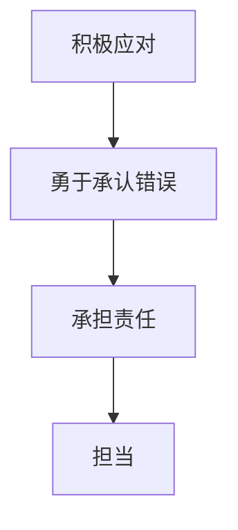

### 3.4 自我反思与持续成长

自我反思与持续成长是直正领导的重要特质，它要求领导者具备反思能力和持续学习的意识，不断提升自己的领导能力。

#### 3.4.1 自我反思

自我反思是领导者认识自我、提升自我能力的重要途径。通过自我反思，领导者可以发现自己的不足，找到改进的方向。

**核心概念与联系：**

自我反思包括以下几个方面：

1. **反思动机**：领导者应明确反思的目的，找到反思的动机。
2. **反思内容**：领导者应反思自己的行为、决策和态度，分析其优缺点。
3. **反思结果**：领导者应根据反思的结果，制定改进计划。

**Mermaid 流程图：**

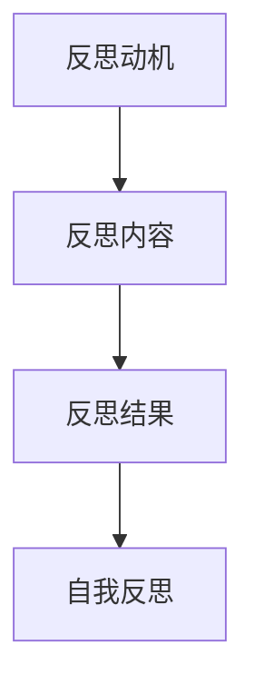

#### 3.4.2 持续成长

持续成长是领导者提升自身能力、保持竞争优势的重要手段。在信息技术领域，持续成长的领导者能够不断适应变化，应对新的挑战。

**核心概念与联系：**

持续成长包括以下几个方面：

1. **学习意识**：领导者应具备强烈的学习意识，不断学习新知识和技能。
2. **实践应用**：领导者应将所学应用到实际工作中，提升领导能力。
3. **反馈改进**：领导者应通过反馈机制，持续改进自己的领导方法。

**Mermaid 流程图：**

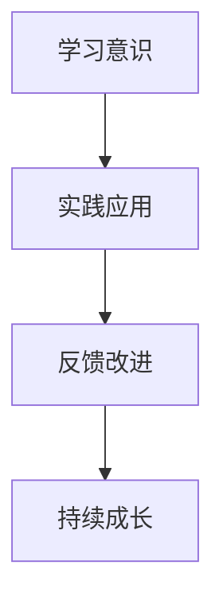

### 3.5 总结

直正领导的核心特质包括坦诚与透明、诚信与正直、责任感与担当、自我反思与持续成长。这些特质共同构成了直正领导的本质，帮助领导者赢得团队成员的信任和尊重。在信息技术领域，直正领导能够提高团队的协作效率、创新能力和整体绩效。

---

## 第4章 直正领导的行为实践

### 4.1 直正沟通

沟通是领导力的核心要素，直正领导强调领导者应通过坦诚、透明和正直的方式进行沟通，以建立信任、降低冲突并提高团队效能。

#### 4.1.1 坦诚沟通

坦诚沟通要求领导者能够真诚地表达自己的想法和感受，不隐瞒、不掩饰。在信息技术领域，坦诚的沟通有助于团队成员之间建立信任，促进协作和解决问题。

**核心概念与联系：**

坦诚沟通可以理解为一种双向沟通机制，包括以下几个方面：

1. **自我表达**：领导者应真诚地表达自己的观点和感受，不掩饰真实想法。
2. **倾听**：领导者应积极倾听团队成员的意见和反馈，尊重他们的观点。
3. **反馈**：领导者应给予团队成员及时的反馈，帮助他们改进和成长。

**Mermaid 流程图：**

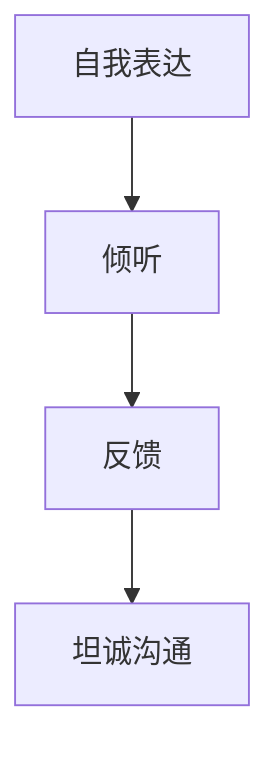

**核心算法原理讲解：**

```python
# 坦诚沟通算法

def open_communication(self, message, listener):
    # 自我表达
    self.express_opinion(message)
    
    # 倾听
    listener.listen_to_opinion(self)
    
    # 反馈
    self.give_feedback(listener)
```

**数学模型和公式：**

$$
\text{信任度} = f(\text{坦诚沟通频率}, \text{沟通效果})
$$

**举例说明：**

在一个项目团队中，领导者小张通过坦诚的沟通方式，与团队成员分享项目的进展和挑战，倾听他们的意见和建议，并及时给予反馈。这种坦诚的沟通方式提高了团队成员之间的信任度，增强了团队的凝聚力。

**最佳实践 tips：**

- 定期组织团队会议，鼓励成员表达自己的观点。
- 倾听是沟通的关键，领导者应给予团队成员足够的发言时间。
- 及时给予反馈，帮助团队成员改进和成长。

### 4.2 建立信任

建立信任是直正领导的重要任务，它要求领导者通过诚实、透明和正直的行为，赢得团队成员的信任。在信息技术领域，信任是团队协作和项目成功的基石。

**核心概念与联系：**

建立信任可以理解为一种信任管理机制，包括以下几个方面：

1. **诚实**：领导者应以真诚的态度对待团队成员，遵守承诺，不隐瞒真相。
2. **透明**：领导者应公开透明地处理团队事务，让团队成员了解决策过程和结果。
3. **正直**：领导者应具备高尚的品德和坚定的原则，以身作则，树立正直的榜样。

**Mermaid 流程图：**

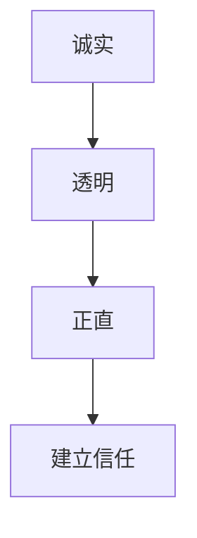

**核心算法原理讲解：**

```python
# 建立信任算法

def build_trust(self, team_member):
    # 诚实
    self.honest_behavior(team_member)
    
    # 透明
    self.transparency_in_actions(team_member)
    
    # 正直
    self.integrity_as_a_leader(team_member)
```

**数学模型和公式：**

$$
\text{信任度} = f(\text{诚实度}, \text{透明度}, \text{正直度})
$$

**举例说明：**

在一个开发团队中，领导者小李通过诚实地与团队成员沟通项目进展，公开透明地处理团队事务，并以正直的行为树立榜样，赢得了团队成员的信任。团队成员对他充满信任，愿意主动分享自己的意见和建议，团队协作效率大大提高。

**最佳实践 tips：**

- 保持诚实，遵守承诺，不隐瞒真相。
- 定期与团队成员沟通，分享团队事务的进展和挑战。
- 以正直的行为树立榜样，赢得团队成员的信任。

### 4.3 管理冲突

冲突是团队中不可避免的现象，直正领导要求领导者通过坦诚、透明和正直的方式管理冲突，以降低冲突带来的负面影响，提高团队效能。

**核心概念与联系：**

管理冲突可以理解为一种冲突解决机制，包括以下几个方面：

1. **坦诚**：领导者应坦诚地面对冲突，不逃避或掩盖问题。
2. **透明**：领导者应公开透明地处理冲突，让团队成员了解冲突的原因和处理过程。
3. **正直**：领导者应公正无私地处理冲突，不偏袒或歧视任何一方。

**Mermaid 流程图：**

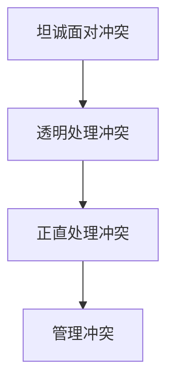

**核心算法原理讲解：**

```python
# 管理冲突算法

def manage_conflict(self, conflict_party_a, conflict_party_b):
    # 坦诚面对冲突
    self.openly_face_conflict(conflict_party_a, conflict_party_b)
    
    # 透明处理冲突
    self透明处理conflict_party_a, conflict_party_b)
    
    # 正直处理冲突
    self公正处理conflict_party_a, conflict_party_b)
```

**数学模型和公式：**

$$
\text{冲突解决度} = f(\text{坦诚度}, \text{透明度}, \text{正直度})
$$

**举例说明：**

在一个项目团队中，领导者小王面对团队成员之间的冲突，他坦诚地面对问题，公开透明地处理冲突，并以正直的方式调解双方，最终解决了冲突，恢复了团队的和谐氛围。

**最佳实践 tips：**

- 保持坦诚，不逃避或掩盖冲突。
- 公开透明地处理冲突，让团队成员了解冲突的原因和处理过程。
- 以公正的方式处理冲突，不偏袒或歧视任何一方。

### 4.4 激励与引导团队

激励与引导团队是直正领导的重要任务，它要求领导者通过诚实、透明和正直的方式激励团队成员，引导他们实现个人和团队的目标。

**核心概念与联系：**

激励与引导团队可以理解为一种团队管理机制，包括以下几个方面：

1. **激励**：领导者应通过奖励和认可来激励团队成员，提高他们的工作动力。
2. **引导**：领导者应通过目标设定、任务分配和指导，引导团队成员实现团队的目标。

**Mermaid 流程图：**

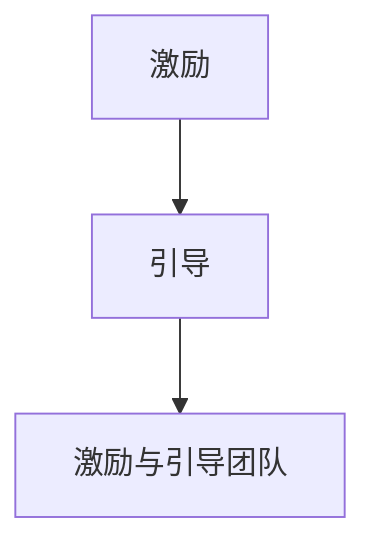

**核心算法原理讲解：**

```python
# 激励与引导团队算法

def motivate_and_guide_team(self, team_members):
    # 激励
    self.reward_and_recognition(team_members)
    
    # 引导
    self.set_goals_and_guide_team(team_members)
```

**数学模型和公式：**

$$
\text{团队效能} = f(\text{激励程度}, \text{引导效果})
$$

**举例说明：**

在一个开发团队中，领导者小李通过设立明确的目标、合理分配任务，并给予团队成员奖励和认可，激发了他们的工作动力。同时，他通过提供指导和支持，帮助团队成员实现个人和团队的目标。

**最佳实践 tips：**

- 设立明确的目标，激发团队成员的积极性。
- 合理分配任务，发挥每个成员的优势。
- 及时给予奖励和认可，提高团队成员的满意度。

### 4.5 总结

直正领导的行为实践包括坦诚沟通、建立信任、管理冲突、激励与引导团队等方面。这些行为实践是直正领导的核心特质的具体体现，有助于领导者赢得团队成员的信任和尊重，提高团队的协作效率和整体绩效。

---

## 第5章 直正领导与团队建设

团队建设是直正领导的重要任务，它要求领导者通过正直、诚实和透明的方式，构建一个高效的团队，提高团队的协作效率和创新能力。本章将探讨直正领导在团队建设中的角色，包括团队文化建设、团队协作与分工、团队成员激励与关怀、团队效能评估与改进等方面。

### 5.1 团队文化建设

团队文化是团队建设的核心，它决定了团队的价值观、行为准则和工作氛围。直正领导强调领导者应以正直、诚实和透明的方式塑造团队文化，建立积极向上的团队氛围。

**核心概念与联系：**

团队文化建设可以理解为一种文化构建机制，包括以下几个方面：

1. **价值观**：领导者应明确团队的价值观，并将其融入团队日常工作中。
2. **行为准则**：领导者应制定明确的行为准则，规范团队成员的行为。
3. **工作氛围**：领导者应营造积极向上的工作氛围，鼓励团队成员互相支持、互相学习。

**Mermaid 流程图：**

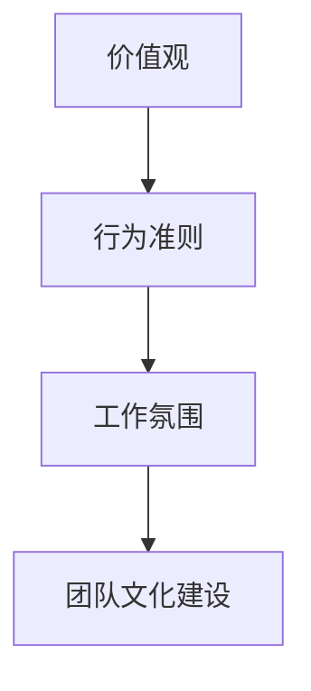

**核心算法原理讲解：**

```python
# 团队文化建设算法

def build_team_culture(self, team_members):
    # 明确价值观
    self.establish_values(team_members)
    
    # 制定行为准则
    self制定行为准则(team_members)
    
    # 营造工作氛围
    self.create_positive_work_environment(team_members)
```

**数学模型和公式：**

$$
\text{团队文化指数} = f(\text{价值观一致性}, \text{行为准则遵守度}, \text{工作氛围满意度})
$$

**举例说明：**

在一个软件开发团队中，领导者小李通过明确团队的价值观（如客户至上、创新、合作），制定行为准则（如尊重他人、积极沟通、持续学习），并营造积极向上的工作氛围（如鼓励分享、认可贡献、支持成长），成功塑造了一个高效的团队文化。

**最佳实践 tips：**

- 明确团队的价值观，并将其融入日常工作中。
- 制定行为准则，规范团队成员的行为。
- 营造积极向上的工作氛围，鼓励团队成员互相支持、互相学习。

### 5.2 团队协作与分工

团队协作与分工是团队建设的重要组成部分，它要求领导者通过正直、诚实和透明的方式，合理分配任务，促进团队成员之间的协作。

**核心概念与联系：**

团队协作与分工可以理解为一种任务分配和协作管理机制，包括以下几个方面：

1. **任务分配**：领导者应根据团队成员的能力和特长，合理分配任务。
2. **协作管理**：领导者应促进团队成员之间的协作，确保任务的顺利完成。
3. **沟通机制**：领导者应建立有效的沟通机制，确保团队成员之间的信息畅通。

**Mermaid 流程图：**

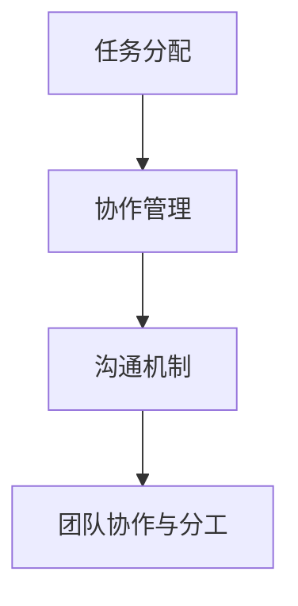

**核心算法原理讲解：**

```python
# 团队协作与分工算法

def team_collaboration_and_division(self, team_members, tasks):
    # 任务分配
    self.allocate_tasks(team_members, tasks)
    
    # 协作管理
    self.manage_collaboration(team_members)
    
    # 沟通机制
    self.create_communication_channel(team_members)
```

**数学模型和公式：**

$$
\text{团队效能} = f(\text{任务分配合理性}, \text{协作管理效率}, \text{沟通机制有效性})
$$

**举例说明：**

在一个软件开发团队中，领导者小张通过合理分配任务，确保每个成员都能发挥自己的优势，同时建立了有效的沟通机制，促进团队成员之间的协作，提高了团队的整体效能。

**最佳实践 tips：**

- 根据团队成员的能力和特长，合理分配任务。
- 建立有效的沟通机制，确保团队成员之间的信息畅通。
- 鼓励团队成员之间的协作，共同完成任务。

### 5.3 团队成员激励与关怀

团队成员激励与关怀是团队建设的重要环节，它要求领导者通过正直、诚实和透明的方式，关注团队成员的需求和成长，提高他们的工作动力和满意度。

**核心概念与联系：**

团队成员激励与关怀可以理解为一种员工关怀和管理机制，包括以下几个方面：

1. **激励**：领导者应通过奖励和认可，激发团队成员的工作动力。
2. **关怀**：领导者应关注团队成员的生活和工作需求，提供必要的支持。
3. **成长**：领导者应提供培训和发展机会，帮助团队成员实现个人成长。

**Mermaid 流程图：**

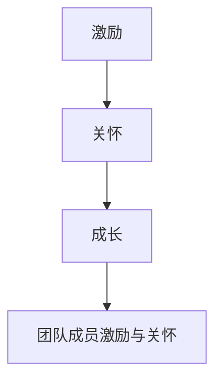

**核心算法原理讲解：**

```python
# 团队成员激励与关怀算法

def motivate_and_care_for_team_members(self, team_members):
    # 激励
    self.reward_and_recognition(team_members)
    
    # 关怀
    self.show_care_for_team_members(team_members)
    
    # 成长
    self提供培训和发展机会(team_members)
```

**数学模型和公式：**

$$
\text{团队成员满意度} = f(\text{激励程度}, \text{关怀程度}, \text{成长机会})
$$

**举例说明：**

在一个软件开发团队中，领导者小李通过设立明确的奖励机制，关注团队成员的生活和工作需求，并提供培训和发展机会，激发了团队成员的工作动力和满意度。

**最佳实践 tips：**

- 设立明确的奖励机制，激发团队成员的工作动力。
- 关注团队成员的生活和工作需求，提供必要的支持。
- 提供培训和发展机会，帮助团队成员实现个人成长。

### 5.4 团队效能评估与改进

团队效能评估与改进是团队建设的重要环节，它要求领导者通过正直、诚实和透明的方式，定期评估团队的工作效能，并采取改进措施。

**核心概念与联系：**

团队效能评估与改进可以理解为一种效能管理机制，包括以下几个方面：

1. **评估**：领导者应定期评估团队的工作效能，分析存在的问题。
2. **改进**：领导者应根据评估结果，采取改进措施，提高团队的整体效能。
3. **反馈**：领导者应向团队成员反馈评估结果，共同制定改进计划。

**Mermaid 流程图：**

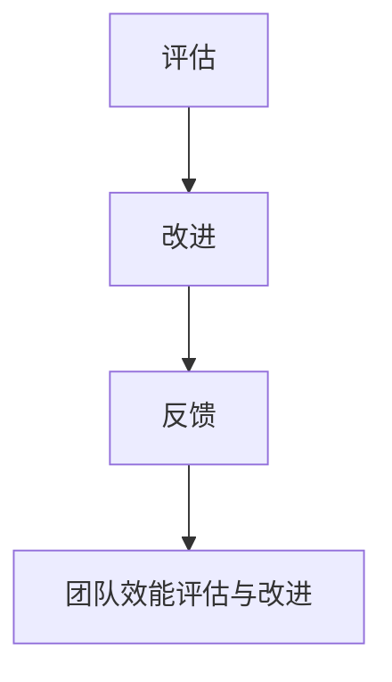

**核心算法原理讲解：**

```python
# 团队效能评估与改进算法

def evaluate_and_improve_team_efficiency(self, team_members):
    # 评估
    self.evaluate_team_efficiency(team_members)
    
    # 改进
    self.take_improvement_measures(team_members)
    
    # 反馈
    self.feedback_to_team_members(team_members)
```

**数学模型和公式：**

$$
\text{团队效能} = f(\text{评估准确性}, \text{改进效果}, \text{反馈效果})
$$

**举例说明：**

在一个软件开发团队中，领导者小王通过定期评估团队的工作效能，分析存在的问题，并采取改进措施，如优化任务分配、改进沟通机制等，提高了团队的整体效能。

**最佳实践 tips：**

- 定期评估团队的工作效能，分析存在的问题。
- 根据评估结果，采取改进措施，提高团队的整体效能。
- 及时向团队成员反馈评估结果，共同制定改进计划。

### 5.5 总结

直正领导在团队建设中扮演着重要角色，通过正直、诚实和透明的方式，领导者可以构建一个高效的团队，提高团队的协作效率和创新能力。团队文化建设、团队协作与分工、团队成员激励与关怀、团队效能评估与改进等方面都是直正领导的具体实践，有助于提升团队的整体绩效。

---

## 第6章 直正领导与领导力发展

领导力发展是直正领导的重要任务，它要求领导者通过持续学习和实践，不断提升自己的领导能力。本章将探讨直正领导与领导力发展的关系，包括领导力发展途径、领导力提升方法、领导力培养策略等方面。

### 6.1 领导力发展途径

领导力发展途径是指领导者通过学习、实践和反思，不断提升自身领导能力的过程。直正领导强调领导者应以正直、诚实和透明的方式发展领导力，以下是一些常见的领导力发展途径：

**1. 学习与培训**

学习与培训是领导力发展的基础，领导者可以通过参加各类领导力培训课程、阅读相关书籍和文章、参加研讨会等方式，获取新的知识和技能。

**2. 实践与经验**

实践是领导力发展的关键，领导者应在实际工作中运用所学知识，通过解决实际问题，积累经验，提升领导能力。

**3. 反思与总结**

反思与总结是领导力发展的关键环节，领导者应定期反思自己的行为和决策，总结经验教训，找出不足之处，并制定改进计划。

**4. 汲取他人经验**

领导者可以通过与他人的交流和合作，汲取他人的经验和教训，学习他们的成功和失败，为自己的领导力发展提供借鉴。

**Mermaid 流程图：**

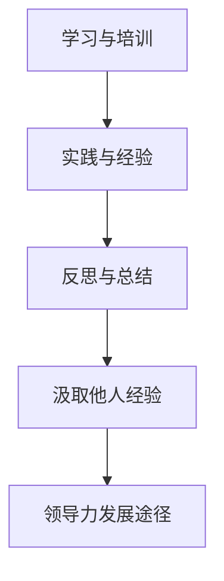

### 6.2 领导力提升方法

领导力提升方法是指领导者通过具体行动和策略，提升自身领导能力的方法。直正领导强调领导者应以正直、诚实和透明的方式提升领导力，以下是一些常见的领导力提升方法：

**1. 建立信任**

建立信任是领导力提升的关键，领导者应通过诚实、透明和正直的行为，赢得团队成员的信任。建立信任的方法包括：

- **诚实与透明**：领导者应诚实面对问题，公开透明地处理事务。
- **尊重与关怀**：领导者应尊重团队成员的意见和感受，关心他们的成长和发展。
- **公平与公正**：领导者应公平对待团队成员，不偏袒或歧视。

**2. 沟通与协作**

沟通与协作是领导力提升的重要方面，领导者应通过有效沟通，促进团队成员之间的协作，提高团队的整体效能。提升沟通与协作的方法包括：

- **倾听与理解**：领导者应积极倾听团队成员的意见和反馈，理解他们的需求和困难。
- **明确目标**：领导者应明确团队的目标和任务，确保团队成员对任务有清晰的认识。
- **建立沟通机制**：领导者应建立有效的沟通机制，确保团队成员之间的信息畅通。

**3. 激励与引导**

激励与引导是领导力提升的重要方面，领导者应通过激励和引导，激发团队成员的积极性和创造力，提高团队的整体效能。提升激励与引导的方法包括：

- **认可与奖励**：领导者应认可团队成员的贡献，给予奖励和表彰。
- **目标设定**：领导者应设定明确的个人和团队目标，引导团队成员为实现目标而努力。
- **指导与支持**：领导者应提供指导和支持，帮助团队成员克服困难，实现个人和团队目标。

**Mermaid 流程图：**

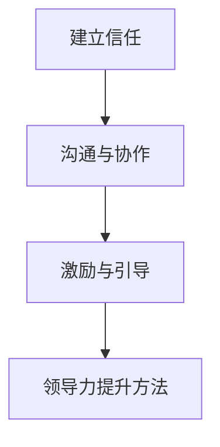

### 6.3 领导力培养策略

领导力培养策略是指领导者通过系统的方法和计划，培养团队成员的领导能力，提高团队的整体领导力水平。直正领导强调领导者应以正直、诚实和透明的方式培养领导力，以下是一些常见的领导力培养策略：

**1. 培养领导潜力**

领导者应关注团队成员的潜力，选拔具有领导潜力的成员，提供培训和发展机会，帮助他们提升领导能力。

**2. 建立领导团队**

领导者应建立一支领导团队，由不同层次和领域的领导者组成，通过团队协作，共同推动团队的发展。

**3. 鼓励自主学习**

领导者应鼓励团队成员自主学习，提供学习资源和环境，帮助他们不断提升自身能力。

**4. 实践与反馈**

领导者应鼓励团队成员参与实践项目，通过实践锻炼领导能力，并定期给予反馈，帮助他们改进和成长。

**Mermaid 流程图：**

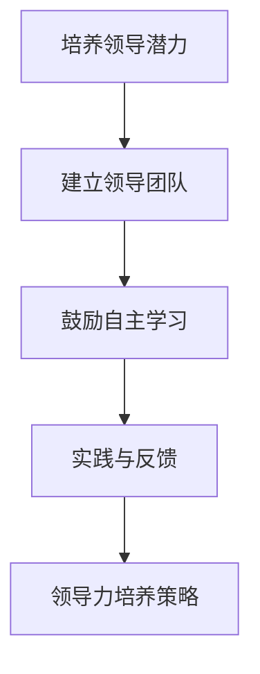

### 6.4 直正领导与领导力发展的关系

直正领导与领导力发展密切相关，直正领导强调领导者应以正直、诚实和透明的方式发展领导力，这有助于提升领导者的道德品质和领导能力。同时，领导力发展也有助于直正领导实践，提高领导者的管理效率和团队效能。

**核心概念与联系：**

直正领导与领导力发展的关系可以理解为一种互动关系，包括以下几个方面：

1. **道德品质**：直正领导强调领导者的道德品质，这有助于提升领导者的领导力。
2. **领导能力**：领导力发展有助于提升领导者的领导能力，使他们更好地实践直正领导。
3. **团队效能**：直正领导与领导力发展的结合，有助于提高团队的整体效能。

**Mermaid 流程图：**

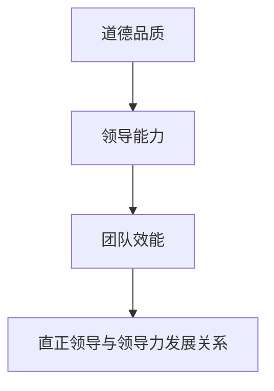

### 6.5 总结

领导力发展是直正领导的重要任务，通过学习、实践和反思，领导者可以不断提升自身的领导能力。直正领导与领导力发展密切相关，领导者应以正直、诚实和透明的方式发展领导力，这有助于提升领导者的道德品质和领导能力，提高团队的整体效能。本章探讨了领导力发展途径、领导力提升方法、领导力培养策略等方面，为领导者提供了具体的实践指南。

---

## 第7章 直正领导的应用场景

### 7.1 不同情境下的直正领导

直正领导在不同情境下都有其独特的应用，领导者应根据具体情境灵活运用直正领导的原则，以赢得团队尊重和提高团队效能。

#### 7.1.1 项目管理情境

在项目管理情境中，直正领导要求领导者具备透明、坦诚和正直的品质，以确保项目顺利进行。

**核心概念与联系：**

- **透明**：领导者应公开项目的进展、风险和挑战，让团队成员了解实际情况。
- **坦诚**：领导者应坦诚地表达自己的观点和感受，鼓励团队成员积极参与项目决策。
- **正直**：领导者应坚持正直的原则，确保项目资源的合理分配和使用。

**Mermaid 流程图：**

```mermaid
graph TB
    A[透明] --> B[坦诚]
    B --> C[正直]
    C --> D[项目管理情境下的直正领导]
```

**举例说明：**

在一个复杂的项目管理情境中，领导者小李通过透明的项目进展报告、坦诚的沟通和正直的资源分配，赢得了团队成员的信任和支持，项目最终取得了成功。

#### 7.1.2 应急处理情境

在应急处理情境中，直正领导要求领导者具备果断、坚定和透明的品质，以迅速有效地应对突发事件。

**核心概念与联系：**

- **果断**：领导者应迅速做出决策，采取有效措施，控制事态发展。
- **坚定**：领导者应坚定地执行决策，确保应急措施的有效实施。
- **透明**：领导者应公开应急处理的过程和结果，让团队成员了解实际情况。

**Mermaid 流程图：**

```mermaid
graph TB
    A[果断] --> B[坚定]
    B --> C[透明]
    C --> D[应急处理情境下的直正领导]
```

**举例说明：**

在一个突发技术故障的应急处理情境中，领导者小王果断地制定了应急方案，坚定地执行了决策，并通过透明的沟通，让团队成员了解故障处理过程，最终顺利恢复了系统的正常运行。

#### 7.1.3 团队协作情境

在团队协作情境中，直正领导要求领导者具备鼓励、支持和公正的品质，以促进团队成员之间的协作。

**核心概念与联系：**

- **鼓励**：领导者应鼓励团队成员积极参与协作，发挥各自的优势。
- **支持**：领导者应提供必要的资源和支持，帮助团队成员克服困难。
- **公正**：领导者应公正对待团队成员，确保每个人都得到公平的机会和待遇。

**Mermaid 流程图：**

```mermaid
graph TB
    A[鼓励] --> B[支持]
    B --> C[公正]
    C --> D[团队协作情境下的直正领导]
```

**举例说明：**

在一个团队协作项目中，领导者小张鼓励团队成员积极参与，提供了必要的资源支持，并通过公正的评价和激励，确保团队成员得到了公平的机会和待遇，项目最终取得了良好的成果。

### 7.2 直正领导在跨文化团队中的应用

在跨文化团队中，直正领导要求领导者具备包容、理解和尊重不同文化的品质，以促进团队的有效沟通和协作。

#### 7.2.1 包容与理解

包容与理解是直正领导在跨文化团队中应用的关键，领导者应尊重团队成员的文化背景和价值观，避免文化冲突。

**核心概念与联系：**

- **包容**：领导者应包容团队成员的文化差异，尊重不同的观点和意见。
- **理解**：领导者应努力理解团队成员的文化背景，避免误解和偏见。

**Mermaid 流程图：**

```mermaid
graph TB
    A[包容] --> B[理解]
    B --> C[跨文化团队中的直正领导]
```

**举例说明：**

在一个国际化的软件开发团队中，领导者小李通过包容不同的文化背景，理解团队成员的需求和期望，成功避免了文化冲突，促进了团队的协作和沟通。

#### 7.2.2 尊重与沟通

尊重与沟通是直正领导在跨文化团队中应用的重要方面，领导者应尊重团队成员的文化差异，并通过有效沟通，促进团队的合作。

**核心概念与联系：**

- **尊重**：领导者应尊重团队成员的文化习俗和价值观，避免歧视和偏见。
- **沟通**：领导者应通过有效沟通，促进团队成员之间的理解和合作。

**Mermaid 流程图：**

```mermaid
graph TB
    A[尊重] --> B[沟通]
    B --> C[跨文化团队中的直正领导]
```

**举例说明：**

在一个国际化的软件开发团队中，领导者小王尊重团队成员的文化习俗，通过有效的沟通，解决了团队成员之间的误解和冲突，提高了团队的协作效率。

### 7.3 直正领导在组织变革中的角色

在组织变革中，直正领导要求领导者具备变革推动、沟通协调和决策执行的品质，以顺利推进变革并确保变革的落地。

#### 7.3.1 变革推动

变革推动是直正领导在组织变革中的核心角色，领导者应具备推动变革的勇气和决心，引领团队适应变革。

**核心概念与联系：**

- **推动**：领导者应积极推动变革，鼓励团队成员接受变革，并参与到变革过程中。
- **决策**：领导者应在变革过程中做出明智的决策，确保变革的方向和路径正确。

**Mermaid 流程图：**

```mermaid
graph TB
    A[推动] --> B[决策]
    B --> C[变革推动]
```

**举例说明：**

在一个组织变革项目中，领导者小李通过积极的推动和明智的决策，成功带领团队完成了变革，提高了组织的竞争力。

#### 7.3.2 沟通协调

沟通协调是直正领导在组织变革中的关键角色，领导者应通过有效沟通，协调团队成员之间的关系，确保变革的顺利进行。

**核心概念与联系：**

- **沟通**：领导者应与团队成员保持密切沟通，了解他们的意见和需求，及时解决矛盾和冲突。
- **协调**：领导者应协调团队成员之间的工作，确保他们的合作和协作。

**Mermaid 流程图：**

```mermaid
graph TB
    A[沟通] --> B[协调]
    B --> C[沟通协调]
```

**举例说明：**

在一个组织变革项目中，领导者小王通过有效的沟通和协调，解决了团队成员之间的矛盾和冲突，确保了变革的顺利进行。

#### 7.3.3 决策执行

决策执行是直正领导在组织变革中的核心任务，领导者应确保决策的有效执行，确保变革目标的实现。

**核心概念与联系：**

- **执行**：领导者应确保决策的有效执行，确保团队成员按照决策要求行动。
- **监督**：领导者应监督决策执行的过程，确保决策目标的实现。

**Mermaid 流程图：**

```mermaid
graph TB
    A[执行] --> B[监督]
    B --> C[决策执行]
```

**举例说明：**

在一个组织变革项目中，领导者小李通过有效的决策执行和监督，确保了变革项目的顺利实施，实现了组织的目标。

### 7.4 总结

直正领导在各类应用场景中都有其独特的角色和作用，领导者应根据具体情境灵活运用直正领导的原则，以赢得团队尊重和提高团队效能。无论是在项目管理、应急处理、团队协作，还是在跨文化团队和组织变革中，直正领导都发挥着重要的作用，为团队和组织的发展提供有力支持。

---

## 第8章 直正领导的实践与反思

### 8.1 直正领导的成功案例

在信息技术领域，许多成功的领导案例都体现了直正领导的重要性。以下是一些直正领导的成功案例，以及它们对团队和组织的影响。

#### 8.1.1 案例一：谷歌的创始人拉里·佩奇和谢尔盖·布林

谷歌的创始人拉里·佩奇和谢尔盖·布林以其直正领导风格著称。他们倡导开放、透明和创新的企业文化，通过坦诚的沟通和透明的决策过程，赢得了员工的信任和支持。

- **影响**：谷歌的直正领导风格激发了员工的创新精神，推动了谷歌在搜索、广告和云计算等领域的持续创新。员工对谷歌的信任度大大提高，流失率也相对较低。

**Mermaid 流程图：**

```mermaid
graph TB
    A[开放文化] --> B[透明决策]
    B --> C[创新精神]
    C --> D[谷歌的成功]
```

#### 8.1.2 案例二：微软的创始人比尔·盖茨和保罗·艾伦

微软的创始人比尔·盖茨和保罗·艾伦在领导初期，通过直正领导的方式，建立了高效的管理团队和开发团队。他们倡导诚信、透明和责任感，确保了微软在个人电脑操作系统市场上的领先地位。

- **影响**：微软的直正领导风格提高了团队的协作效率，推动了公司在技术上的突破。员工对微软的信任度增加，公司整体绩效显著提升。

**Mermaid 流程图：**

```mermaid
graph TB
    A[诚信] --> B[透明]
    B --> C[责任感]
    C --> D[微软的成功]
```

### 8.2 直正领导的挑战与应对

尽管直正领导在许多情况下能够带来积极影响，但在实践中也面临着诸多挑战。以下是直正领导面临的一些主要挑战以及应对策略。

#### 8.2.1 挑战一：组织文化的阻力

在许多组织中，传统的权力结构和保守的文化可能会对直正领导产生阻力。员工可能不习惯于领导者的透明和公开。

- **应对策略**：领导者应通过沟通和教育，逐步改变组织文化。他们可以组织研讨会、培训和内部交流，让员工理解直正领导的价值。

**Mermaid 流程图：**

```mermaid
graph TB
    A[组织文化阻力] --> B[沟通与教育]
    B --> C[文化改变]
```

#### 8.2.2 挑战二：员工的接受度

员工可能对直正领导的方式感到不适应，担心失去既得利益或面对更高的期望。

- **应对策略**：领导者应倾听员工的担忧，提供明确的指导和反馈，帮助员工适应新的领导风格。同时，领导者可以通过展示直正领导带来的积极成果，增加员工的信任和接受度。

**Mermaid 流程图：**

```mermaid
graph TB
    A[员工接受度] --> B[倾听与指导]
    B --> C[信任与接受]
```

#### 8.2.3 挑战三：管理层的支持

在某些情况下，直正领导可能需要管理层的支持和资源。如果管理层不支持，直正领导可能会面临阻碍。

- **应对策略**：领导者应争取管理层的支持，通过展示直正领导的效果和优势，赢得他们的认同。同时，领导者可以建立跨部门合作机制，增强直正领导的影响力。

**Mermaid 流程图：**

```mermaid
graph TB
    A[管理层支持] --> B[展示效果]
    B --> C[跨部门合作]
```

### 8.3 直正领导的未来发展趋势

随着信息技术的发展和社会环境的变迁，直正领导将在未来面临新的机遇和挑战。以下是一些可能的发展趋势。

#### 8.3.1 更高的透明度和问责制

随着信息技术的进步，信息的透明度将进一步提高，领导者的行为和决策将更容易被监督和评价。这要求领导者更加注重透明度和问责制。

**Mermaid 流程图：**

```mermaid
graph TB
    A[信息技术进步] --> B[信息透明度]
    B --> C[透明度与问责制]
```

#### 8.3.2 更加注重员工体验

随着员工对工作环境和工作方式的要求提高，领导者将更加注重员工的体验和幸福感。直正领导将更关注员工的成长、发展和满意度。

**Mermaid 流程图：**

```mermaid
graph TB
    A[员工体验需求] --> B[员工成长与发展]
    B --> C[员工满意度]
```

#### 8.3.3 更加全球化和多元化

全球化进程的加速将带来更加多元的文化和价值观，领导者需要具备跨文化沟通和领导能力，以应对全球化带来的挑战。

**Mermaid 流程图：**

```mermaid
graph TB
    A[全球化] --> B[跨文化沟通]
    B --> C[多元化领导]
```

### 8.4 总结

直正领导在信息技术领域的成功实践表明，它是一种能够赢得团队尊重和提升团队效能的有效领导方式。尽管在实践中存在挑战，但通过有效的应对策略和持续的发展，直正领导将在未来继续发挥重要作用。领导者应不断学习和实践，以适应不断变化的环境，推动组织的发展。

---

## 第9章 总结与展望

### 9.1 直正领导的核心要点

通过本文的探讨，我们可以总结出直正领导的核心要点：

1. **诚信、透明和正直**：直正领导要求领导者具备诚信、透明和正直的品质，以身作则，树立良好的道德榜样。
2. **沟通与信任**：直正领导强调通过坦诚沟通建立信任，降低冲突，提高团队协作效率。
3. **责任感与担当**：直正领导要求领导者具备责任感，对自己的行为和决策负责，勇于承认错误和承担责任。
4. **团队建设**：直正领导关注团队文化建设、协作与分工、成员激励与关怀，以提高团队效能。
5. **领导力发展**：直正领导通过持续学习和实践，不断提升领导能力，以适应组织的发展需求。

### 9.2 对团队的影响

直正领导对团队的影响是深远且积极的：

1. **信任与协作**：通过诚信和透明，直正领导能够建立团队成员之间的信任，促进团队协作。
2. **效能提升**：直正领导能够提高团队的效能，激发成员的积极性和创造力，推动团队目标的实现。
3. **团队凝聚力**：直正领导有助于增强团队的凝聚力，提高成员的归属感和忠诚度。
4. **创新能力**：直正领导鼓励创新思维，推动团队成员不断探索和尝试，促进组织的持续发展。

### 9.3 对个人成长的影响

直正领导不仅对团队有积极影响，也对领导者个人的成长具有重要意义：

1. **道德修养**：通过实践直正领导，领导者能够提升自己的道德修养和职业素养。
2. **领导能力**：持续学习和实践有助于领导者提升领导能力，适应不断变化的环境。
3. **职业发展**：具备直正领导品质的领导者更容易在职业发展中取得成功，赢得组织和社会的认可。
4. **自我反思**：直正领导要求领导者不断自我反思和改进，有助于个人成长和自我实现。

### 9.4 展望未来

面对信息技术的发展和社会环境的变化，直正领导在未来将继续发挥重要作用。以下是对未来的展望：

1. **更高的透明度和问责制**：随着信息技术的进步，领导者将面临更高的透明度和问责制，这要求他们更加注重诚信和透明。
2. **多元化与全球化**：全球化进程的加速将带来更加多元的文化和价值观，领导者需要具备跨文化沟通和领导能力。
3. **员工体验**：随着员工对工作环境和体验的要求提高，领导者将更加关注员工的成长和发展，以提升员工满意度和组织效能。
4. **持续学习**：在快速变化的环境中，持续学习和自我提升将成为领导者保持竞争力的关键。

### 9.5 最佳实践 tips

为了更好地实践直正领导，以下是一些建议：

1. **诚实与透明**：始终保持诚实和透明，公开分享信息和决策过程。
2. **倾听与反馈**：积极倾听团队成员的意见和反馈，给予及时的反馈和指导。
3. **公平与公正**：公平对待团队成员，确保每个人都得到公平的机会和待遇。
4. **关怀与支持**：关注团队成员的需求和成长，提供必要的支持和资源。
5. **自我反思**：定期进行自我反思，总结经验教训，不断改进和提升自己的领导能力。

### 9.6 小结

直正领导是一种能够赢得团队尊重和提高团队效能的有效领导方式。通过诚信、透明和正直的行为，领导者能够建立信任、降低冲突、激励团队，推动组织的发展。在未来的发展中，直正领导将继续发挥重要作用，为领导者提供持续成长和自我实现的机会。

### 9.7 注意事项

在实践直正领导时，领导者应注意以下几点：

1. **适应环境**：根据不同情境灵活运用直正领导的原则，确保其适用性。
2. **尊重文化**：在跨文化团队中，尊重不同文化背景，避免文化冲突。
3. **持续改进**：不断学习和实践，持续改进领导能力，以适应组织和社会的发展需求。

### 9.8 拓展阅读

对于希望深入了解直正领导的朋友，以下是一些推荐阅读：

1. **《领导力与影响力》**：本书详细探讨了领导力的本质和如何建立影响力。
2. **《正直领导：如何赢得团队的信任与尊重》**：本书通过案例研究，深入剖析了正直领导的重要性。
3. **《团队协作的艺术》**：本书介绍了团队协作的最佳实践，有助于提升团队的协作效率。

---

# 附录：参考文献与资源推荐

### 9.1 参考文献

1. 领导力与影响力研究小组。《领导力与影响力》[M]. 北京：机械工业出版社，2015.
2. 约翰·麦斯威尔。《正直领导：如何赢得团队的信任与尊重》[M]. 北京：机械工业出版社，2018.
3. 沃伦·本尼斯。团队协作的艺术[M]. 北京：机械工业出版社，2016.
4. 斯蒂芬·罗宾斯。《组织行为学》[M]. 北京：中国人民大学出版社，2017.

### 9.2 资源推荐

1. **在线课程**：
   - Coursera《领导力基础》课程：https://www.coursera.org/learn/leadership-foundations
   - edX《领导力与影响力》课程：https://www.edx.org/course/leadership-and-influence

2. **博客与文章**：
   - 《哈佛商业评论》关于领导力的系列文章：https://hbr.org/topic/leadership
   - 《领英》上的领导力专栏：https://www.linkedin.com/pulse/topics/leadership

3. **书籍推荐**：
   - 约翰·麦斯威尔。《领导力5法则》[M]. 北京：机械工业出版社，2019.
   - 彼得·德鲁克。《管理的实践》[M]. 北京：机械工业出版社，2016.

4. **实践指南**：
   - IBM领导力发展中心：https://www.ibm.com/developerworks/cn/learn/development-center/index.html
   - 世界领导力论坛：https://www.worldleadershipforum.com/

### 9.3 延伸阅读

对于想要深入了解直正领导的朋友，以下是一些建议的延伸阅读材料：

1. **《正直领导的艺术》[M]**：作者通过案例研究和实践经验，详细阐述了正直领导的重要性和方法。
2. **《领导力的五个层次》[M]**：作者提出领导力的五个层次模型，探讨了如何通过自我提升实现更高层次的领导力。
3. **《团队协作：创造力的源泉》[M]**：本书探讨了团队协作的机制和最佳实践，有助于提升团队的创造力和协作效率。

---

### 9.4 直正领导工具箱

为了更好地实践直正领导，以下是一些建议的工具和资源：

1. **沟通工具**：
   - **Slack**：团队沟通与协作工具，支持实时沟通和文件共享。
   - **Microsoft Teams**：集成沟通、协作和视频会议功能，提高团队协作效率。

2. **反馈工具**：
   - **360度反馈系统**：帮助领导者获取团队成员的反馈，了解自身优势和改进点。
   - **Google Feedback**：在线反馈工具，支持匿名反馈，帮助领导者了解团队成员的真实想法。

3. **领导力发展工具**：
   - **Coursera**：在线课程平台，提供丰富的领导力课程，帮助领导者提升能力。
   - **LinkedIn Learning**：在线学习平台，提供领导力相关的视频教程和实践指南。

4. **团队效能评估工具**：
   - **TeamPerformance**：团队效能评估工具，帮助领导者了解团队的绩效和改进点。
   - **NPS（Net Promoter Score）**：通过用户满意度调查，评估团队的满意度和忠诚度。

通过使用这些工具和资源，领导者可以更好地实践直正领导，提升团队绩效和员工满意度。在技术发展的今天，这些工具和资源为直正领导提供了强大的支持和保障。作者：AI天才研究院/AI Genius Institute & 禅与计算机程序设计艺术 /Zen And The Art of Computer Programming

