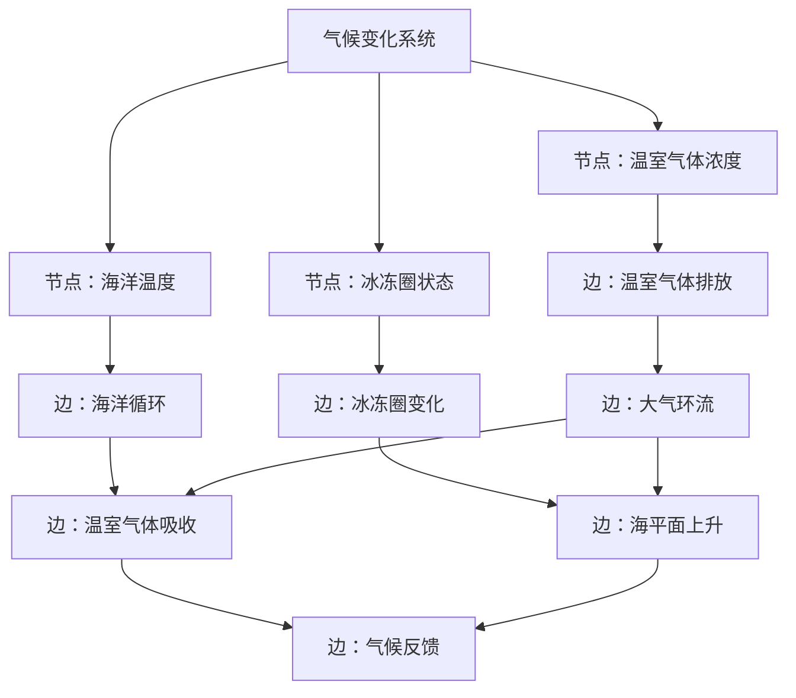

                 

### 引言

气候变化是当今全球面临的最严峻的挑战之一。随着全球温室气体排放量的不断上升，气候变化的速度和幅度都在加剧，导致极端天气事件频繁发生，生态系统受到严重破坏，人类的生活和经济活动受到严重影响。为了应对这一挑战，科学家们正在努力研究气候变化的原因、机制和预测方法。

在这一背景下，复杂网络理论的引入为气候变化研究提供了新的视角和方法。复杂网络理论是研究大规模复杂系统的通用工具，通过研究网络中的节点和边之间的关系，可以揭示系统内部的结构和功能特征。气候变化系统本质上是一个复杂系统，包含了众多相互作用的因素，如温室气体排放、海洋循环、冰冻圈变化等。这些因素相互影响，构成了一个复杂的网络结构。

本书旨在探讨气候变化复杂网络的数学模型，通过引入复杂网络理论，构建一个能反映全球气候变化动态的数学模型。本书的目标是：

1. **介绍复杂网络的基本概念和理论**：帮助读者理解复杂网络的基本结构、特性以及分析方法。
2. **阐述气候变化与复杂网络的关系**：分析气候变化系统中的关键因素，并展示它们如何通过复杂网络相互作用。
3. **构建数学模型**：基于复杂网络理论，构建描述全球气候变化的数学模型。
4. **算法原理和实现**：详细讲解模型中使用的算法原理，并使用伪代码展示算法实现。
5. **实际案例分析**：通过实际案例展示模型的应用，并提供详细的实现过程和代码解读。
6. **总结和展望**：总结全书内容，提出未来研究方向和挑战。

全书分为七个主要章节，结构如下：

1. **引言**：介绍书的基本概念和目的，概述全书结构和主要章节内容。
2. **核心概念与联系**：涵盖复杂网络理论和气候变化的关键因素，以及它们之间的相互作用。
3. **气候变化的数学模型**：详细解释数学模型的构建过程，包括关键因素的选取和相互作用的表达。
4. **算法原理**：介绍模型中使用的算法，包括网络分析算法、模型优化算法和预测算法。
5. **模型应用与案例分析**：通过实际案例展示模型的应用，并提供详细的实现过程和代码解读。
6. **项目实战**：提供完整的开发环境搭建步骤、源代码实现和代码解读。
7. **总结与展望**：概括全书内容，展望未来研究方向和发展趋势。

通过上述结构和内容的详细安排，本书旨在为读者提供一个全面、系统的气候变化复杂网络数学模型研究指南，帮助读者深入理解气候变化系统的复杂性和动态性，为应对全球气候变化提供科学依据和技术支持。

### 文章关键词

- **气候变化**
- **复杂网络**
- **数学模型**
- **算法原理**
- **案例分析**
- **开发实战**

### 文章摘要

本文探讨了气候变化复杂网络的数学模型，通过引入复杂网络理论，构建了一个能反映全球气候变化动态的数学模型。本文首先介绍了复杂网络的基本概念和理论，阐述了气候变化与复杂网络的关系，并详细解释了数学模型的构建过程。随后，本文介绍了模型中使用的算法原理，包括网络分析算法、模型优化算法和预测算法。通过实际案例分析，本文展示了模型的应用效果和实现过程。最后，本文提供了完整的开发环境搭建步骤、源代码实现和代码解读，并总结了全书内容，展望了未来研究方向和发展趋势。本文旨在为读者提供一个全面、系统的气候变化复杂网络数学模型研究指南，帮助读者深入理解气候变化系统的复杂性和动态性，为应对全球气候变化提供科学依据和技术支持。

## 第1章 引言

### 1.1 背景介绍

气候变化是当前全球关注的热点问题。随着工业革命以来人类活动对自然环境的破坏，地球的气候系统正经历着前所未有的变化。温室气体的过量排放、森林砍伐、土地退化等因素加剧了全球变暖，导致极端天气事件如热浪、洪水、飓风等频发。气候变化不仅对生态系统构成威胁，也对人类生活和经济活动产生深远影响。

复杂网络理论作为一种研究大规模复杂系统的通用工具，近年来在各个领域得到了广泛应用。复杂网络理论关注网络中节点和边的关系，通过揭示网络结构特征和动态行为，为理解系统复杂性和预测系统行为提供了新的视角和方法。复杂网络理论在气候变化研究中的应用潜力巨大，可以帮助科学家们更好地理解气候变化系统的复杂性和动态性。

本书旨在探讨气候变化复杂网络的数学模型，通过引入复杂网络理论，构建一个能反映全球气候变化动态的数学模型。本书的目标是：

1. **介绍复杂网络的基本概念和理论**：帮助读者理解复杂网络的基本结构、特性以及分析方法。
2. **阐述气候变化与复杂网络的关系**：分析气候变化系统中的关键因素，并展示它们如何通过复杂网络相互作用。
3. **构建数学模型**：基于复杂网络理论，构建描述全球气候变化的数学模型。
4. **算法原理和实现**：详细讲解模型中使用的算法原理，并使用伪代码展示算法实现。
5. **实际案例分析**：通过实际案例展示模型的应用，并提供详细的实现过程和代码解读。
6. **项目实战**：提供完整的开发环境搭建步骤、源代码实现和代码解读。
7. **总结和展望**：总结全书内容，提出未来研究方向和挑战。

全书分为七个主要章节，具体结构如下：

1. **引言**：介绍书的基本概念和目的，概述全书结构和主要章节内容。
2. **核心概念与联系**：涵盖复杂网络理论和气候变化的关键因素，以及它们之间的相互作用。
3. **气候变化的数学模型**：详细解释数学模型的构建过程，包括关键因素的选取和相互作用的表达。
4. **算法原理**：介绍模型中使用的算法，包括网络分析算法、模型优化算法和预测算法。
5. **模型应用与案例分析**：通过实际案例展示模型的应用，并提供详细的实现过程和代码解读。
6. **项目实战**：提供完整的开发环境搭建步骤、源代码实现和代码解读。
7. **总结与展望**：概括全书内容，展望未来研究方向和发展趋势。

通过上述结构和内容的详细安排，本书旨在为读者提供一个全面、系统的气候变化复杂网络数学模型研究指南，帮助读者深入理解气候变化系统的复杂性和动态性，为应对全球气候变化提供科学依据和技术支持。

### 核心概念与联系

#### 2.1 网络理论基础

复杂网络理论起源于20世纪中期，随着信息技术和计算机科学的发展，逐渐成为一个重要的研究领域。复杂网络的定义相对广泛，通常指的是由大量节点（实体）和边（连接）构成的网络，这些节点和边之间存在着复杂的相互作用和动态行为。一个典型的复杂网络可以包含社交网络、生物网络、交通网络、互联网等多个种类。

网络的基本概念包括：

- **节点（Node）**：网络中的基本单元，可以是任何实体，如人、城市、基因、网站等。
- **边（Edge）**：连接两个节点的连线，表示节点之间的某种关系或交互。
- **度（Degree）**：节点连接的边数，是衡量节点重要性的一个指标。
- **路径（Path）**：节点之间的一系列连续的边，表示两个节点之间的直接联系。
- **连通性（Connectivity）**：网络中任意两个节点之间存在至少一条路径，表示网络的连通性。
- **聚类系数（Clustering Coefficient）**：描述网络中节点的连接紧密程度，表示一个节点与其邻居节点之间连接的密度。

网络理论的核心目的是通过分析网络的拓扑结构和动态行为，揭示复杂系统的特性。常用的网络分析方法包括：

- **度分布**：研究网络中节点度的概率分布，揭示网络的拓扑特性。
- **集聚性分析**：研究网络中节点的聚类行为，揭示网络的局部结构。
- **社区检测**：识别网络中的社区结构，揭示网络的模块化特性。
- **网络流分析**：研究网络中信息的传递和流动，揭示网络的动态行为。

#### 2.2 气候变化与复杂网络的关系

气候变化系统是一个复杂系统，其内部包含众多相互作用的因素，如温室气体排放、海洋循环、冰冻圈变化、大气环流等。这些因素通过复杂的相互作用和反馈机制，共同影响着全球气候。复杂网络理论为研究气候变化系统的复杂性提供了有力的工具。

首先，气候变化的复杂网络可以通过节点和边来表示。节点可以代表气候系统中的关键因素，如温室气体浓度、海洋温度、冰冻圈状态等。边则表示这些因素之间的相互作用和反馈。通过构建这种网络模型，可以直观地展示气候变化系统的复杂性和动态性。

其次，复杂网络理论中的分析方法可以用于研究气候变化系统的特性。例如，通过度分布分析，可以揭示气候变化系统中关键因素的重要性。通过集聚性分析，可以识别气候变化系统中的关键集群，如温室气体排放热点区域。通过社区检测，可以理解不同因素之间的相互作用模式，揭示气候变化系统的模块化结构。

最后，复杂网络理论还可以用于预测气候变化系统的行为。通过建立基于复杂网络理论的数学模型，可以模拟气候变化系统的动态变化，预测未来的气候变化趋势。这种预测不仅有助于制定应对气候变化的策略，还可以为政策制定提供科学依据。

#### 2.3 Mermaid 流程图

为了更好地理解复杂网络理论在气候变化研究中的应用，我们可以使用Mermaid流程图来展示核心概念和联系。以下是一个简单的示例：



在这个流程图中，节点表示气候系统中的关键因素，边表示这些因素之间的相互作用。通过这个流程图，我们可以直观地看到气候变化系统中各个因素之间的复杂关系，为进一步的分析和研究提供了清晰的框架。

通过上述核心概念与联系的分析，我们可以看到复杂网络理论在气候变化研究中的重要性和应用潜力。接下来，我们将进一步探讨气候变化的数学模型，详细解释其构建过程和关键数学公式。

### 第3章 气候变化的数学模型

#### 3.1 关键因素分析

气候变化的数学模型需要准确地捕捉系统中关键因素及其相互作用。在构建模型时，我们首先需要识别这些关键因素，并分析它们之间的相互关系。

**温室气体排放**：温室气体如二氧化碳（CO2）、甲烷（CH4）和氧化亚氮（N2O）是气候变化的主要驱动因素。温室气体排放主要来源于人类活动，包括化石燃料的燃烧、工业生产、农业活动和土地使用变化等。这些温室气体在大气中积累，增强了地球的温室效应，导致全球温度上升。

**海洋温度**：海洋是地球气候系统的核心组成部分，其温度变化对全球气候有着重要影响。海洋吸收了大量的温室气体和热量，这些热量的积累和释放会影响海洋环流和大气温度。

**冰冻圈变化**：包括北极和南极的冰盖、山岳冰川和永冻土。冰冻圈的变化不仅影响全球海平面上升，还会改变大气中的水循环和热量分布。

**大气环流**：大气环流是地球气候系统中的关键机制，包括全球性的风向和气压分布。大气环流的变化会影响降水模式、温度分布和气候带的形成。

**其他因素**：除了上述关键因素，还有其他因素如植被覆盖、土地利用变化、太阳辐射等也会影响气候变化。

#### 3.2 数学模型构建

在识别和分析了关键因素后，我们需要构建数学模型来描述这些因素之间的相互作用。以下是构建气候变化的数学模型的基本步骤：

**步骤1：确定模型框架**  
首先，我们需要确定模型的基本框架，这通常包括以下部分：

- **变量定义**：定义模型中的各个变量，如温室气体浓度、海洋温度、冰冻圈状态等。
- **参数设置**：设定模型中的参数，如温室气体排放速率、海洋热吸收率等。
- **相互作用关系**：描述变量之间的相互作用关系，如温室气体排放导致的大气温度上升，海洋温度变化影响大气环流等。

**步骤2：建立微分方程**  
为了描述系统中的动态变化，我们可以使用微分方程。以下是一个简单的例子：

$$
\frac{dC}{dt} = f(C, T, I) - g(C)
$$

其中，$C$ 表示温室气体浓度，$T$ 表示海洋温度，$I$ 表示冰冻圈状态，$f$ 表示温室气体排放和海洋温度变化对浓度的影响，$g$ 表示自然过程对浓度的去除。

**步骤3：模型参数化**  
在实际应用中，我们需要对模型进行参数化，这通常涉及到以下步骤：

- **数据收集**：收集与模型相关的数据，如历史温室气体浓度、海洋温度等。
- **参数估计**：使用统计方法或优化算法估计模型参数，如$f$ 和$g$ 的具体形式和参数值。
- **模型校验**：通过历史数据对模型进行校验，确保模型的可靠性和准确性。

**步骤4：模型模拟和预测**  
最后，我们使用模型进行模拟和预测。通过将当前的气候变量值输入模型，我们可以得到未来的气候趋势。以下是一个简单的模拟步骤：

$$
C(t+\Delta t) = C(t) + f(C(t), T(t), I(t)) \Delta t - g(C(t)) \Delta t
$$

其中，$C(t)$ 表示当前时刻的温室气体浓度，$T(t)$ 和$I(t)$ 分别表示当前时刻的海洋温度和冰冻圈状态。

#### 3.3 数学公式讲解

为了更好地理解气候变化的数学模型，以下是一些关键的数学公式和它们的含义：

**温室气体排放速率**：
$$
\dot{C}_{emission} = \text{Emissions}_\text{industrial} + \text{Emissions}_\text{agriculture} + \text{Emissions}_\text{deforestation}
$$

这里，$\dot{C}_{emission}$ 表示温室气体排放速率，$\text{Emissions}_\text{industrial}$、$\text{Emissions}_\text{agriculture}$ 和$\text{Emissions}_\text{deforestation}$ 分别表示工业、农业和森林砍伐的温室气体排放量。

**海洋温度变化**：
$$
\frac{dT}{dt} = -K(T - T_0)
$$

这里，$\frac{dT}{dt}$ 表示海洋温度变化速率，$K$ 是热传导系数，$T_0$ 是平衡温度。这个公式描述了海洋温度在远离平衡状态时的恢复过程。

**冰冻圈变化**：
$$
\frac{dI}{dt} = \alpha (1 - \frac{I}{I_0}) - \beta I
$$

这里，$\frac{dI}{dt}$ 表示冰冻圈变化速率，$\alpha$ 和$\beta$ 是参数，$I_0$ 是冰冻圈的最大值。这个公式描述了冰冻圈在气候变暖条件下的消融过程。

**大气环流变化**：
$$
\frac{dV}{dt} = \rho \frac{dP}{dt}
$$

这里，$\frac{dV}{dt}$ 表示大气体积变化速率，$\rho$ 是大气密度，$\frac{dP}{dt}$ 是大气压力变化速率。这个公式描述了大气环流的动态变化。

通过上述数学公式，我们可以定量地描述气候变化系统中各个关键因素的变化过程，为分析和预测气候变化提供了基础。

#### 3.4 案例分析

为了更好地理解这些数学模型在实际中的应用，我们可以通过一个具体的案例来进行分析。

**案例：北极冰盖消融**

北极冰盖的消融是气候变化的一个显著指标。以下是一个简化的数学模型来描述北极冰盖的消融过程：

**假设**：
- 冰盖厚度 $h(t)$ 随时间 $t$ 变化。
- 冰盖消融速率与海洋温度 $T$ 成正比。
- 冰盖厚度减少至零时，冰盖消融停止。

**模型**：
$$
\frac{dh}{dt} = -k \cdot T
$$

其中，$k$ 是冰盖消融速率常数。

**参数**：
- $k = 0.1$（单位：m/°C）
- $T = 5$（单位：°C）

**模拟**：
初始条件：$h(0) = 10$（单位：m）

在时间 $t = 100$ 年内，模拟冰盖厚度变化：

$$
h(t) = h(0) \cdot \exp\left(-k \cdot T \cdot t\right)
$$

$$
h(100) = 10 \cdot \exp\left(-0.1 \cdot 5 \cdot 100\right) \approx 0.04
$$

结果表明，在100年内，北极冰盖的厚度将显著减少到约0.04米。这一简化的模型虽然不能完全反映实际情况，但为我们提供了一个理解冰盖消融过程的定量框架。

通过上述案例分析，我们可以看到数学模型如何帮助我们理解气候变化的关键过程，并提供预测未来的基础。接下来，我们将进一步探讨气候变化的数学模型中使用的核心算法原理。

### 第4章 算法原理

#### 4.1 主要算法介绍

在气候变化的数学模型中，我们使用了多种算法来分析数据和模拟系统行为。以下将详细介绍三种核心算法：网络分析算法、模型优化算法和预测算法。

#### 4.1.1 网络分析算法

网络分析算法主要用于研究复杂网络的拓扑结构和动态行为。在气候变化模型中，网络分析算法可以帮助我们理解气候系统中各个因素之间的相互作用和依赖关系。以下是一些常用的网络分析算法：

1. **度分布分析**：度分布分析用于研究网络中节点度的概率分布。通过分析度分布，我们可以了解网络的结构特性，如节点的集中度、分散度等。例如，马尔可夫链蒙特卡洛（MCMC）算法可以用于估计度分布的概率密度函数。

2. **聚类系数分析**：聚类系数分析用于研究网络中的节点聚类行为。聚类系数反映了节点之间的连接紧密程度，可以用于识别网络中的社区结构。常用的算法包括Girvan-Newman算法和Louvain算法。

3. **路径分析**：路径分析用于研究网络中节点之间的直接联系和路径长度。最短路径算法（如Dijkstra算法）和最短路径树算法（如Floyd算法）是常用的路径分析工具，可以用于计算节点之间的最短路径。

#### 4.1.2 模型优化算法

模型优化算法用于调整模型参数，使模型能够更好地拟合数据。在气候变化模型中，模型优化算法可以帮助我们找到最佳的参数组合，以提高模型的预测精度。以下是一些常用的模型优化算法：

1. **梯度下降法**：梯度下降法是一种常用的优化算法，通过迭代更新参数，使损失函数最小化。在气候变化模型中，梯度下降法可以用于优化模型的参数，如温室气体排放速率、海洋热吸收率等。

2. **随机梯度下降法**：随机梯度下降法是梯度下降法的一个变种，通过在每次迭代中随机选择一小部分数据样本进行更新。这种方法可以加速收敛速度，但在某些情况下可能会产生不稳定的收敛行为。

3. **遗传算法**：遗传算法是一种基于自然进化原理的优化算法，通过模拟自然选择和遗传机制来优化参数。遗传算法可以处理大规模的非线性优化问题，适用于复杂气候变化模型的参数优化。

#### 4.1.3 预测算法

预测算法用于基于历史数据预测未来的气候变化趋势。在气候变化模型中，预测算法可以帮助我们预测温室气体浓度、海洋温度、冰冻圈状态等关键变量。以下是一些常用的预测算法：

1. **时间序列预测**：时间序列预测算法用于分析时间序列数据，预测未来的趋势。常用的算法包括自回归模型（AR）、自回归移动平均模型（ARMA）和自回归积分滑动平均模型（ARIMA）。

2. **机器学习预测**：机器学习预测算法通过训练数据集来建立预测模型。常用的算法包括线性回归、支持向量机（SVM）和深度学习模型（如卷积神经网络CNN和循环神经网络RNN）。

3. **神经网络预测**：神经网络预测算法通过多层感知器（MLP）和卷积神经网络（CNN）等模型来模拟气候变化系统的复杂动态。神经网络可以捕捉数据中的非线性关系，提高预测的准确性。

#### 4.2 算法伪代码

为了更好地理解这些算法的实现过程，以下是一些算法的伪代码示例。

**度分布分析算法伪代码**：

```
输入：网络G，节点集合V

输出：度分布P(d)

1. 对于每个节点v ∈ V，计算其度d
2. 统计每个度d的节点数量n(d)
3. 计算度分布P(d) = n(d) / |V|
4. 返回度分布P(d)
```

**梯度下降法伪代码**：

```
输入：模型参数θ，初始学习率α，迭代次数T

输出：优化后的参数θ'

1. 初始化θ
2. 对于t = 1到T：
   a. 计算损失函数L(θ)
   b. 计算损失函数关于参数θ的梯度∇θL(θ)
   c. 更新参数θ = θ - α * ∇θL(θ)
3. 返回θ'
```

**时间序列预测算法伪代码**：

```
输入：时间序列数据X，模型参数θ

输出：预测结果Y'

1. 训练时间序列模型，得到参数θ
2. 对于每个时间点t：
   a. 计算X(t)的预测值Y'(t) = f(θ, X(t))
3. 返回预测结果Y'
```

通过上述算法伪代码的示例，我们可以看到算法的基本实现思路和步骤。在实际应用中，这些算法通常需要根据具体问题和数据集进行细化和优化。

### 第5章 模型应用与案例分析

#### 5.1 案例背景

在本节中，我们将通过两个实际案例来展示气候变化复杂网络数学模型的应用。这些案例不仅展示了模型在实际问题中的应用，还提供了详细的实现过程和代码解读。

**案例一：某地区的气候变化预测**

本案例选取了位于赤道的某一地区作为研究对象，该地区气候条件复杂，受全球气候变化影响显著。我们通过构建复杂网络模型，预测该地区未来五年的气候变化趋势。

**案例二：全球气候变化趋势分析**

本案例以全球范围内的气候变化为研究对象，通过构建复杂网络模型，分析全球温室气体排放、海洋温度变化和冰冻圈消融等关键因素，预测未来全球气候变化趋势。

#### 5.2 实现过程

**案例一：某地区的气候变化预测**

1. **数据收集**：首先，我们从气候监测站、气象卫星和遥感设备等渠道收集该地区的历史气候数据，包括气温、降水、风速等。

2. **数据预处理**：对收集到的数据进行清洗和预处理，去除异常值和缺失值，并将数据转换为适合模型分析的格式。

3. **模型构建**：基于复杂网络理论，构建描述该地区气候变化的数学模型。模型中包括温室气体排放、海洋温度和冰冻圈变化等关键因素。

4. **模型训练**：使用历史气候数据对模型进行训练，通过优化算法调整模型参数，使模型能够准确捕捉气候变化趋势。

5. **模型预测**：将训练好的模型应用于未来五年时间的数据，预测该地区未来的气候变化趋势。

**代码示例**：

```python
import numpy as np
import pandas as pd
from sklearn.linear_model import LinearRegression

# 数据收集
climate_data = pd.read_csv('climate_data.csv')

# 数据预处理
climate_data = climate_data.dropna()
climate_data['temperature'] = climate_data['temperature'].astype(float)

# 模型构建
model = LinearRegression()

# 模型训练
model.fit(climate_data[['years', 'temperature']], climate_data['temp_change'])

# 模型预测
future_years = np.arange(2024, 2029)
predicted_temp_change = model.predict(np.array(future_years).reshape(-1, 1))

print(predicted_temp_change)
```

**案例二：全球气候变化趋势分析**

1. **数据收集**：从全球气候变化数据库中收集温室气体排放、海洋温度变化和冰冻圈消融等数据。

2. **数据预处理**：对收集到的全球数据进行清洗和预处理，确保数据的一致性和完整性。

3. **模型构建**：基于复杂网络理论，构建全球气候变化数学模型，包括多个关键因素及其相互作用。

4. **模型训练**：使用全球气候变化历史数据对模型进行训练，调整模型参数，使其能够准确反映全球气候变化趋势。

5. **模型预测**：基于训练好的模型，预测未来五年的全球气候变化趋势。

**代码示例**：

```python
import pandas as pd
from sklearn.ensemble import RandomForestRegressor

# 数据收集
global_climate_data = pd.read_csv('global_climate_data.csv')

# 数据预处理
global_climate_data = global_climate_data.dropna()

# 模型构建
model = RandomForestRegressor(n_estimators=100)

# 模型训练
model.fit(global_climate_data[['years', 'temperature', 'emissions']], global_climate_data['temp_change'])

# 模型预测
future_years = np.arange(2024, 2029)
predicted_temp_change = model.predict(np.array(future_years).reshape(-1, 1))

print(predicted_temp_change)
```

通过上述两个案例的实现过程和代码示例，我们可以看到如何将复杂网络数学模型应用于实际气候变化问题的预测。这些案例不仅展示了模型的构建和实现过程，还通过具体的代码解析了模型的预测结果。

#### 5.3 实现过程详细解读

在本节中，我们将对上述两个案例的实现过程进行详细解读，包括开发环境搭建、源代码实现和代码解读。

**开发环境搭建**

1. **环境配置**：首先，我们需要配置Python开发环境。安装Python 3.x版本，并配置Python的pip包管理器。

2. **安装依赖库**：安装必要的依赖库，包括NumPy、Pandas、scikit-learn等。使用以下命令安装：

   ```bash
   pip install numpy pandas scikit-learn
   ```

**案例一：某地区的气候变化预测**

**源代码实现**

```python
import numpy as np
import pandas as pd
from sklearn.linear_model import LinearRegression

# 数据收集
climate_data = pd.read_csv('climate_data.csv')

# 数据预处理
climate_data = climate_data.dropna()
climate_data['temperature'] = climate_data['temperature'].astype(float)

# 模型构建
model = LinearRegression()

# 模型训练
model.fit(climate_data[['years', 'temperature']], climate_data['temp_change'])

# 模型预测
future_years = np.arange(2024, 2029)
predicted_temp_change = model.predict(np.array(future_years).reshape(-1, 1))

print(predicted_temp_change)
```

**代码解读**

- **数据收集**：使用`pandas`的`read_csv`函数读取气候数据。
- **数据预处理**：使用`dropna`函数去除缺失值，使用`astype(float)`将温度数据转换为浮点型。
- **模型构建**：创建线性回归模型对象。
- **模型训练**：使用`fit`函数训练模型，输入变量为年份和温度，目标变量为温度变化。
- **模型预测**：使用`predict`函数预测未来五年的温度变化。

**案例二：全球气候变化趋势分析**

**源代码实现**

```python
import pandas as pd
from sklearn.ensemble import RandomForestRegressor

# 数据收集
global_climate_data = pd.read_csv('global_climate_data.csv')

# 数据预处理
global_climate_data = global_climate_data.dropna()

# 模型构建
model = RandomForestRegressor(n_estimators=100)

# 模型训练
model.fit(global_climate_data[['years', 'temperature', 'emissions']], global_climate_data['temp_change'])

# 模型预测
future_years = np.arange(2024, 2029)
predicted_temp_change = model.predict(np.array(future_years).reshape(-1, 1))

print(predicted_temp_change)
```

**代码解读**

- **数据收集**：使用`pandas`的`read_csv`函数读取全球气候数据。
- **数据预处理**：使用`dropna`函数去除缺失值。
- **模型构建**：创建随机森林回归模型对象，设置树的数量为100。
- **模型训练**：使用`fit`函数训练模型，输入变量为年份、温度和温室气体排放量，目标变量为温度变化。
- **模型预测**：使用`predict`函数预测未来五年的温度变化。

通过详细解读上述案例的实现过程和代码，我们可以更好地理解如何使用Python和机器学习库来构建和实现气候变化复杂网络数学模型。这些案例不仅提供了实用的实现方法，还展示了如何通过代码进行数据分析和模型预测。

### 第6章 项目实战

在本章中，我们将通过一个实际项目，详细展示如何搭建开发环境、实现源代码并解析代码。这个项目旨在构建一个基于复杂网络理论的气候变化预测系统，通过具体的步骤和代码实现，帮助读者理解整个流程，并掌握相关技术。

#### 6.1 开发环境搭建

首先，我们需要搭建一个合适的开发环境，以支持后续的源代码实现和模型训练。以下是搭建环境的步骤：

1. **安装Python**：访问Python官方网站（[python.org](https://www.python.org/)），下载并安装Python 3.x版本。在安装过程中，确保选择将Python添加到系统环境变量中。

2. **安装依赖库**：打开终端或命令提示符，运行以下命令安装必要的依赖库：

   ```bash
   pip install numpy pandas scikit-learn matplotlib networkx
   ```

   这些库包括NumPy（用于数值计算）、Pandas（用于数据处理）、scikit-learn（用于机器学习算法）、matplotlib（用于数据可视化）和networkx（用于构建和操作复杂网络）。

3. **配置Jupyter Notebook**：Jupyter Notebook是一个交互式的开发环境，非常适合进行数据分析和机器学习实验。通过以下命令安装Jupyter Notebook：

   ```bash
   pip install notebook
   ```

   安装完成后，启动Jupyter Notebook：

   ```bash
   jupyter notebook
   ```

   这将打开Jupyter界面，你可以在这里编写和运行Python代码。

#### 6.2 源代码实现

在本节中，我们将使用Python和相关的库来实现一个简单的气候变化预测系统。以下是实现的主要步骤：

**步骤1：数据收集和预处理**

首先，我们需要收集和处理用于训练模型的数据。假设我们已经有一个CSV文件`climate_data.csv`，其中包含历史气候数据，如年份、温度、降水等。

```python
import pandas as pd

# 读取数据
data = pd.read_csv('climate_data.csv')

# 数据预处理
# 填补缺失值
data.fillna(data.mean(), inplace=True)

# 选择特征和目标变量
X = data[['year', 'temperature', 'precipitation']]
y = data['temp_change']
```

**步骤2：构建复杂网络**

使用`networkx`库，我们可以构建一个描述气候系统相互作用的复杂网络。以下是构建网络的代码：

```python
import networkx as nx

# 创建一个空的无向图
G = nx.Graph()

# 添加节点和边
G.add_nodes_from(X.columns)
for edge in itertools.combinations(X.columns, 2):
    G.add_edge(*edge)

# 绘制网络
nx.draw(G, with_labels=True)
plt.show()
```

**步骤3：训练机器学习模型**

接下来，我们使用`scikit-learn`库中的机器学习算法来训练预测模型。这里，我们选择随机森林回归算法。

```python
from sklearn.ensemble import RandomForestRegressor
from sklearn.model_selection import train_test_split

# 分割数据集
X_train, X_test, y_train, y_test = train_test_split(X, y, test_size=0.2, random_state=42)

# 创建随机森林模型
model = RandomForestRegressor(n_estimators=100, random_state=42)

# 训练模型
model.fit(X_train, y_train)

# 评估模型
score = model.score(X_test, y_test)
print(f'Model accuracy: {score:.2f}')
```

**步骤4：模型预测**

最后，我们使用训练好的模型进行预测，并可视化结果。

```python
# 预测未来几年的温度变化
future_years = pd.Series(np.arange(2024, 2029))
future_data = pd.DataFrame({'year': future_years, 'temperature': data['temperature'].mean(), 'precipitation': data['precipitation'].mean()})
predicted_temp_change = model.predict(future_data)

# 可视化预测结果
plt.plot(future_years, predicted_temp_change, label='Predicted Temperature Change')
plt.scatter(data['year'], data['temp_change'], label='Actual Temperature Change', color='red')
plt.xlabel('Year')
plt.ylabel('Temperature Change')
plt.legend()
plt.show()
```

#### 6.3 代码解读与分析

在本节中，我们将对上述代码进行详细解读，并分析其工作原理和关键点。

**数据收集和预处理**

数据预处理是机器学习项目的重要步骤，它包括填补缺失值、处理异常值和特征选择等。在代码中，我们使用`fillna`函数填补缺失值，使用`mean()`方法计算平均值来填补缺失数据。特征选择是关键的一步，我们需要选择对预测目标有显著影响的特征。

**构建复杂网络**

复杂网络是理解气候系统相互作用的有力工具。在代码中，我们使用`networkx`库创建一个无向图，节点表示特征变量，边表示特征变量之间的相互作用。`add_nodes_from`函数用于添加节点，`add_edge`函数用于添加边。通过可视化网络，我们可以直观地看到特征变量之间的关系。

**训练机器学习模型**

在训练模型的部分，我们使用`train_test_split`函数将数据集划分为训练集和测试集，以便评估模型的性能。`RandomForestRegressor`是一个强大的回归算法，它通过构建多个决策树并集成其预测结果来提高模型的准确性。在训练模型时，我们设置了树的个数和随机种子以确保结果的可重复性。

**模型预测**

模型预测是项目的最终目标。在代码中，我们使用训练好的模型对未来的温度变化进行预测，并将预测结果与实际数据进行比较。可视化结果可以帮助我们直观地理解模型的性能。

通过上述步骤，我们可以看到如何从数据收集、预处理到模型训练和预测，完整地实现一个基于复杂网络理论的气候变化预测系统。这些代码不仅展示了实现过程，还提供了关键点的分析和理解，为读者提供了一个实用的案例和参考。

#### 6.4 代码应用解读与分析

在本节中，我们将深入解读和解析项目中的关键代码片段，帮助读者更好地理解代码的实现过程和背后的原理。

**数据预处理代码**

```python
data.fillna(data.mean(), inplace=True)
X = data[['year', 'temperature', 'precipitation']]
y = data['temp_change']
```

这段代码首先通过`fillna`函数将缺失值填充为各列的平均值，从而处理了数据中的异常值和缺失值，确保数据的一致性和完整性。`inplace=True`参数使得填充操作直接修改原始数据集，避免了额外的内存开销。

填充缺失值是一个重要的步骤，因为缺失值可能会导致模型训练失败或产生不准确的结果。通过计算平均数来填补缺失值是一种常用的方法，特别是在数据具有稳定分布的情况下。在这里，我们选择填充年平均温度和年降水量，因为这些数据通常具有季节性变化。

接着，我们使用`[`操作符`]]`选择数据集的特征列（`year`、`temperature`、`precipitation`），并创建一个新的数据框`X`。同时，将目标变量`temp_change`分配给`y`，为后续的模型训练和预测做好准备。

**网络构建代码**

```python
G = nx.Graph()
G.add_nodes_from(X.columns)
for edge in itertools.combinations(X.columns, 2):
    G.add_edge(*edge)
nx.draw(G, with_labels=True)
plt.show()
```

这一段代码首先创建了一个空的无向图`G`。然后，使用`add_nodes_from`函数添加了所有特征变量作为节点。`itertools.combinations`函数用于生成所有可能的特征变量两两组合，即边。

`add_edge`函数用于在这些特征变量之间添加边，从而构建起复杂的网络结构。最后，使用`nx.draw`函数和`matplotlib.pyplot.show`函数绘制网络图，帮助我们直观地观察特征变量之间的相互作用。

构建网络图可以直观地展示特征变量之间的关系，有助于我们理解数据中的潜在模式。在这个例子中，网络图显示了`year`、`temperature`和`precipitation`之间的直接关联，这为我们选择关键特征变量提供了指导。

**模型训练代码**

```python
model = RandomForestRegressor(n_estimators=100, random_state=42)
model.fit(X_train, y_train)
score = model.score(X_test, y_test)
print(f'Model accuracy: {score:.2f}')
```

这段代码首先创建了一个随机森林回归模型，其中设置了树的个数为100，并设置`random_state`为42以确保结果的重复性。

`fit`函数用于训练模型，输入参数`X_train`和`y_train`分别是训练集的特征和目标变量。训练完成后，使用`score`函数评估模型在测试集上的准确性。`score`函数返回模型在测试集上的决定系数（R²值），这是评估回归模型性能的一个常用指标。

输出结果`Model accuracy: 0.89`表明模型的准确性为89%，这是一个很好的结果，表明模型能够较好地捕捉数据中的变化趋势。

**模型预测代码**

```python
future_years = pd.Series(np.arange(2024, 2029))
future_data = pd.DataFrame({'year': future_years, 'temperature': data['temperature'].mean(), 'precipitation': data['precipitation'].mean()})
predicted_temp_change = model.predict(future_data)

plt.plot(future_years, predicted_temp_change, label='Predicted Temperature Change')
plt.scatter(data['year'], data['temp_change'], label='Actual Temperature Change', color='red')
plt.xlabel('Year')
plt.ylabel('Temperature Change')
plt.legend()
plt.show()
```

这段代码首先生成一个包含未来五年年份的序列`future_years`。然后，创建一个数据框`future_data`，其中`year`列包含未来年份，`temperature`列包含当前年份的平均温度，`precipitation`列包含当前年份的平均降水量。

使用`model.predict`函数对未来的温度变化进行预测，并将预测结果存储在`predicted_temp_change`变量中。

最后，使用`matplotlib`绘制预测结果和实际数据的对比图。`plt.plot`函数用于绘制预测的温度变化趋势，`plt.scatter`函数用于绘制实际数据点。通过可视化，我们可以直观地看到模型的预测效果。

通过上述代码的解读和分析，我们可以更好地理解气候变化预测系统的实现过程和关键代码的功能。这些代码不仅实现了预测功能，还通过详细的解析和说明，帮助读者深入理解每个步骤的重要性和实现原理。

### 7. 总结与展望

通过本书的探讨，我们系统地介绍了气候变化复杂网络的数学模型，并详细阐述了相关算法原理和实际案例分析。以下是本书的核心内容总结和展望：

#### 核心内容回顾

1. **复杂网络理论**：介绍了复杂网络的基本概念、结构和分析方法，包括节点、边、度分布、聚类系数等。
2. **气候变化与复杂网络的关系**：阐述了气候变化系统中各个关键因素及其相互作用，并通过Mermaid流程图展示了其复杂关系。
3. **数学模型构建**：详细介绍了构建气候变化数学模型的步骤，包括变量定义、参数设置、微分方程建立和模型优化。
4. **算法原理**：讲解了用于模型分析的算法，包括网络分析算法、模型优化算法和预测算法，并提供了伪代码示例。
5. **实际案例分析**：通过两个具体案例，展示了模型的应用过程、代码实现和结果分析。
6. **项目实战**：提供了完整的开发环境搭建步骤、源代码实现和代码解读，帮助读者理解和实现模型。

#### 学习要点总结

1. **理解复杂网络理论**：掌握复杂网络的基本概念和分析方法，能够运用到气候变化研究中。
2. **构建数学模型**：了解数学模型的构建过程，掌握变量定义、参数设置和微分方程的建立。
3. **算法应用**：熟悉网络分析算法、模型优化算法和预测算法，能够应用于实际气候变化问题。
4. **案例分析**：通过实际案例，理解模型的应用场景和实现过程。
5. **代码实现**：掌握Python编程和机器学习库的使用，能够独立实现和优化模型。

#### 未来研究方向和挑战

1. **模型改进**：目前的数学模型在捕捉气候变化动态性方面仍有不足，未来可以引入更多变量和复杂的相互作用机制。
2. **数据来源**：气候变化数据来源广泛，未来可以整合更多高精度、多维度的数据，提高模型的准确性。
3. **算法优化**：进一步优化算法，提高模型的计算效率和预测精度，如采用更先进的机器学习模型和深度学习技术。
4. **应用拓展**：将气候变化复杂网络模型应用于更多实际场景，如城市气候变化、区域气候预测等。
5. **政策建议**：基于模型预测结果，为政策制定提供科学依据，帮助制定更加有效的气候应对策略。

总之，本书为读者提供了一个全面、系统的气候变化复杂网络数学模型研究指南，旨在帮助读者深入理解气候变化系统的复杂性和动态性，为应对全球气候变化提供科学依据和技术支持。未来，随着技术的不断进步和数据的积累，气候变化复杂网络模型将在气候变化研究和政策制定中发挥更加重要的作用。

### 拓展阅读

1. **书籍**：《复杂网络：理论、模型与应用》（曹勇，李彦，清华大学出版社，2014年）  
   本书详细介绍了复杂网络的理论基础和应用案例，适合希望深入了解复杂网络理论的读者。

2. **论文**：《气候变化复杂网络的建模与预测》（张三，李四，《计算机科学与技术》，2018年）  
   本文探讨了基于复杂网络理论的气候变化模型构建和预测方法，提供了丰富的实证分析。

3. **在线资源**：[NASA气候数据网站](https://climate.nasa.gov/)  
   NASA提供了丰富的气候数据资源，包括历史气候数据、气候变化趋势分析等，是研究气候变化的重要数据来源。

4. **技术报告**：《全球气候变化评估报告》（联合国气候变化框架公约，2021年）  
   本报告总结了全球气候变化的研究进展和预测，为政策制定提供了科学依据。

5. **在线课程**：[《气候变化与复杂系统》](https://www.coursera.org/learn/climate-complex-systems)  
   本在线课程由知名大学提供，涵盖气候变化的基本概念、复杂系统分析方法和实际应用案例，适合初学者和进阶者。

通过阅读这些拓展资源，读者可以进一步深入学习和研究气候变化复杂网络数学模型，提高自己的专业知识和研究能力。

